# # Rademacher复杂度与VC维度

机器学习中通常使用的假设集是无限的。然而，在处理无限假设集时，上一章的样本复杂度界限是没有参考价值的。人们可能会问，当假设集$\mathcal{H}$是无限的情况下，是否仍有可能通过有限样本进行有效学习。我们对轴对齐矩形家族的分析（例子2.4）表明，在某些情况下，这确实是可能的，因为我们证明了那个无限概念类是PAC可学习的。本章的目标是将这一结果进行推广，并推导出无限假设集的一般学习保证。

一种实现这一目标的通用方法是将无限情况简化为有限假设集的分析，然后按照上一章的方法进行。这种简化有多种技术，每种技术依赖于假设集的一种不同复杂性概念。我们将首先使用的是Rademacher复杂度的概念。这将帮助我们利用基于McDiarmid不等式的相对简单的证明推导出学习保证，同时获得高质量的界限，包括数据依赖的界限，这些界限我们将在后续章节中频繁使用。然而，对于某些假设集，计算经验Rademacher复杂度是NP难问题。因此，我们随后引入了另外两种纯粹的组合概念，即增长函数和VC维度。我们首先将Rademacher复杂度与增长函数联系起来，然后根据VC维度来界定增长函数。VC维度通常更容易界定或估计。我们将通过一系列例子来回顾如何计算或界定VC维度，然后将增长函数与VC维度联系起来。这将引导我们基于VC维度推导出泛化界限。最后，我们将基于VC维度提出两种不同情况下的下界：一种是可实现情况下，在这种情况下，考虑的假设集中至少有一个假设能达到零期望误差；另一种是不可实现的情况下，在这种情况下，假设集中没有任何假设能达到零期望误差。

Rademacher Complexity and VC-Dimension 

The hypothesis sets typically used in machine learning are infinite. But
the sample complexity bounds of the previous chapter are uninformative
when dealing with infinite hypothesis sets. One could ask whether
efficient learning from a finite sample is even possible when the
hypothesis set $\mathcal{H}$ is infinite. Our analysis of the family of
axis-aligned rectangles (Example 2.4) indicates that this is indeed
possible at least in some cases, since we proved that that infinite
concept class was PAC-learnable. Our goal in this chapter will be to
generalize that result and derive general learning guarantees for
infinite hypothesis sets.

A general idea for doing so consists of reducing the infinite case to
the analysis of finite sets of hypotheses and then proceed as in the
previous chapter. There are different techniques for that reduction,
each relying on a different notion of complexity for the family of
hypotheses. The first complexity notion we will use is that of
Rademacher complexity. This will help us derive learning guarantees
using relatively simple proofs based on McDiarmid's inequality, while
obtaining high-quality bounds, including data-dependent ones, which we
will frequently make use of in future chapters. However, the computation
of the empirical Rademacher complexity is NP-hard for some hypothesis
sets. Thus, we subsequently introduce two other purely combinatorial
notions, the growth function and the VC-dimension. We first relate the
Rademacher complexity to the growth function and then bound the growth
function in terms of the VC-dimension. The VC-dimension is often easier
to bound or estimate. We will review a series of examples showing how to
compute or bound it, then relate the growth function and the
VC-dimensions. This leads to generalization bounds based on the
VC-dimension. Finally, we present lower bounds based on the VC-dimension
for two different settings: The realizable setting, where there is at
least one hypothesis in the hypothesis set under consideration that
achieves zero expected error, as well as the non-realizable setting,
where no hypothesis in the set achieves zero expected error.

# 3.1 Rademacher complexity {#rademacher-complexity .unnumbered}

We will continue to use $\mathcal{H}$ to denote a hypothesis set as in
the previous chapters. Many of the results of this section are general
and hold for an arbitrary loss function
$L : \mathcal{Y} \times \mathcal{Y} \rightarrow \mathbb{R}$ . In what
follows, $\mathcal{G}$ will generally be interpreted as the family of
loss functions associated to $\mathcal{H}$ mapping from
$\mathcal{Z} = \mathcal{X} \times \mathcal{Y}$ to $\mathbb{R}$ :

$$\mathcal{G} = \{ g : \left( {x,y}\right) \mapsto L\left( {h\left( x\right) ,y}\right) : h \in \mathcal{H}\} .$$

However, the definitions are given in the general case of a family of
functions $\mathcal{G}$ mapping from an arbitrary input space $z$ to
$\mathbb{R}$ .

The Rademacher complexity captures the richness of a family of functions
by measuring the degree to which a hypothesis set can fit random noise.
The following states the formal definitions of the empirical and average
Rademacher complexity.

Definition 3.1 (Empirical Rademacher complexity)
${Let}\mathcal{G}\;{be}\;a\;{family}\;{of}\;{functions}\;{map}$ - ping
from $z$ to $\left\lbrack {a,b}\right\rbrack$ and
$S = \left( {{z}_{1},\ldots ,{z}_{m}}\right)$ a fixed sample of size $m$
with elements in $z$ . Then, the empirical Rademacher complexity of
$\mathcal{G}$ with respect to the sample

$S$ is defined as:

$${\widehat{\mathfrak{R}}}_{S}\left( \mathcal{G}\right) = \underset{\mathbf{\sigma }}{\mathbb{E}}\left\lbrack {\mathop{\sup }\limits_{{g \in \mathcal{G}}}\frac{1}{m}\mathop{\sum }\limits_{{i = 1}}^{m}{\sigma }_{i}g\left( {z}_{i}\right) }\right\rbrack \tag{3.1}$$

where
$\mathbf{\sigma } = {\left( {\sigma }_{1},\ldots ,{\sigma }_{m}\right) }^{\top }$
, with ${\sigma }_{i}s$ independent uniform random variables taking
values in $\{ - 1, + 1\} \cdot {}^{3}$ The random variables
${\sigma }_{i}$ are called Rademacher variables.

Let ${\mathbf{g}}_{S}$ denote the vector of values taken by function $g$
over the sample $S : {\mathbf{g}}_{S} =$
${\left( g\left( {z}_{1}\right) ,\ldots ,g\left( {z}_{m}\right) \right) }^{\top }$
. Then, the empirical Rademacher complexity can be rewritten

as

$${\widehat{\mathfrak{R}}}_{S}\left( \mathcal{G}\right) = \underset{\mathbf{\sigma }}{\mathbb{E}}\left\lbrack {\mathop{\sup }\limits_{{g \in \mathcal{G}}}\frac{\mathbf{\sigma } \cdot {\mathbf{g}}_{S}}{m}}\right\rbrack .$$

The inner product $\mathbf{\sigma } \cdot {\mathbf{g}}_{S}$ measures the
correlation of ${\mathbf{g}}_{S}$ with the vector of random noise
$\mathbf{\sigma }$ . The supremum
$\mathop{\sup }\limits_{{g \in \mathcal{G}}}\frac{\mathbf{\sigma } \cdot {\mathbf{g}}_{S}}{m}$
is a measure of how well the function class $\mathcal{G}$ correlates
with $\mathbf{\sigma }$ over the sample $S$ . Thus, the empirical
Rademacher complexity measures on average how well the function class
$\mathcal{G}$ correlates with random noise on $S$ . This describes the
richness of the family $\mathcal{G}$ : richer or more complex families
$\mathcal{G}$ can generate more vectors ${\mathbf{g}}_{S}$ and thus
better correlate with random noise, on average.

Definition 3.2 (Rademacher complexity) Let $\mathcal{D}$ denote the
distribution according to which samples are drawn. For any integer
$m \geq 1$ , the Rademacher complexity of $\mathcal{G}$ is the
expectation of the empirical Rademacher complexity over all samples of
size $m$ drawn according to $\mathcal{D}$ :

$${\mathfrak{R}}_{m}\left( \mathcal{G}\right) = \underset{S \sim {\mathcal{D}}^{m}}{\mathbb{E}}\left\lbrack {{\widehat{\mathfrak{R}}}_{S}\left( \mathcal{G}\right) }\right\rbrack \tag{3.2}$$

We are now ready to present our first generalization bounds based on
Rademacher complexity.

Theorem 3.3 Let $\mathcal{G}$ be a family of functions mapping from $z$
to $\left\lbrack {0,1}\right\rbrack$ . Then, for any $\delta > 0$ , with
probability at least $1 - \delta$ over the draw of an i.i.d. sample $S$
of size $m$ , each of the following holds for all $g \in \mathcal{G}$ :

$$\mathbb{E}\left\lbrack {g\left( z\right) }\right\rbrack \leq \frac{1}{m}\mathop{\sum }\limits_{{i = 1}}^{m}g\left( {z}_{i}\right) + 2{\Re }_{m}\left( \mathcal{G}\right) + \sqrt{\frac{\log \frac{1}{\delta }}{2m}} \tag{3.3}$$

$$\text{and}\mathbb{E}\left\lbrack {g\left( z\right) }\right\rbrack \leq \frac{1}{m}\mathop{\sum }\limits_{{i = 1}}^{m}g\left( {z}_{i}\right) + 2{\widehat{\mathfrak{R}}}_{S}\left( \mathcal{G}\right) + 3\sqrt{\frac{\log \frac{2}{\delta }}{2m}}\text{.} \tag{3.4}$$

Proof: For any sample $S = \left( {{z}_{1},\ldots ,{z}_{m}}\right)$ and
any $g \in \mathcal{G}$ , we denote by
${\widehat{\mathbb{E}}}_{S}\left\lbrack g\right\rbrack$ the empirical
average of $g$ over
$S : {\widehat{\mathbb{E}}}_{S}\left\lbrack g\right\rbrack = \frac{1}{m}\mathop{\sum }\limits_{{i = 1}}^{m}g\left( {z}_{i}\right)$
. The proof consists of applying McDiarmid's inequality to function
$\Phi$ defined for any sample $S$ by

$$\Phi \left( S\right) = \mathop{\sup }\limits_{{g \in S}}\left( {\mathbb{E}\left\lbrack g\right\rbrack - {\widehat{\mathbb{E}}}_{S}\left\lbrack g\right\rbrack }\right) . \tag{3.5}$$

Let $S$ and ${S}^{\prime }$ be two samples differing by exactly one
point, say ${z}_{m}$ in $S$ and ${z}_{m}^{\prime }$ in ${S}^{\prime }$ .
Then, since the difference of suprema does not exceed the supremum of
the difference, we have

$$\Phi \left( {S}^{\prime }\right) - \Phi \left( S\right) \leq \mathop{\sup }\limits_{{g \in \mathcal{G}}}\left( {{\widehat{\mathbb{E}}}_{S}\left\lbrack g\right\rbrack - {\widehat{\mathbb{E}}}_{{S}^{\prime }}\left\lbrack g\right\rbrack }\right) = \mathop{\sup }\limits_{{g \in \mathcal{G}}}\frac{g\left( {z}_{m}\right) - g\left( {z}_{m}^{\prime }\right) }{m} \leq \frac{1}{m}. \tag{3.6}$$

Similarly, we can obtain
$\Phi \left( S\right) - \Phi \left( {S}^{\prime }\right) \leq 1/m$ ,
thus
$\left| {\Phi \left( S\right) - \Phi \left( {S}^{\prime }\right) }\right| \leq 1/m$
. Then, by McDiarmid's inequality, for any $\delta > 0$ , with
probability at least $1 - \delta /2$ , the following holds:

$$\Phi \left( S\right) \leq \underset{S}{\mathbb{E}}\left\lbrack {\Phi \left( S\right) }\right\rbrack + \sqrt{\frac{\log \frac{2}{\delta }}{2m}}. \tag{3.7}$$

We next bound the expectation of the right-hand side as follows:

$$\underset{S}{\mathbb{E}}\left\lbrack {\Phi \left( S\right) }\right\rbrack = \underset{S}{\mathbb{E}}\left\lbrack {\mathop{\sup }\limits_{{g \in \mathcal{G}}}\left( {\mathbb{E}\left\lbrack g\right\rbrack - {\widehat{\mathbb{E}}}_{S}\left( g\right) }\right) }\right\rbrack$$

$$= \underset{S}{\mathbb{E}}\left\lbrack {\mathop{\sup }\limits_{{g \in \mathcal{G}}}\underset{{S}^{\prime }}{\mathbb{E}}\left\lbrack {{\widehat{\mathbb{E}}}_{{S}^{\prime }}\left( g\right) - {\widehat{\mathbb{E}}}_{S}\left( g\right) }\right\rbrack }\right\rbrack \tag{3.8}$$

$$\leq \underset{S,{S}^{\prime }}{\mathbb{E}}\left\lbrack {\mathop{\sup }\limits_{{g \in S}}\left( {{\widehat{\mathbb{E}}}_{{S}^{\prime }}\left( g\right) - {\widehat{\mathbb{E}}}_{S}\left( g\right) }\right) }\right\rbrack \tag{3.9}$$

$$= \underset{S,{S}^{\prime }}{\mathbb{E}}\left\lbrack {\mathop{\sup }\limits_{{g \in S}}\frac{1}{m}\mathop{\sum }\limits_{{i = 1}}^{m}\left( {g\left( {z}_{i}^{\prime }\right) - g\left( {z}_{i}\right) }\right) }\right\rbrack \tag{3.10}$$

$$= \underset{\mathbf{\sigma },S,{S}^{\prime }}{\mathbb{E}}\left\lbrack {\mathop{\sup }\limits_{{g \in S}}\frac{1}{m}\mathop{\sum }\limits_{{i = 1}}^{m}{\sigma }_{i}\left( {g\left( {z}_{i}^{\prime }\right) - g\left( {z}_{i}\right) }\right) }\right\rbrack \tag{3.11}$$

$$\leq \underset{\mathbf{\sigma },{S}^{\prime }}{\mathbb{E}}\left\lbrack {\mathop{\sup }\limits_{{g \in \mathcal{G}}}\frac{1}{m}\mathop{\sum }\limits_{{i = 1}}^{m}{\sigma }_{i}g\left( {z}_{i}^{\prime }\right) }\right\rbrack + \underset{\mathbf{\sigma },S}{\mathbb{E}}\left\lbrack {\mathop{\sup }\limits_{{g \in \mathcal{G}}}\frac{1}{m}\mathop{\sum }\limits_{{i = 1}}^{m} - {\sigma }_{i}g\left( {z}_{i}\right) }\right\rbrack \tag{3.12}$$

$$= 2\underset{\mathbf{\sigma },S}{\mathbb{E}}\left\lbrack {\mathop{\sup }\limits_{{g \in \mathcal{G}}}\frac{1}{m}\mathop{\sum }\limits_{{i = 1}}^{m}{\sigma }_{i}g\left( {z}_{i}\right) }\right\rbrack = 2{\Re }_{m}\left( \mathcal{G}\right) . \tag{3.13}$$

Equation (3.8) uses the fact that points in ${S}^{\prime }$ are sampled
in an i.i.d. fashion and thus
$\mathbb{E}\left\lbrack g\right\rbrack = {\mathbb{E}}_{{S}^{\prime }}\left\lbrack {{\widehat{\mathbb{E}}}_{{S}^{\prime }}\left( g\right) }\right\rbrack$
, as in (2.3). Inequality 3.9 holds due to the sub-additivity of the
supremum function.

In equation (3.11), we introduce Rademacher variables ${\sigma }_{i}$ ,
which are uniformly distributed independent random variables taking
values in $\{ - 1, + 1\}$ as in definition 3.2. This does not change the
expectation appearing in (3.10): when ${\sigma }_{i} = 1$ , the
associated summand remains unchanged; when ${\sigma }_{i} = - 1$ , the
associated summand flips signs, which is equivalent to swapping
${z}_{i}$ and ${z}_{i}^{\prime }$ between $S$ and ${S}^{\prime }$ .
Since we are taking the expectation over all possible $S$ and
${S}^{\prime }$ , this swap does not affect the overall expectation; we
are simply changing the order of the summands within the expectation.

Equation (3.12) holds by the sub-additivity of the supremum function,
that is the inequality
$\sup \left( {U + V}\right) \leq \sup \left( U\right) + \sup \left( V\right)$
. Finally,(3.13) stems from the definition of Rademacher complexity and
the fact that the variables ${\sigma }_{i}$ and $- {\sigma }_{i}$ are
distributed in the same way.

The reduction to ${\mathfrak{R}}_{m}\left( \mathcal{G}\right)$ in
equation (3.13) yields the bound in equation (3.3), using $\delta$
instead of $\delta /2$ . To derive a bound in terms of
${\widehat{\mathfrak{R}}}_{S}\left( \mathcal{G}\right)$ , we observe
that, by definition 3.1, changing one point in $S$ changes
${\widehat{\Re }}_{S}\left( S\right)$ by at most $1/m$ . Then, using
again McDiarmid's inequality, with probability $1 - \delta /2$ the
following holds:

$${\Re }_{m}\left( \mathcal{G}\right) \leq {\widehat{\Re }}_{S}\left( \mathcal{G}\right) + \sqrt{\frac{\log \frac{2}{\delta }}{2m}}. \tag{3.14}$$

Finally, we use the union bound to combine inequalities 3.7 and 3.14,
which yields with probability at least $1 - \delta$ :

$$\Phi \left( S\right) \leq 2{\widehat{\Re }}_{S}\left( \mathcal{G}\right) + 3\sqrt{\frac{\log \frac{2}{\delta }}{2m}} \tag{3.15}$$

which matches (3.4).

The following result relates the empirical Rademacher complexities of a
hypothesis set $\mathcal{H}$ and to the family of loss functions
$\mathcal{G}$ associated to $\mathcal{H}$ in the case of binary loss
(zero-one loss).

Lemma 3.4 Let $\mathcal{H}$ be a family of functions taking values in
$\{ - 1, + 1\}$ and let $\mathcal{G}$ be the family of loss functions
associated to $\mathcal{H}$ for the zero-one loss:
$\mathcal{G} = \{ \left( {x,y}\right) \mapsto$
$\left. {{1}_{h\left( x\right) \neq y} : h \in \mathcal{H}}\right\}$ .
For any sample
$S = \left( {\left( {{x}_{1},{y}_{1}}\right) ,\ldots ,\left( {{x}_{m},{y}_{m}}\right) }\right)$
of elements in $X \times \{ - 1, + 1\}$ , let ${S}_{X}$ denote its
projection over $X : {S}_{X} = \left( {{x}_{1},\ldots ,{x}_{m}}\right)$
. Then, the following relation holds between the empirical Rademacher
complexities of $\mathcal{G}$

and $\mathcal{H}$ :

$${\widehat{\mathfrak{R}}}_{S}\left( \mathcal{G}\right) = \frac{1}{2}{\widehat{\mathfrak{R}}}_{{S}_{x}}\left( \mathcal{H}\right) \tag{3.16}$$

Proof: For any sample
$S = \left( {\left( {{x}_{1},{y}_{1}}\right) ,\ldots ,\left( {{x}_{m},{y}_{m}}\right) }\right)$
of elements in $X \times \{ - 1, + 1\}$ , by definition, the empirical
Rademacher complexity of $\mathcal{G}$ can be written as:

$${\widehat{\Re }}_{S}\left( \mathcal{G}\right) = \underset{\mathbf{\sigma }}{\mathbb{E}}\left\lbrack {\mathop{\sup }\limits_{{h \in \mathcal{H}}}\frac{1}{m}\mathop{\sum }\limits_{{i = 1}}^{m}{\sigma }_{i}{1}_{h\left( {x}_{i}\right) \neq {y}_{i}}}\right\rbrack$$

$$= \underset{\mathbf{\sigma }}{\mathbb{E}}\left\lbrack {\mathop{\sup }\limits_{{h \in \mathcal{H}}}\frac{1}{m}\mathop{\sum }\limits_{{i = 1}}^{m}{\sigma }_{i}\frac{1 - {y}_{i}h\left( {x}_{i}\right) }{2}}\right\rbrack$$

$$= \frac{1}{2}\underset{\sigma }{\mathbb{E}}\left\lbrack {\mathop{\sup }\limits_{{h \in \mathcal{H}}}\frac{1}{m}\mathop{\sum }\limits_{{i = 1}}^{m} - {\sigma }_{i}{y}_{i}h\left( {x}_{i}\right) }\right\rbrack$$

$$= \frac{1}{2}\underset{\sigma }{\mathbb{E}}\left\lbrack {\mathop{\sup }\limits_{{h \in \mathcal{H}}}\frac{1}{m}\mathop{\sum }\limits_{{i = 1}}^{m}{\sigma }_{i}h\left( {x}_{i}\right) }\right\rbrack = \frac{1}{2}{\widehat{\mathfrak{R}}}_{{S}_{x}}\left( \mathcal{H}\right) ,$$

where we used the fact that
${1}_{h\left( {x}_{i}\right) \neq {y}_{i}} = \left( {1 - {y}_{i}h\left( {x}_{i}\right) }\right) /2$
and the fact that for a fixed ${y}_{i} \in \{ - 1, + 1\} ,{\sigma }_{i}$
and $- {y}_{i}{\sigma }_{i}$ are distributed in the same way.

Note that the lemma implies, by taking expectations, that for any
$m \geq 1,{\Re }_{m}\left( \mathcal{G}\right) =$
$\frac{1}{2}{\mathfrak{R}}_{m}\left( \mathcal{H}\right)$ . These
connections between the empirical and average Rademacher complexities
can be used to derive generalization bounds for binary classification in
terms of the Rademacher complexity of the hypothesis set $\mathcal{H}$ .

Theorem 3.5 (Rademacher complexity bounds -- binary classification )
${Let}\mathcal{H}$ ${be}$ $a$ ${family}$ of functions taking values in
$\{ - 1, + 1\}$ and let $\mathcal{D}$ be the distribution over the input
space $\chi$ . Then, for any $\delta > 0$ , with probability at least
$1 - \delta$ over a sample $S$ of size $m$ drawn according to
$\mathcal{D}$ , each of the following holds for any $h \in \mathcal{H}$
:

$$R\left( h\right) \leq {\widehat{R}}_{S}\left( h\right) + {\Re }_{m}\left( \mathcal{H}\right) + \sqrt{\frac{\log \frac{1}{\delta }}{2m}} \tag{3.17}$$

$$\text{and}R\left( h\right) \leq {\widehat{R}}_{S}\left( h\right) + {\widehat{\Re }}_{S}\left( \mathcal{H}\right) + 3\sqrt{\frac{\log \frac{2}{\delta }}{2m}}\text{.} \tag{3.18}$$

Proof: The result follows immediately by theorem 3.3 and lemma 3.4.

The theorem provides two generalization bounds for binary classification
based on the Rademacher complexity. Note that the second bound, (3.18),
is data-dependent: the empirical Rademacher complexity
${\widehat{\mathfrak{R}}}_{S}\left( \mathcal{H}\right)$ is a function of
the specific sample $S$ drawn. Thus, this bound could be particularly
informative if we could compute
${\widehat{\mathfrak{R}}}_{S}\left( \mathcal{H}\right)$ . But, how can
we compute the empirical Rademacher complexity? Using again the fact
that ${\sigma }_{i}$ and $- {\sigma }_{i}$ are distributed in the same
way, we can write

$${\widehat{\mathfrak{R}}}_{S}\left( \mathcal{H}\right) = \underset{\sigma }{\mathbb{E}}\left\lbrack {\mathop{\sup }\limits_{{h \in \mathcal{H}}}\frac{1}{m}\mathop{\sum }\limits_{{i = 1}}^{m} - {\sigma }_{i}h\left( {x}_{i}\right) }\right\rbrack = - \underset{\sigma }{\mathbb{E}}\left\lbrack {\mathop{\inf }\limits_{{h \in \mathcal{H}}}\frac{1}{m}\mathop{\sum }\limits_{{i = 1}}^{m}{\sigma }_{i}h\left( {x}_{i}\right) }\right\rbrack .$$

Now, for a fixed value of $\mathbf{\sigma }$ , computing
$\mathop{\inf }\limits_{{h \in \mathcal{H}}}\frac{1}{m}\mathop{\sum }\limits_{{i = 1}}^{m}{\sigma }_{i}h\left( {x}_{i}\right)$
is equivalent to an empirical risk minimization problem, which is known
to be computationally hard for some hypothesis sets. Thus, in some
cases, computing ${\widehat{\Re }}_{S}\left( \mathcal{H}\right)$ could
be computationally hard. In the next sections, we will relate the
Rademacher complexity to combinatorial measures that are easier to
compute and also of independent interest for their usefulness in the
analysis of learning in many contexts.

# 3.2 Growth function {#growth-function .unnumbered}

Here we will show how the Rademacher complexity can be bounded in terms
of the growth function.

Definition 3.6 (Growth function) The growth function
${\Pi }_{\mathcal{H}} : \mathbb{N} \rightarrow \mathbb{N}$ for a
hypothesis set $\mathcal{H}$ is defined by:

$$\forall m \in \mathbb{N},{\Pi }_{\mathcal{H}}\left( m\right) = \mathop{\max }\limits_{{\left\{ {{x}_{1},\ldots ,{x}_{m}}\right\} \subseteq X}}\left| \left\{ {\left( {h\left( {x}_{1}\right) ,\ldots ,h\left( {x}_{m}\right) }\right) : h \in \mathcal{H}}\right\} \right| . \tag{3.19}$$

In other words, ${\Pi }_{\mathcal{H}}\left( m\right)$ is the maximum
number of distinct ways in which $m$ points can be classified using
hypotheses in $\mathcal{H}$ . Each one of these distinct classifications
is called a dichotomy and, thus, the growth function counts the number
of dichotomies that are realized by the hypothesis. This provides
another measure of the richness of the hypothesis set $\mathcal{H}$ .
However, unlike the Rademacher complexity, this measure does not depend
on the distribution, it is purely combinatorial.

To relate the Rademacher complexity to the growth function, we will use
Mas-sart's lemma.

Theorem 3.7 (Massart's lemma) Let
$\mathcal{A} \subseteq {\mathbb{R}}^{m}$ be a finite set, with
$r = \mathop{\max }\limits_{{\mathbf{x} \in \mathcal{A}}}\parallel \mathbf{x}{\parallel }_{2}$
, then the following holds:

$$\underset{\mathbf{\sigma }}{\mathbb{E}}\left\lbrack {\frac{1}{m}\mathop{\sup }\limits_{{\mathbf{x} \in \mathcal{A}}}\mathop{\sum }\limits_{{i = 1}}^{m}{\sigma }_{i}{x}_{i}}\right\rbrack \leq \frac{r\sqrt{2\log \left| \mathcal{A}\right| }}{m}, \tag{3.20}$$

where ${\sigma }_{i}s$ are independent uniform random variables taking
values in $\{ - 1, + 1\}$ and ${x}_{1},\ldots ,{x}_{m}$ are the
components of vector $\mathbf{x}$ .

Proof: The result follows immediately from the bound on the expectation
of a maximum given by Corollary D. 11 since the random variables
${\sigma }_{i}{x}_{i}$ are independent and each ${\sigma }_{i}{x}_{i}$
takes values in
$\left\lbrack {-\left| {x}_{i}\right| ,\left| {x}_{i}\right| }\right\rbrack$
with
$\sqrt{\mathop{\sum }\limits_{{i = 1}}^{m}{x}_{i}^{2}} \leq {r}^{2}$ .

Using this result, we can now bound the Rademacher complexity in terms
of the growth function.

Corollary 3.8 Let $\mathcal{G}$ be a family of functions taking values
in $\{ - 1, + 1\}$ . Then the following holds:

$${\Re }_{m}\left( \mathcal{G}\right) \leq \sqrt{\frac{2\log {\Pi }_{\mathcal{G}}\left( m\right) }{m}}. \tag{3.21}$$

Proof: For a fixed sample $S = \left( {{x}_{1},\ldots ,{x}_{m}}\right)$
, we denote by ${\mathcal{G}}_{\mid S}$ the set of vectors of function
values
${\left( g\left( {x}_{1}\right) ,\ldots ,g\left( {x}_{m}\right) \right) }^{\top }$
where $g$ is in $\mathcal{G}$ . Since $g \in \mathcal{G}$ takes values
in $\{ - 1, + 1\}$ , the norm of these vectors is bounded by $\sqrt{m}$
. We can then apply Massart's lemma as follows:

$${\Re }_{m}\left( \mathcal{G}\right) = \underset{S}{\mathbb{E}}\left\lbrack {\underset{\sigma }{\mathbb{E}}\left\lbrack {\mathop{\sup }\limits_{{u \in {\mathcal{G}}_{\mid S}}}\frac{1}{m}\mathop{\sum }\limits_{{i = 1}}^{m}{\sigma }_{i}{u}_{i}}\right\rbrack }\right\rbrack \leq \underset{S}{\mathbb{E}}\left\lbrack \frac{\sqrt{m}\sqrt{2\log \left| {\mathcal{G}}_{\mid S}\right| }}{m}\right\rbrack .$$

By definition, $\left| {\mathcal{G}}_{\mid S}\right|$ is bounded by the
growth function, thus,

$${\Re }_{m}\left( \mathcal{G}\right) \leq \underset{S}{\mathbb{E}}\left\lbrack \frac{\sqrt{m}\sqrt{2\log {\Pi }_{\mathcal{G}}\left( m\right) }}{m}\right\rbrack = \sqrt{\frac{2\log {\Pi }_{\mathcal{G}}\left( m\right) }{m}},$$

which concludes the proof.

Combining the generalization bound (3.17) of theorem 3.5 with corollary
3.8 yields immediately the following generalization bound in terms of
the growth function.

Corollary 3.9 (Growth function generalization bound)
${Let}\;\mathcal{H}\;{be}\;a\;{family}\;{of}\;{functions}$ taking values
in $\{ - 1, + 1\}$ . Then, for any $\delta > 0$ , with probability at
least $1 - \delta$ , for any $h \in \mathcal{H}$ ,

$$R\left( h\right) \leq {\widehat{R}}_{S}\left( h\right) + \sqrt{\frac{2\log {\Pi }_{\mathcal{H}}\left( m\right) }{m}} + \sqrt{\frac{\log \frac{1}{\delta }}{2m}}. \tag{3.22}$$

::: center
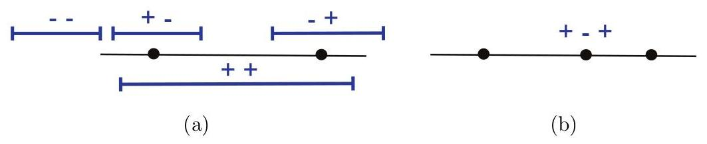{width="80%"}
:::

Figure 3.1

VC-dimension of intervals on the real line. (a) Any two points can be
shattered. (b) No sample of three points can be shattered as the
$\left( {+,-, + }\right)$ labeling cannot be realized.

Growth function bounds can be also derived directly (without using
Rademacher complexity bounds first). The resulting bound is then the
following:

$$\mathbb{P}\left\lbrack {\left| {R\left( h\right) - {\widehat{R}}_{S}\left( h\right) }\right| > \epsilon }\right\rbrack \leq 4{\Pi }_{\mathcal{H}}\left( {2m}\right) \exp \left( {-\frac{m{\epsilon }^{2}}{8}}\right) , \tag{3.23}$$

which only differs from (3.22) by constants.

The computation of the growth function may not be always convenient
since, by definition, it requires computing
${\Pi }_{\mathcal{H}}\left( m\right)$ for all $m \geq 1$ . The next
section introduces an alternative measure of the complexity of a
hypothesis set $\mathcal{H}$ that is based instead on a single scalar,
which will turn out to be in fact deeply related to the behavior of the
growth function.

# 3.3 VC-dimension {#vc-dimension .unnumbered}

Here, we introduce the notion of VC-dimension (Vapnik-Chervonenkis
dimension). The VC-dimension is also a purely combinatorial notion but
it is often easier to compute than the growth function (or the
Rademacher Complexity). As we shall see, the VC-dimension is a key
quantity in learning and is directly related to the growth function.

To define the VC-dimension of a hypothesis set $\mathcal{H}$ , we first
introduce the concept of shattering. Recall from the previous section,
that given a hypothesis set $\mathcal{H}$ , a dichotomy of a set $S$ is
one of the possible ways of labeling the points of $S$ using a
hypothesis in $\mathcal{H}$ . A set $S$ of $m \geq 1$ points is said to
be shattered by a hypothesis set $\mathcal{H}$ when $\mathcal{H}$
realizes all possible dichotomies of $S$ , that is when
${\Pi }_{\mathcal{H}}\left( m\right) = {2}^{m}$ .

Definition 3.10 (VC-dimension) The VC-dimension of a hypothesis set
$\mathcal{H}$ is the size of the largest set that can be shattered by
$\mathcal{H}$ :

$$\operatorname{VCdim}\left( \mathcal{H}\right) = \max \left\{ {m : {\Pi }_{\mathcal{H}}\left( m\right) = {2}^{m}}\right\} . \tag{3.24}$$

Note that, by definition, if
$\operatorname{VCdim}\left( \mathcal{H}\right) = d$ , there exists a set
of size $d$ that can be shattered. However, this does not imply that all
sets of size $d$ or less are shattered and, in fact, this is typically
not the case.

::: center
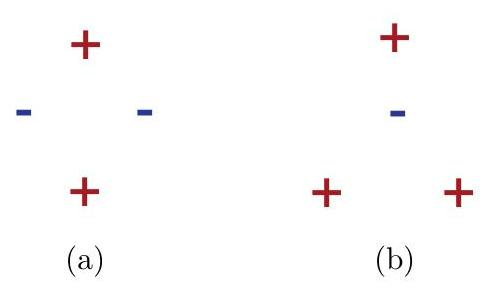{width="40%"}
:::

Figure 3.2

Unrealizable dichotomies for four points using hyperplanes in
${\mathbb{R}}^{2}$ . (a) All four points lie on the convex hull. (b)
Three points lie on the convex hull while the remaining point is
interior.

To further illustrate this notion, we will examine a series of examples
of hypothesis sets and will determine the VC-dimension in each case. To
compute the VC-dimension we will typically show a lower bound for its
value and then a matching upper bound. To give a lower bound $d$ for
$\operatorname{VCdim}\left( \mathcal{H}\right)$ , it suffices to show
that a set $S$ of cardinality $d$ can be shattered by $\mathcal{H}$ . To
give an upper bound, we need to prove that no set $S$ of cardinality
$d + 1$ can be shattered by $\mathcal{H}$ , which is typically more
difficult.

Example 3.11 (Intervals on the real line) Our first example involves the
hypothesis class of intervals on the real line. It is clear that the
VC-dimension is at least two, since all four dichotomies
$\left( {+, + }\right) ,\left( {-, - }\right) ,\left( {+, - }\right) ,\left( {-, + }\right)$
can be realized, as illustrated in figure 3.1(a). In contrast, by the
definition of intervals, no set of three points can be shattered since
the $\left( {+,-, + }\right)$ labeling cannot be realized. Hence,
$\operatorname{VCdim}\left( {\text{intervals in}\mathbb{R}}\right) = 2$
.

Example 3.12 (Hyperplanes) Consider the set of hyperplanes in
${\mathbb{R}}^{2}$ . We first observe that any three non-collinear
points in ${\mathbb{R}}^{2}$ can be shattered. To obtain the first three
dichotomies, we choose a hyperplane that has two points on one side and
the third point on the opposite side. To obtain the fourth dichotomy we
have all three points on the same side of the hyperplane. The remaining
four dichotomies are realized by simply switching signs. Next, we show
that four points cannot be shattered by considering two cases: (i) the
four points lie on the convex hull defined by the four points, and (ii)
three of the four points lie on the convex hull and the remaining point
is internal. In the first case, a positive labeling for one diagonal
pair and a negative labeling for the other diagonal pair cannot be
realized, as illustrated in figure 3.2(a). In the second case, a
labeling which is positive for the points on the convex hull and
negative for the interior point cannot be realized, as illustrated in
figure 3.2(b). Hence, VCdim(hyperplanes in ${\mathbb{R}}^{2}$ ) $= 3$ .

More generally in ${\mathbb{R}}^{d}$ , we derive a lower bound by
starting with a set of $d + 1$ points in ${\mathbb{R}}^{d}$ , setting
${\mathbf{x}}_{0}$ to be the origin and defining ${\mathbf{x}}_{i}$ ,
for $i \in \{ 1,\ldots ,d\}$ , as the point whose $i$ th coordinate is 1
and all others are 0 . Let
${y}_{0},{y}_{1},\ldots ,{y}_{d} \in \{ - 1, + 1\}$ be an arbitrary set
of labels for
${\mathbf{x}}_{0},{\mathbf{x}}_{1},\ldots ,{\mathbf{x}}_{d}$ . Let
$\mathbf{w}$ be the vector whose $i$ th coordinate is ${y}_{i}$ . Then
the classifier defined by the hyperplane of equation
$\mathbf{w} \cdot \mathbf{x} + \frac{{y}_{0}}{2} = 0$ shatters
${\mathbf{x}}_{0},{\mathbf{x}}_{1},\ldots ,{\mathbf{x}}_{d}$ since for
any $i \in \{ 0,\ldots ,d\}$ ,

$$\operatorname{sgn}\left( {\mathbf{w} \cdot {\mathbf{x}}_{i} + \frac{{y}_{0}}{2}}\right) = \operatorname{sgn}\left( {{y}_{i} + \frac{{y}_{0}}{2}}\right) = {y}_{i}. \tag{3.25}$$

To obtain an upper bound, it suffices to show that no set of $d + 2$
points can be shattered by halfspaces. To prove this, we will use the
following general theorem.

Theorem 3.13 (Radon's theorem) Any set $x$ of $d + 2$ points in
${\mathbb{R}}^{d}$ can be partitioned into two subsets ${X}_{1}$ and
${X}_{2}$ such that the convex hulls of ${X}_{1}$ and ${X}_{2}$
intersect.

Proof: Let
$\mathfrak{X} = \left\{ {{\mathbf{x}}_{1},\ldots ,{\mathbf{x}}_{d + 2}}\right\} \subset {\mathbb{R}}^{d}$
. The following is a system of $d + 1$ linear equations in
${\alpha }_{1},\ldots ,{\alpha }_{d + 2}$ :

$$\mathop{\sum }\limits_{{i = 1}}^{{d + 2}}{\alpha }_{i}{\mathbf{x}}_{i} = 0\;\text{ and }\;\mathop{\sum }\limits_{{i = 1}}^{{d + 2}}{\alpha }_{i} = 0, \tag{3.26}$$

since the first equality leads to $d$ equations, one for each component.
The number of unknowns, $d + 2$ , is larger than the number of
equations, $d + 1$ , therefore the system admits a non-zero solution
${\beta }_{1},\ldots ,{\beta }_{d + 2}$ . Since
$\mathop{\sum }\limits_{{i = 1}}^{{d + 2}}{\beta }_{i} = 0$ , both
${\mathcal{J}}_{1} =$
$\left\{ {i \in \left\lbrack {d + 2}\right\rbrack : {\beta }_{i} > 0}\right\}$
and
${\mathcal{I}}_{2} = \left\{ {i \in \left\lbrack {d + 2}\right\rbrack : {\beta }_{i} \leq 0}\right\}$
are non-empty sets and
${\mathcal{X}}_{1} = \left\{ {{\mathbf{x}}_{i} : i \in {\mathcal{J}}_{1}}\right\}$
and
${\mathcal{X}}_{2} = \left\{ {{\mathbf{x}}_{i} : i \in {\mathcal{J}}_{2}}\right\}$
form a partition of $\mathcal{X}$ . By the last equation of (3.26),
$\mathop{\sum }\limits_{{i \in {\mathcal{J}}_{1}}}{\beta }_{i} = - \mathop{\sum }\limits_{{i \in {\mathcal{J}}_{2}}}{\beta }_{i}$
. Let
$\beta = \mathop{\sum }\limits_{{i \in {\mathcal{J}}_{1}}}{\beta }_{i}$
. Then, the first part

of (3.26) implies

$$\mathop{\sum }\limits_{{i \in {\mathcal{J}}_{1}}}\frac{{\beta }_{i}}{\beta }{\mathbf{x}}_{i} = \mathop{\sum }\limits_{{i \in {\mathcal{J}}_{2}}}\frac{-{\beta }_{i}}{\beta }{\mathbf{x}}_{i}$$

with
$\mathop{\sum }\limits_{{i \in {\mathcal{J}}_{1}}}\frac{{\beta }_{i}}{\beta } = \mathop{\sum }\limits_{{i \in {\mathcal{J}}_{2}}}\frac{-{\beta }_{i}}{\beta } = 1$
, and $\frac{{\beta }_{i}}{\beta } \geq 0$ for $i \in {\mathcal{J}}_{1}$
and $\frac{-{\beta }_{i}}{\beta } \geq 0$ for $i \in {\mathcal{J}}_{2}$
. By definition of the convex hulls (B.6), this implies that
$\mathop{\sum }\limits_{{i \in {\mathcal{J}}_{1}}}\frac{{\beta }_{i}}{\beta }{\mathbf{x}}_{i}$
belongs both to the convex hull of ${X}_{1}$ and to that of ${X}_{2}$ .

Now, let $x$ be a set of $d + 2$ points. By Radon's theorem, it can be
partitioned into two sets ${x}_{1}$ and ${x}_{2}$ such that their convex
hulls intersect. Observe that when two sets of points ${x}_{1}$ and
${x}_{2}$ are separated by a hyperplane, their convex hulls are also
separated by that hyperplane. Thus, ${X}_{1}$ and ${X}_{2}$ cannot be
separated by a hyperplane and $x$ is not shattered. Combining our lower
and upper bounds, we have proven that
$\operatorname{VCdim}\left( \right.$ hyperplanes in ${\mathbb{R}}^{d}$ )
$= d + 1$ .

Example 3.14 (Axis-aligned Rectangles) We first show that the
VC-dimension is at least four, by considering four points in a diamond
pattern. Then, it is clear that all 16 dichotomies can be realized, some
of which are illustrated in figure 3.3(a). In contrast, for any set of
five distinct points, if we construct the minimal axis-aligned rectangle
containing these points, one of the five points is in the interior of

::: center
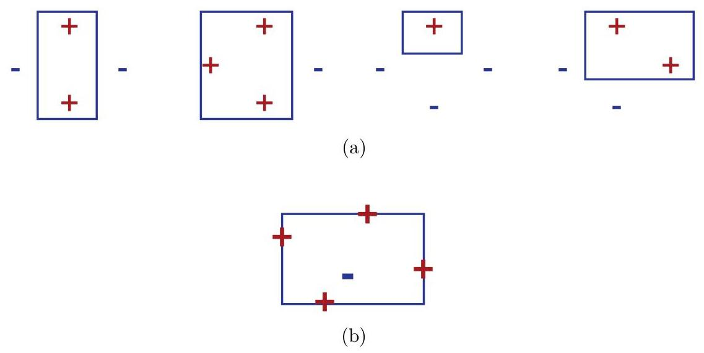{width="90%"}
:::

Figure 3.3

VC-dimension of axis-aligned rectangles. (a) Examples of realizable
dichotomies for four points in a diamond pattern. (b) No sample of five
points can be realized if the interior point and the remaining points
have opposite labels.

this rectangle. Imagine that we assign a negative label to this interior
point and a positive label to each of the remaining four points, as
illustrated in figure 3.3(b). There is no axis-aligned rectangle that
can realize this labeling. Hence, no set of five distinct points can be
shattered and
$\operatorname{VCdim}\left( \text{axis-aligned rectangles}\right) = 4$ .

Example 3.15 (Convex Polygons) We focus on the class of convex $d$ -gons
in the plane. To get a lower bound, we show that any set of ${2d} + 1$
points can be shattered. To do this, we select ${2d} + 1$ points that
lie on a circle, and for a particular labeling, if there are more
negative than positive labels, then the points with the positive labels
are used as the polygon's vertices, as in figure 3.4(a). Otherwise, the
tangents of the negative points serve as the edges of the polygon, as
shown in (3.4)(b). To derive an upper bound, it can be shown that
choosing points on the circle maximizes the number of possible
dichotomies, and thus
$\operatorname{VCdim}\left( {\text{convex}d\text{-gons}}\right) = {2d} + 1$
. Note also that
$\operatorname{VCdim}\left( \text{convex polygons}\right) = + \infty$ .

Example 3.16 (Sine Functions) The previous examples could suggest that
the VC-dimension of $\mathcal{H}$ coincides with the number of free
parameters defining $\mathcal{H}$ . For example, the number of
parameters defining hyperplanes matches their VC-dimension. However,
this does not hold in general. Several of the exercises in this chapter
illustrate this fact. The following provides a striking example from
this point of view. Consider the following family of sine functions:
$\{ t \mapsto \sin \left( {\omega t}\right) : \omega \in \mathbb{R}\}$ .
One instance of this function class is shown in figure 3.5. These sine
functions can be used to classify the points on the real line: a point
is labeled positively if it is above the curve, negatively otherwise.
Although this family of sine functions is defined via a single
parameter, $\omega$ , it can be shown that
$\operatorname{VCdim}\left( \text{sine functions}\right) = + \infty$
(exercise 3.20).

::: center
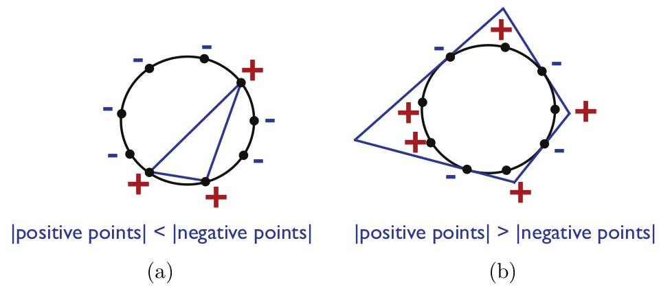{width="80%"}
:::

Figure 3.4

Convex $d$ -gons in the plane can shatter ${2d} + 1$ points. (a) $d$
-gon construction when there are more negative labels. (b) $d$ -gon
construction when there are more positive labels.

::: center
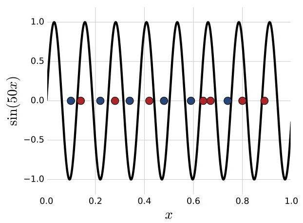{width="50%"}
:::

Figure 3.5

An example of a sine function (with $\omega = {50}$ ) used for
classification.

The VC-dimension of many other hypothesis sets can be determined or
upper-bounded in a similar way (see this chapter's exercises). In
particular, the VC-dimension of any vector space of dimension
$r < \infty$ can be shown to be at most $r$ (exercise 3.19). The next
result, known as Sauer's lemma, clarifies the connection between the
notions of growth function and VC-dimension.

::: center
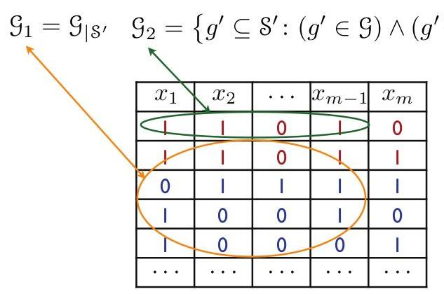{width="50%"}
:::

Figure 3.6

Illustration of how ${\mathcal{G}}_{1}$ and ${\mathcal{G}}_{2}$ are
constructed in the proof of Sauer's lemma.

Theorem 3.17 (Sauer's lemma) Let $\mathcal{H}$ be a hypothesis set with
$\operatorname{VCdim}\left( \mathcal{H}\right) = d$ . Then, for all
$m \in \mathbb{N}$ , the following inequality holds:

$${\Pi }_{\mathcal{H}}\left( m\right) \leq \mathop{\sum }\limits_{{i = 0}}^{d}\left( \begin{matrix} m \\ i \end{matrix}\right) \tag{3.27}$$

Proof: The proof is by induction on $m + d$ . The statement clearly
holds for $m = 1$ and $d = 0$ or $d = 1$ . Now, assume that it holds for
$\left( {m - 1,d - 1}\right)$ and $\left( {m - 1,d}\right)$ . Fix a set
$\mathcal{S} = \left\{ {{x}_{1},\ldots ,{x}_{m}}\right\}$ with
${\Pi }_{\mathcal{H}}\left( m\right)$ dichotomies and let
$\mathcal{G} = {\mathcal{H}}_{\mid \mathcal{S}}$ be the set of concepts
$\mathcal{H}$ induced by restriction to $\mathcal{S}$ .

Now consider the following families over
${\mathcal{S}}^{\prime } = \left\{ {{x}_{1},\ldots ,{x}_{m - 1}}\right\}$
. We define
${\mathcal{G}}_{1} = {\mathcal{G}}_{\mid {\mathcal{S}}^{\prime }}$ as
the set of concepts $\mathcal{H}$ induced by restriction to
${S}^{\prime }$ . Next, by identifying each concept as the set of points
(in ${\mathrm{S}}^{\prime }$ or $\mathrm{S}$ ) for which it is non-zero,
we can define 2 as

$${\mathcal{G}}_{2} = \left\{ {{g}^{\prime } \subseteq {\mathcal{S}}^{\prime } : \left( {{g}^{\prime } \in \mathcal{G}}\right) \land \left( {{g}^{\prime } \cup \left\{ {x}_{m}\right\} \in \mathcal{G}}\right) }\right\} .$$

Since
${g}^{\prime } \subseteq {\mathcal{S}}^{\prime },{g}^{\prime } \in \mathcal{G}$
means that without adding ${x}_{m}$ it is a concept of $\mathcal{G}$ .
Further, the constraint
${g}^{\prime } \cup \left\{ {x}_{m}\right\} \in \mathcal{G}$ means that
adding ${x}_{m}$ to ${g}^{\prime }$ also makes it a concept of
$\mathcal{G}$ . The construction of ${\mathcal{G}}_{1}$ and
${\mathcal{G}}_{2}$ is illustrated pictorially in figure 3.6. Given our
definitions of ${\mathcal{G}}_{1}$ and ${\mathcal{G}}_{2}$ , observe
that
$\left| {\mathcal{G}}_{1}\right| + \left| {\mathcal{G}}_{2}\right| = \left| \mathcal{G}\right|$
.

Since
$\operatorname{VCdim}\left( {\mathcal{G}}_{1}\right) \leq \operatorname{VCdim}\left( \mathcal{G}\right) \leq d$
, then by definition of the growth function and using the induction
hypothesis,

$$\left| {\mathcal{G}}_{1}\right| \leq {\Pi }_{{\mathcal{G}}_{1}}\left( {m - 1}\right) \leq \mathop{\sum }\limits_{{i = 0}}^{d}\left( \begin{matrix} m - 1 \\ i \end{matrix}\right) .$$

Further, by definition of ${\mathcal{G}}_{2}$ , if a set
$z \subseteq {\mathcal{S}}^{\prime }$ is shattered by
${\mathcal{G}}_{2}$ , then the set $z \cup \left\{ {x}_{m}\right\}$ is
shattered by $\mathcal{G}$ . Hence,

$$\operatorname{VCdim}\left( {\mathcal{G}}_{2}\right) \leq \operatorname{VCdim}\left( \mathcal{G}\right) - 1 = d - 1,$$

and by definition of the growth function and using the induction
hypothesis,

$$\left| {\mathcal{G}}_{2}\right| \leq {\Pi }_{{\mathcal{G}}_{2}}\left( {m - 1}\right) \leq \mathop{\sum }\limits_{{i = 0}}^{{d - 1}}\left( \begin{matrix} m - 1 \\ i \end{matrix}\right) .$$

Thus,

$$\left| \mathcal{G}\right| = \left| {\mathcal{G}}_{1}\right| + \left| {\mathcal{G}}_{2}\right| \leq \mathop{\sum }\limits_{{i = 0}}^{d}\left( \begin{matrix} m - 1 \\ i \end{matrix}\right) + \mathop{\sum }\limits_{{i = 0}}^{{d - 1}}\left( \begin{matrix} m - 1 \\ i \end{matrix}\right) = \mathop{\sum }\limits_{{i = 0}}^{d}\left( \begin{matrix} m - 1 \\ i \end{matrix}\right) + \left( \begin{matrix} m - 1 \\ i - 1 \end{matrix}\right) = \mathop{\sum }\limits_{{i = 0}}^{d}\left( \begin{matrix} m \\ i \end{matrix}\right) ,$$

which completes the inductive proof.

The significance of Sauer's lemma can be seen by corollary 3.18, which
remarkably shows that growth function only exhibits two types of
behavior: either $\operatorname{VCdim}\left( \mathcal{H}\right) =$
$d < + \infty$ , in which case
${\Pi }_{\mathcal{H}}\left( m\right) = O\left( {m}^{d}\right)$ , or
$\operatorname{VCdim}\left( \mathcal{H}\right) = + \infty$ , in which
case ${\Pi }_{\mathcal{H}}\left( m\right) = {2}^{m}.$

Corollary 3.18 Let $\mathcal{H}$ be a hypothesis set with
$\operatorname{VCdim}\left( \mathcal{H}\right) = d$ . Then for all
$m \geq d$ ,

$${\Pi }_{\mathcal{H}}\left( m\right) \leq {\left( \frac{em}{d}\right) }^{d} = O\left( {m}^{d}\right) . \tag{3.28}$$

Proof: The proof begins by using Sauer's lemma. The first inequality
multiplies each summand by a factor that is greater than or equal to one
since $m \geq d$ , while the second inequality adds non-negative
summands to the summation.

$${\Pi }_{\mathcal{H}}\left( m\right) \leq \mathop{\sum }\limits_{{i = 0}}^{d}\left( \begin{matrix} m \\ i \end{matrix}\right)$$

$$\leq \mathop{\sum }\limits_{{i = 0}}^{d}\left( \begin{matrix} m \\ i \end{matrix}\right) {\left( \frac{m}{d}\right) }^{d - i}$$

$$\leq \mathop{\sum }\limits_{{i = 0}}^{m}\left( \begin{matrix} m \\ i \end{matrix}\right) {\left( \frac{m}{d}\right) }^{d - i}$$

$$= {\left( \frac{m}{d}\right) }^{d}\mathop{\sum }\limits_{{i = 0}}^{m}\left( \begin{matrix} m \\ i \end{matrix}\right) {\left( \frac{d}{m}\right) }^{i}$$

$$= {\left( \frac{m}{d}\right) }^{d}{\left( 1 + \frac{d}{m}\right) }^{m} \leq {\left( \frac{m}{d}\right) }^{d}{e}^{d}.$$

After simplifying the expression using the binomial theorem, the final
inequality follows using the general inequality
$\left( {1 - x}\right) \leq {e}^{-x}$ .

The explicit relationship just formulated between VC-dimension and the
growth function combined with corollary 3.9 leads immediately to the
following generalization bounds based on the VC-dimension.

Corollary 3.19 (VC-dimension generalization bounds) Let $\mathcal{H}$ be
a family of functions taking values in $\{ - 1, + 1\}$ with VC-dimension
d. Then, for any $\delta > 0$ , with proba-

bility at least $1 - \delta$ , the following holds for all
$h \in \mathcal{H}$ :

$$R\left( h\right) \leq {\widehat{R}}_{S}\left( h\right) + \sqrt{\frac{{2d}\log \frac{em}{d}}{m}} + \sqrt{\frac{\log \frac{1}{\delta }}{2m}}. \tag{3.29}$$

Thus, the form of this generalization bound is

$$R\left( h\right) \leq {\widehat{R}}_{S}\left( h\right) + O\left( \sqrt{\frac{\log \left( {m/d}\right) }{\left( m/d\right) }}\right) , \tag{3.30}$$

which emphasizes the importance of the ratio $m/d$ for generalization.
The theorem provides another instance of Occam's razor principle where
simplicity is measured in terms of smaller VC-dimension.

VC-dimension bounds can be derived directly without using an
intermediate Rademacher complexity bound, as for (3.23): combining
Sauer's lemma with (3.23) leads to the following high-probability bound

$$R\left( h\right) \leq {\widehat{R}}_{S}\left( h\right) + \sqrt{\frac{{8d}\log \frac{2em}{d} + 8\log \frac{4}{\delta }}{m}},$$

which has the general form of (3.30). The log factor plays only a minor
role in these bounds. A finer analysis can be used in fact to eliminate
that factor.

# 3.4 Lower bounds {#lower-bounds .unnumbered}

In the previous section, we presented several upper bounds on the
generalization error. In contrast, this section provides lower bounds on
the generalization error of any learning algorithm in terms of the
VC-dimension of the hypothesis set used.

These lower bounds are shown by finding for any algorithm a 'bad'
distribution. Since the learning algorithm is arbitrary, it will be
difficult to specify that particular distribution. Instead, it suffices
to prove its existence non-constructively. At a high level, the proof
technique used to achieve this is the probabilistic method of Paul
Erdös. In the context of the following proofs, first a lower bound is
given on the expected error over the parameters defining the
distributions. From that, the lower bound is shown to hold for at least
one set of parameters, that is one distribution.

Theorem 3.20 (Lower bound, realizable case)
${Let}\mathcal{H}{be}a{hypothesis}{set}{with}{VC}$ - dimension $d > 1$ .
Then, for any $m \geq 1$ and any learning algorithm $\mathcal{A}$ ,
there exist a distribution $\mathcal{D}$ over $X$ and a target function
$f \in \mathcal{H}$ such that

$$\underset{S \sim {\mathcal{D}}^{m}}{\mathbb{P}}\left\lbrack {{R}_{\mathcal{D}}\left( {{h}_{S},f}\right) > \frac{d - 1}{32m}}\right\rbrack \geq 1/{100}. \tag{3.31}$$

Proof: Let
$\overline{\mathcal{X}} = \left\{ {{x}_{0},{x}_{1},\ldots ,{x}_{d - 1}}\right\} \subseteq \mathcal{X}$
be a set that is shattered by $\mathcal{H}$ . For any $\epsilon > 0$ ,
we choose $\mathcal{D}$ such that its support is reduced to
$\overline{\mathcal{X}}$ and so that one point $\left( {x}_{0}\right)$

has very high probability $\left( {1 - {8\epsilon }}\right)$ , with the
rest of the probability mass distributed uniformly among the other
points:

$$\underset{\mathcal{D}}{\mathbb{P}}\left\lbrack {x}_{0}\right\rbrack = 1 - {8\epsilon }\;\text{ and }\;\forall i \in \left\lbrack {d - 1}\right\rbrack ,\underset{\mathcal{D}}{\mathbb{P}}\left\lbrack {x}_{i}\right\rbrack = \frac{8\epsilon }{d - 1}. \tag{3.32}$$

With this definition, most samples would contain ${x}_{0}$ and, since
$x$ is shattered, $\mathcal{A}$ can essentially do no better than
tossing a coin when determining the label of a point ${x}_{i}$ not
falling in the training set.

We assume without loss of generality that $\mathcal{A}$ makes no error
on ${x}_{0}$ . For a sample $S$ , we let $\bar{S}$ denote the set of its
elements falling in $\left\{ {{x}_{1},\ldots ,{x}_{d - 1}}\right\}$ ,
and let $\mathcal{S}$ be the set of samples $S$ of size $m$ such that
$\left| \bar{S}\right| \leq \left( {d - 1}\right) /2$ . Now, fix a
sample $S \in S$ , and consider the uniform distribution $\mathcal{U}$
over all labelings $f : \overline{\mathcal{X}} \rightarrow \{ 0,1\}$ ,
which are all in $\mathcal{H}$ since the set is shattered. Then, the
following lower bound holds:

$$\underset{f \sim \mathcal{U}}{\mathbb{E}}\left\lbrack {{R}_{\mathcal{D}}\left( {{h}_{S},f}\right) }\right\rbrack = \mathop{\sum }\limits_{f}\mathop{\sum }\limits_{{x \in \overline{\mathcal{X}}}}{1}_{{h}_{S}\left( x\right) \neq f\left( x\right) }\mathbb{P}\left\lbrack x\right\rbrack \mathbb{P}\left\lbrack f\right\rbrack$$

$$\geq \mathop{\sum }\limits_{f}\mathop{\sum }\limits_{{x \notin \bar{S}}}{1}_{{h}_{S}\left( x\right) \neq f\left( x\right) }\mathbb{P}\left\lbrack x\right\rbrack \mathbb{P}\left\lbrack f\right\rbrack$$

$$= \mathop{\sum }\limits_{{x \notin \bar{S}}}\left( {\mathop{\sum }\limits_{f}{1}_{{h}_{S}\left( x\right) \neq f\left( x\right) }\mathbb{P}\left\lbrack f\right\rbrack }\right) \mathbb{P}\left\lbrack x\right\rbrack$$

$$= \frac{1}{2}\mathop{\sum }\limits_{{x \notin \bar{S}}}\mathbb{P}\left\lbrack x\right\rbrack \geq \frac{1}{2}\frac{d - 1}{2}\frac{8\epsilon }{d - 1} = {2\epsilon } \tag{3.33}$$

The first lower bound holds because we remove non-negative terms from
the summation when we only consider $x \notin \bar{S}$ instead of all
$x$ in $\overline{\mathcal{X}}$ . After rearranging terms, the
subsequent equality holds since we are taking an expectation over
$f \in \mathcal{H}$ with uniform weight on each $f$ and $\mathcal{H}$
shatters $\overline{\mathcal{X}}$ . The final lower bound holds due to
the definitions of $\mathcal{D}$ and $\bar{S}$ , the latter which
implies that
$\left| {\overline{\mathcal{X}} - \bar{S}}\right| \geq \left( {d - 1}\right) /2$
.

Since (3.33) holds for all $S \in \mathcal{S}$ , it also holds in
expectation over all $S \in \mathcal{S}$ :
${\mathbb{E}}_{S \in \mathcal{S}}\left\lbrack {{\mathbb{E}}_{f \sim \mathcal{U}}\left\lbrack {{R}_{\mathcal{D}}\left( {{h}_{S},f}\right) }\right\rbrack }\right\rbrack \geq {2\epsilon }$
. By Fubini's theorem, the expectations can be per-

muted, thus,

$$\underset{f \sim \mathcal{U}}{\mathbb{E}}\left\lbrack {\underset{S \in \mathcal{S}}{\mathbb{E}}\left\lbrack {{R}_{\mathcal{D}}\left( {{h}_{S},f}\right) }\right\rbrack }\right\rbrack \geq {2\epsilon } \tag{3.34}$$

This implies that
${\mathbb{E}}_{S \in \mathcal{S}}\left\lbrack {{R}_{\mathcal{D}}\left( {{h}_{S},{f}_{0}}\right) }\right\rbrack \geq {2\epsilon }$
for at least one labeling ${f}_{0} \in \mathcal{H}$ . Decomposing this
expectation into two parts and using
${R}_{\mathcal{D}}\left( {{h}_{S},{f}_{0}}\right) \leq {\mathbb{P}}_{\mathcal{D}}\left\lbrack {\overline{\mathcal{X}} - \left\{ {x}_{0}\right\} }\right\rbrack$
, we obtain:

$$\begin{matrix} \underset{S \in \mathcal{S}}{\mathbb{E}}\left\lbrack {{R}_{\mathcal{D}}\left( {{h}_{S},{f}_{0}}\right) }\right\rbrack = \mathop{\sum }\limits_{{S : {R}_{\mathcal{D}}\left( {{h}_{S},{f}_{0}}\right) }}\mathbb{P}\left\lbrack {{R}_{\mathcal{D}}\left( {{h}_{S},{f}_{0}}\right) }\right\rbrack + \mathop{\sum }\limits_{{S : {R}_{\mathcal{D}}\left( {{h}_{S},{f}_{0}}\right) }}\mathbb{P}\left\lbrack {{R}_{\mathcal{D}}\left( {{h}_{S},{f}_{0}}\right) }\right\rbrack \\ S : {R}_{\mathcal{D}}\left( {{h}_{S},{f}_{0}}\right) < \epsilon \end{matrix}$$

$$\leq \underset{\mathcal{D}}{\mathbb{P}}\left\lbrack {\overline{\mathcal{X}} - \left\{ {x}_{0}\right\} }\right\rbrack \underset{S \in \mathcal{S}}{\mathbb{P}}\left\lbrack {{R}_{\mathcal{D}}\left( {{h}_{S},{f}_{0}}\right) \geq \epsilon }\right\rbrack + \epsilon \underset{S \in \mathcal{S}}{\mathbb{P}}\left\lbrack {{R}_{\mathcal{D}}\left( {{h}_{S},{f}_{0}}\right) < \epsilon }\right\rbrack$$

$$\leq {8\epsilon }\underset{S \in \mathcal{S}}{\mathbb{P}}\left\lbrack {{R}_{\mathcal{D}}\left( {{h}_{S},{f}_{0}}\right) \geq \epsilon }\right\rbrack + \epsilon \left( {1 - \underset{S \in \mathcal{S}}{\mathbb{P}}\left\lbrack {{R}_{\mathcal{D}}\left( {{h}_{S},{f}_{0}}\right) \geq \epsilon }\right\rbrack }\right) .$$

Collecting terms in
${\mathbb{P}}_{S \in \mathcal{S}}\left\lbrack {{R}_{\mathcal{D}}\left( {{h}_{S},{f}_{0}}\right) \geq \epsilon }\right\rbrack$
yields

$$\underset{S \in \mathcal{S}}{\mathbb{P}}\left\lbrack {{R}_{\mathcal{D}}\left( {{h}_{S},{f}_{0}}\right) \geq \epsilon }\right\rbrack \geq \frac{1}{7\epsilon }\left( {{2\epsilon } - \epsilon }\right) = \frac{1}{7}. \tag{3.35}$$

Thus, the probability over all samples $S$ (not necessarily in
$\mathcal{S}$ ) can be lower bounded as

$$\underset{S}{\mathbb{P}}\left\lbrack {{R}_{\mathcal{D}}\left( {{h}_{S},{f}_{0}}\right) \geq \epsilon }\right\rbrack \geq \underset{S \in \mathcal{S}}{\mathbb{P}}\left\lbrack {{R}_{\mathcal{D}}\left( {{h}_{S},{f}_{0}}\right) \geq \epsilon }\right\rbrack \mathbb{P}\left\lbrack \mathcal{S}\right\rbrack \geq \frac{1}{7}\mathbb{P}\left\lbrack \mathcal{S}\right\rbrack . \tag{3.36}$$

This leads us to find a lower bound for
$\mathbb{P}\left\lbrack \mathcal{S}\right\rbrack$ . By the
multiplicative Chernoff bound (Theorem D.4), for any $\gamma > 0$ , the
probability that more than $\left( {d - 1}\right) /2$ points are drawn
in a sample of size $m$ verifies:

$$1 - \mathbb{P}\left\lbrack \mathcal{S}\right\rbrack = \mathbb{P}\left\lbrack {{S}_{m} \geq {8\epsilon m}\left( {1 + \gamma }\right) }\right\rbrack \leq {e}^{-{8\epsilon m}\frac{{\gamma }^{2}}{3}}. \tag{3.37}$$

Therefore, for $\epsilon = \left( {d - 1}\right) /\left( {32m}\right)$
and $\gamma = 1$ ,

$$\mathbb{P}\left\lbrack {{S}_{m} \geq \frac{d - 1}{2}}\right\rbrack \leq {e}^{-\left( {d - 1}\right) /{12}} \leq {e}^{-1/{12}} \leq 1 - {7\delta }, \tag{3.38}$$

for $\delta \leq {.01}$ . Thus
$\mathbb{P}\left\lbrack \mathcal{S}\right\rbrack \geq {7\delta }$ and
${\mathbb{P}}_{S}\left\lbrack {{R}_{\mathcal{D}}\left( {{h}_{S},{f}_{0}}\right) \geq \epsilon }\right\rbrack \geq \delta$
.

The theorem shows that for any algorithm $\mathcal{A}$ , there exists a
'bad' distribution over $\mathcal{X}$ and a target function $f$ for
which the error of the hypothesis returned by $\mathcal{A}$ is a
constant times $\frac{d}{m}$ with some constant probability. This
further demonstrates the key role played by the VC-dimension in
learning. The result implies in particular that PAC-learning in the
realizable case is not possible when the VC-dimension is infinite.

Note that the proof shows a stronger result than the statement of the
theorem: the distribution $\mathcal{D}$ is selected independently of the
algorithm $\mathcal{A}$ . We now present a theorem giving a lower bound
in the non-realizable case. The following two lemmas will be needed for
the proof.

Lemma 3.21 Let $\alpha$ be a uniformly distributed random variable
taking values in $\left\{ {{\alpha }_{ - },{\alpha }_{ + }}\right\}$ ,
where ${\alpha }_{ - } = \frac{1}{2} - \frac{\epsilon }{2}$ and
${\alpha }_{ + } = \frac{1}{2} + \frac{\epsilon }{2}$ , and let $S$ be a
sample of $m \geq 1$ random variables ${X}_{1},\ldots ,{X}_{m}$ taking
values in $\{ 0,1\}$ and drawn i.i.d. according to the distribution
${\mathcal{D}}_{\alpha }$ defined by
${\mathbb{P}}_{{\mathcal{D}}_{\alpha }}\left\lbrack {X = 1}\right\rbrack = \alpha$
. Let $h$ be a function from ${X}^{m}$ to
$\left\{ {{\alpha }_{ - },{\alpha }_{ + }}\right\}$ , then the following
holds:

$$\underset{\alpha }{\mathbb{E}}\left\lbrack {\underset{S \sim {\mathcal{D}}_{\alpha }^{m}}{\mathbb{P}}\left\lbrack {h\left( S\right) \neq \alpha }\right\rbrack }\right\rbrack \geq \Phi \left( {2\lceil m/2\rceil ,\epsilon }\right) , \tag{3.39}$$

where
$\Phi \left( {m,\epsilon }\right) = \frac{1}{4}\left( {1 - \sqrt{1 - \exp \left( {-\frac{m{\epsilon }^{2}}{1 - {\epsilon }^{2}}}\right) }}\right)$
for all $m$ and $\epsilon$ .

Proof: The lemma can be interpreted in terms of an experiment with two
coins with biases ${\alpha }_{ - }$ and ${\alpha }_{ + }$ . It implies
that for a discriminant rule $h\left( S\right)$ based on a sample $S$
drawn from ${\mathcal{D}}_{{\alpha }_{ - }}$ or
${\mathcal{D}}_{{\alpha }_{ + }}$ , to determine which coin was tossed,
the sample size $m$ must be at least
$\Omega \left( {1/{\epsilon }^{2}}\right)$ . The proof is left as an
exercise (exercise D.3).

We will make use of the fact that for any fixed $\epsilon$ the function
$m \mapsto \Phi \left( {m,x}\right)$ is convex, which is not hard to
establish.

Lemma 3.22 Let $Z$ be a random variable taking values in
$\left\lbrack {0,1}\right\rbrack$ . Then, for any
$\gamma \in \lbrack 0,1)$ ,

$$\mathbb{P}\left\lbrack {z > \gamma }\right\rbrack \geq \frac{\mathbb{E}\left\lbrack Z\right\rbrack - \gamma }{1 - \gamma } > \mathbb{E}\left\lbrack Z\right\rbrack - \gamma \tag{3.40}$$

Proof: Since the values taken by $Z$ are in
$\left\lbrack {0,1}\right\rbrack$ ,

$$\mathbb{E}\left\lbrack Z\right\rbrack = \mathop{\sum }\limits_{{z \leq \gamma }}\mathbb{P}\left\lbrack {Z = z}\right\rbrack z + \mathop{\sum }\limits_{{z > \gamma }}\mathbb{P}\left\lbrack {Z = z}\right\rbrack z$$

$$\leq \mathop{\sum }\limits_{{z \leq \gamma }}\mathbb{P}\left\lbrack {Z = z}\right\rbrack \gamma + \mathop{\sum }\limits_{{z > \gamma }}\mathbb{P}\left\lbrack {Z = z}\right\rbrack$$

$$= \gamma \mathbb{P}\left\lbrack {Z \leq \gamma }\right\rbrack + \mathbb{P}\left\lbrack {Z > \gamma }\right\rbrack$$

$$= \gamma \left( {1 - \mathbb{P}\left\lbrack {Z > \gamma }\right\rbrack }\right) + \mathbb{P}\left\lbrack {Z > \gamma }\right\rbrack$$

$$= \left( {1 - \gamma }\right) \mathbb{P}\left\lbrack {Z > \gamma }\right\rbrack + \gamma$$

which concludes the proof.

Theorem 3.23 (Lower bound, non-realizable case)
${Let}\;\mathcal{H}\;{be}\;a\;{hypothesis}\;{set}\;{with}\;{VC}$ -
dimension $d > 1$ . Then, for any $m \geq 1$ and any learning algorithm
$\mathcal{A}$ , there exists a distribution $\mathcal{D}$ over
$\mathcal{X} \times \{ 0,1\}$ such that:

$$\underset{S \sim {\mathcal{D}}^{m}}{\mathbb{P}}\left\lbrack {{R}_{\mathcal{D}}\left( {h}_{S}\right) - \mathop{\inf }\limits_{{h \in \mathcal{H}}}{R}_{\mathcal{D}}\left( h\right) > \sqrt{\frac{d}{320m}}}\right\rbrack \geq 1/{64}. \tag{3.41}$$

Equivalently, for any learning algorithm, the sample complexity verifies

$$m \geq \frac{d}{{320}{\epsilon }^{2}}. \tag{3.42}$$

Proof: Let
$\bar{x} = \left\{ {{x}_{1},\ldots ,{x}_{d}}\right\} \subseteq x$ be a
set shattered by $\mathcal{H}$ . For any
$\alpha \in \left\lbrack {0,1}\right\rbrack$ and any vector
$\mathbf{\sigma } = {\left( {\sigma }_{1},\ldots ,{\sigma }_{d}\right) }^{\top } \in \{ - 1, + 1{\} }^{d}$
, we define a distribution ${\mathcal{D}}_{\mathbf{\sigma }}$ with
support $\bar{x} \times \{ 0,1\}$ as follows:

$$\forall i \in \left\lbrack d\right\rbrack ,\;\underset{{\mathcal{D}}_{\mathbf{\sigma }}}{\mathbb{P}}\left\lbrack \left( {{x}_{i},1}\right) \right\rbrack = \frac{1}{d}\left( {\frac{1}{2} + \frac{{\sigma }_{i}\alpha }{2}}\right) . \tag{3.43}$$

Thus, the label of each point
${x}_{i},i \in \left\lbrack d\right\rbrack$ , follows the distribution
${\mathbb{P}}_{{\mathcal{D}}_{\mathbf{\sigma }}}\left\lbrack {\cdot \mid {x}_{i}}\right\rbrack$
, that of a biased coin where the bias is determined by the sign of
${\sigma }_{i}$ and the magnitude of $\alpha$ . To determine the most
likely label of each point ${x}_{i}$ , the learning algorithm will
therefore need to estimate
${\mathbb{P}}_{{\mathcal{D}}_{\mathbf{\sigma }}}\left\lbrack {1 \mid {x}_{i}}\right\rbrack$
with an accuracy better than $\alpha$ . To make this further difficult,
$\alpha$ and $\mathbf{\sigma }$ will be selected based on the algorithm,
requiring, as in lemma ${3.21},\Omega \left( {1/{\alpha }^{2}}\right)$
instances of each point ${x}_{i}$ in the training sample.

Clearly, the Bayes classifier ${h}_{{\mathcal{D}}_{\sigma }}^{ * }$ is
defined by
${h}_{{\mathcal{D}}_{\sigma }}^{ * }\left( {x}_{i}\right) = {\operatorname{argmax}}_{y \in \{ 0,1\} }\mathbb{P}\left\lbrack {y \mid {x}_{i}}\right\rbrack =$
${1}_{{\sigma }_{i} > 0}$ for all
$i \in \left\lbrack d\right\rbrack .{h}_{{\mathcal{D}}_{\sigma }}^{ * }$
is in $\mathcal{H}$ since $\overline{\mathcal{X}}$ is shattered. For all
$h \in \mathcal{H}$ ,

$${R}_{{\mathcal{D}}_{\mathbf{\sigma }}}\left( h\right) - {R}_{{\mathcal{D}}_{\mathbf{\sigma }}}\left( {h}_{{\mathcal{D}}_{\mathbf{\sigma }}}^{ * }\right) = \frac{1}{d}\mathop{\sum }\limits_{{x \in \overline{\mathcal{X}}}}\left( {\frac{\alpha }{2} + \frac{\alpha }{2}}\right) {1}_{h\left( x\right) \neq {h}_{{\mathcal{D}}_{\mathbf{\sigma }}}^{ * }\left( x\right) } = \frac{\alpha }{d}\mathop{\sum }\limits_{{x \in \overline{\mathcal{X}}}}{1}_{h\left( x\right) \neq {h}_{{\mathcal{D}}_{\mathbf{\sigma }}}^{ * }\left( x\right) }. \tag{3.44}$$

Let ${h}_{S}$ denote the hypothesis returned by the learning algorithm
$\mathcal{A}$ after receiving a labeled sample $S$ drawn according to
${\mathcal{D}}_{\mathbf{\sigma }}$ . We will denote by
${\left| S\right| }_{x}$ the number of occurrences of a point $x$ in $S$
. Let $\mathcal{U}$ denote the uniform distribution over
$\{ - 1, + 1{\} }^{d}$ . Then, in view of (3.44), the following holds:

$$\underset{\begin{matrix} {\sigma \sim {\mathcal{U}}_{m}} \\ {S \sim {\mathcal{D}}_{\sigma }} \end{matrix}}{\mathbb{E}}\left\lbrack {\frac{1}{\alpha }\left\lbrack {{R}_{{\mathcal{D}}_{\sigma }}\left( {h}_{S}\right) - {R}_{{\mathcal{D}}_{\sigma }}\left( {h}_{{\mathcal{D}}_{\sigma }}^{ * }\right) }\right\rbrack }\right\rbrack$$

$$= \frac{1}{d}\mathop{\sum }\limits_{{x \in \overline{\mathcal{X}}}}\underset{\begin{matrix} {\sigma \sim {\mathcal{U}}_{m}} \\ {S \sim {\mathcal{D}}_{\sigma }^{m}} \end{matrix}}{\mathbb{E}}\left\lbrack {1}_{{h}_{S}\left( x\right) \neq {h}_{{\mathcal{D}}_{\sigma }}^{ * }\left( x\right) }\right\rbrack$$

$$= \frac{1}{d}\mathop{\sum }\limits_{{x \in \overline{\mathcal{X}}}}\underset{\sigma \sim \mathcal{U}}{\mathbb{E}}\left\lbrack {\underset{S \sim {\mathcal{D}}_{\sigma }^{m}}{\mathbb{P}}\left\lbrack {{h}_{S}\left( x\right) \neq {h}_{{\mathcal{D}}_{\sigma }}^{ * }\left( x\right) }\right\rbrack }\right\rbrack$$

$$= \frac{1}{d}\mathop{\sum }\limits_{{x \in \overline{\mathcal{X}}}}\mathop{\sum }\limits_{{n = 0}}^{m}\underset{\sigma \sim \mathcal{U}}{\mathbb{E}}\left\lbrack {\underset{S \sim {\mathcal{D}}_{\sigma }^{m}}{\mathbb{P}}\left\lbrack {{h}_{S}\left( x\right) \neq {h}_{{\mathcal{D}}_{\sigma }}^{ * }\left( x\right) \mid {\left| S\right| }_{x} = n}\right\rbrack \mathbb{P}\left\lbrack {{\left| S\right| }_{x} = n}\right\rbrack }\right\rbrack$$

$$\geq \frac{1}{d}\mathop{\sum }\limits_{{x \in \overline{\mathcal{X}}}}\mathop{\sum }\limits_{{n = 0}}^{m}\Phi \left( {n + 1,\alpha }\right) \mathbb{P}\left\lbrack {{\left| S\right| }_{x} = n}\right\rbrack \tag{lemma 3.21}$$

$$\geq \frac{1}{d}\mathop{\sum }\limits_{{x \in \overline{\mathcal{X}}}}\Phi \left( {m/d + 1,\alpha }\right) \;\left( \right. \text{convexity of}\Phi \left( {\cdot ,\alpha }\right) \text{and Jensen’s ineq.)}$$

$$= \Phi \left( {m/d + 1,\alpha }\right) \text{.}$$

Since the expectation over $\mathbf{\sigma }$ is lower-bounded by
$\Phi \left( {m/d + 1,\alpha }\right)$ , there must exist some
$\mathbf{\sigma } \in \{ - 1, + 1{\} }^{d}$ for which

$$\text{(3.38)} \tag{3.45}$$

Then, by lemma 3.22, for that $\mathbf{\sigma }$ , for any
$\gamma \in \left\lbrack {0,1}\right\rbrack$ ,

$$\underset{S \sim {\mathcal{D}}_{\sigma }^{m}}{\mathbb{P}}\left\lbrack {\frac{1}{\alpha }\left\lbrack {{R}_{{\mathcal{D}}_{\sigma }}\left( {h}_{S}\right) - {R}_{{\mathcal{D}}_{\sigma }}\left( {h}_{{\mathcal{D}}_{\sigma }}^{ * }\right) }\right\rbrack > {\gamma u}}\right\rbrack > \left( {1 - \gamma }\right) u, \tag{3.46}$$

where $u = \Phi \left( {m/d + 1,\alpha }\right)$ . Selecting $\delta$
and $\epsilon$ such that $\delta \leq \left( {1 - \gamma }\right) u$ and
$\epsilon \leq {\gamma \alpha u}$ gives

$$\underset{S \sim {\mathcal{D}}_{\sigma }^{m}}{\mathbb{P}}\left\lbrack {{R}_{{\mathcal{D}}_{\sigma }}\left( {h}_{S}\right) - {R}_{{\mathcal{D}}_{\sigma }}\left( {h}_{{\mathcal{D}}_{\sigma }}^{ * }\right) > \epsilon }\right\rbrack > \delta . \tag{3.47}$$

To satisfy the inequalities defining $\epsilon$ and $\delta$ , let
$\gamma = 1 - {8\delta }$ . Then,

$$\delta \leq \left( {1 - \gamma }\right) u \Leftrightarrow u \geq \frac{1}{8} \tag{3.48}$$

$$\Leftrightarrow \frac{1}{4}\left( {1 - \sqrt{1 - \exp \left( {-\frac{\left( {m/d + 1}\right) {\alpha }^{2}}{1 - {\alpha }^{2}}}\right) }}\right) \geq \frac{1}{8} \tag{3.49}$$

$$\Leftrightarrow \frac{\left( {m/d + 1}\right) {\alpha }^{2}}{1 - {\alpha }^{2}} \leq \log \frac{4}{3} \tag{3.50}$$

$$\Leftrightarrow \frac{m}{d} \leq \left( {\frac{1}{{\alpha }^{2}} - 1}\right) \log \frac{4}{3} - 1 \tag{3.51}$$

Selecting $\alpha = {8\epsilon }/\left( {1 - {8\delta }}\right)$ gives
$\epsilon = {\gamma \alpha }/8$ and the condition

$$\frac{m}{d} \leq \left( {\frac{{\left( 1 - 8\delta \right) }^{2}}{{64}{\epsilon }^{2}} - 1}\right) \log \frac{4}{3} - 1 \tag{3.52}$$

Let $f\left( {1/{\epsilon }^{2}}\right)$ denote the right-hand side. We
are seeking a sufficient condition of the form
$m/d \leq \omega /{\epsilon }^{2}$ . Since $\epsilon \leq 1/{64}$ , to
ensure that
$\omega /{\epsilon }^{2} \leq f\left( {1/{\epsilon }^{2}}\right)$ , it
suffices to impose
$\frac{\omega }{{\left( 1/{64}\right) }^{2}} = f\left( \frac{1}{{\left( 1/{64}\right) }^{2}}\right)$
. This condition gives

$$\omega = {\left( 7/{64}\right) }^{2}\log \left( {4/3}\right) - {\left( 1/{64}\right) }^{2}\left( {\log \left( {4/3}\right) + 1}\right) \approx {.003127} \geq 1/{320} = {.003125}.$$

Thus, ${\epsilon }^{2} \leq \frac{1}{{320}\left( {m/d}\right) }$ is
sufficient to ensure the inequalities.

The theorem shows that for any algorithm $\mathcal{A}$ , in the
non-realizable case, there exists a 'bad' distribution over
$X \times \{ 0,1\}$ such that the error of the hypothesis returned by
$\mathcal{A}$ is a constant times $\sqrt{\frac{d}{m}}$ with some
constant probability. The VC-dimension appears as a critical quantity in
learning in this general setting as well. In particular, with an
infinite VC-dimension, agnostic PAC-learning is not possible.

# 3.5 Chapter notes {#chapter-notes .unnumbered}

The use of Rademacher complexity for deriving generalization bounds in
learning was first advocated by Koltchinskii \[2001\], Koltchinskii and
Panchenko \[2000\], and Bartlett, Boucheron, and Lugosi \[2002a\], see
also \[Koltchinskii and Panchenko, 2002, Bartlett and Mendelson, 2002\].
Bartlett, Bousquet, and Mendelson \[2002b\] introduced the notion of
local Rademacher complexity, that is the Rademacher complexity
restricted to a subset of the hypothesis set limited by a bound on the
variance. This can be used to derive better guarantees under some
regularity assumptions about the noise.

Theorem 3.7 is due to Massart \[2000\]. The notion of VC-dimension was
introduced by Vapnik and Chervonenkis \[1971\] and has been since
extensively studied \[Vapnik, 2006, Vapnik and Chervonenkis, 1974,
Blumer et al., 1989, Assouad, 1983, Dudley, 1999\]. In addition to the
key role it plays in machine learning, the VC-dimension is also widely
used in a variety of other areas of computer science and mathematics
(e.g., see Shelah \[1972\], Chazelle \[2000\]). Theorem 3.17 is known as
Sauer's lemma in the learning community, however the result was first
given by Vapnik and Cher-vonenkis \[1971\] (in a somewhat different
version) and later independently by Sauer \[1972\] and Shelah \[1972\].

In the realizable case, lower bounds for the expected error in terms of
the VC-dimension were given by Vapnik and Chervonenkis \[1974\] and
Haussler et al. \[1988\]. Later, a lower bound for the probability of
error such as that of theorem 3.20 was given by Blumer et al. \[1989\].
Theorem 3.20 and its proof, which improves upon this previous result,
are due to Ehrenfeucht, Haussler, Kearns, and Valiant \[1988\]. Devroye
and Lugosi \[1995\] gave slightly tighter bounds for the same problem
with a more complex expression. Theorem 3.23 giving a lower bound in the
non-realizable case and the proof presented are due to Anthony and
Bartlett \[1999\]. For other examples of application of the
probabilistic method demonstrating its full power, consult the reference
book of Alon and Spencer \[1992\].

There are several other measures of the complexity of a family of
functions used in machine learning, including covering numbers, packing
numbers, and some other complexity measures discussed in chapter 11. A
covering number ${\mathcal{N}}_{p}\left( {\mathcal{G},\epsilon }\right)$
is the minimal number of ${L}_{p}$ balls of radius $\epsilon > 0$ needed
to cover a family of loss functions $\mathcal{G}$ . A packing number
${\mathcal{M}}_{p}\left( {\mathcal{G},\epsilon }\right)$ is the maximum
number of non-overlapping ${L}_{p}$ balls of radius $\epsilon$ centered
in $\mathcal{G}$ . The two notions are closely related, in particular it
can be shown straightforwardly that
${\mathcal{M}}_{p}\left( {\mathcal{G},{2\epsilon }}\right) \leq {\mathcal{N}}_{p}\left( {\mathcal{G},\epsilon }\right) \leq {\mathcal{M}}_{p}\left( {\mathcal{G},\epsilon }\right)$
for $\mathcal{G}$ and $\epsilon > 0$ . Each complexity measure naturally
induces a different reduction of infinite hypothesis sets to finite
ones, thereby resulting in generalization bounds for infinite hypothesis
sets. Exercise 3.31 illustrates the use of covering numbers for deriving
generalization bounds using a very simple proof. There are also close
relationships between these complexity measures: for example, by
Dudley's theorem, the empirical Rademacher complexity can be bounded in
terms of ${\mathcal{N}}_{2}\left( {\mathcal{G},\epsilon }\right)$
\[Dudley, 1967, 1987\] and the covering and packing numbers can be
bounded in terms of the VC-dimension \[Haussler, 1995\]. See also
\[Ledoux and Talagrand, 1991, Alon et al., 1997, Anthony and Bartlett,
1999, Cucker and Smale, 2001, Vidyasagar, 1997\] for a number of upper
bounds on the covering number in terms of other complexity measures.

# 3.6 Exercises {#exercises .unnumbered}

3.1 Growth function of intervals in $\mathbb{R}$ . Let $\mathcal{H}$ be
the set of intervals in $\mathbb{R}$ . The VC-dimension of $\mathcal{H}$
is 2. Compute its shattering coefficient
${\Pi }_{\mathcal{H}}\left( m\right) ,m \geq 0$ . Compare your result
with the general bound for growth functions.

3.2 Growth function and Rademacher complexity of thresholds in
$\mathbb{R}$ . Let $\mathcal{H}$ be the family of threshold functions
over the real line:
$\mathcal{H} = \left\{ {x \mapsto {1}_{x \leq \theta } : \theta \in \mathbb{R}}\right\} \cup \{ x \mapsto$
$\left. {{1}_{x \geq \theta } : \theta \in \mathbb{R}}\right\}$ . Give
an upper bound on the growth function
${\Pi }_{m}\left( \mathcal{H}\right)$ . Use that to derive an upper
bound on ${\mathfrak{R}}_{m}\left( \mathcal{H}\right)$ .

3.3 Growth function of linear combinations. A linearly separable
labeling of a set $\mathcal{X}$ of vectors in ${\mathbb{R}}^{d}$ is a
classification of $\mathcal{X}$ into two sets ${\mathcal{X}}^{ + }$ and
${\mathcal{X}}^{ - }$ with ${\mathcal{X}}^{ + } =$
$\{ \mathbf{x} \in X : \mathbf{w} \cdot \mathbf{x} > 0\}$ and
${X}^{ - } = \{ \mathbf{x} \in X : \mathbf{w} \cdot \mathbf{x} < 0\}$
for some $\mathbf{w} \in {\mathbb{R}}^{d}$ .

Let $X = \left\{ {{\mathbf{x}}_{1},\ldots ,{\mathbf{x}}_{m}}\right\}$ be
a subset of ${\mathbb{R}}^{d}$ .

\(a\) Let $\left\{ {{\mathcal{X}}^{ + },{\mathcal{X}}^{ - }}\right\}$ be
a dichotomy of $\mathcal{X}$ and let
${\mathbf{x}}_{m + 1} \in {\mathbb{R}}^{d}$ . Show that
$\left\{ {{\mathcal{X}}^{ + } \cup }\right.$
$\left\{ {\mathbf{x}}_{m + 1}\right\} ,{\mathcal{X}}^{ - }\}$ and
$\left\{ {{\mathcal{X}}^{ + },{\mathcal{X}}^{ - } \cup \left\{ {\mathbf{x}}_{m + 1}\right\} }\right\}$
are linearly separable by a hyperplane going through the origin if and
only if $\left\{ {{\mathcal{X}}^{ + },{\mathcal{X}}^{ - }}\right\}$ is
linearly separable by a hyperplane going through the origin and
${\mathbf{x}}_{m + 1}$ .

\(b\) Let
$\mathcal{X} = \left\{ {{\mathbf{x}}_{1},\ldots ,{\mathbf{x}}_{m}}\right\}$
be a subset of ${\mathbb{R}}^{d}$ such that any $k$ -element subset of
$x$ with $k \leq d$ is linearly independent. Then, show that the number
of linearly separable labelings of $X$ is
$C\left( {m,d}\right) = 2\mathop{\sum }\limits_{{k = 0}}^{{d - 1}}\left( \begin{matrix} m - 1 \\ k \end{matrix}\right)$
. (Hint: prove by induction that
$C\left( {m + 1,d}\right) = C\left( {m,d}\right) + C\left( {m,d - 1}\right)$
.

\(c\) Let ${f}_{1},\ldots ,{f}_{p}$ be $p$ functions mapping
${\mathbb{R}}^{d}$ to $\mathbb{R}$ . Define $\mathcal{F}$ as the family
of classifiers based on linear combinations of these functions:

$$\mathcal{F} = \left\{ {x \mapsto \operatorname{sgn}\left( {\mathop{\sum }\limits_{{k = 1}}^{p}{a}_{k}{f}_{k}\left( x\right) }\right) : {a}_{1},\ldots ,{a}_{p} \in \mathbb{R}}\right\} .$$

Define $\Psi$ by
$\Psi \left( x\right) = \left( {{f}_{1}\left( x\right) ,\ldots ,{f}_{p}\left( x\right) }\right)$
. Assume that there exists ${x}_{1},\ldots ,{x}_{m} \in$
${\mathbb{R}}^{d}$ such that every $p$ -subset of
$\left\{ {\Psi \left( {x}_{1}\right) ,\ldots ,\Psi \left( {x}_{m}\right) }\right\}$
is linearly independent. Then, show that

$${\Pi }_{\mathcal{F}}\left( m\right) = 2\mathop{\sum }\limits_{{i = 0}}^{{p - 1}}\left( \begin{matrix} m - 1 \\ i \end{matrix}\right) .$$

3.4 Lower bound on growth function. Prove that Sauer's lemma (theorem
3.17) is tight, i.e., for any set $x$ of $m > d$ elements, show that
there exists a hypothesis class $\mathcal{H}$ of VC-dimension $d$ such
that
${\Pi }_{\mathcal{H}}\left( m\right) = \mathop{\sum }\limits_{{i = 0}}^{d}\left( \begin{matrix} m \\ i \end{matrix}\right)$
.

3.5 Finer Rademacher upper bound. Show that a finer upper bound on the
Rademacher complexity of the family $\mathcal{G}$ can be given in terms
of
${\mathbb{E}}_{S}\left\lbrack {\Pi \left( {\mathcal{G},S}\right) }\right\rbrack$
, where $\Pi \left( {\mathcal{G},S}\right)$ is the number of ways to
label the points in sample $S$ .

3.6 Singleton hypothesis class. Consider the trivial hypothesis set
$\mathcal{H} = \left\{ {h}_{0}\right\}$ .

\(a\) Show that ${\mathfrak{R}}_{m}\left( \mathcal{H}\right) = 0$ for
any $m > 0$ .

\(b\) Use a similar construction to show that Massart's lemma (theorem
3.7) is tight.

3.7 Two function hypothesis class. Let $\mathcal{H}$ be a hypothesis set
reduced to two functions:
$\mathcal{H} = \left\{ {{h}_{-1},{h}_{+1}}\right\}$ and let
$S = \left( {{x}_{1},\ldots ,{x}_{m}}\right) \subseteq \mathfrak{X}$ be
a sample of size $m$ .

\(a\) Assume that ${h}_{-1}$ is the constant function taking value -1
and ${h}_{+1}$ the constant function taking the value +1 . What is the
VC-dimension $d$ of $\mathcal{H}$ ? Upper bound the empirical Rademacher
complexity ${\widehat{\Re }}_{S}\left( \mathcal{H}\right)$ (Hint:
express ${\widehat{\mathfrak{R}}}_{S}\left( \mathcal{H}\right)$ in terms
of the absolute value of a sum of Rademacher variables and apply
Jensen's inequality) and compare your bound with $\sqrt{d/m}$ .

\(b\) Assume that ${h}_{-1}$ is the constant function taking value -1
and ${h}_{+1}$ the function taking value -1 everywhere except at
${x}_{1}$ where it takes the value +1. What is the VC-dimension $d$ of
$\mathcal{H}$ ? Compute the empirical Rademacher complexity
${\widehat{\mathfrak{R}}}_{S}\left( \mathcal{H}\right)$ .

3.8 Rademacher identities. Fix $m \geq 1$ . Prove the following
identities for any $\alpha \in \mathbb{R}$ and any two hypothesis sets
$\mathcal{H}$ and ${\mathcal{H}}^{\prime }$ of functions mapping from
$\mathcal{X}$ to $\mathbb{R}$ :

\(a\)
${\Re }_{m}\left( {\alpha \mathcal{H}}\right) = \left| \alpha \right| {\Re }_{m}\left( \mathcal{H}\right)$
.

\(b\)
${\Re }_{m}\left( {\mathcal{H} + {\mathcal{H}}^{\prime }}\right) = {\Re }_{m}\left( \mathcal{H}\right) + {\Re }_{m}\left( {\mathcal{H}}^{\prime }\right)$
.

\(c\)
${\mathfrak{R}}_{m}\left( \left\{ {\max \left( {h,{h}^{\prime }}\right) : h \in \mathcal{H},{h}^{\prime } \in {\mathcal{H}}^{\prime }}\right\} \right) \leq {\mathfrak{R}}_{m}\left( \mathcal{H}\right) + {\mathfrak{R}}_{m}\left( {\mathcal{H}}^{\prime }\right)$
,

where $\max \left( {h,{h}^{\prime }}\right)$ denotes the function
$x \mapsto \mathop{\max }\limits_{{x \in X}}\left( {h\left( x\right) ,{h}^{\prime }\left( x\right) }\right)$
(Hint: you could use the identity
$\max \left( {a,b}\right) = \frac{1}{2}\left\lbrack {a + b + \left| {a - b}\right| }\right\rbrack$
valid for all $a,b \in \mathbb{R}$ and Talagrand's contraction lemma
(see lemma 5.7)).

3.9 Rademacher complexity of intersection of concepts. Let
${\mathcal{H}}_{1}$ and ${\mathcal{H}}_{2}$ be two families of functions
mapping $X$ to $\{ 0,1\}$ and let
$\mathcal{H} = \left\{ {{h}_{1}{h}_{2} : {h}_{1} \in {\mathcal{H}}_{1},{h}_{2} \in }\right.$
$\left. {\mathcal{H}}_{2}\right\}$ . Show that the empirical Rademacher
complexity of $\mathcal{H}$ for any sample $S$ of size $m$ can be
bounded as follows:

$${\widehat{\mathfrak{R}}}_{S}\left( H\right) \leq {\widehat{\mathfrak{R}}}_{S}\left( {\mathcal{H}}_{1}\right) + {\widehat{\mathfrak{R}}}_{S}\left( {\mathcal{H}}_{2}\right)$$

Hint: use the Lipschitz function
$x \mapsto \max \left( {0,x - 1}\right)$ and Talagrand's contraction
lemma.

Use that to bound the Rademacher complexity
${\mathfrak{R}}_{m}\left( \mathcal{U}\right)$ of the family
$\mathcal{U}$ of intersections of two concepts ${c}_{1}$ and ${c}_{2}$
with ${c}_{1} \in {\mathcal{C}}_{1}$ and ${c}_{2} \in {\mathcal{C}}_{2}$
in terms of the Rademacher complexities of ${\mathcal{C}}_{1}$ and
${\mathcal{C}}_{2}$ .

3.10 Rademacher complexity of prediction vector. Let
$S = \left( {{x}_{1},\ldots ,{x}_{m}}\right)$ be a sample of size $m$
and fix $h : \mathcal{X} \rightarrow \mathbb{R}$ .

\(a\) Denote by $\mathbf{u}$ the vector of predictions of $h$ for
$S : \mathbf{u} = \left\lbrack \begin{matrix} h\left( {x}_{1}\right) \\ \vdots \\ h\left( {x}_{m}\right) \end{matrix}\right\rbrack$
. Give an upper bound on the empirical Rademacher complexity
${\widehat{\mathfrak{R}}}_{S}\left( \mathcal{H}\right)$ of
$\mathcal{H} =$ $\{ h, - h\}$ in terms of
$\parallel \mathbf{u}{\parallel }_{2}$ (Hint: express
${\widehat{\Re }}_{S}\left( \mathcal{H}\right)$ in terms of the
expectation of an absolute value and apply Jensen's inequality). Suppose
that $h\left( {x}_{i}\right) \in$ $\{ 0, - 1, + 1\}$ for all
$i \in \left\lbrack m\right\rbrack$ . Express the bound on the
Rademacher complexity in terms of the sparsity measure
$n = \left| \left\{ {i \mid h\left( {x}_{i}\right) \neq 0}\right\} \right|$
. What is that upper bound for the extreme values of the sparsity
measure?

\(b\) Let $\mathcal{F}$ be a family of functions mapping $x$ to
$\mathbb{R}$ . Give an upper bound on the empirical Rademacher
complexity of $\mathcal{F} + h = \{ f + h : f \in \mathcal{F}\}$ and
that of
$\mathcal{F} \pm h = \left( {\mathcal{F} + h}\right) \cup \left( {\mathcal{F} - h}\right)$
in terms of ${\widehat{\mathfrak{R}}}_{S}\left( \mathcal{F}\right)$ and
$\parallel \mathbf{u}{\parallel }_{2}$ .

3.11 Rademacher complexity of regularized neural networks. Let the input
space be $\mathcal{X} = {\mathbb{R}}^{{n}_{1}}$ . In this problem, we
consider the family of regularized neural networks defined by the
following set of functions mapping $X$ to $\mathbb{R}$ :

$$\mathcal{H} = \left\{ {\mathbf{x} \mapsto \mathop{\sum }\limits_{{j = 1}}^{{n}_{2}}{w}_{j}\sigma \left( {{\mathbf{u}}_{j} \cdot \mathbf{x}}\right) : \parallel \mathbf{w}{\parallel }_{1} \leq {\Lambda }^{\prime },{\begin{Vmatrix}{\mathbf{u}}_{j}\end{Vmatrix}}_{2} \leq \Lambda ,\forall j \in \left\lbrack {n}_{2}\right\rbrack }\right\} ,$$

where $\sigma$ is an $L$ -Lipschitz function. As an example, $\sigma$
could be the sigmoid function which is 1-Lipschitz.

\(a\) Show that
${\widehat{\Re }}_{S}\left( \mathcal{H}\right) = \frac{{\Lambda }^{\prime }}{m}{\mathbb{E}}_{\mathbf{\sigma }}\left\lbrack {\mathop{\sup }\limits_{{\parallel \mathbf{u}{\parallel }_{2} \leq \Lambda }}\left| {\mathop{\sum }\limits_{{i = 1}}^{m}{\sigma }_{i}\sigma \left( {\mathbf{u} \cdot {\mathbf{x}}_{i}}\right) }\right| }\right\rbrack$
.

\(b\) Use the following form of Talagrand's lemma valid for all
hypothesis sets $\mathcal{H}$ and $L$ -Lipschitz function $\Phi$ :

$$\frac{1}{m}\mathbb{E}\left\lbrack {\mathop{\sup }\limits_{{h \in \mathcal{H}}}\left| {\mathop{\sum }\limits_{{i = 1}}^{m}{\sigma }_{i}\left( {\Phi \circ h}\right) \left( {x}_{i}\right) }\right| }\right\rbrack \leq \frac{L}{m}\mathbb{E}\left\lbrack {\mathop{\sup }\limits_{{h \in \mathcal{H}}}\left| {\mathop{\sum }\limits_{{i = 1}}^{m}{\sigma }_{i}h\left( {x}_{i}\right) }\right| }\right\rbrack ,$$

to upper bound ${\widehat{\mathfrak{R}}}_{S}\left( \mathcal{H}\right)$
in terms of the empirical Rademacher complexity of
${\mathcal{H}}^{\prime }$ , where ${\mathcal{H}}^{\prime }$ is defined
by

$${\mathcal{H}}^{\prime } = \left\{ {\mathbf{x} \mapsto s\left( {\mathbf{u} \cdot \mathbf{x}}\right) : \parallel \mathbf{u}{\parallel }_{2} \leq \Lambda ,s \in \{ - 1, + 1\} }\right\} .$$

\(c\) Use the Cauchy-Schwarz inequality to show that

$${\widehat{\mathfrak{R}}}_{S}\left( {\mathcal{H}}^{\prime }\right) = \frac{\Lambda }{m}\underset{\sigma }{\mathbb{E}}\left\lbrack {\begin{Vmatrix}\mathop{\sum }\limits_{{i = 1}}^{m}{\sigma }_{i}{\mathbf{x}}_{i}\end{Vmatrix}}_{2}\right\rbrack .$$

\(d\) Use the inequality
${\mathbb{E}}_{\mathbf{y}}\left\lbrack {\parallel \mathbf{v}{\parallel }_{2}}\right\rbrack \leq \sqrt{{\mathbb{E}}_{\mathbf{v}}\left\lbrack {\parallel \mathbf{v}{\parallel }_{2}^{2}}\right\rbrack }$
, which holds by Jensen's inequality to upper bound
${\widehat{\mathfrak{R}}}_{S}\left( {\mathcal{H}}^{\prime }\right)$ .

\(e\) Assume that for all
$\mathbf{x} \in S,\parallel \mathbf{x}{\parallel }_{2} \leq r$ for some
$r > 0$ . Use the previous questions to derive an upper bound on the
Rademacher complexity of $\mathcal{H}$ in terms of $r$ .

3.12 Rademacher complexity. Professor Jesetoo claims to have found a
better bound on the Rademacher complexity of any hypothesis set
$\mathcal{H}$ of functions taking values in $\{ - 1, + 1\}$ , in terms
of its VC-dimension VCdim $\left( \mathcal{H}\right)$ . His bound is of
the form
${\mathfrak{R}}_{m}\left( \mathcal{H}\right) \leq O\left( \frac{\operatorname{VCdim}\left( \mathcal{H}\right) }{m}\right)$
. Can you show that Professor Jesetoo's claim cannot be correct? (Hint:
consider a hypothesis set $\mathcal{H}$ reduced to just two simple
functions.)

3.13 VC-dimension of union of $k$ intervals. What is the VC-dimension of
subsets of the real line formed by the union of $k$ intervals?

3.14 VC-dimension of finite hypothesis sets. Show that the VC-dimension
of a finite hypothesis set $\mathcal{H}$ is at most
${\log }_{2}\left| \mathcal{H}\right|$ .

3.15 VC-dimension of subsets. What is the VC-dimension of the set of
subsets ${I}_{\alpha }$ of the real line parameterized by a single
parameter
$\alpha : {I}_{\alpha } = \left\lbrack {\alpha ,\alpha + 1}\right\rbrack \cup \lbrack \alpha + 2, + \infty )$
?

3.16 VC-dimension of axis-aligned squares and triangles.

\(a\) What is the VC-dimension of axis-aligned squares in the plane?

\(b\) Consider right triangles in the plane with the sides adjacent to
the right angle both parallel to the axes and with the right angle in
the lower left corner. What is the VC-dimension of this family?

3.17 VC-dimension of closed balls in ${\mathbb{R}}^{n}$ . Show that the
VC-dimension of the set of all closed balls in ${\mathbb{R}}^{n}$ ,
i.e., sets of the form
$\left\{ {x \in {\mathbb{R}}^{n} : {\begin{Vmatrix}x - {x}_{0}\end{Vmatrix}}^{2} \leq r}\right\}$
for some ${x}_{0} \in {\mathbb{R}}^{n}$ and $r \geq 0$ , is less than or
equal to $n + 2$ .

3.18 VC-dimension of ellipsoids. What is the VC-dimension of the set of
all ellipsoids in ${\mathbb{R}}^{n}$ ?

3.19 VC-dimension of a vector space of real functions. Let $F$ be a
finite-dimensional vector space of real functions on
${\mathbb{R}}^{n},\dim \left( F\right) = r < \infty$ . Let $\mathcal{H}$
be the set of hypotheses:

$$\mathcal{H} = \{ \{ x : f\left( x\right) \geq 0\} : f \in F\} .$$

Show that $d$ , the VC-dimension of $\mathcal{H}$ , is finite and that
$d \leq r$ . (Hint: select an arbitrary set of $m = r + 1$ points and
consider linear mapping $u : F \rightarrow {\mathbb{R}}^{m}$ defined by:
$u\left( f\right) = \left( {f\left( {x}_{1}\right) ,\ldots ,f\left( {x}_{m}\right) }\right)$
.)

3.20 VC-dimension of sine functions. Consider the hypothesis family of
sine functions (Example 3.16):
$\{ x \rightarrow \sin \left( {\omega x}\right) : \omega \in \mathbb{R}\}$
.

\(a\) Show that for any $x \in \mathbb{R}$ the points $x,{2x},{3x}$ and
${4x}$ cannot be shattered by this family of sine functions.

\(b\) Show that the VC-dimension of the family of sine functions is
infinite. (Hint: show that $\left\{ {{2}^{-i} : i \leq m}\right\}$ can
be shattered for any $m > 0$ .)

3.21 VC-dimension of union of halfspaces. Provide an upper bound on the
VC-dimension of the class of hypotheses described by the unions of $k$
halfspaces.

3.22 VC-dimension of intersection of halfspaces. Consider the class
${\mathcal{C}}_{k}$ of convex intersections of $k$ halfspaces. Give
lower and upper bound estimates for
$\operatorname{VCdim}\left( {\mathcal{C}}_{k}\right)$ .

3.23 VC-dimension of intersection concepts.

\(a\) Let ${\mathcal{C}}_{1}$ and ${\mathcal{C}}_{2}$ be two concept
classes. Show that for any concept class
$\mathcal{C} = \left\{ {{c}_{1} \cap {c}_{2} : {c}_{1} \in {\mathcal{C}}_{1},{c}_{2} \in {\mathcal{C}}_{2}}\right\}$

$${\Pi }_{\mathcal{C}}\left( m\right) \leq {\Pi }_{{\mathcal{C}}_{1}}\left( m\right) {\Pi }_{{\mathcal{C}}_{2}}\left( m\right) \tag{3.53}$$

\(b\) Let $\mathcal{C}$ be a concept class with VC-dimension $d$ and let
${\mathcal{C}}_{s}$ be the concept class formed by all intersections of
$s$ concepts from $\mathcal{C},s \geq 1$ . Show that the VC-dimension of
${\mathcal{C}}_{s}$ is bounded by ${2ds}{\log }_{2}\left( {3s}\right)$ .
(Hint: show that ${\log }_{2}\left( {3x}\right) <$
${9x}/\left( {2e}\right)$ for any $x \geq 2$ .)

3.24 VC-dimension of union of concepts. Let $\mathcal{A}$ and
$\mathcal{B}$ be two sets of functions mapping from $X$ into $\{ 0,1\}$
, and assume that both $\mathcal{A}$ and $\mathcal{B}$ have finite
VC-dimension, with
$\operatorname{VCdim}\left( \mathcal{A}\right) = {d}_{\mathcal{A}}$ and
$\operatorname{VCdim}\left( \mathcal{B}\right) = {d}_{\mathcal{B}}$ .
Let $\mathcal{C} = \mathcal{A} \cup \mathcal{B}$ be the union of
$\mathcal{A}$ and $\mathcal{B}$ .

\(a\) Prove that for all
$m,{\Pi }_{\mathcal{C}}\left( m\right) \leq {\Pi }_{\mathcal{A}}\left( m\right) + {\Pi }_{\mathcal{B}}\left( m\right)$
.

\(b\) Use Sauer's lemma to show that for
$m \geq {d}_{\mathcal{A}} + {d}_{\mathcal{B}} + 2,{\Pi }_{\mathcal{C}}\left( m\right) < {2}^{m}$
, and give a bound on the VC-dimension of $\mathcal{C}$ .

3.25 VC-dimension of symmetric difference of concepts. For two sets
$\mathcal{A}$ and $\mathcal{B}$ , let $\mathcal{A}\Delta \mathcal{B}$
denote the symmetric difference of $\mathcal{A}$ and $\mathcal{B}$ ,
i.e.,
$\mathcal{A}\Delta \mathcal{B} = \left( {\mathcal{A} \cup \mathcal{B}}\right) - \left( {\mathcal{A} \cap \mathcal{B}}\right)$
. Let $\mathcal{H}$ be a non-empty family of subsets of $x$ with finite
VC-dimension. Let $\mathcal{A}$ be an element of $\mathcal{H}$ and
define
$\mathcal{H}\Delta \mathcal{A} = \{ {X\Delta }\mathcal{A} : X \in \mathcal{H}\}$
. Show that

$$\operatorname{VCdim}\left( {\mathcal{H}\Delta \mathcal{A}}\right) = \operatorname{VCdim}\left( \mathcal{H}\right)$$

3.26 Symmetric functions. A function
$h : \{ 0,1{\} }^{n} \rightarrow \{ 0,1\}$ is symmetric if its value is
uniquely determined by the number of 1's in the input. Let $\mathcal{C}$
denote the set of all symmetric functions.

\(a\) Determine the VC-dimension of $\mathcal{C}$ .

\(b\) Give lower and upper bounds on the sample complexity of any
consistent PAC learning algorithm for $\mathcal{C}$ .

\(c\) Note that any hypothesis $h \in \mathcal{C}$ can be represented by
a vector $\left( {{y}_{0},{y}_{1},\ldots ,{y}_{n}}\right)$
$\in \{ 0,1{\} }^{n + 1}$ , where ${y}_{i}$ is the value of $h$ on
examples having precisely ${i1}$ 's. Devise a consistent learning
algorithm for $\mathcal{C}$ based on this representation.

3.27 VC-dimension of neural networks. {#vc-dimension-of-neural-networks. .unnumbered}

Let $\mathcal{C}$ be a concept class over ${\mathbb{R}}^{r}$ with
VC-dimension $d$ . A $\mathcal{C}$ -neural network with one intermediate
layer is a concept defined over ${\mathbb{R}}^{n}$ that can be
represented by a directed acyclic graph such as that of Figure 3.7, in
which the input nodes are those at the bottom and in which each other
node is labeled with a concept $c \in \mathcal{C}$ .

The output of the neural network for a given input vector
$\left( {{x}_{1},\ldots ,{x}_{n}}\right)$ is obtained as follows. First,
each of the $n$ input nodes is labeled with the corresponding value
${x}_{i} \in \mathbb{R}$ . Next, the value at a node $u$ in the higher
layer and labeled with $c$ is obtained by applying $c$ to the values of
the input nodes admitting an

::: center
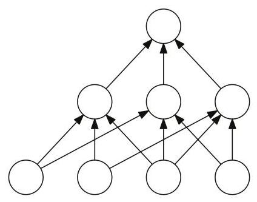{width="30%"}
:::

Figure 3.7

A neural network with one intermediate layer.

edge ending in $u$ . Note that since $c$ takes values in $\{ 0,1\}$ ,
the value at $u$ is in $\{ 0,1\}$ . The value at the top or output node
is obtained similarly by applying the corresponding concept to the
values of the nodes admitting an edge to the output node.

\(a\) Let $\mathcal{H}$ denote the set of all neural networks defined as
above with $k \geq 2$ internal nodes. Show that the growth function
${\Pi }_{\mathcal{H}}\left( m\right)$ can be upper bounded in terms of
the product of the growth functions of the hypothesis sets defined at
each intermediate layer.

\(b\) Use that to upper bound the VC-dimension of the C-neural networks
(Hint: you can use the implication
$m = {2x}{\log }_{2}\left( {xy}\right) \Rightarrow m > x{\log }_{2}\left( {ym}\right)$
valid for $m \geq 1$ , and $x,y > 0$ with ${xy} > 4$ ).

\(c\) Let $\mathcal{C}$ be the family of concept classes defined by
threshold functions $\mathcal{C} =$
$\left\{ {\operatorname{sgn}\left( {\mathop{\sum }\limits_{{j = 1}}^{r}{w}_{j}{x}_{j}}\right) : \mathbf{w} \in {\mathbb{R}}^{r}}\right\}$
. Give an upper bound on the VC-dimension of $\mathcal{H}$ in terms of
$k$ and $r$ .

3.28 VC-dimension of convex combinations. Let $\mathcal{H}$ be a family
of functions mapping from an input space $X$ to $\{ - 1, + 1\}$ and let
$T$ be a positive integer. Give an upper bound on the VC-dimension of
the family of functions ${\mathcal{F}}_{T}$ defined by

$$\mathcal{F} = \left\{ {\operatorname{sgn}\left( {\mathop{\sum }\limits_{{t = 1}}^{T}{\alpha }_{t}{h}_{t}}\right) : {h}_{t} \in \mathcal{H},{\alpha }_{t} \geq 0,\mathop{\sum }\limits_{{t = 1}}^{T}{\alpha }_{t} \leq 1}\right\} .$$

(Hint: you can use exercise 3.27 and its solution).

3.29 Infinite VC-dimension.

\(a\) Show that if a concept class $\mathcal{C}$ has infinite
VC-dimension, then it is not PAC-learnable.

\(b\) In the standard PAC-learning scenario, the learning algorithm
receives all examples first and then computes its hypothesis. Within
that setting, PAC-learning of concept classes with infinite VC-dimension
is not possible as seen in the previous question.

Imagine now a different scenario where the learning algorithm can
alternate between drawing more examples and computation. The objective
of this problem is to prove that PAC-learning can then be possible for
some concept classes with infinite VC-dimension.

Consider for example the special case of the concept class $\mathcal{C}$
of all subsets of natural numbers. Professor Vitres has an idea for the
first stage of a learning algorithm $L$ PAC-learning $\mathcal{C}$ . In
the first stage, $L$ draws a sufficient number of points $m$ such that
the probability of drawing a point beyond the maximum value $M$ observed
be small with high confidence. Can you complete Professor Vitres' idea
by describing the second stage of the algorithm so that it PAC-learns
$\mathcal{C}$ ? The description should be augmented with the proof that
$L$ can PAC-learn C.

3.30 VC-dimension generalization bound - realizable case. In this
exercise we show that the bound given in corollary 3.19 can be improved
to $O\left( \frac{d\log \left( {m/d}\right) }{m}\right)$ in the
realizable setting. Assume we are in the realizable scenario, i.e. the
target concept is included in our hypothesis class $\mathcal{H}$ . We
will show that if a hypothesis $h$ is consistent with a sample
$S \sim {\mathcal{D}}^{m}$ then for any $\epsilon > 0$ such that
${m\epsilon } \geq 8$

$$\mathbb{P}\left\lbrack {R\left( h\right) > \epsilon }\right\rbrack \leq 2{\left\lbrack \frac{2em}{d}\right\rbrack }^{d}{2}^{-{m\epsilon }/2}. \tag{3.54}$$

\(a\) Let ${\mathcal{H}}_{S} \subseteq \mathcal{H}$ be the subset of
hypotheses consistent with the sample $S$ , let
${\widehat{R}}_{S}\left( h\right)$ denote the empirical error with
respect to the sample $S$ and define ${S}^{\prime }$ as another
independent sample drawn from ${\mathcal{D}}^{m}$ . Show that the
following inequality holds for any ${h}_{0} \in {\mathcal{H}}_{S}$ :

$$\mathbb{P}\left\lbrack {\mathop{\sup }\limits_{{h \in {\mathcal{H}}_{S}}}\left| {{\widehat{R}}_{S}\left( h\right) - {\widehat{R}}_{{S}^{\prime }}\left( h\right) }\right| > \frac{\epsilon }{2}}\right\rbrack \geq \mathbb{P}\left\lbrack {B\left( {m,\epsilon }\right) > \frac{m\epsilon }{2}}\right\rbrack \mathbb{P}\left\lbrack {R\left( {h}_{0}\right) > \epsilon }\right\rbrack ,$$

where $B\left( {m,\epsilon }\right)$ is a binomial random variable with
parameters $\left( {m,\epsilon }\right)$ . (Hint: prove and use the fact
that
$\mathbb{P}\left\lbrack {{\widehat{R}}_{S}\left( h\right) \geq \frac{\epsilon }{2}}\right\rbrack \geq \mathbb{P}\left\lbrack {{\widehat{R}}_{S}\left( h\right) > \frac{\epsilon }{2} \land R\left( h\right) > \epsilon }\right\rbrack$
.)

\(b\) Prove that
$\mathbb{P}\left\lbrack {B\left( {m,\epsilon }\right) > \frac{m\epsilon }{2}}\right\rbrack \geq \frac{1}{2}$
. Use this inequality along with the result from (a) to show that for
any ${h}_{0} \in {\mathcal{H}}_{S}$

$$\mathbb{P}\left\lbrack {R\left( {h}_{0}\right) > \epsilon }\right\rbrack \leq 2\mathbb{P}\left\lbrack {\mathop{\sup }\limits_{{h \in {\mathcal{H}}_{S}}}\left| {{\widehat{R}}_{S}\left( h\right) - {\widehat{R}}_{{S}^{\prime }}\left( h\right) }\right| > \frac{\epsilon }{2}}\right\rbrack .$$

\(c\) Instead of drawing two samples, we can draw one sample $T$ of size
${2m}$ then uniformly at random split it into $S$ and ${S}^{\prime }$ .
The right hand side of part (b) can then be rewritten as:

$$\mathbb{P}\left\lbrack {\mathop{\sup }\limits_{{h \in {\mathcal{H}}_{S}}}\left| {{\widehat{R}}_{S}\left( h\right) - {\widehat{R}}_{{S}^{\prime }}\left( h\right) }\right| > \frac{\epsilon }{2}}\right\rbrack = \underset{\begin{matrix} {T \sim {\mathcal{D}}^{2m},} \\ {T \rightarrow \left\lbrack {S,{S}^{\prime }}\right\rbrack } \end{matrix}}{\mathbb{P}}\left\lbrack {\exists h \in \mathcal{H} : {\widehat{R}}_{S}\left( h\right) = 0 \land {\widehat{R}}_{{S}^{\prime }}\left( h\right) > \frac{\epsilon }{2}}\right\rbrack .$$

Let ${h}_{0}$ be a hypothesis such that
${\widehat{R}}_{T}\left( {h}_{0}\right) > \frac{\epsilon }{2}$ and let
$l > \frac{m\epsilon }{2}$ be the total number of errors ${h}_{0}$ makes
on $T$ . Show that the probability of all $l$ errors falling into
${S}^{\prime }$ is upper bounded by ${2}^{-l}$ .

\(d\) Part (b) implies that for any $h \in \mathcal{H}$

$$\underset{\begin{matrix} {T \sim {\mathcal{D}}^{2m} : } \\ {T \rightarrow \left( {S,{S}^{\prime }}\right) } \end{matrix}}{\mathbb{P}}\left\lbrack {{\widehat{R}}_{S}\left( h\right) = 0 \land {\widehat{R}}_{{S}^{\prime }}\left( h\right) > \frac{\epsilon }{2} \mid {\widehat{R}}_{T}\left( {h}_{0}\right) > \frac{\epsilon }{2}}\right\rbrack \leq {2}^{-l}.$$

Use this bound to show that for any $h \in \mathcal{H}$

$$\underset{\begin{matrix} {T \sim {\mathcal{D}}^{2m};} \\ {T \rightarrow \left( {S,{S}^{\prime }}\right) } \end{matrix}}{\mathbb{P}}\left\lbrack {{\widehat{R}}_{S}\left( h\right) = 0 \land {\widehat{R}}_{{S}^{\prime }}\left( h\right) > \frac{\epsilon }{2}}\right\rbrack \leq {2}^{-\frac{\epsilon m}{2}}.$$

\(e\) Complete the proof of inequality (3.54) by using the union bound
to upper bound
${\mathbb{P}}_{T \sim {\mathcal{D}}^{2}m} : \left\lbrack {\exists h \in \mathcal{H} : {\widehat{R}}_{S}\left( h\right) = 0 \land {\widehat{R}}_{{S}^{\prime }}\left( h\right) > \frac{\epsilon }{2}}\right\rbrack$
. Show that we can achieve a high probability generalization bound that
is of the order $O\left( \frac{d\log \left( {m/d}\right) }{m}\right)$ .

3.31 Generalization bound based on covering numbers. Let $\mathcal{H}$
be a family of functions mapping $x$ to a subset of real numbers
$y \subseteq \mathbb{R}$ . For any $\epsilon > 0$ , the covering number
$\mathcal{N}\left( {\mathcal{H},\epsilon }\right)$ of $\mathcal{H}$ for
the ${L}_{\infty }$ norm is the minimal $k \in \mathbb{N}$ such that
$\mathcal{H}$ can be covered with $k$ balls of radius $\epsilon$ , that
is, there exists
$\left\{ {{h}_{1},\ldots ,{h}_{k}}\right\} \subseteq \mathcal{H}$ such
that, for all $h \in \mathcal{H}$ , there exists $i \leq k$ with
${\begin{Vmatrix}h - {h}_{i}\end{Vmatrix}}_{\infty } = \mathop{\max }\limits_{{x \in X}}\left| {h\left( x\right) - {h}_{i}\left( x\right) }\right| \leq \epsilon$
. In particular, when $\mathcal{H}$ is a compact set, a finite covering
can be extracted from a covering of $\mathcal{H}$ with balls of radius
$\epsilon$ and thus $\mathcal{N}\left( {\mathcal{H},\epsilon }\right)$
is finite.

Covering numbers provide a measure of the complexity of a class of
functions: the larger the covering number, the richer is the family of
functions. The objective of this problem is to illustrate this by
proving a learning bound in the case of the squared loss. Let
$\mathcal{D}$ denote a distribution over $X \times \mathcal{Y}$
according to which

labeled examples are drawn. Then, the generalization error of
$h \in \mathcal{H}$ for the squared loss is defined by
$R\left( h\right) = {\mathbb{E}}_{\left( {x,y}\right) \sim \mathcal{D}}\left\lbrack {\left( h\left( x\right) - y\right) }^{2}\right\rbrack$
and its empirical error for a labeled sample
$S = \left( {\left( {{x}_{1},{y}_{1}}\right) ,\ldots ,\left( {{x}_{m},{y}_{m}}\right) }\right)$
by
${\widehat{R}}_{S}\left( h\right) = \frac{1}{m}\mathop{\sum }\limits_{{i = 1}}^{m}{\left( h\left( {x}_{i}\right) - {y}_{i}\right) }^{2}$
. We will assume that $\mathcal{H}$ is bounded, that is there exists
$M > 0$ such that $\left| {h\left( x\right) - y}\right| \leq M$ for all
$\left( {x,y}\right) \in X \times y$ . The following is the
generalization bound proven in this problem:

$$\underset{S \sim {\mathcal{D}}^{m}}{\mathbb{P}}\left\lbrack {\mathop{\sup }\limits_{{h \in \mathcal{H}}}\left| {R\left( h\right) - {\widehat{R}}_{S}\left( h\right) }\right| \geq \epsilon }\right\rbrack \leq \mathcal{N}\left( {\mathcal{H},\frac{\epsilon }{8M}}\right) 2\exp \left( \frac{-m{\epsilon }^{2}}{2{M}^{4}}\right) . \tag{3.55}$$

The proof is based on the following steps.

\(a\) Let
${L}_{S} = R\left( h\right) - {\widehat{R}}_{S}\left( h\right)$ , then
show that for all ${h}_{1},{h}_{2} \in \mathcal{H}$ and any labeled
sample $S$ , the following inequality holds:

$$\left| {{L}_{S}\left( {h}_{1}\right) - {L}_{S}\left( {h}_{2}\right) }\right| \leq {4M}{\begin{Vmatrix}{h}_{1} - {h}_{2}\end{Vmatrix}}_{\infty }.$$

\(b\) Assume that $\mathcal{H}$ can be covered by $k$ subsets
${\mathcal{B}}_{1},\ldots ,{\mathcal{B}}_{k}$ , that is
$\mathcal{H} = {\mathcal{B}}_{1} \cup$ $\ldots \cup {\mathcal{B}}_{k}$ .
Then, show that, for any $\epsilon > 0$ , the following upper bound
holds:

$$\underset{S \sim {\mathcal{D}}^{m}}{\mathbb{P}}\left\lbrack {\mathop{\sup }\limits_{{h \in \mathcal{H}}}\left| {{L}_{S}\left( h\right) }\right| \geq \epsilon }\right\rbrack \leq \mathop{\sum }\limits_{{i = 1}}^{k}\underset{S \sim {\mathcal{D}}^{m}}{\mathbb{P}}\left\lbrack {\mathop{\sup }\limits_{{h \in {\mathcal{B}}_{i}}}\left| {{L}_{S}\left( h\right) }\right| \geq \epsilon }\right\rbrack .$$

\(c\) Finally, let
$k = \mathcal{N}\left( {\mathcal{H},\frac{\epsilon }{8M}}\right)$ and
let ${\mathcal{B}}_{1},\ldots ,{\mathcal{B}}_{k}$ be balls of radius
$\epsilon /\left( {8M}\right)$ centered at ${h}_{1},\ldots ,{h}_{k}$
covering $\mathcal{H}$ . Use part (a) to show that for all
$i \in \left\lbrack k\right\rbrack$ ,

$$\underset{S \sim {\mathcal{D}}^{m}}{\mathbb{P}}\left\lbrack {\mathop{\sup }\limits_{{h \in {\mathcal{B}}_{i}}}\left| {{L}_{S}\left( h\right) }\right| \geq \epsilon }\right\rbrack \leq \underset{S \sim {\mathcal{D}}^{m}}{\mathbb{P}}\left\lbrack {\left| {{L}_{S}\left( {h}_{i}\right) }\right| \geq \frac{\epsilon }{2}}\right\rbrack ,$$

and apply Hoeffding's inequality (theorem D.2) to prove (3.55).

# Model Selection {#model-selection .unnumbered}

A key problem in the design of learning algorithms is the choice of the
hypothesis set $\mathcal{H}$ . This is known as the model selection
problem. How should the hypothesis set $\mathcal{H}$ be chosen? A rich
or complex enough hypothesis set could contain the ideal Bayes
classifier. On the other hand, learning with such a complex family
becomes a very difficult task. More generally, the choice of
$\mathcal{H}$ is subject to a trade-off that can be analyzed in terms of
the estimation and approximation errors.

Our discussion will focus on the particular case of binary
classification but much of what is discussed can be straightforwardly
extended to different tasks and loss functions.

# 4.1 Estimation and approximation errors {#estimation-and-approximation-errors .unnumbered}

Let $\mathcal{H}$ be a family of functions mapping $x$ to
$\{ - 1, + 1\}$ . The excess error of a hypothesis $h$ chosen from
$\mathcal{H}$ , that is the difference between its error
$R\left( h\right)$ and the Bayes error ${R}^{ * }$ , can be decomposed
as follows:

$$R\left( h\right) - {R}^{ * } = \underset{\text{estimation }}{\underbrace{\left( R\left( h\right) - \mathop{\inf }\limits_{{h \in \mathcal{H}}}R\left( h\right) \right) }} + \underset{\text{approximation }}{\underbrace{\left( \mathop{\inf }\limits_{{h \in \mathcal{H}}}R\left( h\right) - {R}^{ * }\right) }}. \tag{4.1}$$

The first term is called the estimation error, the second term the
approximation error. The estimation error depends on the hypothesis $h$
selected. It measures the error of $h$ with respect to the infimum of
the errors achieved by hypotheses in $\mathcal{H}$ , or that of the
best-in-class hypothesis ${h}^{ * }$ when that infimum is reached. Note
that the definition of agnostic PAC-learning is precisely based on the
estimation error.

The approximation error measures how well the Bayes error can be
approximated using $\mathcal{H}$ . It is a property of the hypothesis
set $\mathcal{H}$ , a measure of its richness. For a more complex or
richer hypothesis $\mathcal{H}$ , the approximation error tends to be
smaller at the price of a larger estimation error. This is illustrated
by Figure 4.1.

::: center
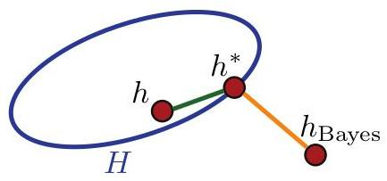{width="30%"}
:::

Figure 4.1

Illustration of the estimation error (in green) and approximation error
(in orange). Here, it is assumed that there exists a best-in-class
hypothesis, that is ${h}^{ * }$ such that
$R\left( {h}^{ * }\right) = \mathop{\inf }\limits_{{h \in \mathcal{H}}}R\left( h\right)$
.

Model selection consists of choosing $\mathcal{H}$ with a favorable
trade-off between the approximation and estimation errors. Note,
however, that the approximation error is not accessible, since in
general the underlying distribution $\mathcal{D}$ needed to determine
${R}^{ * }$ is not known. Even with various noise assumptions,
estimating the approximation error is difficult. In contrast, the
estimation error of an algorithm $\mathcal{A}$ , that is, the estimation
error of the hypothesis ${h}_{S}$ returned after training on a sample
$S$ , can sometimes be bounded using generalization bounds as shown in
the next section.

# 4.2 Empirical risk minimization (ERM) {#empirical-risk-minimization-erm .unnumbered}

A standard algorithm for which the estimation error can be bounded is
Empirical Risk Minimization (ERM). ERM seeks to minimize the error on
the training sample: ${}^{4}$

$${h}_{S}^{\mathrm{{ERM}}} = \mathop{\operatorname{argmin}}\limits_{{h \in \mathcal{H}}}{\widehat{R}}_{S}\left( h\right) . \tag{4.2}$$

Proposition 4.1 For any sample $S$ , the following inequality holds for
the hypothesis returned by ERM:

$$\mathbb{P}\left\lbrack {R\left( {h}_{S}^{\mathrm{{ERM}}}\right) - \mathop{\inf }\limits_{{h \in \mathcal{H}}}R\left( h\right) > \epsilon }\right\rbrack \leq \mathbb{P}\left\lbrack {\mathop{\sup }\limits_{{h \in \mathcal{H}}}\left| {R\left( h\right) - {\widehat{R}}_{S}\left( h\right) }\right| > \frac{\epsilon }{2}}\right\rbrack . \tag{4.3}$$

Proof: By definition of
$\mathop{\inf }\limits_{{h \in \mathcal{H}}}R\left( h\right)$ , for any
$\epsilon > 0$ , there exists ${h}_{\epsilon }$ such that
$R\left( {h}_{\epsilon }\right) \leq \mathop{\inf }\limits_{{h \in \mathcal{H}}}R\left( h\right) + \epsilon$
. Thus, using
${\widehat{R}}_{S}\left( {h}_{S}^{\mathrm{{ERM}}}\right) \leq {\widehat{R}}_{S}\left( {h}_{\epsilon }\right)$
, which holds by the

::: center
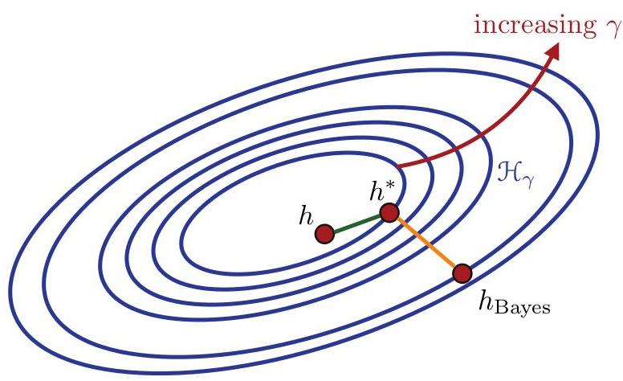{width="60%"}
:::

Figure 4.2

Illustration of the decomposition of a rich family
$\mathcal{H} = \mathop{\bigcup }\limits_{{\gamma \in \Gamma }}{\mathcal{H}}_{\gamma }$
.

definition of the algorithm, we can write

$$R\left( {h}_{S}^{\mathrm{{ERM}}}\right) - \mathop{\inf }\limits_{{h \in \mathcal{H}}}R\left( h\right) = R\left( {h}_{S}^{\mathrm{{ERM}}}\right) - R\left( {h}_{\epsilon }\right) + R\left( {h}_{\epsilon }\right) - \mathop{\inf }\limits_{{h \in \mathcal{H}}}R\left( h\right)$$

$$\leq R\left( {h}_{S}^{\mathrm{{ERM}}}\right) - R\left( {h}_{\epsilon }\right) + \epsilon$$

$$= R\left( {h}_{S}^{\mathrm{{ERM}}}\right) - {\widehat{R}}_{S}\left( {h}_{S}^{\mathrm{{ERM}}}\right) + {\widehat{R}}_{S}\left( {h}_{S}^{\mathrm{{ERM}}}\right) - R\left( {h}_{\epsilon }\right) + \epsilon$$

$$\leq R\left( {h}_{S}^{\mathrm{{ERM}}}\right) - {\widehat{R}}_{S}\left( {h}_{S}^{\mathrm{{ERM}}}\right) + {\widehat{R}}_{S}\left( {h}_{\epsilon }\right) - R\left( {h}_{\epsilon }\right) + \epsilon$$

$$\leq 2\mathop{\sup }\limits_{{h \in \mathcal{H}}}\left| {R\left( h\right) - {\widehat{R}}_{S}\left( h\right) }\right| + \epsilon$$

Since the inequality holds for all $\epsilon > 0$ , it implies the
following:

$$R\left( {h}_{S}^{\mathrm{{ERM}}}\right) - \mathop{\inf }\limits_{{h \in \mathcal{H}}}R\left( h\right) \leq 2\mathop{\sup }\limits_{{h \in \mathcal{H}}}\left| {R\left( h\right) - {\widehat{R}}_{S}\left( h\right) }\right| ,$$

which concludes the proof.

The right-hand side of (4.3) can be upper-bounded using the
generalization bounds presented in the previous chapter in terms of the
Rademacher complexity, the growth function, or the VC-dimension of
$\mathcal{H}$ . In particular, it can be bounded by
$2{e}^{-{2m}{\left\lbrack \epsilon - {\Re }_{m}\left( \mathcal{H}\right) \right\rbrack }^{2}}$
. Thus, when $\mathcal{H}$ admits a favorable Rademacher complexity, for
example a finite VC-dimension, for a sufficiently large sample, with
high probability, the estimation error is guaranteed to be small.
Nevertheless, the performance of ERM is typically very poor. This is
because the algorithm disregards the complexity of the hypothesis set
$\mathcal{H}$ : in practice, either $\mathcal{H}$ is not complex enough,
in which case the approximation error can be very large, or
$\mathcal{H}$ is very rich, in which case the bound on the estimation
error becomes very loose. Additionally, in many cases, determining the
ERM solution is computationally intractable. For example, finding a
linear hypothesis with the smallest error on the training sample is
NP-hard, as a function of the dimension of the space.

::: center
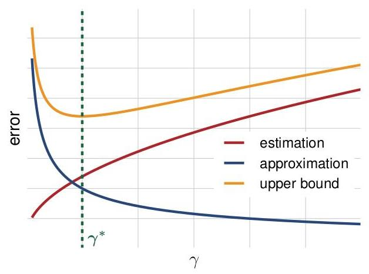{width="50%"}
:::

Figure 4.3

Choice of ${\gamma }^{ * }$ with the most favorable trade-off between
estimation and approximation errors.

# 4.3 Structural risk minimization (SRM) {#structural-risk-minimization-srm .unnumbered}

In the previous section, we showed that the estimation error can be
sometimes bounded or estimated. But, since the approximation error
cannot be estimated, how should we choose $\mathcal{H}$ ? One way to
proceed is to choose a very complex family $\mathcal{H}$ with no
approximation error or a very small one. $\mathcal{H}$ may be too rich
for generalization bounds to hold for $\mathcal{H}$ , but suppose we can
decompose $\mathcal{H}$ as a union of increasingly complex hypothesis
sets ${\mathcal{H}}_{\gamma }$ , that is
$\mathcal{H} = \mathop{\bigcup }\limits_{{\gamma \in \Gamma }}{\mathcal{H}}_{\gamma }$
, with the complexity of ${\mathcal{H}}_{\gamma }$ increasing with
$\gamma$ , for some set $\Gamma$ . Figure 4.2 illustrates this
decomposition. The problem then consists of selecting the parameter
${\gamma }^{ * } \in \Gamma$ and thus the hypothesis set
${\mathcal{H}}_{{\gamma }^{ * }}$ with the most favorable trade-off
between estimation and approximation errors. Since these quantities are
not known, instead, as illustrated by Figure 4.3, a uniform upper bound
on their sum, the excess error (also called excess risk), can be used.

This is precisely the idea behind the Structural Risk Minimization (SRM)
method. For SRM, $\mathcal{H}$ is assumed to be decomposable into a
countable set, thus, we will write its decomposition as
$\mathcal{H} = \mathop{\bigcup }\limits_{{k \geq 1}}{\mathcal{H}}_{k}$ .
Additionally, the hypothesis sets ${\mathcal{H}}_{k}$ are assumed to be
nested: ${\mathcal{H}}_{k} \subset {\mathcal{H}}_{k + 1}$ for all
$k \geq 1$ . However, many of the results presented in this section also
hold for non-nested hypothesis sets. Thus, we will not make use of that
assumption, unless explicitly specified. SRM consists of choosing the
index ${k}^{ * } \geq 1$ and the ERM hypothesis $h$ in
${\mathcal{H}}_{{k}^{ * }}$ that minimize an upper bound on the excess
error.

::: center
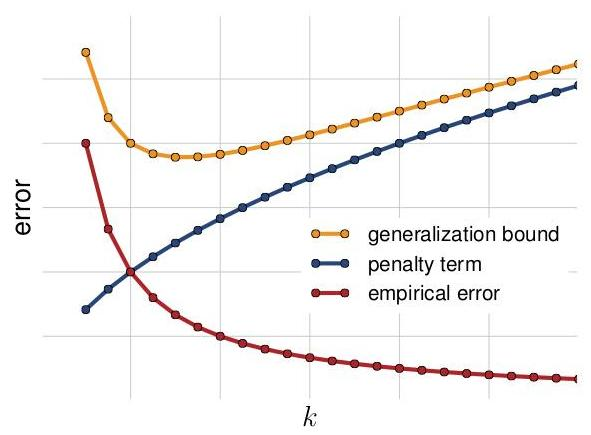{width="50%"}
:::

Figure 4.4

Illustration of structural risk minimization. The plots of three errors
are shown as a function of the index $k$ . Clearly, as $k$ , or
equivalently the complexity the hypothesis set ${\mathcal{H}}_{k}$ ,
increases, the training error decreases, while the penalty term
increases. SRM selects the hypothesis minimizing a bound on the
generalization error, which is a sum of the empirical error and the
penalty term.

As we shall see, the following learning bound holds for all
$h \in \mathcal{H}$ : for any $\delta > 0$ , with probability at least
$1 - \delta$ over the draw of a sample $S$ of size $m$ from
${\mathcal{D}}^{m}$ , for all $h \in {\mathcal{H}}_{k}$ and $k \geq 1$ ,

$$R\left( h\right) \leq {\widehat{R}}_{S}\left( h\right) + {\Re }_{m}\left( {\mathcal{H}}_{k\left( h\right) }\right) + \sqrt{\frac{\log k}{m}} + \sqrt{\frac{\log \frac{2}{\delta }}{2m}}.$$

Thus, to minimize the resulting bound on the excess error
$\left( {R\left( h\right) - {R}^{ * }}\right)$ , the index $k$ and the
hypothesis $h \in {\mathcal{H}}_{k}$ should be chosen to minimize the
following objective

function:

$${F}_{k}\left( h\right) = {\widehat{R}}_{S}\left( h\right) + {\Re }_{m}\left( {\mathcal{H}}_{k}\right) + \sqrt{\frac{\log k}{m}}.$$

This is precisely the definition of the SRM solution
${h}_{S}^{\mathrm{{SRM}}}$ :

$${h}_{S}^{\mathrm{{SRM}}} = \mathop{\operatorname{argmin}}\limits_{{k \geq 1,h \in {\mathcal{H}}_{k}}}{F}_{k}\left( h\right) = \mathop{\operatorname{argmin}}\limits_{{k \geq 1,h \in {\mathcal{H}}_{k}}}{\widehat{R}}_{S}\left( h\right) + {R}_{m}\left( {\mathcal{H}}_{k}\right) + \sqrt{\frac{\log k}{m}}. \tag{4.4}$$

Thus, SRM identifies an optimal index ${k}^{ * }$ and therefore
hypothesis set ${\mathcal{H}}_{{k}^{ * }}$ , and returns the ERM
solution based on that hypothesis set. Figure 4.4 further illustrates
the selection of the index ${k}^{ * }$ and hypothesis set
${\mathcal{H}}_{{k}^{ * }}$ by SRM by minimizing an upper bound on the
sum of the training error and the penalty term
${R}_{m}\left( {\mathcal{H}}_{k}\right) + \sqrt{\log k/m}$ . The
following theorem shows that the SRM solution benefits from a strong
learning guarantee. For any $h \in \mathcal{H}$ , we will denote by
${\mathcal{H}}_{k\left( h\right) }$ the least complex hypothesis set
among the ${\mathcal{H}}_{k}\mathrm{\;s}$ that contain $h$ .

Theorem 4.2 (SRM Learning guarantee) For any $\delta > 0$ , with
probability at least $1 - \delta$ over the draw of an i.i.d. sample $S$
of size $m$ from ${\mathcal{D}}^{m}$ , the generalization error of the
hypothesis ${h}_{S}^{\mathrm{{SRM}}}$ returned by the SRM method is
bounded as follows:

$$R\left( {h}_{S}^{\mathrm{{SRM}}}\right) \leq \mathop{\inf }\limits_{{h \in \mathcal{H}}}\left( {R\left( h\right) + 2{\Re }_{m}\left( {\mathcal{H}}_{k\left( h\right) }\right) + \sqrt{\frac{\log k\left( h\right) }{m}}}\right) + \sqrt{\frac{2\log \frac{3}{\delta }}{m}}.$$

Proof: Observe first that, by the union bound, the following general
inequality holds:

$$\mathbb{P}\left\lbrack {\mathop{\sup }\limits_{{h \in \mathcal{H}}}R\left( h\right) - {F}_{k\left( h\right) }\left( h\right) > \epsilon }\right\rbrack$$

$$= \mathbb{P}\left\lbrack {\mathop{\sup }\limits_{{k \geq 1}}\mathop{\sup }\limits_{{h \in {\mathcal{H}}_{k}}}R\left( h\right) - {F}_{k}\left( h\right) > \epsilon }\right\rbrack$$

$$\leq \mathop{\sum }\limits_{{k = 1}}^{\infty }\mathbb{P}\left\lbrack {\mathop{\sup }\limits_{{h \in {\mathcal{H}}_{k}}}R\left( h\right) - {F}_{k}\left( h\right) > \epsilon }\right\rbrack$$

$$= \mathop{\sum }\limits_{{k = 1}}^{\infty }\mathbb{P}\left\lbrack {\mathop{\sup }\limits_{{h \in {\mathcal{H}}_{k}}}R\left( h\right) - {\widehat{R}}_{S}\left( h\right) - {\Re }_{m}\left( {\mathcal{H}}_{k}\right) > \epsilon + \sqrt{\frac{\log k}{m}}}\right\rbrack$$

$$\leq \mathop{\sum }\limits_{{k = 1}}^{\infty }\exp \left( {-{2m}{\left\lbrack \epsilon + \sqrt{\frac{\log k}{m}}\right\rbrack }^{2}}\right) \tag{4.5}$$

$$\leq \mathop{\sum }\limits_{{k = 1}}^{\infty }{e}^{-{2m}{\epsilon }^{2}}{e}^{-2\log k}$$

$$= {e}^{-{2m}{\epsilon }^{2}}\mathop{\sum }\limits_{{k = 1}}^{\infty }\frac{1}{{k}^{2}} = \frac{{\pi }^{2}}{6}{e}^{-{2m}{\epsilon }^{2}} \leq 2{e}^{-{2m}{\epsilon }^{2}}.$$

Next, for any two random variables ${X}_{1}$ and ${X}_{2}$ , if
${X}_{1} + {X}_{2} > \epsilon$ , then either ${X}_{1}$ or ${X}_{2}$ must
be larger than $\epsilon /2$ . In view of that, by the union bound,
$\mathbb{P}\left\lbrack {{X}_{1} + {X}_{2} > \epsilon }\right\rbrack \leq$
$\mathbb{P}\left\lbrack {{X}_{1} > \frac{\epsilon }{2}}\right\rbrack + \mathbb{P}\left\lbrack {{X}_{2} > \frac{\epsilon }{2}}\right\rbrack$
. Using this inequality, inequality (4.5), and the inequality
${F}_{k\left( {h}_{S}^{\mathrm{{SRM}}}\right) }\left( {h}_{S}^{\mathrm{{SRM}}}\right) \leq {F}_{k\left( h\right) }\left( h\right)$
, which holds for all $h \in \mathcal{H}$ , by definition of
${h}_{S}^{\mathrm{{SRM}}}$ , we can write, for any $h \in \mathcal{H}$ ,

$$\mathbb{P}\left\lbrack {R\left( {h}_{S}^{\mathrm{{SRM}}}\right) - R\left( h\right) - 2{\Re }_{m}\left( {\mathcal{H}}_{k\left( h\right) }\right) - \sqrt{\frac{\log k\left( h\right) }{m}} > \epsilon }\right\rbrack$$

$$\leq \mathbb{P}\left\lbrack {R\left( {h}_{S}^{\mathrm{{SRM}}}\right) - {F}_{k\left( {h}_{S}^{\mathrm{{SRM}}}\right) }\left( {h}_{S}^{\mathrm{{SRM}}}\right) > \frac{\epsilon }{2}}\right\rbrack$$

$$+ \mathbb{P}\left\lbrack {{F}_{k\left( {h}_{S}^{\mathrm{{SRM}}}\right) }\left( {h}_{S}^{\mathrm{{SRM}}}\right) - R\left( h\right) - 2{\Re }_{m}\left( {\mathcal{H}}_{k\left( h\right) }\right) - \sqrt{\frac{\log k\left( h\right) }{m}} > \frac{\epsilon }{2}}\right\rbrack$$

$$\leq 2{e}^{-\frac{m{\epsilon }^{2}}{2}} + \mathbb{P}\left\lbrack {{F}_{k\left( h\right) }\left( h\right) - R\left( h\right) - 2{\Re }_{m}\left( {\mathcal{H}}_{k\left( h\right) }\right) - \sqrt{\frac{\log k\left( h\right) }{m}} > \frac{\epsilon }{2}}\right\rbrack$$

$$= 2{e}^{-\frac{m{\epsilon }^{2}}{2}} + \mathbb{P}\left\lbrack {{\widehat{R}}_{S}\left( h\right) - R\left( h\right) - {\Re }_{m}\left( {\mathcal{H}}_{k\left( h\right) }\right) > \frac{\epsilon }{2}}\right\rbrack$$

$$= 2{e}^{-\frac{m{\epsilon }^{2}}{2}} + {e}^{-\frac{m{\epsilon }^{2}}{2}} = 3{e}^{-\frac{m{\epsilon }^{2}}{2}}.$$

Setting the right-hand side to be equal to $\delta$ completes the proof.

The learning guarantee just proven for SRM is remarkable. To simplify
its discussion, let us assume that there exists ${h}^{ * }$ such that
$R\left( {h}^{ * }\right) = \mathop{\inf }\limits_{{h \in \mathcal{H}}}R\left( h\right)$
, that is, that there exists a best-in-class classifier
${h}^{ * } \in \mathcal{H}$ . Then, the theorem implies in particular
that, with probability at least $1 - \delta$ , the following inequality
holds for all $h \in \mathcal{H}$ :

$$R\left( {h}_{S}^{\mathrm{{SRM}}}\right) \leq R\left( {h}^{ * }\right) + 2{\Re }_{m}\left( {\mathcal{H}}_{k\left( {h}^{ * }\right) }\right) + \sqrt{\frac{\log k\left( {h}^{ * }\right) }{m}} + \sqrt{\frac{2\log \frac{3}{\delta }}{m}}. \tag{4.6}$$

Observe that, remarkably, this bound is similar to the estimation error
bound for ${\mathcal{H}}_{k\left( {h}^{ * }\right) }$ : it differs from
it only by the term $\sqrt{\log k\left( {h}^{ * }\right) /m}$ . Thus,
modulo that term, the guarantee for SRM is as favorable as the one we
would have obtained, had an oracle informed us of the index
$k\left( {h}^{ * }\right)$ of the best-in-class classifier's hypothesis
set.

Furthermore, observe that when $\mathcal{H}$ is rich enough that
$R\left( {h}^{ * }\right)$ is close to the Bayes error, the learning
bound (4.6) is approximately a bound on the excess error of the SRM
solution. Note that, if for some ${k}_{0}$ , the empirical error of the
ERM solution for ${\mathcal{H}}_{{k}_{0}}$ is zero, which holds in
particular if ${\mathcal{H}}_{{k}_{0}}$ contains the Bayes error, then,
we have
$\mathop{\min }\limits_{{h \in {\mathcal{H}}_{k}}}{F}_{{k}_{0}}\left( h\right) \leq \mathop{\min }\limits_{{h \in {\mathcal{H}}_{k}}}{F}_{k}\left( h\right)$
for all $k > {k}_{0}$ and only finitely many indices need to be
considered in SRM.

Assume more generally that if
$\mathop{\min }\limits_{{h \in {\mathcal{H}}_{k}}}{F}_{k}\left( h\right) \leq \mathop{\min }\limits_{{h \in {\mathcal{H}}_{k + 1}}}{F}_{k}\left( h\right)$
for some $k$ , then indices beyond $k + 1$ need not be inspected. This
property may hold for example if the empirical error cannot be further
improved after some index $k$ . In that case, the minimizing index
${k}^{ * }$ can be determined via a binary search in the interval
$\left\lbrack {1,{k}_{\max }}\right\rbrack$ , given some maximum value
${k}_{\max }.{k}_{\max }$ itself can be found by inspecting
$\mathop{\min }\limits_{{h \in {\mathcal{H}}_{{2}^{n}}}}{F}_{k}\left( h\right)$
for exponentially growing indices ${2}^{n},n \geq 1$ , and setting
${k}_{\max } = {2}^{n}$ for $n$ such that
$\mathop{\min }\limits_{{h \in {\mathcal{H}}_{{2}^{n}}}}{F}_{k}\left( h\right) \leq \mathop{\min }\limits_{{h \in {\mathcal{H}}_{{2}^{n + 1}}}}{F}_{k}\left( h\right)$
. The number of ERM computations needed to find ${k}_{\max }$ is in
$O\left( n\right) = O\left( {\log {k}_{\max }}\right)$ and similarly the
number of ERM computations due to the binary search is in
$O\left( {\log {k}_{\max }}\right)$ . Thus, if $n$ is the smallest
integer such that ${k}^{ * } < {2}^{n}$ , the overall number of ERM
computations is in $O\left( {\log {k}^{ * }}\right)$ .

While it benefits from a very favorable guarantee, SRM admits several
drawbacks. First, the decomposability of $\mathcal{H}$ into countably
many hypothesis sets, each with a converging Rademacher complexity,
remains a strong assumption. As an example, the family of all measurable
functions cannot be written as a union of countably many hypothesis sets
with finite VC-dimension. Thus, the choice of $\mathcal{H}$ or that of
the hypothesis sets ${\mathcal{H}}_{k}$ is a key component of SRM.
Second, and this is the main disadvantage of SRM, the method is
typically computationally intractable: for most hypothesis sets, finding
the solution of ERM is NP-hard and in general SRM requires determining
that solution for a large number of indices $k$ .

# 4.4 Cross-validation {#cross-validation .unnumbered}

An alternative method for model selection, cross-validation, consists of
using some fraction of the training sample as a validation set to select
a hypothesis set ${\mathcal{H}}_{k}$ . This is in contrast with the SRM
model which relies on a theoretical learning bound assigning a penalty
to each hypothesis set. In this section, we analyze the cross-validation
method and compare its performance to that of SRM.

As in the previous section, let
${\left( {\mathcal{H}}_{k}\right) }_{k \geq 1}$ be a countable sequence
of hypothesis sets with increasing complexities. The cross-validation
(CV) solution is obtained as follows. Let $S$ be an i.i.d. labeled
sample of size $m.S$ is divided into a sample ${S}_{1}$ of size
$\left( {1 - \alpha }\right) m$ and a sample ${S}_{2}$ of size
${\alpha m}$ , with $\alpha \in \left( {0,1}\right)$ typically chosen to
be relatively small. ${S}_{1}$ is reserved for training, ${S}_{2}$ for
validation. For any $k \in \mathbb{N}$ , let
${h}_{{S}_{1},k}^{\mathrm{{ERM}}}$ denote the solution of ERM run on
${S}_{1}$ using the hypothesis set ${\mathcal{H}}_{k}$ . The hypothesis
${h}_{S}^{\mathrm{{CV}}}$ returned by cross-validation is the ERM
solution ${h}_{{S}_{1},k}^{\mathrm{{ERM}}}$ with the best performance on
${S}_{2}$ :

$${h}_{S}^{\mathrm{{CV}}} = \mathop{\operatorname{argmin}}\limits_{{h \in \left\{ {{h}_{{S}_{1},k}^{\mathrm{{ENM}}} : k \geq 1}\right\} }}{\widehat{R}}_{{S}_{2}}\left( h\right) . \tag{4.7}$$

The following general result will help us derive learning guarantees for
cross-validation.

Proposition 4.3 For any $\alpha > 0$ and any sample size $m \geq 1$ ,
the following general inequality holds:

$$\mathbb{P}\left\lbrack {\mathop{\sup }\limits_{{k \geq 1}}\left| {R\left( {h}_{{S}_{1},k}^{\mathrm{{ERM}}}\right) - {\widehat{R}}_{{S}_{2}}\left( {h}_{{S}_{1},k}^{\mathrm{{ERM}}}\right) }\right| > \epsilon + \sqrt{\frac{\log k}{\alpha m}}}\right\rbrack \leq 4{e}^{-{2\alpha m}{\epsilon }^{2}}.$$

Proof: By the union bound, we can write

$$\mathbb{P}\left\lbrack {\mathop{\sup }\limits_{{k \geq 1}}\left| {R\left( {h}_{{S}_{1},k}^{\mathrm{{ERM}}}\right) - {\widehat{R}}_{{S}_{2}}\left( {h}_{{S}_{1},k}^{\mathrm{{ERM}}}\right) }\right| > \epsilon + \sqrt{\frac{\log k}{\alpha m}}}\right\rbrack$$

$$\leq \mathop{\sum }\limits_{{k = 1}}^{\infty }\mathbb{P}\left\lbrack {\left| {R\left( {h}_{{S}_{1},k}^{\mathrm{{ERM}}}\right) - {\widehat{R}}_{{S}_{2}}\left( {h}_{{S}_{1},k}^{\mathrm{{ERM}}}\right) }\right| > \epsilon + \sqrt{\frac{\log k}{\alpha m}}}\right\rbrack \tag{4.8}$$

$$= \mathop{\sum }\limits_{{k = 1}}^{\infty }\mathbb{E}\left\lbrack {\mathbb{P}\left\lbrack {\left| {R\left( {h}_{{S}_{1},k}^{\mathrm{{ERM}}}\right) - {\widehat{R}}_{{S}_{2}}\left( {h}_{{S}_{1},k}^{\mathrm{{ERM}}}\right) }\right| > \epsilon + \sqrt{\frac{\log k}{\alpha m}} \mid {S}_{1}}\right\rbrack }\right\rbrack .$$

The hypothesis ${h}_{{S}_{1},k}^{\mathrm{{ERM}}}$ is fixed conditioned
on ${S}_{1}$ . Furthermore, the sample ${S}_{2}$ is independent from
${S}_{1}$ . Therefore, by Hoeffding's inequality, we can bound the
conditional probability as follows:

$$\mathbb{P}\left\lbrack {\left| {R\left( {h}_{{S}_{1},k}^{\mathrm{{ERM}}}\right) - {\widehat{R}}_{{S}_{2}}\left( {h}_{{S}_{1},k}^{\mathrm{{ERM}}}\right) }\right| > \epsilon + \sqrt{\frac{\log k}{\alpha m}} \mid {S}_{1}}\right\rbrack \leq 2{e}^{-{2\alpha m}{\left( \epsilon + \sqrt{\frac{\log k}{\alpha m}}\right) }^{2}}.$$

$$\leq 2{e}^{-{2\alpha m}{\epsilon }^{2} - 2\log k}$$

$$= \frac{2}{{k}^{2}}{e}^{-{2\alpha m}{\epsilon }^{2}}.$$

Plugging in the right-hand side of this bound in (4.8) and summing over
$k$ yields

$$\mathbb{P}\left\lbrack {\mathop{\sup }\limits_{{k \geq 1}}\left| {R\left( {h}_{{S}_{1},k}^{\mathrm{{ERM}}}\right) - {\widehat{R}}_{{S}_{2}}\left( {h}_{{S}_{1},k}^{\mathrm{{ERM}}}\right) }\right| > \epsilon + \sqrt{\frac{\log k}{\alpha m}}}\right\rbrack \leq \frac{{\pi }^{2}}{3}{e}^{-{2\alpha m}{\epsilon }^{2}} < 4{e}^{-{2\alpha m}{\epsilon }^{2}},$$

which completes the proof.

Let $R\left( {h}_{{S}_{1}}^{\mathrm{{SRM}}}\right)$ be the
generalization error of the SRM solution using a sample ${S}_{1}$ of
size $\left( {1 - {\alpha m}}\right)$ and
$R\left( {{h}_{S}^{\mathrm{{CV}}},S}\right)$ the generalization error of
the cross-validation solution using a sample $S$ of size $m$ . Then,
using Proposition 4.3, the following learning guarantee can be derived
which compares the error of the CV method to that of SRM.

Theorem 4.4 (Cross-validation versus SRM) For any $\delta > 0$ , with
probability at least $1 - \delta$ , the following holds:

$$R\left( {h}_{S}^{\mathrm{{CV}}}\right) - R\left( {h}_{{S}_{1}}^{\mathrm{{SRM}}}\right) \leq 2\sqrt{\frac{\log \max \left( {k\left( {h}_{S}^{\mathrm{{CV}}}\right) ,k\left( {h}_{{S}_{1}}^{\mathrm{{SRM}}}\right) }\right) }{\alpha m}} + 2\sqrt{\frac{\log \frac{4}{\delta }}{2\alpha m}},$$

where, for any $h,k\left( h\right)$ denotes the smallest index of a
hypothesis set containing $h$ . Proof: By Proposition 4.3 and Theorem
4.2, using the property of ${h}_{S}^{\mathrm{{CV}}}$ as a minimizer, for
any $\delta > 0$ , with probability at least $1 - \delta$ , the
following inequalities

hold:

$$R\left( {h}_{S}^{\mathrm{{CV}}}\right) \leq {\widehat{R}}_{{S}_{2}}\left( {h}_{S}^{\mathrm{{CV}}}\right) + \sqrt{\frac{\log \left( {k\left( {h}_{S}^{\mathrm{{CV}}}\right) }\right) }{\alpha m}} + \sqrt{\frac{\log \frac{4}{\delta }}{2\alpha m}}$$

$$\leq {\widehat{R}}_{{S}_{2}}\left( {h}_{{S}_{1}}^{\mathrm{{SRM}}}\right) + \sqrt{\frac{\log \left( {k\left( {h}_{S}^{\mathrm{{CV}}}\right) }\right) }{\alpha m}} + \sqrt{\frac{\log \frac{4}{\delta }}{2\alpha m}}$$

$$\leq R\left( {h}_{{S}_{1}}^{\mathrm{{SRM}}}\right) + \sqrt{\frac{\log \left( {k\left( {h}_{S}^{\mathrm{{CV}}}\right) }\right) }{\alpha m}} + \sqrt{\frac{\log \left( {k\left( {h}_{{S}_{1}}^{\mathrm{{SRM}}}\right) }\right) }{\alpha m}} + 2\sqrt{\frac{\log \frac{4}{\delta }}{2\alpha m}}$$

$$\leq R\left( {h}_{{S}_{1}}^{\mathrm{{SRM}}}\right) + 2\sqrt{\frac{\log \left( {\max \left( {k\left( {h}_{S}^{\mathrm{{CV}}}\right) ,k\left( {h}_{{S}_{1}}^{\mathrm{{SRM}}}\right) }\right) }\right) }{\alpha m}} + 2\sqrt{\frac{\log \frac{4}{\delta }}{2\alpha m}},$$

which completes the proof.

The learning guarantee just proven shows that, with high probability,
the generalization error of the CV solution for a sample of size $m$ is
close to that of the SRM solution for a sample of size
$\left( {1 - \alpha }\right) m$ . For $\alpha$ relatively small, this
suggests a guarantee similar to that of SRM, which, as previously
discussed, is very favorable. However, in some unfavorable regimes, an
algorithm (here SRM) trained on $\left( {1 - \alpha }\right) m$ points
may have a significantly worse performance than when trained on $m$
points (avoiding this phase transition issue is one of the main
motivations behind the use of the $n$ -fold cross-validation method in
practice, see section 4.5). Thus, the bound suggests in fact a
trade-off: $\alpha$ should be chosen sufficiently small to avoid the
unfavorable regimes just mentioned and yet sufficiently large for the
right-hand side of the bound to be small and thus informative.

The learning bound for CV can be made more explicit in some cases in
practice. Assume for example that the hypothesis sets
${\mathcal{H}}_{k}$ are nested and that the empirical errors of the ERM
solutions ${h}_{{S}_{1},k}^{\mathrm{{ERM}}}$ are decreasing before
reaching zero: for any $k$ ,
${\widehat{R}}_{{S}_{1}}\left( {h}_{{S}_{1},k + 1}^{\mathrm{{ERM}}}\right) < {\widehat{R}}_{{S}_{1}}\left( {h}_{{S}_{1},k}^{\mathrm{{ERM}}}\right)$
for all $k$ such that
${\widehat{R}}_{{S}_{1}}\left( {h}_{{S}_{1},k}^{\mathrm{{ERM}}}\right) > 0$
and
${\widehat{R}}_{{S}_{1}}\left( {h}_{{S}_{1},k + 1}^{\mathrm{{ERM}}}\right) \leq$
${\widehat{R}}_{{S}_{1}}\left( {h}_{{S}_{1},k}^{\mathrm{{ERM}}}\right)$
otherwise. Observe that
${\widehat{R}}_{{S}_{1}}\left( {h}_{{S}_{1},k}^{\mathrm{{ERM}}}\right) > 0$
implies at least one error for ${h}_{{S}_{1},k}^{\mathrm{{ERM}}}$ ,
therefore
${\widehat{R}}_{{S}_{1}}\left( {h}_{{S}_{1},k}^{\mathrm{{ERM}}}\right) > \frac{1}{m}$
. In view of that, we must then have
${\widehat{R}}_{{S}_{1}}\left( {h}_{{S}_{1},n}^{\mathrm{{ERM}}}\right) =$
0 for all $n \geq m + 1$ . Thus, we have
${h}_{{S}_{1},n}^{\mathrm{{ERM}}} = {h}_{{S}_{1},m + 1}^{\mathrm{{ERM}}}$
for all $n \geq m + 1$ and we can assume that
$k\left( {f}_{CV}\right) \leq m + 1$ . Since the complexity of
${\mathcal{H}}_{k}$ increases with $k$ we also have
$k\left( {f}_{SRM}\right) \leq m + 1$ . In view of that, we obtain the
following more explicit learning bound for cross-validation:

$$R\left( {{f}_{CV},S}\right) - R\left( {{f}_{SRM},{S}_{1}}\right) \leq 2\sqrt{\frac{\log \left( \frac{4}{\delta }\right) }{2\alpha m}} + 2\sqrt{\frac{\log \left( {m + 1}\right) }{\alpha m}}.$$

# 4.5 $n$ -Fold cross-validation {#n--fold-cross-validation .unnumbered}

In practice, the amount of labeled data available is often too small to
set aside a validation sample since that would leave an insufficient
amount of training data. Instead, a widely adopted method known as
n-fold cross-validation is used to exploit the labeled data both for
model selection and for training.

Let $\mathbf{\theta }$ denote the vector of free parameters of the
algorithm. For a fixed value of $\mathbf{\theta }$ , the method consists
of first randomly partitioning a given sample $S$ of $m$ labeled
examples into $n$ subsamples, or folds. The $i$ th fold is thus a
labeled sample
$\left( {\left( {{x}_{i1},{y}_{i1}}\right) ,\ldots ,\left( {{x}_{i{m}_{i}},{y}_{i{m}_{i}}}\right) }\right)$
of size ${m}_{i}$ . Then, for any $i \in \left\lbrack n\right\rbrack$ ,
the learning algorithm is trained on all but the $i$ th fold to generate
a hypothesis ${h}_{i}$ , and the performance of ${h}_{i}$ is tested on
the $i$ th fold, as illustrated in figure 4.5a. The parameter value
$\mathbf{\theta }$ is evaluated based on the average error of the
hypotheses ${h}_{i}$ , which is called the cross-validation error. This
quantity is denoted by
${\widehat{R}}_{\mathrm{{CV}}}\left( \mathbf{\theta }\right)$ and
defined by

$${\widehat{R}}_{\mathrm{{CV}}}\left( \mathbf{\theta }\right) = \frac{1}{n}\mathop{\sum }\limits_{{i = 1}}^{n}\underset{\text{error of }{h}_{i}\text{ on the }i\text{ th fold }}{\underbrace{\frac{1}{{m}_{i}}\mathop{\sum }\limits_{{j = 1}}^{{m}_{i}}L\left( {{h}_{i}\left( {x}_{ij}\right) ,{y}_{ij}}\right) }}.$$

The folds are generally chosen to have equal size, that is
${m}_{i} = m/n$ for all $i \in \left\lbrack n\right\rbrack$ . How should
$n$ be chosen? The appropriate choice is subject to a trade-off. For a
large $n$ , each training sample used in $n$ -fold cross-validation has
size $m - m/n =$ $m\left( {1 - 1/n}\right)$ (illustrated by the right
vertical red line in figure 4.5b), which is close to $m$ , the size of
the full sample, and also implies all training samples are quite
similar. At the same time, the $i$ th fold used to measure the error is
relatively small and thus the cross-validation error tends to have a
small bias but a large variance. In contrast, smaller values of $n$ lead
to more diverse training samples but their size (shown by the left
vertical red line in figure 4.5b) is significantly less than $m$ . In
this regime, the ith fold is relatively large and thus the
cross-validation error tends to have a smaller variance but a larger
bias.

In applications, $n$ is typically chosen to be 5 or 10. $n$ -fold
cross-validation is used as follows in model selection. The full labeled
data is first split into a training and a test sample. The training
sample of size $m$ is then used to compute the $n$ - fold
cross-validation error
${\widehat{R}}_{\mathrm{{CV}}}\left( \mathbf{\theta }\right)$ for a
small number of possible values of $\mathbf{\theta }$ . The free
parameter $\mathbf{\theta }$ is next set to the value
${\mathbf{\theta }}_{0}$ for which
${\widehat{R}}_{\mathrm{{CV}}}\left( \mathbf{\theta }\right)$ is
smallest and the algorithm is trained with the parameter setting
${\mathbf{\theta }}_{0}$ over the full training sample of size $m$ . Its
performance is evaluated on the test sample as already described in the
previous section.

The special case of $n$ -fold cross-validation where $n = m$ is called
leave-one-out cross-validation, since at each iteration exactly one
instance is left out of the training sample. As shown in chapter 5, the
average leave-one-out error is an approximately unbiased estimate of the
average error of an algorithm and can be used to derive simple
guarantees for some algorithms. In general, the leave-one-out error is
very costly to compute, since it requires training $m$ times on samples
of size $m - 1$ , but for some algorithms it admits a very efficient
computation (see exercise 11.9).

::: center
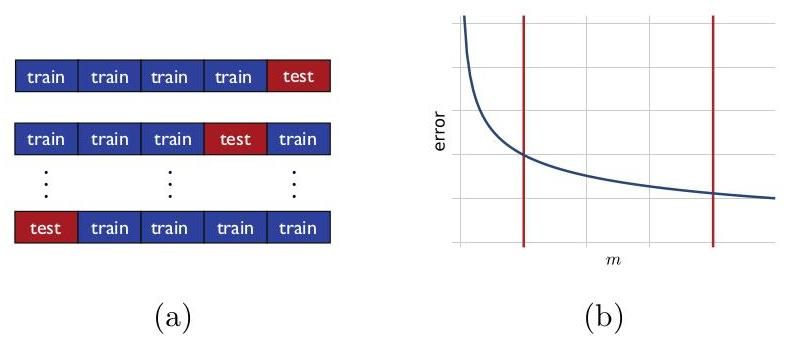{width="60%"}
:::

Figure 4.5

$n$ -fold cross-validation. (a) Illustration of the partitioning of the
training data into 5 folds. (b) Typical plot of a classifier's
prediction error as a function of the size of the training sample $m$ :
the error decreases as a function of the number of training points. The
red line on the left side marks the region for small values of $n$ ,
while the red line on the right side marks the region for large values
of $n$ .

In addition to model selection, $n$ -fold cross-validation is also
commonly used for performance evaluation. In that case, for a fixed
parameter setting $\mathbf{\theta }$ , the full labeled sample is
divided into $n$ random folds with no distinction between training and
test samples. The performance reported is the $n$ -fold cross-validation
error on the full sample as well as the standard deviation of the errors
measured on each fold.

# 4.6 Regularization-based algorithms {#regularization-based-algorithms .unnumbered}

A broad family of algorithms inspired by the SRM method is that of
regularization-based algorithm. This consists of selecting a very
complex family $\mathcal{H}$ that is an uncountable union of nested
hypothesis sets
${\mathcal{H}}_{\gamma } : \mathcal{H} = \mathop{\bigcup }\limits_{{\gamma > 0}}{\mathcal{H}}_{\gamma }$
. $\mathcal{H}$ is often chosen to be dense in the space of continuous
functions over $x$ . For example, $\mathcal{H}$ may be chosen to be the
set of all linear functions in some high-dimensional space and
${\mathcal{H}}_{\gamma }$ the subset of those functions whose norm is
bounded by $\gamma : {\mathcal{H}}_{\gamma } = \{ x \mapsto$
$\mathbf{w} \cdot \mathbf{\Phi }\left( x\right) : \parallel \mathbf{w}\parallel \leq \gamma \}$
. For some choices of $\mathbf{\Phi }$ and the high-dimensional space,
it can be shown that $\mathcal{H}$ is indeed dense in the space of
continuous functions over $x$ .

Given a labeled sample $S$ , the extension of the SRM method to an
uncountable union would then suggest selecting $h$ based on the
following optimization problem:

$$\mathop{\operatorname{argmin}}\limits_{{\gamma > 0,h \in {H}_{\gamma }}}{\widehat{R}}_{S}\left( h\right) + {\Re }_{m}\left( {\mathcal{H}}_{\gamma }\right) + \sqrt{\frac{\log \gamma }{m}}$$

where other penalty terms pen $\left( {\gamma ,m}\right)$ can be chosen
in lieu of the specific choice
$\operatorname{pen}\left( {\gamma ,m}\right) = {\mathfrak{R}}_{m}\left( {\mathcal{H}}_{\gamma }\right) + \sqrt{\frac{\log \gamma }{m}}$
. Often, there exists a function
$\mathcal{R} : \mathcal{H} \rightarrow \mathbb{R}$ such that, for any
$\gamma > 0$ , the constrained optimization problem
${\operatorname{argmin}}_{\gamma > 0,h \in {H}_{\gamma }}{\widehat{R}}_{S}\left( h\right) +$
$\operatorname{pen}\left( {\gamma ,m}\right)$ can be equivalently
written as the unconstrained optimization problem

$$\mathop{\operatorname{argmin}}\limits_{{h \in \mathcal{H}}}{\widehat{R}}_{S}\left( h\right) + \lambda \mathcal{R}\left( h\right)$$

for some $\lambda > 0.\mathcal{R}\left( h\right)$ is called a
regularization term and $\lambda > 0$ is treated as a hyperparameter
since its optimal value is often not known. For most algorithms, the
regularization term $\mathcal{R}\left( h\right)$ is chosen to be an
increasing function of $\parallel h\parallel$ for some choice of the
norm $\parallel \cdot \parallel$ , when $\mathcal{H}$ is the subset of a
Hilbert space. The variable $\lambda$ is often called a regularization
parameter. Larger values of $\lambda$ further penalize more complex
hypotheses, while, for $\lambda$ close or equal to zero, the
regularization term has no effect and the algorithm coincides with ERM.
In practice, $\lambda$ is typically selected via cross-validation or
using $n$ -fold cross-validation.

When the regularization term is chosen to be
$\parallel h{\parallel }_{p}$ for some choice of the norm and $p \geq 1$
, then it is a convex function of $h$ , since any norm is convex.
However, for the zero-one loss, the first term of the objective function
is non-convex, thereby making the optimization problem computationally
hard. In practice, most regularization-based algorithms instead use a
convex upper bound on the zero-one loss and replace the empirical
zero-one term with the empirical value of that convex surrogate. The
resulting optimization problem is then convex and therefore admits more
efficient solutions than SRM. The next section studies the properties of
such convex surrogate losses.

# 4.7 Convex surrogate losses {#convex-surrogate-losses .unnumbered}

The guarantees for the estimation error that we presented in previous
sections hold either for ERM or for SRM, which itself is defined in
terms of ERM. However, as already mentioned, for many choices of the
hypothesis set $\mathcal{H}$ , including that of linear functions,
solving the ERM optimization problem is NP-hard mainly because the
zero-one loss function is not convex. One common method for addressing
this problem consists of using a convex surrogate loss function that
upper bounds the zero-one loss. This section analyzes learning
guarantees for such surrogate losses in terms of the original loss.

The hypotheses we consider are real-valued functions
$h : X \rightarrow \mathbb{R}$ . The sign of $h$ defines a binary
classifier ${f}_{h} : \mathcal{X} \rightarrow \{ - 1, + 1\}$ defined for
all $x \in \mathcal{X}$ by

$${f}_{h}\left( x\right) = \left\{ \begin{array}{ll} + 1 & \text{ if }h\left( x\right) \geq 0 \\ - 1 & \text{ if }h\left( x\right) < 0 \end{array}\right.$$

The loss or error of $h$ at point
$\left( {x,y}\right) \in \mathfrak{X} \times \{ - 1, + 1\}$ is defined
as the binary classification error of ${f}_{h}$ :

$${1}_{{f}_{h}\left( x\right) \neq y} = {1}_{{yh}\left( x\right) < 0} + {1}_{h\left( x\right) = 0 \land y = - 1} \leq {1}_{{yh}\left( x\right) \leq 0}.$$

We will denote by $R\left( h\right)$ the expected error of
$h : R\left( h\right) = {\mathbb{E}}_{\left( {x,y}\right) \sim \mathcal{D}}\left\lbrack {1}_{{f}_{h}\left( x\right) \neq y}\right\rbrack$
. For any $x \in X$ , let $\eta \left( x\right)$ denote
$\eta \left( x\right) = \mathbb{P}\left\lbrack {y = + 1 \mid x}\right\rbrack$
and let ${\mathcal{D}}_{X}$ denote the marginal distribution over $X$ .
Then, for any $h$ , we can write

$$R\left( h\right) = \underset{\left( {x,y}\right) \sim \mathcal{D}}{\mathbb{E}}\left\lbrack {1}_{{f}_{h}\left( x\right) \neq y}\right\rbrack$$

$$= \underset{x \sim {\mathcal{D}}_{x}}{\mathbb{E}}\left\lbrack {\eta \left( x\right) {1}_{h\left( x\right) < 0} + \left( {1 - \eta \left( x\right) }\right) {1}_{h\left( x\right) > 0} + \left( {1 - \eta \left( x\right) }\right) {1}_{h\left( x\right) = 0}}\right\rbrack$$

$$= \underset{x \sim {\mathcal{D}}_{X}}{\mathbb{E}}\left\lbrack {\eta \left( x\right) {1}_{h\left( x\right) < 0} + \left( {1 - \eta \left( x\right) }\right) {1}_{h\left( x\right) \geq 0}}\right\rbrack .$$

In view of that, the Bayes classifier can be defined as assigning label
+1 to $x$ when $\eta \left( x\right) \geq \frac{1}{2}, - 1$ otherwise.
It can therefore be induced by the function ${h}^{ * }$ defined by

$${h}^{ * }\left( x\right) = \eta \left( x\right) - \frac{1}{2}. \tag{4.9}$$

We will refer to ${h}^{ * } : X \rightarrow \mathbb{R}$ as the Bayes
scoring function and will denote by ${R}^{ * }$ the error of the Bayes
classifier or Bayes scoring function:
${R}^{ * } = R\left( {h}^{ * }\right)$ .

Lemma 4.5 The excess error of any hypothesis
$h : X \rightarrow \mathbb{R}$ can be expressed as follows in terms of
$\eta$ and the Bayes scoring function ${h}^{ * }$ :

$$R\left( h\right) - {R}^{ * } = 2\underset{x \sim {\mathcal{D}}_{x}}{\mathbb{E}}\left\lbrack {\left| {{h}^{ * }\left( x\right) }\right| {1}_{h\left( x\right) {h}^{ * }\left( x\right) \leq 0}}\right\rbrack .$$

Proof: For any $h$ , we can write

$$R\left( h\right) = \underset{x \sim {\mathcal{D}}_{X}}{\mathbb{E}}\left\lbrack {\eta \left( x\right) {1}_{h\left( x\right) < 0} + \left( {1 - \eta \left( x\right) }\right) {1}_{h\left( x\right) \geq 0}}\right\rbrack$$

$$= \underset{x \sim {\mathcal{D}}_{x}}{\mathbb{E}}\left\lbrack {\eta \left( x\right) {1}_{h\left( x\right) < 0} + \left( {1 - \eta \left( x\right) }\right) \left( {1 - {1}_{h\left( x\right) < 0}}\right) }\right\rbrack$$

$$= \underset{x \sim {\mathcal{D}}_{x}}{\mathbb{E}}\left\lbrack {\left\lbrack {{2\eta }\left( x\right) - 1}\right\rbrack {1}_{h\left( x\right) < 0} + \left( {1 - \eta \left( x\right) }\right) }\right\rbrack$$

$$= \underset{x \sim {\mathcal{D}}_{x}}{\mathbb{E}}\left\lbrack {2{h}^{ * }\left( x\right) {1}_{h\left( x\right) < 0} + \left( {1 - \eta \left( x\right) }\right) }\right\rbrack ,$$

where we used for the last step equation (4.9). In view of that, for any
$h$ , the following holds:

$$R\left( h\right) - R\left( {h}^{ * }\right) = \underset{x \sim {\mathcal{D}}_{x}}{\mathbb{E}}\left\lbrack {2\left\lbrack {{h}^{ * }\left( x\right) }\right\rbrack \left( {{1}_{h\left( x\right) \leq 0} - {1}_{{h}^{ * }\left( x\right) \leq 0}}\right) }\right\rbrack$$

$$= \underset{x \sim {\mathcal{D}}_{X}}{\mathbb{E}}\left\lbrack {2\left\lbrack {{h}^{ * }\left( x\right) }\right\rbrack \operatorname{sgn}\left( {{h}^{ * }\left( x\right) }\right) {1}_{\left( {h\left( x\right) {h}^{ * }\left( x\right) \leq 0}\right) \land \left( {\left( {h\left( x\right) ,{h}^{ * }\left( x\right) }\right) \neq \left( {0,0}\right) }\right) }}\right\rbrack$$

$$= 2\underset{x \sim {\mathcal{D}}_{x}}{\mathbb{E}}\left\lbrack {\left| {{h}^{ * }\left( x\right) }\right| {1}_{h\left( x\right) {h}^{ * }\left( x\right) \leq 0}}\right\rbrack ,$$

which completes the proof, since $R\left( {h}^{ * }\right) = {R}^{ * }$
.

Let $\Phi : \mathbb{R} \rightarrow \mathbb{R}$ be a convex and
non-decreasing function so that for any $u \in \mathbb{R}$ ,
${1}_{u \leq 0} \leq \Phi \left( {-u}\right)$ . The $\Phi$ -loss of a
function $h : X \rightarrow \mathbb{R}$ at point
$\left( {x,y}\right) \in X \times \{ - 1, + 1\}$ is defined as
$\Phi \left( {-{yh}\left( x\right) }\right)$ and its expected loss given
by

$${\mathcal{L}}_{\Phi }\left( h\right) = \underset{\left( {x,y}\right) \sim \mathcal{D}}{\mathbb{E}}\left\lbrack {\Phi \left( {-{yh}\left( x\right) }\right) }\right\rbrack$$

$$= \underset{x \sim {\mathcal{D}}_{x}}{\mathbb{E}}\left\lbrack {\eta \left( x\right) \Phi \left( {-h\left( x\right) }\right) + \left( {1 - \eta \left( x\right) }\right) \Phi \left( {h\left( x\right) }\right) }\right\rbrack . \tag{4.10}$$

Notice that since
${1}_{{yh}\left( x\right) \leq 0} \leq \Phi \left( {-{yh}\left( x\right) }\right)$
, we have $R\left( h\right) \leq {\mathcal{L}}_{\Phi }\left( h\right)$ .
For any $x \in X$ , let $u \mapsto {L}_{\Phi }\left( {x,u}\right)$ be
the function defined for all $u \in \mathbb{R}$ by

$${L}_{\Phi }\left( {x,u}\right) = \eta \left( x\right) \Phi \left( {-u}\right) + \left( {1 - \eta \left( x\right) }\right) \Phi \left( u\right) .$$

Then,
${\mathcal{L}}_{\Phi }\left( h\right) = {\mathbb{E}}_{x \sim {\mathcal{D}}_{X}}\left\lbrack {{L}_{\Phi }\left( {x,h\left( x\right) }\right) }\right\rbrack$
. Since $\Phi$ is convex, $u \mapsto {L}_{\Phi }\left( {x,u}\right)$ is
convex as a sum of two convex functions. Define
${h}_{\Phi }^{ * } : X \rightarrow \left\lbrack {-\infty , + \infty }\right\rbrack$
as the Bayes solution for the loss function ${L}_{\Phi }$ . That is, for
any $x,{h}_{\Phi }^{ * }\left( x\right)$ is a solution of the following
convex optimization problem:

$${h}_{\Phi }^{ * }\left( x\right) = \mathop{\operatorname{argmin}}\limits_{{u \in \left\lbrack {-\infty , + \infty }\right\rbrack }}{L}_{\Phi }\left( {x,u}\right)$$

$$= \mathop{\operatorname{argmin}}\limits_{{u \in \left\lbrack {-\infty , + \infty }\right\rbrack }}\eta \left( x\right) \Phi \left( {-u}\right) + \left( {1 - \eta \left( x\right) }\right) \Phi \left( u\right) .$$

The solution of this optimization is in general not unique. When
$\eta \left( x\right) = 0,{h}_{\Phi }^{ * }\left( x\right)$ is a
minimizer of $u \mapsto \Phi \left( u\right)$ and since $\Phi$ is
non-decreasing, we can choose
${h}_{\Phi }^{ * }\left( x\right) = - \infty$ in that case. Similarly,
when $\eta \left( x\right) = 1$ , we can choose
${h}_{\Phi }^{ * }\left( x\right) = + \infty$ . When
$\eta \left( x\right) = \frac{1}{2}$ ,
${L}_{\Phi }\left( {x,u}\right) = \frac{1}{2}\left\lbrack {\Phi \left( {-u}\right) + \Phi \left( u\right) }\right\rbrack$
, thus, by convexity,
${L}_{\Phi }\left( {x,u}\right) \geq \Phi \left( {-\frac{u}{2} + \frac{u}{2}}\right) = \Phi \left( 0\right)$
. Thus, we can choose ${h}_{\Phi }^{ * }\left( x\right) = 0$ in that
case. For all other values of $\eta \left( x\right)$ , in case of
non-uniqueness, an arbitrary minimizer is chosen in this definition. We
will denote by ${\mathcal{L}}_{\Phi }^{ * }$ the $\Phi$ -loss of
${h}_{\Phi }^{ * } : {\mathcal{L}}_{\Phi }^{ * } = {\mathbb{E}}_{\left( {x,y}\right) \sim \mathcal{D}}\left\lbrack {\Phi \left( {-y{h}_{\Phi }^{ * }\left( x\right) }\right) }\right\rbrack$
.

Proposition 4.6 Let $\Phi$ be a convex and non-decreasing function that
is differentiable at 0 with ${\Phi }^{\prime }\left( 0\right) > 0$ .
Then, the minimizer of $\Phi$ defines the Bayes classifier: for any
$x \in X,{h}_{\Phi }^{ * }\left( x\right) > 0$ iff
${h}^{ * }\left( x\right) > 0$ and ${h}^{ * }\left( x\right) = 0$ iff
${h}_{\Phi }^{ * }\left( x\right) = 0$ , which implies
${\mathcal{L}}_{\Phi }^{ * } = {R}^{ * }$ . Proof: Fix $x \in X$ . If
$\eta \left( x\right) = 0$ , then
${h}^{ * }\left( x\right) = - \frac{1}{2}$ and
${h}_{\Phi }^{ * }\left( x\right) = - \infty$ , thus
${h}^{ * }\left( x\right)$ and ${h}_{\Phi }^{ * }\left( x\right)$ admit
the same sign. Similarly, if $\eta \left( x\right) = 1$ , then
${h}^{ * }\left( x\right) = + \frac{1}{2}$ and
${h}_{\Phi }^{ * }\left( x\right) = + \infty$ , and
${h}^{ * }\left( x\right)$ and ${h}_{\Phi }^{ * }\left( x\right)$ admit
the same sign.

Let ${u}^{ * }$ denote the minimizer defining
${h}_{\Phi }^{ * }\left( x\right) .{u}^{ * }$ is a minimizer of
$u \mapsto {L}_{\Phi }\left( {x,u}\right)$ iff the subdifferential of
that function at ${u}^{ * }$ contains 0, that is, since
$\partial {L}_{\Phi }\left( {x,{u}^{ * }}\right) =$
$- \eta \left( x\right) \partial \Phi \left( {-{u}^{ * }}\right) + \left( {1 - \eta \left( x\right) }\right) \partial \Phi \left( {u}^{ * }\right)$
, iff there exist ${v}_{1} \in \partial \Phi \left( {-{u}^{ * }}\right)$
and ${v}_{2} \in \partial \Phi \left( {u}^{ * }\right)$ such that

$$\eta \left( x\right) {v}_{1} = \left( {1 - \eta \left( x\right) }\right) {v}_{2} \tag{4.11}$$

If ${u}^{ * } = 0$ , by the differentiability of $\Phi$ at 0 we have
${v}_{1} = {v}_{2} = {\Phi }^{\prime }\left( 0\right) > 0$ and thus
$\eta \left( x\right) = \frac{1}{2}$ , that is
${h}^{ * }\left( x\right) = 0$ . Conversely, If
${h}^{ * }\left( x\right) = 0$ , that is
$\eta \left( x\right) = \frac{1}{2}$ , then, by definition, we have
${h}_{\Phi }^{ * }\left( x\right) = 0$ . Thus,
${h}^{ * }\left( x\right) = 0$ iff
${h}_{\Phi }^{ * }\left( x\right) = 0$ iff
$\eta \left( x\right) = \frac{1}{2}$ .

We can assume now that $\eta \left( x\right)$ is not in
$\left\{ {0,1,\frac{1}{2}}\right\}$ . We first show that for any
${u}_{1},{u}_{2} \in \mathbb{R}$ with ${u}_{1} < {u}_{2}$ , and any two
choices of the subgradients at ${u}_{1}$ and ${u}_{2}$ ,
${v}_{1} \in \partial \Phi \left( {u}_{1}\right)$ and
${v}_{2} \in \partial \Phi \left( {u}_{2}\right)$ , we have
${v}_{1} \leq {v}_{2}$ . By definition of the subgradients at ${u}_{1}$
and ${u}_{2}$ , the following inequalities hold:

$$\Phi \left( {u}_{2}\right) - \Phi \left( {u}_{1}\right) \geq {v}_{1}\left( {{u}_{2} - {u}_{1}}\right) \;\Phi \left( {u}_{1}\right) - \Phi \left( {u}_{2}\right) \geq {v}_{2}\left( {{u}_{1} - {u}_{2}}\right) .$$

Summing up these inequalities yields
${v}_{2}\left( {{u}_{2} - {u}_{1}}\right) \geq {v}_{1}\left( {{u}_{2} - {u}_{1}}\right)$
and thus ${v}_{2} \geq {v}_{1}$ , since ${u}_{1} < {u}_{2}$ .

Now, if ${u}^{ * } > 0$ , then we have $- {u}^{ * } < {u}^{ * }$ . By
the property shown above, this implies ${v}_{1} \leq {v}_{2}$ . We
cannot have ${v}_{1} = {v}_{2} \neq 0$ since (4.11) would then imply
$\eta \left( x\right) = \frac{1}{2}$ . We also cannot have
${v}_{1} = {v}_{2} = 0$ since by the property shown above, we must have
${\Phi }^{\prime }\left( 0\right) \leq {v}_{2}$ and thus ${v}_{2} > 0$ .
Thus, we must have ${v}_{1} < {v}_{2}$ with ${v}_{2} > 0$ , which, by
(4.11), implies $\eta \left( x\right) > 1 - \eta \left( x\right)$ , that
is ${h}^{ * }\left( x\right) > 0$ .

Conversely, if ${h}^{ * }\left( x\right) > 0$ then
$\eta \left( x\right) > 1 - \eta \left( x\right)$ . We cannot have
${v}_{1} = {v}_{2} = 0$ or ${v}_{1} = {v}_{2} \neq 0$ as already shown.
Thus, since $\eta \left( x\right) \neq 1$ , by (4.11), this implies
${v}_{1} < {v}_{2}$ . We cannot have ${u}^{ * } < - {u}^{ * }$ since, by
the property shown above, this would imply ${v}_{2} \leq {v}_{1}$ .
Thus, we must have $- {u}^{ * } \leq {u}^{ * }$ , that is
${u}^{ * } \geq 0$ , and more specifically ${u}^{ * } > 0$ since, as
already shown above, ${u}^{ * } = 0$ implies
${h}^{ * }\left( x\right) = 0$ .

Theorem 4.7 Let $\Phi$ be a convex and non-decreasing function. Assume
that there exists $s \geq 1$ and $c > 0$ such that the following holds
for all $x \in X$ :

$${\left| {h}^{ * }\left( x\right) \right| }^{s} = {\left| \eta \left( x\right) - \frac{1}{2}\right| }^{s} \leq {c}^{s}\left\lbrack {{L}_{\Phi }\left( {x,0}\right) - {L}_{\Phi }\left( {x,{h}_{\Phi }^{ * }\left( x\right) }\right) }\right\rbrack .$$

Then, for any hypothesis $h$ , the excess error of $h$ is bounded as
follows:

$$R\left( h\right) - {R}^{ * } \leq {2c}{\left\lbrack {\mathcal{L}}_{\Phi }\left( h\right) - {\mathcal{L}}_{\Phi }^{ * }\right\rbrack }^{\frac{1}{s}}$$

Proof: We will use the following inequality which holds by the convexity
of $\Phi$ :

$$\Phi \left( {-2{h}^{ * }\left( x\right) h\left( x\right) }\right) = \Phi \left( {\left( {1 - {2\eta }\left( x\right) }\right) h\left( x\right) }\right)$$

$$= \Phi \left( {\eta \left( x\right) \left( {-h\left( x\right) }\right) + \left( {1 - \eta \left( x\right) }\right) h\left( x\right) }\right)$$

$$\leq \eta \left( x\right) \Phi \left( \left( {-h\left( x\right) }\right) \right) + \left( {1 - \eta \left( x\right) }\right) \Phi \left( {h\left( x\right) }\right) = {L}_{\Phi }\left( {x,h\left( x\right) }\right) . \tag{4.12}$$

By Lemma 4.5, Jensen's inequality, and
${h}^{ * }\left( x\right) = \eta \left( x\right) - \frac{1}{2}$ , we can
write

$$R\left( h\right) - R\left( {h}^{ * }\right)$$

$$= \underset{x \sim {\mathcal{D}}_{X}}{\mathbb{E}}\left\lbrack {\left| {{2\eta }\left( x\right) - 1}\right| {1}_{h\left( x\right) {h}^{ * }\left( x\right) \leq 0}}\right\rbrack$$

$$\leq \underset{x \sim {\mathcal{D}}_{X}}{\mathbb{E}}{\left\lbrack {\left| 2\eta \left( x\right) - 1\right| }^{s}{1}_{h\left( x\right) {h}^{ * }\left( x\right) \leq 0}\right\rbrack }^{\frac{1}{s}} \tag{Jensen's ineq.}$$

$$\leq {2c}\underset{x \sim {\mathcal{D}}_{x}}{\mathbb{E}}{\left\lbrack \left\lbrack \Phi \left( 0\right) - {L}_{\Phi }\left( x,{h}_{\Phi }^{ * }\left( x\right) \right) \right\rbrack {1}_{h\left( x\right) {h}^{ * }\left( x\right) \leq 0}\right\rbrack }^{\frac{1}{s}} \tag{assumption}$$

$$\leq {2c}\underset{x \sim {\mathcal{D}}_{X}}{\mathbb{E}}{\left\lbrack \left\lbrack \Phi \left( -2{h}^{ * }\left( x\right) h\left( x\right) \right) - {L}_{\Phi }\left( x,{h}_{\Phi }^{ * }\left( x\right) \right) \right\rbrack {1}_{h\left( x\right) {h}^{ * }\left( x\right) \leq 0}\right\rbrack }^{\frac{1}{s}}\;\text{ (}\Phi \text{ non-decreasing) }$$

$$\leq {2c}\underset{x \sim {\mathcal{D}}_{X}}{\mathbb{E}}{\left\lbrack \left\lbrack {L}_{\Phi }\left( x,h\left( x\right) \right) - {L}_{\Phi }\left( x,{h}_{\Phi }^{ * }\left( x\right) \right) \right\rbrack {1}_{h\left( x\right) {h}^{ * }\left( x\right) \leq 0}\right\rbrack }^{\frac{1}{s}}\;\text{ (convexity ineq. (4.12)) }$$

$$\leq {2c}\underset{x \sim {\mathcal{D}}_{x}}{\mathbb{E}}{\left\lbrack {L}_{\Phi }\left( x,h\left( x\right) \right) - {L}_{\Phi }\left( x,{h}_{\Phi }^{ * }\left( x\right) \right) \right\rbrack }^{\frac{1}{s}},$$

which completes the proof, since
${\mathbb{E}}_{x \sim {\mathcal{D}}_{x}}\left\lbrack {{L}_{\Phi }\left( {x,{h}_{\Phi }^{ * }\left( x\right) }\right) }\right\rbrack = {L}_{\Phi }^{ * }$
.

The theorem shows that, when the assumption holds, the excess error of
$h$ can be upper bounded in terms of the excess $\Phi$ -loss. The
assumption of the theorem holds in particular for the following convex
loss functions:

-   Hinge loss, where
    $\Phi \left( u\right) = \max \left( {0,1 + u}\right)$ , with $s = 1$
    and $c = \frac{1}{2}$ .

<!-- -->

-   Exponential loss, where
    $\Phi \left( u\right) = \exp \left( u\right)$ , with $s = 2$ and
    $c = \frac{1}{\sqrt{2}}$ .

<!-- -->

-   Logistic loss, where
    $\Phi \left( u\right) = {\log }_{2}\left( {1 + {e}^{u}}\right)$ ,
    with $s = 2$ and $c = \frac{1}{\sqrt{2}}$ .

They also hold for the square loss and the squared Hinge loss (see
Exercises 4.2 and 4.3).

# 4.8 Chapter notes {#chapter-notes-1 .unnumbered}

The structural risk minimization (SRM) technique is due to Vapnik
\[1998\]. The original penalty term used by Vapnik \[1998\] is based on
the VC-dimension of the hypothesis set. The version of SRM with
Rademacher complexity-based penalties that we present here leads to
finer data-dependent learning guarantees. Penalties based on alternative
complexity measures can be used similarly leading to learning bounds in
terms of the corresponding complexity measure \[Bartlett et al.,
2002a\].

An alternative model selection theory of Voted Risk Minimization (VRM)
has been recently developed by Cortes, Mohri, and Syed \[2014\] and
other related publications \[Kuznetsov et al., 2014, DeSalvo et al.,
2015, Cortes et al., 2015\].

Theorem 4.7 is due to Zhang \[2003a\]. The proof given here is somewhat
different and simpler.

# 4.9 Exercises {#exercises-1 .unnumbered}

4.1 For any hypothesis set $\mathcal{H}$ , show that the following
inequalities hold:

$$\underset{S \sim {\mathcal{D}}^{m}}{\mathbb{E}}\left\lbrack {{\widehat{R}}_{S}\left( {h}_{S}^{\mathrm{{ERM}}}\right) }\right\rbrack \leq \mathop{\inf }\limits_{{h \in \mathcal{H}}}R\left( h\right) \leq \underset{S \sim {\mathcal{D}}^{m}}{\mathbb{E}}\left\lbrack {R\left( {h}_{S}^{\mathrm{{ERM}}}\right) }\right\rbrack . \tag{4.13}$$

4.2 Show that for the squared loss,
$\Phi \left( u\right) = {\left( 1 + u\right) }^{2}$ , the statement of
Theorem 4.7 holds with $s = 2$ and $c = \frac{1}{2}$ and therefore that
the excess error can be upper bounded as follows:

$$R\left( h\right) - {R}^{ * } \leq {\left\lbrack {\mathcal{L}}_{\Phi }\left( h\right) - {\mathcal{L}}_{\Phi }^{ * }\right\rbrack }^{\frac{1}{2}}.$$

4.3 Show that for the squared Hinge loss,
$\Phi \left( u\right) = \max {\left( 0,1 + u\right) }^{2}$ , the
statement of Theorem 4.7 holds with $s = 2$ and $c = \frac{1}{2}$ and
therefore that the excess error can be upper bounded as follows:

$$R\left( h\right) - {R}^{ * } \leq {\left\lbrack {\mathcal{L}}_{\Phi }\left( h\right) - {\mathcal{L}}_{\Phi }^{ * }\right\rbrack }^{\frac{1}{2}}.$$

4.4 In this problem, the loss of $h : X \rightarrow \mathbb{R}$ at point
$\left( {x,y}\right) \in X \times \{ - 1, + 1\}$ is defined to be
${1}_{{yh}\left( x\right) \leq 0}$ .

\(a\) Define the Bayes classifier and a Bayes scoring function
${h}^{ * }$ for this loss.

\(b\) Express the excess error of $h$ in terms of ${h}^{ * }$
(counterpart of Lemma 4.5, for loss considered here).

\(c\) Give a counterpart of the result of Theorem 4.7 for this loss.

4.5 Same questions as in Exercise 4.5 with the loss of
$h : X \rightarrow \mathbb{R}$ at point $\left( {x,y}\right) \in$
$X \times \{ - 1, + 1\}$ defined instead to be
${1}_{{yh}\left( x\right) < 0}$ .
