# 第一章 随机事件与概率

## 1.1 随机现象与随机试验

自然界和人类社会的世间万象, 大体可分为两类, 一类是确定性现象, 另一类是偶然性现象. 我们所说的确定性现象是指, 当满足一定条件时, 该类现象的结果是可以预见的. 比如, 明天太阳会从东方升起, 掷一枚石子会落地等等. 而偶然性现象则指那种结果无法预见的现象. 比如某强台风未来 24 小时中心最大风速和走向, 明天股市的涨与跌, 掷一颗骰子出现的点数等等. 在偶然性现象中, 有一部分是可以在基本相同的条件下重复观测或重复试验的, 并且随着观测或试验次数的增多, 会看出试验的不同结果出现的可能性有大有小, 也就是我们通常所讲的呈现出统计规律, 这种现象称为随机现象. 仔细想来, 我们生活的世界里, 随机现象是大量存在的, 并且影响着我们生活的方方面面. 为了刻画和研究随机现象, 数学家经过不懈的努力, 开创了概率论这门重要而独特的数学分支. 换言之, 概率论是研究随机现象的统计规律的科学, 它的独特之处在于用确定的数学研究非确定的现象 (随机现象).

#### 1.1.1 随机试验与随机事件

用确定性的数学研究随机现象, 从何入手呢? 人们在建立数学模型时, 引进了三个最基本的概念, 它们是随机试验、随机事件和概率.

我们把对随机现象的一次观测或实际实验, 统称为随机试验, 其基本意义是

(1) 试验可以在基本相同的条件下大量重复.

(2)试验会出现的那些结果是可预知的.

(3) 每次试验将出现哪一个结果是无法预知的.

我们将随机试验的结果称为随机事件, 简称为事件. 而概率则是随机事件发生的可能性大小的一种度量, 这是用概率论学科研究随机现象的关键切入点. 然而如何规定或定义这个度量却非易事, 我们将在后文中仔细讨论.

例 1.1.1 掷一颗骰子, 观察其落定后朝上面出现的点数, 这就是一个随机试验. 而 $A = \{$ 出现的点数为奇数 $\}, B = \{$ 出现的点数为偶数 $\}, C = \{$ 出现的点数小于 3 \} 等都是事件. 若骰子均匀且每次掷法随意, 则依我们后面介绍的概率的古典定义, $A, B, C$ 的概率应分别为 $P\left( A\right)  = \frac{1}{2}, P\left( B\right)  = \frac{1}{2}, P\left( C\right)  = \frac{1}{3}$.

例 1.1.2 设地铁每 5 分钟开出一列, 观测一位乘客的等待时间, 这也是一个随机试验. 而 $A = \{$ 等待时间不超过 2 分钟 $\}, B = \{$ 等待时间多于 2 分钟 $\}$, $C = \{$ 等待时间介于 1 分钟到 2 分钟之间 $\}$ 等都是事件. 若乘客随意到达,则依我们后面介绍的概率的几何定义, $A, B, C$ 的概率应分别为 $P\left( A\right)  = \frac{2}{5}, P\left( B\right)  =$ $\frac{3}{5}, P\left( C\right)  = \frac{1}{5}$.

#### 1.1.2 事件的关系与运算

前已指出, 概率论的研究对象是随机现象的统计规律, 最终回答的问题归结为一个事件发生的可能性的大小, 即事件发生的概率有多大. 在分析计算一个较为复杂的事件的概率时, 人们往往用较为简单事件的运算来表达复杂事件, 进而通过计算简单事件的概率来计算复杂事件的概率. 所以本小节介绍事件之间的关系与运算.

在观察一个随机现象时, 某个结果 (或事件) 每次都会出现 (或发生), 这种事件我们称之为必然事件, 而某个结果 (或事件) 每次都不出现, 这种事件我们称之为不可能事件. 比如, 在例 1.1.1 中的 \{出现的点数不超过 6 \} 和例 1,1.2 中的 \{等待时间不超过 5 分钟\}, 都是必然事件. 而 \{出现的点数为 7 \} 和 \{等待时间超过 5 分钟\} 都是不可能事件.

通常用 $\Omega$ 表示必然事件,而用 $\varnothing$ 表示不可能事件. 这两个事件其实不是随机的, 只是为了以后表述的方便而引进的, 这一点, 与微积分学中把常数也叫变量是雷同的.

## 事件的关系

在观察随机现象时,一次试验中若事件 $A$ 发生,则事件 $B$ 也发生,我们称 $B$ 包含 $A$,记为 $A \subset  B$. 若 $A \subset  B$ 且 $B \subset  A$,则称 $A$ 与 $B$ 相等,记为 $A = B$. 一次试验中事件 $A$ 不发生这样的结果,称为 $A$ 的对立事件,记为 $\bar{A}$. 若每次试验中, $A$ 和 $B$ 不会同时出现,则称 $A$ 与 $B$ 互不相容.

在例 1.1.1 中,\{出现的点数小于 $3\}  \subset  \{$ 出现的点数小于 $5\},\bar{A} = B$,且 $A$ 与 $B$ 互不相容. 在例 1.1.2 中, $\{$ 等待时间多于 3 分钟 $\}  \subset  \{$ 等待时间多于 2 分钟 $\}$, $\bar{A} = B$,且 $B$ 与 $C$ 互不相容. 另外,规定 $\varnothing  \subset  \Omega,\bar{\varnothing } = \Omega$.

## 事件的运算

1. 事件的积 (或交).

设 $A$ 和 $B$ 为任意两事件,一次试验中,若 $A$ 和 $B$ 都出现,这样的结果称为 $A$ 与 $B$ 的积 (或交). 记为 $A \cap  B$ (或 ${AB}$ ). 换言之, $A \cap  B$ 表示 $A$ 和 $B$ 都出现这样的试验结果.

例 1.1.3 (例 1.1.1 续) 沿用例 1.1.1 的有关记号, 则有

$A \cap  C = \{$ 出现点数为 $1\}$,

$B \cap  C = \{$ 出现的点数为 2 $\}$,

$A \cap  B = \varnothing$.

2. 事件的和 (或并)

设 $A$ 和 $B$ 为任意两事件,一次试验中,若 $A$ 或 $B$ 至少出现一个,这样的结果称为 $A$ 与 $B$ 的和 (或并). 记作 $A \cup  B$. 也就是说, $A \cup  B$ 表示 $A$ 和 $B$ 至少出现一个这样的结果.

例 1.1.4 (例 1.1.2 续) 沿用例 1.1.2 的有关记号, 则有

$A \cup  C = A,$

$B \cup  C = \{$ 等待时间超过 1 分钟 $\}$,

$A \cup  B = \Omega$.

3. 事件的差

设 $A$ 和 $B$ 为任意两事件,一次试验中,若 $A$ 出现但 $B$ 不出现,这样的结果称为 $A$ 与 $B$ 的差. 记作 $A \smallsetminus  B$ (或 $A - B$ ). 也就是说, $A \smallsetminus  B$ 表示 $A$ 出现但 $B$ 不出现这样的结果.

例 1.1.5 (例 1.1.1 续) 沿用例 1.1.1 的有关记号, 则有

$A \smallsetminus  C = \{$ 出现的点数为 $3,5\}$,

$C \smallsetminus  A = \{$ 出现的点数为 $2\}$,

$A \smallsetminus  B = A, B \smallsetminus  A = B.$

例 1.1.6 设有 $A, B, C$ 三个事件,则如下的事件可以用事件的运算表示为

(1) $\{ A$ 和 $B$ 都发生但 $C$ 不发生 $\}  = {AB}\bar{C} = {AB} \smallsetminus  C$,

(2) $\{ A$ 和 $B$ 都不发生但 $C$ 发生 $\}  = \bar{A}\bar{B}C = C \smallsetminus  \left( {A \cup  B}\right)  = C\left( \overline{A \cup  B}\right)$,

(3) $\{ A, B$ 和 $C$ 都发生 $\}  = {ABC}$,

(4) $\{ A, B$ 和 $C$ 都不发生 $\}  = \bar{A}\bar{B}\bar{C}$,

(5) $\{ A, B$ 和 $C$ 不都发生 $\}  = \overline{ABC}$,

(6) $\{ A, B$ 和 $C$ 中恰有两个发生 $\}  = {AB}\bar{C} \cup  A\bar{B}C \cup  \bar{A}{BC}$,

(7) $\{ A, B$ 和 $C$ 中至少有两个发生 $\}  = {AB} \cup  {BC} \cup  {AC} = {ABC} \cup  {AB}\bar{C} \cup  A\bar{B}C \cup$ $\bar{A}{BC},$

(8) $\{ A, B$ 和 $C$ 中最多有一个发生 $\}  = \overline{{AB} \cup  {BC} \cup  {AC}} = \bar{A}\bar{B}\bar{C} \cup  \bar{A}\bar{B}C \cup$ $\bar{A}B\bar{C} \cup  A\bar{B}\bar{C}$.

例 1.1.7 在飞碟射击比赛中, 假设规定每位射手连续射击三次. 试用事件的运算表示下列各事件.

(1) $A = \{$ 三次射击都射中 $\}$.

(2) $B = \{$ 三次射击中只射中两次 $\}$.

(3) $C = \{$ 三次射击中至少有一次未射中 $\}$.

解 记 ${A}_{i} = \{$ 第 $i$ 次射中目标 $\}, i = 1,2,3$.

(1) $A = {A}_{1}{A}_{2}{A}_{3}$.

(2) \{三次射击中只射中两次\} 就是三次中有一次未射中, 而其余两次射中, 所以

$$
B = \overline{{A}_{1}}{A}_{2}{A}_{3} \cup  {A}_{1}\overline{{A}_{2}}{A}_{3} \cup  {A}_{1}{A}_{2}\overline{{A}_{3}}.
$$

(3) \{三次射击中至少有一次未射中\} 就是 “或者全未射中, 或者恰有一次未射中,或者恰有两次未射中”,也就是 “不是三次都射中”,亦即 “ $\overline{{A}_{1}},\overline{{A}_{2}}$ 和 $\overline{{A}_{3}}$ 中至少有一个发生”, 所以

$$
C = \left( \begin{array}{lll} \overline{{A}_{1}} & \overline{{A}_{2}} & \overline{{A}_{3}} \end{array}\right)  \cup  \left( {\overline{{A}_{1}}{A}_{2}{A}_{3} \cup  {A}_{1}\overline{{A}_{2}}{A}_{3} \cup  {A}_{1}{A}_{2}\overline{{A}_{3}}}\right)  \cup
$$

$$
\left( {\overline{{A}_{1}}\overline{{A}_{2}}{A}_{3} \cup  \overline{{A}_{1}}{A}_{2}\overline{{A}_{3}} \cup  {A}_{1}\overline{{A}_{2}}\overline{{A}_{3}}}\right)
$$

$$
= \overline{{A}_{1}{A}_{2}{A}_{3}} = \overline{{A}_{1}} \cup  \overline{{A}_{2}} \cup  \overline{{A}_{3}}.
$$

例 1.1.8 图 1.1 是一个开关电路, 试用各开关的 “开” 或 “闭” 表示 “灯亮”. 记 ${A}_{i}$ 为第 $i$ 个开关闭合, $i = 1,2,3,4.B = \{$ 灯亮 $\}$. 由于要使电路接通当且仅当 “开关 1 和 2 同时闭合或者开关 3 或者开关 4 至少有一个闭合”, 所以

$$
B = {A}_{1}{A}_{2} \cup  {A}_{3} \cup  {A}_{4}.
$$

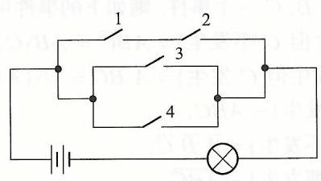

图 1.1 开关电路示意图

## 事件运算的法则

前面我们定义了事件的积 (交)、和 (并)、差及对立等运算, 与算术运算和极限运算等类似, 为分析计算较为复杂事件的概率, 我们还需熟悉事件运算的法则. 这些运算法则, 读者在例 1.1.6 和例 1.1.7 中已经有所体会了.

首先, 对于积 (交), 和 (并) 运算有

(1) 结合律 由于 $\left( {A \cup  B}\right)  \cup  C$ 和 $A \cup  \left( {B \cup  C}\right)$ 都表示 $A, B, C$ 至少发生一个, 所以

$$
\left( {A \cup  B}\right)  \cup  C = A \cup  \left( {B \cup  C}\right). \tag{1.1.1}
$$

而 $\left( {A \cap  B}\right)  \cap  C$ 和 $A \cap  \left( {B \cap  C}\right)$ 都表示 $A, B, C$ 都发生,所以

$$
\left( {A \cap  B}\right)  \cap  C = A \cap  \left( {B \cap  C}\right). \tag{1.1.2}
$$

## (2) 交换律

$$
A \cup  B = B \cup  A, A \cap  B = B \cap  A. \tag{1.1.3}
$$

(3) 分配律

$$
\left( {A \cup  B}\right)  \cap  C = \left( {A \cap  C}\right)  \cup  \left( {B \cap  C}\right). \tag{1.1.4}
$$

事实上,若 $\left( {A \cup  B}\right)  \cap  C$ 发生,则 $C$ 发生且 $A$ 和 $B$ 至少发生一个. 若 $A$ 发生,则 $A \cap  C$ 发生. 若 $B$ 发生,则 $B \cap  C$ 发生. 于是有

$$
\left( {A \cup  B}\right)  \cap  C \subset  \left( {A \cap  C}\right)  \cup  \left( {B \cap  C}\right).
$$

反过来,若 $\left( {A \cap  C}\right)  \cup  \left( {B \cap  C}\right)$ 发生,则 $A \cap  C$ 和 $B \cap  C$ 至少发生一个. 若 $A \cap  C$ 发生,则 $A$ 和 $C$ 都发生,从而 $\left( {A \cup  B}\right)  \cap  C$ 发生. 若 $\left( {B \cap  C}\right)$ 发生,则 $B$ 和 $C$ 都发生,从而 $\left( {A \cup  B}\right)  \cap  C$ 发生. 于是又有

$$
\left( {A \cup  B}\right)  \cap  C \supset  \left( {A \cap  C}\right)  \cup  \left( {B \cap  C}\right).
$$

这说明 (1.1.4) 成立.

另外, 读者还可以自己仿照以上说明, 得到

$$
\left( {A \cap  B}\right)  \cup  C = \left( {A \cup  C}\right)  \cap  \left( {B \cup  C}\right). \tag{1.1.5}
$$

## 对于积 (交)、和 (并) 及对立运算还有

## (4) 对偶律

因为 $\overline{A \cup  B}$ 表示 “不是 $A$ 和 $B$ 至少发生一个”,亦即 $A$ 和 $B$ 都不发生,所以有

$$
\overline{A \cup  B} = \bar{A} \cap  \bar{B} \tag{1.1.6}
$$

同理, 可以说明

$$
\overline{A \cap  B} = \bar{A} \cup  \bar{B} \tag{1.1.7}
$$

## 1.2 概率的定义

前已指出, 概率论在研究随机现象的统计规律时, 是试图用一个数刻画一个随机事件发生的可能性的大小, 那么这个数存在吗? 对于一个事件, 这个数应如何规定呢?

#### 1.2.1 概率的统计定义

首先, 大量的事实表明, 人们在对某一随机现象进行大量的重复观测时, 发现随着观测次数 $n$ 的增加,某一结果 $A$ (事件) 发生次数 ${n}_{A}$ 与 $n$ 比值 (频率)

$$
{f}_{n}\left( A\right)  = \frac{{n}_{A}}{n}
$$

会在某一个介于 0 和 1 之间的数 $p$ 附近摆动,我们称 $p$ 为事件 $A$ 发生频率的稳定值. 这个 $p$ 反映出事件 $A$ 发生的可能性的大小,称之为 $A$ 发生的概率,这便是概率的统计定义.

例如, 我们用同一种方式一次次地掷一枚均匀的骰子, 观察出现点数的情况. 若投掷次数 $n = {100}$,也许看不出各点出现的频率接近 $1/6$. 但若 $n = {1000}$ 或 $n = {10000}$,就会发现各点出现的频率与 $1/6$ 很接近. 在概率论发展的历史上,曾有蒲丰 (Buffen) 和皮尔逊 (Pearson) 等人具体做过投均匀硬币的试验, 从中观测到随着投掷次数的增加, 出现正面和出现反面的频率越来越接近 50%.

概率的统计定义使人们相信可以用一个介于 0 和 1 之间的数来表示一个事件发生的可能性的大小, 即事件的概率是客观存在的, 但这种定义无法用来计算事件的概率, 因为试验次数多大才算合适, 无法确定. 另外, 所谓 “频率的稳定值”, 只有在概率的公理化定义之后, 用后文介绍的 “大数定律” 才能明确阐述 (见 5.1}$ 推论 5.1.1). 于是,人们着手探讨概率的其他定义,比如针对某些特殊的随机现象, 给出计算概率的合理方法或公式, 这就是我们本节下面介绍的概率的古典定义和几何定义.

#### 1.2.2 概率的古典定义

定义 1.2.1 设随机试验只有 ${\omega }_{1},{\omega }_{2},\cdots,{\omega }_{n}$ 等 $n$ 个结果,每次试验有且只有其中的一个发生,每个结果发生的可能性大小相同. 则定义事件 $A$ 发生的概率为

$$
P\left( A\right)  = \frac{{n}_{A}}{n}, \tag{1.2.1}
$$

其中 ${n}_{A}$ 为事件 $A$ 中包含 $\left\{  {{\omega }_{1},{\omega }_{2},\cdots,{\omega }_{n}}\right\}$ 中元素的个数.

我们称这种计算概率的数学模型为古典概型.

显然,例 1.1.1 中 $A, B, C$ 的概率正是按 (1.2.1) 来计算的.

例 1.2.1 袋中有 3 只白球 2 只红球, 现从袋中任取两只球, 试求以下各事件的概率.

(1) $A = \{$ 取得的两只球都是白球 $\}$.

(2) $B = \{$ 取得的两只球都是红球 $\}$.

(3) $C = \{$ 取得的球 1 只为白球 1 只为红球 $\}$.

解 因为是 “任取” 两球, 所以取到 5 球中的任意两只球的可能性相同. 设想将 5 只球从 1 到 5 编号,那么,从中取出两只球共有 $\left( \begin{array}{l} 5 \\  2 \end{array}\right)$ 种不同的结果,所以 $n = \left( \begin{array}{l} 5 \\  2 \end{array}\right)  = \frac{5 \times  4}{2!} = {10}$.

(1)由于袋中有 3 只白球, 取出的两只白球必然在此 3 只球中抽取. 所以 ${n}_{A} = \left( \begin{array}{l} 3 \\  2 \end{array}\right)  = \frac{3 \times  2}{2!} = 3$,于是

$$
P\left( A\right)  = \frac{3}{10} = {0.3}
$$

(2) 由于袋中有两只红球,取出的两只红球就只能是这两只红球,所以 ${n}_{B} =$ 1, 于是

$$
P\left( B\right)  = \frac{1}{10} = {0.1}.
$$

(3) 由于袋中有 3 只白球两只红球, 取出的 1 只白球应在 3 只白球中抽取, 1 只红球应在两只红球中抽取. 所以, 1 只白球的取法有 3 种, 对白球的每种取法. 红球的取法有两种,所以 ${n}_{C} = \left( \begin{array}{l} 3 \\  1 \end{array}\right)  \cdot  \left( \begin{array}{l} 2 \\  1 \end{array}\right)  = 3 \times  2 = 6$,于是

$$
P\left( C\right)  = \frac{6}{10} = {0.6}
$$

注: 这里及以后用专门的记号 $\left( \begin{matrix} n \\  m \end{matrix}\right)$ 代替记号 ${\mathrm{C}}_{n}^{m} = \frac{n!}{m!\left( {n - m}\right) !}$.

例 1.2.2 试用古典概型解释划拳时叫哪个数最容易取胜.

甲乙两人划拳时,每人等可能地伸出 0,1,2,3,4,5 个指头,同时口中叫出 0,1. $2,\cdots,{10}$ 等 11 个数字,每局若有一人叫出的数字等于两人伸出指头的和数就算该人赢, 两人都叫对或两人都叫错为平局.

我们用二维数组(x, y)来记甲,乙伸出指头数,共有 $6 \times  6 = {36}$ 种出拳方法, 而

$\{$ 和数为 $0\}  = \{ \left( {0,0}\right) \}$,

$\{$ 和数为 $1\}  = \{ \left( {1,0}\right),\left( {0,1}\right) \}$,

$\{$ 和数为 $2\}  = \{ \left( {2,0}\right),\left( {0,2}\right),\left( {1,1}\right) \},$

$\{$ 和数为 $3\}  = \{ \left( {3,0}\right),\left( {0,3}\right),\left( {2,1}\right),\left( {1,2}\right) \}$,

$\{$ 和数为 $4\}  = \{ \left( {4,0}\right),\left( {0,4}\right),\left( {3,1}\right),\left( {1,3}\right),\left( {2,2}\right) \}$,

$\{$ 和数为 $5\}  = \{ \left( {5,0}\right),\left( {0,5}\right),\left( {4,1}\right),\left( {1,4}\right),\left( {3,2}\right),\left( {2,3}\right) \}$,

$\{$ 和数为 $6\}  = \{ \left( {5,1}\right),\left( {1,5}\right),\left( {4,2}\right),\left( {2,4}\right),\left( {3,3}\right) \}$,

$\{$ 和数为 $7\}  = \{ \left( {5,2}\right),\left( {2,5}\right),\left( {4,3}\right),\left( {3,4}\right) \},$

$\{$ 和数为 $8\}  = \{ \left( {5,3}\right),\left( {3,5}\right),\left( {4,4}\right) \}$,

$\{$ 和数为 $9\}  = \{ \left( {5,4}\right),\left( {4,5}\right) \},$

$\{$ 和数为 ${10}\}  = \{ \left( {5,5}\right) \}$.

所以 “叫 5 而胜” 的概率最大,

$$
P\{ \text{ 叫 }5\text{ 而胜 }\}  = \frac{6}{36} = \frac{1}{6}.
$$

#### 1.2.3 概率的几何定义

定义 1.2.2 设随机试验是往区域 $\Omega$ 里投点,点落到 $\Omega$ 中某子区域 $G$ 的可能性的大小只与 $G$ 的度量大小有关,而与 $G$ 的形状和位置无关,则定义

$$
P\left( {\text{ 点落到子区域 }G}\right)  = \frac{\left| G\right| }{\left| \Omega \right| }, \tag{1.2.2}
$$

其中 $\left| \cdot \right|$ 表示几何度量,它可以是长度,面积,体积等.

我们称这种计算概率的数学模型为几何概型.

显然,例 1.1.2 中 $A, B, C$ 的概率正是按 (1.2.2) 来计算的.

例 1.2.3 (约会问题) 两人相约在 7 点到 8 点间在某地会面, 先到者等候另一人 20 分钟, 过时即离去. 试求这两人能会面的概率.

解 依题意,两人都在 7 点到 8 点间的任意时刻到达,亦即在 $\left\lbrack  {0,{60}}\right\rbrack$ 的任意点到达,设 $x$ 和 $y$ 分别为两人到达的时刻,则两人到达的时刻为二维区域 $\left\lbrack  {0,{60}}\right\rbrack   \times  \left\lbrack  {0,{60}}\right\rbrack$ 内的所有点,而两人能会面当且仅当

$$
\left| {x - y}\right|  \leq  {20}
$$

即能会面的到达时刻点(x, y)所形成区域的面积为,边长为 60 的正方形面积,减去 2 个直角边长为 40 的直角三角形面积, 所以

$$
P\{ \text{ 两人能会面 }\}  = \frac{{60}^{2} - {40}^{2}}{{60}^{2}} = \frac{5}{9}.
$$

#### 1.2.4 概率的公理化定义

前已指出, 概率的统计定义不能用来计算事件的概率, 更不便分析复杂随机现象的统计规律, 而概率的古典定义和几何定义又是基于某些具体的随机试验模型给出的, 并且该二类模型中都有 “等可能性” 这样一个苛刻的要求. 不能用来分析计算一般随机现象的统计规律, 这促使人们设法建立一套概率的公理化体系, 以便演绎地分析各类随机现象. 经过不断探索, 直到 20 世纪 30 年代. 以俄国数学家柯尔莫哥洛夫 (A. H. Koıмогоров) 为代表的数学家建立了概率的公理化定义, 该定义的基本思想是把随机事件看作集合, 从而事件的和、积、对立及差等运算分别对应并、交、余和差等集合运算 (这一点,读者已在例 1.1.3~ 例 1.1.5 中体会到了), 而把概率定义为集合的测度, 从而把概率论建立在测度论的基础上, 也使所有的讨论都在概率空间的框架下进行. 这里对应于前述随机试验,随机事件和概率三个直观概念的分别是基本事件空间 $\Omega$ (或称样本空间),事件域 $\mathcal{F}$ (或称事件 $\sigma  -$ 代数) 和概率测度 $P$.

## 基本事件空间 $\left( \Omega \right)$

定义 1.2.3 设 $\Omega$ 为一些事件构成的集合,如果每次试验有且仅有 $\Omega$ 中的一个事件发生,则称 $\Omega$ 为基本事件空间 (或样本空间),而称 $\Omega$ 中的事件为基本事件 (或样本点)

从定义 1.2.3 中我们看到,基本事件空间 $\Omega$ 是所有基本事件构成的集合 (全集), 基本事件之间互不相容, 且它们的和为必然事件. 其他事件则包含若干个基本事件,也就是 $\Omega$ 的一个子集. 称一事件 $A$ 发生,当且仅当 $A$ 中的一个基本事件发生. 所以,称全集 $\Omega$ 为必然事件,称空集 $\varnothing$ 为不可能事件.

例 1.2.4 (例 1.1.1 续) 记 ${\omega }_{i} = \{$ 出现的点数为 $i\}, i = 1,2,\cdots,6$,则 ${\Omega }_{1} =$ $\left\{  {{\omega }_{1},{\omega }_{2},\cdots,{\omega }_{6}}\right\}$ 为一基本事件空间,其中有 6 个基本事件. $A = \left\{  {{\omega }_{1},{\omega }_{3},{\omega }_{5}}\right\}$, $B = \left\{  {{\omega }_{2},{\omega }_{4},{\omega }_{6}}\right\}$,且 ${\Omega }_{2} = \{ A, B\}$ 也是基本事件空间,其中只有两个基本事件. $\square$

## 事件域(F)

事件域是人们研究随机现象时所感兴趣的事件集合, 由于事件经运算后仍为事件, 自然要求该集合对事件的运算封闭, 即其中的事件经事件运算之后仍然在该集合中, 这一性质可以概括为如下的定义 1.2.4.

定义 1.2.4 设 $\Omega$ 是基本事件空间, $\mathcal{F}$ 是 $\Omega$ 的一些子集所构成的集合 (类). 如果满足下列条件:

(1) $\Omega  \in  \mathcal{F}$.

(2) 若 $A \in  \mathcal{F}$,则 $\bar{A} \in  \mathcal{F}$.

(3) 若 ${A}_{n} \in  \mathcal{F}, n = 1,2,\cdots$,则 $\mathop{\bigcup }\limits_{{n = 1}}^{\infty }{A}_{n} \in  \mathcal{F}$,

则称 $\mathcal{F}$ 为事件域,并称 $\mathcal{F}$ 中的元素 (即 $\Omega$ 的某个子集) 为事件.

引进事件域定义的意义还在于对于同一个随机试验, 不同的观测者关心的事件可以不同.

例 1.2.5 (例 1.1.1 和例 1.2.4 续) 沿用例 1.1.1 和例 1.2.4 的记号,则 ${\mathcal{F}}_{1} =$ $\left\{  {A \mid  A \subset  {\Omega }_{1}}\right\} ,{\mathcal{F}}_{2} = \left\{  {{\Omega }_{2},\varnothing, A, B}\right\}$ 和 ${\mathcal{F}}_{3} = \left\{  {{\Omega }_{1},\varnothing, A, B}\right\}$ 都为事件域.

概率测度(P)

概率测度是从我们日常生活中称重和量长度等度量方法抽象出来的. 比如, 两个西瓜的总重量等于各西瓜重量的和, 两个不重叠的线段的总长度等于各线段长度之和. 而称重的度量单位有千克, 磅等, 量长度的单位有米, 英尺等. 而概率测度则是事件域 $\mathcal{F}$ 中事件的一种度量,一个事件在该度量下的大小,代表该事件发生的可能性的大小.

定义 1.2.5 设 $\Omega$ 是随机试验的基本事件空间, $P\left( \cdot \right)$ 为定义在事件域 $\mathcal{F}$ 到实数集 $\mathbf{R}$ 的映射,满足:

(1) 非负性 对任一事件 $A \in  \mathcal{F}$,有 $P\left( A\right)  \geq  0$.

(2) 规范性 $P\left( \Omega \right)  = 1$.

(3) 可列可加性 若事件 ${A}_{1},{A}_{2},\cdots$,且两两互不相容,则

$$
P\left( {\mathop{\bigcup }\limits_{{i = 1}}^{\infty }{A}_{i}}\right)  = \mathop{\sum }\limits_{{i = 1}}^{\infty }P\left( {A}_{i}\right)
$$

则称 $P$ 为事件域 $\mathcal{F}$ 上的概率测度,而称 $P\left( A\right)$ 为事件 $A$ 的概率.

显然,前面给出的概率的古典定义和几何定义,都满足定义 1.2.5 中的 (1) $\sim$ (3), 从而都是概率测度.

通常,针对研究的某一随机现象,都要先确定基本事件空间 $\Omega$,事件域 $\mathcal{F}$ 和概率测度 $P$,将三者作为一个整体,我们称 $\left( {\Omega,\mathcal{F}, P}\right)$ 为概率空间,概率论的所有研究都是在这个空间上进行的.

## 概率的性质

由定义 1.2.5, 我们可以得到概率测度的一些常用的性质.

定理 1.2.1 设 $\left( {\Omega,\mathcal{F}, P}\right)$ 为概率空间,则对 $\mathcal{F}$ 中的事件,有

(1) $P\left( \varnothing \right)  = 0$.

(2) 有限可加性 若 ${A}_{1},{A}_{2},\cdots,{A}_{n}$ 两两互不相容,则

$$
P\left( {\mathop{\bigcup }\limits_{{i = 1}}^{n}{A}_{i}}\right)  = \mathop{\sum }\limits_{{i = 1}}^{n}P\left( {A}_{i}\right).
$$

(3) $P\left( \bar{A}\right)  = 1 - P\left( A\right)$.

(4) 单调性和可减性 若 $A \subset  B$,则有

$$
P\left( A\right)  \leq  P\left( B\right),\;\text{ 且 }P\left( {B \smallsetminus  A}\right)  = P\left( B\right)  - P\left( A\right).
$$

(5) 加法公式

$$
P\left( {A \cup  B}\right)  = P\left( A\right)  + P\left( B\right)  - P\left( {AB}\right).
$$

(6) 上 (下) 连续性 若 ${A}_{1} \subset  {A}_{2} \subset  \cdots  \subset  {A}_{n} \subset  \cdots$,则

$$
P\left( {\mathop{\bigcup }\limits_{{i = 1}}^{\infty }{A}_{i}}\right)  = \mathop{\lim }\limits_{{n \rightarrow  \infty }}P\left( {A}_{n}\right) \text{ (下连续性). }
$$

若 ${A}_{1} \supset  {A}_{2} \supset  \cdots  \supset  {A}_{n} \supset  \cdots$,则

$$
P\left( {\mathop{\bigcap }\limits_{{i = 1}}^{\infty }{A}_{i}}\right)  = \mathop{\lim }\limits_{{n \rightarrow  \infty }}P\left( {A}_{n}\right) \text{ (上连续性). }
$$

证明 (1) 由于

$$
\varnothing  = \varnothing  \cup  \varnothing  \cup  \cdots  \cup  \varnothing \cdots,
$$

从而,由概率 $P$ 的可列可加性,有

$$
P\left( \varnothing \right)  = P\left( \varnothing \right)  + P\left( \varnothing \right)  + \cdots  + P\left( \varnothing \right) \cdots,
$$

这说明 $P\left( \varnothing \right)  = 0$.

(2) 由于

$$
\mathop{\bigcup }\limits_{{i = 1}}^{n}{A}_{i} = \mathop{\bigcup }\limits_{{i = 1}}^{n}{A}_{i} \cup  \varnothing  \cup  \varnothing  \cup  \cdots  \cup  \varnothing \cdots,
$$

从而,由概率 $P$ 的可列可加性,有

$$
P\left( {\mathop{\bigcup }\limits_{{i = 1}}^{n}{A}_{i}}\right)  = \mathop{\sum }\limits_{{i = 1}}^{n}P\left( {A}_{i}\right)  + P\left( \varnothing \right)  + \cdots  + P\left( \varnothing \right) \cdots,
$$

但 $P\left( \varnothing \right)  = 0$,所以 (2) 成立.

(3) 由于 $A \cup  \bar{A} = \Omega$,且 $A$ 与 $\bar{A}$ 互不相容,所以由 (2) 的结论有

$$
1 = P\left( \Omega \right)  = P\left( A\right)  + P\left( \bar{A}\right).
$$

而 $P\left( A\right)$ 和 $P\left( \bar{A}\right)$ 都为有限数,所以 $P\left( \bar{A}\right)  = 1 - P\left( A\right)$.

(4) 由于 $B = A \cup  \left( {B \smallsetminus  A}\right)$,且 $A$ 与 $B \smallsetminus  A$ 互不相容,所以由 (2) 的结论有

$$
P\left( B\right)  = P\left( A\right)  + P\left( {B \smallsetminus  A}\right).
$$

由定义 1.2.5 中的 (1) 即知 (4) 成立.

(5) 由于 $A \cup  B = A \cup  \left( {B\bar{A}}\right)$,而 $B = {BA} \cup  B\bar{A}$,从而由 $P\left( {A \cup  B}\right)  =$ $P\left( A\right)  + P\left( {B\bar{A}}\right)$ 和 $P\left( B\right)  = P\left( {BA}\right)  + P\left( {B\bar{A}}\right)$ 知 (5) 成立.

(6) 这里只证下连续性 (上连续性留给读者证明). 由于 ${A}_{1} \subset  {A}_{2} \subset  \cdots  \subset$ ${A}_{n} \subset  \cdots$ 有 ${A}_{1},\left( {{A}_{2} \smallsetminus  {A}_{1}}\right),\left( {{A}_{3} \smallsetminus  {A}_{2}}\right),\cdots,\left( {{A}_{n} \smallsetminus  {A}_{n - 1}}\right),\cdots$ 等事件互不相容,且

$$
\mathop{\bigcup }\limits_{{i = 1}}^{\infty }{A}_{i} = {A}_{1} \cup  \left( {{A}_{2} \smallsetminus  {A}_{1}}\right)  \cup  \left( {{A}_{3} \smallsetminus  {A}_{2}}\right)  \cup  \cdots  \cup  \left( {{A}_{n} \smallsetminus  {A}_{n - 1}}\right)  \cup  \cdots,
$$

从而, 由概率的可列可加性有

$$
P\left( {\mathop{\bigcup }\limits_{{i = 1}}^{\infty }{A}_{i}}\right)  = P\left( {A}_{1}\right)  + P\left( {{A}_{2} \smallsetminus  {A}_{1}}\right)  + P\left( {{A}_{3} \smallsetminus  {A}_{2}}\right)  + \cdots  + P\left( {{A}_{n} \smallsetminus  {A}_{n - 1}}\right)  + \cdots
$$

$$
= \mathop{\lim }\limits_{{n \rightarrow  \infty }}\left\lbrack  {P\left( {A}_{1}\right)  + P\left( {{A}_{2} \smallsetminus  {A}_{1}}\right)  + P\left( {{A}_{3} \smallsetminus  {A}_{2}}\right)  + \cdots  + P\left( {{A}_{n} \smallsetminus  {A}_{n - 1}}\right) }\right\rbrack
$$

$$
= \mathop{\lim }\limits_{{n \rightarrow  \infty }}\left\lbrack  {P\left( {A}_{1}\right)  + P\left( {A}_{2}\right)  - P\left( {A}_{1}\right)  + P\left( {A}_{3}\right)  - P\left( {A}_{2}\right)  + \cdots  + }\right.
$$

$$
\left. {P\left( {A}_{n}\right)  - P\left( {A}_{n - 1}\right) }\right\rbrack
$$

$$
= \mathop{\lim }\limits_{{n \rightarrow  \infty }}P\left( {A}_{n}\right).
$$

例 1.2.6 一个箱子中装有 36 只灯泡, 其中 32 只为一等品, 4 只为二等品, 现从中任取 3 只, 试求取出的 3 只灯泡中至少有 1 只为二等品的概率.

解 记 $A = \{$ 取出的 3 只灯泡中至少有 1 只为二等品 $\},{B}_{i} = \{$ 取出的 3 只灯泡中恰有 $i$ 只为二等品 $\} \left( {i = 1,2,3}\right)$,则 ${B}_{1},{B}_{2},{B}_{3}$ 互不相容,且 $A = {B}_{1} \cup  {B}_{2} \cup$ ${B}_{3}$. 于是

$$
P\left( A\right)  = P\left( {B}_{1}\right)  + P\left( {B}_{2}\right)  + P\left( {B}_{3}\right).
$$

而

$$
P\left( {B}_{1}\right)  = \frac{\left( \begin{array}{l} 4 \\  1 \end{array}\right)  \cdot  \left( \begin{matrix} {32} \\  2 \end{matrix}\right) }{\left( \begin{matrix} {36} \\  3 \end{matrix}\right) } = {0.2779}
$$

$$
P\left( {B}_{2}\right)  = \frac{\left( \begin{array}{l} 4 \\  2 \end{array}\right)  \cdot  \left( \begin{matrix} {32} \\  1 \end{matrix}\right) }{\left( \begin{matrix} {36} \\  3 \end{matrix}\right) } = {0.0269}
$$

$$
P\left( {B}_{3}\right)  = \frac{\left( \begin{array}{l} 4 \\  3 \end{array}\right) }{\left( \begin{matrix} {36} \\  3 \end{matrix}\right) } = {0.0006}
$$

所以

$$
P\left( A\right)  = {0.2779} + {0.0269} + {0.0006} = {0.3054}.
$$

## 1.3 条件概率与独立性

由概率的公理化定义, 概率论的基础是抽象的测度论, 而概率论之所以有广泛的应用, 关键在于我们这里要引入的条件概率和独立性.

#### 1.3.1 条件概率

对于一个随机试验,基本事件空间为 $\Omega$,事件 $A$ 的概率 $P\left( A\right)$ 是在 $\Omega$ 的每个基本事件都可能发生的前提下, $A$ 事件发生的可能性的大小. 如果预先知道, 每次试验中事件 $B$ 一定发生,那么一次试验中,事件 $A$ 出现的概率就称为事件 $B$ 发生的条件下事件 $A$ 发生的条件概率,记为 $P\left( {A \mid  B}\right)$.

例如, 一副扑克牌中有 54 张, 除了黑桃, 红桃, 梅花, 方块各 13 张之外, 还有大王,小王各一张. 现从中任取一张,记 $A = \{$ 取得的扑克为黑桃 $\mathrm{K}\}, B = \{$ 取得的扑克为黑桃\}. 这里试验有 54 种不同的结果, 且是 “任取” 一张, 即每个结果发生的可能性相同, 所以按古典概型计算, 有

$$
P\left( A\right)  = 1/{54},\;P\left( B\right)  = {13}/{54}.
$$

如果事先知道取得的扑克一定是黑桃,即每次试验中事件 $B$ 一定发生,此时基本事件空间中就只有 13 个等可能事件,此时取得的扑克为黑桃 $\mathrm{K}$ 的 (条件) 概

率应为

$$
P\left( {A \mid  B}\right)  = \frac{1}{13} = \frac{1/{54}}{{13}/{54}} = \frac{P\left( {AB}\right) }{P\left( B\right) }.
$$

对于一般的随机试验, 以下条件概率的定义是合理的.

定义 1.3.1 设 $\left( {\Omega,\mathcal{F}, P}\right)$ 为概率空间, $A, B \in  \mathcal{F}$,且 $P\left( B\right)  > 0$,则定义

$$
P\left( {A \mid  B}\right)  = \frac{P\left( {AB}\right) }{P\left( B\right) } \tag{1.3.1}
$$

为 $B$ 发生的条件下 $A$ 发生的条件概率.

定义 1.3.1 中要求 $P\left( B\right)  > 0$,是因为 (1.3.1) 中的分母不能为零. 这一要求从概率意义上讲并不苛刻,因为若事件 $B$ 发生的可能性为零,在此条件下任意事件 $A$ 发生的 (条件) 概率也应为零. 另外,从一般理论分析的角度讲,可通过引入 “条件数学期望” 的一般定义,涵盖 $P\left( B\right)  = 0$ 的情形,这已超出本书的知识范围.

显然,若取定 $B \in  \mathcal{F}$ 且 $P\left( B\right)  > 0$,对任意事件 $A \in  \mathcal{F}$,定义

$$
{P}_{B}\left( A\right)  = P\left( {A \mid  B}\right),\;\forall A \in  \mathcal{F},
$$

则 ${P}_{B}$ 仍为 $\left( {\Omega,\mathcal{F}}\right)$ 上的概率测度,亦即 $\left( {\Omega,\mathcal{F},{P}_{B}}\right)$ 也是概率空间. 这一点,留给读者根据定义 1.2.5 去验证.

#### 1.3.2 乘法公式

将 (1.3.1) 作等式变形, 得

$$
P\left( {AB}\right)  = P\left( B\right) P\left( {A \mid  B}\right). \tag{1.3.2}
$$

公式 (1.3.2) 有重要的概率意义,我们称为乘法公式. 它告诉我们,两事件 $A$ 与 $B$ 乘积(AB)的概率等于 $B$ 的概率乘 $B$ 发生的条件下 $A$ 发生的条件概率,这个公式所反映出的思想, 在进行较为复杂的分析计算时是很有指导意义的.

例 1.3.1 盒子中装有 10 只晶体管, 4 只坏的 6 只好的. 现从盒中任取两次, 一次取出一只, 第一次取出的不放回.

(1) 若已经发现第一次取出的是好的, 试求第二只也是好晶体管的概率.

(2)试求两次取出的都是好晶体管的概率.

解 记 ${A}_{i} = \{$ 第 $i$ 次取出的是好的 $\}, i = 1,2$.

(1) 方法 1 将 10 只晶体管从 1 到 10 编号, 按古典概型及 (1.3.1) 计算.

由于是任意地,无放回地抽取,试验有 ${10} \times  9$ 种不同结果,各结果发生的可能性相同. 而第一次取出的是好晶体管的结果有 $6 \times  9$ 种,两次取出的都是好晶体管的结果有 $6 \times  5$ 种,所以

$$
P\left( {{A}_{2} \mid  {A}_{1}}\right)  = \frac{P\left( {{A}_{2}{A}_{1}}\right) }{P\left( {A}_{1}\right) } = \frac{\frac{6 \times  5}{{10} \times  9}}{\frac{6 \times  9}{{10} \times  9}} = \frac{5}{9}.
$$

方法 2 第一次取出的是好的, 第二次抽取时, 盒中共有 9 只晶体管 5 只好的 4 只坏的,从中任取一只是好的概率为 $\frac{5}{9}$,亦即

$$
P\left( {{A}_{2} \mid  {A}_{1}}\right)  = \frac{5}{9}.
$$

(2)方法 1 将 10 只晶体管从 1 到 10 编号, 按古典概型及 (1.3.1) 计算

由于是任意地,无放回地抽取,试验有 ${10} \times  9$ 种不同结果,各结果发生的可能性相同. 而两次取出的都是好晶体管的结果有 $6 \times  5$ 种结果,所以

$$
P\left( {{A}_{1}{A}_{2}}\right)  = \frac{6 \times  5}{{10} \times  9} = \frac{1}{3}.
$$

方法 2 按 (1.3.2) 计算,

$$
P\left( {{A}_{1}{A}_{2}}\right)  = P\left( {A}_{1}\right) P\left( {{A}_{2} \mid  {A}_{1}}\right)  = \frac{6}{10} \cdot  \frac{5}{9} = \frac{1}{3}.
$$

将 (1.3.2) 稍作推广, 我们得到下述定理.

定理 1.3.1 (乘法公式) 设 $\left( {\Omega,\mathcal{F}, P}\right)$ 为概率空间, ${A}_{i} \in  \mathcal{F}, i = 1,2,\cdots, n$ 且 $P\left( {{A}_{1}{A}_{2}\cdots {A}_{n - 1}}\right)  > 0$,则

$$
P\left( {{A}_{1}{A}_{2}\cdots {A}_{n}}\right)  = P\left( {A}_{1}\right) P\left( {{A}_{2} \mid  {A}_{1}}\right) P\left( {{A}_{3} \mid  {A}_{1}{A}_{2}}\right) \cdots P\left( {{A}_{n} \mid  {A}_{1}{A}_{2}\cdots {A}_{n - 1}}\right). \tag{1.3.3}
$$

证明 反复应用 (1.3.2), 有

$$
P\left( {{A}_{1}{A}_{2}\cdots {A}_{n}}\right)  = P\left( {{A}_{1}{A}_{2}\cdots {A}_{n - 1}}\right) P\left( {{A}_{n} \mid  {A}_{1}{A}_{2}\cdots {A}_{n - 1}}\right)
$$

$$
= P\left( {{A}_{1}{A}_{2}\cdots {A}_{n - 2}}\right) P\left( {{A}_{n - 1} \mid  {A}_{1}{A}_{2}\cdots {A}_{n - 2}}\right) P\left( {{A}_{n} \mid  {A}_{1}{A}_{2}\cdots {A}_{n - 1}}\right)
$$

$$
= \cdots
$$

$$
= P\left( {{A}_{1}{A}_{2}}\right) P\left( {{A}_{3} \mid  {A}_{1}{A}_{2}}\right) \cdots P\left( {{A}_{n} \mid  {A}_{1}{A}_{2}\cdots {A}_{n - 1}}\right)
$$

$$
= P\left( {A}_{1}\right) P\left( {{A}_{2} \mid  {A}_{1}}\right) P\left( {{A}_{3} \mid  {A}_{1}{A}_{2}}\right) \cdots P\left( {{A}_{n} \mid  {A}_{1}{A}_{2}\cdots {A}_{n - 1}}\right).
$$

例 1.3.2 在一副扑克牌中无放回地任取 4 张扑克, 试求以下事件的概率

(1)取出的扑克依次为黑桃,红桃,梅花和方块.

(2)取出的扑克各花色恰有一个.

(3) 取出的扑克全是黑桃.

解 (1) 由于试验是无放回抽取, 每抽取一次后扑克少 1 张, 但取走某花色的 1 张扑克后, 其他花色的扑克仍有 13 张, 所以依 (1.3.3) 有

$P\left( \text{取出的扑克依次为黑桃,红桃,梅花和方块}\right)  = \frac{13}{54} \cdot  \frac{13}{53} \cdot  \frac{13}{52} \cdot  \frac{13}{51}$.

(2)各花色的排列方式有 4 ! 种, 所以由概率的可加性有

$P\left( \text{ 取出的扑克各花色恰有一个 }\right)  = 4! \times  \frac{13}{54} \cdot  \frac{13}{53} \cdot  \frac{13}{52} \cdot  \frac{13}{51}$.

(3)从 13 张黑桃中依次取出 4 张, 从第一次到第四次抽取, 分别有 13, 12, 11, 10 种不同取法, 而对于每种取法, 所以依 (1.3.3) 有

$$
P\left( \text{ 取出的扑克全是黑桃 }\right)  = \frac{13}{54} \cdot  \frac{12}{53} \cdot  \frac{11}{52} \cdot  \frac{10}{51}.
$$

当然, 例 1.3.2 也可以用古典概型求解, 请读者具体计算一下, 以体会乘法公式的用处.

#### 1.3.3 全概率公式与贝叶斯公式

由概率的定义 1.2.5, 大家看到, 概率测度除了非负性和规范性外, 就只有可列可加性了. 可以预见, 在分析计算较为复杂的事件的概率时, 可用的性质只有可列可加性. 也就是说, 通过将较为复杂事件分解为有限多个或可列多个互不相容的较为简单事件的和, 可以将复杂事件的概率表示为简单事件的概率之和. 这个思想虽然简单, 但却是贯穿概率论学科的基本思想.

在有些随机试验中,一个较为复杂的结果 $A$ 可能与另外若干个不同时发生的结果 ${B}_{1},{B}_{2},\cdots$ 等相联系 (或者说 ${B}_{1},{B}_{2},\cdots$ 是导致 $A$ 发生的原因). 也就是说,一次试验中 $A$ 只能与 ${B}_{1},{B}_{2},\cdots$ 中某一个同时发生,且二者同时发生的概率容易计算,此时 $A$ 的概率就可以用定理 1.3.2 给出的全概率公式计算. 还可以用定理 1.3.3 给出的贝叶斯 (Bayes) 公式计算 $P\left( {A \mid  {B}_{i}}\right), i = 1,2,\cdots$.

定理 1.3.2 (全概率公式) 设 $\left( {\Omega,\mathcal{F}, P}\right)$ 为概率空间, ${B}_{i} \in  \mathcal{F}, P\left( {B}_{i}\right)  > 0, i =$ $1,2,\cdots,{B}_{i} \cap  {B}_{j} = \varnothing, i \neq  j$,且 $A \subset  \mathop{\bigcup }\limits_{{i = 1}}^{\infty }{B}_{i}$,则

$$
P\left( A\right)  = \mathop{\sum }\limits_{{i = 1}}^{\infty }P\left( {A{B}_{i}}\right)  \tag{1.3.4}
$$

$$
P\left( A\right)  = \mathop{\sum }\limits_{{i = 1}}^{\infty }P\left( {B}_{i}\right) P\left( {A \mid  {B}_{i}}\right). \tag{1.3.5}
$$

证明 由 $A \subset  \mathop{\bigcup }\limits_{{i = 1}}^{\infty }{B}_{i}$,知 $A = A\left( {\mathop{\bigcup }\limits_{{i = 1}}^{\infty }{B}_{i}}\right)$. 所以,由 ${B}_{1},{B}_{2},\cdots$ 互不相容和概率的可列可加性有

$$
P\left( A\right)  = P\left( {A\left( {\mathop{\bigcup }\limits_{{i = 1}}^{\infty }{B}_{i}}\right) }\right)  = P\left( {\mathop{\bigcup }\limits_{{i = 1}}^{\infty }A{B}_{i}}\right)
$$

$$
= \mathop{\sum }\limits_{{i = 1}}^{\infty }P\left( {A{B}_{i}}\right)  = \mathop{\sum }\limits_{{i = 1}}^{\infty }P\left( {B}_{i}\right) P\left( {A \mid  {B}_{i}}\right).
$$

例 1.3.3 袋中装有 $a$ 只白色乒乓球, $b$ 只黄色乒乓球. 现从中无放回地摸两次, 每次摸出 1 球. 试求第二次摸得黄球的概率.

解 记 $A = \{$ 第二次摸得黄球 $\}$. 由于是无放回抽取,所以第一次抽取的结果会引起第二次抽取时袋中白球和红球个数的变化, 从而影响到第二次抽取结果发生的可能性的大小,所以想到根据第一次抽取的结果来分别计算 $A$ 的概率.

记 ${B}_{1} = \{$ 第一次摸得白球 $\},{B}_{2} = \{$ 第一次摸得黄球 $\}$,则 ${B}_{1}$ 和 ${B}_{2}$ 互不相容 ${B}_{1} \cup  {B}_{2} = \Omega$,进而用 (1.3.5) 得到

$$
P\left( A\right)  = P\left( {A{B}_{1}}\right)  + P\left( {A{B}_{2}}\right)  = P\left( {B}_{1}\right) P\left( {A \mid  {B}_{1}}\right)  + P\left( {B}_{2}\right) P\left( {A \mid  {B}_{2}}\right)
$$

$$
= \frac{a}{a + b} \cdot  \frac{b}{a + b - 1} + \frac{b}{a + b} \cdot  \frac{b - 1}{a + b - 1}
$$

$$
= \frac{b}{a + b}\text{.}
$$

例 1.3.4 某工厂有四条生产线制造同一种产品, 已知各生产线的产量占总产量的比例分别为 ${15}\%,{20}\%,{30}\%$ 和 ${35}\%$,并且已知各生产线的产品不合格品率分别为 0.05,0.04,0.03 和 0.02. 现从该工厂的这一产品中任取一件,试求取得的产品为不合格品的概率.

解 记 $A = \{$ 取得的产品为不合格品 $\}$. 依题意,若知道取得的产品是哪条线生产的, 则该产品为不合格品的概率是已知的, 即为 0.05,0.04,0.03 或 0.02. 于是想到用产品来自的生产线来划分抽取一件产品的结果, 记

$$
{B}_{i} = \{ \text{取得的产品来自第}i\text{条生产线}\}, i = 1,2,3,4\text{.}
$$

由题设知 $P\left( {B}_{1}\right)  = {0.15}, P\left( {B}_{2}\right)  = {0.20}, P\left( {B}_{3}\right)  = {0.30}, P\left( {B}_{4}\right)  = {0.35}$. 而 $P\left( {A \mid  {B}_{1}}\right)  = {0.05}, P\left( {A \mid  {B}_{2}}\right)  = {0.04}, P\left( {A \mid  {B}_{3}}\right)  = {0.03}, P\left( {A \mid  {B}_{4}}\right)  = {0.02}$,从而利用 (1.3.5) 有

$$
P\left( A\right)  = {0.15} \times  {0.05} + {0.20} \times  {0.04} + {0.30} \times  {0.03} + {0.35} \times  {0.02} = {0.0315}.
$$

将 (1.3.5) 稍作变形, 我们得到定理 1.3.3.

定理 1.3.3 (贝叶斯公式) 在定理 1.3.2 的条件下,若 $P\left( A\right)  > 0$,则

$$
P\left( {{B}_{j} \mid  A}\right)  = \frac{P\left( {B}_{j}\right) P\left( {A \mid  {B}_{j}}\right) }{\mathop{\sum }\limits_{{i = 1}}^{\infty }P\left( {B}_{i}\right) P\left( {A \mid  {B}_{i}}\right) }. \tag{1.3.6}
$$

证明 由条件概率的定义和全概率公式, 即得

$$
P\left( {{B}_{j} \mid  A}\right)  = \frac{P\left( {A{B}_{j}}\right) }{P\left( A\right) } = \frac{P\left( {B}_{j}\right) P\left( {A \mid  {B}_{j}}\right) }{\mathop{\sum }\limits_{{i = 1}}^{\infty }P\left( {B}_{i}\right) P\left( {A \mid  {B}_{i}}\right) }.
$$

贝叶斯公式 (1.3.6) 是由英国学者贝叶斯首先给出的, 该公式的推导虽然简单, 但其结论却不同凡响, 甚至可以说它引领了一个学派. 在引入全概率公式时, 我们曾指出导致 $A$ 发生的原因可能是 ${B}_{1},{B}_{2},\cdots$ 等事件,且往往 ${B}_{1},{B}_{2},\cdots$ 发生的概率 $P\left( {B}_{1}\right), P\left( {B}_{2}\right),\cdots$ 是预先知道的,我们称为先验概率,这些概率值是不知 $A$ 是否发生时的无条件概率. 如果一次随机试验的结果是 $A$ 发生了,那么此时 ${B}_{1},{B}_{2},\cdots$ 发生的概率就与先前的先验概率有所不同. 这种情况在人们的生活中大量存在. 比如, 花 2 元钱买一张体育福利彩票, 得大奖的可能性很小, 但有人告诉你中奖了, 那么你得大奖的可能性就大大增加了.

另外,还可以利用贝叶斯公式的思想作推断和判断. 设 ${B}_{1},{B}_{2},\cdots$ 是导致结果 $A$ 发生的原因,那么, $A$ 的发生是由原因 ${B}_{i}$ 导致的可能性的大小就是 $P\left( {{B}_{i} \mid  A}\right)$. 比如, 医生在给一位症状为全身乏力的患者诊治时, 经验老到的医生知道何种原因 (比如贫血, 肝炎, 高血压等等) 可能会使患者全身乏力, 还知道人群中一个人患贫血, 患肝炎, 高血压等等的比率是多少, 从而他可以通过计算一个全身乏力的患者患贫血, 患肝炎, 高血压等等的条件概率的大小, 来帮助他判断该按贫血、 肝炎, 高血压等等的哪种疾病来治疗.

例 1.3.5 (系统维护人员的配置问题) 某无线电话运营商同时担负 3 种制式的通话网络. 通过市场调查知, 无线电话使用者中用各网络电话卡的百分比分别为 ${30}\%,{45}\%$ 和 ${25}\%$,且各网络出现故障的概率分别为 ${0.3}\%,{0.2}\%$ 和 ${0.4}\%$. 为最大限度地保证网络出现故障时有维护人员及时抢修, 问该如何配置维护人员的百分比.

解 记 $A = \{$ 一用户使用时网络出现故障 $\},{B}_{i} = \{$ 一用户使用第 $i$ 种网络 $\}$, $i = 1,2,3$. 由于在同一时间只能用一张电话卡通话,所以 ${B}_{1},{B}_{2},{B}_{3}$ 互不相容. 依题意,

$$
P\left( {B}_{1}\right)  = {0.30}, P\left( {B}_{2}\right)  = {0.45}, P\left( {B}_{3}\right)  = {0.25},
$$

$$
P\left( {A \mid  {B}_{1}}\right)  = {0.003}, P\left( {A \mid  {B}_{2}}\right)  = {0.002}, P\left( {A \mid  {B}_{3}}\right)  = {0.004}.
$$

从而, 由 (1.3.5) 有

$$
P\left( A\right)  = {0.30} \times  {0.003} + {0.45} \times  {0.002} + {0.25} \times  {0.004} = {0.0028}.
$$

## 由 (1.3.6) 有

$$
P\left( {{B}_{1} \mid  A}\right)  = \frac{{0.30} \times  {0.003}}{0.0028} = {0.3214},
$$

$$
P\left( {{B}_{2} \mid  A}\right)  = \frac{{0.45} \times  {0.002}}{0.0028} = {0.3214},
$$

$$
P\left( {{B}_{3} \mid  A}\right)  = \frac{{0.25} \times  {0.004}}{0.0028} = {0.3571}.
$$

所以三网络应依次按 32.14%,32.14% 和 35.71% 的百分比配置维护人员.

#### 1.3.4 事件的独立性

若对事件 $A$ 和 $B$,有 $P\left( A\right)  = P\left( {A \mid  B}\right)$,则表明一次试验中, $B$ 发生或不发生. 不影响 $A$ 发生的可能性. 或者说, $B$ 发生或不发生,不影响 $A$ 发生或不发生. 此时,由 (1.3.2) 知, $P\left( {AB}\right)  = P\left( A\right) P\left( B\right)$,这引出事件独立性的概念,它在概率论中十分重要.

定义 1.3.2 设 $\left( {\Omega,\mathcal{F}, P}\right)$ 为概率空间, $A, B \in  \mathcal{F}$,如果

$$
P\left( {AB}\right)  = P\left( A\right) P\left( B\right), \tag{1.3.7}
$$

则称 $A$ 与 $B$ 相互独立.

需要说明, 虽然我们用条件概率来直观解释独立性定义的意义, 但相互独立的定义中并不是按条件概率来定义的,尤其是不要求 $P\left( B\right) P\left( A\right)  > 0$.

另外,从独立性的直观解释来看,若 $A$ 与 $B$ 独立,则 $A$ 与 $\bar{B},\bar{A}$ 与 $B,\bar{A}$ 与 $B$ 也应独立.

事实上,因为 $A = {AB} \cup  A\bar{B}$,若 $A$ 与 $B$ 独立,则

$$
P\left( A\right)  = P\left( {AB}\right)  + P\left( {A\bar{B}}\right)  = P\left( A\right) P\left( B\right)  + P\left( {A\bar{B}}\right),
$$

即

$$
P\left( {A\bar{B}}\right)  = P\left( A\right)  - P\left( A\right) P\left( B\right)  = P\left( A\right) \left\lbrack  {1 - P\left( B\right) }\right\rbrack   = P\left( A\right) P\left( \bar{B}\right).
$$

这说明 $A$ 与 $\bar{B}$ 独立. 请读者证明另外两对事件也独立.

定义 1.3.3 设 $\left( {\Omega,\mathcal{F}, P}\right)$ 为概率空间, ${A}_{1},{A}_{2},\cdots,{A}_{n} \in  \mathcal{F}$,如果以下 ${2}^{n} -$ $n - 1$ 个等式

$$
P\left( {{A}_{i}{A}_{j}}\right)  = P\left( {A}_{i}\right) P\left( {A}_{j}\right),\;1 \leq  i < j \leq  n,
$$

$$
P\left( {{A}_{i}{A}_{j}{A}_{k}}\right)  = P\left( {A}_{i}\right) P\left( {A}_{j}\right) P\left( {A}_{k}\right),\;1 \leq  i < j < k \leq  n,
$$

......

$$
P\left( {{A}_{1}{A}_{2}\cdots {A}_{n}}\right)  = P\left( {A}_{1}\right) P\left( {A}_{2}\right) \cdots P\left( {A}_{n}\right)
$$

都成立,则称 ${A}_{1},{A}_{2},\cdots,{A}_{n}$ 相互独立.

按定义 ${1.3.3}, n$ 个事件独立,就是其中任意 $k\left( {2 \leq  k \leq  n}\right)$ 个事件乘积 (交) 的概率等于各自概率的乘积,而不仅仅是 $n$ 个事件乘积 (交) 的概率等于各自概率的乘积,这一点读者必须注意. 另外,读者容易验证,若 ${A}_{1},{A}_{2},\cdots,{A}_{n}$ 相互独立,则其中 $k\left( {2 < k < n}\right)$ 个也相互独立. 将其中 $k\left( {1 < k < n}\right)$ 个换成其对立事件所得的 $n$ 个事件也独立.

例 1.3.6 (系统的可靠性) 电器元件构成如图 1.2 和图 1.3 的两个系统 I 和 II. 假设每个元件能够正常工作的概率 (即元件的可靠性) 为 $p$,各元件是否正常工作相互独立. 试比较两个系统的可靠性 (系统正常工作的概率).

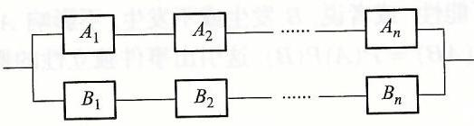

图 1.2 系统 I 示意图

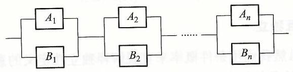

图 1.3 系统 II 示意图

解 系统 I 正常工作当且仅当元件 ${A}_{1},{A}_{2},\cdots,{A}_{n}$ 同时正常工作 (记为 ${C}_{1}$ ), 或 ${B}_{1},{B}_{2},\cdots,{B}_{n}$ 同时正常工作 (记为 ${C}_{2}$ ). 因各元件是否正常工作相互独立,有

$$
P\left( {C}_{1}\right)  = {p}^{n},\;P\left( {C}_{2}\right)  = {p}^{n},
$$

从而

${R}_{1} = P\left( \text{系统 I 正常工作}\right)  = P\left( {{C}_{1} \cup  {C}_{2}}\right)  = P\left( {C}_{1}\right)  + P\left( {C}_{2}\right)  - P\left( {{C}_{1}{C}_{2}}\right)  = {p}^{n}\left( {2 - {p}^{n}}\right)$.

系统 II 正常工作当且仅当 ${A}_{1}$ 和 ${B}_{1},{A}_{2}$ 和 ${B}_{2},\cdots,{A}_{n}$ 和 ${B}_{n}$ 等并联组同时正常工作. 而并联组 ${A}_{i}$ 和 ${B}_{i}$ 正常工作的概率为

$P\left( \right.$ 并联组 ${A}_{i}$ 和 ${B}_{i}$ 正常工作 $) = p + p - {p}^{2} = p\left( {2 - p}\right), i = 1,2,\cdots, n$,

所以

$$
{R}_{2} = P\left( \text{系统 II 正常工作}\right)  = {p}^{n}{\left( 2 - p\right) }^{n}\text{.}
$$

用数学归纳法不难证明,当 $n \geq  2$ 时, ${\left( 2 - p\right) }^{n} > 2 - {p}^{n}$,可见系统 II 比系统 I 可靠性高.

#### 1.3.5 独立试验概型

现实中遇到的大量随机试验都是可以重复进行的, 且各次试验出现何种结果互不影响. 由这种随机现象可以建立独立随机试验模型, 在该模型中, 利用事件的独立性, 有关事件的概率容易计算.

定义 1.3.4 设有随机试验 ${E}_{1},{E}_{2},\cdots,{E}_{n}$. 如果对 ${E}_{i}$ 的任意结果 (事件) ${A}_{i}, i = 1,2,\cdots, n$,都有

$$
P\left( {{A}_{1}{A}_{2}\cdots {A}_{n}}\right)  = P\left( {A}_{1}\right) P\left( {A}_{2}\right) \cdots P\left( {A}_{n}\right),
$$

则称随机试验 ${E}_{1},{E}_{2},\cdots,{E}_{n}$ 相互独立.

例 1.3.7 若试验 ${E}_{1}$ 是用同一种方法掷一枚硬币,观察出现正反面的情况. 试验 ${E}_{2}$ 是同一种方法掷一颗骰子,观察出现的点数. 如果每次试验是先掷一枚硬巾后掷一颗骰子,则硬币出现正反面和骰子出现哪个点互不影响,所以 ${E}_{1}$ 和 ${E}_{2}$ 相互独立.

感兴趣的读者, 可以写出例 1.3.7 中随机试验的概率空间, 不妨假定硬币和骰子都是均匀的.

在独立试验概型中,最常见的是 $n$ 重独立试验,即 $n$ 个试验的条件相同. 可能出现的结果也相同. 最简单的 $n$ 重独立试验是所谓的 $n$ 重伯努利 (Bernoulli) 试验,其中每个试验都只有两个可能的结果,比如成功(A)和失败 $\left( \bar{A}\right)$.

例 1.3.8 某批产品的不合格品率为 $p$. 现从该批产品中有放回地任意抽取 5 次, 每次取 1 件. 试求以下事件的概率.

(1) $A = \{$ 前两次抽得合格品后三次抽得不合格品 $\}$.

(2) $B = \{$ 抽得产品中恰有两件不合格品 $\}$.

(3) $C = \{$ 抽得产品中至少有 1 件不合格品 $\}$.

解 由于试验是有放回抽取, 所以前面抽取的结果不影响后面的抽取. 所以 5 次抽取相互独立,5 次抽取可以认为是 5 次独立的伯努利试验. 记 ${A}_{i} = \{$ 第 $i$ 次抽取得不合格品 \}, 则

$$
P\left( {A}_{i}\right)  = p,\;P\left( \overline{{A}_{i}}\right)  = 1 - p,\;i = 1,2,\cdots,5.
$$

(1)由试验的独立性有

$$
P\left( A\right)  = P\left( {{A}_{1}{A}_{2}\overline{{A}_{3}}\overline{{A}_{4}}\overline{{A}_{5}}}\right)  = {p}^{3} \cdot  {\left( 1 - p\right) }^{2}.
$$

(2)由于两只不合格品出现在 5 次抽取中的哪两次,共有 $\left( \begin{array}{l} 5 \\  2 \end{array}\right)$ 种情况,每种情况出现的概率相同, 所以

$$
P\left( B\right)  = \left( \begin{array}{l} 5 \\  2 \end{array}\right)  \cdot  {p}^{2} \cdot  {\left( 1 - p\right) }^{3}.
$$

(3) 由于 \{抽得产品中至少有 1 不合格品球\}的对立事件是 \{5 次都取得合格

品\}, 所以

$$
P\left( C\right)  = 1 - P\left( {5\text{ 次都取得合格品 }}\right)  = 1 - {\left( 1 - p\right) }^{5}.
$$

由例 1.3.8 的解题思路, 容易证得下面的定理 1.3.4.

定理 1.3.4 设伯努利试验中 $P\left( A\right)  = p$,则 $n$ 重独立伯努利试验中恰好成

功 $k$ 次的概率为

$$
b\left( {k;n, p}\right)  = \left( \begin{array}{l} n \\  k \end{array}\right) {p}^{k}{\left( 1 - p\right) }^{n - k}. \tag{1.3.8}
$$

例 1.3.9 设某种药物对某种疾病的治愈率为 0.8. 现有 10 名患这种疾病的病人都用此药, 求其中至少有 6 人治愈的概率.

解 将每名患者用药并观察是否治愈作为一次试验, 那么 10 名患者用药就是 10 次独立伯努利试验, 所以由定理 1.3.4 有

$$
P\left( {\text{至少有 }6\text{ 人治愈 }}\right)  = \mathop{\sum }\limits_{{k = 6}}^{{10}}\left( \begin{matrix} {10} \\  k \end{matrix}\right) {0.8}^{k} \cdot  {0.2}^{{10} - k} \approx  {0.97}.
$$

## 第一章小结与注记

(1)本章明确了概率论与数理统计学科的研究对象是随机现象的统计规律, 该学科被广泛应用于分析和解决各种实际问题和自然科学问题. 它与其他数学分支最大的区别是用确定性的数学研究非确定性的现象, 因而有其特殊的思维方式. 概率论与数理统计将随机现象的观测和结果归结为随机试验和随机事件, 而把结果发生的不确定性用概率来刻画, 这就是本学科研究随机现象的基本模型.

(2)本章中引入的事件的运算及运算法则,就如同实数的运算及运算法则,极限的运算及运算法则等等, 对于计算概率和分析推理是至关重要的. 尤其是将一个较为复杂的事件表示为若干个互不相容事件的和, 是经常需要的或迫不得已的, 因为概率测度只有一个可用的性质: 可列可加性.

(3) 概率的公理化定义是概率论学科发展的重要的里程碑, 它为我们分析研究随机现象提供了基本框架, 它将随机试验、随机事件和概率等三个直观概念抽象为基本事件空间 $\Omega$ (或称样本空间),事件域 $\mathcal{F}$ (或称事件 $\sigma  -$ 代数) 和概率测度 $P$,从而把概率论建立在严密的测度论基础之上.

(4)可以说, 概率论与测度论的分水岭是概率论中引入了条件概率与独立性的概念. 特别是独立性 (事件的独立性和后文介绍的随机变量的独立性). 它是初等概率论与数理统计讨论中最核心的条件, 也就说, 其中绝大部分讨论都在此条件下进行的.

(4.1) 利用条件概率, 我们得到两个求概率的重要公式 ——全概率公式和 ♫ 叶斯公式. 对于这两个公式, 我们宁愿希望读者将其理解为两种概率思相 而不是简单的计算公式.

(4.2) 独立试验模型中我们学到了一种计算概率的方法. 但这里只是一种理想化模型或假定, 因为现实中随机现象的大部分都不是独立试验. 研究非独立试验模型需要更高深的数学知识和工具.

## 第一章习题

1.1. 试对下列随机试验写出相应的基本事件空间.

(1) 将一颗骰子掷两次, 分别观测朝上一面出现的点数.

(2)观察某商店一天中到达的顾客数.

(3) 在一批灯管中任意抽取一只, 测试它的寿命.

(4) 在区间 $\left\lbrack  {a, b}\right\rbrack$ 中随机地取两个数字.

1.2.一个袋中装有 12 个球, 分别标有号码 1 至 12, 现从中任取一球. 试写出基本事件空间,并用基本事件空间 $\Omega$ 的子集表示如下事件.

$A = \{$ 所取出球的号码为奇数 $\}$.

$B = \{$ 所取出球的号码不大于 8 $\}.$

$C = \{$ 所取出球的号码为 3 的倍数 $\}$.

1.3. 设 $A, B, C$ 为三个事件,用 $A, B, C$ 的运算表示下列各事件.

(1) 仅 $A$ 发生.

(2)至少有一个事件发生.

(3) 恰有两个事件发生.

1.4. 记 ${A}_{i} =$ “第 $i$ 次击中目标”, $i = 1,2,\cdots,5$,记 ${B}_{i} =$ “ 5 次射击中恰有 $i$ 次击中目怀”, $i = 0,1,\cdots,5$. 试给出下列各对事件的关系.

(1) $\mathop{\bigcup }\limits_{{i = 1}}^{5}{A}_{i}$ 与 $\mathop{\bigcup }\limits_{{i = 1}}^{5}{B}_{i}$. (2) ${B}_{0}$ 与 $\mathop{\bigcup }\limits_{{i = 1}}^{5}{A}_{i}$. (3) ${B}_{3}$ 与 ${A}_{1}{A}_{2}{\bar{A}}_{3}{A}_{4}{\bar{A}}_{5}$. (4) ${B}_{1}$ 与 ${B}_{2}$.

1.5. 设基本事件空间 $\Omega  = \left\{  {{\omega }_{1},{\omega }_{2},\cdots,{\omega }_{10}}\right\} , A = \left\{  {{\omega }_{1},{\omega }_{3},{\omega }_{5},{\omega }_{6}}\right\} , B = \left\{  {{\omega }_{1},{\omega }_{2},{\omega }_{4},{\omega }_{5}}\right\}$ $\left. {{\omega }_{6},{\omega }_{8}}\right\} , C = \left\{  {{\omega }_{6},{\omega }_{8},{\omega }_{9},{\omega }_{10}}\right\}$,求

(1) $\bar{A} \cap  B$. (2) $B \smallsetminus  \overline{\left( \bar{A} \cap  \bar{C}\right) }$.

1.6. 化简事件: (1) $B \smallsetminus  \overline{\left( \bar{A} \cup  \bar{B}\right) }$. (2) $\overline{(\bar{A} \cup  }$ (2) $\overline{\left( {\bar{A} \cup  B}\right)  \cap  \left( {A \cup  B}\right) }$.

1.7. 设盒中有 6 个白球, 4 个红球, 现从盒中任取 4 个球, 求取到两个红球两个白球的

概率. 1.8. 设盒中有 6 个白球, 4 个红球, 5 个黑球, 现从盒中任取 4 个球, 求取到两个红球两

个白球的概率. 1.9. 同时抛掷两颗均匀骰子,求事件 $A = \{$ 两颗骰子出现的点数之和为 6 $\}$ 的概率.

1.10. 设盒中有 6 个白球, 4 个红球, 10 个黑球, 现不放回地从袋中把球一个一个地摸出来,求第 $k\left( {k = 1,\cdots,{20}}\right)$ 次摸到红球的概率.

1.11. 从 5 双不同尺码的鞋子中任取 4 只, 4 只鞋子中至少有两只配成一双的概率是多

少? 1.12. 已知 10 个电子管中有 7 个正品和 3 个次品, 每次任意抽取 1 个来测试, 测后不放回, 直至把 3 个次品都测到为止, 求需要测 7 次的概率.

1.13. 任意地取两个不大于 1 的正数,试求其乘积小于 $1/2$ 的概率.

1.14. 一个质地均匀的陀螺, 在其圆周的半圈上均匀地标明刻度 1, 另外半圈上均匀地刻上区间 $\left\lbrack  {0,1}\right\rbrack$ 上的诸数,在桌面上旋转它,求当它停下来时,圆周与桌面接触处的刻度位于区间 $\left\lbrack  {{0.2},{0.5}}\right\rbrack$ 内的概率.

1.15. 随机地向半圆 $0 < y < \sqrt{{2ax} - {x}^{2}}$ ( $a$ 为正常数) 内掷一点,点落在半圆内任何区或的概率与区域的面积成正比,则原点和该点的连线与 $x$ 轴的夹角小于 $\frac{\pi }{4}$ 的概率是多少?

1.16. 设 $A, B, C$ 为任意三个事件,试证明:

$P\left( {A \cup  B \cup  C}\right)  = P\left( A\right)  + P\left( B\right)  + P\left( C\right)  - P\left( {AB}\right)  - P\left( {AC}\right)  - P\left( {BC}\right)  + P\left( {ABC}\right).$

1.17. 假设三个人的准考证混放在一起,现在将其随意地发给三个人. 试求事件 $A = \{$ 没有一个人领到自己准考证\}的概率.

1.18. 现从袋中抽取 5 个球,记 ${A}_{i}$ 为事件 “抽取的 5 个球中有 $i$ 个不是红球”,已知 $P\left( {A}_{i}\right)  = {iP}\left( {A}_{0}\right), i = 1,2,\cdots,5$. 求下列各事件的概率:

(1) 抽取的 5 个球均为红球.

(2)抽取的 5 个球至少有两个红球.

1.19. 已知 $P\left( A\right)  = {0.4}, P\left( B\right)  = {0.25}, P\left( {A \smallsetminus  B}\right)  = {0.25}$,求 $P\left( {A \cup  B}\right)$ 之值.

1.20. 已知 $P\left( A\right)  = {0.35}, P\left( B\right)  = {0.3}, P\left( C\right)  = {0.2}, P\left( {AB}\right)  = P\left( {AC}\right)  = {0.15}, P\left( {BC}\right)  =$ 0. 求事件 “ $A, B, C$ 全不发生” 的概率.

1.21. 设事件 $A$ 与 $B$ 互不相容,且 $P\left( A\right)  = p, P\left( B\right)  = q$,求下列事件的概率: $P\left( {AB}\right)$,

1.22. 设事件 $A, B, C$ 两两独立, $P\left( A\right)  = P\left( B\right)  = P\left( C\right)  = a$,且 $A \cap  B \cap  C = \varnothing$,证明: (1) $P\left( {A \cup  B \cup  C}\right)  \leq  \frac{3}{4}$. (2) $a \leq  \frac{1}{2}$.

1.23. 已知 $P\left( {\bar{B} \mid  A}\right)  = \frac{1}{3}, P\left( {AB}\right)  = \frac{1}{5}$,求 $P\left( A\right)$.

1.24. 已知 $P\left( A\right)  = {0.7}, P\left( B\right)  = {0.4}, P\left( \overline{AB}\right)  = {0.8}$,试求 $P\left( {A \mid  A \cup  B}\right)$ 之值.

1.25. 设 $A, B$ 为两随机事件,已知 $P\left( A\right)  = {0.7}, P\left( B\right)  = {0.5}, P\left( {A \cup  B}\right)  = {0.8}$,试求 $P\left( {A \mid  \bar{A} \cup  \bar{B}}\right)$ 之值.

1.26. 掷两颗骰子, 在已知两颗骰子出现的点数之和为 7 的条件下, 求其中一颗出现点数

1.27. 假设箱中原来只有一个球, 此球是黑球还是白球的概率均为 0.5. 现在首先将一个白球放入箱中, 然后从箱中随意取出一个球, 在取出的球是白球条件下, 试求箱中原来的球为

1.28. 袋中有一个红球和一个白球, 从袋中随机摸出一球, 如果取出的球是红球, 则把此气球放回装中开且再加进一个红球, 然后从袋中再摸一个球, 如果还是红球, 则仍把此红球放回转中开且再加进一个红球, 如此继续进行, 直到摸出白球为止, 求第 9 次取出白球的概率

1.29. 袋中有 3 只白球和 4 只红球, 现从中随机地取两只球, 在采用不放回地摸球方式下, 求下列各事件的概率:

(1)两只球均为白球.

(2)第 1 只球为红球而第 2 只为白球.

(3) 红、白球各 1 只.

取 1 个, 求 1.30. 盒中装有 5 个产品, 其中 3 个一等品, 2 个二等品, 从中不放回地抽取产品, 每次

(1)取两次, 两次都取得一等品的概率.

(2)取两次, 第二次取得一等品的概率.

(3) 取两次, 已知第二次取得一等品, 求第一次取得的是二等品的概率

1.31. 某射击队共有 20 名射手, 其中一级射手 4 人, 二级射手 8 人, 三级射手 7 人 四级射手 1 人,一、三、四级射手能通过预选赛进入正式比赛的概率分别为 0.9.0.7.0.5 0.2, 求任选一名射手能进入正式比赛的概率.

1.32. 有 $a, b, c$ 三个盒子, $a$ 盒中有 4 个白球和 2 个黑球, $b$ 盒中有 2 个白球和 1 个黑球, $c$ 盒中有 3 个白球和 3 个黑球. 今掷一颗骰子来选定盒子,若出现 1,2,3 点则洗 $a$ 盒右出现 4 点则选 $b$ 盒,若出现 5,6 点则选 $c$ 盒. 在选出的盒中任取一球.

( 1 )求取出白球的概率.

(2)若取出的是白球,求此球来自 $c$ 盒的条件概率.

1.33. 一袋中有 5 个红球, 5 个白球, 从袋中任意取出 1 个球, 然后放进 1 个另一颜色的球 (例如取出 1 个白球就放进 1 个红球). 如此取球, 已知第一次、第二次取出的两个球具有相同的颜色, 求它们都是白球的概率.

1.34. 某超市销售某种电子灭蚊器共 10 个, 其中有 3 个次品, 7 个合格品。某顾客选购时已售出 2 个, 该顾客从剩余 8 个中任选一台, 已知该顾客购到的是合格品. 求已出售的质个中一个为次品一个为合格品的概率.

1.35. 一袋中装有 $a$ 只红球, $b$ 只白球,每次从袋中任取一球,记下该球颜色后将其放回袋中,同时再放进 $c$ 只与该球同色的球,如此进行下去,记 ${A}_{k} = \left\{  \begin{array}{l} \text{ 第 }k\text{ 次取到红球 } \end{array}\right.$,试证明. $P\left( {A}_{k}\right)  = \frac{m}{a + b}.$

1.36. 一袋中装有 $a$ 只红球, $b$ 只白球, $c$ 个黑球,每次从袋中任取一球. 记下该球颜色后将其放回袋中,同时再放进 $d$ 只与该球同色的球,如此进行下去,记 ${A}_{k} = \{$ 第 $k$ 次取到红球\}. 试求 $P\left( {{A}_{1} \mid  {A}_{k}}\right)$ 之值.

1.37. 某实验室在器皿中繁殖成 $k$ 个细菌的概率为 $\frac{{5}^{k}}{k!}{\mathrm{e}}^{-5}, k = 0,1,2,\cdots$ 并设所繁殖的每个细菌为甲类菌的概率为 0.4, 为乙类菌的概率为 0.6, 求下列事件的概率: (1) 器皿中所繁殖的全部是乙类菌的概率. (2) 已知所繁殖的全部是乙类菌, 求细菌个数为 3 的概率. 1.38. 设事件 $A, B, C$ 相互独立,试证明: (1) 事件 $\bar{A}, B, C$ 相互独立. (2)事件 $A$ 与 $\bar{B} \cup  C$ 相互独立. 1.39 盒子中有 10 个球, 其中 4 个白球, 4 个黑球, 2 个红球. 现从盒中有放回地摸取 3 次, 每次只取一个球, 求

(1) 取到的 3 个球中恰好有两个白球的概率.

(2)取到的 3 个球中至少有一个白球的概率.

1.40. 做 10 次独立重复试验,每次试验中成功的概率为 $p$,试求下列事件的概率:

(1)10 次试验中恰有 3 次成功.

(2)获得第 3 次成功恰好出现在第 10 次试验.

1.41. 甲、乙、丙三个射手,他们每次击中目标的概率分别为0.4,0.5,0.7. 现三人同时独立向目标射击一次, 试求至少有一人命中目标的概率.

1.42. 假定具有症状 $S$ 的疾病有 ${d}_{1},{d}_{2},{d}_{3}$ 三种. 现从 20000 份患有疾病 ${d}_{1},{d}_{2},{d}_{3}$ 的病史中, 统计得到下列数据:

<table><tr><td>疾病</td><td>人数出现症状 $S$ 的人数</td></tr><tr><td>${d}_{1}$</td><td>7500 8000</td></tr><tr><td>${d}_{2}$</td><td>4000 5000</td></tr><tr><td>${d}_{3}$</td><td>3500 7000</td></tr></table>

试求当一个具有症状 $S$ 的病人前来就诊时,它患有疾病 ${d}_{1},{d}_{2},{d}_{3}$ 的可能性各有多大? 若没有其他可依据的诊断手段的情况下, 诊断该病人患有这三种病中的哪一种较为合适?

# 第二章 一维随机变量及其分布

我们知道,概率测度 $P$ 是定义在事件域 $\mathcal{F}$ 到实数集 $\mathbf{R}$ 的映射,它不是经典的函数, 为有效地应用分析数学工具来分析和研究随机现象, 人们自然地想到把基本事件 $\omega$ 变换成数 (这就是我们要介绍的随机变量),进而把所关心事件的概率用随机变量的分布函数值来表达.

## 2.1 随机变量的概念及其分布函数

#### 2.1.1 随机变量的概念

大量的随机试验, 其结果就是某一个量的取值或与某一数量相联系. 比如掷一颗骰子,观察出现的点数,在事件 ${\omega }_{i} = \{$ 出现的点数为 $i\} \left( {i = 1,2,\cdots,6}\right)$. 自然地与 “点数” 这个量相联系. 再比如, 观测一批电视机的使用寿命, 其结果就是 “寿命” 这一数量的某个取值. 但试验结束之前, 无法预知该数量取何值, 所以自然地将该数量称为 “随机变量”.

另外, 对于那些试验结果不明显地与数量有联系的随机试验, 可以人为地规定一个结果对应于某一量的取值, 从而将一个事件与该量的某取值相对应, 该事件的概率就是该量取某值的概率. 例如, 检测一批产品中的一件产品是合格品还是不合格品. 此试验的结果有两个,它们是 $A = \{$ 受检产品为不合格品 $\}$ 和 $\bar{A} = \{$ 受检产品为合格品 $\}$. 如果我们规定一个量 $X$ 与试验结果相对应,当 $A$ 发生时, $X$ 取值 $1, A$ 发生时, $X$ 取值 0,则 $P\left( A\right)  = P\left( {X = 1}\right), P\left( \bar{A}\right)  = P\left( {X = 0}\right)$. 这里在检测结束之前,也不知道 $X$ 取何值,所以 $X$ 也是随机变量.

综上所述, 我们要引进的 “随机变量” 就是随机取值的量, 即随机变量的取值由随机试验的结果 (事件) 来确定. 我们将其概括为如下的定义.

定义 2.1.1 设 $\left( {\Omega,\mathcal{F}, P}\right)$ 为概率空间,称映射 $X : \Omega  \rightarrow  \mathbf{R}$ 为随机变量 如果对任意 $x \in  \mathbf{R}$,有

$$
\{ \omega  \mid  X\left( \omega \right)  \leq  x\}  \in  \mathcal{F}. \tag{2.1.1}
$$

随机变量的直观意义是在做试验之前无法预知 $X$ 取何值. 至于定义中要求满足 (2.1.1), 正是后文定义随机变量的分布函数的需要, 进而我们所关心的事件的概率可用分布函数的值来表达.

对于随机事件 $A \in  \mathcal{F}$,若定义

$$
X\left( \omega \right)  = \left\{  \begin{array}{ll} 1, & \text{ 如果 }\omega  \in  A, \\  0, & \text{ 如果 }\omega  \in  \Omega  \smallsetminus  A. \end{array}\right.
$$

则 $X$ 为随机变量,且 $P\left( A\right)  = P\left( {X = 1}\right)$.

例 2.1.1 (例 1.2.5 续) 沿用例 1.2.5 的记号,定义映射 $X : {\Omega }_{1} \rightarrow  \mathbf{R}$ 为 $X\left( {\omega }_{i}\right)  = i, i = 1,2,\cdots,6$. 则 $\{ \omega  \in  \Omega  : X\left( \omega \right)  \leq  2\}  = \left\{  {{\omega }_{1},{\omega }_{2}}\right\}   \notin  {\mathcal{F}}_{3}$,从而 $X$ 不是 $\left( {{\Omega }_{1},{\mathcal{F}}_{3}, P}\right)$ 上的随机变量.

#### 2.1.2 随机变量的分布函数

引入了随机变量之后, 我们仍然关心的是如何分析计算有关事件的概率, 这个问题可以通过引入随机变量的分布函数来解决.

定义 2.1.2 设 $\left( {\Omega,\mathcal{F}, P}\right)$ 为概率空间, $X$ 为随机变量, $X$ 的分布函数 ${F}_{X}$ 定义为

$$
{F}_{X}\left( x\right)  = P\left( {\{ \omega  \in  \Omega  : X\left( \omega \right)  \leq  x\} }\right),\;\forall x \in  \mathbf{R}. \tag{2.1.2}
$$

以后将 $\{ \omega  \in  \Omega  : X\left( \omega \right)  \leq  x\}$ 简写为 $\left( {X \leq  x}\right)$.

由此定义, 显然有,

$$
P\left( {a < X \leq  b}\right)  = {F}_{X}\left( b\right)  - {F}_{X}\left( a\right),\;\forall a < b \in  \mathbf{R}. \tag{2.1.3}
$$

再利用概率测度上下连续性, 容易证明下列事实:

$$
P\left( {X = a}\right)  = {F}_{X}\left( a\right)  - {F}_{X}\left( {a - 0}\right),\;\forall a \in  \mathbf{R},
$$

$$
P\left( {a \leq  X \leq  b}\right)  = {F}_{X}\left( b\right)  - {F}_{X}\left( {a - 0}\right),\;\forall a < b \in  \mathbf{R},
$$

$$
P\left( {a \leq  X < b}\right)  = {F}_{X}\left( {b - 0}\right)  - {F}_{X}\left( {a - 0}\right),\;\forall a < b \in  \mathbf{R},
$$

$$
P\left( {a < X < b}\right)  = {F}_{X}\left( {b - 0}\right)  - {F}_{X}\left( a\right),\;\forall a < b \in  \mathbf{R}.
$$

这些事实说明, 引入随机变量的分布函数之后, 我们所关心的有关事件的概率都可以用其分布函数来表达, 也就是通常所说的, 随机变量的所有统计特性都可用其分布函数来刻画.

另外, 利用概率测度上下连续性可以证明分布函数的下述性质.

定理 2.1.1 设 $\left( {\Omega,\mathcal{F}, P}\right)$ 为概率空间, $X$ 为随机变量,其分布函数为 ${F}_{X}$, 则

(i) $0 \leq  {F}_{X}\left( x\right)  \leq  1,\forall x \in  \mathbf{R}$.

(ii) 对任 ${x}_{1} < {x}_{2}$,有 ${F}_{X}\left( {x}_{1}\right)  \leq  {F}_{X}\left( {x}_{2}\right)$,且 $\mathop{\lim }\limits_{{x \rightarrow  {x}_{1}}}{F}_{X}\left( x\right)  = {F}_{X}\left( {x}_{0}\right)$.

(iii) $\mathop{\lim }\limits_{{x \rightarrow   - \infty }}{F}_{X}\left( x\right)  = 0,\mathop{\lim }\limits_{{x \rightarrow  \infty }}{F}_{X}\left( x\right)  = 1$.

我们常称定理 2.1.1 中所述分布函数的这三条性质为随机变量分布函数的特征性质,也就是说,若有定义于 $\mathbf{R}$ 上的实函数 $F$ 满足性质 (i) - (iii). 则可以构造一个概率空间 $\left( {\Omega,\mathcal{F}, P}\right)$ 和其上的随机变量 $X$,使 ${F}_{X}\left( x\right)  = F\left( x\right),\forall x \in  \mathbf{R}$. 这个事实称为柯尔莫哥洛夫存在性定理.

现实生活中见到的随机变量有两类, 一类是随机变量取至多可数多个不同的值, 另一类是它取值于实数的全体或某个区间. 对于这两类随机变量, 其统计特性更容易刻画, 我们在后续两节分别加以介绍.

## 2.2 一维离散型随机变量

有些随机变量, 它只取有限多个或可列多个不同的值, 我们称这类随机变量为离散型随机变量.

一般地,设离散型随机变量 $X$ 的取值为 ${a}_{1},{a}_{2},\cdots,{a}_{n},\cdots$. 且已知

$$
P\left( {X = {a}_{i}}\right)  = {p}_{i},\;i = 1,2,\cdots.
$$

通常记为

$$
X \sim  \left( \begin{array}{lllll} {a}_{1} & {a}_{2} & \cdots & {a}_{n} & \cdots \\  {p}_{1} & {p}_{2} & \cdots & {p}_{n} & \cdots  \end{array}\right),
$$

并称上式右端为 $X$ 的分布列,称 $\left( {{p}_{1},{p}_{2},\cdots,{p}_{n},\cdots }\right)$ 为概率分布. 它显然满足以下两个性质:

(1) ${p}_{i} \geq  0, i = 1,2,\cdots$.

(2) $\mathop{\sum }\limits_{{i = 1}}^{\infty }{p}_{i} = 1$.

此时, $X$ 的分布函数为

$$
{F}_{X}\left( x\right)  = P\left( {X \leq  x}\right)  = \mathop{\sum }\limits_{{{a}_{i} \leq  x}}{p}_{i}. \tag{2.2.1}
$$

其图形为一右连续的阶梯函数,在点 ${a}_{i}$ 处提高 ${p}_{i}$.

另外,对任意 $a < b$,有

$$
P\left( {a < X \leq  b}\right)  = \mathop{\sum }\limits_{{a < {a}_{i} \leq  b}}{p}_{i}. \tag{2.2.2}
$$

下面我们介绍几类有重要实际应用背景的离散型分布.

#### 2.2.1 二项分布

如果一个随机变量 $X$ 取值为 $0,1,2,\cdots, n$,且

$$
P\left( {X = k}\right)  = \left( \begin{array}{l} n \\  k \end{array}\right) {p}^{k}{\left( 1 - p\right) }^{n - k},\;k = 0,1,2,\cdots, n, \tag{2.2.3}
$$

我们称 $X$ 服从二项分布. 记为 $X \sim  B\left( {n, p}\right)$ ( $\mathrm{R}$ 软件中的分布名为 binom),其中的 $n$ 和 $p\left( {0 \leq  p \leq  1}\right)$ 称为参数. 如果 $n = 1$,则 $X$ 只取 0 和 1 两个值,我们称 $X$ 服从两点分布. 当 $n = 1$ 时,如果 $p = 0$,则 $P\left( {X = 0}\right)  = 1$; 如果 $p = 1$,则 $P\left( {X = 1}\right)  = 1$. 这两种情况都退化为单点分布 (即 $X$ 取某个常数 $C$ 的概率为 1 ), 取值已没有随机性了.

另外,显然有 $P\left( {X = k}\right)  \geq  0$,且由二项式定理有

$$
\mathop{\sum }\limits_{{k = 0}}^{n}P\left( {X = k}\right)  = \mathop{\sum }\limits_{{k = 0}}^{n}\left( \begin{array}{l} n \\  k \end{array}\right) {p}^{k}{\left( 1 - p\right) }^{n - k} = {\left\lbrack  p + \left( 1 - p\right) \right\rbrack  }^{n} = 1.
$$

可见 (2.2.3) 给出的分布确实为概率分布. 正是因为 $\left( \begin{array}{l} n \\  k \end{array}\right) {p}^{k}{\left( 1 - p\right) }^{n - k}$ 是 $\lbrack {px} +$ $\left( {1 - p}\right) {\rbrack }^{n}$ 这个二项式展开中 ${x}^{k}$ 的系数,我们称(2.2.3)给出的分布为二项分布.

现实中有不少随机试验,其观测结果都服从二项分布. 回忆 $n$ 重伯努利试验, 如果每次试验 “成功” 的概率为 $p$,令 $X$ 为 $n$ 次试验中成功的次数,则由 (1.3.8) 知, $X \sim  B\left( {n, p}\right)$,且 $P\left( {X = k}\right)  = b\left( {k;n, p}\right)$. 另外,由例 1.3.8 知,若一批产品的不合格品率为 $p$,则从中无放回抽取的 $n$ 件中不合格品的件数,也服从 $B\left( {n, p}\right)$.

当 $X \sim  B\left( {n, p}\right)$ 时,对任意 $a < b$,有

$$
P\left( {a \leq  X \leq  b}\right)  = \mathop{\sum }\limits_{{a \leq  k \leq  b}}b\left( {k;n, p}\right)  = \mathop{\sum }\limits_{{a \leq  k \leq  b}}\left( \begin{array}{l} n \\  k \end{array}\right) {p}^{k}{\left( 1 - p\right) }^{n - k}
$$

和

$$
P\left( {X \leq  b}\right)  = \mathop{\sum }\limits_{{k \leq  b}}b\left( {k;n, p}\right)  = \mathop{\sum }\limits_{{k \leq  b}}\left( \begin{array}{l} n \\  k \end{array}\right) {p}^{k}{\left( 1 - p\right) }^{n - k}.
$$

利用 $\mathrm{R}$ 软件提供的内部函数 binom,容易计算相关事件的概率. 对 $X \sim$ $B\left( {n, p}\right)$,可调用内部函数 $\operatorname{pbinom}\left( {\mathrm{x},\mathrm{n},\mathrm{p}}\right)$ 来计算 $P\left( {X \leq  x}\right)$,用 $\operatorname{dbinom}\left( {\mathrm{k},\mathrm{n},\mathrm{p}}\right)$ 来计算 $P\left( {X = k}\right)$. 请读者注意这两个函数中 $\mathrm{p}$ 和 $\mathrm{d}$ 的区别.

例 2.2.1 设 $X \sim  B\left( {{10},{0.9}}\right)$,试求 $P\left( {X = 8}\right), P\left( {X \leq  8}\right), P\left( {3 \leq  X \leq  9}\right)$.

解 我们借助 $\mathrm{R}$ 软件来计算.

$$
P\left( {X = 8}\right)  = \left( \begin{matrix} {10} \\  8 \end{matrix}\right) {0.9}^{8} \cdot  {0.1}^{2} = \operatorname{dbinom}\left( {8,{10},{0.9}}\right)  = {0.1937102}.
$$

$$
P\left( {X \leq  8}\right)  = \mathop{\sum }\limits_{{k \leq  8}}\left( \begin{matrix} {10} \\  k \end{matrix}\right) {0.9}^{k}{\left( 1 - {0.9}\right) }^{{10} - k}
$$

$$
= \text{pbinom}\left( {8,{10},{0.9}}\right)  = {0.2639011}\text{.}
$$

而

$$
P\left( {3 \leq  X \leq  9}\right)  = \mathop{\sum }\limits_{{3 \leq  k \leq  9}}\left( \begin{matrix} {10} \\  k \end{matrix}\right) {0.9}^{k}{\left( 1 - {0.9}\right) }^{{10} - k}
$$

$$
= \operatorname{pbinom}\left( {9,{10},{0.9}}\right)  - \operatorname{pbinom}\left( {2,{10},{0.9}}\right)  = {0.6513124}\text{.}
$$

例 2.2.2 已知发射一枚地对空导弹可击中来犯敌机的概率为 0.96 问在同样的条件下需发射多少枚导弹才能保证至少有一枚导弹击中来犯敌机的概率人于 0.999?

解 设需发射 $n$ 枚导弹,由题意各枚导弹是否击中相互独立,所以击中的代数 $X \sim  B\left( {n,{0.96}}\right)$,从而

$$
P\left( {X \geq  1}\right)  = 1 - {\left( 1 - p\right) }^{n} = 1 - {0.04}^{n} > {0.999},
$$

由此得

$$
n > \frac{\lg {0.001}}{\lg {0.04}} = {2.15}
$$

即至少需发射 3 枚导弹.

定理 2.2.1 设 $X \sim  B\left( {n, p}\right)$,当 $\left( {n + 1}\right) p$ 为整数 $m$ 时, $X$ 取 $m$ 和 $m - 1$ 的概率最大,且 $b\left( {m;n, p}\right)  = b\left( {m - 1;n, p}\right)$; 当 $\left( {n + 1}\right) p$ 不为整数时, $X$ 取 $\left( {n + 1}\right) n$ 的整数部分的概率最大.

这个定理的证明,可经计算比值 $\frac{b\left( {k;n, p}\right) }{b\left( {k - 1;n, p}\right) }$ 随 $k$ 变化的情况得证,这里略去. 但请读者调用内部函数 $\operatorname{dbinom}\left( {\mathrm{k},\mathrm{n},\mathrm{p}}\right)$,通过给定参数 $n$ 和 $p$ 体验一下该事头.

例 2.2.3 (鱼塘中有多少条鱼?) 为了估计鱼塘中有多少条鱼,鱼塘主先从鱼塘中网起 100 条鱼做上记号后, 放回鱼塘中, 过了一段时间 (使有记号的鱼和无记号的鱼混合均匀) 后, 从鱼塘中网起一网鱼, 共 80 条, 其中有记号的鱼有两余. 试估计鱼塘中有多少条鱼.

解 设鱼塘中有 $N$ 条鱼,则从中捞起一条鱼,它有记号的概率为 $\frac{100}{100}$. 由于国塘中鱼的数量较大,可以近似地认为,一网捞出 80 条与有放回地捞取 80 条的试验条件相同. 所以,捞出的 80 条鱼中有记号的个数近似服从 $B\left( {{80},\frac{100}{N}}\right)$.

按照人们的生活体验,小概率事件在一次试验中几乎不发生 (这是用概率论子科分析研究实际问题的基本思想之一),亦即,若一次试验中事件 $A$ 发生了. 则 $A$ 友生的可能性较大,甚至认为 $A$ 发生的可能性最大. 基于这种理念可以认为 80 条中 2 条有记号的可能性最大. 而由定理 2.2.1 的结论, $\left( {{80} + 1}\right)  \times  \frac{100}{N}$ 发生的

可能性最大. 所以令

$$
\left( {{80} + 1}\right)  \times  \frac{100}{N} = 2,
$$

得 $N = {4050}$.

#### 2.2.2 泊松分布

如果一个随机变量 $X$ 取非负整数值,且

$$
P\left( {X = k}\right)  = \frac{{\mathrm{e}}^{-\lambda }{\lambda }^{k}}{k!},\;k = 0,1,2,\cdots, \tag{2.2.4}
$$

则称 $X$ 服从泊松 (Poisson) 分布,记为 $X \sim  \operatorname{Pios}\left( \lambda \right),\mathrm{R}$ 软件中的分布名为 pois. 它由法国数学家泊松在 1837 年, 作为二项分布的近似分布而引入的 (见定理 2.2.2). 此分布也因他而得名.

由熟知的展开式 ${\mathrm{e}}^{x} = 1 + x + \frac{{x}^{2}}{2!} + \cdots  + \frac{{x}^{n}}{n!} + \cdots$ 知,(2.2.4) 给出的分布确实是概率分布.

一般认为, “稀有事件” (在有限事件内只发生有限多次, 在极短时间内至多发生一次) 发生的次数服从泊松分布. 例如, 在公共服务领域, 一段时间内查号台收到的呼唤次数、公共汽车站来到的乘客数等等, 在自然科学中, 一段时间内放射性物质分裂落到某区域的质点数、一段时间内出现的彗星数等等, 都可认为服从泊松分布. 泊松分布是概率论刻画随机现象的一种十分重要的分布.

泊松注意到在二项分布中,当参数 $n$ 很大而 $p$ 很小时,概率 $\left( \begin{array}{l} n \\  k \end{array}\right) {p}^{k}{\left( 1 - p\right) }^{n - k}$ 的计算相当麻烦, 于是想用一种容易计算的分布来近似, 这就是下面的泊松定理.

定理 2.2.2 (泊松定理) 设随机变量 $X \sim  B\left( {n,{p}_{n}}\right),0 < {p}_{n} < 1$ 与 $n$ 有关, 且满足 $\mathop{\lim }\limits_{{n \rightarrow  \infty }}n{p}_{n} = \lambda$,则

$$
\mathop{\lim }\limits_{{n \rightarrow  \infty }}P\left( {X = k}\right)  = \mathop{\lim }\limits_{{n \rightarrow  \infty }}\left( \begin{array}{l} n \\  k \end{array}\right) {p}_{n}^{k}{\left( 1 - {p}_{n}\right) }^{n - k} = \frac{{\mathrm{e}}^{-\lambda }{\lambda }^{k}}{k!},\;k = 0,1,2,\cdots.
$$

证明 记 ${\lambda }_{n} = n{p}_{n}$,则

$$
b\left( {k;n,{p}_{n}}\right)  = \left( \begin{array}{l} n \\  k \end{array}\right) {p}_{n}^{k}{\left( 1 - {p}_{n}\right) }^{n - k}
$$

$$
= \frac{n\left( {n - 1}\right) \cdots \left( {n - k + 1}\right) }{k!}{\left( \frac{{\lambda }_{n}}{n}\right) }^{k}{\left( 1 - \frac{{\lambda }_{n}}{n}\right) }^{n - k}
$$

$$
= \frac{{\lambda }_{n}^{k}}{k!}\left( {1 - \frac{1}{n}}\right) \left( {1 - \frac{2}{n}}\right) \cdots \left( {1 - \frac{k - 1}{n}}\right) {\left( 1 - \frac{{\lambda }_{n}}{n}\right) }^{n - k}.
$$

由于对固定的 $k$,有

$$
\mathop{\lim }\limits_{{n \rightarrow  \infty }}{\lambda }_{n}^{k} = {\lambda }^{k},\;\mathop{\lim }\limits_{{n \rightarrow  \infty }}{\left( 1 - \frac{{\lambda }_{n}}{n}\right) }^{n - k} = {\mathrm{e}}^{-\lambda },
$$

及

因此

$$
\mathop{\lim }\limits_{{n \rightarrow  \infty }}\left( {1 - \frac{1}{n}}\right) \left( {1 - \frac{2}{n}}\right) \cdots \left( {1 - \frac{k - 1}{n}}\right)  = 1,
$$

$$
\mathop{\lim }\limits_{{n \rightarrow  \infty }}b\left( {k;n,{p}_{n}}\right)  = \frac{{\mathrm{e}}^{-\lambda }{\lambda }^{k}}{k!}.
$$

例 2.2.4 假如一位孕妇生三胞胎的概率为 ${10}^{-4}$,求在 100000 个孕妇中有 0,1,2 次生三胞胎的概率.

解 按二项分布的 $n = {100000}$ 和 $p = {10}^{-4}$,并用 $\mathrm{R}$ 软件计算有

$b\left( {0,{100000},{0.0001}}\right)  = \operatorname{dbinom}\left( {0,{100000},{0.0001}}\right)  = {4.537723} \times  {10}^{-5},$

$b\left( {1,{100000},{0.0001}}\right)  = \operatorname{dbinom}\left( {1,{100000},{0.0001}}\right)  = {0.0004538177},$

$b\left( {2,{100000},{0.0001}}\right)  = \operatorname{dbinom}\left( {2,{100000},{0.0001}}\right)  = {0.002269293}.$

再按泊松逼近, $\lambda  = {np} = {10}$ 和 $\mathrm{R}$ 软件计算有

$$
b\left( {0,{100000},{0.0001}}\right)  = \text{ dpois }\left( {0,{10}}\right)  = {4.539993} \times  {10}^{-5},
$$

$$
b\left( {1,{100000},{0.0001}}\right)  = \text{ dpois }\left( {1,{10}}\right)  = {0.0004539993},
$$

$$
b\left( {2,{100000},{0.0001}}\right)  = \operatorname{dpois}\left( {2,{10}}\right)  = {0.002269996}.
$$

可见, 这里用泊松分布逼近二项分布的近似程度很令人满意.

例 2.2.5 (合作问题) 设有同类设备 80 台, 各台是否正常工作相互独立. 每口及生故障的概率为 0.01, 并且一台设备出现故障时需安排一人来维修 试求

( 1 )一人负责维修 20 台设备时,设备发生故障无人维修的概率

(2)由二人共同负责维修 80 台设备时,设备发生故障无人维修的概率.

解 (1) 一人负责维修 20 台设备时,设 $X$ 为同一时刻发生故障的设备数时间必要和 $X \sim  B\left( {{20},{0.01}}\right)$. 由于一人在同一时刻只能维修一台设备,所以发生取得无人维修, 当且仅当同一时刻至少有 2 台设备出现故障. 所以, 所求概率为

$$
P\left( {X \geq  2}\right)  = 1 - P\left( {X \leq  1}\right)
$$

$$
= 1 - \operatorname{pbinom}\left( {1,{20},{0.01}}\right)
$$

$$
= {0.01685934}\text{.}
$$

(若用泊松分布近似, $\lambda  = {0.2}$,有 $P\left( {X \geq  2}\right)  = 1 - P\left( {X \leq  1}\right)  = 1 - \operatorname{ppois}\left( {1,{0.2}}\right)  =$

(2)由三人共同负责维修 80 台设备时,设 $Y$ 为同一时刻发生故障的设备数, 则由题意知 $Y \sim  B\left( {{80},{0.01}}\right)$. 由于一人在同一时刻只能维修一台设备,所以及生故障无人维修, 当且仅当同一时刻至少有 4 台设备出现故障. 所以, 所求概率为

$$
P\left( {Y \geq  4}\right)  = 1 - P\left( {X \leq  3}\right)
$$

$$
= 1 - \operatorname{pbinom}\left( {3,{80},{0.01}}\right)
$$

$$
= {0.008659189}.
$$

(若用泊松分布近似, $\lambda  = {0.8}$,有 $P\left( {Y \geq  4}\right)  = 1 - P\left( {Y \leq  3}\right)  = 1 - \operatorname{ppois}\left( {3,{0.8}}\right)  =$

可见, 三个人共同负责维修 80 台设备 (即平均每人负责约 27 台设备), 比一个人单独负责维修 20 台更有保障, 既节约了人力又提高了设备保障率.

#### 2.2.3 几何分布

我们考虑一种随机试验, 它是一次次独立地做伯努利试验, 直到第一次成功为止,设每次试验成功的概率为 $p$,记首次成功时已做试验的次数为 $X$. 则自伏成功出现在第 $k$ 次试验,当且仅当前 $k - 1$ 次失败而第 $k$ 次成功,所以由试验的

独立性知,

$$
P\left( {X = k}\right)  = {\left( 1 - p\right) }^{k - 1}p,\;k = 1,2,\cdots. \tag{2.2.5}
$$

由于几何级数: $1 + \left( {1 - p}\right)  + {\left( 1 - p\right) }^{2} + \cdots  + {\left( 1 - p\right) }^{k} + \cdots  = \frac{1}{1 - \left( {1 - p}\right) } = \frac{1}{p}$, 可见(2.2.5) 给出的分布为概率分布, 因此也称(2.2.5) 的分布为几何分布, 记为 $X \sim  \operatorname{Geo}\left( p\right),\mathrm{R}$ 软件中的分布名为 geom.

例 2.2.6 设一地下采矿面有 5 个可以升到地面的通道. 由于事故发生,5 个通道中只有一个可以逃生, 且没有照明, 遇险者只能随意地在 5 个通道选一个出走. 若途中发现该通道不通, 则返回出险地点后再随意选一个通道出走. 试求: (1)第三次选择通道才成功出走的概率；

(2)成功出走时已经选择其他通道的次数不大于 6 的概率.

解 由于每次选择都是在 5 个通道中选取, 所以各次是否选对通道相互独立,且每次选对通道的概率为 $\frac{1}{5}$,记 $X$ 为成功出走时已选过的通道数,所以 $X \sim$ Geo $\left( \frac{1}{5}\right)$.

第三次选择通道才成功出走的概率为

$$
P\left( {X = 3}\right)  = {\left( \frac{4}{5}\right) }^{2} \cdot  \frac{1}{5} = \operatorname{dgeom}\left( {2,{0.2}}\right)  = {0.128}.
$$

(2)成功出走时已经选择其他通道的次数不大于 6 的概率为

$$
P\left( {X \leq  6}\right)  = \mathop{\sum }\limits_{{k = 1}}^{6}{\left( \frac{4}{5}\right) }^{k - 1} \cdot  \frac{1}{5} = \operatorname{pgeom}\left( {5,{0.2}}\right)  = {0.737856}.
$$

几何分布有一个独特的性质是它的 “无记忆性”,即已知第 $k$ 次还未成功,那么从第 $k + 1$ 次开始,首次成功出现在哪一次与 $k$ 无关. 也就是说,若 $X \sim  \operatorname{Geo}\left( p\right)$, 则

$$
P\left( {X = k + n \mid  X > k}\right)  = P\left( {X = n}\right). \tag{2.2.6}
$$

事实上,

$$
P\left( {X = k + n \mid  X > k}\right)  = \frac{P\left( {\left( {X = k + n}\right)  \cap  \left( {X > k}\right) }\right) }{P\left( {X > k}\right) }
$$

$$
= \frac{P\left( {X = k + n}\right) }{P\left( {X > k}\right) } = \frac{P\left( {X = k + n}\right) }{\mathop{\sum }\limits_{{l = k + 1}}^{\infty }P\left( {X = l}\right) }
$$

$$
= \frac{{\left( 1 - p\right) }^{k + n - 1}p}{\mathop{\sum }\limits_{{l = k + 1}}^{\infty }{\left( 1 - p\right) }^{l - 1}p} = \frac{{\left( 1 - p\right) }^{n + k - 1}p}{{\left( 1 - p\right) }^{k}}
$$

$$
= {\left( 1 - p\right) }^{n - 1}p = P\left( {X = n}\right).
$$

这说明(2.2.6) 正确.

读者也可以证明

$$
P\left( {X > k + n \mid  X > k}\right)  = P\left( {X > n}\right). \tag{2.2.7}
$$

其实还可以证明几何分布是离散型随机变量中唯一的具有无记忆性的概率分布.

常用的离散型分布还有不少, 比如超几何分布、负二项分布 (帕斯卡 (Pascal) 分布) 等等, 这里不一一列举了. 下面我们介绍几类连续型分布.

## 2.3 一维连续型随机变量

现实生活中经常遇到的另一类随机试验, 它的结果可能取全体实数值或实数轴上的一个区间, 而且其分布函数可以写为另外一个函数的积分, 此时随机变量的分布特性可由一非负可积函数的积分来表示.

定义 2.3.1 设 $\left( {\Omega,\mathcal{F}, P}\right)$ 为概率空间, $X$ 为其上的随机变量, ${F}_{X}$ 为 $X$ 的分布函数. 如果存在非负函数 ${f}_{X}$,使得

$$
{F}_{X}\left( x\right)  = {\int }_{-\infty }^{x}{f}_{X}\left( t\right) \mathrm{d}t,\;x \in  \left( {-\infty,\infty }\right), \tag{2.3.1}
$$

## 则称 $X$ 为连续型随机变量,称 ${f}_{X}$ 为 $X$ 的分布密度函数.

由微积分学知识可知,在 ${f}_{X}$ 的连续点 $x$ 上有 ${f}_{X}\left( x\right)  = {F}_{X}^{\prime }\left( x\right)$.

由分布函数的性质可知,对任意分布密度函数 ${f}_{X}$ 有

$$
{f}_{X}\left( x\right)  \geq  0,\;\forall x \in  \left( {-\infty,\infty }\right). \tag{2.3.2}
$$

$$
{\int }_{-\infty }^{\infty }{f}_{X}\left( x\right) \mathrm{d}x = 1 \tag{2.3.3}
$$

反过来,对于定义在 $\left( {-\infty,\infty }\right)$ 的函数 $f$,满足 (2.3.2) 和 (2.3.3). 若令

$$
F\left( x\right)  = {\int }_{-\infty }^{x}f\left( t\right) \mathrm{d}t,\;x \in  \left( {-\infty,\infty }\right),
$$

则 $F$ 一定是某随机变量的分布函数.

由 (2.1.3) 立刻得到

$$
P\left( {a < X \leq  b}\right)  = {F}_{X}\left( b\right)  - {F}_{X}\left( a\right)  = {\int }_{a}^{b}{f}_{X}\left( x\right) \mathrm{d}x,\;\forall a < b \in  \mathbf{R}. \tag{2.3.4}
$$

而对于 $P\left( {X = a}\right)$,因为对任 $h > 0$ 有

$$
P\left( {X = a}\right)  \leq  P\left( {a - h < X \leq  a}\right)  = {\int }_{a - h}^{a}{f}_{X}\left( x\right) \mathrm{d}x,
$$

所以

$$
0 \leq  P\left( {X = a}\right)  \leq  \mathop{\lim }\limits_{{h \rightarrow  {0}^{ + }}}{\int }_{a - h}^{a}{f}_{X}\left( x\right) \mathrm{d}x = 0.
$$

即

$$
P\left( {X = a}\right)  = 0,\;\forall x \in  \left( {-\infty,\infty }\right). \tag{2.3.5}
$$

这表明连续型随机变量取任意单点值的概率为零, 这一点与离散型随机变量截然不同. 也就是说, 对于连续型随机变量, 它的分布特性不可能通过列举它取每个单点值的概率来表示.

另外,由于对 ${\Delta x} > 0$

$$
{f}_{X}\left( x\right) {\Delta x} \approx  {\int }_{x}^{x + {\Delta x}}{f}_{X}\left( t\right) \mathrm{d}t = {F}_{X}\left( {x + {\Delta x}}\right)  - {F}_{X}\left( x\right)  = P\left( {x < X \leq  x + {\Delta x}}\right).
$$

这说明若分布密度函数 ${f}_{X}$ 在某点 $x$ 处取值较大,则随机变量 $X$ 取 $x$ 附近值的概率也较大. 所以用分布密度函数来描述连续型随机变量的分布特性, 与用分布列描述离散型随机变量是类似的.

例 2.3.1 设随机变量 $X$ 的分布密度函数为

$$
{f}_{X}\left( x\right)  = \frac{a}{1 + {x}^{2}},\;x \in  \left( {-\infty,\infty }\right).
$$

(1) 试确定 $a$ 的值.

(2) 试求 $X$ 的分布函数.

(3) 试求 $P\left( {{X}^{2} \leq  1}\right)$.

解 (1) 根据 (2.3.2),首先 $a > 0$,另外

$$
{\int }_{-\infty }^{\infty }{f}_{X}\left( x\right) \mathrm{d}x = {\int }_{-\infty }^{\infty }\frac{a}{1 + {x}^{2}}\mathrm{\;d}x
$$

$$
= {\left. a\arctan \left( x\right) \right| }_{-\infty }^{\infty }
$$

$$
= a \cdot  \pi  = 1\text{.}
$$

故有 $a = \frac{1}{\pi }$.

(2) 由 (2.3.1) 有

$$
{F}_{X}\left( x\right)  = {\int }_{-\infty }^{x}{f}_{X}\left( t\right) \mathrm{d}t = \frac{1}{\pi }{\int }_{-\infty }^{x}\frac{1}{1 + {t}^{2}}\mathrm{\;d}t
$$

$$
= \frac{1}{\pi }\left( {\arctan \left( x\right)  + \frac{\pi }{2}}\right)  = \frac{1}{2} + \frac{1}{\pi }\arctan \left( x\right).
$$

(3) 由于 $\left( {{X}^{2} \leq  1}\right)  = \left( {-1 \leq  X \leq  1}\right)$,所以

$$
P\left( {{X}^{2} \leq  1}\right)  = P\left( {-1 \leq  X \leq  1}\right)  = \frac{1}{\pi }{\int }_{-1}^{1}\frac{1}{1 + {t}^{2}}\mathrm{\;d}t
$$

$$
= \frac{1}{\pi }\left( {\arctan \left( 1\right)  - \arctan \left( {-1}\right) }\right)  = \frac{1}{2}.
$$

例 2.3.1 中的分布通常称为标准柯西分布. 下面我们介绍几类有重要实际应用背景的连续型分布.

#### 2.3.1 均匀分布

如果连续型随机变量 $X$ 的分布密度函数为

$$
{f}_{X}\left( x\right)  = \left\{  \begin{array}{ll} \frac{1}{b - a}, & \text{ 当 }x \in  \left\lbrack  {a, b}\right\rbrack , \\  0, & \text{ 当 }x \notin  \left\lbrack  {a, b}\right\rbrack , \end{array}\right.  \tag{2.3.6}
$$

则称 $X$ 服从 $\left\lbrack  {a, b}\right\rbrack$ 上的均匀分布,记为 $X \sim  U\left\lbrack  {a, b}\right\rbrack ,\mathrm{R}$ 软件中的分布名为 unif. 其分布函数为

$$
{F}_{X}\left( x\right)  = {\int }_{-\infty }^{x}f\left( t\right) \mathrm{d}t = \left\{  \begin{array}{ll} 0, & \text{ 当 }x < a, \\  \frac{x - a}{b - a}, & \text{ 当 }a \leq  x \leq  b, \\  1, & \text{ 当 }x > b. \end{array}\right.
$$

由 (2.3.6) 可知, ${f}_{X}$ 在 $\left\lbrack  {a, b}\right\rbrack$ 上取常值,所以对任意满足 $a \leq  c < d \leq  b$ 的 $c$

和 $d$ 有

$$
P\left( {c \leq  X \leq  d}\right)  = {\int }_{c}^{d}\frac{1}{b - a}\mathrm{\;d}x = \frac{d - c}{b - a}.
$$

这就是均匀分布名称的由来. 另外,几何概型中,若投点都落入区间 $\left\lbrack  {a, b}\right\rbrack$,记 $X$ 为落点坐标,则 $X \sim  U\left\lbrack  {a, b}\right\rbrack$.

在计算机数字计算的浮点运算中, 如果要求精度保留在小数点后第五位, 小数点后第六位作四舍五入处理, 在对最后的数值计算结果作精度分析时, 往往假定每步计算时,数值的近似值 $\widehat{x}$ 与精确值 $x$ 之间的误差 $\varepsilon  = x - \widehat{x} \sim  U\lbrack  - {0.5} \times$ $\left. {{10}^{-5},{0.5} \times  {10}^{-5}}\right\rbrack$.

#### 2.3.2 指数分布

若连续型随机变量 $X$ 的分布密度函数为

$$
{f}_{X}\left( x\right)  = \left\{  \begin{array}{ll} \lambda {\mathrm{e}}^{-{\lambda x}}, & \text{ 当 }x > 0, \\  0, & \text{ 当 }x \leq  0, \end{array}\right.  \tag{2.3.7}
$$

则称 $X$ 服从指数分布,参数为 $\lambda \left( {\lambda  > 0}\right)$,记作 $X \sim  \operatorname{Exp}\left( \lambda \right),\mathrm{R}$ 软件中的分布名为 $\exp$,其分布函数为

$$
{F}_{X}\left( x\right)  = \left\{  \begin{array}{ll} 1 - {\mathrm{e}}^{-{\lambda x}}, & \text{ 当 }x > 0, \\  0, & \text{ 当 }x \leq  0. \end{array}\right.  \tag{2.3.8}
$$

在解决实际问题时, 一般认为 “稀有事件” (在有限事件内只发生有限多次, 在极短时间内至多发生一次) 发生的事件间隔服从指数分布, 另外, 电器元件的寿命也近似地认为服从指数分布.

例 2.3.2 某窗口接待一位顾客的服务时间 $T$ 服从参数为 $\frac{1}{10}$ 的指数分布,

即

$$
{f}_{T}\left( x\right)  = \left\{  \begin{array}{ll} \frac{1}{10}{\mathrm{e}}^{-\frac{1}{10}x}, & \text{ 当 }x > 0, \\  0, & \text{ 当 }x \leq  0. \end{array}\right.
$$

假设一次服务时间超过 15 分钟, 顾客即评价为 “不满意”. 试求

(1) 10 位顾客中恰有两位评价为不满意的概率.

(2)10 位顾客中最多有两位评价为不满意的概率.

(3) 10 位顾客中至少有两位评价为不满意的概率.

解 先求出一位顾客评价为 “不满意” 的概率. 我们有

$$
P\left( {T > {15}}\right)  = {\int }_{15}^{\infty }\frac{1}{10}{\mathrm{e}}^{-\frac{1}{10}x}\mathrm{\;d}x = {\left. \left( -{\mathrm{e}}^{-\frac{1}{10}x}\right) \right| }_{15}^{\infty } = {\mathrm{e}}^{-\frac{3}{2}} \approx  {0.2231}.
$$

若调用 $\mathrm{R}$ 软件中的内部函数 $\exp$ 有

$$
P\left( {T > {15}}\right)  = 1 - P\left( {T \leq  {15}}\right)  = 1 - \operatorname{pexp}\left( {{15},{0.1}}\right)  \approx  {0.2231302}.
$$

由题设每位顾客的服务时间同服从参数为 $\frac{1}{10}$ 的指数分布,且各位顾客的服务时间相互独立,所以 10 位顾客中评价为不满意的顾客数 $Y \sim  B({10}, P(T >$ 15)), 从而

(1) $P\left( {{10}\text{位顾客中恰有 2 位评价为不满意}}\right)$

$$
= P\left( {Y = 2}\right)
$$

$$
= \left( \begin{matrix} {10} \\  2 \end{matrix}\right) P{\left( T > {15}\right) }^{2}P{\left( T \leq  {15}\right) }^{8}
$$

$$
= \operatorname{dbinom}\left( {2,{10},{0.2231302}}\right)
$$

$$
= {0.2972454}\text{.}
$$

(2) $P({10}$ 位顾客中最多有 2 位评价为不满意的概率.)

$$
= P\left( {Y \leq  2}\right)
$$

$$
= \mathop{\sum }\limits_{{k = 0}}^{2}\left( \begin{matrix} {10} \\  2 \end{matrix}\right) P{\left( T > {15}\right) }^{k}P{\left( T \leq  {15}\right) }^{{10} - k}
$$

$$
= \operatorname{pbinom}\left( {2,{10},{0.2231302}}\right)
$$

$$
= {0.607299}\text{.}
$$

(3) $P({10}$ 位顾客中至少有 2 位评价为不满意的概率.)

$$
= P\left( {Y \geq  2}\right)
$$

$$
= 1 - P\left( {Y = 0}\right)  - P\left( {Y = 1}\right)
$$

$$
= 1 - \operatorname{pbinom}\left( {1,{10},{0.2231302}}\right)
$$

$$
= {0.6899464}\text{.}
$$

指数分布有一个雷同于几何分布的独特的性质, 就是它的无记忆性, 即若 $X \sim  \operatorname{Exp}\left( \lambda \right)$,则对任 $t > 0, s > 0$ 有

$$
P\left( {X > t + s \mid  X > s}\right)  = P\left( {X > t}\right). \tag{2.3.9}
$$

事实上, 由条件概率的定义和 (2.3.8) 有

$$
P\left( {X > t + s \mid  X > s}\right)  = \frac{P\left( {X > t + s, X > s}\right) }{P\left( {X > s}\right) }
$$

$$
= \frac{P\left( {X > t + s}\right) }{P\left( {X > s}\right) } = \frac{{\mathrm{e}}^{-\lambda \left( {t + s}\right) }}{{\mathrm{e}}^{-{\lambda s}}} = {\mathrm{e}}^{-{\lambda t}} = P\left( {X > t}\right).
$$

这说明 (2.3.9) 成立. 还可以证明, 指数分布是连续型随机变量中唯一的具有无记忆性的概率分布.

#### 2.3.3 正态分布

正态分布是最常见的、在理论分析和实际应用中都十分重要的分布.

若连续型随机变量 $X$ 的分布密度函数为

$$
{f}_{X}\left( x\right)  = \frac{1}{\sqrt{2\pi }\sigma }{\mathrm{e}}^{-\frac{{\left( x - \mu \right) }^{2}}{2{\sigma }^{2}}},\; - \infty  < x < \infty,
$$

其中 $\mu \left( {-\infty  < \mu  < \infty }\right)$ 和 $\sigma \left( {\sigma  > 0}\right)$ 为参数,正态分布记为 $X \sim  N\left( {\mu,{\sigma }^{2}}\right),\mathrm{R}$ 软件中的分布名为 norm. 特别地,若 $X \sim  N\left( {0,1}\right)$,则称 $X$ 服从标准正态分布.

正态分布的密度函数如图 2.1 所示,它关于 $x = \mu$ 对称, $\sigma$ 越小则曲线越陡峭, $\sigma$ 越大则曲线越平缓. 我们将在 4.1.1 节中说明 $\mu$ 和 $\sigma$ 的概率意义.

图 2.1 正态分布密度函数图

对于标准正态分布 $N\left( {0,1}\right)$,分布密度函数通常记为 $\phi$,即

$$
\phi \left( x\right)  = \frac{1}{\sqrt{2\pi }}{\mathrm{e}}^{-\frac{{x}^{2}}{2}},\; - \infty  < x < \infty, \tag{2.3.10}
$$

分布函数通常记为 $\Phi$,即

$$
\Phi \left( x\right)  = \frac{1}{\sqrt{2\pi }}{\int }_{-\infty }^{x}{\mathrm{e}}^{-\frac{{t}^{2}}{2}}\mathrm{\;d}t,\; - \infty  < x < \infty, \tag{2.3.11}
$$

由于 (2.3.11) 右端被积函数为偶函数, 所以

$$
\Phi \left( {-x}\right)  = 1 - \Phi \left( x\right). \tag{2.3.12}
$$

大家知道, $\int {\mathrm{e}}^{-{x}^{2}}\mathrm{\;d}x$ 的原函数没有显式表达式,(2.3.11) 右端的积分都经数值计算制成表以供查阅,现今如用 $\mathrm{R}$ 软件,用命令 pnorm(x) 即得. 另外,设 $X \sim  N\left( {\mu,{\sigma }^{2}}\right)$,则 $X$ 的统计特性,都可用标准正态分布函数来表达,即

$$
P\left( {a < X < b}\right)  = \Phi \left( \frac{b - \mu }{\sigma }\right)  - \Phi \left( \frac{a - \mu }{\sigma }\right). \tag{2.3.13}
$$

事实上,对任意 $a < b$,有

$$
P\left( {a < X < b}\right)  = \frac{1}{\sqrt{2\pi }\sigma }{\int }_{a}^{b}{\mathrm{e}}^{-\frac{{\left( x - \mu \right) }^{2}}{2{\sigma }^{2}}}\mathrm{\;d}x
$$

$$
= \frac{1}{\sqrt{2\pi }}{\int }_{a}^{b}{\mathrm{e}}^{-\frac{{\left( x - \mu \right) }^{2}}{2{\sigma }^{2}}}\mathrm{\;d}\left( \frac{x - \mu }{\sigma }\right)
$$

$$
= \frac{1}{\sqrt{2\pi }}{\int }_{\frac{a - \mu }{\sigma }}^{\frac{b - \mu }{\sigma }}{\mathrm{e}}^{-\frac{{t}^{2}}{2}}\mathrm{\;d}t
$$

$$
= \Phi \left( \frac{b - \mu }{\sigma }\right)  - \Phi \left( \frac{a - \mu }{\sigma }\right).
$$

我们将这个重要的事实总结为如下命题.

命题 2.3.1 设 $X \sim  N\left( {\mu,{\sigma }^{2}}\right)$,令 $Y = \frac{X - \mu }{\sigma }$,则 $Y \sim  N\left( {0,1}\right)$.

下节末我们还将证明这一事实.

例 2.3.3 设 $X \sim  N\left( {-1,4}\right)$,试求 $P\left( {-5 \leq  X < 1}\right), P\left( {-2 \leq  X \leq  2}\right)$ $P\left( {\left| X\right|  < 1}\right), P\left( {\left| X\right|  \geq  \frac{3}{2}}\right).$

有 解 由题设, $\mu  =  - 1,\sigma  = 2$,由 (2.3.12),(2.3.13) 和 $\mathrm{R}$ 软件中的函数 pnorm,

$$
P\left( {-5 \leq  X < 1}\right)  = \Phi \left( \frac{1 - \left( {-1}\right) }{2}\right)  - \Phi \left( \frac{-5 - \left( {-1}\right) }{2}\right)
$$

$$
= \Phi \left( 1\right)  - \Phi \left( {-2}\right)
$$

$$
= \Phi \left( 1\right)  + \Phi \left( 2\right)  - 1
$$

$$
= \operatorname{pnorm}\left( 1\right)  + \operatorname{pnorm}\left( 2\right)  - 1
$$

$$
= {0.8185946},
$$

$$
P\left( {-2 \leq  X \leq  2}\right)  = \Phi \left( \frac{2 - \left( {-1}\right) }{2}\right)  - \Phi \left( \frac{-2 - \left( {-1}\right) }{2}\right)
$$

$$
= \Phi \left( \frac{3}{2}\right)  - \Phi \left( {-\frac{1}{2}}\right)
$$

$$
= \operatorname{pnorm}\left( {3/2}\right)  - \operatorname{pnorm}\left( {-1/2}\right)
$$

$$
= {0.6246553},
$$

$$
P\left( {\left| X\right|  < 1}\right)  = \Phi \left( \frac{1 - \left( {-1}\right) }{2}\right)  - \Phi \left( \frac{-1 - \left( {-1}\right) }{2}\right)
$$

$$
= \Phi \left( 1\right)  - \Phi \left( 0\right)
$$

$$
= \operatorname{pnorm}\left( 1\right)  - \operatorname{pnorm}\left( 0\right)
$$

$$
= {0.3413447},
$$

$$
P\left( {\left| X\right|  \geq  \frac{3}{2}}\right)  = P\left( {X \geq  \frac{3}{2}}\right)  + P\left( {X \leq   - \frac{3}{2}}\right)
$$

$$
= 1 - \Phi \left( \frac{\frac{3}{2} - \left( {-1}\right) }{2}\right)  + \Phi \left( \frac{-\frac{3}{2} - \left( {-1}\right) }{2}\right)
$$

$$
= 1 - \Phi \left( \frac{5}{4}\right)  + \Phi \left( {-\frac{1}{4}}\right)
$$

$$
= 1 - \operatorname{pnorm}\left( {5/4}\right)  + \operatorname{pnorm}\left( {-1/4}\right)
$$

$$
= {0.5069434}\text{.}
$$

对于 $X \sim  N\left( {\mu,{\sigma }^{2}}\right)$,由 (2.3.13) 有

$$
P\left( {\left| {X - \mu }\right|  \leq  {\sigma y}}\right)  = P\left( {\frac{\left| X - \mu \right| }{\sigma } \leq  y}\right)  = {2\Phi }\left( y\right)  - 1,\;\forall y > 0. \tag{2.3.14}
$$

调用 $\mathrm{R}$ 软件的 pnorm 函数,我们有

$$
P\left( {\left| {X - \mu }\right|  \leq  {1\sigma }}\right)  = 2 \times  \text{ pnorm }\left( 1\right)  - 1 = {0.6826895},
$$

$$
P\left( {\left| {X - \mu }\right|  \leq  {2\sigma }}\right)  = 2 \times  \text{ pnorm }\left( 2\right)  - 1 = {0.9544997},
$$

$$
P\left( {\left| {X - \mu }\right|  \leq  {3\sigma }}\right)  = 2 \times  \text{ pnorm }\left( 3\right)  - 1 = {0.9973002}.
$$

在实际问题中, 有许多随机变量可以认为服从或近似服从正态分布, 例如测量误差, 各种产品的数量指标 (零件的尺寸、材料的强度等), 同一群体的某种特征 (某种动物的身长、体重, 某种植物的株高, 单位面积产量等)等. 从理论上讲, 若 $X$ 是某随机试验结果的数量指标,如果试验结果受大量的、微不足道的、相互独立的随机因素的共同影响, 并且这些因素的影响效果 “均匀地小”, 则可以证明 $X$ 近似服从正态分布 (参见 5.2 节,中心极限定理).

例 2.3.4 已知测量误差 $X \sim  N\left( {0,{10}^{2}}\right)$. 现独立的重复进行 100 次测量,求误差的绝对值超过 19.6 的次数不少于 3 的概率.

解 先求一次测量误差的绝对值超过 19.6 的概率.

$$
P\left( {\left| X\right|  > {19.6}}\right)  = 1 - P\left( {\frac{\left| X\right| }{10} \leq  {1.96}}\right)
$$

$$
= 1 - \left\lbrack  {\Phi \left( {1.96}\right)  - \Phi \left( {-{1.96}}\right) }\right\rbrack
$$

$$
= 2 - {2\Phi }\left( {1.96}\right)
$$

$$
= 2 - 2 \times  \text{ pnorm }\left( {1.96}\right)
$$

$$
\approx  {0.05}\text{.}
$$

所以 记 $Y$ 为 100 次测量中误差的绝对值超过 19.6 的次数,则 $Y \sim  B\left( {{100},{0.05}}\right)$,

$$
P\left( {Y \geq  3}\right)  = 1 - P\left( {Y \leq  2}\right)  = 1 - \operatorname{pbinom}\left( {2,{100},{0.05}}\right)  = {0.881737}.
$$

若利用泊松逼近,则 $\lambda  = {100} \times  {0.05} = 5$,得

$$
P\left( {Y \geq  3}\right)  = 1 - P\left( {Y \leq  2}\right)  \approx  1 - \text{ ppois }\left( {2,5}\right)  = {0.875348}.
$$

例 2.3.5 (车门设计) 公共汽车车门的高度是按男子与车门顶碰头的机会在 0.01 以下来设计的. 现设男子身高 $X$ 服从参数 $\mu  = {170}\left( \mathrm{\;{cm}}\right)$ 和 $\sigma  = 6\left( \mathrm{\;{cm}}\right)$ 的正态分布,即 $X \sim  N\left( {{170},{6}^{2}}\right)$. 试确定车门的高度.

解 设车门的高度为 $h$,由题意应有

$$
P\left( {X > h}\right)  < {0.01}
$$

亦即

$$
P\left( {X \leq  h}\right)  > {0.99}
$$

由于 $X \sim  N\left( {{170},{6}^{2}}\right)$,所以

$$
P\left( {X \leq  h}\right)  = \Phi \left( \frac{h - {170}}{6}\right)  > {0.99}.
$$

利用 $\mathrm{R}$ 软件的 $\operatorname{qnorm}\left( p\right)$ 函数 (这里的 $\mathrm{q}$ 是英文 quantile 的第一个字母,代表分位致,即 $P\left( {X \leq  \text{quantile}}\right)  = p$ ),由 qnorm $\left( {0.99}\right)  = {2.326348}$ 知, $\Phi \left( {2.326348}\right)  = {0.99}$,

即

$$
\frac{h - {170}}{6} \geq  {2.326348}
$$

$$
h \geq  {170} + 6 \times  {2.326348} = {183.9581}.
$$

当车门的高度设计为 ${184}\mathrm{\;{cm}}$ 时,可使男子与车门顶碰头的机会在 0.01 以下. $\square$

例 2.3.6 (股价变化幅度的估计) 设某只股票的初始价格为 ${S}_{0} = {40}$ 元,预期收益率 $\mu$ 为每年 16%,波动率 $\sigma$ 为每年 20%. 在 Black-Scholes 模型下 (Black 利 Scholes 为 1997 年诺贝尔经济学奖得主),股票在每个时刻 $t$ 的价格 ${S}_{t}$ 为随饥受量,且

$$
{S}_{t} = {S}_{0}\exp \left( {\left( {\mu  - \frac{{\sigma }^{2}}{2}}\right) t + \sigma {B}_{t}}\right),
$$

其中 ${B}_{t} \sim  N\left( {0, t}\right)$. 试估计六个月后这只股票的价格范围 (允许出错的概率为 5%)

解 六个月即 $t = {0.5}$ 年,所以由题设有

$$
\ln \left( {S}_{0.5}\right)  = \ln \left( {40}\right)  + \left( {\left( {{0.16} - \frac{{0.2}^{2}}{2}}\right)  \times  {0.5} + {0.2}{B}_{t}}\right)  \sim  N\left( {{3.758879},{0.02}}\right),
$$

亦即 (参见 (2.3.13))

$$
\frac{\ln \left( {S}_{0.5}\right)  - {3.758879}}{0.1414214} \sim  N\left( {0,1}\right).
$$

因为当 $X \sim  N\left( {0,1}\right)$ 时, $P\left( {\left| X\right|  \leq  y}\right)  = {2\Phi }\left( y\right)  - 1$. 若允许出错的概率为 $5\%$, 即令 ${2\Phi }\left( y\right)  - 1 = {0.95}$,则有 $\Phi \left( y\right)  = {0.975}$. 从而用 $\mathrm{R}$ 软件的 $\operatorname{qnorm}\left( {0.975}\right)$ 得

$y = {1.96}$. 于是

$$
P\left( {\left| \frac{\ln \left( {S}_{0.5}\right)  - {3.758879}}{0.1414214}\right|  \leq  {1.96}}\right)  = {0.95},
$$

即

$$
P\left( {{3.758879} - {1.96} \times  {0.1414214} \leq  \ln \left( {S}_{0.5}\right)  \leq  {3.758879} + {1.96} \times  {0.1414214}}\right)  = {0.95}.
$$

亦即

---

$$
P\left( {{\mathrm{e}}^{{3.758879} - {1.96} \times  {0.1414214}} \leq  {S}_{0.5} \leq  {\mathrm{e}}^{{3.758879} + {1.96} \times  {0.1414214}}}\right)
$$

$$
= P\left( {{32.51} \leq  {S}_{0.5} \leq  {56.60}}\right)  = {0.95}\text{.}
$$

---

因此,在允许出错的概率为 $5\%$ 的前提下,可以预计六个月后该只股票的价格会在 32.51 和 56.60 之间.

## 2.4}$ 一维随机变量函数的分布

在理论分析和实际应用中,许多情况下随机变量 $X$ 的分布是已知的,而 $f$ 是一个实变量的实值函数,需要求 $f\left( X\right)$ 的分布. 直观上可以理解,既然 $X$ 的取值在试验结束之前无法预知,当然 $f\left( X\right)$ 的取值也无法预知,所以 $f\left( X\right)$ 也是随机变量,但寻求 $f\left( X\right)$ 的分布,一般情况下并非易事,这与 $X$ 的分布和 $f$ 的复杂程度有关, 我们这里只介绍一些简单情形, 使读者了解解决这种问题的基本思路.

当 $X$ 为离散型随机变量时,往往通过列举 $f\left( X\right)$ 的相应取值,再将 $f\left( X\right)$ 取相同取值的概率相加即得 $f\left( X\right)$ 的分布列.

例 2.4.1 设 $X$ 的分布列为

$$
\left( \begin{matrix}  - 2 &  - 1 & 0 & 1 & 2 \\  {0.15} & {0.2} & {0.2} & {0.2} & {0.25} \end{matrix}\right).
$$

试求 $Y = {X}^{2}, Z = {2X} - 1,\Psi  = \left| X\right|  + 1$ 的分布列.

解 对于 $Y = {X}^{2}, Y$ 的取值为 4,1 和 0,而

$$
P\left( {Y = 4}\right)  = P\left( {\{ X =  - 2\} \cup \{ X = 2\} }\right)
$$

$$
= P\left( {X =  - 2}\right)  + P\left( {X = 2}\right)  = {0.15} + {0.25} = {0.4}\text{,}
$$

$$
P\left( {Y = 1}\right)  = P\left( {\{ X =  - 1\} \cup \{ X = 1\} }\right)
$$

$$
= P\left( {X =  - 1}\right)  + P\left( {X = 1}\right)  = {0.2} + {0.2} = {0.4}\text{,}
$$

$$
P\left( {Y = 0}\right)  = P\left( {X = 0}\right)  = {0.2},
$$

所以

$$
Y \sim  \left( \begin{matrix} 4 & 1 & 0 \\  {0.4} & {0.4} & {0.2} \end{matrix}\right).
$$

对于 $Z = {2X} - 1, Z$ 的取值为 $- 5, - 3, - 1,1$ 和 3,而

$$
P\left( {Z =  - 5}\right)  = P\left( {X =  - 2}\right)  = {0.15},
$$

$$
P\left( {Z =  - 3}\right)  = P\left( {X =  - 1}\right)  = {0.2},
$$

$$
P\left( {Z =  - 1}\right)  = P\left( {X = 0}\right)  = {0.2},
$$

$$
P\left( {Z = 1}\right)  = P\left( {X = 1}\right)  = {0.2},
$$

$$
P\left( {Z = 3}\right)  = P\left( {X = 2}\right)  = {0.25},
$$

所以

$$
Z \sim  \left( \begin{matrix}  - 5 &  - 3 &  - 1 & 1 & 3 \\  {0.15} & {0.2} & {0.2} & {0.2} & {0.25} \end{matrix}\right).
$$

对于 $\Psi  = \left| X\right|  + 1,\Psi$ 的取值为 3,2,和 1,而

$$
P\left( {\Psi  = 3}\right)  = P\left( {\{ X =  - 2\} \cup \{ X = 2\} }\right)
$$

$$
= P\left( {X =  - 2}\right)  + P\left( {X = 2}\right)  = {0.15} + {0.25} = {0.4}\text{,}
$$

$$
P\left( {\Psi  = 2}\right)  = P\left( {\{ X =  - 1\} \cup \{ X = 1\} }\right)
$$

$$
= P\left( {X =  - 1}\right)  + P\left( {X = 1}\right)  = {0.2} + {0.2} = {0.4}\text{,}
$$

$$
P\left( {\Psi  = 1}\right)  = P\left( {X = 0}\right)  = {0.2},
$$

所以

$$
\Psi  \sim  \left( \begin{matrix} 3 & 2 & 1 \\  {0.4} & {0.4} & {0.2} \end{matrix}\right).
$$

当 $X$ 为连续型随机变量时,往往可先求出 $f\left( X\right)$ 的分布函数. 再经求导得到 $f\left( X\right)$ 的分布密度函数.

例 2.4.2 设 $X \sim  N\left( {0,1}\right)$,试求 $Y = {X}^{2}$ 的分布密度函数.

解 我们先求 $Y = {X}^{2}$ 的分布函数 ${F}_{Y}$. 显然,对 $y < 0$ 有 $P\left( {{X}^{2} \leq  y}\right)  = 0$. 对 $y \geq  0$,有

$$
{F}_{Y}\left( y\right)  = P\left( {{X}^{2} \leq  y}\right)
$$

$$
= P\left( {-\sqrt{y} \leq  X \leq  \sqrt{y}}\right)
$$

$$
= {\int }_{-\sqrt{y}}^{\sqrt{y}}\frac{1}{\sqrt{2\pi }}{\mathrm{e}}^{-\frac{{x}^{2}}{2}}\mathrm{\;d}x
$$

从而,对 $y \geq  0$,对 ${F}_{Y}\left( y\right)$ 关于 $y$ 求导,得 $Y$ 的分布密度函数为

$$
{f}_{Y}\left( y\right)  = \frac{1}{\sqrt{2\pi }}{\mathrm{e}}^{-\frac{{\left( \sqrt{y}\right) }^{2}}{2}} \times  \left( \frac{1}{2\sqrt{y}}\right)  - \frac{1}{\sqrt{2\pi }}{\mathrm{e}}^{-\frac{{\left( -\sqrt{y}\right) }^{2}}{2}} \times  \left( {-\frac{1}{2\sqrt{y}}}\right)
$$

$$
= \frac{1}{\sqrt{2\pi }}\frac{1}{\sqrt{y}}{\mathrm{e}}^{-\frac{y}{2}}
$$

$$
= \frac{{\left( \frac{1}{2}\right) }^{\frac{1}{2}}}{\Gamma \left( \frac{1}{2}\right) }{y}^{-\frac{1}{2}}{\mathrm{e}}^{-\frac{y}{2}}
$$

其中用到 $\Gamma \left( \frac{1}{2}\right)  = \sqrt{\pi }$.

总之,

$$
{f}_{Y}\left( y\right)  = \left\{  \begin{array}{ll} \frac{{\left( \frac{1}{2}\right) }^{\frac{1}{2}}}{\Gamma \left( \frac{1}{2}\right) }{y}^{-\frac{1}{2}}{\mathrm{e}}^{-\frac{y}{2}}, & y > 0, \\  0, & y \leq  0. \end{array}\right.
$$

我们将在后文的抽样分布 (6.3 节) 中看到, $Y = {X}^{2}$ 服从 $\Gamma$ 分布,其中的参数 $\alpha  = \lambda  = \frac{1}{2}$,也称 $Y$ 服从自由度为 1 的 ${\chi }^{2}$ 分布.

例 2.4.3 设 $X$ 的分布密度函数为 ${f}_{X}$,试求 $Y = {aX} + b$ 的分布密度函数, 其中 $a, b$ 为常数,且 $a \neq  0$.

解 记 ${F}_{Y}$ 为 $Y$ 的分布函数, ${f}_{Y}$ 为 $Y$ 的分布密度函数.

则当 $a > 0$ 时,有

$$
{F}_{Y}\left( y\right)  = P\left( {Y \leq  y}\right)  = P\left( {{aX} + b \leq  y}\right)  = P\left( {X \leq  \frac{y - b}{a}}\right)  = {\int }_{-\infty }^{\frac{y - b}{a}}{f}_{X}\left( x\right) \mathrm{d}x,
$$

从而

$$
{f}_{Y}\left( y\right)  = f\left( \frac{y - b}{a}\right)  \times  \frac{1}{a}.
$$

当 $a < 0$ 时,有

$$
{F}_{Y}\left( y\right)  = P\left( {Y \leq  y}\right)  = P\left( {{aX} + b \leq  y}\right)  = P\left( {X \geq  \frac{y - b}{a}}\right)  = {\int }_{\frac{y - b}{a}}^{\infty }{f}_{X}\left( x\right) \mathrm{d}x.
$$

从而

总之

$$
{f}_{Y}\left( y\right)  = f\left( \frac{y - b}{a}\right)  \times  \left( {-\frac{1}{a}}\right).
$$

$$
{f}_{Y}\left( y\right)  = \frac{1}{\left| a\right| }f\left( \frac{y - b}{a}\right). \tag{2.4.1}
$$

作为例 2.4.4 的推论,我们看到,若 $X \sim  N\left( {\mu,{\sigma }^{2}}\right)$,则由 (2.4.1) 知, $Y = \frac{X - \mu }{\sigma }$

$$
{f}_{Y}\left( y\right)  = \frac{1}{\frac{1}{\sigma }}\phi \left( \frac{y + \frac{\mu }{\sigma }}{\frac{1}{\sigma }}\right)  = \sigma  \times  \frac{1}{\sqrt{2\pi }\sigma }{\mathrm{e}}^{\frac{{\left( \sigma y + \mu  - \mu \right) }^{2}}{2{\sigma }^{2}}} = \frac{1}{\sqrt{2\pi }}{\mathrm{e}}^{\frac{{y}^{2}}{2}}.
$$

即 $Y = \frac{X - \mu }{\sigma } \sim  N\left( {0,1}\right)$.

## 第二章小结与注记

(1) 本章引进随机变量的理由有两个, 一是想借助微积分学等其他数学工具来做概率的分析计算, 二是大量随机试验的结果本身就是在某度量单位下的数值即使事件 $A$ 实际上不是数,也可以通过定义随机变量 $X$,使 $P\left( A\right)  = P\left( {X = 1}\right)$. 这样一来, 求事件的概率的问题就转化为求随机变量分布的问题. 因此可以说概率论是研究随机变量 (或一般地, 随机向量及随机过程) 分布的科学.

将一个基本事件空间 $\Omega$ 到实数集的映射 (满足可测性条件 (2.1.1)) 称为随机变量, 一是因为历史的渊源, 二是因为该映射的取值确实是随机变化的. 即随看试验结果的不同而不同, 无法预知.

(2)我们不一般性地研究随机变量的分布,这一方面是因为一般性地研究需要较高深的数学知识 (特别是测度论知识), 另一方面是因为实际应用中遇到的随机变量就只有离散型和连续型两种, 所以我们在研究随机变量的分布 (以及后文介绍数字特征等) 时, 都按离散型和连续型来分别讨论.

对于离散型随机变量只要知道它的分布列, 它的概率分布 (通常称为统计特性) 就完全知道了 (参见 (2.2.2)). 对于连续型随机变量只要知道它的分布密度函数, 它的统计特性也就完全知道了 (参见 (2.3.4)). 连续型随机变量的一个特殊性质是它取任何单点值的概率为 0, 离散型随机变量则不然.

(3)对于离散型和连续型随机变量,我们都给出了几种重要的例子,它们都是实际应用中比较常见的概率模型, 读者应当熟悉它们的特性和应用背景. 比如几何分布和指数分布具有无记忆性, 而正态分布则具有广泛的应用 (它的分布特性将在后文中陆续见到).

(4)应当说,求随机变量函数的分布是概率论与数理统计中无法避免的、永久性的任务, 决不止如本章 2.4 节介绍的这样简单, 这一点读者将在数理统计部分的抽样分布 (6.3 节) 中会有所体会.

(5) 本章例题中我们已引用 $\mathrm{R}$ 软件的一些内部函数,如 pbionm、dbinom 和 qbinom 等,请读者通过自修第九章逐步熟悉和体会 $\mathrm{R}$ 软件的有关内部函数和语句的功能, 以方便计算.

## 第二章习题

2.1. 某酒吧柜台前有吧凳 7 张, 此时全空着, 若有两个陌生人进来随机入座, 试求这两人就座相隔凳子数 $X$ 的分布列.

2.2. 某射手有 5 发子弹, 射击一次命中的概率为 0.75, 如果命中了就停止射击, 否则就一直射到子弹用尽. 试求耗用子弹数 $X$ 的分布列.

2.3. 设某批电子管的合格率为 $3/4$,现对该批电子管进行有放回地测试,设第 $X$ 次为首次测到合格品所抽取的次数,求 $X$ 的分布列.

2.4. 一个质地均匀的陀螺, 在其圆周的半圈上均匀地标明刻度 1, 另外半圈上均匀地刻上区间 $\left\lbrack  {0,1}\right\rbrack$ 上诸数,在桌面上旋转它,求当它停下来时,圆周与桌面接触处的刻度 $X$ 的分布函数.

2.5. 设随机变量 $X$ 的分布函数为

$$
F\left( x\right)  = \left\{  \begin{array}{ll} 0, & x \leq   - 1 \\  {ax} + b, &  - 1 < x \leq  2 \\  1, & x > 2 \end{array}\right.
$$

试求 (1) 常数 $a, b$. (2) $X$ 落在(-0.5,1.5)内的概率.

2.6. 设随机变量 $X$ 的分布函数为

$$
F\left( x\right)  = \left\{  \begin{array}{ll} 1 - \exp {\left( -\left( \frac{x - 2}{a}\right) \right) }^{3}, & x \geq  2, \\  0, & x < 2, \end{array}\right.
$$

其中 $a > 0$. 试计算 $P\left( {-1 \leq  X \leq  2\left( {a + 1}\right) }\right)$ 之值.

2.7. 设随机变量 $X$ 服从泊松分布 $\operatorname{Pois}\left( \lambda \right)$,随机变量 $Y$ 服从泊松分布 $\operatorname{Pois}\left( {\lambda  + 1}\right)$,且 $P\left( {X = 3}\right)  = \frac{4}{3}{\mathrm{e}}^{-2}$,试求 $P\left( {Y = 3}\right)$ 之值.

2.8. 设离散型随机变量 $X$ 的分布列为

试求 $X$ 的分布函数.

2.9. 设离散型随机变量 $X$ 的分布函数

$$
F\left( x\right)  = \left\{  \begin{array}{ll} 0, & x <  - 1 \\  {0.5}, &  - 1 \leq  x < 1 \\  {0.8}, & 1 \leq  x < 3 \\  1, & x \geq  3 \end{array}\right.
$$

试求 $X$ 的分布列.

2.10. 某种产品每批中合格品率为 0.9, 验收每批时规定: 先从中抽取一件, 若是个故日拒收的概率.

2.11. 自动生产线调整以后出现不合格品的概率为 0.1, 当生产过程中出现不合格品时立即里莉进行调整,求在两次调整之间所生产的合格品数 $X$ 的分布列.

2.12. 设连续型随机变量 $X$ 的分布密度函数为

$$
f\left( x\right)  = \left\{  \begin{array}{ll} \frac{1}{3}, & 0 \leq  x \leq  1, \\  \frac{2}{9}, & 3 \leq  x \leq  6, \\  0, & \text{ 其他. } \end{array}\right.
$$

试求 $X$ 的分布函数.

2.13. 设随机变量 $X$ 的分布密度函数为 $f\left( x\right)  = \frac{1}{2}{\mathrm{e}}^{-\left| x\right| }, - \infty  < x <  + \infty$. 试求:

(2) $X$ 落在(-5,5)内的概率.

2.14. 设连续型随机变量 $X$ 的分布函数为

$$
F\left( x\right)  = \left\{  \begin{array}{ll} 0, & x < 0, \\  A{x}^{2}, & 0 \leq  x < 2, \\  1, & x \geq  2. \end{array}\right.
$$

求: (1) 系数 $A$. (2) $X$ 的密度函数 $f\left( x\right)$. (3) $P\left( {{1.3} \leq  X \leq  {1.7}}\right)$.

2.15. 设随机变量 $X$ 的密度函数为

$$
f\left( x\right)  = \left\{  \begin{array}{ll} \frac{1}{2}, & 0 < x < 2, \\  0, & \text{ 其他. } \end{array}\right.
$$

现对 $X$ 进行 4 次独立重复观测,以 ${V}_{4}$ 表示观测值不大于 0.2 的次数,试求概率 $P\left( {{V}_{4} = 2}\right)$.

2.16. 设随机变量 $X$ 和 $Y$ 同分布,且 $X$ 的分布密度函数为

$$
f\left( x\right)  = \left\{  \begin{array}{ll} 3{x}^{2}, & 0 \leq  x \leq  1, \\  0, & \text{ 其他,} \end{array}\right.
$$

日事件 $A = \{ X > {0.5}\}$ 与事件 $B = \{ Y > {0.5}\}$ 独立,求: (1) $P\left( A\right)$. (2) $P\left( {A \cup  B}\right)$.

2.17. 一白糖供应站的月销售量 $X$ (百吨) 是随机变量,其分布密度函数为

$$
f\left( x\right)  = \left\{  \begin{array}{ll} {2x}, & 0 < x < 1, \\  0, & \text{ 否则. } \end{array}\right.
$$

问每月至少储存多少白糖, 才能以 96% 的概率不脱销?

2.18. 设随机变量 $X \sim  N\left( {-6,9}\right)$,利用标准正态分布函数表或 $\mathrm{R}$ 软件计算下面的概率:

(1) $P\left( {X > 0}\right)$. (2) $P\left( {-6 < X < 3}\right)$. (3) $P\left( {\left| X\right|  < 9}\right)$.

2.19. 设随机变量 $X$ 的分布列为

试求:

(1) $Y = {3X} + 5$ 的分布列.

(2) $Z = {X}^{2} + 5$ 的分布列.

2.20. 设随机变量 $X \sim  B\left( {3,{0.1}}\right)$,令 $Y = {2}^{X} + 1$,试求 $Y$ 的分布列.

2.21. 设随机变量 $X$ 服从 $\left\lbrack  {0,2}\right\rbrack$ 上的均匀分布,求随机变量 $Y = {X}^{2} + 1$ 的分布函数可为布密度函数.

# 第三章 随机向量及其分布

大量的实际问题中, 随机试验的结果往往不能用一个数量指标来记录, 也就是说一次随机试验的结果可能对应多个数量指标. 比如, 某气象观测站要观测每天 9:00 的天气情况, 可能同时要记录温度、湿度、风向和分力等. 再比如, 要考查一只股票的某天的交易情况, 可能要记录当天的最高价、最低价、收盘价、成交量等. 这种情况下,对一次试验结果 $\omega$,它可能对应 ${X}_{1}\left( \omega \right),{X}_{2}\left( \omega \right),\cdots,{X}_{n}\left( \omega \right)$ 等多个数. 换言之,我们需要用 ${X}_{1},{X}_{2},\cdots,{X}_{n}$ 等多个随机变量来记录或刻画随机试验的结果,这 $n$ 个随机变量一起就构成随机向量. 由于多维随机向量的统计特性的刻画或分析方法, 与二维随机向量的刻画或分析方法类似. 所以, 本章在介绍随机向量的联合分布和边缘分布的一般概念之后, 主要介绍二维随机向量 (离散型和连续型) 的联合分布及边缘分布.

## 3.1 随机向量的概念及其分布函数

如前所述, 现实中为了刻画一个随机现象, 随机试验的结果往往需要高于 1 维的数组来记录, 这就需要引入随机向量.

#### 3.1.1 随机向量的定义和联合分布

定义 3.1.1 设 $\left( {\Omega,\mathcal{F}, P}\right)$ 为概率空间,如果 ${X}_{i}$ 为随机变量, $\left( {i = 1,2,\cdots, n}\right)$, 则称向量 $\left( {{X}_{1},{X}_{2},\cdots,{X}_{n}}\right)$ 为随机向量.

从定义 3.1.1 可以看出,随机向量 $\left( {{X}_{1},{X}_{2},\cdots,{X}_{n}}\right)$ 是基本事件空间 $\Omega$ 到 $n$ 维实数空间的一个映射:

$$
\Omega  \ni  \omega  \mapsto  \left( {{X}_{1}\left( \omega \right),{X}_{2}\left( \omega \right),\cdots,{X}_{n}\left( \omega \right) }\right)  \in  {\mathbf{R}}^{n}.
$$

也可以说, 随机向量是一个取向量值的随机变量, 也称随机向量为多维随机变量.

对于随机向量应如何刻画它的统计特性 (分布规律) 呢? 模仿一维随机变量的情形, 我们定义它的联合分布函数.

定义 3.1.2 设 $\left( {\Omega,\mathcal{F}, P}\right)$ 为概率空间, $\left( {{X}_{1},{X}_{2},\cdots,{X}_{n}}\right)$ 为其上的随机向量, 它的联合分布函数定义为

$$
{F}_{{X}_{1},{X}_{2},\cdots,{X}_{n}}\left( {{x}_{1},{x}_{2},\cdots,{x}_{n}}\right)
$$

$$
= P\left( {\omega  \in  \Omega  : {X}_{1}\left( \omega \right)  \leq  {x}_{1},{X}_{2}\left( \omega \right)  \leq  {x}_{2},\cdots,{X}_{n}\left( \omega \right)  \leq  {x}_{n}}\right)
$$

$$
= P\left( {\omega  \in  \Omega  : \mathop{\bigcap }\limits_{{i = 1}}^{n}\left\{  {{X}_{i}\left( \omega \right)  \leq  {x}_{i}}\right\}  }\right),\;\forall \left( {{x}_{1},{x}_{2},\cdots,{x}_{n}}\right)  \in  {\mathbf{R}}^{n}. \tag{3.1.1}
$$

从定义 3.1.2 看出,分布函数在点 $\left( {{x}_{1},{x}_{2},\cdots,{x}_{n}}\right)$ 处的值是一个事件的概率, 该事件由使得 $\left( {{X}_{1}\left( \omega \right),{X}_{2}\left( \omega \right),\cdots,{X}_{n}\left( \omega \right) }\right)$ 落入以 $\left( {{x}_{1},{x}_{2},\cdots,{x}_{n}}\right)$ 为顶点的半无限区域 $\left( {-\infty,{x}_{1}}\right\rbrack   \times  \left( {-\infty,{x}_{2}}\right\rbrack   \times  \cdots  \times  \left( {-\infty,{x}_{n}}\right\rbrack$ 的 $\omega$ 构成. 那么如何用联合分布函数来刻画随机向量的统计特性呢? 下面定理 3.1.1 中 (iv) 的证明给出了答案.

定理 3.1.1 设 $\left( {\Omega,\mathcal{F}, P}\right)$ 为概率空间,随机向量 $\left( {{X}_{1},{X}_{2},\cdots,{X}_{n}}\right)$ 的联合分布函数为 ${F}_{{X}_{1},{X}_{2},\cdots,{X}_{n}}$,则

(i) $0 \leq  {F}_{{X}_{1},{X}_{2},\cdots,{X}_{n}}\left( {{x}_{1},{x}_{2},\cdots,{x}_{n}}\right)  \leq  1,\;\forall \left( {{x}_{1},{x}_{2},\cdots,{x}_{n}}\right)  \in  {\mathbf{R}}^{n}$.

(ii) ${F}_{{X}_{1},{X}_{2},\cdots,{X}_{n}}\left( {{x}_{1},{x}_{2},\cdots,{x}_{n}}\right)$ 关于每个变元 ${x}_{i}$ 单增右连续, $i = 1,2,\cdots, n$.

(iii) $\mathop{\lim }\limits_{{{x}_{i} \rightarrow   - \infty }}{F}_{{X}_{1},{X}_{2},\cdots,{X}_{n}}\left( {{x}_{1},{x}_{2},\cdots,{x}_{n}}\right)  = 0, i = 1,2,\cdots, n$.

$\mathop{\lim }\limits_{\substack{{{x}_{i} \rightarrow  \infty } \\  {i = 1,2,\cdots, n} }}{F}_{{X}_{1},{X}_{2},\cdots,{X}_{n}}\left( {{x}_{1},{x}_{2},\cdots,{x}_{n}}\right)  = 1.$

(iv) 对任 $\left( {{x}_{1},{x}_{2},\cdots,{x}_{n}}\right)  \in  {\mathbf{R}}^{n}$ 和 ${h}_{i} > 0, i = 1,2,\cdots, n$ 有

$$
{\bigtriangleup }_{\left( {x}_{1},{x}_{2},\cdots,{x}_{n}\right) }^{\left( {x}_{1} + {h}_{1},{x}_{2} + {h}_{2},\cdots,{x}_{n} + {h}_{n}\right) }{F}_{{X}_{1},{X}_{2},\cdots,{X}_{n}}\left( {{t}_{1},{t}_{2},\cdots,{t}_{n}}\right)  \geq  0. \tag{3.1.2}
$$

定理 3.1.1 的 (i)-(iii) 直观上容易理解,对于 (iv),我们就 $n = 2$ 的情况给出证明. 事实上

$$
0 \leq  P\left( {{x}_{1} < {X}_{1} \leq  {x}_{1} + {h}_{1},\;{x}_{2} < {X}_{2} \leq  {x}_{2} + {h}_{2}}\right)
$$

$$
= P\left( {{X}_{1} \leq  {x}_{1} + {h}_{1},\;{X}_{2} \leq  {x}_{2} + {h}_{2}}\right)  - P\left( {{X}_{1} \leq  {x}_{1},\;{X}_{2} \leq  {x}_{2} + {h}_{2}}\right)  -
$$

$$
P\left( {{X}_{1} \leq  {x}_{1} + {h}_{1},\;{X}_{2} \leq  {x}_{2}}\right)  + P\left( {{X}_{1} \leq  {x}_{1},\;{X}_{2} \leq  {x}_{2}}\right)
$$

$$
= {F}_{{X}_{1},{X}_{2}}\left( {{x}_{1} + {h}_{1},{x}_{2} + {h}_{2}}\right)  - {F}_{{X}_{1},{X}_{2}}\left( {{x}_{1},{x}_{2} + {h}_{2}}\right)  -
$$

$$
{F}_{{X}_{1},{X}_{2}}\left( {{x}_{1} + {h}_{1},{x}_{2}}\right)  + {F}_{{X}_{1},{X}_{2}}\left( {{x}_{1},{x}_{2}}\right)
$$

$$
= {\bigtriangleup }_{{x}_{1}}^{{x}_{1} + {h}_{1}}\left( {{F}_{{X}_{1},{X}_{2}}\left( {{t}_{1},{x}_{2} + {h}_{2}}\right)  - {F}_{{X}_{1},{X}_{2}}\left( {{t}_{1},{x}_{2}}\right) }\right)
$$

$$
= {\bigtriangleup }_{\left( {x}_{1},{x}_{2}\right) }^{\left( {x}_{1} + {h}_{1},{x}_{2} + {h}_{2}\right) }{F}_{{X}_{1},{X}_{2}}\left( {{t}_{1},{t}_{2}}\right).
$$

从以上证明,类似地可以证明 (3.1.2) 左端的 $n$ 阶差分

$$
{\bigtriangleup }_{\left( {x}_{1},{x}_{2},\cdots,{x}_{n}\right) }^{\left( {x}_{1} + {h}_{1},{x}_{2} + {h}_{2},\cdots,{x}_{n} + {h}_{n}\right) }{F}_{{X}_{1},{X}_{2},\cdots,{X}_{n}}\left( {{t}_{1},{t}_{2},\cdots,{t}_{n}}\right)
$$

$$
= P\left( {\omega  \in  \Omega  : \mathop{\bigcap }\limits_{{i = 1}}^{n}\left\{  {{x}_{i} < {X}_{i}\left( \omega \right)  \leq  {x}_{i} + {h}_{i}}\right\}  }\right). \tag{3.1.3}
$$

我们称定理 3.1.1 中的性质 (i)-(iv) 为随机向量分布函数的特征性质, 也就是说,若有定义于 ${\mathbf{R}}^{n}$ 上的实函数 $F$ 满足性质 (i)-(iv),则可以构造一个概率空间 $\left( {\Omega,\mathcal{F}, P}\right)$ 和其上的随机向量 $\left( {{X}_{1},{X}_{2},\cdots,{X}_{n}}\right)$,使

$$
{F}_{{X}_{1},{X}_{2},\cdots,{X}_{n}}\left( {{x}_{1},{x}_{2},\cdots,{x}_{n}}\right)  = F\left( {{x}_{1},{x}_{2},\cdots,{x}_{n}}\right),\;\forall \left( {{x}_{1},{x}_{2},\cdots,{x}_{n}}\right)  \in  {\mathbf{R}}^{n}.
$$

这个事实称为柯尔莫哥洛夫存在性定理.

由柯尔莫哥洛夫存在性定理及 (3.1.3),我们看到随机向量 $\left( {{X}_{1},{X}_{2},\cdots,{X}_{n}}\right)$ 的统计特性,可用其联合分布函数的差分来表示. 也就是说,随机向量 $\left( {X}_{1}\right.$. $\left. {{X}_{2},\cdots,{X}_{n}}\right)$ 的联合分布函数刻画了随机向量 $\left( {{X}_{1},{X}_{2},\cdots,{X}_{n}}\right)$ 整体的统计特性, 从而每个分量的统计特性也应当由其联合分布函数完全刻画.

事实上, 由于随机变量都是取有限值的, 所以

$$
{F}_{{X}_{1}}\left( {x}_{1}\right)  = P\left( {{X}_{1} \leq  {x}_{1}}\right)
$$

$$
= P\left( {{X}_{1} \leq  {x}_{1},{X}_{2} < \infty,{X}_{3} < \infty,\cdots,{X}_{n} < \infty }\right)
$$

$$
= {F}_{{X}_{1},{X}_{2},\cdots,{X}_{n}}\left( {{x}_{1},\infty,\infty,\cdots,\infty }\right)
$$

$$
= \mathop{\lim }\limits_{\substack{{{x}_{j} \rightarrow  \infty } \\  {j = 2,3,\cdots, n} }}{F}_{{X}_{1},{X}_{2},\cdots,{X}_{n}}\left( {{x}_{1},{x}_{2},\cdots,{x}_{n}}\right).
$$

这说明由 $\left( {{X}_{1},{X}_{2},\cdots,{X}_{n}}\right)$ 联合分布确定各分量的边缘分布 ${F}_{{X}_{i}}, i = 1,2,\cdots, n$. 也可以得到二维边缘分布. 比如,

$$
{F}_{{X}_{1},{X}_{2}}\left( {{x}_{1},{x}_{2}}\right)  = P\left( {{X}_{1} \leq  {x}_{1},{X}_{2} \leq  {x}_{2}}\right)
$$

$$
= P\left( {{X}_{1} \leq  {x}_{1},{X}_{2} \leq  {x}_{2},{X}_{3} < \infty,\cdots,{X}_{n} < \infty }\right)
$$

$$
= {F}_{{X}_{1},{X}_{2},\cdots,{X}_{n}}\left( {{x}_{1},{x}_{2},\infty,\cdots,\infty }\right)
$$

$$
= \mathop{\lim }\limits_{\substack{{{x}_{j} \rightarrow  \infty } \\  {j = 3,4,\cdots, n} }}{F}_{{X}_{1},{X}_{2},\cdots,{X}_{n}}\left( {{x}_{1},{x}_{2},\cdots,{x}_{n}}\right),
$$

另外, 由 (3.1.1), 显然有

$$
{F}_{{X}_{n},{X}_{n - 1},\cdots,{X}_{1}}\left( {{x}_{n},{x}_{n - 1},\cdots,{x}_{1}}\right)  = {F}_{{X}_{1},{X}_{2},\cdots,{X}_{n}}\left( {{x}_{1},{x}_{2},\cdots,{x}_{n}}\right)
$$

将以上讨论稍加推广, 容易证明分布函数还具有如下两性质;

(v) 对任 $0 < k \leq  n$,设 $A = \left\{  {{i}_{1},{i}_{2},\cdots,{i}_{k}}\right\}   \subset  I = \{ 1,2,\cdots, n\}$,则

$$
{F}_{{X}_{{i}_{1}},{X}_{{i}_{2}},\cdots,{X}_{{i}_{k}}}\left( {{x}_{{i}_{1}},{x}_{{i}_{2}},\cdots,{x}_{{i}_{k}}}\right)  = \mathop{\lim }\limits_{\substack{{{x}_{j} \rightarrow  \infty } \\  {j \in  I \smallsetminus  A} }}{F}_{{X}_{1},{X}_{2},\cdots,{X}_{n}}\left( {{x}_{1},{x}_{2},\cdots,{x}_{n}}\right). \tag{3.1.4}
$$

(vi) 设 $\left( {{i}_{1},{i}_{2},\cdots,{i}_{n}}\right)$ 为 $\left( {1,2,\cdots, n}\right)$ 的任意置换 (全排列),则

$$
{F}_{{X}_{{i}_{1}},{X}_{{i}_{2}},\cdots,{X}_{{i}_{n}}}\left( {{x}_{{i}_{1}},{x}_{{i}_{2}},\cdots,{x}_{{i}_{n}}}\right)  = {F}_{{X}_{1},{X}_{2},\cdots,{X}_{n}}\left( {{x}_{1},{x}_{2},\cdots,{x}_{n}}\right). \tag{3.1.5}
$$

#### 3.1.2 随机变量的独立性

第一章我们曾讨论过事件的独立性和试验的独立性, 这里我们讨论随机变量的独立性, 它是概率论中十分重要的概念.

定义 3.1.3 设 $\left( {\Omega,\mathcal{F}, P}\right)$ 为概率空间, ${X}_{1},{X}_{2},\cdots,{X}_{n}$ 为其上的随机变量, 如果

$$
{F}_{{X}_{1},{X}_{2},\cdots,{X}_{n}}\left( {{x}_{1},{x}_{2},\cdots,{x}_{n}}\right)
$$

$$
= {F}_{{X}_{1}}\left( {x}_{1}\right) {F}_{{X}_{2}}\left( {x}_{2}\right) \cdots {F}_{{X}_{n}}\left( {x}_{n}\right),\;\forall \left( {{x}_{1},{x}_{2},\cdots,{x}_{n}}\right)  \in  {\mathbf{R}}^{n}, \tag{3.1.6}
$$

则称 ${X}_{1},{X}_{2},\cdots,{X}_{n}$ 相互独立.

实际应用问题中, 随机向量有离散型和连续型两类.

定义 3.1.4 设 $\left( {\Omega,\mathcal{F}, P}\right)$ 为概率空间, $\left( {{X}_{1},{X}_{2},\cdots,{X}_{n}}\right)$ 为其上的随机向

量. (1) 若 $\left( {{X}_{1},{X}_{2},\cdots,{X}_{n}}\right)$ 至多取可数多个不同的值,则称之为离散型随机向

量. (2) 若存在非负函数 ${f}_{{X}_{1},{X}_{2},\cdots,{X}_{n}}$ 使得 $\left( {{X}_{1},{X}_{2},\cdots,{X}_{n}}\right)$ 的联合分布函数可以表示为

$$
{F}_{{X}_{1},{X}_{2},\cdots,{X}_{n}}\left( {{x}_{1},{x}_{2},\cdots,{x}_{n}}\right)
$$

$$
= {\int }_{-\infty }^{{x}_{1}}\mathrm{\;d}{t}_{1}{\int }_{-\infty }^{{x}_{2}}\mathrm{\;d}{t}_{2}\cdots {\int }_{-\infty }^{{x}_{n}}{f}_{{X}_{1},{X}_{2},\cdots,{X}_{n}}\left( {{t}_{1},{t}_{2},\cdots,{t}_{n}}\right) \mathrm{d}{t}_{n},
$$

$$
\forall \left( {{x}_{1},{x}_{2},\cdots,{x}_{n}}\right)  \in  {\mathbf{R}}^{n},
$$

则称 $\left( {{X}_{1},{X}_{2},\cdots,{X}_{n}}\right)$ 为连续型随机向量,并称 ${f}_{{X}_{1},{X}_{2},\cdots,{X}_{n}}$ 为它的分布密度函数.

关于这两类特殊随机向量的分布和独立性, 可以证明如下的定理 3.1.2.

定理 3.1.2 设 $\left( {\Omega,\mathcal{F}, P}\right)$ 为概率空间, $\left( {{X}_{1},{X}_{2},\cdots,{X}_{n}}\right)$ 为其上的随机变量.

(1) 若 ${X}_{1},{X}_{2},\cdots,{X}_{n}$ 都为离散型随机变量,有分布列

$$
P\left( {{X}_{i} = {a}_{j}^{\left( i\right) }}\right),\;j = 1,2,\cdots,\;i = 1,2,\cdots, n,
$$

则 ${X}_{1},{X}_{2},\cdots,{X}_{n}$ 相互独立的充分必要条件是

$$
P\left( {{X}_{1} = {a}_{{l}_{1}}^{\left( 1\right) },{X}_{2} = {a}_{{l}_{2}}^{\left( 2\right) },\cdots,{X}_{n} = {a}_{{l}_{n}}^{\left( n\right) }}\right)
$$

$$
= P\left( {{X}_{1} = {a}_{{l}_{1}}^{\left( 1\right) }}\right) P\left( {{X}_{2} = {a}_{{l}_{2}}^{\left( 2\right) }}\right) \cdots P\left( {{X}_{n} = {a}_{{l}_{n}}^{\left( n\right) }}\right), \tag{3.1.7}
$$

其中 ${l}_{1},{l}_{2},\cdots,{l}_{n}$ 取值于 $\{ 1,2,\cdots \}$.

对于任何区域 $D \subset  {\mathbf{R}}^{n}$,有

$$
P\left( {\left( {{X}_{1},{X}_{2},\cdots,{X}_{n}}\right)  \in  D}\right)
$$

$$
= \mathop{\sum }\limits_{{\left( {{a}_{{l}_{1}}^{\left( 1\right) },{a}_{{l}_{2}}^{\left( 2\right) },\cdots,{a}_{{l}_{n}}^{\left( n\right) }}\right)  \in  D}}P\left( {{X}_{1} = {a}_{{l}_{1}}^{\left( 1\right) },{X}_{2} = {a}_{{l}_{2}}^{\left( 2\right) },\cdots,{X}_{n} = {a}_{{l}_{n}}^{\left( n\right) }}\right). \tag{3.1.8}
$$

(2) 若 ${X}_{1},{X}_{2},\cdots,{X}_{n}$,都为连续型随机变量,联合分布密度函数为 ${f}_{{X}_{1},{X}_{2},\cdots,{X}_{n}}$, 边缘分布密度函数为 ${f}_{{X}_{i}}\left( {i = 1,2,\cdots, n}\right)$,则 ${X}_{1},{X}_{2},\cdots,{X}_{n}$ 相互独立的充分必要条件是

$$
{f}_{{X}_{1},{X}_{2},\cdots,{X}_{n}}\left( {{x}_{1},{x}_{2},\cdots,{x}_{n}}\right)
$$

$$
= {f}_{{X}_{1}}\left( {x}_{1}\right) {f}_{{X}_{2}}\left( {x}_{2}\right) \cdots {f}_{{X}_{n}}\left( {x}_{n}\right),\;\forall \left( {{x}_{1},{x}_{2},\cdots,{x}_{n}}\right)  \in  {\mathbf{R}}^{n}. \tag{3.1.9}
$$

对于任何区域 $D \subset  {\mathbf{R}}^{n}$,有

$$
P\left( {\left( {{X}_{1},{X}_{2},\cdots,{X}_{n}}\right)  \in  D}\right)
$$

$$
= \int \cdots {\int }_{D}{f}_{{X}_{1},{X}_{2},\cdots,{X}_{n}}\left( {{x}_{1},{x}_{2},\cdots,{x}_{n}}\right) \mathrm{d}{x}_{1}\mathrm{\;d}{x}_{2}\cdots \mathrm{d}{x}_{n}. \tag{3.1.10}
$$

下面我们分别讨论二维离散型和连续型随机向量的联合分布及边缘分布.

## 3.2 二维离散型随机向量

#### 3.2.1 二维离散型随机向量联合分布列与边缘分布列

设二维离散型随机向量(X, Y)的取值为 $\left( {{x}_{i},{y}_{j}}\right), i, j = 1,2,\cdots$. 分布列为

$$
P\left( {X = {x}_{i}, Y = {y}_{j}}\right)  = {p}_{ij},\;i, j = 1,2,\cdots.
$$

显然有

(1) ${p}_{ij} \geq  0$.

(2) $\mathop{\sum }\limits_{{i = 1}}^{\infty }\mathop{\sum }\limits_{{j = 1}}^{\infty }{p}_{ij} = 1$.

此时,(X, Y)的联合分布函数为

$$
{F}_{X, Y}\left( {x, y}\right)  = \mathop{\sum }\limits_{{{x}_{i} \leq  x,{y}_{j} \leq  y}}{p}_{ij}, \tag{3.2.1}
$$

且对任 $a < b, c < d$,有

$$
P\left( {a < X \leq  b, c < Y \leq  d}\right)  = \mathop{\sum }\limits_{{a < {x}_{i} \leq  b, c < {y}_{j} \leq  d}}{p}_{ij}. \tag{3.2.2}
$$

这说明(X, Y)的统计特性完全由概率分布 $\left\{  {{p}_{ij}, i, j = 1,2,\cdots }\right\}$ 确定. 也可将(X, Y)的联合分布列制成如表 3.1 所示的方便形式.

表 3.1 二维离散型随机向量的分布列

<table><tr><td>$Y$ $X$</td><td>${y}_{1}$</td><td>${y}_{2}$</td><td>...</td><td>${y}_{j}$</td><td>...</td><td>${p}_{i \cdot  }$</td></tr><tr><td>${x}_{1}$</td><td>${p}_{11}$</td><td>${p}_{12}$</td><td>...</td><td>${p}_{1j}$</td><td>...</td><td>${p}_{1} \cdot   = \mathop{\sum }\limits_{j}{p}_{1j}$</td></tr><tr><td>${x}_{2}$</td><td>${p}_{21}$</td><td>${p}_{22}$</td><td>...</td><td>${p}_{2j}$</td><td>...</td><td>${p}_{2} \cdot   = \mathop{\sum }\limits_{j}{p}_{2j}$</td></tr><tr><td>$\vdots$ ${x}_{i}$</td><td>$\vdots$ ${p}_{i1}$</td><td>$\vdots$ ${p}_{i2}$</td><td>...</td><td>$\vdots$ ${p}_{ij}$</td><td>...</td><td>${p}_{i \cdot  } = \mathop{\sum }\limits_{j}{p}_{ij}$</td></tr><tr><td>$\vdots$</td><td>$\vdots$</td><td>$\vdots$</td><td/><td>$\vdots$</td><td/><td>$\vdots$</td></tr><tr><td>${p}_{\cdot j}$</td><td>$\mathop{\sum }\limits_{i}{p}_{i1}$</td><td>$\mathop{\sum }\limits_{i}{p}_{i2}$</td><td>...</td><td>$\mathop{\sum }\limits_{i}{p}_{ij}$</td><td>...</td><td>1</td></tr></table>

由于

$$
{p}_{i \cdot  } = \mathop{\sum }\limits_{j}{p}_{ij} = \mathop{\sum }\limits_{j}P\left( {X = {x}_{i}, Y = {y}_{j}}\right)
$$

$$
= P\left( {X = {x}_{i},\mathop{\bigcup }\limits_{{j = 1}}^{\infty }\left( {Y = {y}_{j}}\right) }\right)  = P\left( {X = {x}_{i}}\right),\;i = 1,2,\cdots.
$$

$$
{p}_{\cdot j} = \mathop{\sum }\limits_{i}{p}_{ij} = \mathop{\sum }\limits_{i}P\left( {X = {x}_{i}, Y = {y}_{j}}\right)
$$

$$
= P\left( {\mathop{\bigcup }\limits_{{i = 1}}^{\infty }\left( {X = {x}_{i}}\right), Y = {y}_{j}}\right)  = P\left( {X = {y}_{j}}\right),\;j = 1,2,\cdots.
$$

可见 $\left\{  {{p}_{i \cdot  }, i = 1,2,\cdots }\right\}$ 和 $\left\{  {{p}_{\cdot j}, j = 1,2,\cdots }\right\}$ 分别为 $X$ 和 $Y$ 的边缘分布列.

例 3.2.1 已知 10 件产品中有 3 件一等品, 5 件二等品, 2 件三等品. 现从中任取 4 件,求其中一等品件数 $X$ 与二等品件数 $Y$ 的联合分布.

解 由题意, $X$ 的可能取值为 0,1,2 和 3; $Y$ 的可能取值为 0,1,2,3 和 4. 由于是任取 4 件, 所以可按古典概型计算得联合分布

$$
{p}_{ij} = P\left( {X = i, Y = j}\right)  = \frac{\left( \begin{array}{l} 3 \\  i \end{array}\right) \left( \begin{array}{l} 5 \\  j \end{array}\right) \left( \begin{matrix} 2 \\  4 - i - j \end{matrix}\right) }{\left( \begin{matrix} {10} \\  4 \end{matrix}\right) },
$$

$$
i = 0,1,2,3,\;j = 0,1,2,3,4,\;2 \leq  i + j \leq  4.
$$

具体计算结果见表 3.2.

$$
X \sim  \left( \begin{matrix} 0 & 1 & 2 & 3 \\  {35}/{210} & {105}/{210} & {63}/{210} & 7/{210} \end{matrix}\right),
$$

$$
Y \sim  \left( \begin{matrix} 0 & 1 & 2 & 3 & 4 \\  5/{210} & {50}/{210} & {100}/{210} & {50}/{210} & 5/{210} \end{matrix}\right).
$$

表 ${3.2}\left( {X, Y}\right)$ 的联合分布

<table><tr><td>$Y$ $X$</td><td>0</td><td>1</td><td>2</td><td>3</td><td>4</td><td>${p}_{i \cdot  }$</td></tr><tr><td>0</td><td>0</td><td>0</td><td>10/210</td><td>20/210</td><td>5/210</td><td>35/210</td></tr><tr><td>1</td><td>0</td><td>${15}/{210}$</td><td>60/210</td><td>30/210</td><td>0</td><td>105/210</td></tr><tr><td>2 3</td><td>3/210</td><td>30/210</td><td>30/210</td><td>0</td><td>0</td><td>63/210</td></tr><tr><td/><td>2/210</td><td>5/210</td><td>0</td><td>0</td><td>0</td><td>7/210</td></tr><tr><td>${p}_{\cdot j}$</td><td>5/210</td><td>50/210</td><td>100/210</td><td>50/210</td><td>5/210</td><td>1</td></tr></table>

例 3.2.2 (三项分布) 设随机试验只有 $A, B$ 和 $C$ 等三个结果. 各结果出现的概率分别为 $p, q$ 和 $1 - p - q$. 现将该随机试验独立地做 $n$ 次,记 $X$ 和 $Y$ 分别为 $n$ 次试验中 $A$ 和 $B$ 发生的次数,试求(X, Y)的联合分布和边缘分布.

解 由题意 $X$ 和 $Y$ 的可能取值为 $0,1,2,\cdots, n$. 由于试验是独立的. 按独立试验概型来计算得

$$
P\left( {X = i, Y = j}\right)  = \left( \begin{matrix} n \\  i \end{matrix}\right) \left( \begin{matrix} n - i \\  j \end{matrix}\right) {p}^{i}{q}^{j}{\left( 1 - p - q\right) }^{n - i - j},\;0 \leq  i + j \leq  n.
$$

而边缘分布分别为 $X \sim  B\left( {n, p}\right)$ 和 $Y \sim  B\left( {n, q}\right)$.

#### 3.2.2 二维离散型随机向量条件分布列

下面我们简单讨论随机向量的条件分布, 它对讨论非独立随机变量的统计规律及数字特征非常重要.

设(X, Y)为二维离散型随机向量,其联合分布列为

$$
P\left( {X = {a}_{i}, Y = {b}_{j}}\right)  = {p}_{ij},\;i, j = 1,2,\cdots.
$$

已知事件 $\left\{  {Y = {b}_{j}}\right\}$ 发生,在此条件下 $X$ 的分布列称为条件分布列. 用前面的记号, ${p}_{\cdot j} = P\left( {Y = {b}_{j}}\right)  = \mathop{\sum }\limits_{{i = 1}}^{\infty }{p}_{ij}$,则由条件概率的定义有

$$
P\left( {X = {a}_{i} \mid  Y = {b}_{j}}\right)  = \frac{P\left( {X = {a}_{i}, Y = {b}_{j}}\right) }{P\left( {Y = {b}_{j}}\right) } = \frac{{p}_{ij}}{{p}_{\cdot j}},\;i = 1,2,\cdots. \tag{3.2.3}
$$

类似地,在事件 $\left\{  {X = {a}_{i}}\right\}$ 发生的条件下 $Y$ 的条件分布列为

$$
P\left( {Y = {b}_{j} \mid  X = {a}_{i}}\right)  = \frac{P\left( {X = {a}_{i}, Y = {b}_{j}}\right) }{P\left( {X = {a}_{i}}\right) } = \frac{{p}_{ij}}{{p}_{i \cdot  }},\;j = 1,2,\cdots, \tag{3.2.4}
$$

其中 ${p}_{i \cdot  } = P\left( {X = {a}_{i}}\right)  = \mathop{\sum }\limits_{{j = 1}}^{\infty }{p}_{ij}$.

例 3.2.3 (例 3.2.1 续) 设(X, Y)的联合分布列如表 3.2 所示.

(1) 试求 $\{ Y = 1\}$ 条件下 $X$ 的条件分布列.

(2) 试求 $\{ X = 2\}$ 条件下 $Y$ 的条件分布列.

解 (1) 由表 3.2 知, $P\left( {Y = 1}\right)  = \frac{50}{210}$,所以由 (3.2.3) 得 $\{ Y = 1\}$ 条件下 $X$ 的条件分布列为

$$
P\left( {X = 0 \mid  Y = 1}\right)  = \frac{P\left( {X = 0, Y = 1}\right) }{P\left( {Y = 1}\right) } = \frac{0}{\frac{50}{210}} = 0,
$$

$$
P\left( {X = 1 \mid  Y = 1}\right)  = \frac{P\left( {X = 1, Y = 1}\right) }{P\left( {Y = 1}\right) } = \frac{\frac{15}{210}}{\frac{50}{210}} = \frac{3}{10},
$$

$$
P\left( {X = 2 \mid  Y = 1}\right)  = \frac{P\left( {X = 2, Y = 1}\right) }{P\left( {Y = 1}\right) } = \frac{\frac{30}{210}}{\frac{50}{210}} = \frac{3}{5},
$$

$$
P\left( {X = 3 \mid  Y = 1}\right)  = \frac{P\left( {X = 3, Y = 1}\right) }{P\left( {Y = 1}\right) } = \frac{\frac{5}{210}}{\frac{50}{210}} = \frac{1}{10}.
$$

(2) 同理,由于 $P\left( {X = 2}\right)  = \frac{63}{210}$,用 (3.2.4) 得 $\{ X = 2\}$ 条件下 $Y$ 的条件分布列为

$$
P\left( {Y = 0 \mid  X = 2}\right)  = \frac{P\left( {Y = 0, X = 2}\right) }{P\left( {X = 2}\right) } = \frac{\frac{3}{210}}{\frac{63}{210}} = \frac{1}{21},
$$

$$
P\left( {Y = 1 \mid  X = 2}\right)  = \frac{P\left( {Y = 1, X = 2}\right) }{P\left( {X = 2}\right) } = \frac{\frac{30}{210}}{\frac{63}{210}} = \frac{10}{21},
$$

$$
P\left( {Y = 2 \mid  X = 2}\right)  = \frac{P\left( {Y = 2, X = 2}\right) }{P\left( {X = 2}\right) } = \frac{\frac{30}{210}}{\frac{63}{210}} = \frac{10}{21},
$$

$$
P\left( {Y = 3 \mid  X = 2}\right)  = \frac{P\left( {Y = 3, X = 2}\right) }{P\left( {X = 2}\right) } = \frac{0}{\frac{63}{210}} = 0,
$$

$$
P\left( {Y = 4 \mid  X = 2}\right)  = \frac{P\left( {Y = 4, X = 2}\right) }{P\left( {X = 2}\right) } = \frac{0}{\frac{63}{210}} = 0.
$$

有兴趣的读者, 还可以算一下例 3.2.2 中的条件分布列.

## 3.3 二维连续型随机向量

#### 3.3.1 二维连续型随机向量的联合密度函数及边缘分布密度函数

依定义 3.1.4,若二维随机向量(X, Y),为连续型随机向量,则其分布函数

$$
{F}_{X, Y}\left( {x, y}\right)  = {\int }_{-\infty }^{x}{\int }_{-\infty }^{y}{f}_{X, Y}\left( {u, v}\right) \mathrm{d}u\mathrm{\;d}v,\;\left( {x, y}\right)  \in  {\mathbf{R}}^{2}.
$$

显然,分布密度函数 ${f}_{X, Y}$ 满足

(1) ${f}_{X, Y}\left( {x, y}\right)  \geq  0,\;\left( {x, y}\right)  \in  {\mathbf{R}}^{2}$.

(2)

$$
{\int }_{-\infty }^{\infty }{\int }_{-\infty }^{\infty }{f}_{X, Y}\left( {u, v}\right) \mathrm{d}u\mathrm{\;d}v = 1. \tag{3.3.1}
$$

(3) 对二维平面的任何区域 $D$ 有

$$
P\left( {\left( {X, Y}\right)  \in  D}\right)  = {\iint }_{D}{f}_{X, Y}\left( {x, y}\right) \mathrm{d}x\mathrm{\;d}y. \tag{3.3.2}
$$

(4) $X$ 和 $Y$ 的边缘分布密度函数分别为

$$
{f}_{X}\left( x\right)  = {\int }_{-\infty }^{\infty }{f}_{X, Y}\left( {x, y}\right) \mathrm{d}y,\;{f}_{Y}\left( y\right)  = {\int }_{-\infty }^{\infty }{f}_{X, Y}\left( {x, y}\right) \mathrm{d}x. \tag{3.3.3}
$$

例 3.3.1 已知二维随机向量(X, Y)的联合分布密度函数为

$$
{f}_{X, Y}\left( {x, y}\right)  = \left\{  \begin{array}{ll} {kxy}, & {x}^{2} \leq  y \leq  1,0 \leq  x \leq  1, \\  0, & \text{ 其他. } \end{array}\right.
$$

(1) 试确定 $k$ 的值.

(2) 试求(X, Y)落在区域 $D = \left\{  {\left( {x, y}\right)  \mid  {x}^{2} \leq  y \leq  x,0 \leq  x \leq  1}\right\}$ 的概率.

(3) 试求 $X$ 和 $Y$ 的边缘分布密度函数.

(4) 试问 $X$ 与 $Y$ 是否相互独立?

解 (1) 由于

$$
{\int }_{-\infty }^{\infty }{\int }_{-\infty }^{\infty }{f}_{X, Y}\left( {x, y}\right) \mathrm{d}x\mathrm{\;d}y = {\int }_{0}^{1}\mathrm{\;d}x{\int }_{{x}^{2}}^{1}{kxy}\mathrm{\;d}y = k{\int }_{0}^{1}x\left( {\frac{1}{2} - \frac{{x}^{4}}{2}}\right) \mathrm{d}x = \frac{k}{6},
$$

由 (3.3.1) 知 $k = 6$.

(2) 由 (3.3.2) 有

$$
P\left( {\left( {X, Y}\right)  \in  D}\right)  = {\iint }_{D}{f}_{X, Y}\left( {x, y}\right) \mathrm{d}x\mathrm{\;d}y = {\iint }_{D}{6xy}\mathrm{\;d}x\mathrm{\;d}y
$$

$$
= {\int }_{0}^{1}\mathrm{\;d}x{\int }_{{x}^{2}}^{x}{6xy}\mathrm{\;d}y = {\int }_{0}^{1}{3x}\left( {{x}^{2} - {x}^{4}}\right) \mathrm{d}x = \frac{1}{4}.
$$

(3)

$$
{f}_{X}\left( x\right)  = {\int }_{-\infty }^{\infty }{f}_{X, Y}\left( {x, y}\right) \mathrm{d}y = {6x}{\int }_{{x}^{2}}^{1}y\mathrm{\;d}y = {6x}\left( {\frac{1}{2} - \frac{{x}^{4}}{2}}\right)  = {3x}\left( {1 - {x}^{4}}\right),0 \leq  x \leq  1.
$$

$$
{f}_{Y}\left( y\right)  = {\int }_{-\infty }^{\infty }{f}_{X, Y}\left( {x, y}\right) \mathrm{d}x = {6y}{\int }_{0}^{\sqrt{y}}x\mathrm{\;d}x = 3{y}^{2},\;0 \leq  y \leq  1.
$$

(4) 由 (3) 的结果知, ${f}_{X, Y}\left( {x, y}\right)  \neq  {f}_{X}\left( x\right) {f}_{Y}\left( y\right)$,所以 $X$ 与 $Y$ 不相互独立. $\square$

例 3.3.2 (二维均匀分布) 设 $D$ 为二维平面上的一个有界区域,面积为 ${S}_{D}$. 若随机向量(X, Y)的分布密度函数为

$$
{f}_{X, Y}\left( {x, y}\right)  = \left\{  \begin{array}{ll} \frac{1}{{S}_{D}}, & \left( {x, y}\right)  \in  D, \\  0, & \text{ 其他,} \end{array}\right.
$$

则称(X, Y)服从 $D$ 上的均匀分布.

显然,在几何概型中若记(X, Y)为落点在 $D$ 内的坐标,则(X, Y)服从 $D$ 上的均匀分布. 我们来看一个具体例子.

例 3.3.3 在某一分钟内的任何时刻, 信号进入收音机是等可能的. 若收到的两个独立信号的时间间隔小于 0.5 秒, 则信号将相互干扰. 试求一分钟内两信号相互干扰的概率.

解 设两信号进入收音机的时刻分别为 $X$ 和 $Y$,则由题设有 $X \sim  U\left\lbrack  {0,{60}}\right\rbrack$, $Y \sim  U\left\lbrack  {0,{60}}\right\rbrack$,且 $X$ 与 $Y$ 独立,从而由 (3.1.9) 知, $X$ 和 $Y$ 的联合分布密度为

$$
{f}_{X, Y}\left( {x, y}\right)  = {f}_{X}\left( x\right) {f}_{Y}\left( y\right)  = \left\{  \begin{array}{ll} \frac{1}{3600}, & 0 \leq  x \leq  {60},0 \leq  y \leq  {60}, \\  0, & \text{ 其他. } \end{array}\right.
$$

由题意, 所求概率为

$$
P\left( {\left| {X - Y}\right|  < {0.5}}\right)  = {\iint }_{\left| {x - y}\right|  < {0.5}}\frac{1}{3600}\mathrm{\;d}x\mathrm{\;d}y
$$

$= \frac{1}{3600}$ (边长为 60 的正方形的面积

—腰长为 60-0.5 的两个等腰直角三角形的面积)

$$
= \frac{1}{3600}\left( {{3600} - 2 \times  \frac{1}{2}{59.5}^{2}}\right)  = {0.0166}.
$$

例 3.3.4 (二维正态分布) 若随机向量(X, Y)的分布密度函数为 ${f}_{X, Y}\left( {x, y}\right)  = \frac{1}{{2\pi }{\sigma }_{1}{\sigma }_{2}\sqrt{1 - {\rho }^{2}}}$

$$
\exp \left\{  {-\frac{1}{2\left( {1 - {\rho }^{2}}\right) }\left( {\frac{{\left( x - {\mu }_{1}\right) }^{2}}{{\sigma }_{1}^{2}} - {2\rho }\frac{\left( {x - {\mu }_{1}}\right) \left( {y - {\mu }_{2}}\right) }{{\sigma }_{1}{\sigma }_{2}} + \frac{{\left( y - {\mu }_{2}\right) }^{2}}{{\sigma }_{2}^{2}}}\right) }\right\} ,
$$

则称(X, Y)服从参数为 ${\mu }_{1},{\mu }_{2},{\sigma }_{1}^{2},{\sigma }_{2}^{2},\rho$ 的正态分布,记为 $\left( {X, Y}\right)  \sim  N\left( {{\mu }_{1},{\mu }_{2},{\sigma }_{1}^{2}}\right.$,

利用 (3.3.3) 计算可知, $X$ 和 $Y$ 边缘分布密度分别为

$$
{f}_{X}\left( x\right)  = \frac{1}{\sqrt{2\pi }{\sigma }_{1}}{\mathrm{e}}^{-\frac{{\left( x - {\mu }_{1}\right) }^{2}}{2{\sigma }_{1}^{2}}},\;{f}_{Y}\left( y\right)  = \frac{1}{\sqrt{2\pi }{\sigma }_{2}}{\mathrm{e}}^{-\frac{{\left( y - {\mu }_{2}\right) }^{2}}{2{\sigma }_{2}^{2}}}.
$$

即 $X \sim  N\left( {{\mu }_{1},{\sigma }_{1}^{2}}\right), Y \sim  N\left( {{\mu }_{2},{\sigma }_{2}^{2}}\right)$.

另外,利用 (3.1.9) 容易看出, $X$ 与 $Y$ 相互独立的充要条件是参数 $\rho  = 0$. $\square$

例 3.3.5 ( $n$ 维正态分布 (非退化情形)) 设 $\mathbf{\mu } = {\left( {\mu }_{1},{\mu }_{2},\cdots,{\mu }_{n}\right) }^{\prime },\mathbf{\sum }$ 为 $n$ 阶正定矩阵,记 $\mathbf{X} = {\left( {x}_{1},{x}_{2},\cdots,{x}_{n}\right) }^{\prime }$ 若

$$
{f}_{{X}_{1},{X}_{2},\cdots,{X}_{n}}\left( {{x}_{1},{x}_{2}\cdots,{x}_{n}}\right)  = \frac{1}{{\left( 2\pi \right) }^{\frac{n}{2}}{\left| \mathbf{\sum }\right| }^{\frac{n}{2}}}\exp \left\{  {-\frac{1}{2}{\left( \mathbf{X} - \mathbf{\mu }\right) }^{\prime }{\mathbf{\sum }}^{-1}\left( {\mathbf{X} - \mathbf{\mu }}\right) }\right\} .
$$

则称 ${\left( {X}_{1},{X}_{2},\cdots,{X}_{n}\right) }^{\prime }$ 服从 $n$ 维正态分布,记作 $\mathbf{X} \sim  N\left( {\mathbf{\mu },\mathbf{\sum }}\right)$.

不难看出, 在例 3.3.5 的二维正态分布中,

$$
\mathbf{\mu } = \left( \begin{array}{l} {\mu }_{1} \\  {\mu }_{2} \end{array}\right),\;\mathbf{\sum } = \left( \begin{array}{ll} {\sigma }_{1}^{2} & \rho {\sigma }_{1}{\sigma }_{2} \\  \rho {\sigma }_{1}{\sigma }_{2} & {\sigma }_{2}^{2} \end{array}\right).
$$

#### 3.3.2 二维连续型随机向量的条件密度函数

与二维离散型随机向量的条件分布列相对应,当(X, Y)为二维连续型随机同量时,若已知 $\{ Y = y\}$ 发生,在此条件下, $X$ 的条件分布应该是怎样的?

由于 $Y$ 为连续型随机变量,对任意 $y$ 有 $P\left( {Y = y}\right)  = 0$,所以条件分布不能如 (3.2.3) 来确定,但可以借助(X, Y)的联合分布密度函数和边缘分布密度函数来定义.

设(X, Y)为二维连续型随机向量,其联合分布密度函数为 ${f}_{X, Y}$,边缘分布密度分别为 ${f}_{X},{f}_{Y}$. 若 ${f}_{Y}\left( y\right)  > 0$,则在 $\{ Y = y\}$ 发生的条件下 $X$ 的条件密度函数

定义为

$$
{f}_{X \mid  Y}\left( {x \mid  y}\right)  = \frac{{f}_{X, Y}\left( {x, y}\right) }{{f}_{Y}\left( y\right) },\;\forall x \in  \mathbf{R}. \tag{3.3.4}
$$

若 ${f}_{X}\left( x\right)  > 0$,在 $\{ X = x\}$ 发生的条件下 $Y$ 的条件密度函数定义为

$$
{f}_{Y \mid  X}\left( {y \mid  x}\right)  = \frac{{f}_{X, Y}\left( {x, y}\right) }{{f}_{X}\left( x\right) },\;\forall y \in  \mathbf{R}. \tag{3.3.5}
$$

例 3.3.6 (例 3.3.1 续) 设(X, Y)的联合分布密度函数同例 3.3.1.

(1) 试求 ${f}_{X \mid  Y}\left( {x \mid  y = \frac{1}{2}}\right)$. (2) 试求 ${f}_{Y \mid  X}\left( {y \mid  x = \frac{1}{3}}\right)$.

解 (1) 由于

$$
{f}_{X, Y}\left( {x, y}\right)  = \left\{  \begin{array}{ll} {6xy}, & {x}^{2} \leq  y,0 \leq  x \leq  1, \\  0, & \text{ 其他 } \end{array}\right.
$$

和

$$
{f}_{Y}\left( y\right)  = 3{y}^{2},\;0 \leq  y \leq  1.
$$

所以由 (3.3.4),对 $0 \leq  x \leq  \sqrt{\frac{1}{2}}$ 有

$$
{f}_{X \mid  Y}\left( {x \mid  y = \frac{1}{2}}\right)  = \frac{{f}_{X, Y}\left( {x,\frac{1}{2}}\right) }{{f}_{Y}\left( \frac{1}{2}\right) } = \frac{{6x} \cdot  \frac{1}{2}}{3 \cdot  {\left( \frac{1}{2}\right) }^{2}} = {4x},
$$

于是

$$
{f}_{X \mid  Y}\left( {x \mid  y = \frac{1}{2}}\right)  = \left\{  \begin{array}{ll} {4x}, & x \leq  \frac{\sqrt{2}}{2}, \\  0, & \text{ 其他. } \end{array}\right.
$$

(2) 由于

$$
{f}_{X}\left( x\right)  = {3x}\left( {1 - {x}^{4}}\right),\;0 \leq  x \leq  1.
$$

所以由 (3.3.5),对 ${\left( \frac{1}{3}\right) }^{2} \leq  y \leq  1$ 有

$$
{f}_{Y \mid  X}\left( {y \mid  x = \frac{1}{3}}\right)  = \frac{{f}_{X, Y}\left( {\frac{1}{3}, y}\right) }{{f}_{X}\left( \frac{1}{3}\right) } = \frac{{6y} \cdot  \frac{1}{3}}{3 \cdot  \left( \frac{1}{3}\right) \left( {1 - {\left( \frac{1}{3}\right) }^{4}}\right) } = \frac{81}{40}y,
$$

于是

$$
{f}_{Y \mid  X}\left( {y \mid  x = \frac{1}{3}}\right)  = \left\{  \begin{array}{ll} \frac{81}{40}y, & \frac{1}{9} \leq  y \leq  1, \\  0, & \text{ 其他. } \end{array}\right.
$$

有兴趣的读者, 还可以验证例 3.3.4 的两个条件分布密度函数分别为

$$
{f}_{X \mid  Y}\left( {x \mid  y}\right)  = \frac{1}{\sqrt{2\pi }{\sigma }_{1}\sqrt{1 - {\rho }^{2}}}\exp \left\{  {-\frac{1}{2{\sigma }_{1}^{2}\left( {1 - {\rho }^{2}}\right) }{\left\lbrack  x - \left( {\mu }_{1} + \rho \frac{{\sigma }_{1}}{{\sigma }_{2}}\left( y - {\mu }_{2}\right) \right) \right\rbrack  }^{2}}\right\}
$$

和

$$
{f}_{Y \mid  X}\left( {y \mid  x}\right)  = \frac{1}{\sqrt{2\pi }{\sigma }_{2}\sqrt{1 - {\rho }^{2}}}\exp \left\{  {-\frac{1}{2{\sigma }_{2}^{2}\left( {1 - {\rho }^{2}}\right) }{\left\lbrack  y - \left( {\mu }_{2} + \rho \frac{{\sigma }_{2}}{{\sigma }_{1}}\left( x - {\mu }_{1}\right) \right) \right\rbrack  }^{2}}\right\} .
$$

亦即,在 $\{ Y = y\}$ 发生的条件下 $X$ 的条件分布为

$$
N\left( {{\mu }_{1} + \rho \frac{{\sigma }_{1}}{{\sigma }_{2}}\left( {y - {\mu }_{2}}\right),{\sigma }_{1}^{2}\left( {1 - {\rho }^{2}}\right) }\right). \tag{3.3.6}
$$

在 $\{ X = x\}$ 发生的条件下 $Y$ 的条件分布为

$$
N\left( {{\mu }_{2} + \rho \frac{{\sigma }_{2}}{{\sigma }_{1}}\left( {x - {\mu }_{1}}\right),{\sigma }_{2}^{2}\left( {1 - {\rho }^{2}}\right) }\right). \tag{3.3.7}
$$

## 3.4 二维随机向量函数的分布

寻求随机向量函数的分布, 是概率论分析和解决问题中十分重要的环节. 一般情况下, 如果涉及的随机向量的分布和函数稍稍复杂一点, 很难求得随机向量函数分布的显式表达式, 我们这里只讨论两个随机变量的和这一最简单的情形.

(1)对于二维离散型随机向量的情形,设(X, Y)的分布列为

$$
P\left( {X = {x}_{i}, Y = {y}_{j}}\right)  = {p}_{ij},\;i, j = 1,2,\cdots.
$$

则 $Z = X + Y$ 的分布列为

$$
P\left( {Z = {z}_{k}}\right)  = \mathop{\sum }\limits_{{{x}_{i} + {y}_{j} = {z}_{k}}}{p}_{ij},\;k = 1,2,\cdots. \tag{3.4.1}
$$

特别地,若(X, Y)的分布列为

$$
P\left( {X = i, Y = j}\right)  = {p}_{ij},\;i, j = 0,1,2,\cdots.
$$

则 $Z = X + Y$ 的分布列为

$$
P\left( {Z = k}\right)  = \mathop{\sum }\limits_{{i = 0}}^{k}P\left( {X = i, Y = k - i}\right)  = \mathop{\sum }\limits_{{i = 0}}^{k}{p}_{i\left( {k - i}\right) },\;k = 0,1,2,\cdots. \tag{3.4.2}
$$

若还有 $X$ 与 $Y$ 独立,则

$$
P\left( {Z = k}\right)  = \mathop{\sum }\limits_{{i = 0}}^{k}P\left( {X = i}\right) P\left( {Y = k - i}\right)  = {p}_{i} \cdot  {p}_{\cdot \left( {k - i}\right) },\;k = 0,1,2,\cdots. \tag{3.4.3}
$$

(2) 对于二维连续型随机向量,设(X, Y)的联合分布密度函数为 ${f}_{X, Y}$,则 $Z = X + Y$ 的分布函数为

$$
{F}_{Z}\left( z\right)  = P\left( {Z \leq  z}\right)  = P\left( {X + Y \leq  z}\right)  = {\int }_{x + y \leq  z}{f}_{X, Y}\left( {x, y}\right) \mathrm{d}x\mathrm{\;d}y
$$

$$
= {\int }_{-\infty }^{\infty }\mathrm{d}x{\int }_{-\infty }^{z - x}{f}_{X, Y}\left( {x, y}\right) \mathrm{d}y.
$$

对 ${F}_{Z}\left( z\right)$ 求导,得到 $Z$ 的分布密度函数为

$$
{f}_{Z}\left( z\right)  = {\int }_{-\infty }^{\infty }{f}_{X, Y}\left( {x, z - x}\right) \mathrm{d}x. \tag{3.4.4}
$$

若 $X$ 与 $Y$ 独立,则

$$
{f}_{Z}\left( z\right)  = {\int }_{-\infty }^{\infty }{f}_{X}\left( x\right) {f}_{Y}\left( {z - x}\right) \mathrm{d}x. \tag{3.4.5}
$$

也就是说, 两个独立随机变量和的分布密度函数为它们各自分布密度函数的 “卷积”.

最后,对于 $n$ 维正态分布,我们不加证明地给出如下两个重要命题.

命题 3.4.1 随机向量 $\mathbf{X} = {\left( {X}_{1},{X}_{2},\cdots,{X}_{n}\right) }^{\prime }$ 服从 $n$ 维正态分布的充要条件是对任 $\mathbf{k} = {\left( {k}_{1},{k}_{2},\cdots,{k}_{n}\right) }^{\prime } \in  {\mathbf{R}}^{n},{\mathbf{k}}^{\prime }\mathbf{X}$ 服从 (一维) 正态分布.

命题 3.4.2 设随机向量 $\mathbf{X} = {\left( {X}_{1},{X}_{2},\cdots,{X}_{n}\right) }^{\prime }$ 服从 $n$ 维正态分布,期望向量为 $\mathbf{\mu } = {\left( {\mu }_{1},{\mu }_{2},\cdots,{\mu }_{n}\right) }^{\prime }$,协方差矩阵为 $\sum$,则对任意实数矩阵 ${\mathbf{A}}_{m \times  n}$,有 $\mathbf{{AX}} \sim  N\left( {\mathbf{{A\mu }},\mathbf{{A\sum }}{\mathbf{A}}^{\prime }}\right).$

## 第三章小结与注记

(1) 在大量随机现象中, 一次试验的结果用一个量无法完整记录. 从而必须 9 多个量来记,这就必须研究多维随机变量 (统称为随机向量).

在数理统计中,样本就是一个 $n$ 维随机向量,并且假定分量间相互独立. 所以本章先一般性地介绍了随机向量的联合分布和边缘分布, 以及随机变量的独立性. 由于高维随机向量的刻画或分析方法, 与二维随机向量的刻画或分析方法苗同,因此,我们只详细讨论二维随机向量. 并且实际应用中遇到的随机向量只有离散型和连续型两类, 因此, 我们比较详细地讨论了这两类随机向量.

(2)二维随机变量与一维随机变量在分布特性的刻画方面有本质不同,由二维联合分布可以完全确定各分量的边缘分布, 反之则不然 (除非两个分量相互独立). 正因为如此, 后文数理统计中都假定样本为 “简单随机样本”. 即样本各分重同相互独立.

(3)与一维随机变量分布的刻画类似, 对于二维离散型随机向量只要知道它的联合分布列, 它的统计特性就完全确定了 (参见 (3.2.2)). 对于二维连续型随机同量只要知道它的分布密度函数, 它的统计特性也就完全知晓了 (参见 (3.3.2)) 一维连续型随机向量的一个特殊性质是它取任何单点值 (或取值落入维数低于同量维数的任何区域内) 的概率为 0, 二维离散型随机变量则不然.

(4) 当随机变量 $X$ 与 $Y$ 相互独立时,(X, Y)的联合分布由 $X$ 和 $Y$ 的边缘分布完全确定 (参见 (3.1.7) 和 (3.1.9)), 并且由条件分布的定义可知, 此时条件分布与各自的边缘分布相同. 如果随机变量 $X$ 与 $Y$ 不相互独立,则无法由 $X$ 和 $Y$ 的边缘分布确定(X, Y)的联合分布,此时条件分布就显得尤为重要. 尽管初等概率论中, 大多都讨论随机变量相互独立的情形, 但我们这里也简单介绍了各件分布的概念.

(5) 正如第二章小结中所述, 寻求随机变量函数的分布是概率论与数理统计中无法避免的、永久性的任务, 对于随机向量更是如此, 这一点读者将在数理统计部分中逐渐体会到. 本章只做了简单讨论.

## 第三章习题

3.1. 袋中分别装有红、白、黑颜色的球分别为 5 个、 3 个与 2 个, 现从袋中无放回抽取 3 个球,以 $X, Y$ 分别表示取出的 3 球中红球和白球的个数,求(X, Y)的联合概率分布.

3.2. 设(X, Y)的分布密度函数为

$$
f\left( {x, y}\right)  = \left\{  \begin{array}{ll} {Axy}, & 0 < x < 1,0 < y < 1, \\  0, & \text{ 其他. } \end{array}\right.
$$

求 (1) 常数 $A$. (2) $P\left( {X < {0.4}, Y < {1.3}}\right)$.

3.3. 设二维随机变量(X, Y)的联合概率分布列为

<table><tr><td>Y $X$</td><td>1</td><td>2</td><td>3</td><td/></tr><tr><td>1</td><td>0.01</td><td>0.03</td><td>0.06</td><td/></tr><tr><td>2</td><td>0.02</td><td>0.06</td><td>0.12</td><td/></tr><tr><td>3</td><td>0.07</td><td>0.21</td><td>0.42</td><td/></tr></table>

求 $P\left( {X \leq  Y}\right)$ 之值.

3.4. 已知 $X, Y$ 同分布,且 $X$ 的分布列为

$$
P\left( {X =  - 1}\right)  = P\left( {X = 1}\right)  = \frac{1}{4},\;P\left( {X = 0}\right)  = \frac{1}{2}
$$

又知 $P\left( {{XY} = 0}\right)  = 1$,试求(X, Y)的联合概率分布列.

3.5. 设(X, Y)的分布密度函数为

$$
f\left( {x, y}\right)  = \left\{  \begin{array}{ll} {12}{\mathrm{e}}^{-{ax} - {4y}}, & x > 0, y > 0 \\  0, & \text{ 其他. } \end{array}\right.
$$

试求 (1) 常数 $a$. (2)(X, Y)的联合分布函数.

3.6. 设二维随机变量(X, Y)的联合概率分布列为

<table><tr><td>$Y$ $X$</td><td>-1</td><td>0</td><td>2</td></tr><tr><td>-1</td><td>$\frac{1}{8}$</td><td>$\frac{1}{8}$</td><td>$\frac{1}{8}$</td></tr><tr><td>0</td><td>$\frac{1}{8}$</td><td>0</td><td>$\frac{1}{8}$</td></tr><tr><td>1</td><td>$\frac{1}{8}$</td><td>$\frac{1}{8}$</td><td>$\frac{1}{8}$</td></tr></table>

求关于 $X$ 和 $Y$ 的边缘分布列.

3.7. 设二维连续型随机变量(X, Y)的分布密度函数为

$$
f\left( {x, y}\right)  = \left\{  \begin{array}{ll} \frac{3}{16}{xy}, & 0 \leq  x \leq  2,0 < y \leq  {x}^{2}, \\  0, & \text{ 其他. } \end{array}\right.
$$

求关于 $X$ 和 $Y$ 的边缘密度函数.

3.8. (1) 设随机向量(X, Y)的分布密度函数为

$$
f\left( {x, y}\right)  = \left\{  \begin{array}{ll} 9{x}^{2}{y}^{2}, & 0 < x < 1,0 < y < 1, \\  0, & \text{ 其他. } \end{array}\right.
$$

试判断 $X$ 与 $Y$ 是否相互独立.

(2)设随机向量(X, Y)的分布密度函数为

$$
f\left( {x, y}\right)  = \left\{  \begin{array}{ll} x + y, & 0 < x < 1,0 < y < 1, \\  0, & \text{ 其他. } \end{array}\right.
$$

试问 $X$ 与 $Y$ 是否相互独立?

3.9. 设随机向量(X, Y)的概率分布列为

<table><tr><td>$Y$ $X$</td><td>${y}_{1}$</td><td>${y}_{2}$</td><td>${y}_{3}$</td></tr><tr><td>${x}_{1}$</td><td>$\frac{1}{6}$</td><td>$\frac{1}{9}$</td><td>$\alpha$</td></tr><tr><td>${x}_{2}$</td><td>$\frac{1}{3}$</td><td>$\beta$</td><td>$\frac{1}{9}$</td></tr></table>

问 $\alpha,\beta$ 取何值才能使 $X$ 与 $Y$ 相互独立?

3.10. 设二维随机变量(X, Y)的联合概率分布为

<table><tr><td>$Y$ $X$</td><td>0</td><td>1</td></tr><tr><td>0</td><td>$\frac{8}{25}$</td><td>$\frac{7}{25}$</td></tr><tr><td>1</td><td>$\frac{6}{25}$</td><td>$\frac{4}{25}$</td></tr></table>

试求

(1) 给定 $X = 1$ 的条件下, $Y$ 的条件分布列.

(2) 给定 $X = 1$ 的条件下, $Y$ 的条件分布函数.

3.11. 设(X, Y)的分布密度函数为

$$
f\left( {x, y}\right)  = \left\{  \begin{array}{ll} {12}{y}^{2}, & 0 < y < x < 1, \\  0, & \text{ 其他. } \end{array}\right.
$$

求给定 $X = x$ 的条件下, $Y$ 的条件密度函数 ${f}_{Y \mid  X}\left( {y \mid  x}\right)$.

3.12. 设随机变量 $X$ 在(0, a)上随机地取值,服从均匀分布,当观察到 $X = x\left( {0 < x < a}\right)$ 时, $Y$ 在区间(x, a)内任一子区间上取值的概率与子区间的长度成正比,求:

(1)(X, Y)的联合密度函数 $f\left( {x, y}\right)$.

(2) $Y$ 的分布密度函数 ${f}_{Y}\left( y\right)$.

3.13. 设二维随机变量(X, Y)的联合密度函数

$$
f\left( {x, y}\right)  = \left\{  \begin{array}{ll} {6x}, & 0 < x < y < 1, \\  0, & \text{ 其他. } \end{array}\right.
$$

试求:

(1) 当 $X = 1/3$ 时, $Y$ 的条件密度函数 ${f}_{Y \mid  X}\left( {y \mid  x = 1/3}\right)$.

(2) $P\left( {X + Y \leq  1}\right)$.

3.14. 设随机向量(X, Y)的分布密度函数为

$$
f\left( {x, y}\right)  = \left\{  \begin{array}{ll} 1, & \left| y\right|  < x,0 < x < 1, \\  0, & \text{ 其他. } \end{array}\right.
$$

试

(1) 求关于 $X$ 和 $Y$ 的边缘密度函数 ${f}_{X}\left( x\right),{f}_{Y}\left( y\right)$.

(2) 求给定 $Y = y$ 的条件下, $X$ 的条件密度函数 ${f}_{X \mid  Y}\left( {x \mid  y}\right)$.

(3) 判断 $X$ 与 $Y$ 是否相互独立.

3.15. 设(X, Y)的概率分布为

<table><tr><td>$Y$ $X$</td><td>0</td><td>1</td><td>2</td></tr><tr><td>0</td><td>$1/9$</td><td>$2/9$</td><td>$1/9$</td></tr><tr><td>1</td><td>$2/9$</td><td>$2/9$</td><td>0</td></tr><tr><td>2</td><td>$1/9$</td><td>0</td><td>0</td></tr></table>

求 ${2X} + Y$ 的分布列.

3.16. 设随机变量 $U$ 与 $V$ 独立同分布,且 $P\{ U = k\}  = \frac{1}{3}, k = 1,2,3$. 又设 $X =$ $\max \left( {U, V}\right), Y = \min \left( {U, V}\right)$. 试写出(X, Y)的联合概率分布.

3.17. 设随机变量 $X$ 服从 $\left\lbrack  {-1,1}\right\rbrack$ 上的均匀分布, $Y$ 服从参数为 $\lambda  = 1$ 的指数分布,且 $X$ 与 $Y$ 独立. 求 $X + Y$ 的分布密度函数.

3.18. 设 ${f}_{1}\left( {x, y}\right)$ 为二维正态分布 $N\left( {-3,2,4,9,{0.5}}\right)$ 的密度函数, ${f}_{2}\left( {x, y}\right)$ 为二维正态分布 $N\left( {8,2,1,6, - {0.3}}\right)$ 的密度函数,(1) 证明 $g\left( {x, y}\right)  = {0.4}{f}_{1}\left( {x, y}\right)  + {0.6}{f}_{2}\left( {x, y}\right)$ 为分布密度函数. (2) 求 $g\left( {x, y}\right)$ 所对应的两个边缘密度函数.

3.19. 设随机变量 $X$ 服从 $\left\lbrack  {0,1}\right\rbrack$ 上的均匀分布, $Y$ 服从参数为 $\lambda  = 1$ 的指数分布,且 $X$ 与 $Y$ 独立. 求 $Z = \min \{ X, Y\}$ 的分布函数与分布密度函数.

3.20. 设随机变量 $X, Y$ 独立同分布,且均服从指数分布 $\operatorname{Exp}\left( 2\right)$,求随机变量 ${2X} + {3Y}$ 的分布密度函数.

# 第四章 随机变量的数字特征

对于一个随机变量 (随机向量), 如果知道了它的分布函数 (离散型的知道分布列, 连续型的知道分布密度函数), 则它的统计特性就完全知道了. 但对于有些随机变量, 或者它的分布难以求得, 只能得到某些比较片面的信息, 或者即使知道了其分布但我们关心的信息却不太明确. 例如, 比较两个班某科统考的成绩. 知道了每个同学的成绩, 却难以看出区别. 这时可利用一些数字特征, 比如各班的平均成绩、各班的最高分和最低分、各班的最高分与最低分的差距等, 来判断和分析两个班成绩的好坏.

## 4.1 一维随机变量的数字特征

本节我们介绍随机变量的数学期望、方差和矩等数字特征. 顾名思义, 数字特征就是用一个数值反映随机变量某方面的特性.

#### 4.1.1 随机变量的数学期望

随机变量的数学期望又称均值. 我们知道, 随机变量的取值随着试验结果的不同而可能取不同的值, 并且取各值的概率不尽相同, 那么它的平均取值是多少呢?

## 1. 离散型随机变量的数学期望

我们先从离散型随机变量的一个例子入手来分析. 例如, 一位射手的水平用打出的环数来记, 其分布列为

$$
X \sim  \left( \begin{matrix} 1 & 2 & 3 & 4 & 5 & 6 & 7 & 8 & 9 & {10} \\  {0.01} & {0.02} & {0.05} & {0.06} & {0.06} & {0.1} & {0.2} & {0.3} & {0.1} & {0.1} \end{matrix}\right).
$$

我们想用一个数来刻画该射手的平均环数. 由于他打出各环数的概率不同, 显然不能用 1 到 10 的算术平均值来计算, 而应考虑他打出环数的概率. 根据概率的统计定义,我们可以认为,他射击 100 次,打出 1 环的次数近乎 1 次,打出 2 环的次数近乎 2 次,打出 3 环的次数近乎 5 次, $\cdots$,打出 10 环的次数近乎 10 次.

## 所以射击 100 次的平均环数近似地为

$$
\frac{1 \times  1 + 2 \times  2 + 3 \times  5 + 4 \times  6 + \cdots  + 8 \times  {30} + 9 \times  {10} + {10} \times  {10}}{100}
$$

$$
= 1 \times  \frac{1}{100} + 2 \times  \frac{2}{100} + 3 \times  \frac{5}{100} + 4 \times  \frac{6}{100} + \cdots  + {10} \times  \frac{10}{100}
$$

$$
= 1 \cdot  P\left( {X = 1}\right)  + 2 \cdot  P\left( {X = 2}\right)  + 3 \cdot  P\left( {X = 3}\right)  + 4 \cdot  P\left( {X = 4}\right)  + \cdots  +
$$

$$
{10} \cdot  P\left( {X = {10}}\right) \text{.}
$$

由此看来, 以下关于离散型随机变量的数学期望的定义是合理的.

定义 4.1.1 设离散型随机变量 $X$ 的概率分布列 $P\left( {X = {x}_{i}}\right)  = {p}_{i}, i =$ $1,2,\cdots$. 若级数 $\mathop{\sum }\limits_{{i = 1}}^{\infty }\left| {x}_{i}\right| {p}_{i}$ 收敛,则称 $X$ 数学期望存在,并称

$$
E\left\lbrack  X\right\rbrack   = \mathop{\sum }\limits_{{i = 1}}^{\infty }{x}_{i}{p}_{i} \tag{4.1.1}
$$

为 $X$ 的数学期望 (或均值),简称为 $X$ 的期望.

此定义中要求级数 $\mathop{\sum }\limits_{{i = 1}}^{\infty }{x}_{i}{p}_{i}$ 绝对收敛是因为 ${x}_{1},{x}_{2},\cdots,{x}_{n},\cdots$ 等数字的平均值应与其排列的次序无关.

对于离散型随机变量的函数的数学期望, 容易得到下面的结论.

设离散型随机变量 $X$ 的概率分布为 $P\left( {X = {x}_{i}}\right)  = {p}_{i}, i = 1,2,\cdots.g$ 为实变量的实值函数,且 $\mathop{\sum }\limits_{{i = 1}}^{\infty }\left| {g\left( {x}_{i}\right) }\right| {p}_{i}$ 收敛,则

$$
E\left\lbrack  {g\left( X\right) }\right\rbrack   = \mathop{\sum }\limits_{{i = 1}}^{\infty }g\left( {x}_{i}\right) {p}_{i} \tag{4.1.2}
$$

公式 (4.1.2) 告诉我们,为要计算 $E\left\lbrack  {g\left( X\right) }\right\rbrack$,无需先求得 $g\left( X\right)$ 的分布列.

下面我们通过例子计算几类重要离散型随机变量的数学期望.

例 4.1.1 设 $X \sim  B\left( {n, p}\right)$,试求 $E\left\lbrack  X\right\rbrack$.

解 $E\left\lbrack  X\right\rbrack   = \mathop{\sum }\limits_{{k = 0}}^{n}k\left( \begin{array}{l} n \\  k \end{array}\right) {p}^{k}{\left( 1 - p\right) }^{n - k}$

$$
= \mathop{\sum }\limits_{{k = 1}}^{n}k\frac{n!}{k!\left( {n - k}\right) !}{p}^{k}{\left( 1 - p\right) }^{n - k}
$$

$$
= {np}\mathop{\sum }\limits_{{k = 1}}^{n}\frac{\left( {n - 1}\right) !}{\left( {k - 1}\right) !\left( {n - 1 - \left( {k - 1}\right) }\right) !}{p}^{k - 1}{\left( 1 - p\right) }^{n - 1 - \left( {k - 1}\right) }
$$

$$
= {np}\mathop{\sum }\limits_{{l = 0}}^{{n - 1}}\left( \begin{matrix} n - 1 \\  l \end{matrix}\right) {p}^{l}{\left( 1 - p\right) }^{n - 1 - l}
$$

$$
= {np}{\left( p + \left( 1 - p\right) \right) }^{n - 1}
$$

$$
= {np}\text{.}
$$

这说明 $n$ 重独立伯努利试验中成功的平均次数为 ${np}$.

例 4.1.2 设 $X \sim  \operatorname{Pois}\left( \lambda \right)$,试求 $E\left\lbrack  X\right\rbrack$.

解

$$
E\left\lbrack  X\right\rbrack   = \mathop{\sum }\limits_{{k = 0}}^{\infty }k\frac{{\mathrm{e}}^{-\lambda }{\lambda }^{k}}{k!} = \mathop{\sum }\limits_{{k = 1}}^{\infty }k\frac{{\mathrm{e}}^{-\lambda }{\lambda }^{k}}{k!}
$$

$$
= \lambda {\mathrm{e}}^{-\lambda }\mathop{\sum }\limits_{{k = 1}}^{\infty }\frac{{\lambda }^{k - 1}}{\left( {k - 1}\right) !} = \lambda {\mathrm{e}}^{-\lambda }{\mathrm{e}}^{\lambda } = \lambda.
$$

这说明泊松分布的参数 $\lambda$ 恰是服从该分布的随机变量取值的平均值.

例 4.1.3 设 $X$ 的概率分布为

$$
X \sim  \left( \begin{matrix}  - 1 & 0 & 1 & 3 \\  \frac{1}{8} & \frac{1}{4} & \frac{3}{8} & \frac{1}{4} \end{matrix}\right).
$$

试求 $E\left\lbrack  X\right\rbrack , E\left\lbrack  {-X + 2}\right\rbrack$ 和 $E\left\lbrack  {X}^{2}\right\rbrack$.

解 $E\left\lbrack  X\right\rbrack   = \left( {-1}\right)  \times  \frac{1}{8} + 0 \times  \frac{1}{4} + 1 \times  \frac{3}{8} + 3 \times  \frac{1}{4} = 1$.

$$
E\left\lbrack  {-X + 2}\right\rbrack   = \left( {1 + 2}\right)  \times  \frac{1}{8} + \left( {0 + 2}\right)  \times  \frac{1}{4} + \left( {-1 + 2}\right)  \times  \frac{3}{8} + \left( {-3 + 2}\right)  \times  \frac{1}{4} = 1.
$$

$$
E\left\lbrack  {X}^{2}\right\rbrack   = {\left( -1\right) }^{2} \times  \frac{1}{8} + {0}^{2} \times  \frac{1}{4} + {1}^{2} \times  \frac{3}{8} + {3}^{2} \times  \frac{1}{4} = \frac{11}{4}.
$$

## 2. 连续型随机变量的数学期望

设连续型随机变量 $X$ 的分布密度函数为 ${f}_{X}$,则对任 $x$ 有

$$
P\left( {x \leq  X \leq  x + {\Delta x}}\right)  = {\int }_{x}^{x + {\Delta x}}{f}_{X}\left( t\right) \mathrm{d}t \approx  {f}_{X}\left( x\right) {\Delta x},
$$

所以,设想将 $\left( {-\infty,\infty }\right)$ 划分成若干个不相交的有限区间 $\left( {{x}_{i},{x}_{i + 1}}\right\rbrack , X$ 取值在每个区间上的概率约为 ${f}_{X}\left( {x}_{i}\right) \left( {{x}_{i + 1} - {x}_{i}}\right)$,此时模仿 (4.1.1) 的定义, $X$ 的数学期望应为

$$
\mathop{\sum }\limits_{{i = 1}}^{\infty }{x}_{i}{f}_{X}\left( {x}_{i}\right) \left( {{x}_{i + 1} - {x}_{i}}\right)
$$

再使划分越来越细, $X$ 的数学期望应为

$$
{\int }_{-\infty }^{\infty }x{f}_{X}\left( x\right) \mathrm{d}x
$$

于是我们有定义 4.1.2.

定义 4.1.2 设连续型随机变量 $X$ 的分布密度函数为 ${f}_{X}$. 如果

$$
{\int }_{-\infty }^{\infty }\left| x\right| {f}_{X}\left( x\right) \mathrm{d}x < \infty,
$$

则称

$$
E\left\lbrack  X\right\rbrack   = {\int }_{-\infty }^{\infty }x{f}_{X}\left( x\right) \mathrm{d}x. \tag{4.1.3}
$$

为 $X$ 的数学期望 (或均值),简称为 $X$ 的期望.

与离散型随机变量的情形类似,若 $g$ 为实变量的实值函数,且

$$
{\int }_{-\infty }^{\infty }\left| {g\left( x\right) }\right| {f}_{X}\left( x\right) \mathrm{d}x < \infty,
$$

则可以证明 (需要较深的数学知识),

$$
E\left\lbrack  {g\left( X\right) }\right\rbrack   = {\int }_{-\infty }^{\infty }g\left( x\right) {f}_{X}\left( x\right) \mathrm{d}x. \tag{4.1.4}
$$

公式 (4.1.4) 告诉我们,要计算 $E\left\lbrack  {g\left( X\right) }\right\rbrack$,无需先求得 $g\left( X\right)$ 的分布密度函数.

下面作为例子, 我们计算几类重要连续型分布的数学期望.

例 4.1.4 设 $X \sim  U\left\lbrack  {a, b}\right\rbrack$,试求 $E\left\lbrack  X\right\rbrack$.

解 由于 $X$ 的分布密度函数为

$$
{f}_{X}\left( x\right)  = \left\{  \begin{array}{ll} \frac{1}{b - a}, & x \in  \left\lbrack  {a, b}\right\rbrack , \\  0, & \text{ 其他,} \end{array}\right.
$$

所以, 由 (4.1.3) 有

$$
E\left\lbrack  X\right\rbrack   = {\int }_{a}^{b}x\frac{1}{b - a}\mathrm{\;d}x = \frac{a + b}{2}.
$$

可见, $X$ 的均值位于区间 $\left\lbrack  {a, b}\right\rbrack$ 的中点,这与我们的直观想法一致,即 $X$ 的取值随试验结果的不同,有时大于 $\frac{a + b}{2}$,有时小于 $\frac{a + b}{2}$. 但因为分布是均匀的, 其平均取值应为区间 $\left\lbrack  {a, b}\right\rbrack$ 的中点 $\frac{a + b}{2}$.

例 4.1.5 设 $X \sim  N\left( {\mu,{\sigma }^{2}}\right)$,试求 $E\left\lbrack  X\right\rbrack$.

解 由于 $X$ 的分布密度函数为

$$
{f}_{X}\left( x\right)  = \frac{1}{\sqrt{2\pi }\sigma }{\mathrm{e}}^{-\frac{{\left( x - \mu \right) }^{2}}{2{\sigma }^{2}}},
$$

所以, 由 (4.1.3) 有

$$
E\left\lbrack  X\right\rbrack   = {\int }_{-\infty }^{\infty }x\frac{1}{\sqrt{2\pi }\sigma }{\mathrm{e}}^{-\frac{{\left( x - \mu \right) }^{2}}{2{\sigma }^{2}}}\mathrm{\;d}x
$$

$$
= \frac{1}{\sqrt{2\pi }}{\int }_{-\infty }^{\infty }\left( {{\sigma y} + \mu }\right) {\mathrm{e}}^{-\frac{{y}^{2}}{2}}\mathrm{\;d}y\;\left( {\text{ 变数替换 }y = \frac{x - \mu }{\sigma }}\right)
$$

$$
= \sigma \frac{1}{\sqrt{2\pi }}{\int }_{-\infty }^{\infty }y{\mathrm{e}}^{-\frac{{y}^{2}}{2}}\mathrm{\;d}y + \mu \frac{1}{\sqrt{2\pi }}{\int }_{-\infty }^{\infty }{\mathrm{e}}^{-\frac{{y}^{2}}{2}}\mathrm{\;d}y
$$

$$
= \mu \text{.}
$$

可见, $X$ 的均值为其分布参数 $\mu$. 由于 $x = \mu$ 是 ${f}_{X}$ 图像的对称轴,所以这个结果直观上是显然的.

例 4.1.6 设 $X \sim  \operatorname{Exp}\left( \lambda \right)$,试求 $E\left\lbrack  X\right\rbrack$.

解 由于 $X$ 的分布密度函数为

$$
{f}_{X}\left( x\right)  = \left\{  \begin{array}{ll} \lambda {\mathrm{e}}^{-{\lambda x}}, & x \in  \left( {0, + \infty }\right). \\  0, & \text{ 其他. } \end{array}\right.
$$

所以, 由 (4.1.3) 有

$$
E\left\lbrack  X\right\rbrack   = {\int }_{0}^{\infty }{x\lambda }{\mathrm{e}}^{-{\lambda x}}\mathrm{\;d}x
$$

$$
= \frac{1}{\lambda }{\int }_{0}^{\infty }y{\mathrm{e}}^{-y}\mathrm{\;d}y\;\left( {\text{ 变数替换 }y = {\lambda x}}\right)
$$

$$
= \frac{1}{\lambda }\Gamma \left( 2\right) \;\left( {\text{ 熟知 }\Gamma \left( \alpha \right)  = {\int }_{0}^{\infty }{y}^{\alpha  - 1}{\mathrm{e}}^{-y}\mathrm{\;d}y}\right)
$$

$$
= \frac{1}{\lambda }\;\text{ (熟知 }\Gamma \left( {n + 1}\right)  = n!\text{ ). }
$$

可见, $X$ 的均值为其分布参数 $\lambda$ 的倒数.

例 4.1.7 设 $X$ 服从标准柯西分布,即

$$
{f}_{X}\left( x\right)  = \frac{1}{\pi \left( {1 + {x}^{2}}\right) }.
$$

试问 $X$ 的数学期望是否存在?

解 由于

$$
{\int }_{-\infty }^{\infty }\left| x\right| \frac{1}{\pi \left( {1 + {x}^{2}}\right) }\mathrm{d}x = \frac{2}{\pi }{\int }_{0}^{\infty }x\frac{1}{\left( 1 + {x}^{2}\right) }\mathrm{d}x \tag{4.1.5}
$$

$$
= \frac{1}{\pi }{\int }_{0}^{\infty }\frac{d\left( {1 + {x}^{2}}\right) }{\left( 1 + {x}^{2}\right) }
$$

$$
= {\left. \frac{1}{\pi }\ln \left( 1 + {x}^{2}\right) \right| }_{0}^{\infty }
$$

$$
= \mathop{\lim }\limits_{{x \rightarrow  \infty }}\frac{1}{\pi }\ln \left( {1 + {x}^{2}}\right)
$$

$$
= \infty \text{.}
$$

可见, $X$ 的数学期望不存在. 其实,熟悉积分收敛性判别的读者,立即可以看出 (4.1.5) 左端的积分不收敛, 从而可省去以上计算.

例 4.1.8 设 $X \sim  U\left\lbrack  {0,{2\pi }}\right\rbrack , Y = \sin X$. 试求 $E\left\lbrack  Y\right\rbrack$.

解 由 (4.1.4) 有

$$
E\left\lbrack  Y\right\rbrack   = E\left\lbrack  {\sin X}\right\rbrack   = {\int }_{-\infty }^{\infty }\sin x{f}_{X}\left( x\right) \mathrm{d}x = {\int }_{0}^{2\pi }\sin x\frac{1}{2\pi }\mathrm{d}x = 0.
$$

从例 4.1.8 中读者可以看出公式 (4.1.4) 的重要性. 因为在这里 $Y = \sin X$ 的分布密度函数 ${f}_{Y}$ 不易求得,于是通过 ${\int }_{-\infty }^{\infty }y{f}_{Y}\left( y\right) \mathrm{d}y$ 求 $E\left\lbrack  {\sin X}\right\rbrack$ 就很麻烦.

#### 4.1.2 随机变量的方差

上一节我们引入的随机变量的数学期望 (均值), 反映出随机变量的取值的平均值这样一个特征. 除此之外, 现实问题中人们还关心随机变量取值的分散程度或波动性. 比如某水泥厂的一台打包机装一袋水泥的重量 (单位为 $\mathrm{{kg}}$ ) 在 $\left\lbrack  {{50} - {0.5},{50} + {0.5}}\right\rbrack$ 之间均匀分布,而另一台打包机装一袋水泥的重量 (单位为 $\mathrm{{kg}}$ ) 在 $\left\lbrack  {{50} - {1.5},{50} + {1.5}}\right\rbrack$ 之间均匀分布. 虽然两台打包机装一袋水泥的重量的均值都是 50, 但后者打出的一袋重量分散程度 (波动性) 较大. 本节引入的方差就反映随机变量取值的分散程度 (波动性) 的特征.

因为方差反映随机变量取值的波动性, 所以我们自然想到它取值相对于其均值的差别的大小. 所以有定义 4.1.3.

定义 4.1.3 设随机变量 $X$ 有有限的数学期望,如果 $E\left\lbrack  {\left( X - E\left\lbrack  X\right\rbrack  \right) }^{2}\right\rbrack   < \infty$, 则称

$$
\operatorname{Var}\left\lbrack  X\right\rbrack   = E\left\lbrack  {\left( X - E\left\lbrack  X\right\rbrack  \right) }^{2}\right\rbrack   \tag{4.1.6}
$$

为 $X$ 的方差. 而称 $\sqrt{\operatorname{Var}\left\lbrack  X\right\rbrack  }$ 为 $X$ 的标准差,记为 $\sigma \left\lbrack  X\right\rbrack$.

可见, 方差就是随机变量与其均值差的平方的平均值, 而标准差的引入是因为其量纲与 $X$ 的量纲相一致,从而更好解释实际问题.

借助公式 (4.1.2) 和 (4.1.4), 如果随机变量的方差存在, 我们有如下计算公式:

(1) 对于具有概率分布为 $P\left( {X = {x}_{i}}\right)  = {p}_{i}, i = 1,2,\cdots$ 的离散型随机变量 $X$,

$$
\operatorname{Var}\left\lbrack  X\right\rbrack   = \mathop{\sum }\limits_{{i = 1}}^{\infty }{\left( {x}_{i} - E\left\lbrack  X\right\rbrack  \right) }^{2}{p}_{i}. \tag{4.1.7}
$$

(2)对于具有分布密度函数 ${f}_{X}$ 的连续型随机变量 $X$,

$$
\operatorname{Var}\left\lbrack  X\right\rbrack   = {\int }_{-\infty }^{\infty }{\left( x - E\left\lbrack  X\right\rbrack  \right) }^{2}{f}_{X}\left( x\right) \mathrm{d}x. \tag{4.1.8}
$$

由求和运算和积分运算的线性性, 显然有

$$
\operatorname{Var}\left\lbrack  X\right\rbrack   = E\left\lbrack  {X}^{2}\right\rbrack   - {\left( E\left\lbrack  X\right\rbrack  \right) }^{2}. \tag{4.1.9}
$$

事实上, 若按 (4.1.7), 我们有

$$
\operatorname{Var}\left\lbrack  X\right\rbrack   = \mathop{\sum }\limits_{{i = 1}}^{\infty }{\left( {x}_{i} - E\left\lbrack  X\right\rbrack  \right) }^{2}{p}_{i}
$$

$$
= \mathop{\sum }\limits_{{i = 1}}^{\infty }\left( {{x}_{i}^{2} - {2E}\left\lbrack  X\right\rbrack   \cdot  {x}_{i} + {\left( E\left\lbrack  X\right\rbrack  \right) }^{2}}\right) {p}_{i}
$$

$$
= \mathop{\sum }\limits_{{i = 1}}^{\infty }{x}_{i}^{2}{p}_{i} - {2E}\left\lbrack  X\right\rbrack  \mathop{\sum }\limits_{{i = 1}}^{\infty }{x}_{i}{p}_{i} + {\left( E\left\lbrack  X\right\rbrack  \right) }^{2}\mathop{\sum }\limits_{{i = 1}}^{\infty }{p}_{i}
$$

$$
= E\left\lbrack  {X}^{2}\right\rbrack   - {2E}\left\lbrack  X\right\rbrack   \cdot  E\left\lbrack  X\right\rbrack   + {\left( E\left\lbrack  X\right\rbrack  \right) }^{2}
$$

$$
= E\left\lbrack  {X}^{2}\right\rbrack   - {\left( E\left\lbrack  X\right\rbrack  \right) }^{2}.
$$

请读者按 (4.1.8) 证明 (4.1.9). 有时利用 (4.1.9) 计算方差比较方便.

例 4.1.9 设 $X \sim  B\left( {1, p}\right)$,试求 $\operatorname{Var}\left\lbrack  X\right\rbrack$.

解 由于 $P\left( {X = 1}\right)  = p, P\left( {X = 0}\right)  = 1 - p$,所以

$$
E\left\lbrack  X\right\rbrack   = 1 \cdot  p + 0 \cdot  \left( {1 - p}\right)  = p,
$$

$$
E\left\lbrack  {X}^{2}\right\rbrack   = {1}^{2} \cdot  p + {0}^{2} \cdot  \left( {1 - p}\right)  = p.
$$

进而用 (4.1.9) 得

$$
\operatorname{Var}\left\lbrack  X\right\rbrack   = p - {p}^{2} = p\left( {1 - p}\right).
$$

例 4.1.10 设 $X \sim  U\left\lbrack  {a, b}\right\rbrack$,试求 $\operatorname{Var}\left\lbrack  X\right\rbrack$.

解 由例 4.1.4 知 $E\left\lbrack  X\right\rbrack   = \frac{a + b}{2}$,而

$$
E\left\lbrack  {X}^{2}\right\rbrack   = {\int }_{a}^{b}{x}^{2}\frac{1}{b - a}\mathrm{\;d}x = \frac{1}{3}\left( {{a}^{2} + {ab} + {b}^{2}}\right),
$$

所以, 用 (4.1.9) 得

$$
\operatorname{Var}\left\lbrack  X\right\rbrack   = \frac{1}{3}\left( {{a}^{2} + {ab} + {b}^{2}}\right)  - {\left( \frac{a + b}{2}\right) }^{2} = \frac{{\left( b - a\right) }^{2}}{12}.
$$

例 4.1.11 设 $X \sim  \operatorname{Exp}\left( \lambda \right)$,试求 $\operatorname{Var}\left\lbrack  X\right\rbrack$.

解 由例 4.1.6 知, $E\left\lbrack  X\right\rbrack   = \frac{1}{\lambda }$,而

$$
E\left\lbrack  {X}^{2}\right\rbrack   = {\int }_{0}^{\infty }{x}^{2}\lambda {\mathrm{e}}^{-{\lambda x}}\mathrm{\;d}x
$$

$$
= \frac{1}{{\lambda }^{2}}{\int }_{0}^{\infty }{y}^{2}{\mathrm{e}}^{-y}\mathrm{\;d}y\;\text{(参见例 4.1.6)}
$$

$$
= \frac{1}{{\lambda }^{2}}\Gamma \left( 3\right) \;\text{(参见例 4.1.6)}
$$

$$
= \frac{2}{{\lambda }^{2}}\text{(参见例 4.1.6),}
$$

所以, 用 (4.1.9) 得

$$
\operatorname{Var}\left\lbrack  X\right\rbrack   = \frac{2}{{\lambda }^{2}} - {\left( \frac{1}{\lambda }\right) }^{2} = \frac{1}{{\lambda }^{2}}.
$$

例 4.1.12 设 $X \sim  \operatorname{Pois}\left( \lambda \right)$,试求 $\operatorname{Var}\left\lbrack  X\right\rbrack$.

解 由例 4.1.2 知 $E\left\lbrack  X\right\rbrack   = \lambda$,而

$$
E\left\lbrack  {X}^{2}\right\rbrack   = \mathop{\sum }\limits_{{k = 0}}^{\infty }{k}^{2}\frac{{\mathrm{e}}^{-\lambda }{\lambda }^{k}}{k!} = \mathop{\sum }\limits_{{k = 1}}^{\infty }{k}^{2}\frac{{\mathrm{e}}^{-\lambda }{\lambda }^{k}}{k!} = \mathop{\sum }\limits_{{k = 1}}^{\infty }\left( {k\left( {k - 1}\right)  + k}\right) \frac{{\mathrm{e}}^{-\lambda }{\lambda }^{k}}{k!}
$$

$$
= \mathop{\sum }\limits_{{k = 2}}^{\infty }k\left( {k - 1}\right) \frac{{\mathrm{e}}^{-\lambda }{\lambda }^{k}}{k!} + \mathop{\sum }\limits_{{k = 1}}^{\infty }k\frac{{\mathrm{e}}^{-\lambda }{\lambda }^{k}}{k!}
$$

$$
= {\lambda }^{2}{\mathrm{e}}^{-\lambda }\mathop{\sum }\limits_{{k = 2}}^{\infty }\frac{{\lambda }^{k - 2}}{\left( {k - 2}\right) !} + \lambda \;\text{(参见例 4.1.2)}
$$

$$
= {\lambda }^{2} + \lambda \text{.}
$$

所以, 用 (4.1.9) 得

$$
\operatorname{Var}\left\lbrack  X\right\rbrack   = \left( {{\lambda }^{2} + \lambda }\right)  - {\lambda }^{2} = \lambda
$$

例 4.1.13 设 $X \sim  N\left( {\mu,{\sigma }^{2}}\right)$,试求 $\operatorname{Var}\left\lbrack  X\right\rbrack$.

解 例 4.1.5 知 $E\left\lbrack  X\right\rbrack   = \mu$,由 (4.1.8) 有

$$
\operatorname{Var}\left\lbrack  X\right\rbrack   = {\int }_{-\infty }^{\infty }{\left( x - \mu \right) }^{2}\frac{1}{\sqrt{2\pi }\sigma }{\mathrm{e}}^{-\frac{{\left( x - \mu \right) }^{2}}{2{\sigma }^{2}}}\mathrm{\;d}x
$$

$$
= {\sigma }^{2}\frac{1}{\sqrt{2\pi }}{\int }_{-\infty }^{\infty }{y}^{2}{\mathrm{e}}^{-\frac{{y}^{2}}{2}}\mathrm{\;d}y\;\left( {\text{ 变数替换 }y = \frac{x - \mu }{\sigma }}\right)
$$

$$
= {\sigma }^{2}\frac{1}{\sqrt{2\pi }}{\int }_{-\infty }^{\infty }\left( {-y}\right) \mathrm{d}\left( {\mathrm{e}}^{-\frac{{y}^{2}}{2}}\right)
$$

$$
= {\left. {\sigma }^{2}\frac{1}{\sqrt{2\pi }}\left( -y{\mathrm{e}}^{-\frac{{y}^{2}}{2}}\right) \right| }_{-\infty }^{\infty } + {\sigma }^{2}\frac{1}{\sqrt{2\pi }}{\int }_{-\infty }^{\infty }{\mathrm{e}}^{-\frac{{y}^{2}}{2}}\mathrm{\;d}y
$$

$$
= {\sigma }^{2}\text{.}
$$

可见, $X$ 的分布参数 ${\sigma }^{2}$ 为其方差. 因为方差越大, $X$ 取值的分散程度就越大,这与我们在 2.3.3 节中所述的相一致,即 $\sigma$ 越小则正态曲线越陡峭, $\sigma$ 越大则止态曲线越平缓.

#### 4.1.3 随机变量的矩

刻画随机变量的分布特性的另一类数字特征就是随机变量的矩. 我们这里做简单介绍.

则称 定义 4.1.4 设 $X$ 为随机变量, $c$ 为常数, $k$ 为正整数,如果 $E\left\lbrack  {\left| X - c\right| }^{k}\right\rbrack   < \infty$,

$$
E\left\lbrack  {\left( X - c\right) }^{k}\right\rbrack   \tag{4.1.10}
$$

为 $X$ 关于点 $c$ 的 $k$ 阶矩.

当 $c = 0$ 时,称 $E\left\lbrack  {X}^{k}\right\rbrack$ 为 $X$ 的 $k$ 阶原点矩.

当 $c = E\left\lbrack  X\right\rbrack$ 时,称 $E\left\lbrack  {\left( X - E\left\lbrack  X\right\rbrack  \right) }^{k}\right\rbrack$ 为 $X$ 的 $k$ 阶中心矩.

由定义 (4.1.4) 看出, $X$ 的均值就是 $X$ 的 1 阶原点矩, $X$ 的方差就是 $X$ 的 2 阶中心矩.

由 2 阶、3 阶和 4 阶中心矩可以定义两种刻画随机变量分布特性的常用的数字特征, 它们是偏度和峰度.

定义 4.1.5 设 $X$ 为随机变量,如果 $E\left\lbrack  {X}^{4}\right\rbrack   < \infty$,则称

$$
\frac{E\left\lbrack  {\left( X - E\left\lbrack  X\right\rbrack  \right) }^{3}\right\rbrack  }{{\left( \operatorname{Var}\left\lbrack  X\right\rbrack  \right) }^{3/2}} \tag{4.1.11}
$$

为 $X$ 的偏度. 而称

$$
\frac{E\left\lbrack  {\left( X - E\left\lbrack  X\right\rbrack  \right) }^{4}\right\rbrack  }{{\left( \operatorname{Var}\left\lbrack  X\right\rbrack  \right) }^{2}} \tag{4.1.12}
$$

为 $X$ 的峰度.

顾名思义,偏度是刻画 $X$ 的分布的偏斜程度. 如果 $X$ 的分布关于 $E\left\lbrack  X\right\rbrack$ 对称. 显然 3 阶矩 $E\left\lbrack  {\left( X - E\left\lbrack  X\right\rbrack  \right) }^{3}\right\rbrack   = 0$,从而偏度为 0. 如果 $E\left\lbrack  {\left( X - E\left\lbrack  X\right\rbrack  \right) }^{3}\right\rbrack   >$ 0,则 $X$ 的分布取值大于 $E\left\lbrack  X\right\rbrack$ 的概率较大,此时称 $X$ 的分布为右偏. 如果 $E\left\lbrack  {\left( X - E\left\lbrack  X\right\rbrack  \right) }^{3}\right\rbrack   < 0$,则称 $X$ 的分布为左偏. (4.1.11) 中除以 ${\left( \operatorname{Var}\left\lbrack  X\right\rbrack  \right) }^{3/2}$ 则是为了标准化, 以消除因尺度选择不同所造成的影响.

显然, 正态分布的偏度为 0.

峰度则反映 $X$ 的分布 (密度) 在其均值附近的陡峭程度. 若 $X$ 的取值比较集中于 $E\left\lbrack  X\right\rbrack$ 附近,则峰度较小,否则就比较大. 在 (4.1.12) 中分母出现 ${\left( \operatorname{Var}\left\lbrack  X\right\rbrack  \right) }^{2}$ 也是为了消除尺度的影响而标准化的.

若 $X \sim  N\left( {\mu,{\sigma }^{2}}\right)$,经计算可知 $E\left\lbrack  {\left( X - \mu \right) }^{4}\right\rbrack   = 3{\sigma }^{4}$,此时 $X$ 的峰度系数为 3. 通常若一个随机变量的峰度系数大于 3, 则称为尖峰的.

## 4.2 随机向量的数字特征

上一节中我们引入了单个随机变量的数字特征, 对于两个随机变量, 我们将引入刻画它们相关关系的数字特征, 即协方差和相关系数. 在此基础上, 将引入随机向量的数字特征, 即期望向量和协方差矩阵. 最后, 讨论期望和方差的运算性质.

#### 4.2.1 二维随机向量的协方差

设(X, Y)为二维随机向量, $g$ 为定义在二维实平面上实值函数,如果 $E\left\lbrack  {g\left( {X, Y}\right) }\right\rbrack$ 存在,可以证明下面类似于 (4.1.2) 和 (4.1.4) 的两个有用的公式.

(1) 设离散型随机变量(X, Y)有概率分布 $P\left( {X = {x}_{i}, Y = {y}_{j}}\right)  = {p}_{ij}, i, j =$

$1,2,\cdots$,则

$$
E\left\lbrack  {g\left( {X, Y}\right) }\right\rbrack   = \mathop{\sum }\limits_{{i = 1}}^{\infty }\mathop{\sum }\limits_{{j = 1}}^{\infty }g\left( {{x}_{i},{y}_{j}}\right) {p}_{ij}, \tag{4.2.1}
$$

(2)设连续型随机变量(X, Y)有分布密度函数 ${f}_{X, Y}$,则

$$
E\left\lbrack  {g\left( {X, Y}\right) }\right\rbrack   = {\int }_{-\infty }^{\infty }{\int }_{-\infty }^{\infty }g\left( {x, y}\right) {f}_{X, Y}\left( {x, y}\right) \mathrm{d}x\mathrm{\;d}y. \tag{4.2.2}
$$

特别地,取 $g\left( {x, y}\right)  = x$,则由 (4.2.1) 有

$$
E\left\lbrack  X\right\rbrack   = \mathop{\sum }\limits_{{i = 1}}^{\infty }\mathop{\sum }\limits_{{j = 1}}^{\infty }{x}_{i}{p}_{ij} = \mathop{\sum }\limits_{{i = 1}}^{\infty }{x}_{i}\mathop{\sum }\limits_{{j = 1}}^{\infty }{p}_{ij} = \mathop{\sum }\limits_{{i = 1}}^{\infty }{x}_{i}{p}_{i \cdot   \cdot  } \tag{4.2.3}
$$

由 (4.2.2) 有

$$
E\left\lbrack  X\right\rbrack   = {\int }_{-\infty }^{\infty }{\int }_{-\infty }^{\infty }x{f}_{X, Y}\left( {x, y}\right) \mathrm{d}x\mathrm{\;d}y = {\int }_{-\infty }^{\infty }x\mathrm{\;d}x{\int }_{-\infty }^{\infty }{f}_{X, Y}\left( {x, y}\right) \mathrm{d}y
$$

$$
= {\int }_{-\infty }^{\infty }x{f}_{X}\left( x\right) \mathrm{d}x \tag{4.2.4}
$$

由 (4.2.3) 和 (4.2.4) 可见, 随机向量 (不仅限于二维随机向量) 的每个分量的期望都可用其联合概率分布列或联合分布密度函数计算得到, 这一点我们将在讨论期望和方差的运算性质时用到. 下面我们先引入协方差和相关系数的概念.

(1) 称 定义 4.2.1 设(X, Y)为二维随机向量,且 $\operatorname{Var}\left\lbrack  X\right\rbrack   < \infty,\operatorname{Var}\left\lbrack  Y\right\rbrack   < \infty$.

$$
\operatorname{Cov}\left( {X, Y}\right)  = E\left\lbrack  {\left( {X - E\left\lbrack  X\right\rbrack  }\right) \left( {Y - E\left\lbrack  Y\right\rbrack  }\right) }\right\rbrack   \tag{4.2.5}
$$

为 $X$ 与 $Y$ 的协方差.

(2) 称

$$
r\left( {X, Y}\right)  = \frac{\operatorname{Cov}\left( {X, Y}\right) }{\sqrt{\operatorname{Var}\left\lbrack  X\right\rbrack  } \cdot  \sqrt{\operatorname{Var}\left\lbrack  Y\right\rbrack  }} \tag{4.2.6}
$$

为 $X$ 与 $Y$ 的相关系数.

(3) 若 $r\left( {X, Y}\right)  = 0$,则称 $X$ 与 $Y$ 不相关.

由 (4.2.5) 和 (4.2.1), 有

$$
\operatorname{Cov}\left( {X, Y}\right)  = E\left\lbrack  {\left( {X - E\left\lbrack  X\right\rbrack  }\right) \left( {Y - E\left\lbrack  Y\right\rbrack  }\right) }\right\rbrack
$$

$$
= \mathop{\sum }\limits_{{i = 1}}^{\infty }\mathop{\sum }\limits_{{j = 1}}^{\infty }\left( {{x}_{i} - E\left\lbrack  X\right\rbrack  }\right) \left( {{y}_{j} - E\left\lbrack  Y\right\rbrack  }\right) {p}_{ij}
$$

$$
= \mathop{\sum }\limits_{{i = 1}}^{\infty }\mathop{\sum }\limits_{{j = 1}}^{\infty }\left( {{x}_{i}{y}_{j} - E\left\lbrack  X\right\rbrack   \cdot  {y}_{j} - E\left\lbrack  Y\right\rbrack   \cdot  {x}_{i} + E\left\lbrack  X\right\rbrack   \cdot  E\left\lbrack  X\right\rbrack  }\right) {p}_{ij}
$$

$$
= \mathop{\sum }\limits_{{i = 1}}^{\infty }\mathop{\sum }\limits_{{j = 1}}^{\infty }{x}_{i}{y}_{j}{p}_{ij} - E\left\lbrack  X\right\rbrack   \cdot  \mathop{\sum }\limits_{{i = 1}}^{\infty }\mathop{\sum }\limits_{{j = 1}}^{\infty }{y}_{j}{p}_{ij} -
$$

$$
E\left\lbrack  Y\right\rbrack   \cdot  \mathop{\sum }\limits_{{i = 1}}^{\infty }\mathop{\sum }\limits_{{j = 1}}^{\infty }{x}_{i}{p}_{ij} + E\left\lbrack  X\right\rbrack   \cdot  E\left\lbrack  Y\right\rbrack  \mathop{\sum }\limits_{{i = 1}}^{\infty }\mathop{\sum }\limits_{{j = 1}}^{\infty }{p}_{ij}
$$

$$
= \mathop{\sum }\limits_{{i = 1}}^{\infty }\mathop{\sum }\limits_{{j = 1}}^{\infty }{x}_{i}{y}_{j}{p}_{ij} - E\left\lbrack  X\right\rbrack   \cdot  \mathop{\sum }\limits_{{j = 1}}^{\infty }{y}_{j}{p}_{\cdot j} - E\left\lbrack  Y\right\rbrack   \cdot  \mathop{\sum }\limits_{{i = 1}}^{\infty }{x}_{i}{p}_{i \cdot  } + E\left\lbrack  X\right\rbrack   \cdot  E\left\lbrack  Y\right\rbrack
$$

$$
= E\left\lbrack  {XY}\right\rbrack   - E\left\lbrack  X\right\rbrack   \cdot  E\left\lbrack  Y\right\rbrack   - E\left\lbrack  Y\right\rbrack   \cdot  E\left\lbrack  X\right\rbrack   + E\left\lbrack  X\right\rbrack   \cdot  E\left\lbrack  Y\right\rbrack
$$

$$
= E\left\lbrack  {XY}\right\rbrack   - E\left\lbrack  X\right\rbrack   \cdot  E\left\lbrack  Y\right\rbrack .
$$

即

$$
\operatorname{Cov}\left( {X, Y}\right)  = E\left\lbrack  {XY}\right\rbrack   - E\left\lbrack  X\right\rbrack   \cdot  E\left\lbrack  Y\right\rbrack . \tag{4.2.7}
$$

读者也可利用 (4.2.5) 和 (4.2.2) 证明 (4.2.7).

为说明协方差和相关系数的概率意义, 我们不加证明地给出定理 4.2.1.

定理 4.2.1 设(X, Y)为二维随机向量,且 $\operatorname{Var}\left\lbrack  X\right\rbrack   < \infty,\operatorname{Var}\left\lbrack  Y\right\rbrack   < \infty$.

(1) 若 $X$ 与 $Y$ 独立,则 $\operatorname{Cov}\left( {X, Y}\right)  = 0$,亦即 $r\left( {X, Y}\right)  = 0$ (此事实由 4.2.2 节中期望的性质 3 和 (4.2.7) 是显然的).

(2) $\left| {r\left( {X, Y}\right) }\right|  \leq  1$.

(3) 若 $r\left( {X, Y}\right)  = 1$,则存在常数 $a > 0$ 和 $b$,使得

$$
P\left( {Y = {aX} + b}\right)  = 1.
$$

若 $r\left( {X, Y}\right)  =  - 1$,则存在常数 $a < 0$ 和 $b$,使得

$$
P\left( {Y = {aX} + b}\right)  = 1.
$$

定理 4.2.1 说明,相关系数反映 $X$ 与 $Y$ 的相关程度. 若 $r\left( {X, Y}\right)  = 1$,我们称 $X$ 与 $Y$ 正相关. 若 $r\left( {X, Y}\right)  =  - 1$,我们称 $X$ 与 $Y$ 负相关. 但需要强调指出,相关系数只反映 $X$ 与 $Y$ 线性相关的程度,而不能刻画 $X$ 与 $Y$ 非线性关系 (参见例 4.2.1).

对于 $\left( {X, Y}\right)  \sim  N\left( {{\mu }_{1},{\mu }_{2},{\sigma }_{1}^{2},{\sigma }_{2}^{2},\rho }\right)$. 经计算可得 $r\left( {X, Y}\right)  = \rho$. 这说明对于正态分布的随机向量 $\left( {X, Y}\right), X$ 与 $Y$ 独立的充要条件是 $X$ 与 $Y$ 不相关 (参见例 3.3.4), 这是正态分布所具有的独特的、非常重要的性质.

例 4.2.1 设 $X \sim  N\left( {0,1}\right)$. 若令 $Y = {X}^{2}$,则 $X$ 与 $Y$ 有确定的非线性关系. 但是

$$
\operatorname{Cov}\left( {X, Y}\right)  = E\left\lbrack  {XY}\right\rbrack   - E\left\lbrack  X\right\rbrack   \cdot  E\left\lbrack  Y\right\rbrack   = E\left\lbrack  {X}^{3}\right\rbrack   - E\left\lbrack  X\right\rbrack   \cdot  E\left\lbrack  {X}^{2}\right\rbrack
$$

$$
= {\int }_{-\infty }^{\infty }{x}^{3}\frac{1}{\sqrt{2\pi }}{\mathrm{e}}^{-\frac{{x}^{2}}{2}}\mathrm{\;d}x - 0 \cdot  1
$$

$$
= 0\text{.}
$$

这说明 $X$ 与 $Y$ 不相关.

例 4.2.2 设(X, Y)的联合分布密度函数为

$$
{f}_{X, Y}\left( {x, y}\right)  = \left\{  \begin{array}{ll} {8xy}, & 0 \leq  y \leq  x,0 \leq  x \leq  1. \\  0, & \text{ 其他. } \end{array}\right.
$$

试求 $E\left\lbrack  X\right\rbrack , E\left\lbrack  Y\right\rbrack ,\operatorname{Var}\left\lbrack  X\right\rbrack ,\operatorname{Var}\left\lbrack  Y\right\rbrack ,\operatorname{Cov}\left( {X, Y}\right)$ 和 $r\left( {X, Y}\right)$.

解 $E\left\lbrack  X\right\rbrack   = {\int }_{0}^{1}\mathrm{\;d}x{\int }_{0}^{x}x \cdot  {8xy}\mathrm{\;d}y = \frac{4}{5}$.

$$
E\left\lbrack  Y\right\rbrack   = {\int }_{0}^{1}\mathrm{\;d}y{\int }_{y}^{1}y \cdot  {8xy}\mathrm{\;d}x = \frac{8}{15}.
$$

$$
\operatorname{Var}\left\lbrack  X\right\rbrack   = E\left\lbrack  {X}^{2}\right\rbrack   - {\left( E\left\lbrack  X\right\rbrack  \right) }^{2} = {\int }_{0}^{1}\mathrm{\;d}x{\int }_{0}^{x}{x}^{2} \cdot  {8xy}\mathrm{\;d}y - {\left( \frac{4}{5}\right) }^{2}
$$

$$
= \frac{2}{3} - {\left( \frac{4}{5}\right) }^{2} = \frac{2}{75}\text{.}
$$

$$
\operatorname{Var}\left\lbrack  Y\right\rbrack   = E\left\lbrack  {Y}^{2}\right\rbrack   - {\left( E\left\lbrack  Y\right\rbrack  \right) }^{2} = {\int }_{0}^{1}\mathrm{\;d}y{\int }_{y}^{1}{y}^{2} \cdot  {8xy}\mathrm{\;d}x - {\left( \frac{8}{15}\right) }^{2}
$$

$$
= \frac{1}{3} - {\left( \frac{8}{15}\right) }^{2} = \frac{11}{225}\text{.}
$$

$$
\operatorname{Cov}\left( {X, Y}\right)  = E\left\lbrack  {XY}\right\rbrack   - E\left\lbrack  X\right\rbrack   \cdot  E\left\lbrack  Y\right\rbrack
$$

$$
= {\int }_{0}^{1}\mathrm{\;d}x{\int }_{0}^{x}{xy} \cdot  {8xy}\mathrm{\;d}y - \frac{4}{5} \cdot  \frac{8}{15}
$$

$$
= \frac{4}{9} - \frac{4}{5} \cdot  \frac{8}{15} = \frac{4}{225}\text{.}
$$

$$
r\left( {X, Y}\right)  = \frac{\operatorname{Cov}\left( {X, Y}\right) }{\sqrt{\operatorname{Var}\left\lbrack  X\right\rbrack  } \cdot  \sqrt{\operatorname{Var}\left\lbrack  Y\right\rbrack  }} = \frac{\frac{4}{225}}{\sqrt{\frac{2}{75}} \cdot  \sqrt{\frac{11}{225}}} = \frac{2\sqrt{66}}{33} \approx  {0.4924}.
$$

对于随机向量 $\mathbf{X} = {\left( {X}_{1},{X}_{2},\cdots,{X}_{n}\right) }^{\prime }$,其期望定义为各分量的期望组成的数值向量, 而协方差则为两两分量的协方差构成的矩阵. 亦即如下的定义 4.2.2.

定义 4.2.2 设随机向量 $\mathbf{X} = {\left( {X}_{1},{X}_{2},\cdots,{X}_{n}\right) }^{\prime }$ 的每个分量都有有限方差. 则定义

$$
E\left\lbrack  \mathbf{X}\right\rbrack   = {\left( E\left\lbrack  {X}_{1}\right\rbrack , E\left\lbrack  {X}_{2}\right\rbrack ,\cdots, E\left\lbrack  {X}_{n}\right\rbrack  \right) }^{\prime }
$$

和

$$
\operatorname{Var}\left\lbrack  \mathbf{X}\right\rbrack   = {\left( \operatorname{Cov}\left( {X}_{i},{X}_{j}\right) \right) }_{n \times  n}.
$$

#### 4.2.2 数学期望、方差和协方差的运算性质

微积分学中定义了数列的极限之后, 要讨论极限的运算性质, 从而使得求数列的和、积、商等的极限, 转化为求各数列极限的和、积、商的问题. 类似的情况也出现在求导数和求积分过程中. 本小节我们讨论期望和方差的运算性质. 利用这些性质可使求期望和方差的过程简化. 期望的运算性质主要是其线性性, 而方差的主要性质是, 当随机变量两两不相关时具有可加性.

## (1)数学期望的运算性质

性质 1 任意常数 $c$ 的数学期望等于 $c$.

证明 将常数 $c$ 看成随机变量,它取 $c$ 的概率为 1,而不取其他值,由 (4.1.1) 即得.

本性质的直观意义是明显的,因为每次试验都取值 $c$,当然平均值为 $c$.

性质 2 (线性性) 设随机变量 $X, Y$ 的数学期望都存在, $a, b$ 为常数,则

$$
E\left\lbrack  {{aX} + {bY}}\right\rbrack   = {aE}\left\lbrack  X\right\rbrack   + {bE}\left\lbrack  Y\right\rbrack . \tag{4.2.8}
$$

证明 不失一般性,只就连续型随机变量的情形加以证明. 设(X, Y)的联合分布密度为 ${f}_{X, Y}$,由于 $X, Y$ 的数学期望都存在,所以

$$
{\int }_{{\mathbf{R}}^{2}}\left| \left( {{ax} + {by}}\right) \right| {f}_{X, Y}\left( {x, y}\right) \mathrm{d}x\mathrm{\;d}y
$$

$$
\leq  \left| a\right| {\int }_{{\mathbf{R}}^{2}}\left| x\right| {f}_{X, Y}\left( {x, y}\right) \mathrm{d}x\mathrm{\;d}y + \left| b\right| {\int }_{{\mathbf{R}}^{2}}\left| y\right| {f}_{X, Y}\left( {x, y}\right) \mathrm{d}x\mathrm{\;d}y
$$

$$
= \left| a\right| {\int }_{-\infty }^{\infty }\left| x\right| {f}_{X}\left( x\right) \mathrm{d}x + \left| b\right| {\int }_{-\infty }^{\infty }\left| y\right| {f}_{Y}\left( y\right) \mathrm{d}y < \infty.
$$

另外, 由积分的线性性知

$$
E\left\lbrack  {{aX} + {bY}}\right\rbrack   = {\int }_{{\mathbf{R}}^{2}}\left( {{ax} + {by}}\right) {f}_{X, Y}\left( {x, y}\right) \mathrm{d}x\mathrm{\;d}y
$$

$$
= a{\int }_{{\mathbf{R}}^{2}}x{f}_{X, Y}\left( {x, y}\right) \mathrm{d}x\mathrm{\;d}y + b{\int }_{{\mathbf{R}}^{2}}y{f}_{X, Y}\left( {x, y}\right) \mathrm{d}x\mathrm{\;d}y
$$

$$
= a{\int }_{-\infty }^{\infty }x{f}_{X}\left( x\right) \mathrm{d}x + b{\int }_{-\infty }^{\infty }y{f}_{Y}\left( y\right) \mathrm{d}y
$$

$$
= {aE}\left\lbrack  X\right\rbrack   + {bE}\left\lbrack  Y\right\rbrack .
$$

性质 3 设随机变量 $X$ 与 $Y$ 相互独立,且 $X$ 和 $Y$ 的数学期望存在,则

$$
E\left\lbrack  {XY}\right\rbrack   = E\left\lbrack  X\right\rbrack   \cdot  E\left\lbrack  Y\right\rbrack . \tag{4.2.9}
$$

证明 不失一般性,只就连续型随机变量的情形加以证明. 设(X, Y)的联合分布密度为 ${f}_{X, Y}, X$ 与 $Y$ 的分布密度函数分别为 ${f}_{X}$ 和 ${f}_{Y}$. 由 $X$ 与 $Y$ 相互

独立知

$$
{f}_{X, Y}\left( {x, y}\right)  = {f}_{X}\left( x\right)  \cdot  {f}_{Y}\left( y\right),
$$

从而

$$
E\left\lbrack  {XY}\right\rbrack   = {\int }_{{\mathbf{R}}^{2}}{xy}{f}_{X, Y}\left( {x, y}\right) \mathrm{d}x\mathrm{\;d}y
$$

$$
= {\int }_{{\mathbf{R}}^{2}}{xy}{f}_{X}\left( x\right)  \cdot  {f}_{Y}\left( y\right) \mathrm{d}x\mathrm{\;d}y
$$

$$
= {\int }_{-\infty }^{\infty }x{f}_{X}\left( x\right) \mathrm{d}x \cdot  {\int }_{-\infty }^{\infty }y{f}_{Y}\left( y\right) \mathrm{d}y
$$

$$
= E\left\lbrack  X\right\rbrack   \cdot  E\left\lbrack  Y\right\rbrack .
$$

由 (4.2.7) 可知,性质 3 中的独立性条件可弱化为 $X$ 与 $Y$ 不相关.

例 4.2.3 设 $X \sim  B\left( {n, p}\right)$,试求 $E\left\lbrack  X\right\rbrack$.

解 这个问题在例 4.1.1 中已有答案. 我们这里利用数学期望的线性性来计算. 由于 $X$ 与 $n$ 重独立伯努利试验中的 “成功” 次数同分布 (成功的概率为 $p$ ), 令

$$
{X}_{i} = \left\{  {\begin{array}{ll} 1, & \text{ 若第 }i\text{ 次试验成功,} \\  0, & \text{ 若第 }i\text{ 次试验失败,} \end{array}\;i = 1,2,\cdots, n,}\right.
$$

则 $P\left( {{X}_{i} = 1}\right)  = p, P\left( {{X}_{i} = 0}\right)  = 1 - p$,进而有 $E\left\lbrack  {X}_{i}\right\rbrack   = p, i = 1,2,\cdots, n$. 且

$$
X = {X}_{1} + {X}_{2} + \cdots  + {X}_{n}
$$

所以由数学期望的线性性 (参见 (4.2.8)) 有

$$
E\left\lbrack  X\right\rbrack   = E\left\lbrack  {{X}_{1} + {X}_{2} + \cdots  + {X}_{n}}\right\rbrack   = E\left\lbrack  {X}_{1}\right\rbrack   + E\left\lbrack  {X}_{2}\right\rbrack   + \cdots  + E\left\lbrack  {X}_{n}\right\rbrack   = {np}.
$$

下面我们利用数学期望的运算性质来证明方差的运算性质.

## (2)方差的运算性质

性质 1 任意常数 $c$ 的方差为 0.

证明 由于 $E\left\lbrack  c\right\rbrack   = c$,所以 $\operatorname{Var}\left\lbrack  c\right\rbrack   = E\left\lbrack  {\left( c - E\left\lbrack  c\right\rbrack  \right) }^{2}\right\rbrack   = 0$.

本性质的直观意义是明显的,因为每次试验都取值 $c$,当然分散程度为 0. 反过来,可以证明,若 $\operatorname{Var}\left\lbrack  X\right\rbrack   = 0$,则存在常数 $c$ 使得 $P\left( {X = c}\right)  = 0$.

性质 2 设随机变量 $X$ 与 $Y$ 相互独立,且 $X$ 与 $Y$ 的方差都存在, $a, b$ 为常数, 则

$$
\operatorname{Var}\left\lbrack  {{aX} + {bY}}\right\rbrack   = {a}^{2}\operatorname{Var}\left\lbrack  X\right\rbrack   + {b}^{2}\operatorname{Var}\left\lbrack  Y\right\rbrack . \tag{4.2.10}
$$

证明 由 $X$ 与 $Y$ 相互独立和 (4.2.7) 以及期望的性质 3 知, $\operatorname{Cov}\left( {X, Y}\right)  = 0$. 再由数学期望的线性性, 我们有

$$
\operatorname{Var}\left\lbrack  {{aX} + {bY}}\right\rbrack   = E\left\lbrack  {\left\lbrack  \left( aX + bY\right)  - E\left\lbrack  aX + bY\right\rbrack  \right\rbrack  }^{2}\right\rbrack
$$

$$
= E\left\lbrack  {\left\lbrack  a\left( X - E\left\lbrack  X\right\rbrack  \right)  + b\left( Y - E\left\lbrack  Y\right\rbrack  \right) \right\rbrack  }^{2}\right\rbrack
$$

$$
= E\left\lbrack  {{a}^{2}{\left( X - E\left\lbrack  X\right\rbrack  \right) }^{2} + {b}^{2}{\left( Y - E\left\lbrack  Y\right\rbrack  \right) }^{2} + {2ab}\left( {X - E\left\lbrack  X\right\rbrack  }\right) \left( {Y - E\left\lbrack  Y\right\rbrack  }\right) }\right\rbrack
$$

$$
= {a}^{2}\operatorname{Var}\left\lbrack  X\right\rbrack   + {b}^{2}\operatorname{Var}\left\lbrack  Y\right\rbrack   + {2ab}\operatorname{Cov}\left( {X, Y}\right)
$$

$$
= {a}^{2}\operatorname{Var}\left\lbrack  X\right\rbrack   + {b}^{2}\operatorname{Var}\left\lbrack  Y\right\rbrack .
$$

由性质 2 的证明可见,其中的独立性条件可弱化为 $X$ 与 $Y$ 不相关.

例 4.2.4 设 $X \sim  B\left( {n, p}\right)$,试求 $\operatorname{Var}\left\lbrack  X\right\rbrack$.

解 沿用例 4.2.3 的有关记号, $\operatorname{Var}\left\lbrack  {X}_{i}\right\rbrack   = p\left( {1 - p}\right), i = 1,2,\cdots, n$. 由试验的独立性知, ${X}_{1},{X}_{2},\cdots,{X}_{n}$ 相互独立,且

$$
X = {X}_{1} + {X}_{2} + \cdots  + {X}_{n}
$$

所以由方差的性质 2 有

$$
\operatorname{Var}\left\lbrack  X\right\rbrack   = \operatorname{Var}\left\lbrack  {{X}_{1} + {X}_{2} + \cdots  + {X}_{n}}\right\rbrack   = \operatorname{Var}\left\lbrack  {X}_{1}\right\rbrack   + \operatorname{Var}\left\lbrack  {X}_{2}\right\rbrack   + \cdots  + \operatorname{Var}\left\lbrack  {X}_{n}\right\rbrack   = {np}\left( {1 - p}\right).
$$

## (3) 协方差的运算性质

协方差的运算性质是其对称性和双线性性.

性质 1 (对称性) 设随机变量 $X$ 和 $Y$ 的方差都存在,则

$$
\operatorname{Cov}\left\lbrack  {X, Y}\right\rbrack   = \operatorname{Cov}\left\lbrack  {Y, X}\right\rbrack   \tag{4.2.11}
$$

由协方差的定义, 这个性质是显然的.

性质 2 (双线性性) 设随机变量 $X, Y$ 和 $Z$ 的方差都存在, $a, b$ 为常数,则有

$$
\operatorname{Cov}\left\lbrack  {{aX} + {bY}, Z}\right\rbrack   = a\operatorname{Cov}\left\lbrack  {X, Z}\right\rbrack   + b\operatorname{Cov}\left\lbrack  {Y, Z}\right\rbrack   \tag{4.2.12}
$$

和

$$
\operatorname{Cov}\left\lbrack  {Z,{aX} + {bY}}\right\rbrack   = a\operatorname{Cov}\left\lbrack  {Z, X}\right\rbrack   + b\operatorname{Cov}\left\lbrack  {Z, Y}\right\rbrack . \tag{4.2.13}
$$

这个性质由协方差的对称性以及

$$
E\left\lbrack  {\left( {{aX} + {bY}}\right)  - E\left\lbrack  {{aX} + {bY}}\right\rbrack  \left( {Z - E\left\lbrack  Z\right\rbrack  }\right) }\right\rbrack
$$

$$
= {aE}\left\lbrack  {\left( {X - E\left\lbrack  X\right\rbrack  }\right) \left( {Z - E\left\lbrack  Z\right\rbrack  }\right) }\right\rbrack   + {bE}\left\lbrack  {\left( {Y - E\left\lbrack  Y\right\rbrack  }\right) \left( {Z - E\left\lbrack  Z\right\rbrack  }\right) }\right\rbrack
$$

$$
= a\operatorname{Cov}\left\lbrack  {X, Z}\right\rbrack   + b\operatorname{Cov}\left\lbrack  {Y, Z}\right\rbrack ,
$$

即得.

#### 4.2.3 条件数学期望

条件数学期望是研究不独立随机变量的重要工具. 这里仅对离散型和连续型随机变量的条件数学期望作简单介绍.

简单地讲, 条件数学期望就是关于条件分布求数学期望.

设(X, Y)为二维离散型随机向量,有有限的数学期望. 在 $\left\{  {Y = {b}_{j}}\right\}$ 发生的条件下, $X$ 的条件数学期望 (简称为条件期望),就是在条件分布

$$
P\left( {X = {a}_{i} \mid  Y = {b}_{j}}\right),\;i = 1,2,\cdots
$$

下求数学期望, 即

$$
E\left\lbrack  {X \mid  Y = {b}_{j}}\right\rbrack   = \mathop{\sum }\limits_{{i = 1}}^{\infty }{a}_{i}P\left( {X = {a}_{i} \mid  Y = {b}_{j}}\right). \tag{4.2.14}
$$

在 $\left\{  {X = {a}_{i}}\right\}$ 发生的条件下, $Y$ 的条件数学期望,就是在条件分布列

$$
P\left( {Y = {b}_{j} \mid  X = {a}_{i}}\right),\;j = 1,2,\cdots
$$

下求数学期望, 即

$$
E\left\lbrack  {Y \mid  X = {a}_{i}}\right\rbrack   = \mathop{\sum }\limits_{{j = 1}}^{\infty }{b}_{j}P\left( {Y = {b}_{j} \mid  X = {a}_{i}}\right). \tag{4.2.15}
$$

设(X, Y)为二维连续型随机向量,有有限的数学期望. 在 $\{ Y = y\}$ 发生的条件下, $X$ 的条件数学期望,就是在条件分布密度函数 ${f}_{X \mid  Y}\left( {x \mid  y}\right)$ 下求数学期望, 即

$$
E\left\lbrack  {X \mid  Y = y}\right\rbrack   = {\int }_{-\infty }^{\infty }x{f}_{X \mid  Y}\left( {x \mid  y}\right) \mathrm{d}x. \tag{4.2.16}
$$

在 $\{ X = x\}$ 发生的条件下, $Y$ 的条件数学期望,就是在条件分布密度函数 ${f}_{Y \mid  X}\left( {y \mid  x}\right)$ 下求数学期望,即

$$
E\left\lbrack  {Y \mid  X = x}\right\rbrack   = {\int }_{-\infty }^{\infty }y{f}_{Y \mid  X}\left( {y \mid  x}\right) \mathrm{d}y. \tag{4.2.17}
$$

从 (4.2.14)-(4.2.17) 的定义式中,我们看到 $E\left\lbrack  {X \mid  Y}\right\rbrack$ 和 $E\left\lbrack  {Y \mid  X}\right\rbrack$ 分别为 $Y$ 和 $X$ 的函数. 比如在 $E\left\lbrack  {X \mid  Y = {b}_{j}}\right\rbrack$ 中,就与 $Y$ 的取值有关,条件期望值随 $Y$ 的取值而变化.

另外,由于随机变量 $X$ 与 $Y$ 相互独立时,条件分布与各自的边缘分布相同. 所以此时条件期望等于无条件期望,即 $E\left\lbrack  {X \mid  Y}\right\rbrack   = E\left\lbrack  X\right\rbrack , E\left\lbrack  {Y \mid  X}\right\rbrack   = E\left\lbrack  Y\right\rbrack$.

容易证明,

$$
E\left\lbrack  {E\left\lbrack  {X \mid  Y}\right\rbrack  }\right\rbrack   = E\left\lbrack  X\right\rbrack ,\;E\left\lbrack  {E\left\lbrack  {Y \mid  X}\right\rbrack  }\right\rbrack   = E\left\lbrack  Y\right\rbrack . \tag{4.2.18}
$$

这是两个非常重要的公式, 它们对应于全概率公式 (参见定理 1.3.2).

为帮助读者理解 (4.2.18) 中 $E\left\lbrack  {E\left\lbrack  {X \mid  Y}\right\rbrack  }\right\rbrack$ 的含义,我们就离散型随机变量的情形来证明 $E\left\lbrack  {E\left\lbrack  {X \mid  Y}\right\rbrack  }\right\rbrack   = E\left\lbrack  X\right\rbrack$.

事实上,由于 $E\left\lbrack  {X \mid  Y}\right\rbrack$ 是 $Y$ 的函数,则由随机变量函数的期望的计算公式 (4.1.2) 和 (4.2.14) 有

$$
E\left\lbrack  {E\left\lbrack  {X \mid  Y}\right\rbrack  }\right\rbrack   = \mathop{\sum }\limits_{{j = 1}}^{\infty }E\left\lbrack  {X \mid  Y = {b}_{j}}\right\rbrack   \cdot  P\left( {Y = {b}_{j}}\right)
$$

$$
= \mathop{\sum }\limits_{{j = 1}}^{\infty }\left( {\mathop{\sum }\limits_{{i = 1}}^{\infty }{a}_{i}P\left( {X = {a}_{i} \mid  Y = {b}_{j}}\right) }\right)  \cdot  P\left( {Y = {b}_{j}}\right)
$$

$$
= \mathop{\sum }\limits_{{j = 1}}^{\infty }\left( {\mathop{\sum }\limits_{{i = 1}}^{\infty }{a}_{i}\frac{P\left( {X = {a}_{i}, Y = {b}_{j}}\right) }{P\left( {Y = {b}_{j}}\right) }}\right)  \cdot  P\left( {Y = {b}_{j}}\right)
$$

$$
= \mathop{\sum }\limits_{{i = 1}}^{\infty }{a}_{i}\left( {\mathop{\sum }\limits_{{j = 1}}^{\infty }P\left( {X = {a}_{i}, Y = {b}_{j}}\right) }\right)
$$

$$
= \mathop{\sum }\limits_{{i = 1}}^{\infty }{a}_{i}P\left( {X = {a}_{i}}\right)
$$

$$
= E\left\lbrack  X\right\rbrack  \text{.}
$$

请读者对连续型随机变量的情形,用公式 (4.1.4) 和 (4.2.17) 证明 $E\left\lbrack  {E\left\lbrack  {Y \mid  X}\right\rbrack  }\right\rbrack   =$ $E\left\lbrack  Y\right\rbrack$.

因为条件数学期望是研究非独立随机变量基本工具之一, 我们通过一个例子来体会其应用.

例 4.2.5 (随机个随机变量的和) 设 ${X}_{1},{X}_{2},\cdots$ 为独立同分布随机变量序列,数学期望为 $\mu, N$ 为非负整数值随机变量,数学期望存在,且与 ${X}_{1},{X}_{2},\cdots$ 独立,试求 $E\left\lbrack  {\mathop{\sum }\limits_{{k = 1}}^{N}{X}_{k}}\right\rbrack$.

解 $E\left\lbrack  {\mathop{\sum }\limits_{{k = 1}}^{N}{X}_{k}}\right\rbrack   = E\left( {E\left\lbrack  {\mathop{\sum }\limits_{{k = 1}}^{N}{X}_{k} \mid  N}\right\rbrack  }\right)$

$$
= \mathop{\sum }\limits_{{n = 0}}^{\infty }E\left\lbrack  {\mathop{\sum }\limits_{{k = 1}}^{N}{X}_{k} \mid  N = n}\right\rbrack   \cdot  P\left( {N = n}\right)
$$

$$
= \mathop{\sum }\limits_{{n = 0}}^{\infty }E\left\lbrack  {\mathop{\sum }\limits_{{k = 1}}^{n}{X}_{k}}\right\rbrack   \cdot  P\left( {N = n}\right)
$$

$$
= \mathop{\sum }\limits_{{n = 0}}^{\infty }{n\mu } \cdot  P\left( {N = n}\right)
$$

$$
= \mu  \cdot  E\left\lbrack  N\right\rbrack  \text{.}
$$

另外,由 (3.3.6) 和 (3.3.7) 我们看到,若 $\left( {X, Y}\right)  \sim  N\left( {{\mu }_{1},{\mu }_{2},{\sigma }_{1}^{2},{\sigma }_{2}^{2},\rho }\right)$ (参见例 3.3.4), 则

$$
E\left\lbrack  {X \mid  Y}\right\rbrack   = {\mu }_{1} + \rho \frac{{\sigma }_{1}}{{\sigma }_{2}}\left( {Y - {\mu }_{2}}\right),\;E\left\lbrack  {Y \mid  X}\right\rbrack   = {\mu }_{2} + \rho \frac{{\sigma }_{2}}{{\sigma }_{1}}\left( {X - {\mu }_{1}}\right),
$$

即 $E\left\lbrack  {X \mid  Y}\right\rbrack$ 和 $E\left\lbrack  {Y \mid  X}\right\rbrack$ 分别为 $Y$ 和 $X$ 的线性函数,这是正态分布的很独特的性质之一.

## 第四章小结与注记

(1) 我们知道, 对于随机变量 (包括一维和多维), 只要知道了分布函数 (或联合分布函数, 离散型的概率分布和连续型的分布密度函数), 它的统计特性就完全知晓了. 但现实问题中, 随机变量的分布难以求得, 想把握随机变量取值的某一方面的特征, 往往用一个数字来记这就是的随机变量的 “数字特征”.

(2)对于单个随机变量,主要的数字特征是数学期望 (又称均值) 和方差 (或标准差), 它们分别刻画随机变量取值的平均值和分散程度 (或称波动性). 在数理统计 (或较深的课程随机过程论) 中它们往往是以参数的形式出现的, 但我们也希望知道它们. 峰度和偏度等数字特征在实际问题的刻画中也时常用到.

(3) 对于随机向量, 主要的数字特征是两个随机变量间的协方差 (或相关系数), 它刻画两个随机变量之间的线性关系的紧密程度. 正如, 我们所强调的, 它仅仅反映二者的线性相关的程度, 而不反映非线性相关的程度.

至于随机向量的期望自然地定义为各分量期望构成的数值向量, 方差则指协方差矩阵.

(4)讨论期望 (算子) 和方差 (算子) 的运算性质, 可以为计算较为复杂的随机变量的期望和方差带来方便. 这里称二者为算子, 是因为期望和方差都把一个随机变量与一个数对应起来.

需要强调指出的是:

(4.1) 期望具有线性性 (参见 (4.2.8)).

(4.2) 协方差具有双线性性 (参见 (4.2.12) 及 (4.2.13)).

(4.3) 当 $X$ 与 $Y$ 不相关 (或更强: 相互独立) 时,期望具有乘积性质 (参见 (4.2.9)), 方差具有可加性 (参见 (4.2.10)).

(5) 条件数学期望是研究相依 (不独立) 随机变量的重要工具之一, 我们这里只就离散型和连续型随机变量的情形作了简单介绍. 对于一般随机变量的情形, 条件数学期望的定义需要更为高深的数学知识 (特别是测度论知识), 才能解释清楚.

## 第四章习题

4.1. 设二维随机变量(X, Y)的联合概率分布为

<table><tr><td/><td>0</td><td>1</td></tr><tr><td>0</td><td>$\frac{9}{25}$</td><td>$\frac{6}{25}$</td></tr><tr><td>1</td><td>$\frac{4}{25}$</td><td>$\frac{6}{25}$</td></tr></table>

试求 $E\left\lbrack  X\right\rbrack , E\left\lbrack  Y\right\rbrack$.

4.2. 设随机变量 $X$ 的分布密度函数为

$$
f\left( x\right)  = \left\{  \begin{array}{ll} \frac{3}{8}{x}^{2}, & 0 \leq  x \leq  2, \\  0, & \text{ 其他. } \end{array}\right.
$$

求随机变量 $X$ 的期望 $E\left\lbrack  X\right\rbrack$.

4.3. 假设机器在一天内发生故障的概率为 0.2, 机器发生故障时全天停止工作. 若一周 5 个工作日里无故障, 可获利 10 万元, 发生一次故障仍可获利 5 万元, 发生二次故障则获利为 0, 发生三次或三次以上故障就要亏损 2 万元. 试问一周内平均获利是多少?

4.4. 设随机变量 $X$ 服从参数为 0.5 的泊松分布,试求随机变量 $Y = X/\left( {1 + X}\right)$ 的数学期望 $E\left\lbrack  Y\right\rbrack$.

4.5. 设二维连续型随机变量(X, Y)的分布密度函数为

$$
f\left( {x, y}\right)  = \left\{  \begin{array}{ll} {\mathrm{e}}^{-y}, & 0 < x < y, \\  0, & \text{ 其他. } \end{array}\right.
$$

求 (1) $X$ 的数学期望. (2) ${X}^{2}$ 的数学期望. (3) ${XY}$ 的数学期望.

4.6. 现有 3 个袋子,各装有 $a$ 个白球和 $b$ 个黑球,先从第 1 个袋子中摸出一球,记下颜色后把它放入第 2 个袋子中, 再从第 2 袋子中摸出一球, 记下颜色后把它放入第 3 个袋子中, 最后从第 3 个袋子中摸出一球,记下颜色,记这 3 次摸球中所得的白球总数为 $X$,求 $E\left\lbrack  X\right\rbrack$.

4.7. 设随机变量 $X$ 的分布列为求随机变量 $X$ 的方差.

<table><tr><td>$X$</td><td/><td>1</td><td>5</td></tr><tr><td>$P$</td><td/><td>0.6</td><td>0.2</td></tr></table>

4.8. 设随机变量 $X$ 的分布密度函数为

$$
f\left( x\right)  = \left\{  \begin{array}{ll} {2x}, & 0 < x < 1, \\  0, & \text{ 其他. } \end{array}\right.
$$

求随机变量 $X$ 的方差.

4.9. 已知随机变量 $X$ 的分布密度函数为

$$
f\left( x\right)  = \left\{  \begin{array}{ll} \frac{x}{2}, & 0 \leq  x \leq  2 \\  0, & \text{ 其他. } \end{array}\right.
$$

试求: (1) 随机变量 $X$ 的数学期望、方差和标准差. (2) $E\left\lbrack  {\mathrm{e}}^{X}\right\rbrack$.

4.10. 设随机变量(X, Y)的联合概率分布为

<table><tr><td>$Y$ $X$</td><td>-1</td><td>0</td><td>1</td></tr><tr><td>-2</td><td>$a$</td><td>0</td><td>0</td></tr><tr><td>-1</td><td>0.14</td><td>$b$</td><td>0</td></tr><tr><td>1</td><td>0.12</td><td>0.16</td><td>0.32</td></tr></table>

已知 $E\left( {X + Y}\right)  = 0$,求: (1) $a, b$. (2) $\operatorname{Var}\left\lbrack  Y\right\rbrack$. (3) $E\left\lbrack  {{X}^{2}Y}\right\rbrack$.

4.11. 设随机变量 $X$ 的分布列为

<table><tr><td>$X$</td><td>-2</td><td>0</td><td>6</td></tr><tr><td>$P$</td><td>0.2</td><td>0.4</td><td>0.4</td></tr></table>

求随机变量 $X$ 的偏度.

4.12. 已知随机变量 $X$ 的分布密度函数为

$$
f\left( x\right)  = \left\{  \begin{array}{ll} \left| x\right|, &  - 1 \leq  x \leq  1 \\  0, & \text{ 其他. } \end{array}\right.
$$

试求 $X$ 的峰度.

值. 4.13. 已知 $\operatorname{Var}\left\lbrack  Y\right\rbrack   = {36},\operatorname{Cov}\left( {X, Y}\right)  =  - {12}$,相关系数 $r\left( {X, Y}\right)  =  - {0.4}$,求 $\operatorname{Var}\left\lbrack  X\right\rbrack$ 之

4.14. 设二维随机变量(X, Y)的分布密度函数为

$$
f\left( {x, y}\right)  = \left\{  \begin{array}{ll} \frac{1}{\pi }, & {x}^{2} + {y}^{2} \leq  1 \\  0, & \text{ 其他. } \end{array}\right.
$$

(1) 证明: $\operatorname{Cov}\left( {X, Y}\right)  = 0$. (2) 判断 $X$ 与 $Y$ 是否独立.

4.15. 设随机变量 ${X}_{1},{X}_{2},{X}_{3}$ 独立同分布,且 ${X}_{i}\left( {i = 1,2,3}\right)$ 的分布列为: $P\left( {{X}_{i} = k}\right)  =$ $\frac{1}{2}\left( {k = 1,2,3}\right)$,求 $Y = \max \left\{  {{X}_{1},{X}_{2},{X}_{3}}\right\}$ 的数学期望.

4.16. 若(X, Y)服从二元正态分布 $N\left( {-1,5,2,3, - {0.5}}\right)$,试求 $Z = {2X} - {3Y}$ 的数字期望 $E\left\lbrack  Z\right\rbrack$ 与方差 $\operatorname{Var}\left\lbrack  Z\right\rbrack$.

4.17. 设(X, Y)的联合概率分布为

<table><tr><td>$Y$ $X$</td><td>0</td><td>1</td></tr><tr><td>0</td><td>0.1</td><td>$a$</td></tr><tr><td>1</td><td>$b$</td><td>0.4</td></tr></table>

已知 $P\left( {X = 1 \mid  Y = 1}\right)  = \frac{2}{3}$,试求 (1) $a, b$ 之值. (2) $\operatorname{Cov}\left( {X,{2Y}}\right)$.

4.18. 设二维随机变量(X, Y)的联合概率分布列为

<table><tr><td>$Y$ $X$</td><td>-1</td><td>0</td><td>1</td></tr><tr><td>0</td><td>0.07</td><td>0.18</td><td>0.15</td></tr><tr><td>1</td><td>0.08</td><td>0.32</td><td>0.20</td></tr></table>

(1) 计算 $E\left\lbrack  {X}^{2}\right\rbrack$. (2) 计算 $X$ 与 $Y$ 的相关系数. (3) 判断 $X$ 与 $Y$ 是否独立.

4.19. 设二维随机变量(X, Y)的联合概率分布列为

<table><tr><td>$Y$ $X$</td><td>01</td></tr><tr><td>0</td><td>$\frac{9}{25}$$\frac{6}{25}$</td></tr><tr><td>1</td><td>$\frac{4}{25}$$\frac{6}{25}$</td></tr></table>

试求 $X + Y$ 与 $X - Y$ 的协方差.

4.20. 设二维随机变量(X, Y)的联合概率分布列为

<table><tr><td>$Y$ $X$</td><td>-1</td><td>0</td><td>1</td></tr><tr><td>-1</td><td>0</td><td>$\frac{1}{8}$</td><td>0</td></tr><tr><td>0</td><td>$\frac{1}{8}$</td><td>0</td><td>$\frac{1}{4}\frac{1}{1}$</td></tr><tr><td>1</td><td/><td>$\frac{1}{4}$</td><td/></tr></table>

计算条件期望 $E\left\lbrack  {X + Y \mid  X = 1}\right\rbrack$.

4.21. 设二维连续型随机变量(X, Y)的分布密度函数为

$$
f\left( {x, y}\right)  = \left\{  \begin{array}{ll} {3x}, & 0 < x < 1,0 < y < x, \\  0, & \text{ 其他. } \end{array}\right.
$$

给定 $Y = {0.5}$,求 $X$ 的条件数学期望 $E\left\lbrack  {X \mid  Y = {0.5}}\right\rbrack$.

4.22. 袋中有红、白、黑三种颜色球若干, 若从袋中任摸一球, 摸出的球为红球的概率为 ${p}_{1}$,摸出的球为白球的概率为 ${p}_{2}$. 现从袋中有放回地摸球 $n$ 次,共摸出红球 $X$ 次,摸出白球 $Y$ 次,试求 $X$ 与 $Y$ 的相关系数 $r\left( {X, Y}\right)$.

4.23. 电视台有一节目 “幸运观众有奖答题”: 有两类题目, $A$ 类题答对一题奖励 1000 元. $B$ 类题答对一题奖励 500 元. 答错无奖励,并带上前面得到的钱退出,答对后可继续答题,并假设节目可无限进行下去 (有无限的题目与时间),选择 $A, B$ 类型题目分别由抛均匀硬币出现的正、反面决定. 已知某答题者 $A$ 类题答对的概率都为 0.4,答错的概率都为 ${0.6}, B$ 类题答对的概率都为 0.6, 答错的概率都为 0.4. 试求:

(1)该答题者答对题数的数学期望.

(2)该答题者得到奖励金额的数学期望.

# 第五章 大数定律和中心极限定理

我们知道,对应于随机试验的一个结果 $\omega$,随机变量序列 ${X}_{1},{X}_{2},\cdots$,就得到一个数列 ${X}_{1}\left( \omega \right),{X}_{2}\left( \omega \right),\cdots$,不同的试验结果对应的数列有所不同,那么在算术平均意义下是否与某一个确定数列相差不大? 若答案是肯定的, 我们就可以近似地用该确定数列的算术平均值代替随机变量序列的算术平均值. 回答这个问题的有关定理和事实, 历史上称之为 “大数定律”, 这里的 “定律” 源自英文 law of large number.

另外, 将该随机变量序列经某种规范化, 会不会在某种意义下收敛到具某一分布已知的随机变量? 回答这个问题的有关定理和事实, 历史上称之为 “中心极限定理" (central limit theorem).

以上两个问题的回答, 是初等概率论中最深入和最精彩的结果, 为此要引入随机变量收敛性的各种定义以及诸如母函数、矩母函数和特征函数等分析工具. 但由于课程内容深度和学时的限制, 我们本章只做简单讨论.

## 5.1 大数定律

#### 5.1.1 大数定律问题的提法

设有随机变量序列 ${X}_{1},{X}_{2},\cdots$,试问是否存在确定数列 ${a}_{1},{a}_{2},\cdots$,使得在某种收敛意义下, 有

$$
\frac{{X}_{1} + {X}_{2} + \cdots  + {X}_{n}}{n} - \frac{{a}_{1} + {a}_{2} + \cdots  + {a}_{n}}{n} \rightarrow  0\;\left( {n \rightarrow  \infty }\right) ? \tag{5.1.1}
$$

若能在某种条件下,对任意 $\varepsilon  > 0$ 有

$$
\begin{array}{r} \mathop{\lim }\limits_{{n \rightarrow  \infty }}P\left( {\omega  : \left| {\frac{{X}_{1}\left( \omega \right)  + {X}_{2}\left( \omega \right)  + \cdots  + {X}_{n}\left( \omega \right) }{n} - \frac{{a}_{1} + {a}_{2} + \cdots  + {a}_{n}}{n}}\right|  \geq  \varepsilon }\right)  = 0, \\  ({5.1}. \end{array} \tag{5.1.2}
$$

则称 ${X}_{1},{X}_{2},\cdots$ 服从弱大数定律.

若能在某种条件下, 有

$$
P\left( {\omega  : \mathop{\lim }\limits_{{n \rightarrow  \infty }}\left( {\frac{{X}_{1}\left( \omega \right)  + {X}_{2}\left( \omega \right)  + \cdots  + {X}_{n}\left( \omega \right) }{n} - \frac{{a}_{1} + {a}_{2} + \cdots  + {a}_{n}}{n}}\right)  = 0}\right)  = 1, \tag{5.1.3}
$$

则称 ${X}_{1},{X}_{2},\cdots$ 服从强大数定律.

一般地,设有随机变量序列 ${X}_{1},{X}_{2},\cdots$ 和随机变量 $Y$.

(1)如果对任意 $\varepsilon  > 0$ 有

$$
\mathop{\lim }\limits_{{n \rightarrow  \infty }}P\left( {\omega  : \left| {{X}_{n}\left( \omega \right)  - Y\left( \omega \right) }\right|  \geq  \varepsilon }\right)  = 0,
$$

则称 ${X}_{1},{X}_{2},\cdots$ 依概率收敛于 $Y$,记作 ${X}_{n}\overset{P}{ \rightarrow  }Y$.

(2) 如果

$$
P\left( {\omega  : \mathop{\lim }\limits_{{n \rightarrow  \infty }}{X}_{n}\left( \omega \right)  = Y\left( \omega \right) }\right)  = 1,
$$

则称 ${X}_{1},{X}_{2},\cdots$ 以概率 1 收敛 于 $Y$,记作 ${X}_{n}\overset{\text{ a.s }}{ \rightarrow  }Y$.

可以证明,若 ${X}_{n}\overset{\text{ a.s }}{ \rightarrow  }Y$,则 ${X}_{n}\overset{P}{ \rightarrow  }Y$. 这就解释了前述大数定律的 “强” 和 “弱” 称谓的缘由.

#### 5.1.2 弱大数定律

引理 5.1.1 (切比雪夫 (Чебышев) 不等式) 设随机变量 $X$ 的方差存在,则对任 $\varepsilon  > 0$ 有

$$
P\left( {\left| {X - E\left\lbrack  X\right\rbrack  }\right|  \geq  \varepsilon }\right)  \leq  \frac{\operatorname{Var}\left\lbrack  X\right\rbrack  }{{\varepsilon }^{2}}. \tag{5.1.4}
$$

证明 只就 $X$ 为连续型随机变量的情形证明.

$$
P\left( {\left| {X - E\left\lbrack  X\right\rbrack  }\right|  \geq  \varepsilon }\right)  = {\int }_{\left| {x - E\left\lbrack  X\right\rbrack  }\right|  \geq  \varepsilon }{f}_{X}\left( x\right) \mathrm{d}x
$$

$$
\leq  {\int }_{\left| {x - E\left\lbrack  X\right\rbrack  }\right|  \geq  \varepsilon }\frac{{\left( x - E\left\lbrack  X\right\rbrack  \right) }^{2}}{{\varepsilon }^{2}}{f}_{X}\left( x\right) \mathrm{d}x
$$

$$
\leq  {\int }_{-\infty }^{\infty }\frac{{\left( x - E\left\lbrack  X\right\rbrack  \right) }^{2}}{{\varepsilon }^{2}}{f}_{X}\left( x\right) \mathrm{d}x
$$

$$
= \frac{1}{{\varepsilon }^{2}}{\int }_{-\infty }^{\infty }{\left( x - E\left\lbrack  X\right\rbrack  \right) }^{2}{f}_{X}\left( x\right) \mathrm{d}x
$$

$$
= \frac{\operatorname{Var}\left\lbrack  X\right\rbrack  }{{\varepsilon }^{2}}.
$$

由引理 5.1.1 立即得到如下定理.

定理 5.1.1 (切比雪夫弱大数定律) 设 ${X}_{1},{X}_{2},\cdots$,为独立随机变量序列, $E\left\lbrack  {X}_{i}\right\rbrack   = \mu,\operatorname{Var}\left\lbrack  {X}_{i}\right\rbrack   \leq  C, i = 1,2,\cdots$,则对任意 $\varepsilon  > 0$ 有

$$
\mathop{\lim }\limits_{{n \rightarrow  \infty }}P\left( {\left| {\frac{{X}_{1} + {X}_{2} + \cdots  + {X}_{n}}{n} - \mu }\right|  \geq  \varepsilon }\right)  = 0. \tag{5.1.5}
$$

证明 由于 ${X}_{1},{X}_{2},\cdots$,的独立性有

$$
E\left\lbrack  \frac{{X}_{1} + {X}_{2} + \cdots  + {X}_{n}}{n}\right\rbrack   = \mu,\operatorname{Var}\left\lbrack  \frac{{X}_{1} + {X}_{2} + \cdots  + {X}_{n}}{n}\right\rbrack   = \frac{\mathop{\sum }\limits_{{i = 1}}^{n}\operatorname{Var}\left\lbrack  {X}_{i}\right\rbrack  }{{n}^{2}} \leq  \frac{C}{n}.
$$

所以, 由 (5.1.4) 有

$$
P\left( {\left| {\frac{{X}_{1} + {X}_{2} + \cdots  + {X}_{n}}{n} - \mu }\right|  \geq  \varepsilon }\right)  \leq  \frac{C}{n{\varepsilon }^{2}} \rightarrow  0\;\left( {n \rightarrow  \infty }\right).
$$

这说明 (5.1.5) 成立.

对于随机变量序列独立且同分布的情形,辛钦 $\left( {\mathrm{X}}_{\mathrm{{MH}}}\middle| \mathrm{\Psi }\middle| \mathrm{\Psi }\right)$ 给出了下面的定理.

定理 5.1.2 (辛钦弱大数定律) 设 ${X}_{1},{X}_{2},\cdots$,为独立同分布随机变量序列, 具有有限的数学期望 $\mu$,则对任意 $\varepsilon  > 0$ 有

$$
\mathop{\lim }\limits_{{n \rightarrow  \infty }}P\left( {\left| {\frac{{X}_{1} + {X}_{2} + \cdots  + {X}_{n}}{n} - \mu }\right|  \geq  \varepsilon }\right)  = 0. \tag{5.1.6}
$$

下面的推论 5.1.1 说明了概率的统计定义的含义.

推论 5.1.1 (伯努利大数定律) 记 ${\nu }_{n}$ 为 $n$ 重独立伯努利试验中成功的次数, $p$ 为一次试验成功的概率,则

$$
\mathop{\lim }\limits_{{n \rightarrow  \infty }}P\left( {\left| {\frac{{\nu }_{n}}{n} - p}\right|  \geq  \varepsilon }\right)  = 0. \tag{5.1.7}
$$

证明 设 ${X}_{1},{X}_{2},\cdots$ 为独立同分布的随机变量序列,同服从 $B\left( {1, p}\right)$,则

$E\left\lbrack  {X}_{1}\right\rbrack   = p$,且

$$
\frac{{\nu }_{n}}{n} = \frac{{X}_{1} + {X}_{2} + \cdots  + {X}_{n}}{n}
$$

从而由 (5.1.6) 即得 (5.1.7).

#### 5.1.3 强大数定律

关于强大数定律,我们不加证明地给出如下的引理 5.1.2、定理 5.1.3 和定理 5.1.4.

引理 5.1.2 (柯尔莫哥洛夫不等式) 设 ${X}_{1},{X}_{2},\cdots$,为独立随机变量序列, 具有有限的数学期望和方差,则对任意 $\varepsilon  > 0$,有

$$
P\left( {\mathop{\sup }\limits_{{1 \leq  k \leq  n}}\left| {\mathop{\sum }\limits_{{i = 1}}^{k}\left( {{X}_{i} - E\left\lbrack  {X}_{i}\right\rbrack  }\right) }\right|  \geq  \varepsilon }\right)  \leq  \frac{\mathop{\sum }\limits_{{k = 1}}^{n}\operatorname{Var}\left\lbrack  {X}_{k}\right\rbrack  }{{\varepsilon }^{2}}.
$$

## 利用引理 5.1.2 可以证明如下定理.

定理 5.1.3 (柯尔莫哥洛夫强大数定律) 设 ${X}_{1},{X}_{2},\cdots$ 为独立随机变量序列,具有有限的数学期望,且 $\mathop{\sum }\limits_{{n = 1}}^{\infty }\frac{\operatorname{Var}\left\lbrack  {X}_{n}\right\rbrack  }{{n}^{2}} < \infty$,则

$$
P\left( {\mathop{\lim }\limits_{{n \rightarrow  \infty }}{n}^{-1}\mathop{\sum }\limits_{{k = 1}}^{n}\left( {{X}_{k} - E\left\lbrack  {X}_{k}\right\rbrack  }\right)  = 0}\right)  = 1.
$$

对于随机变量序列独立且同分布的情形, 柯尔莫哥洛夫给出了下面的定理.

定理 5.1.4 (柯尔莫哥洛夫强大数定律) 设 ${X}_{1},{X}_{2},\cdots$,为独立同分布随机变量序列,具有有限的数学期望 $\mu$,则

$$
P\left( {\mathop{\lim }\limits_{{n \rightarrow  \infty }}{n}^{-1}\mathop{\sum }\limits_{{k = 1}}^{n}\left( {{X}_{k} - E\left\lbrack  {X}_{k}\right\rbrack  }\right)  = 0}\right)  = 1.
$$

由定理 5.1.4 很容易得到如下的推论 5.1.2, 它的结论比推论 5.1.1 的结论更强, 也更进一步解释了概率的统计定义的含义.

推论 5.1.2 (博雷尔 (Borel) 强大数定律) 记 ${\nu }_{n}$ 为 $n$ 重独立伯努利试验中成功的次数, $p$ 为一次试验成功的概率,则

$$
P\left( {\mathop{\lim }\limits_{{n \rightarrow  \infty }}\frac{{\nu }_{n}}{n} = p}\right)  = 1. \tag{5.1.8}
$$

## 5.2 中心极限定理

若 定义 5.2.1 设 ${X}_{1},{X}_{2},\cdots$ 为随机变量序列,具有有限的数学期望和方差,

$$
\frac{\mathop{\sum }\limits_{{k = 1}}^{n}\left( {{X}_{k} - E\left\lbrack  {X}_{k}\right\rbrack  }\right) }{\sqrt{\operatorname{Var}\left\lbrack  {\mathop{\sum }\limits_{{k = 1}}^{n}{X}_{k}}\right\rbrack  }}\overset{d}{ \rightarrow  }N\left( {0,1}\right), \tag{5.2.1}
$$

则称 ${X}_{1},{X}_{2},\cdots$ 服从中心极限定理.

对于随机变量序列 ${X}_{1},{X}_{2},\cdots$,为独立同分布的情形,林德伯格 (Lindeberg) 和莱维 (Lévy) 得到下列中心极限定理.

定理 5.2.1 (林德伯格 - 莱维定理) 设 ${X}_{1},{X}_{2},\cdots$ 为独立同分布随机变量序列,具有有限的数学期望 $\mu$ 和方差 ${\sigma }^{2}$,则 ${X}_{1},{X}_{2},\cdots$,服从中心极限定理. 即

$$
\mathop{\lim }\limits_{{n \rightarrow  \infty }}P\left( {\frac{1}{\sigma \sqrt{n}}\left\lbrack  {\mathop{\sum }\limits_{{k = 1}}^{n}{X}_{k} - {n\mu }}\right\rbrack   \leq  x}\right)  = \frac{1}{\sqrt{2\pi }}{\int }_{-\infty }^{x}{\mathrm{e}}^{-\frac{{u}^{2}}{2}}\mathrm{\;d}u. \tag{5.2.2}
$$

根据定理 5.2.1,当 $n$ 很大时,无论独立同分布的随机变量序列服从何种分布, 其部分和的分布都可以近似地用正态分布来代替.

例 5.2.1 已知设 ${X}_{1},{X}_{2},\cdots$ 为独立同分布随机变量序列,具有数学期望 $\mu  = 1$ 和方差 ${\sigma }^{2} = 4$. 试求 $P\left( {{X}_{1} + {X}_{2} + \cdots  + {X}_{100} \leq  {125}}\right)$.

解 由于 $n$ 较大,我们用定理 5.2.1 的结论作近似计算. 由题设,(5.2.2) 中的 ${n\mu } = {100},\sigma \sqrt{n} = {20}$,所以由定理 5.2.1 有

$$
P\left( {{X}_{1} + {X}_{2} + \cdots  + {X}_{100} \leq  {125}}\right)
$$

$$
= P\left( {\frac{{X}_{1} + {X}_{2} + \cdots  + {X}_{100} - {100}}{20} \leq  \frac{{125} - {100}}{20}}\right)
$$

$$
\approx  \Phi \left( {1.25}\right)  = {0.8943502}.
$$

对于独立随机变量序列 ${X}_{1},{X}_{2},\cdots$,同服从 $B\left( {1, p}\right)$ 的情形,棣莫弗 (De Moivre) 和拉普拉斯 (Laplace) 得到了下列中心极限定理.

定理 5.2.2 (棣莫弗-拉普拉斯定理) 设 ${X}_{1},{X}_{2},\cdots$ 为独立同分布随机变量序列,同服从 $B\left( {1, p}\right)$,则 ${X}_{1},{X}_{2},\cdots$,服从中心极限定理,即

$$
\mathop{\lim }\limits_{{n \rightarrow  \infty }}P\left( {\frac{1}{\sqrt{{np}\left( {1 - p}\right) }}\left\lbrack  {\mathop{\sum }\limits_{{k = 1}}^{n}{X}_{k} - {np}}\right\rbrack   \leq  x}\right)  = \frac{1}{\sqrt{2\pi }}{\int }_{-\infty }^{x}{\mathrm{e}}^{-\frac{{u}^{2}}{2}}\mathrm{\;d}u. \tag{5.2.3}
$$

因为对于 $X \sim  B\left( {1, p}\right)$,有 $E\left\lbrack  X\right\rbrack   = p$ 和 $\operatorname{Var}\left\lbrack  X\right\rbrack   = p\left( {1 - p}\right)$. 显然,定理 5.2.2 是定理 5.2.1 的推论. 但定理 5.2.1 是历史上最早的中心极限定理, 它由棣莫弗 1716 年,对 $p = \frac{1}{2}$ 首次给出了 (5.2.3) 的证明,后来由拉普拉斯推广到一般 $p$ 的情形.

大家知道,二项分布的随机变量是 $n$ 个独立的同服从 $B\left( {1, p}\right)$ 的随机变量的和 (参见例 4.2.3), 所以可由定理 5.2.2 对二项分布作近似计算.

例 5.2.2 设某地区内原有一家小型电影院, 因业务需要, 拟筹建一家较大型电影院. 根据分析,该地区每天看电影者约有 $n = {1600}$ 人,且预计新电影院建成开业后,约有 $\frac{3}{4}$ 的观众会去新影院. 现该影院在计划其座位数,要求座位数尽可能多, 但 “空座多于 200” 的概率又不能超过 0.1, 问该设多少座位?

解 将 1600 位可能去看电影的人编号 $1,2,\cdots,{1600}$,记

$$
{X}_{i} = \left\{  {\begin{array}{ll} 1, & \text{ 若第 }i\text{ 位观众去新影院; } \\  0, & \text{ 其他. } \end{array}\;i = 1,2,\cdots,{1600}.}\right.
$$

由题设, ${X}_{i} \sim  B\left( {1,\frac{3}{4}}\right)$,且假定各位观众是否去新影院相互独立,所以 ${X}_{1},{X}_{2},\cdots,{X}_{1600}$ 相互独立,且 (参见例 4.2.3)

$$
{X}_{1} + {X}_{2} + \cdots  + {X}_{1600} \sim  B\left( {{1600},{0.75}}\right),
$$

现设座位数为 $m$,依题意应有

$$
P\left( {{X}_{1} + {X}_{2} + \cdots  + {X}_{1600} \leq  m - {200}}\right)  \leq  {0.1}.
$$

由于要求 $m$ 尽可能大,又要使上式成立,所以应取 $m$ 使得

$$
P\left( {{X}_{1} + {X}_{2} + \cdots  + {X}_{1600} \leq  m - {200}}\right)  = {0.1}.
$$

由于 $n$ 较大,我们用定理 5.2.2 的结论作近似计算.

依定理 5.2.2 作近似计算,则 (5.2.3) 中的 ${np} = {1600} \times  \frac{3}{4} = {1200},\sqrt{{np}\left( {1 - p}\right) } =$ ${10}\sqrt{}3$. 所以由定理 5.2.2 有

$$
P\left( {{X}_{1} + {X}_{2} + \cdots  + {X}_{1600} \leq  m - {200}}\right)
$$

$$
= P\left( {\frac{{X}_{1} + {X}_{2} + \cdots  + {X}_{1600} - {1200}}{{10}\sqrt{3}} \leq  \frac{m - {200} - {1200}}{{10}\sqrt{3}}}\right)
$$

$$
\approx  \Phi \left( \frac{m - {200} - {1200}}{{10}\sqrt{3}}\right).
$$

令 $\Phi \left( x\right)  = {0.1}$,用 $\mathrm{R}$ 软件的 qnorm 函数得 qnorm $\left( {0.1}\right)  =  - {1.281552}$.

于是应有

$$
\frac{m - {200} - {1200}}{{10}\sqrt{3}} =  - {1.281552},
$$

即

$$
m = {1377.803}.
$$

因此该电影院设 1378 个座位为好.

## 第五章小结与注记

(1)最早的大数定律是伯努利大数定律 (参见推论 5.1.1, 发表于 1713 年). 它从理论上阐明了事件 $A$ 发生的 “频率稳定于概率” 的含义. 而后的博雷尔强大数定律 (参见推论 5.1.2, 发表于 1909 年), 更清晰地解释了概率的统计定义的含义. 推而广之, 大数定律回答何时一个随机序列的算术平均值会在某种意义下收敛寸某一确定实数列的算术平均值. 由于随机变量序列以概率 1 收敛必然依概率收敛, 所以若依概率收敛 (参见 (5.1.2)), 则称为弱大数定律成立. 若以概率 1 收敛 (参见 (5.1.3)), 则称为强大数定律成立.

对于大数定律问题的回答, 一般都只能给出使大数定律成立的充分条件, 很难给出必要条件. 另外, 弱大数定律在建立了较为弱的不等式 (参见引理 5.1.1) 之后, 就可以得到相应的大数定律. 但对强大数定律, 要有更强的不等式估计 (参见引理 5.1.2) 和较为复杂的证明才能得到.

需要强调指出的是, 大数定律的结论是某事实成立的概率 (或其极限) 为 0 或 1. 在实际问题和理论分析时, 我们都认为概率为 0 的事件, 每次试验都近乎不会发生; 而概率为 1 的事件, 每次试验近乎必然发生. 即大数定律回答的问题是何时随机事件在试验次数很大时近乎必然发生或不发生, 这在理论和实际应用上都是十分有意义的.

(2)中心极限定理回答的问题,首先是想把诸如伯努利大数定律所对应的伯努利试验的随机变量序列 (即 0,1 随机序列) 的部分和的情形, 推广到一般的随机变量序列部分和的情形. 为了避免出现部分和序列趋于无穷的情形, 自然地, 减去部分和的均值后再除它的标准差, 得到标准化形式. 正如一个正态随机变量减去其期望再除标准差后, 为标准正态的随机变量, 所以中心极限定理回答的问题是, 随机变量序列的部分和标准化后何时以概率 1 收敛到我们熟悉的标准正态随机变量.

本章中仅给出使中心极限定理成立的充分条件, 并且其证明需要引进诸如特征函数等数学工具, 故也略去了. 但需指出, 经过前人不懈的努力, 找到了中心极限定理成立的充要条件, 该条件大致可以叙述为: 若独立随机变量序列有有限的方差, 各分量都很小且 “均匀的小”.

中心极限定理的事实解释了为何正态分布的随机变量是极为常见的, 因为无论满足条件的随机变量序列的每个分量服从何种分布, 它们的部分和的标准化将收敛于标准正态分布.

历史上, 大数定律和中心极限定理还用来做二项分布概率的近似计算 (参见例 5.2.2), 这一点有了方便的计算机软件可用, 意义就不是很大了.

(3) 无论大数定律还是中心极限定理, 其中有一个关键的条件, 那就是随机变量序列的独立性. 从这点讲, 大数定律和中心极限定理都属初等的概率论的范畴.

## 第五章习题

5.1. 假设 $X$ 和 $Y$ 为随机变量,且满足 $E\left\lbrack  X\right\rbrack   =  - 2, E\left\lbrack  Y\right\rbrack   = 2,\operatorname{Var}\left\lbrack  X\right\rbrack   = 1,\operatorname{Var}\left\lbrack  Y\right\rbrack   = 9$, $X$ 与 $Y$ 的相关系数 $r\left( {X, Y}\right)  =  - {0.5}$. 试由切比雪夫不等式确定满足不等式: $P(\left| {X + Y}\right|  \geq$ $6) \leq  c$ 的最小正数 $c$ 之值.

5.2. 设 ${X}_{1},{X}_{2}$ 为随机变量且 $E\left\lbrack  {X}_{i}\right\rbrack   = 0,\operatorname{Var}\left\lbrack  {X}_{i}\right\rbrack   = 1\left( {i = 1,2}\right)$. 证明: 对任意的 $\lambda  > 0$ 有 $P\left( {{X}_{1}^{2} + {X}_{2}^{2} \geq  {2\lambda }}\right)  \leq  \frac{1}{\lambda }$.

5.3. 在一枚均匀正四面体的四个面上分别画上1,2,3,4个点. 现将该四面体重复投掷. 极限. ${X}_{i}\left( {i = 1,2,\cdots }\right)$ 为第 $i$ 次投掷向下一面的点数,试求当 $n \rightarrow  \infty$ 时, $\frac{1}{n}\mathop{\sum }\limits_{{i = 1}}^{n}{X}_{i}^{2}$ 依概率收敛的

5.4. 设 $\left\{  {X}_{n}\right\}$ 是独立的随机变量序列,且假设

$$
P\left( {{X}_{n} = \sqrt{\ln n}}\right)  = P\left( {{X}_{n} =  - \sqrt{\ln n}}\right)  = {0.5},\;n = 1,2,\cdots.
$$

问 $\left\{  {X}_{n}\right\}$ 是否服从大数定律.

5.5. 设 $\left\{  {X}_{n}\right\}$ 是独立同分布的随机变量序列,且假设 $E\left\lbrack  {X}_{n}\right\rbrack   = 2,\operatorname{Var}\left\lbrack  {X}_{n}\right\rbrack   = 6$. 证明. 值. $\frac{{X}_{1} + {X}_{2}{X}_{3} + {X}_{4}^{2} + {X}_{5}{X}_{6} + \cdots  + {X}_{{3n} - 2}^{2} + {X}_{{3n} - 1}{X}_{3n}}{n}\xrightarrow[]{P}a, n \rightarrow  \infty$,并确定常数 $a$ 之

5.6. 设随机变量 $X \sim  B\left( {{100},{0.8}}\right)$,试用棣莫弗-拉普拉斯定理求 $P\left( {{80} \leq  X < {100}}\right)$ 的近似值.

5.7. 一仪器同时收到 50 个信号 ${X}_{k}, k = 1,2,\cdots,{50}$. 设 ${X}_{1},\cdots,{X}_{50}$ 相互独立,且都服从区间 $\left\lbrack  {0,9}\right\rbrack$ 上的均匀分布,试求 $P\left( {\mathop{\sum }\limits_{{k = 1}}^{{50}}{X}_{k} > {250}}\right)$ 的近似值.

5.8. 一个复杂的系统由 $n$ 个相互独立起作用的部件所组成,每个部件损坏的概率为 0.10. 为了使整个系统正常运行,至少需要 ${80}\%$ 或 ${80}\%$ 以上的部件正常工作,问 $n$ 至少为多大才能使整个系统正常工作的概率不小于 95%.

5.9. 某大卖场某种商品价格波动为随机变量,设第 $k$ 天 (较前一天) 的价格变化为 ${X}_{k}, k = 1,2,\cdots, n.\;{X}_{1},\cdots,{X}_{n}$ 独立同分布,都服从 $\left\lbrack  {-{0.15},{0.15}}\right\rbrack$ 上的均匀分布,令 ${Y}_{n} = {Y}_{0} + \mathop{\sum }\limits_{{i = 1}}^{n}{X}_{i}$ 表示第 $n$ 天的价格,而现在价格 ${Y}_{0} = {50}$,用中心极限定理估计概率 $P\left( {{48} \leq  {Y}_{60} \leq  {52}}\right)$ 之值.

5.10. 设某汽车销售点每天出售的汽车数量服从参数为 $\lambda  = 2$ 的泊松分布,若 200 天都经营汽车销售, 且每天出售的汽车数是相互独立的, 求 200 天售出 380 辆以上汽车的概率.

5.11. 假设某洗衣店为第 $i$ 个顾客服务的时间 ${X}_{i}$ 服从区间 $\left\lbrack  {5,{53}}\right\rbrack$ (单位: 分钟) 上的均匀以概率 1 收敛于何值? 分布,且对每个顾客是相互独立的,试问当 $n \rightarrow  \infty$ 时, $n$ 次服务时间的算术平均值 $\frac{1}{n}\mathop{\sum }\limits_{{i = 1}}^{n}{X}_{i}$

# 第六章 数理统计的基本概念

数理统计是统计学的重要分支, 具有广泛的应用. 大家知道, 现场统计是流水账式的统计, 它记录所有发生的结果, 比如一个生产班组的领取原料的件数或数量、产品件数及各项指标等都一一作记录. 再比如一批产品的各个产品的每项技术指标都作记录. 数理统计有别于现场统计的最本质特征可以概括为 “用局部推断整体”. 比如,从一批产品中抽取 $n$ 件做检验后,来推断该批产品的合格品率. 这就使得数理统计所作推断的结论不可避免地存在偏差或错误, 而刻画或把握这种偏差的有效方法就是概率论. 概率论通过给出各种各样的统计量所服从的分布或数字特征, 来演绎地评价各种统计方法的优劣或置信程度. 一般来讲, 数理统计的方法大多来自简单的直观想法或概率论的有关基本事实 (比如大数定律、中心极限定理或某些渐近分布), 而要评价这些方法则需要比较艰深的概率论推导或证明.

本章介绍数理统计的基本概念, 包括总体、样本、统计量等, 着重介绍三种重要的分布,即 ${\chi }^{2}$ 分布、 $t$ 分布和 $F$ 分布,并介绍正态总体的样本均值、样本方差及其有关统计量的分布.

## 6.1 总体、样本和统计量

#### 6.1.1 总体与样本

前面我们已经提到, 数理统计的基本特征是用局部推断整体. 这个整体在数理统计中我们称之为总体, 也就是为了某一目的而要研究的对象的全体, 而将每个对象称为个体. 但是, 实际中我们往往关心的研究对象某方面的数量特征, 比如灯泡的寿命、一台机器正常工作的持续时间、某种药物的疗效等. 由于在对一个个体进行试验或观测结束之前, 我们无法预知该数量的取值, 这一点类似于我们前节所介绍的随机变量. 所以, 我们可以认为总体就是一个随机变量, 每次试验后, 获得的一个个体的具体取值就是该随机变量的一次观测值. 另外, 若我们准备抽取 $n$ 个个体进行试验或观测,会得到 $n$ 个数值,我们称之为样本. 但在试验或观测结束之前, 也无法预知各个的取值, 所以从概率分析的角度讲, 样本是一个随机变量.

总之,我们以后所说的总体,就是一个随机变量 $X$,通常记 $X$ 的分布函数为 ${F}_{X}\left( {\cdot,\theta }\right)$,其中 $\theta  \in  \Theta$ 为参数, $\Theta$ 称为参数空间,它可能包含多个参数. 样本为 $n$ 维随机向量 $\left( {{X}_{1},{X}_{2},\cdots,{X}_{n}}\right), n$ 称为样本容量. 样本的一次具体取值 $\left( {{x}_{1},{x}_{2},\cdots,{x}_{n}}\right)$ 称为样本观测值. 数理统计就是从样本出发,推断总体的分布或数字特征. 为处理方便,初等数理统计中都假定 ${X}_{i}\left( {i = 1,2,\cdots, n}\right)$ 与 $X$ 同分布, 且相互独立. 此时我们称 $\left( {{X}_{1},{X}_{2},\cdots,{X}_{n}}\right)$ 为简单随机样本,简称为样本.

基于以上讨论和随机变量独立性的定义 (定义 3.1.3) 和定理 3.1.2, 我们有命题 6.1.1.

命题 6.1.1 设总体 $X \sim  {F}_{X}\left( {\cdot,\theta }\right),\left( {{X}_{1},{X}_{2},\cdots,{X}_{n}}\right)$ 为其样本,则

$$
{F}_{{X}_{1},{X}_{2},\cdots,{X}_{n}}\left( {{x}_{1},{x}_{2},\cdots,{x}_{n};\theta }\right)  = {F}_{X}\left( {{x}_{1},\theta }\right) {F}_{X}\left( {{x}_{2},\theta }\right) \cdots {F}_{{X}_{n}}\left( {x,\theta }\right), \tag{6.1.1}
$$

其中的 ${F}_{X}\left( {\cdot,\theta }\right)$ 可以是分布函数,也可以是分布密度函数 (对于连续型随机变量) 或概率分布 (对于离散型随机变量).

例 6.1.1 设总体 $X \sim  N\left( {\mu,{\sigma }^{2}}\right),\left( {{X}_{1},{X}_{2},\cdots,{X}_{n}}\right)$ 为其样本,则 $\left( {{X}_{1},{X}_{2},\cdots }\right.$, $\left. {X}_{n}\right)$ 的联合分布密度函数为

$$
{f}_{{X}_{1},{X}_{2},\cdots,{X}_{n}}\left( {{x}_{1},{x}_{2},\cdots,{x}_{n};\mu,{\sigma }^{2}}\right)
$$

$$
= {f}_{X}\left( {{x}_{1},\mu,{\sigma }^{2}}\right) {f}_{X}\left( {{x}_{2},\mu,{\sigma }^{2}}\right) \cdots {f}_{X}\left( {{x}_{n},\mu,{\sigma }^{2}}\right)
$$

$$
= \frac{1}{\sqrt{2\pi }\sigma }{\mathrm{e}}^{-\frac{{\left( {x}_{1} - \mu \right) }^{2}}{2{\sigma }^{2}}} \cdot  \frac{1}{\sqrt{2\pi }\sigma }{\mathrm{e}}^{-\frac{{\left( {x}_{2} - \mu \right) }^{2}}{2{\sigma }^{2}}}\cdots \frac{1}{\sqrt{2\pi }\sigma }{\mathrm{e}}^{-\frac{{\left( {x}_{n} - \mu \right) }^{2}}{2{\sigma }^{2}}}
$$

$$
= {\left( 2\pi {\sigma }^{2}\right) }^{-\frac{n}{2}}\exp \left( {-\frac{1}{2{\sigma }^{2}}\mathop{\sum }\limits_{{i = 1}}^{n}{\left( {x}_{i} - \mu \right) }^{2}}\right).
$$

#### 6.1.2 统计量

按上所述,总体 $X$ 是我们研究的目标,而出发点是样本 $\left( {{X}_{1},{X}_{2},\cdots,{X}_{n}}\right)$, 那么研究的途径或手段就是所谓的统计量. 它的直观意思是要通过对样本观测值的处理, 来回答或推断总体的分布、数字特征、参数等. 所以统计量就是样本 $\left( {{X}_{1},{X}_{2},\cdots,{X}_{n}}\right)$ 的一个函数,但其中不能含未知参数,否则由观测值得不出任何结果.

常用的统计量有以下几种:

(1) 样本均值: $\bar{X} = \frac{1}{n}\left( {{X}_{1} + {X}_{2} + \cdots  + {X}_{n}}\right)  = \frac{1}{n}\mathop{\sum }\limits_{{i = 1}}^{n}{X}_{i}$. R 软件中用 mean(x) 来计算,其中 $\mathrm{x}$ 为样本观测值 $\left( {{x}_{1},{x}_{2},\cdots,{x}_{n}}\right)$ (下同).

(2) 样本方差: ${S}_{n}^{2} = \frac{1}{n}\mathop{\sum }\limits_{{i = 1}}^{n}{\left( {X}_{i} - \bar{X}\right) }^{2} \cdot  \mathrm{R}$ 软件中用 $\mathrm{n}/\left( {\mathrm{n} - 1}\right)  * \operatorname{var}\left( \mathrm{x}\right)$ 来计算. 修正样本方差: ${S}_{n}^{*2} = \frac{1}{n - 1}\mathop{\sum }\limits_{{i = 1}}^{n}{\left( {X}_{i} - \bar{X}\right) }^{2} \cdot  \mathrm{R}$ 软件中用 $\operatorname{var}\left( \mathrm{x}\right)$ 来计算. 显然, $n{S}_{n}^{2} = \left( {n - 1}\right) {S}_{n}^{*2}$.

(3) 样本 $k$ 阶原点矩: $\overline{{X}^{k}} = \frac{1}{n}\mathop{\sum }\limits_{{i = 1}}^{n}{X}_{i}^{k}$.

(4) 样本 $k$ 阶中心矩: $\frac{1}{n}\mathop{\sum }\limits_{{i = 1}}^{n}{\left( {X}_{i} - \bar{X}\right) }^{k}$.

(5) 顺序统计量: ${X}_{\left( 1\right) } \leq  {X}_{\left( 2\right) } \leq  \cdots  \leq  {X}_{\left( n\right) }$,其中 ${X}_{\left( 1\right) } = \min \left\{  {{X}_{1},{X}_{2},\cdots,{X}_{n}}\right\}$, ${X}_{\left( n\right) } = \max \left\{  {{X}_{1},{X}_{2},\cdots,{X}_{n}}\right\}$,而 ${X}_{\left( k\right) }$ 是将 ${X}_{1},{X}_{2},\cdots,{X}_{n}$ 的取值从小到大排列第 $k$ 位的值.

(6) 样本中位数:

$$
\widetilde{X} = \left\{  \begin{array}{ll} {X}_{\left( \frac{n + 1}{2}\right) }, & \text{ 若 }n\text{ 为奇数,} \\  \frac{1}{2}\left( {{X}_{\left( \frac{n}{2}\right) } + {X}_{\left( \frac{n}{2} + 1\right) }}\right), & \text{ 若 }n\text{ 为偶数. } \end{array}\right.
$$

$\mathrm{R}$ 软件中用 median(x)来计算.

(7) 样本极差: ${R}_{n}^{X} = {X}_{\left( n\right) } - {X}_{\left( 1\right) } \cdot  \mathrm{R}$ 软件中用 $\max \left( \mathrm{x}\right)  - \min \left( \mathrm{x}\right)$ 来计算.

## 6.2 经验分布函数

前已指出, 数理统计的核心任务是 “从局部推断整体”, 具体地讲, 从样本 $\left( {{X}_{1},{X}_{2},\cdots,{X}_{n}}\right)$ 出发,推断总体 $X$ 的统计特性. 在中学教材中,大家学过的频率直方图就是一种用样本观测值近似拟合总体分布密度函数的直观方法. 那么, 从理论上讲,从局部能够推断整体吗? 或者说样本 $\left( {{X}_{1},{X}_{2},\cdots,{X}_{n}}\right)$ 何时才能近似反映总体 $X$ 的特性呢?

本节所介绍的经验分布的逼近性质从理论上给出了肯定的答案.

设总体 $X$ 的样本 $\left( {{X}_{1},{X}_{2},\cdots,{X}_{n}}\right)$ 的一次观测值为 $\left( {{x}_{1},{x}_{2},\cdots,{x}_{n}}\right)$,将其从小到大排列为 ${x}_{\left( 1\right) } \leq  {x}_{\left( 2\right) } \leq  \cdots  \leq  {x}_{\left( n\right) }$. 令

$$
{F}_{n}^{X}\left( x\right)  = \left\{  \begin{matrix} 0, & x < {x}_{\left( 1\right) }, \\  \frac{1}{n}, & {x}_{\left( 1\right) } \leq  x < {x}_{\left( 2\right) }, \\  \vdots & \vdots \\  \frac{k}{n}, & {x}_{\left( k\right) } \leq  x < {x}_{\left( k + 1\right) }, \\  \vdots & \vdots \\  1, & {x}_{\left( n\right) } > {x}_{\left( n\right) }. \end{matrix}\right.
$$

称 ${F}_{n}^{X}$ 为总体 $X$ 的一个经验分布函数 (或样本分布函数).

设总体 $X$ 的分布函数为 ${F}_{X}$,利用伯努利大数定律 (参见推论 5.1.1) 容易证明,对任意 $\varepsilon  > 0$,有

$$
\mathop{\lim }\limits_{{n \rightarrow  \infty }}P\left( {\left| {{F}_{n}^{X}\left( x\right)  - {F}_{X}\left( x\right) }\right|  \geq  \varepsilon }\right)  = 0,\;\forall x \in  \left( {-\infty,\infty }\right). \tag{6.2.1}
$$

另外,格里汶科 $\left( {\Gamma }_{\text{JIMBEHKO }}\right)$ 证明了更强的结果,即

$$
P\left( {\mathop{\lim }\limits_{{n \rightarrow  \infty }}\mathop{\sup }\limits_{{-\infty  < x < \infty }}\left| {{F}_{n}^{X}\left( x\right)  - {F}_{X}\left( x\right) }\right|  = 0}\right)  = 1. \tag{6.2.2}
$$

以上的事实 (6.2.1) 和 (6.2.2) 都表明,当样本容量 $n$ 足够大时,经验分布函数与总体的分布函数差距很小. 这从理论上说明, 当样本容量较大时, 近似推断总体是可能的.

## 6.3 抽样分布

为了用概率方法来探讨一个统计量在推断总体时的性能或把握推断结论的置信程度, 我们必须要知道统计量的分布或近似分布. 所以我们下面先讨论一些具体统计量的分布, 通常称为抽样分布.

我们先讨论统计量的数字特征.

#### 6.3.1 样本均值与样本方差的数字特征

${\sigma }^{2}$. 则 命题 6.3.1 设 $\left( {{X}_{1},{X}_{2},\cdots,{X}_{n}}\right)$ 是来自总体 $X$ 的样本, $E\left\lbrack  X\right\rbrack   = \mu,\operatorname{Var}\left\lbrack  X\right\rbrack   =$

(1)

$$
E\left\lbrack  \bar{X}\right\rbrack   = \mu,\;\operatorname{Var}\left\lbrack  \bar{X}\right\rbrack   = \frac{{\sigma }^{2}}{n}; \tag{6.3.1}
$$

(2)

$$
E\left\lbrack  {S}_{n}^{2}\right\rbrack   = \frac{n - 1}{n}{\sigma }^{2},\;E\left\lbrack  {S}_{n}^{*2}\right\rbrack   = {\sigma }^{2}. \tag{6.3.2}
$$

证明 (1) $E\left\lbrack  \bar{X}\right\rbrack   = E\left\lbrack  {\frac{1}{n}\mathop{\sum }\limits_{{i = 1}}^{n}{X}_{i}}\right\rbrack   = \frac{1}{n}\mathop{\sum }\limits_{{i = 1}}^{n}E\left\lbrack  {X}_{i}\right\rbrack   = \frac{1}{n}\mathop{\sum }\limits_{{i = 1}}^{n}\mu  = \mu$.

$$
\operatorname{Var}\left\lbrack  \bar{X}\right\rbrack   = \operatorname{Var}\left\lbrack  {\frac{1}{n}\mathop{\sum }\limits_{{i = 1}}^{n}{X}_{i}}\right\rbrack   = \frac{1}{{n}^{2}}\mathop{\sum }\limits_{{i = 1}}^{n}\operatorname{Var}\left\lbrack  {X}_{i}\right\rbrack   = \frac{1}{{n}^{2}}\mathop{\sum }\limits_{{i = 1}}^{n}{\sigma }^{2} = \frac{{\sigma }^{2}}{n}.
$$

(2) 由于

$$
{S}_{n}^{2} = \frac{1}{n}\mathop{\sum }\limits_{{i = 1}}^{n}{\left( {X}_{i} - \bar{X}\right) }^{2} = \frac{1}{n}\mathop{\sum }\limits_{{i = 1}}^{n}\left( {{X}_{i}^{2} - 2\bar{X} \cdot  {X}_{i} + {\bar{X}}^{2}}\right)
$$

$$
= \frac{1}{n}\left( {\mathop{\sum }\limits_{{i = 1}}^{n}{X}_{i}^{2} - 2\bar{X} \cdot  \mathop{\sum }\limits_{{i = 1}}^{n}{X}_{i} + n{\bar{X}}^{2}}\right)
$$

$$
= \frac{1}{n}\mathop{\sum }\limits_{{i = 1}}^{n}{X}_{i}^{2} - {\bar{X}}^{2}
$$

## 所以

$$
E\left\lbrack  {S}_{n}^{2}\right\rbrack   = E\left\lbrack  {\frac{1}{n}\mathop{\sum }\limits_{{i = 1}}^{n}{X}_{i}^{2} - {\bar{X}}^{2}}\right\rbrack   = \frac{1}{n}\mathop{\sum }\limits_{{i = 1}}^{n}E\left\lbrack  {X}_{i}^{2}\right\rbrack   - E\left\lbrack  {\bar{X}}^{2}\right\rbrack
$$

$$
= \frac{1}{n}\mathop{\sum }\limits_{{i = 1}}^{n}\left( {\operatorname{Var}\left\lbrack  {X}_{i}\right\rbrack   + {\left( E\left\lbrack  {X}_{i}\right\rbrack  \right) }^{2}}\right)  - \left( {\operatorname{Var}\left\lbrack  \bar{X}\right\rbrack   + E{\left\lbrack  \bar{X}\right\rbrack  }^{2}}\right)
$$

$$
= \frac{1}{n}\left( {n{\sigma }^{2} + n{\mu }^{2}}\right)  - \frac{{\sigma }^{2}}{n} - {\mu }^{2}
$$

$$
= \frac{n - 1}{n}{\sigma }^{2}.
$$

$$
E\left\lbrack  {S}_{n}^{*2}\right\rbrack   = E\left\lbrack  {\frac{n}{n - 1}{S}_{n}^{2}}\right\rbrack   = \frac{n}{n - 1}E\left\lbrack  {S}_{n}^{2}\right\rbrack   = {\sigma }^{2}.
$$

#### 6.3.2 三种重要的概率分布

## 1. ${\chi }^{2}$ 分布

在例 2.4.2 中我们提到,若 $X \sim  N\left( {0,1}\right)$,则

$$
{X}^{2} \sim  \Gamma \left( {\frac{1}{2},\frac{1}{2}}\right). \tag{6.3.3}
$$

一般地,若 $X$ 的分布密度为

$$
{f}_{X}\left( x\right)  = \left\{  \begin{array}{ll} \frac{{\lambda }^{\alpha }}{\Gamma \left( \alpha \right) }{x}^{\alpha  - 1}{\mathrm{e}}^{-{\lambda x}}, & x > 0, \\  0, & \text{ 其他. } \end{array}\right.  \tag{6.3.4}
$$

则称 $X$ 服从参数为 $\alpha  > 0$ 和 $\lambda  > 0$ 的 $\Gamma$ 分布,记为 $X \sim  \Gamma \left( {\alpha,\lambda }\right),\mathrm{R}$ 软件中的分

布名为 gamma. 此时

$$
E\left\lbrack  X\right\rbrack   = \frac{\alpha }{\lambda },\;\operatorname{Var}\left\lbrack  X\right\rbrack   = \frac{\alpha }{{\lambda }^{2}}. \tag{6.3.5}
$$

利用 3.4 节给出的独立随机变量和的分布密度的卷积公式 (3.4.5), 经简单推导可得 $\Gamma$ 分布的可加性,即若 ${X}_{1} \sim  \Gamma \left( {{\alpha }_{1},\lambda }\right),{X}_{2} \sim  \Gamma \left( {{\alpha }_{2},\lambda }\right)$,且 ${X}_{1}$ 与 ${X}_{2}$ 相互

独立, 则

(6.3.6)

$$
{X}_{1} + {X}_{2} \sim  \Gamma \left( {{\alpha }_{1} + {\alpha }_{2},\lambda }\right).
$$

由式 (6.3.3) 和式 (6.3.6) 我们得到命题 6.3.2.

命题 6.3.2 设总体 $X \sim  N\left( {0,1}\right),\left( {{X}_{1},{X}_{2},\cdots,{X}_{n}}\right)$ 为其简单随机样本,则

$$
{X}_{1}^{2} + {X}_{2}^{2} + \cdots  + {X}_{n}^{2} \sim  \Gamma \left( {\frac{n}{2},\frac{1}{2}}\right). \tag{6.3.7}
$$

在数理统计中,若 $X \sim  \Gamma \left( {\frac{n}{2},\frac{1}{2}}\right)$,则称 $X$ 服从自由度为 $n$ 的 ${\chi }^{2}$ 分布,记为 $X \sim  {\chi }^{2}\left( n\right),\mathrm{R}$ 软件中的分布名为 chisq,其分布密度函数为

$$
{f}_{X}\left( x\right)  = \left\{  \begin{array}{ll} \frac{1}{{2}^{n}\Gamma \left( \frac{n}{2}\right) }{x}^{\frac{n}{2} - 1}{\mathrm{e}}^{-x/2}, & x > 0; \\  0, & \text{ 其他. } \end{array}\right.  \tag{6.3.8}
$$

图形如图 6.1 所示.

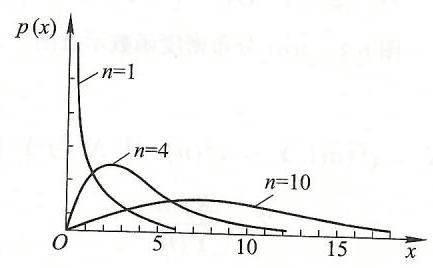

图 ${6.1}{\chi }^{2}\left( n\right)$ 分布密度函数示意图

由式 (6.3.5) 和式 (6.3.6) 容易看出 ${\chi }^{2}$ 分布具有如下性质:

(1) 若 $X \sim  {\chi }^{2}\left( n\right)$,则 $E\left\lbrack  X\right\rbrack   = n,\operatorname{Var}\left\lbrack  X\right\rbrack   = {2n}$.

(2) 若 ${X}_{1} \sim  {\chi }^{2}\left( {n}_{1}\right),{X}_{2} \sim  {\chi }^{2}\left( {n}_{2}\right)$,则 ${X}_{1} + {X}_{2} \sim  {\chi }^{2}\left( {{n}_{1} + {n}_{2}}\right)$.

另外, 利用命题 6.3.2 和中心极限定理 (定理 5.2.1) 容易看出

(3) 若 $X \sim  {\chi }^{2}\left( n\right)$ 分布,则当 $n$ 趋于无穷时, $\left( {X - n}\right) /\sqrt{2n}$ 近似地服从 $N\left( {0,1}\right)$.

## 2. $t$ 分布

命题 6.3.3 设 $X \sim  N\left( {0,1}\right), Y \sim  {\chi }^{2}\left( n\right)$,且 $X$ 与 $Y$ 相互独立,令

$$
T = \frac{X}{\sqrt{Y/n}}
$$

则 $T$ 的分布密度函数 ${f}_{T}$ 为

$$
{f}_{T}\left( x\right)  = \frac{\Gamma \left( \frac{n + 1}{2}\right) }{\sqrt{n\pi }\Gamma \left( \frac{n}{2}\right) }{\left( 1 + \frac{{x}^{2}}{2}\right) }^{-\frac{n + 1}{2}}. \tag{6.3.9}
$$

命题 6.3.3 的证明也是初等的,但需稍繁的积分计算,我们在此从略. 若 $X$ 的分布密度函数如 (6.3.9),则称 $X$ 服从自由度为 $n$ 的 $t$ 分布,记为 $t\left( n\right) \mathrm{B}$ 软件中的分布名为 $\mathrm{t}$.

$t\left( n\right)$ 分布的密度函数图形如图 6.2 所示,它是关于原点对称的. 简单的求极限可知,当 $n \rightarrow  \infty$ 时, $t\left( n\right)$ 分布渐近于 $N\left( {0,1}\right)$. 另外,经简单积分可知,若

$X \sim  t\left( n\right)$,则

$$
E\left\lbrack  X\right\rbrack   = 0\left( {n > 1}\right),\;\operatorname{Var}\left\lbrack  X\right\rbrack   = \frac{2}{n - 2}\left( {n > 2}\right). \tag{6.3.10}
$$

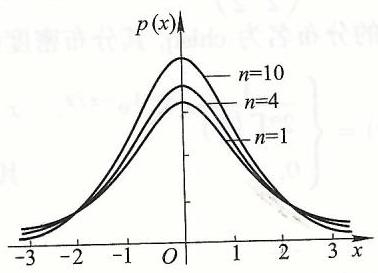

图 ${6.2t}\left( n\right)$ 分布密度函数示意图

3. $F$ 分布

命题 6.3.4 若 $X \sim  {\chi }^{2}\left( m\right), Y \sim  {\chi }^{2}\left( n\right)$,且 $X$ 与 $Y$ 独立. 令

$$
Z = \frac{X/m}{Y/n}
$$

则 $Z$ 的分布密度函数为

$$
{f}_{Z}\left( x\right)  = \left\{  \begin{array}{ll} \frac{\Gamma \left( \frac{m + n}{2}\right) }{\Gamma \left( \frac{m}{2}\right) \Gamma \left( \frac{n}{2}\right) }{m}^{m/2}{n}^{n/2}\frac{{x}^{\frac{m}{2} - 1}}{{\left( mx + n\right) }^{\left( {m + n}\right) /2}}, & x > 0. \\  0, & x \leq  0. \end{array}\right.  \tag{6.3.11}
$$

命题 6.3.4 的证明中用到的积分计算稍繁,我们在此从略. 若 $Z$ 的分布密度函数如式 (6.3.11),则称 $Z$ 所服从的分布为 第一自由度为 $m$ 、第二自由度为 $n$ 的 $F$ 分布,记为 $Z \sim  F\left( {m, n}\right),\mathrm{R}$ 软件中的分布名为 $\mathrm{f}.F$ 分布的密度函数如图 6.3 所示,显然 $F$ 分布具有性质:

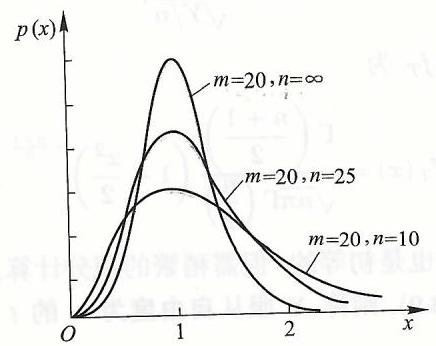

图 ${6.3}\;F\left( {m, n}\right)$ 分布密度函数示意图

若 $Z \sim  F\left( {m, n}\right)$,则 $\frac{1}{Z} \sim  F\left( {n, m}\right)$.

#### 6.3.3 分位数

在统计推断过程中 (比如后文介绍的参数的区间估计和假设检验中). 已知总体 $X$ 的分布及某概率值 $\alpha$,需要知道 $X$ 小于和等于哪个数的概率为 $\alpha$. 这个数称为 $X$ 的 $\alpha$ 分位数,亦即,

设 $X \sim  \psi \left( n\right)$ ( $\psi$ 为某种分布, $n$ 为有关自由度), $0 < \alpha  < 1$. 称满足

$$
P\left( {X \leq  {\psi }_{\alpha }\left( n\right) }\right)  = \alpha
$$

的数 ${\psi }_{\alpha }\left( n\right)$ 为分布 $\psi \left( n\right)$ 的 $\alpha$ 分位数 (或分位点)

几种常用分布的分位数如图 6.4 - 图 6.7 所示.

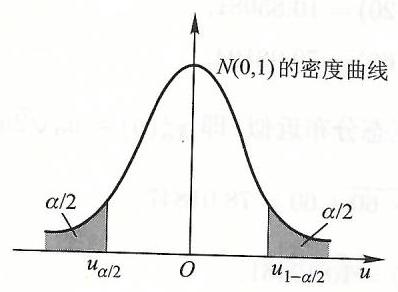

图 ${6.4N}\left( {0,1}\right)$ 分布分位点示意图.

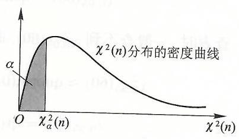

图 ${6.5}{\chi }^{2}\left( n\right)$ 分布分位点示意图.

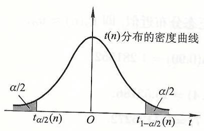

图 ${6.6t}\left( n\right)$ 分布分位点示意图.

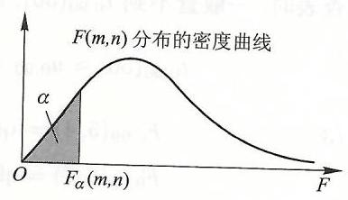

图 ${6.7}\;F\left( {m, n}\right)$ 分布分位点示意图.

由于 $N\left( {0,1}\right),{\chi }^{2}\left( n\right), t\left( n\right)$ 和 $F\left( {m, n}\right)$ 的分布密度函数的积分较为复杂 (或个可能),有关概率的计算只能查表,这些表是经数值计算得到的. 如用 $\mathrm{R}$ 软件则不用查表, 而是调用专门的分位数函数, 它们的格式是 quantile(分位数) 的第一个字母 q 后续分布名及圆括弧 (   ) 内写概率值 $\alpha$ 和有关参数值,如 qnorm $\left( \alpha \right)$. $\mathrm{{qt}}\left( {\alpha,\mathrm{n}}\right),\mathrm{{qf}}\left( {\alpha,\mathrm{m},\mathrm{n}}\right)$ 等.

如需查表, 我们需要说明几点:

(i) 对于 $t\left( n\right)$ 分布,由于当 $n$ 趋于无穷时,其极限分布为 $N\left( {0,1}\right)$,所以自由度较大时,用标准正态分布的分位数 ${u}_{\alpha }$ 代替 ${t}_{\alpha }\left( n\right)$ 的分位数.

(ii) 若 $X \sim  {\chi }^{2}\left( n\right)$ 分布,则当 $n$ 趋于无穷时, $\left( {X - n}\right) /\sqrt{2n}$ 近似地服从 $N\left( {0,1}\right)$,所以当自由度较大时,近似地有 ${\chi }_{\alpha }^{2}\left( n\right)  = {u}_{\alpha }\sqrt{2n} + n$.

(iii) 对于 $F\left( {m, n}\right)$ 分布和 $\alpha \left( {0 < \alpha  < 1}\right)$,有 ${F}_{\alpha }\left( {m, n}\right)  = 1/{F}_{1 - \alpha }\left( {n, m}\right)$.

例 6.3.1 查表或用 R 软件,求

(1) ${\chi }_{0.99}^{2}\left( {10}\right),{\chi }_{0.05}^{2}\left( {20}\right)$ 和 ${\chi }_{0.95}^{2}\left( {60}\right)$.

(2) ${t}_{0.95}\left( {10}\right),{t}_{0.10}\left( {20}\right)$ 和 ${t}_{0.90}\left( {50}\right)$.

(3) ${F}_{0.99}\left( {5,4}\right),{F}_{0.05}\left( {3,7}\right)$.

解 (1)

$$
{\chi }_{0.99}^{2}\left( {10}\right)  = \operatorname{qchisq}\left( {{0.99},{10}}\right)  = {23.20925},
$$

$$
{\chi }_{0.05}^{2}\left( {20}\right)  = \operatorname{qchisq}\left( {{0.05},{20}}\right)  = {10.85081},
$$

$$
{\chi }_{0.95}^{2}\left( {60}\right)  = \text{ qchisq }\left( {{0.95},{60}}\right)  = {79.08194}.
$$

查表时,一般查不到 ${\chi }_{0.95}^{2}\left( {60}\right)$,而是用正态分布近似,即 ${\chi }_{\alpha }^{2}\left( n\right)  \approx  {u}_{\alpha }\sqrt{2n} + n$.

$$
{\chi }_{0.95}^{2}\left( {60}\right)  \approx  \text{ qnorm }\left( {0.95}\right) \sqrt{2 \times  {60}} + {60} = {78.01847}.
$$

(2)

$$
{t}_{0.95}\left( {10}\right)  = \operatorname{qt}\left( {{0.95},{10}}\right)  = {1.812461},
$$

$$
{t}_{0.10}\left( {20}\right)  = \mathrm{{qt}}\left( {{0.10},{20}}\right)  =  - {1.325341},
$$

$$
{t}_{0.90}\left( {50}\right)  = \operatorname{qt}\left( {{0.90},{50}}\right)  = {1.298714}.
$$

查表时,一般查不到 ${t}_{0.90}\left( {50}\right)$,而是用正态分布近似,即 ${t}_{\alpha }\left( n\right)  \approx  {u}_{\alpha }$.

$$
{t}_{0.90}\left( {50}\right)  \approx  {u}_{0.90} = \text{ qnorm }\left( {0.90}\right)  = {1.281552}.
$$

(3)

$$
{F}_{0.99}\left( {5,4}\right)  = \operatorname{qf}\left( {{0.99},5,4}\right)  = {15.52186},
$$

$$
{F}_{0.05}\left( {3,7}\right)  = \operatorname{qf}\left( {{0.05},3,7}\right)  = {0.1125272}.
$$

查表时,一般查不到 ${F}_{0.05}\left( {3,7}\right)$,而是用 ${F}_{\alpha }\left( {m, n}\right)  = 1/{F}_{1 - \alpha }\left( {n, m}\right)$,

$$
{F}_{0.05}\left( {3,7}\right)  = \frac{1}{{F}_{0.95}\left( {7,3}\right) } = \frac{1}{\operatorname{qf}\left( {{0.95},7,3}\right) } = {0.1125272}.
$$

#### 6.3.4 正态总体的抽样分布

定理 6.3.1 (抽样分布基本定理) 设总体 $X \sim  N\left( {0,1}\right),\left( {{X}_{1},{X}_{2},\cdots,{X}_{n}}\right)$ 为其样本,则样本均值 $\bar{X} \sim  N\left( {0,\frac{1}{n}}\right), n{S}_{n}^{2} \sim  {\chi }^{2}\left( {n - 1}\right)$,并且 $\bar{X}$ 与 ${S}_{n}^{2}$ 相互独立.

由于篇幅限制, 我们略去定理 6.3.1 的证明, 但从中我们看到正态分布的极

(1) 由于 ${X}_{1},{X}_{2},\cdots,{X}_{n}$ 独立且都服从正态分布,从而 $\left( {{X}_{1},{X}_{2},\cdots,{X}_{n}}\right)$ 服从 $n$ 维正态分布. 由命题 3.4.1 知, $\bar{X} = \frac{1}{n}{X}_{1} + \frac{1}{n}{X}_{2} + \cdots  + \frac{1}{n}{X}_{n}$ 服从正态分布.

(2) ${S}_{n}^{2} = \frac{1}{n}\mathop{\sum }\limits_{{i = 1}}^{n}{\left( {X}_{i} - \bar{X}\right) }^{2}$,即 ${S}_{n}^{2}$ 是 $\bar{X}$ 的函数,二者却相互独立.

从定理 6.3.1 的事实出发, 利用命题 6.3.2、命题 6.3.3 和命题 6.3.4 中给出的 ${\chi }^{2}$ 分布、 $t$ 分布和 $F$ 分布的定义,容易证明如下四个推论,它们在后文的分析过论中将发挥关键性的作用.

相互独立, 开且 推论 6.3.1 设总体 $X \sim  N\left( {\mu,{\sigma }^{2}}\right),\left( {{X}_{1},{X}_{2},\cdots,{X}_{n}}\right)$ 为其样本,则 $\bar{X}$ 与 ${S}_{n}^{2}$

$$
\bar{X} \sim  N\left( {\mu,\frac{{\sigma }^{2}}{n}}\right), \tag{6.3.12}
$$

$$
\frac{n{S}_{n}^{2}}{{\sigma }^{2}} \sim  {\chi }^{2}\left( {n - 1}\right)  \tag{6.3.13}
$$

推论 6.3.2 设总体 $X \sim  N\left( {\mu,{\sigma }^{2}}\right),\left( {{X}_{1},{X}_{2},\cdots,{X}_{n}}\right)$ 为其样本,则

$$
\frac{\bar{X} - \mu }{{S}_{n}^{ * }}\sqrt{n} = \frac{\bar{X} - \mu }{{S}_{n}}\sqrt{n - 1} \sim  t\left( {n - 1}\right). \tag{6.3.14}
$$

推论 6.3.3 设总体 $X \sim  N\left( {{\mu }_{1},{\sigma }_{1}^{2}}\right),\left( {{X}_{1},{X}_{2},\cdots,{X}_{m}}\right)$ 为其样本. 样本均值为 $X$,样本方差为 ${S}_{1m}^{2}$; 另有与 $X$ 独立的总体 $Y \sim  N\left( {{\mu }_{2},{\sigma }_{2}^{2}}\right),\left( {{Y}_{1},{Y}_{2},\cdots,{Y}_{m}}\right)$ 为具样本,样本均值为 $\bar{Y}$,样本方差为 ${S}_{2m}^{2}$. 则

$$
\frac{m{S}_{1m}^{2}}{n{S}_{2n}^{2}} \cdot  \frac{{\sigma }_{2}^{2}}{{\sigma }_{1}^{2}} \cdot  \frac{n - 1}{m - 1} = \frac{{S}_{1m}^{*2}}{{S}_{2n}^{*2}} \cdot  \frac{{\sigma }_{2}^{2}}{{\sigma }_{1}^{2}} \sim  F\left( {m - 1, n - 1}\right). \tag{6.3.15}
$$

推论 6.3.4 在推论 6.3.3 的假定中,若 ${\sigma }_{1}^{2} = {\sigma }_{2}^{2}$,则

$$
\frac{\left( {\bar{X} - \bar{Y}}\right)  - \left( {{\mu }_{1} - {\mu }_{2}}\right) }{{S}_{w}\sqrt{\frac{1}{m} + \frac{1}{n}}} \sim  t\left( {m + n - 2}\right), \tag{6.3.16}
$$

其中 ${S}_{w} = \sqrt{\frac{m{S}_{1m}^{2} + n{S}_{2n}^{2}}{m + n - 2}}$.

对于顺序统计量, 用初等概率论的一般方法, 容易证明命题 6.3.5.

命题 6.3.5 设总体 $X$ 的分布函数为 ${F}_{X}$,分布密度函数为 ${f}_{X}$,则

$$
{f}_{{X}_{\left( k\right) }}\left( x\right)  = \frac{n!}{\left( {n - k}\right) !\left( {k - 1}\right) !}{\left\lbrack  {F}_{X}\left( x\right) \right\rbrack  }^{k - 1}{\left\lbrack  1 - {F}_{X}\left( x\right) \right\rbrack  }^{n - k}{f}_{X}\left( x\right),\;k = 1,2,\cdots, n.
$$

(6.3.17)特别地,

$$
{f}_{{X}_{\left( 1\right) }}\left( x\right)  = n{\left\lbrack  1 - {F}_{X}\left( x\right) \right\rbrack  }^{n - 1}{f}_{X}\left( x\right), \tag{6.3.18}
$$

$$
{f}_{{X}_{\left( n\right) }}\left( x\right)  = n{\left\lbrack  {F}_{X}\left( x\right) \right\rbrack  }^{n - 1}{f}_{X}\left( x\right). \tag{6.3.19}
$$

## 第六章小结与注记

(1)总体与样本是数理统计最基本的两个概念,其直观意义很明确. 但只有把它们归结为一个随机变量和一个随机向量, 才便于对统计方法和结果作概率上的分析论证. 基于数学工具的限制, 我们不得不限制样本为 “简单随机样本”, 亦即, 各分量间相互独立, 且都与总体同分布. 试想一批产品有 100 件, 从中抽取 10 件做检验, 来推断该批产品的不合格品率. 有放回抽取较为准确还是无放回较为准确？有放回抽取是独立试验还是无放回抽取是独立试验？

我们说, 数理统计就是 “由局部推断整体”. 现在就可以具体化为: 总体是数理统计的研究目标, 而样本是数理统计的出发点.

(2)统计量则是由出发点到目标的途径. 直观上, 统计量就是样本的函数, 也就是要对样本经过处理才能说明总体. 当然, 直观和理论上, 我们都不希望它包含未知参数, 否则就得不出结果, 一切都是徒劳的.

(3)由于我们通过统计量来说明总体,所以把握统计量的统计特性就非常重要. 遗憾的是, 对于一般分布的总体, 其统计量的分布很难得到, 即使对样本均值和样本方差这样简单的统计量也是如此. 对这种总体的处理, 往往用 “大样本埋论”来研究, 即样本容量较大时, 通过求统计量的近似分布来完成对统计方法的

只有对正态总体, 其样本均值、样本方差的分布可以求得, 且二者独立 (见抽样分布基本定理),从而根据几个特殊的分布 $\left( {\chi }^{2}\right.$ 分布、 $t$ 分布和 $F$ 分布) 的定义, 我们得到了几种重要的样本函数的分布 (参见推论 6.2.1 - 推论 6.3.4), 它们在后续参数的区间估计和假设检验中起到关键作用.

(4)顺序统计量也有直观的应用, 但其分布往往难以求得, 甚至于正态总体的顺序统计量的分布都没有显式表达式. 一般较少用到.

## 第六章习题

6.1. 设 $\left( {{X}_{1},{X}_{2},\cdots,{X}_{n}}\right)$ 是来自总体 $X \sim  N\left( {\mu,{\sigma }^{2}}\right)$ 的样本,并设

$$
{T}_{1} = \frac{1}{n}\mathop{\sum }\limits_{{i = 1}}^{n}{X}_{i},\;{T}_{2} = {T}_{1} - \mu,\;{T}_{3} = \frac{\mathop{\sum }\limits_{{i = 1}}^{n}{\left( {X}_{i} - \mu \right) }^{2}}{{\sigma }^{2}},\;{T}_{4} = \frac{\mathop{\sum }\limits_{{i = 1}}^{n}{\left( {X}_{i} - {T}_{1}\right) }^{2}}{{\sigma }^{2}}.
$$

试在下列情形下指出哪些随机变量是统计量:

(1) 在 ${\sigma }^{2}$ 已知, $\mu$ 未知的情形下. (2) 在 $\mu,{\sigma }^{2}$ 均未知的情形下.

6.2. 设 $\left( {{X}_{1},{X}_{2},\cdots,{X}_{5}}\right)$ 是来自总体 $N\left( {0,4}\right)$ 的一个样本,且

$$
Y = a{X}_{1}^{2} + b{\left( 2{X}_{2} + 3{X}_{3}\right) }^{2} + c{\left( 4{X}_{4} - {X}_{5}\right) }^{2},
$$

问非零常数 $a, b, c$ 取何值时,随机变量 $Y$ 服从 ${\chi }^{2}$ 分布?

6.3. 设 $\left( {{X}_{1},{X}_{2},\cdots,{X}_{8}}\right)$ 是来自总体 $N\left( {0,1}\right)$ 的简单随机样本. 求常数 $c$,使得

$$
\frac{c\left( {{X}_{1}^{2} + {X}_{2}^{2}}\right) }{{\left( {X}_{3} + {X}_{4} + {X}_{5}\right) }^{2} + {\left( {X}_{6} + {X}_{7} + {X}_{8}\right) }^{2}}
$$

服从 $F$ 分布,并指出其自由度.

6.4. 设 $\left( {{X}_{1},{X}_{2},\cdots,{X}_{9}}\right)$ 是来自总体 $N\left( {0,1}\right)$ 的简单随机样本. 试确定正数 $c$. 使得 $\frac{c\left( {{X}_{1} + {X}_{2} + {X}_{3}}\right) }{\sqrt{{\left( {X}_{4} + {X}_{5}\right) }^{2} + {\left( {X}_{6} + {X}_{7}\right) }^{2} + {\left( {X}_{8} + {X}_{9}\right) }^{2}}}$ 服从 $t$ 分布,并指出其自由度.

6.5. 设 $\left( {{X}_{1},{X}_{2},\cdots,{X}_{10}}\right)$ 是来自总体 $X \sim  N\left( {\mu,{\sigma }^{2}}\right)$ 的一个样本,记

$$
\bar{X} = \frac{1}{9}\mathop{\sum }\limits_{{i = 1}}^{9}{X}_{i},\;{S}_{9}^{*2} = \frac{1}{8}\mathop{\sum }\limits_{{i = 1}}^{9}{\left( {X}_{i} - \bar{X}\right) }^{2},\;T = \frac{3\left( {{X}_{10} - \bar{X}}\right) }{{S}_{9}^{ * }\sqrt{10}}
$$

确定 $T$ 服从何种分布,并说明缘由.

6.6. 设 $\left( {{X}_{1},{X}_{2},\cdots,{X}_{20}}\right)$ 是来自总体 $X \sim  N\left( {0,1}\right)$ 的一个样本,记

$$
Y = \frac{1}{10}{\left( \mathop{\sum }\limits_{{i = 1}}^{{10}}{X}_{i}\right) }^{2} + \frac{1}{10}{\left( \mathop{\sum }\limits_{{i = {11}}}^{{20}}{X}_{i}\right) }^{2},
$$

试确定 $Y$ 所服从的分布.

6.7. 设总体 $X \sim  N\left( {0,{\sigma }^{2}}\right)$,从 $X$ 中抽得样本 $\left( {{X}_{1},{X}_{2},\cdots,{X}_{14}}\right)$,记

$$
{Y}_{1} = \frac{1}{5}\mathop{\sum }\limits_{{i = 1}}^{5}{X}_{i},\;{Y}_{2} = \frac{1}{5}\mathop{\sum }\limits_{{i = {10}}}^{{14}}{X}_{i},\;{Z}_{1} = \mathop{\sum }\limits_{{i = 1}}^{5}{\left( {X}_{i} - {Y}_{1}\right) }^{2},
$$

$$
{Z}_{2} = \mathop{\sum }\limits_{{i = {10}}}^{{14}}{\left( {X}_{i} - {Y}_{2}\right) }^{2},\;{Z}_{3} = \mathop{\sum }\limits_{{i = 6}}^{9}{X}_{i}^{2},\;T = \frac{{Z}_{1} + {Z}_{2}}{2{Z}_{3}},
$$

确定 $T$ 服从何种分布,并说明缘由.

6.8. 设总体 $X \sim  \operatorname{Exp}\left( \lambda \right)$,从 $X$ 中抽取样本 $\left( {{X}_{1},{X}_{2}}\right)$,记

$$
{Y}_{1} = \min \left\{  {{X}_{1},{X}_{2}}\right\} ,\;{Y}_{2} = \max \left\{  {{X}_{1},{X}_{2}}\right\}
$$

求 (1) ${Y}_{1}$ 和 ${Y}_{2}$ 的分布密度函数. (2) $E{Y}_{1}, E{Y}_{2}$.

6.9. 设总体 $X$ 的密度函数为

$$
f\left( x\right)  = \left\{  \begin{matrix} {2x}, & 0 < x < 1, \\  0, & \text{ 其他. } \end{matrix}\right.
$$

$\left( {{X}_{1},{X}_{2},{X}_{3}}\right)$ 是来自 $X$ 的简单随机样本,求 (1) ${X}_{\left( 3\right) }$ 的分布密度函数. (2) $\operatorname{Var}\left\lbrack  {X}_{\left( 3\right) }\right\rbrack$.

6.10. 设总体 $X$ 的概率分布为 $P\left( {X = i}\right)  = \frac{1}{3}, i = 1,2,3.\left( {{X}_{1},{X}_{2},{X}_{3}}\right)$ 为来自 $X$ 的样本,求 (1) $E\left\lbrack  {X}_{\left( 1\right) }\right\rbrack$. (2) $\operatorname{Var}\left\lbrack  {X}_{\left( 3\right) }\right\rbrack$.

6.11. 设 ${\bar{X}}_{n},{S}_{n}^{2}$ 分别为样本 $\left( {{X}_{1},{X}_{2},\cdots,{X}_{n}}\right)$ 的均值与方差,而 ${X}_{n + 1}$ 是第 $n + 1$ 次观测量, 试证:

(1) ${\bar{X}}_{n + 1} = \frac{n}{n + 1}{\bar{X}}_{n} + \frac{1}{n + 1}{X}_{n + 1}$.

(2) ${S}_{n + 1}^{2} = \frac{n}{n + 1}\left\lbrack  {{S}_{n}^{2} + \frac{1}{n + 1}{\left( {X}_{n + 1} - {\bar{X}}_{n}\right) }^{2}}\right\rbrack$.

6.12. 设总体 $X \sim  B\left( {m, p}\right)$,而 $\left( {{X}_{1},{X}_{2},\cdots,{X}_{n}}\right)$ 是来自 $X$ 的样本,(1) 求 $E\left\lbrack  X\right\rbrack ,\operatorname{Var}\left\lbrack  X\right\rbrack$. (2) 求 $E\left\lbrack  {S}_{n}^{2}\right\rbrack$.

6.13. 设 $\left( {{X}_{1},{X}_{2},\cdots,{X}_{n}}\right)$ 是来自 $0 - 1$ 分布 $B\left( {1, p}\right)$ 的简单随机样本, $X,{S}_{n}^{2}$ 分别为样本均值与样本方差.

(2) 求 $E\left\lbrack  {S}_{n}^{2}\right\rbrack$. (3) 证明: ${S}_{n}^{2} = \bar{X}\left( {1 - \bar{X}}\right)$.

6.14. 设总体 $X \sim  N\left( {\mu,{\sigma }^{2}}\right),\left( {{X}_{1},{X}_{2},\cdots,{X}_{n}}\right)$ 为来自 $X$ 的样本, $\bar{X},{S}_{n}^{2}$ 分别为样本均值与方差,求 (1) $E\left\lbrack  {\bar{X}}^{2}\right\rbrack$ 之值,(2) $E\left\lbrack  {{\bar{X}}^{2}{S}_{n}^{2}}\right\rbrack$ 之值.

6.15. 请查表或利用 $\mathrm{R}$ 软件给出下列分位数:

(1) ${u}_{0.05}.\;\left( 2\right) {t}_{0.975}\left( 8\right).\;\left( 3\right) {t}_{0.05}\left( 9\right).\;(4$ (4) ${\chi }_{0.975}^{2}\left( 5\right)$. (5) ${F}_{0.025}\left( {6,5}\right)$.

6.16. 设 $\left( {{X}_{1},{X}_{2},\cdots,{X}_{11}}\right)$ 为来自 $X \sim  N\left( {-1,4}\right)$ 的样本, $\bar{X} = \frac{1}{10}\mathop{\sum }\limits_{{i = 1}}^{{10}}{X}_{i}$. 求

(1) $P\left( {{X}_{10} - \bar{X} < {0.5}}\right)$ 之值. (2) $P\left( {{X}_{11} - \bar{X} < {0.5}}\right)$ 之值.

6.17. 设总体 $X \sim  N\left( {\mu,{\sigma }^{2}}\right),\left( {{X}_{1},{X}_{2},\cdots,{X}_{8}}\right)$ 为来自 $X$ 的样本, ${S}_{8}^{*2} = \frac{1}{7}\mathop{\sum }\limits_{{i = 1}}^{8}{\left( {X}_{i} - \bar{X}\right) }^{2}$, 求 $P\left( {\sqrt{8}\left( {\bar{X} - \mu }\right)  <  - {1.9}{S}_{8}^{ * }}\right)$ 之值.

6.18. 设 $\left( {{X}_{1},{X}_{2},\cdots,{X}_{9}}\right)$ 为来自 $N\left( {2,4}\right)$ 的样本, $\left( {{Y}_{1},{Y}_{2},\cdots,{Y}_{17}}\right)$ 为来自 $N\left( {3,9}\right)$ 的

样本,且两样本独立,令 $F = \frac{\mathop{\sum }\limits_{{i = 1}}^{9}{\left( {X}_{i} - 2\right) }^{2}}{\mathop{\sum }\limits_{{i = 1}}^{{17}}{\left( {Y}_{i} - \bar{Y}\right) }^{2}}$,求 $P\{ {0.0836} < F < {0.9450}\}$ 之值.

6.19. 设 $\left( {{X}_{1},{X}_{2},\cdots,{X}_{10}}\right)$ 为来自 $N\left( {-1,9}\right)$ 的样本,求

(1) $P\left( {\mathop{\sum }\limits_{{i = 1}}^{{10}}{\left( {X}_{i} + 1\right) }^{2} \geq  {112.941}}\right)$ 之值.

(2) $P\left( {\mathop{\sum }\limits_{{i = 1}}^{{10}}{\left( {X}_{i} - \bar{X}\right) }^{2} \geq  {53.091}}\right)$.

# 第七章 参 数 估 计

本章介绍经典的估计方法, 主要介绍总体参数的估计, 包括参数的点估计和区间估计. 点估计中将介绍矩法估计、最大似然估计和顺序统计量估计等方法可估计(可估计)可估计量优劣的基本标准. 区间估计主要介绍正态总体参数的区分间估计.

## 7.1 参数的点估计

简单地讲, 所谓参数的点估计, 就是找一个合适的统计量, 将样本观测值代人该统计量得到的值就作为该参数的估计, 而参数的区间估计则是找两个统计其中可以其中一个为左端点、另一个为右端点, 构成一个可能包含该参数的一个随

在不考虑估计量优劣时, 参数的点估计方法都是很直观的, 或者说其思想都是很基本的, 这一点请读者留意体会.

#### 7.1.1 矩法估计

矩法估计的想法来自大数定律 (参见 5.1 节的定理 5.1.1 和定理 5.1.2). 如果总体 $X$ 存在 $k$ 阶矩,则由定理 5.1.1 知,对任 $\varepsilon  > 0$ 有

$$
\mathop{\lim }\limits_{{n \rightarrow  \infty }}P\left( {\left| {\frac{1}{n}\mathop{\sum }\limits_{{i = 1}}^{n}{X}_{i}^{k} - E\left\lbrack  {X}^{k}\right\rbrack  }\right|  \geq  \varepsilon }\right)  = 0. \tag{7.1.1}
$$

这说明,当样本容量较大时,样本 $k$ 阶矩 $\frac{1}{n}\mathop{\sum }\limits_{{i = 1}}^{n}{X}_{i}^{k}$ 与总体 $k$ 阶矩 $E\left\lbrack  {X}^{k}\right\rbrack$ 差别很

所谓矩法估计,就是用样本 $k$ 阶矩估计总体 $k$ 阶矩. (7.1.1) 说明这种估计方法是有理论依据的. 另外, 通常总体各阶矩都与总体参数有关, 从而可以通过用样本 $k$ 阶矩估计总体 $k$ 阶矩来实现对参数的估计.

设总体 $X \sim  {F}_{X}\left( {\cdot,\theta }\right)$,通常用 ${\widehat{\theta }}_{M}$ 来记 $\theta$ 的矩法估计量,它是样本 $\left( {{X}_{1},{X}_{2},\cdots }\right.$ $\left. {X}_{n}\right)$ 的一个函数,比如记为 ${\widehat{\theta }}_{M} = T\left( {{X}_{1},{X}_{2},\cdots,{X}_{n}}\right)$,从而 ${\widehat{\theta }}_{M}$ 是一个随机变量行件不观测值 $\left( {{x}_{1},{x}_{2},\cdots,{x}_{n}}\right)$ 代入估计量 ${\widehat{\theta }}_{M}$ 所得的数值 $T\left( {{x}_{1},{x}_{2},\cdots,{x}_{n}}\right)$,我们称为参数 $\theta$ 的矩法估计值.

下面我们通过几个例子, 进一步说明矩法估计.

例 7.1.1 试用参数的矩法估计, 估计一批某种产品的不合格品率.

解 由于一件产品要么为合格品要么为不合格品,所以此时总体 $X \sim  B\left( {1, p}\right)$, 抽到不合格品时 $X$ 取值为 1,否则取值为 0. 即不合格品率 $p = P\left( {X = 1}\right)$.

现设我们通过抽取,得到了样本 $\left( {{X}_{1},{X}_{2},\cdots,{X}_{n}}\right)$. 由于 $E\left\lbrack  X\right\rbrack   = p$,则由矩法估计的想法,就该用样本均值 $\bar{X}$ 来估计 $p$,亦即 ${\widehat{p}}_{M} = \bar{X}$. 也就是说,如果我们抽取了 100 件产品, 发现其中恰有 3 件不合格品, 则认为该批产品的不合格品率为 $3\%$.

例 7.1.2 长期的生产经验告诉我们, 水泥厂成品打包机装袋的重量服从正态分布, 试用矩法估计来估计一台打包机装袋的重量的均值和标准差.

解 设装袋的重量为 $X$,样本为 $\left( {{X}_{1},{X}_{2},\cdots,{X}_{n}}\right)$,由题设 $X \sim  N\left( {\mu,{\sigma }^{2}}\right)$ 和 $E\left\lbrack  X\right\rbrack   = \mu,\operatorname{Var}\left\lbrack  X\right\rbrack   = {\sigma }^{2}$,即

$$
\begin{cases} \mu &  = E\left\lbrack  X\right\rbrack , \\  {\sigma }^{2} &  = E\left\lbrack  {X}^{2}\right\rbrack   - {\left( E\left\lbrack  X\right\rbrack  \right) }^{2}. \end{cases}
$$

从而, 依矩法估计, 应有

$$
\begin{cases} {\widehat{\mu }}_{M} &  = \bar{X}, \\  {\widehat{{\sigma }^{2}}}_{M} &  = \frac{1}{n}\mathop{\sum }\limits_{{i = 1}}^{n}{X}^{2} - {\left( \bar{X}\right) }^{2}. \end{cases}
$$

由于 $\frac{1}{n}\mathop{\sum }\limits_{{i = 1}}^{n}{X}_{i}^{2} - {\left( \bar{X}\right) }^{2} = {S}_{n}^{2}$,所以

$$
\left\{  \begin{array}{l} {\widehat{\mu }}_{M} = \bar{X}, \\  {\widehat{\sigma }}_{M} = {S}_{n}. \end{array}\right.
$$

在例 7.1.2 中, 我们通过用样本 1,2 阶原点矩分别估计总体 1,2 阶原点矩, 得到的方差 ${\sigma }^{2}$ (总体 2 阶中心矩) 的估计量恰好也是样本 2 阶中心矩 ${S}_{n}^{2}$. 这一事实不是巧合而是必然的, 容易证明, 如果我们用样本各阶矩估计总体各阶矩, 则必然是用样本各阶中心矩估计总体各阶中心矩. 反之亦然.

例 7.1.3 设总体在某一区间上均匀取值, 试用矩法估计该区间的左、右端点.

解 由题意设 $X \sim  U\left\lbrack  {a, b}\right\rbrack$,则 $E\left\lbrack  X\right\rbrack   = \frac{a + b}{2},\operatorname{Var}\left\lbrack  X\right\rbrack   = \frac{{\left( b - a\right) }^{2}}{12}$,即

$$
\left\{  \begin{array}{l} a = E\left\lbrack  X\right\rbrack   - \sqrt{3\operatorname{Var}\left\lbrack  X\right\rbrack  }, \\  b = E\left\lbrack  X\right\rbrack   + \sqrt{3\operatorname{Var}\left\lbrack  X\right\rbrack  }. \end{array}\right.
$$

从而,依矩法估计,应有 (从此二元一次方程解出 $a$ 和 $b$,并用 $\bar{X}$ 代替 $E\left\lbrack  X\right\rbrack$,用 ${S}_{n}^{2}$ 代替 $\operatorname{Var}\left\lbrack  X\right\rbrack$,再用 ${\widehat{a}}_{M}$ 代替 $a$,用 ${\widehat{b}}_{M}$ 代替 $b$ )

$$
\left\{  \begin{array}{l} {\widehat{a}}_{M} = \bar{X} - \sqrt{3}{S}_{n}, \\  {\widehat{b}}_{M} = \bar{X} + \sqrt{3}{S}_{n}. \end{array}\right.
$$

例 7.1.4 设总体 $X$ 的分布密度函数为

$$
{f}_{X}\left( {x,\theta }\right)  = \frac{\theta }{2}{\mathrm{e}}^{-\theta \left| x\right| },\; - \infty  < x < \infty,\theta  > 0.
$$

试求 $\theta$ 的矩法估计.

解 先求 $E\left\lbrack  X\right\rbrack$,看看它与参数 $\theta$ 的关系. 由于

$$
E\left\lbrack  X\right\rbrack   = {\int }_{-\infty }^{\infty }x\frac{\theta }{2}{\mathrm{e}}^{-\theta \left| x\right| }\mathrm{d}x = 0
$$

与参数 $\theta$ 无关,我们想到试算 $E\left\lbrack  \left| X\right| \right\rbrack$. 由于

$$
E\left\lbrack  \left| X\right| \right\rbrack   = {\int }_{-\infty }^{\infty }\left| x\right| \frac{\theta }{2}{\mathrm{e}}^{-\theta \left| x\right| }\mathrm{d}x = {\int }_{0}^{\infty }{x\theta }{\mathrm{e}}^{-{\theta x}}\mathrm{\;d}x = \frac{1}{\theta },
$$

即 $\theta  = \frac{1}{E\left\lbrack  \left| X\right| \right\rbrack  }$,从而,依矩法估计,应有

$$
{\widehat{\theta }}_{M} = \frac{1}{\left| \bar{X}\right| } = \frac{n}{\mathop{\sum }\limits_{{i = 1}}^{n}\left| {X}_{i}\right| }.
$$

在例 7.1.4 中, 还可由

$$
E\left\lbrack  {X}^{2}\right\rbrack   = {\int }_{-\infty }^{\infty }{x}^{2}\frac{\theta }{2}{\mathrm{e}}^{-\theta \left| x\right| }\mathrm{d}x = {\int }_{0}^{\infty }{x}^{2}\theta {\mathrm{e}}^{-{\theta x}}\mathrm{\;d}x = \frac{2}{{\theta }^{2}}
$$

得到 $\theta$ 的另外一个矩法估计量为 $\sqrt{{2n}/\mathop{\sum }\limits_{{i = 1}}^{n}{X}_{i}^{2}}$.

由以上的例子, 我们可以总结出如下矩法估计的一般步骤.

设总体 $X \sim  {F}_{X}\left( {\cdot,{\theta }_{1},{\theta }_{2},\cdots,{\theta }_{l}}\right)$,先计算 $X$ 的从 1 到 $l$ 的各阶矩,得到各阶

矩与参数的关系

$$
\begin{cases} E\left\lbrack  X\right\rbrack   = & {g}_{1}\left( {{\theta }_{1},{\theta }_{2},\cdots,{\theta }_{l}}\right), \\  E\left\lbrack  {X}^{2}\right\rbrack   = & {g}_{2}\left( {{\theta }_{1},{\theta }_{2},\cdots,{\theta }_{l}}\right), \\   & \cdots \cdots \\  E\left\lbrack  {X}^{l}\right\rbrack   = & {g}_{l}\left( {{\theta }_{1},{\theta }_{2},\cdots,{\theta }_{l}}\right). \end{cases} \tag{7.1.2}
$$

由这些关系式中解出

$$
\left\{  \begin{matrix} {\theta }_{1} = {h}_{1}\left( {E\left\lbrack  X\right\rbrack , E\left\lbrack  {X}^{2}\right\rbrack ,\cdots, E\left\lbrack  {X}^{l}\right\rbrack  }\right), \\  {\theta }_{2} = {h}_{2}\left( {E\left\lbrack  X\right\rbrack , E\left\lbrack  {X}^{2}\right\rbrack ,\cdots, E\left\lbrack  {X}^{l}\right\rbrack  }\right), \\  \cdots \cdots \\  {\theta }_{l} = {h}_{l}\left( {E\left\lbrack  X\right\rbrack , E\left\lbrack  {X}^{2}\right\rbrack ,\cdots, E\left\lbrack  {X}^{l}\right\rbrack  }\right). \end{matrix}\right.  \tag{7.1.3}
$$

最后, 将 (7.1.3) 右端函数中的总体各阶原点矩用样本各阶原点矩代替, 再将 ${\theta }_{1},{\theta }_{2},\cdots,{\theta }_{l}$ 换成 ${\widehat{{\theta }_{1}}}_{M},{\widehat{{\theta }_{2}}}_{M},\cdots,{\widehat{{\theta }_{l}}}_{M}$ 即得.

#### 7.1.2 最大似然估计

参数的最大似然估计的想法基于大家普遍接受的一个事实, 这个事实为 “小概率事件在一次试验中几乎不可能发生”. 换言之, 在一次试验中发生的事件, 其发生的概率应该比较大. 所以,若总体 $X \sim  {F}_{X}\left( {\cdot,\theta }\right)$,当我们有了一组样本观测值 $\left( {{x}_{1},{x}_{2},\cdots,{x}_{n}}\right)$ 时, $\theta$ 的取值应该使得样本观测值 $\left( {{x}_{1},{x}_{2},\cdots,{x}_{n}}\right)$ 出现的可能性较大. 为确定出 $\theta$ 的具体估计量,我们要求 $\theta$ 的取值应该使得样本观测值 $\left( {{x}_{1},{x}_{2},\cdots,{x}_{n}}\right)$ 出现的可能性达到最大.

我们以总体 $X$ 为连续型随机变量的情形来解释如何得到参数的最大似然估计.

设 $X$ 的分布密度函数为 ${f}_{X}\left( {\cdot,\theta }\right)$,大家知道,若 ${f}_{X}\left( {x,\theta }\right)$ 在 $x = {x}_{0}$ 处取值较大,则 $X$ 取值为 ${x}_{0}$ 附近的概率也较大. 于是我们要求 $\theta$ 的取值使得 $\left( {{X}_{1},{X}_{2},\cdots,{X}_{n}}\right)$ 的联合密度函数在样本观测值 $\left( {{x}_{1},{x}_{2},\cdots,{x}_{n}}\right)$ 处取到最大. 记 $\left( {{X}_{1},{X}_{2},\cdots,{X}_{n}}\right)$ 的联合密度函数为 $L\left( {{x}_{1},{x}_{2},\cdots,{x}_{n};\theta }\right)$,则由命题 6.1.1 知,

$$
L\left( {{x}_{1},{x}_{2},\cdots,{x}_{n};\theta }\right)  = \mathop{\prod }\limits_{{i = 1}}^{n}{f}_{X}\left( {{x}_{i},\theta }\right). \tag{7.1.4}
$$

我们称 $L$ 为 $X$ 的似然函数.

至此,我们将求参数 $\theta$ 的最大似然估计的问题,归结为在已有样本观测值 $\left( {{x}_{1},{x}_{2},\cdots,{x}_{n}}\right)$ 前提下,寻求 $L\left( {{x}_{1},{x}_{2},\cdots,{x}_{n};\theta }\right)$ 的最大值点 $\theta$ 的问题. 记该最大值点为 $\theta  = T\left( {{x}_{1},{x}_{2},\cdots,{x}_{n}}\right)$,则 $\theta$ 的最大似然估计量就为

$$
{\widehat{\theta }}_{L} = T\left( {{X}_{1},{X}_{2},\cdots,{X}_{n}}\right). \tag{7.1.5}
$$

为了求得 $L\left( {{x}_{1},{x}_{2},\cdots,{x}_{n};\theta }\right)$ 的最大值点,往往通过求它的驻点. 即关于 $\theta$ 的导数为 0 的点,但 (7.1.4) 为 $n$ 个函数的乘积,求导比较繁琐. 通常可利用对数函数 $\ln$ 的单调性,将问题转化为求 $\ln \left( {L\left( {{x}_{1},{x}_{2},\cdots,{x}_{n};\theta }\right) }\right)$ 的最大值点.

例 7.1.5 据经验, 进入稳态期的生产线生产出的液晶电视机的使用寿命服从指数分布, 试用最大似然估计方法估计该厂生产线生产出的液晶电视机的平均寿命.

解 由题意设 $X \sim  \operatorname{Exp}\left( \lambda \right)$,样本观测值为 $\left( {{x}_{1},{x}_{2},\cdots,{x}_{n}}\right)$,当 ${x}_{i} > 0(i =$ $1,2,\cdots, n)$ 时, $X$ 的似然函数为

$$
L\left( {{x}_{1},{x}_{2},\cdots,{x}_{n};\lambda }\right)  = \lambda {\mathrm{e}}^{-\lambda {x}_{1}}\lambda {\mathrm{e}}^{-\lambda {x}_{2}}\cdots \lambda {\mathrm{e}}^{-\lambda {x}_{n}} = {\lambda }^{n}{\mathrm{e}}^{-\lambda \mathop{\sum }\limits_{{i = 1}}^{n}{x}_{i}}.
$$

从而

$$
\ln \left( {L\left( {{x}_{1},{x}_{2},\cdots,{x}_{n};\lambda }\right) }\right)  = n\ln \left( \lambda \right)  - \lambda \mathop{\sum }\limits_{{i = 1}}^{n}{x}_{i}.
$$

上式两边关于 $\lambda$ 求导数,并令其为 0 得

$$
\frac{\partial \ln L}{\partial \lambda } = \frac{n}{\lambda } - \mathop{\sum }\limits_{{i = 1}}^{n}{x}_{i} = 0
$$

即

$$
\lambda  = \frac{n}{\mathop{\sum }\limits_{{i = 1}}^{n}{x}_{i}},
$$

最终得 $\lambda$ 的最大似然估计量为

$$
{\widehat{\lambda }}_{L} = \frac{n}{\mathop{\sum }\limits_{{i = 1}}^{n}{X}_{i}} = \frac{1}{\bar{X}}.
$$

也就是, 该厂生产线生产出的液晶电视机的平均寿命的最大似然估计量为 $1/X$.

例 7.1.6 据多年观测记录的经验, 每年广州出现暴雨天气的天数服从泊松分布, 试用最大似然法估计广州每年出现暴雨天气的平均天数.

解 由题意设 $X \sim  \operatorname{Pois}\left( \lambda \right)$,样本观测值为 $\left( {{x}_{1},{x}_{2},\cdots,{x}_{n}}\right)$,则 $X$ 的似然函数为

$$
L\left( {{x}_{1},{x}_{2},\cdots,{x}_{n};\lambda }\right)  = \frac{{\lambda }^{{x}_{1}}{\mathrm{e}}^{-\lambda }}{{x}_{1}!}\frac{{\lambda }^{{x}_{2}}{\mathrm{e}}^{-\lambda }}{{x}_{2}!}\cdots \frac{{\lambda }^{{x}_{n}}{\mathrm{e}}^{-\lambda }}{{x}_{n}!} = \frac{{\mathrm{e}}^{-{n\lambda }}{\lambda }^{\mathop{\sum }\limits_{{i = 1}}^{n}{x}_{i}}}{{x}_{1}!{x}_{2}!\cdots {x}_{n}!}.
$$

从而,

$$
\ln \left( {L\left( {{x}_{1},{x}_{2},\cdots,{x}_{n};\lambda }\right) }\right)  =  - {n\lambda } + \ln \left( \lambda \right)  \cdot  \mathop{\sum }\limits_{{i = 1}}^{n}{x}_{i} - \ln \left( {\mathop{\prod }\limits_{{i = 1}}^{n}{x}_{i}!}\right).
$$

上式两边关于 $\lambda$ 求导数,并令其为 0 得

$$
\frac{\partial \ln L}{\partial \lambda } =  - n + \frac{\mathop{\sum }\limits_{{i = 1}}^{n}{x}_{i}}{\lambda } = 0,
$$

即

$$
\lambda  = \frac{\mathop{\sum }\limits_{{i = 1}}^{n}{x}_{i}}{n}
$$

最终得 $\theta$ 的最大似然估计量为

$$
{\widehat{\lambda }}_{L} = \frac{\mathop{\sum }\limits_{{i = 1}}^{n}{X}_{i}}{n} = \bar{X}.
$$

也就是,广州每年出现暴雨天气的平均天数的最大似然估计量为 $\bar{X}$.

例 7.1.7 据产品检验部门的经验, 某便携式电脑的液晶显示屏出现的亮点或黑点, 在从屏幕左侧开始的每个水平线的一段上均匀出现, 试用最大似然法和矩法分别估计该水平线段的最右端点的值.

解 由题意设 $X \sim  U\left\lbrack  {0,\theta }\right\rbrack$,样本观测值为 $\left( {{x}_{1},{x}_{2},\cdots,{x}_{n}}\right)$,则 $X$ 的似然函

数为

$$
L\left( {{x}_{1},{x}_{2},\cdots,{x}_{n};\theta }\right)  = \left\{  \begin{array}{ll} \frac{1}{{\theta }^{n}}, & {x}_{1},{x}_{2},\cdots,{x}_{n} \in  \left( {0,\theta }\right), \\  0, & \text{ 其他. } \end{array}\right.
$$

显然,为要 $L\left( {{x}_{1},{x}_{2},\cdots,{x}_{n};\theta }\right)$ 取到最大值,就应当是在包含所有的 ${x}_{1},{x}_{2},\cdots,{x}_{n}$ 的区间 $\left( {0,\theta }\right)$ 中找一个最短的,所以应有

$$
\theta  = \max \left\{  {{x}_{1},{x}_{2},\cdots,{x}_{n}}\right\}
$$

最终得 $\theta$ 的最大似然估计量为

$$
{\widehat{\theta }}_{L} = \max \left\{  {{X}_{1},{X}_{2},\cdots,{X}_{n}}\right\}   = {X}_{\left( n\right) }.
$$

也就是,该水平线段的最右端点的值的最大似然估计量为顺序统计量 ${X}_{\left( n\right) }$.

另外, 由于

$$
E\left\lbrack  X\right\rbrack   = \frac{\theta }{2}
$$

即

$$
\theta  = {2E}\left\lbrack  X\right\rbrack
$$

从而得 $\theta$ 的矩法估计量为

$$
{\widehat{\theta }}_{M} = 2\bar{X}
$$

也就是,该水平线段的最右端点的值的矩法估计量为 $2\bar{X}$.

#### 7.1.3 顺序统计量估计

利用顺序统计量作参数估计,其想法是若对总体 $X$ 作 $n$ 次观测 (即抽取容量为 $n$ 的样本),则 $X$ 的中位数应近乎在这 $n$ 个观测值的中间位置,并且这 $n$ 个观测值越集中,则 $X$ 的方差应越小.

由于总体为连续型随机变量且分布密度对称时, 总体中位数就是均值. 此时可用样本中位数来估计总体均值, 并用样本极差来估计总体标准差, 即

$$
\left\{  \begin{matrix} \widehat{E}\left\lbrack  X\right\rbrack   = \widetilde{X}, \\  \sqrt{\operatorname{Var}\left\lbrack  X\right\rbrack  } = {R}_{n}^{X}, \end{matrix}\right.
$$

其中 $\widehat{x}$ 表示 $x$ 的估计量,样本中位数 $\widetilde{X}$ 和样本极差 ${R}_{n}^{X}$ 的定义参见 6.1 节.

由于对于一般总体,样本中位数 $\widetilde{X}$ 极差 ${R}_{n}^{X}$ 的精确分布难以得到,从而难以把握其估计的偏差, 用这种方法估计均值和标准差, 只是对总体均值和标准差的一个大概了解, 所以一般少用这种方法.

## 7.2 估计量优劣性的评价

我们知道, 数理统计就是用局部数据推断总体, 推断的结论总会存在偏差. 参数的点估计就是基于某种想法,构造样本的函数 $T\left( {{X}_{1},{X}_{2},\cdots,{X}_{n}}\right)$ 来实现对未知参数 $\theta$ 的估计,从而由不同的样本观测值得到的参数估计值总是与实际参数值有偏差, 这一点是无法避免的.

然而, 对于总体的同一个参数, 不同的估计方法也许偏差有所不同, 我们希望找一个比较偏差大小的标准. 最直观和基本的标准是,尽管 $T\left( {{X}_{1},{X}_{2},\cdots,{X}_{n}}\right)$ 有时大于 $\theta$,有时小于 $\theta$,但平均下来,应与 $\theta$ 无差别. 这就是估计量的无偏性.

定义 7.2.1 设总体 $X \sim  {F}_{X}\left( {\cdot,\theta }\right),\theta  \in  \Theta, g$ 为 $\theta$ 的函数, $T\left( {{X}_{1},{X}_{2},\cdots,{X}_{n}}\right)$ 为一统计量. 如果

$$
{E}_{\theta }\left\lbrack  {T\left( {{X}_{1},{X}_{2},\cdots,{X}_{n}}\right) }\right\rbrack   = g\left( \theta \right), \tag{7.2.1}
$$

则称 $T\left( {{X}_{1},{X}_{2},\cdots,{X}_{n}}\right)$ 为 $g\left( \theta \right)$ 的无偏估计量. 如果

$$
\mathop{\lim }\limits_{{n \rightarrow  \infty }}{E}_{\theta }\left\lbrack  {T\left( {{X}_{1},{X}_{2},\cdots,{X}_{n}}\right) }\right\rbrack   = g\left( \theta \right), \tag{7.2.2}
$$

则称 $T\left( {{X}_{1},{X}_{2},\cdots,{X}_{n}}\right)$ 为 $g\left( \theta \right)$ 的渐近无偏估计量.

定义 7.2.1 中的 ${E}_{\theta }$ 表示在总体的参数真为 $\theta$ 时所确定的概率分布下求数学期望,而 $g\left( \theta \right)$ 则是待估计参数一般表示,即我们不仅求 $\theta$ 本身的估计,还可能估计 $\theta$ 的某个函数.

例 7.2.1 (例 7.1.7 续) 设总体 $X \sim  U\left\lbrack  {0,\theta }\right\rbrack$. 在例 7.1.7 中我们得到, ${\widehat{\theta }}_{M} =$ $2\bar{X},{\widehat{\theta }}_{L} = {X}_{\left( n\right) }$. 试问这两个估计量是否为无偏估计量.

解 由于

$$
{E}_{\theta }\left\lbrack  {\widehat{\theta }}_{M}\right\rbrack   = {E}_{\theta }\left\lbrack  {2\bar{X}}\right\rbrack   = \frac{2}{n}\left\{  {{E}_{\theta }\left\lbrack  {X}_{1}\right\rbrack   + {E}_{\theta }\left\lbrack  {X}_{2}\right\rbrack   + \cdots  + {E}_{\theta }\left\lbrack  {X}_{n}\right\rbrack  }\right\}   = \frac{2}{n} \cdot  n \cdot  \frac{\theta }{2} = \theta,
$$

所以, ${\widehat{\theta }}_{M} = 2\bar{X}$ 是 $\theta$ 的无偏估计量.

为计算 ${E}_{\theta }\left\lbrack  {\widehat{\theta }}_{L}\right\rbrack$,我们先求 ${X}_{\left( n\right) }$ 的分布密度函数. 由于

$$
{F}_{X}\left( x\right)  = \left\{  \begin{array}{ll} 0, & x < 0, \\  \frac{x}{\theta }, & 0 \leq  x < \theta, \\  1, & x \geq  \theta, \end{array}\right.
$$

所以, 利用 (6.3.19) 有

$$
{f}_{{X}_{\left( n\right) }}\left( x\right)  = \left\{  \begin{array}{lll} n{\left( \frac{x}{\theta }\right) }^{n - 1} & \frac{1}{\theta }, & 0 \leq  x < \theta, \\  0, & & \text{ 其他. } \end{array}\right.
$$

从而

$$
{E}_{\theta }\left\lbrack  {\widehat{\theta }}_{L}\right\rbrack   = {E}_{\theta }\left\lbrack  {X}_{\left( n\right) }\right\rbrack   = {\int }_{0}^{\theta }{xn}\frac{{x}^{n - 1}}{{\theta }^{n}}\mathrm{\;d}x = \frac{n}{{\theta }^{n}}\frac{{\theta }^{n + 1}}{n + 1} = \frac{n}{n + 1}\theta,
$$

所以 ${\widehat{\theta }}_{L} = {X}_{\left( n\right) }$ 不是 $\theta$ 的无偏估计量,只是 $\theta$ 的渐近无偏估计量.

在例 7.2.1 中,虽然 ${\widehat{\theta }}_{L} = {X}_{\left( n\right) }$ 不是 $\theta$ 的无偏估计量,但是令 $\widehat{\theta } = \frac{n + 1}{n}{\widehat{\theta }}_{L}$,

则有

$$
{E}_{\theta }\left\lbrack  \widehat{\theta }\right\rbrack   = {E}_{\theta }\left\lbrack  {\frac{n + 1}{n}{\widehat{\theta }}_{L}}\right\rbrack   = \frac{n + 1}{n}{E}_{\theta }\left\lbrack  {X}_{\left( n\right) }\right\rbrack   = \frac{n + 1}{n}\frac{n}{n + 1}\theta  = \theta,
$$

即 $\widehat{\theta } = \frac{n + 1}{m}{\widehat{\theta }}_{L}$ 是 $\theta$ 的无偏估计量.

至此,对例 7.1.7 中的总体,我们得到两个无偏估计量 ${\widehat{\theta }}_{M} = 2\bar{X}$ 和 $\widehat{\theta } =$ $\frac{n + 1}{n}{X}_{\left( n\right) }$. 一个自然的问题是哪一个比较 “好” 呢? 对这两个均值都为 $\theta$ 的随机变量, 自然地我们认为, 方差较小的应当是比较 “好” 的.

下面我们来计算它们的方差.

$$
{\operatorname{Var}}_{\theta }\left\lbrack  {\widehat{\theta }}_{M}\right\rbrack   = {\operatorname{Var}}_{\theta }\left\lbrack  {2\bar{X}}\right\rbrack   = \frac{{2}^{2}}{{n}^{2}}\left\{  {{\operatorname{Var}}_{\theta }\left\lbrack  {X}_{1}\right\rbrack   + {\operatorname{Var}}_{\theta }\left\lbrack  {X}_{2}\right\rbrack   + \cdots  + {\operatorname{Var}}_{\theta }\left\lbrack  {X}_{n}\right\rbrack  }\right\}   = \frac{4}{{n}^{2}} \cdot  n \cdot  \frac{{\theta }^{2}}{12} = \frac{{\theta }^{2}}{3n}.
$$

120 而

$$
{\operatorname{Var}}_{\theta }\left\lbrack  \widehat{\theta }\right\rbrack   = \frac{{\left( n + 1\right) }^{2}}{{n}^{2}}{\operatorname{Var}}_{\theta }\left\lbrack  {X}_{\left( n\right) }\right\rbrack
$$

$$
= \frac{{\left( n + 1\right) }^{2}}{{n}^{2}}\left\{  {{E}_{\theta }\left\lbrack  {X}_{\left( n\right) }^{2}\right\rbrack   - {\left( {E}_{\theta }\left\lbrack  {X}_{\left( n\right) }\right\rbrack  \right) }^{2}}\right\}
$$

$$
= \frac{{\left( n + 1\right) }^{2}}{{n}^{2}}\left\{  {{\int }_{0}^{\theta }{x}^{2}n\frac{{x}^{n - 1}}{{\theta }^{n}}\mathrm{\;d}x - \frac{{n}^{2}}{{\left( n + 1\right) }^{2}}{\theta }^{2}}\right\}
$$

$$
= \frac{{\left( n + 1\right) }^{2}}{{n}^{2}}\left\{  {\frac{n}{n + 2}{\theta }^{2} - \frac{{n}^{2}}{{\left( n + 1\right) }^{2}}{\theta }^{2}}\right\}
$$

$$
= \frac{{\theta }^{2}}{n\left( {n + 2}\right) }.
$$

可见,只要 $n > 1$,就有

$$
{\operatorname{Var}}_{\theta }\left\lbrack  \widehat{\theta }\right\rbrack   < {\operatorname{Var}}_{\theta }\left\lbrack  {\widehat{\theta }}_{M}\right\rbrack
$$

亦即,我们认为 $\widehat{\theta } = \frac{n + 1}{n}{X}_{\left( n\right) }$ 比 ${\widehat{\theta }}_{M} = 2\bar{X}$ 要 “好”.

如果 ${T}_{1}\left( {{X}_{1},{X}_{2},\cdots,{X}_{n}}\right)$ 和 ${T}_{2}\left( {{X}_{1},{X}_{2},\cdots,{X}_{n}}\right)$ 都是待估计参数 $g\left( \theta \right)$ 的无偏估计,但 ${\operatorname{Var}}_{\theta }\left\lbrack  {T}_{1}\right\rbrack   \leq  {\operatorname{Var}}_{\theta }\left\lbrack  {T}_{2}\right\rbrack$,我们称 ${T}_{1}$ 比 ${T}_{2}$ 有效. 一个自然的问题是. 对于待估计参数 $g\left( \theta \right)$,能否找到最有效的估计量呢? 这个问题引出如下的定义 7.2.2.

定义 7.2.2 设总体 $X \sim  {F}_{X}\left( {\cdot,\theta }\right),\theta  \in  \Theta$. 若 ${T}_{0}\left( {{X}_{1},{X}_{2},\cdots,{X}_{n}}\right)$ 为 $g\left( \theta \right)$ 的无偏估计量,且对 $g\left( \theta \right)$ 的任意无偏估计量 $T\left( {{X}_{1},{X}_{2},\cdots,{X}_{n}}\right)$ 都有

$$
{\operatorname{Var}}_{\theta }\left\lbrack  {T}_{0}\right\rbrack   \leq  {\operatorname{Var}}_{\theta }\left\lbrack  T\right\rbrack ,\;\forall \theta  \in  \Theta.
$$

则称 ${T}_{0}$ 为 $g\left( \theta \right)$ 的一致最小方差无偏估计量 (记为 UMVUE,它是 Uniformlv Minimum Variance Unbiased Estimate 的缩写).

可惜的是,对于一般的总体 $X \sim  {F}_{X}\left( {\cdot,\theta }\right) \left( {\theta  \in  \Theta }\right)$,目前还没有一个寻找 $g\left( \theta \right)$ 的一致最小方差无偏估计量的普遍可行的、构造性的方法. 已有的研究结果中只是对于一些特殊的总体类型有比较深刻或较为一般的结论或方法. 比如克拉默 - 拉奥 (Cramér-Rao) 定理, 就是对满足某种性质的总体分布类型, 事先得到参数 $g\left( \theta \right)$ 的无偏估计量方差的下界,如果找到的无偏估计量 ${T}_{0}\left( {{X}_{1},{X}_{2},\cdots,{X}_{n}}\right)$ 的万差已达到该下界,那么 ${T}_{0}\left( {{X}_{1},{X}_{2},\cdots,{X}_{n}}\right)$ 就是 $g\left( \theta \right)$ 的最有效估计量了. 再比如, 对于总体的分布为指数分布族, 通过寻找充分完备统计量, 可以达到寻找一致最小方差无偏估计量的目的. 我们熟悉的分布 $\operatorname{Exp}\left( \lambda \right),\operatorname{Pois}\left( \lambda \right), B\left( {n, p}\right)$ 和 $N\left( {\mu,{\sigma }^{2}}\right)$ 等都属指数分布族,其参数的最大似然估计量 (对这些分布,矩法估计量与最大似然估计量相同), 都是一致最小方差无偏估计量.

另外, 需要指出的是, 虽然无偏性是对估计量的直观合理的要求. 但是下面的例 7.2.2 表明, 在有些情况下, 一个无偏估计量也许是具有 “很大偏差” 的.

例 7.2.2 设总体 $X \sim  \operatorname{Pois}\left( \lambda \right)$,参数 $\lambda  > 0,\left( {{X}_{1},{X}_{2},\cdots,{X}_{n}}\right)$ 为其样本,则 $T\left( {{X}_{1},{X}_{2},\cdots,{X}_{n}}\right)  = {\left( -2\right) }^{{X}_{1}}$ 是 ${\mathrm{e}}^{-{3\lambda }}$ 的无偏估计量.

事实上,

$$
E\left\lbrack  {T\left( {{X}_{1},{X}_{2},\cdots,{X}_{n}}\right) }\right\rbrack
$$

$$
= E\left\lbrack  {\left( -2\right) }^{{X}_{1}}\right\rbrack   = \mathop{\sum }\limits_{{n = 0}}^{\infty }{\left( -2\right) }^{n}\frac{{\mathrm{e}}^{-\lambda }{\lambda }^{n}}{n!}
$$

$$
= {\mathrm{e}}^{-\lambda }\mathop{\sum }\limits_{{n = 0}}^{\infty }\frac{{\left( -2\lambda \right) }^{n}}{n!} = {\mathrm{e}}^{-\lambda }{\mathrm{e}}^{-{2\lambda }}
$$

$$
= {\mathrm{e}}^{-{3\lambda }}\text{.}
$$

注意到 ${\mathrm{e}}^{-{3\lambda }} > 0$,但 ${\left( -2\right) }^{{X}_{1}}$ 却在 ${X}_{1}$ 为奇数时取负值,可见偏差之大.

另外一种评价估计量的想法是当样本容量较大时, 考查估计量与待估计参数的差距, 也就是统计量的相合性.

定义 7.2.3 设总体 $X \sim  {F}_{X}\left( {\cdot,\theta }\right),\theta  \in  \Theta$. 并设 $T\left( {{X}_{1},{X}_{2},\cdots,{X}_{n}}\right)$ 为 $g\left( \theta \right)$ 的估计量,如果对任意 $\varepsilon  > 0$ 有

$$
\mathop{\lim }\limits_{{n \rightarrow  \infty }}P\left( {\left| {T\left( {{X}_{1},{X}_{2},\cdots,{X}_{n}}\right)  - g\left( \theta \right) }\right|  \geq  \varepsilon }\right)  = 0,\;\forall \theta  \in  \Theta. \tag{7.2.3}
$$

则称 $T\left( {{X}_{1},{X}_{2},\cdots,{X}_{n}}\right)$ 为 $g\left( \theta \right)$ 的相合估计量.

显然,若总体 $X$ 存在 $k$ 阶矩,则由大数定律 (参见 5.1 节的定理 5.1.1) 和相合性的定义知,样本 $k$ 阶原点矩 $\overline{{X}^{k}} = \frac{1}{n}\mathop{\sum }\limits_{{i = 1}}^{n}{X}^{k}$ 是总体 $k$ 阶原点矩 $E\left\lbrack  {X}^{k}\right\rbrack$ 的相合估计量, 进而大多矩法估计量都是相合估计量.

## 7.3 参数的区间估计

与参数的点估计不同,区间估计是以两个统计量 ${T}_{1}\left( {{X}_{1},{X}_{2},\cdots,{X}_{n}}\right)$ 和 ${T}_{2}\left( {{X}_{1},{X}_{2},\cdots,{X}_{n}}\right)$ 为左右端点构成一个随机区间,并且要求该随机区间包含待估计参数的概率满足一定的要求.

定义 7.3.1 设总体 $X \sim  {F}_{X}\left( {\cdot,\theta }\right),\theta  \in  \Theta, g$ 为 $\theta$ 的函数. 若有统计量 ${T}_{1}\left( {{X}_{1},{X}_{2},\cdots,{X}_{n}}\right)$ 和 ${T}_{2}\left( {{X}_{1},{X}_{2},\cdots,{X}_{n}}\right)$ 使得对给定的 $\alpha \left( {0 < \alpha  < 1}\right)$ 有

$$
P\left( {{T}_{1}\left( {{X}_{1},{X}_{2},\cdots,{X}_{n}}\right)  \leq  g\left( \theta \right)  \leq  {T}_{2}\left( {{X}_{1},{X}_{2},\cdots,{X}_{n}}\right) }\right)  = 1 - \alpha, \tag{7.3.1}
$$

则称 $\left\lbrack  {{T}_{1}\left( {{X}_{1},{X}_{2},\cdots,{X}_{n}}\right),{T}_{2}\left( {{X}_{1},{X}_{2},\cdots,{X}_{n}}\right) }\right\rbrack$ 为 $g\left( \theta \right)$ 的置信度为 $1 - \alpha$ 的区间估计 (或估计区间, 置信区间).

由于代入一次具体的抽样得到的样本观测值 $\left( {{x}_{1},{x}_{2},\cdots,{x}_{n}}\right)$ 计算出的区间

$$
\left\lbrack  {{T}_{1}\left( {{x}_{1},{x}_{2},\cdots,{x}_{n}}\right),{T}_{2}\left( {{x}_{1},{x}_{2},\cdots,{x}_{n}}\right) }\right\rbrack
$$

是一个确定的区间,它要么包含 $g\left( \theta \right)$,要么不包含 $g\left( \theta \right)$,不能说它包含 $g\left( \theta \right)$ 的概举为 $1 - \alpha$. 但在寻求统计量 ${T}_{1}\left( {{X}_{1},{X}_{2},\cdots,{X}_{n}}\right)$ 和 ${T}_{2}\left( {{X}_{1},{X}_{2},\cdots,{X}_{n}}\right)$ 时 $\nabla$ 与 $\alpha$ 的大小有关,所以我们把 $1 - \alpha$ 称为的区间估计的置信度.

相联系和比较. 另外,(7.3.1) 右端写为 $1 - \alpha$ 是便于与第八章介绍的假设检验的相应表达式

本节给出的例子都是简单套用公式的示例,都可以用 $\mathrm{R}$ 软件轻松求解. 有关用 $\mathrm{R}$ 软件实现的实例请读者参见第九章.

#### 7.3.1 单个正态总体参数的区间估计

以关于正态总体的抽样基本定理及其推论 (见 6.3 节) 作基础, 可求出该总体有关统计量或样本函数的精确分布, 从而使得正态总体参数的区间估计很容勿待到.

## 1. $\mu$ 的区间估计 $\left( {{\sigma }^{2} = {\sigma }_{0}^{2}}\right.$ 已知 $)$

设总体 $X \sim  N\left( {\mu,{\sigma }_{0}^{2}}\right)$,参数 $\mu$ 未知, ${\sigma }_{0}^{2}$ 已知. $\left( {{X}_{1},{X}_{2},\cdots,{X}_{n}}\right)$ 为其样本 我们来寻求 $\mu$ 的置信度为 $1 - \alpha$ 的区间估计.

由推论 6.3.1 知, $\bar{X} \sim  N\left( {\mu,\frac{{\sigma }_{0}^{2}}{n}}\right)$,从而

$$
U = \frac{\bar{X} - \mu }{\sqrt{\frac{{\sigma }_{0}^{2}}{n}}} \sim  N\left( {0,1}\right). \tag{7.3.2}
$$

由

$$
P\left( {\left| U\right|  \leq  {u}_{1 - \frac{\alpha }{2}}}\right)  = 1 - \alpha, \tag{7.3.3}
$$

查标准正态分布表 (或用 $\mathrm{R}$ 软件的 $\mathfrak{q}$ norm $\left( {1 - \frac{\alpha }{2}}\right)$,得 ${u}_{1 - \frac{\alpha }{2}}$ (例如 ${u}_{0.975} = {1.96}$ ),

亦即

$$
P\left( {\left| \frac{\bar{X} - \mu }{\sqrt{\frac{{\sigma }_{0}^{2}}{n}}}\right|  \leq  {u}_{1 - \frac{\alpha }{2}}}\right)  = 1 - \alpha  \tag{7.3.4}
$$

$$
P\left( {\bar{X} - {u}_{1 - \frac{\alpha }{2}}\sqrt{\frac{{\sigma }_{0}^{2}}{n}} \leq  \mu  \leq  \bar{X} + {u}_{1 - \frac{\alpha }{2}}\sqrt{\frac{{\sigma }_{0}^{2}}{n}}}\right)  = 1 - \alpha.
$$

至此,我们得到 $\mu$ 的置信度为 $1 - \alpha$ 的区间估计为

$$
\left\lbrack  {\bar{X} - {u}_{1 - \frac{\alpha }{2}}\sqrt{\frac{{\sigma }_{0}^{2}}{n}},\;\bar{X} + {u}_{1 - \frac{\alpha }{2}}\sqrt{\frac{{\sigma }_{0}^{2}}{n}}}\right\rbrack . \tag{7.3.5}
$$

总结一下,我们是如何得到 $\mu$ 的区间估计的. 首先我们得到了 (7.3.2),即得到了仅含待估计参数、不含其他未知参数的一个样本函数, 并且求得了它的分布. 其次是利用 (7.3.3) 经查表 (或计算) 得到分位点 ${u}_{1 - \frac{\alpha }{2}}$. 最后利用 (7.3.4) 作等式变形, 得到所要区间左右端点.

例 7.3.1 已知某厂生产的滚珠直径 $X \sim  N\left( {\mu,{0.06}}\right)$. 从某天生产的滚珠中随机地抽取 6 只, 测得直径为 (单位: mm)

$\begin{array}{llllll} {14.6} & {15.1} & {14.9} & {14.8} & {15.2} & {15.1} \end{array}$

试求 $\mu$ 的置信度为 0.95 的区间估计.

解 由于

$$
\bar{x} = \frac{1}{6}\left( {{14.6} + {15.1} + {14.9} + {14.8} + {15.2} + {15.1}}\right)  = {14.95},
$$

$\sigma  = \sqrt{0.06},\alpha  = {0.05}$,查表或用 $\mathrm{R}$ 软件计算得 ${u}_{0.975} = {1.96}$,用 (7.3.5) 得到 $\mu$ 的置信度为 0.95 的区间估计 [14.754, 15.146].

另外,请读者执行如下 $\mathrm{R}$ 程序,看有什么结果.

---

x<-c(14.6,15.1,14.9,14.8,15.2,15.1)

sigma<-sqrt(0.06)

	alpha<-0.05

			$\mathrm{z}1 <  - \mathrm{{mean}}\left( \mathrm{x}\right)$

			z2<-qnorm(1-alpha/2)*sigma/sqrt(length(x))

			list(c.i=c(z1-z2, z1+z2))

---

## 2. $\mu$ 的区间估计 $\left( {\sigma }^{2}\right.$ 未知)

此时,欲模仿 (7.3.2) 寻求待估计参数 $\mu$ 的样本函数,但现在 ${\sigma }^{2}$ 未知,(7.3.2) 的样本函数中有未知参数,将来得不到 $\mu$ 的区间估计,于是想到用 ${\sigma }^{2}$ 的点估计量 ${S}_{n}^{2}$ 代替 ${\sigma }^{2}$,而此时的分布不再是 $N\left( {0,1}\right)$ 了,好在我们有推论 6.3.2,它告诉

我们

$$
\frac{\bar{X} - \mu }{{S}_{n}}\sqrt{n - 1} \sim  t\left( {n - 1}\right)
$$

对于给定的置信度 $1 - \alpha$,由

$$
P\left( {\left| {\frac{\bar{X} - \mu }{{S}_{n}}\sqrt{n - 1}}\right|  \leq  {t}_{1 - \frac{\alpha }{2}}\left( {n - 1}\right) }\right)  = 1 - \alpha,
$$

查表或用 $\mathrm{R}$ 软件计算得 ${t}_{1 - \frac{\alpha }{2}}\left( {n - 1}\right)$,进而经等式变形得到 $\mu$ 的区间估计

$$
\left\lbrack  {\bar{X} - {t}_{1 - \frac{\alpha }{2}}\left( {n - 1}\right) \frac{{S}_{n}}{\sqrt{n - 1}},\bar{X} + {t}_{1 - \frac{\alpha }{2}}\left( {n - 1}\right) \frac{{S}_{n}}{\sqrt{n - 1}}}\right\rbrack . \tag{7.3.6}
$$

由以上推导方法大家看到, 最关键的是要找到一个仅含待估计参数. 不含其他未知参数的样本函数, 并且求得它的分布. 而寻求这样的样本函数的思路很简甲, 就是考虑未知参数的点估计量. 于是对于一个正态总体、两个独立正态总体的有关参数的区间估计,依据 6.3 节的定理 6.3.1 及推论 6.3.1 或 10 。推论 6.3.4 就可知有关样本函数及其分布. 至于接下来要做的求分位点和等式变形就是初等运算 J.

例 7.3.2 在例 7.3.1 中若 ${\sigma }^{2}$ 未知,试求 $\mu$ 的置信度为 0.95 的区间估计.

解 由 $\bar{x} = {14.95}$ 和

$$
{s}_{n}^{2} = \frac{1}{6}\left\lbrack  {{\left( {14.6} - {14.95}\right) }^{2} + {\left( {15.1} - {14.95}\right) }^{2} + {\left( {14.9} - {14.95}\right) }^{2} + {\left( {14.8} - {14.95}\right) }^{2} + }\right.
$$

$$
\left. {{\left( {15.2} - {14.95}\right) }^{2} + {\left( {15.1} - {14.95}\right) }^{2}}\right\rbrack   = {0.206}^{2}.
$$

$\alpha  = {0.05}$,查表或用 $\mathrm{R}$ 软件计算的 ${t}_{0.975}\left( 5\right)  = {2.570582}$,用 (7.3.6) 得到 $\mu$ 的置信度为 0.95 的置信区间 [14.713, 15.187].

另外,请读者执行如下两个 $\mathrm{R}$ 程序,看有什么结果.

---

						x<-c(14.6,15.1,14.9,14.8,15.2,15.1)

						sigma<-sd(x)

						alpha<-0.05

				$n <  - {length}\left( x\right)$

			$\mathrm{z}1 <  - \mathrm{{mean}}\left( \mathrm{x}\right)$

		z2<-qt(1-alpha/2, n-1)*sigma/sqrt(n)

list(c.i=c(z1-z2, z1+z2))

---

或者

x<-c(14.6,15.1,14.9,14.8,15.2,15.1)

t.test(x,, ) \$conf

3. ${\sigma }^{2}$ 的区间估计 $\left( {\mu  = {\mu }_{0}}\right.$ 已知 $)$

此时由 $X \sim  N\left( {{\mu }_{0},{\sigma }^{2}}\right)$ 知,

$$
\frac{{X}_{i} - {\mu }_{0}}{\sigma } \sim  N\left( {0,1}\right),\;i = 1,2,\cdots, n,
$$

所以

$$
\mathop{\sum }\limits_{{i = 1}}^{n}\frac{{\left( {X}_{i} - {\mu }_{0}\right) }^{2}}{{\sigma }^{2}} \sim  {\chi }^{2}\left( n\right)
$$

再令

$$
P\left( {{\chi }_{\frac{\alpha }{2}}^{2}\left( n\right)  \leq  \mathop{\sum }\limits_{{i = 1}}^{n}\frac{{\left( {X}_{i} - {\mu }_{0}\right) }^{2}}{{\sigma }^{2}} \leq  {\chi }_{1 - \frac{\alpha }{2}}^{2}\left( n\right) }\right)  = 1 - \alpha,
$$

求出分位点 ${\chi }_{\frac{\alpha }{2}}^{2}\left( n\right)$ 和 ${\chi }_{1 - \frac{\alpha }{2}}^{2}\left( n\right)$ 并作等式变形立得 ${\sigma }^{2}$ 的区间估计为

$$
\left\lbrack  {\frac{\mathop{\sum }\limits_{{i = 1}}^{n}{\left( {X}_{i} - {\mu }_{0}\right) }^{2}}{{\chi }_{1 - \frac{\alpha }{2}}^{2}\left( n\right) },\frac{\mathop{\sum }\limits_{{i = 1}}^{n}{\left( {X}_{i} - {\mu }_{0}\right) }^{2}}{{\chi }_{\frac{\alpha }{2}}^{2}\left( n\right) }}\right\rbrack . \tag{7.3.7}
$$

例 7.3.3 已知某厂生产的零件尺寸 $X \sim  N\left( {{12.5},{\sigma }^{2}}\right)$. 从某天生产的零件中随机地抽取 4 只, 测得样本观测值

## $\begin{array}{llll} {12.6} & {13.4} & {12.8} & {13.2} \end{array}$

试求 ${\sigma }^{2}$ 的置信度为 0.95 的区间估计.

解 由

$$
\mathop{\sum }\limits_{{i = 1}}^{n}{\left( {x}_{i} - {\mu }_{0}\right) }^{2} = {\left( {12.6} - {12.5}\right) }^{2} + {\left( {13.4} - {12.5}\right) }^{2} + {\left( {12.8} - {12.5}\right) }^{2} + {\left( {13.2} - {12.5}\right) }^{2} = {1.4},
$$

和 $\alpha  = {0.05}$,查表或用 $\mathrm{R}$ 软件计算的 ${\chi }_{0.975}^{2}\left( 4\right)  = {11.14329}$ 和 ${\chi }_{0.025}^{2}\left( 4\right)  =$ 0.4844186,用 (7.3.7) 得到 ${\sigma }^{2}$ 的置信度为 0.95 的区间估计 $\left\lbrack  {{0.13},{2.89}}\right\rbrack$.

另外,请读者执行如下 $\mathrm{R}$ 程序,看有什么结果.

---

x<-c(12.6,13.4,12.8,13.2)

	mu0<-12.5

		alpha<-0.05

			n<-length(x)

					z1<-sum((x-mu0)^2)

							list(c.i=c(z1/qchisq(1-alpha/2, n), z1/qchisq(alpha/2, n)))

---

## 4. ${\sigma }^{2}$ 的区间估计 $\left( {\mu \text{未知}}\right)$

此时由抽样分布基本定理 (见定理 6.3.1) 知

$$
\frac{n{S}_{n}^{2}}{{\sigma }^{2}} \sim  {\chi }^{2}\left( {n - 1}\right)
$$

经令

$$
P\left( {{\chi }_{\frac{\alpha }{2}}^{2}\left( {n - 1}\right)  \leq  \frac{n{S}_{n}^{2}}{{\sigma }^{2}} \leq  {\chi }_{1 - \frac{\alpha }{2}}^{2}\left( {n - 1}\right) }\right)  = 1 - \alpha,
$$

求出分位点 ${\chi }_{\frac{\alpha }{2}}^{2}\left( {n - 1}\right)$ 和 ${\chi }_{1 - \frac{\alpha }{2}}^{2}\left( {n - 1}\right)$ 并作等式变形立得 ${\sigma }^{2}$ 的区间估计为

$$
\left\lbrack  {\frac{n{S}_{n}^{2}}{{\chi }_{1 - \frac{\alpha }{2}}^{2}\left( {n - 1}\right) },\frac{n{S}_{n}^{2}}{{\chi }_{\frac{\alpha }{2}}^{2}\left( {n - 1}\right) }}\right\rbrack . \tag{7.3.8}
$$

请读者用例 7.3.3 的数据,但 $\mu$ 未知,求 ${\sigma }^{2}$ 的置信度为 0.95 的区间估计.

#### 7.3.2 两个正态总体参数的区间估计

设 $X \sim  N\left( {{\mu }_{1},{\sigma }_{1}^{2}}\right), Y \sim  N\left( {{\mu }_{2},{\sigma }_{2}^{2}}\right)$,且 $X$ 与 $Y$ 相互独立,样本分别为 $\left( {{X}_{1},{X}_{2},\cdots,{X}_{m}}\right)$ 和 $\left( {{Y}_{1},{Y}_{2},\cdots,{Y}_{n}}\right)$. 样本均值与样本方差为

$\bar{X} = \frac{1}{n}\mathop{\sum }\limits_{{i = 1}}^{n}{X}_{i},\;\bar{Y} = \frac{1}{n}\mathop{\sum }\limits_{{j = 1}}^{n}{Y}_{j},\;{S}_{1m}^{2} = \frac{1}{m}\mathop{\sum }\limits_{{i = 1}}^{m}{\left( {X}_{i} - \bar{X}\right) }^{2},\;{S}_{2n}^{2} = \frac{1}{n}\mathop{\sum }\limits_{{j = 1}}^{n}{\left( {Y}_{j} - \bar{Y}\right) }^{2}.$

1. ${\mu }_{1} - {\mu }_{2}$ 的区间估计 $\left( {{\sigma }_{1}^{2},{\sigma }_{2}^{2}}\right.$ 已知 $)$

由于 $\bar{X} \sim  N\left( {{\mu }_{1},\frac{{\sigma }_{1}^{2}}{m}}\right),\bar{Y} \sim  N\left( {{\mu }_{2},\frac{{\sigma }_{2}^{2}}{n}}\right)$,且由 $X$ 与 $Y$ 相互独立知 $\bar{X}$ 与 $\bar{Y}$

独立, 于是有

$$
\bar{X} - \bar{Y} \sim  N\left( {{\mu }_{1} - {\mu }_{2},\frac{{\sigma }_{1}^{2}}{m} + \frac{{\sigma }_{2}^{2}}{n}}\right),
$$

亦即

$$
\frac{\left( {\bar{X} - \bar{Y}}\right)  - \left( {{\mu }_{1} - {\mu }_{2}}\right) }{\sqrt{\frac{{\sigma }_{1}^{2}}{m} + \frac{{\sigma }_{2}^{2}}{n}}} \sim  N\left( {0,1}\right),
$$

由此令

$$
P\left( {\left| \frac{\left( {\bar{X} - \bar{Y}}\right)  - \left( {{\mu }_{1} - {\mu }_{2}}\right) }{\sqrt{\frac{{\sigma }_{1}^{2}}{m} + \frac{{\sigma }_{2}^{2}}{n}}}\right|  \leq  {u}_{1 - \frac{\alpha }{2}}}\right)  = 1 - \alpha,
$$

求出分位点 ${u}_{1 - \frac{\alpha }{2}}$ 并作等式变形立得 ${\mu }_{1} - {\mu }_{2}$ 的区间估计

$$
\left\lbrack  {\left( {\bar{X} - \bar{Y}}\right)  - {u}_{1 - \frac{\alpha }{2}}\sqrt{\frac{{\sigma }_{1}^{2}}{m} + \frac{{\sigma }_{2}^{2}}{n}},\;\left( {\bar{X} - \bar{Y}}\right)  + {u}_{1 - \frac{\alpha }{2}}\sqrt{\frac{{\sigma }_{1}^{2}}{m} + \frac{{\sigma }_{2}^{2}}{n}}}\right\rbrack . \tag{7.3.9}
$$

2. ${\mu }_{1} - {\mu }_{2}$ 的区间估计 $\left( {{\sigma }_{1}^{2} = {\sigma }_{2}^{2} = {\sigma }^{2}}\right.$ 未知 $)$

由推论 6.3.4 知

$$
\frac{\left( {\bar{X} - \bar{Y}}\right)  - \left( {{\mu }_{1} - {\mu }_{2}}\right) }{{S}_{w}\sqrt{\frac{1}{m} + \frac{1}{n}}} \sim  t\left( {m + n - 2}\right),
$$

由此令

$$
P\left( {\left| \frac{\left( {\bar{X} - \bar{Y}}\right)  - \left( {{\mu }_{1} - {\mu }_{2}}\right) }{{S}_{w}\sqrt{\frac{1}{m} + \frac{1}{n}}}\right|  \leq  {t}_{1 - \frac{\alpha }{2}}\left( {m + n - 2}\right) }\right)  = 1 - \alpha,
$$

求出分位点 ${t}_{1 - \frac{\alpha }{2}}$ 并作等式变形立得 ${\mu }_{1} - {\mu }_{2}$ 的区间估计

$$
\begin{array}{r} \left\lbrack  {\left( {\bar{X} - \bar{Y}}\right)  - {t}_{1 - \frac{\alpha }{2}}\left( {m + n - 2}\right) {S}_{w}\sqrt{\frac{1}{m} + \frac{1}{n}},\left( {\bar{X} - \bar{Y}}\right)  + {t}_{1 - \frac{\alpha }{2}}\left( {m + n - 2}\right) {S}_{w}\sqrt{\frac{1}{m} + \frac{1}{n}}}\right\rbrack , \\  \left( {7.3.10}\right)  \end{array} \tag{7.3.10}
$$

其中 ${S}_{w} = \sqrt{\frac{m{S}_{1m}^{2} + n{S}_{2n}^{2}}{m + n - 2}}$.

例 7.3.4 两台机床生产同一型号的滚珠, 从甲机床和乙机床生产的滚珠中分别抽取 8 个和 9 个, 测得滚珠直径如下 (单位: mm)

甲机床: 15.0 14.8 15.2 15.4 14.9 15.1 15.2 14.8

乙机床: 15.2 15.0 14.8 15.1 15.0 14.6 14.8 15.1 14.5

已知两台机床生产的滚珠的直径都服从正态分布, 试求这两台机床生产的滚珠直径均值差的区间估计, 置信度为 0.90.

(1)已知甲、乙机床生产的滚珠直径的标准差分别为 ${\sigma }_{1} = {0.18}\mathrm{\;{mm}}$ 及 ${\sigma }_{2} =$ ${0.24}\mathrm{\;{mm}}$.

(2) ${\sigma }_{1},{\sigma }_{2}$ 未知,但知 ${\sigma }_{1} = {\sigma }_{2}$.

解 设甲、乙机床生产的滚珠直径分别为 $X \sim  N\left( {{\mu }_{1},{\sigma }_{1}^{2}}\right)$ 和 $Y \sim  N\left( {{\mu }_{2},{\sigma }_{2}^{2}}\right)$, 由题意, $X$ 与 $Y$ 相互独立, $m = 8, n = 9$. 经计算得

$$
\bar{x} = {15.05},\;\bar{y} = {14.90},\;{s}_{1m}^{2} = {0.0457},\;{s}_{2n}^{2} = {0.0575}.
$$

(1) $\alpha  = {0.10}$,查表或用 $\mathrm{R}$ 软件计算的 ${u}_{0.95} = {1.645}$,用 (7.3.9) 得到 ${\mu }_{1} - {\mu }_{2}$ 的置信度为 0.90 的区间估计 $\left\lbrack  {-{0.018},{0.318}}\right\rbrack$.

(2) $\alpha  = {0.10}$,查表或用 $\mathrm{R}$ 软件计算的 ${t}_{0.95}\left( {15}\right)  = {1.75305}$,用 (7.3.10) 得到 ${\mu }_{1} - {\mu }_{2}$ 的置信度为 0.90 的区间估计 $\left\lbrack  {-{0.044},{0.344}}\right\rbrack$.

另外,请读者执行如下两个 $\mathrm{R}$ 程序,看有什么结果.

---

$x <  - c\left( {{15.0},{14.8},{15.2},{15.4},{14.9},{15.1},{15.2},{14.8}}\right)$

	$y <  - c\left( {{15.2},{15.0},{14.8},{15.1},{15.0},{14.6},{14.8},{15.1},{14.5}}\right)$

		sigma1<-0.18; sigma2<-0.24

			alpha<-0.10

			n1<-length(x); n2<-length(y)

			z1<-mean(x)-mean(y)

					z2<-qnorm(1-alpha/2)*sqrt(sigma1^2/n1+sigma2^2/n2)

						list(c.i1=c(z1-z2, z1+z2))

							z3<-qt(1-alpha/2, n1+n2-2)*sqrt((1/n1+1/n2)*((n1-1)*var(x)

								$+ \left( {{n2} - 1}\right)  * \operatorname{var}\left( y\right) )/\left( {{n1} + {n2} - 2}\right) )$

								list(c.i2=c(z1-z3, z1+z3))

---

128

或者

$x <  - c\left( {{15.0},{14.8},{15.2},{15.4},{14.9},{15.1},{15.2},{14.8}}\right)$

$y <  - c\left( {{15.2},{15.0},{14.8},{15.1},{15.0},{14.6},{14.8},{15.1},{14.5}}\right)$

sigma1<-0.18; sigma2<-0.24

alpha<-0.10

n1<-length(x); n2<-length(y)

z1<-mean(x)-mean(y)

z2<-qnorm(1-alpha/2)*sqrt(sigma1^2/n1+sigma2^2/n2)

list(c.i1=c(z1-z2, z1+z2))

t.test(x, y, conf.level=0.90, var.equal=TRUE)\$conf

3. ${\sigma }_{1}^{2}/{\sigma }_{2}^{2}$ 的区间估计 $\left( {{\mu }_{1},{\mu }_{2}}\right.$ 已知 $)$

由于

$$
\frac{{X}_{i} - {\mu }_{1}}{{\sigma }_{1}} \sim  N\left( {0,1}\right),\;i = 1,2,\cdots, m.\;\frac{{Y}_{j} - {\mu }_{2}}{{\sigma }_{2}} \sim  N\left( {0,1}\right),\;j = 1,2,\cdots, n,
$$

所以

$$
\frac{\mathop{\sum }\limits_{{i = 1}}^{m}{\left( {X}_{i} - {\mu }_{1}\right) }^{2}}{{\sigma }_{1}^{2}} \sim  {\chi }^{2}\left( m\right),\;\frac{\mathop{\sum }\limits_{{j = 1}}^{n}{\left( {Y}_{j} - {\mu }_{2}\right) }^{2}}{{\sigma }_{2}^{2}} \sim  {\chi }^{2}\left( n\right),
$$

从而由 $F$ 分布的定义有

$$
\frac{n}{m}\frac{\mathop{\sum }\limits_{{i = 1}}^{m}{\left( {X}_{i} - {\mu }_{1}\right) }^{2}}{\mathop{\sum }\limits_{{j = 1}}^{n}{\left( {Y}_{j} - {\mu }_{2}\right) }^{2}}\frac{{\sigma }_{2}^{2}}{{\sigma }_{1}^{2}} \sim  F\left( {m, n}\right),
$$

再令

$$
P\left( {{F}_{\frac{\alpha }{2}}\left( {m, n}\right)  \leq  \frac{n}{m}\frac{\mathop{\sum }\limits_{{i = 1}}^{m}{\left( {X}_{i} - {\mu }_{1}\right) }^{2}}{\mathop{\sum }\limits_{{j = 1}}^{n}{\left( {Y}_{j} - {\mu }_{2}\right) }^{2}}\frac{{\sigma }_{2}^{2}}{{\sigma }_{1}^{2}} \leq  {F}_{1 - \frac{\alpha }{2}}\left( {m, n}\right) }\right)  = 1 - \alpha,
$$

求出分位点 ${F}_{\frac{\alpha }{2}}\left( {m, n}\right)$ 和 ${F}_{1 - \frac{\alpha }{2}}\left( {m, n}\right)$ 并作等式变形立得 ${\sigma }_{1}^{2}/{\sigma }_{2}^{2}$ 的区间估计为

$$
\left\lbrack  {\frac{1}{{F}_{1 - \frac{\alpha }{2}}\left( {m, n}\right) }\frac{n\mathop{\sum }\limits_{{i = 1}}^{m}{\left( {X}_{i} - {\mu }_{1}\right) }^{2}}{m\mathop{\sum }\limits_{{j = 1}}^{n}{\left( {Y}_{j} - {\mu }_{2}\right) }^{2}},\frac{1}{{F}_{\frac{\alpha }{2}}\left( {m, n}\right) }\frac{n\mathop{\sum }\limits_{{i = 1}}^{m}{\left( {X}_{i} - {\mu }_{1}\right) }^{2}}{m\mathop{\sum }\limits_{{j = 1}}^{n}{\left( {Y}_{j} - {\mu }_{2}\right) }^{2}}}\right\rbrack . \tag{7.3.11}
$$

## 4. ${\sigma }_{1}^{2}/{\sigma }_{2}^{2}$ 的区间估计 $\left( {{\mu }_{1},{\mu }_{2}}\right.$ 未知 $)$

由推论 6.3.3 知

$$
\frac{m{S}_{1m}^{2}}{n{S}_{2n}^{2}} \cdot  \frac{{\sigma }_{2}^{2}}{{\sigma }_{1}^{2}} \cdot  \frac{n - 1}{m - 1} = \frac{{S}_{1m}^{*2}}{{S}_{2n}^{*2}} \cdot  \frac{{\sigma }_{2}^{2}}{{\sigma }_{1}^{2}} \sim  F\left( {m - 1, n - 1}\right),
$$

其中 ${S}_{1m}^{*2} = \frac{m}{m - 1}{S}_{1m}^{2},{S}_{2n}^{*2} = \frac{n}{n - 1}{S}_{2n}^{2}$,再令

$$
P\left( {{F}_{\frac{\alpha }{2}}\left( {m - 1, n - 1}\right)  \leq  \frac{{S}_{1m}^{*2}}{{S}_{2n}^{*2}} \cdot  \frac{{\sigma }_{2}^{2}}{{\sigma }_{1}^{2}} \leq  {F}_{1 - \frac{\alpha }{2}}\left( {m - 1, n - 1}\right) }\right)  = 1 - \alpha,
$$

求分位点 $\left( {{F}_{\frac{\alpha }{2}}\left( {m - 1, n - 1}\right) }\right.$ 和 ${F}_{1 - \frac{\alpha }{2}}\left( {m - 1, n - 1}\right)$ 并作等式变形立得 ${\sigma }_{1}^{2}/{\sigma }_{2}^{2}$ 的区间估计为

$$
\left\lbrack  {\frac{1}{{F}_{1 - \frac{\alpha }{2}}\left( {m - 1, n - 1}\right) }\frac{{S}_{1m}^{*2}}{{S}_{2n}^{*2}},\;\frac{1}{{F}_{\frac{\alpha }{2}}\left( {m - 1, n - 1}\right) }\frac{{S}_{1m}^{*2}}{{S}_{2n}^{*2}}}\right\rbrack . \tag{7.3.12}
$$

我们将 7.3.1 节和 7.3.2 节的结果总结于表 7.1.

表 7.1 正态总体参数的区间估计

<table><tr><td>总体数目</td><td>待估计参数</td><td>用到的样本函数及其分布</td><td>区间估计</td></tr><tr><td rowspan="4">一个总体 $X \sim  N\left( {\mu,{\sigma }^{2}}\right)$ $\bar{X} = \frac{1}{n}\mathop{\sum }\limits_{{i = 1}}^{n}{X}_{i}$ ${S}_{n}^{2} = \frac{1}{n}\mathop{\sum }\limits_{{i = 1}}^{n}{\left( {X}_{i} - \bar{X}\right) }^{2}$</td><td>$\mu \left( {{\sigma }^{2} = {\sigma }_{0}^{2}}\right.$ 已知 $)$</td><td>$\frac{\bar{X} - \mu }{\sqrt{\frac{{\sigma }_{0}^{2}}{n}}} \sim  N\left( {0,1}\right)$</td><td>$\left\lbrack  {\bar{X} \pm  {u}_{1 - \frac{\alpha }{2}}\sqrt{\frac{{\sigma }_{0}^{2}}{n}}}\right\rbrack$</td></tr><tr><td>$\mu \left( {\sigma }^{2}\right.$ 未知 $)$</td><td>$\frac{\bar{X} - \mu }{{S}_{n}}\sqrt{n - 1} \sim  t\left( {n - 1}\right)$</td><td/></tr><tr><td>${\sigma }^{2}\left( {\mu  = {\mu }_{0}}\right.$ 已知 $)$</td><td>$\mathop{\sum }\limits_{{i = 1}}^{n}\frac{{\left( {X}_{i} - {\mu }_{0}\right) }^{2}}{{\sigma }^{2}} \sim  {\chi }^{2}\left( n\right)$</td><td>$\frac{\left\lbrack  \bar{X} \pm  {t}_{1 - \frac{\alpha }{2}}\left( n - 1\right) \frac{{S}_{n}}{\sqrt{n - 1}}\right\rbrack  }{\left\lbrack  \frac{\mathop{\sum }\limits_{{i = 1}}^{n}{\left( {X}_{i} - {\mu }_{0}\right) }^{2}}{{\chi }_{1 - \frac{\alpha }{2}}^{2}\left( n\right) },\frac{\mathop{\sum }\limits_{{i = 1}}^{n}{\left( {X}_{i} - {\mu }_{0}\right) }^{2}}{{\chi }_{\frac{\alpha }{2}}^{2}\left( n\right) }\right\rbrack  }$</td></tr><tr><td>${\sigma }^{2}\left( {\mu \text{未知}}\right)$</td><td>$\frac{n{S}_{n}^{2}}{{\sigma }^{2}} \sim  {\chi }^{2}\left( {n - 1}\right)$</td><td>$\left\lbrack  {\frac{n{S}_{n}^{2}}{{\chi }_{1 - \frac{\alpha }{2}}^{2}\left( {n - 1}\right) },\frac{n{S}_{n}^{2}}{{\chi }_{\frac{\alpha }{2}}^{2}\left( {n - 1}\right) }}\right\rbrack$</td></tr><tr><td>两个总体</td><td>${\mu }_{1} - {\mu }_{2}\left( {{\sigma }_{1}^{2},{\sigma }_{2}^{2}}\right.$ 已知 $)$</td><td>$\frac{\left( {\bar{X} - \bar{Y}}\right)  - \left( {{\mu }_{1} - {\mu }_{2}}\right) }{\sqrt{\frac{{\sigma }_{1}^{2}}{m} + \frac{{\sigma }_{2}^{2}}{n}}} \sim  N\left( {0,1}\right)$</td><td>$\left\lbrack  {\left( {\bar{X} - \bar{Y}}\right)  \pm  {u}_{1 - \frac{\alpha }{2}}\sqrt{\frac{{\sigma }_{1}^{2}}{m} + \frac{{\sigma }_{2}^{2}}{n}}}\right\rbrack$</td></tr><tr><td rowspan="3">$X \sim  N\left( {{\mu }_{1},{\sigma }_{1}^{2}}\right)$ $\bar{X} = \frac{1}{m}\mathop{\sum }\limits_{{i = 1}}^{m}{X}_{i}$ ${S}_{1m}^{2} = \frac{1}{m}\mathop{\sum }\limits_{{i = 1}}^{m}{\left( {X}_{i} - \bar{X}\right) }^{2}$ $Y \sim  N\left( {{\mu }_{2},{\sigma }_{2}^{2}}\right)$ $\bar{Y} = \frac{1}{n}\mathop{\sum }\limits_{{j = 1}}^{n}{Y}_{j}$ ${S}_{2n}^{2} = \frac{1}{n}\mathop{\sum }\limits_{{j = 1}}^{n}{\left( {Y}_{i} - \bar{Y}\right) }^{2}$</td><td>${\mu }_{1} - {\mu }_{2}\left( {{\sigma }_{1}^{2} = {\sigma }_{2}^{2}}\right.$ 未知 $)$</td><td>$\frac{\left( {\bar{X} - \bar{Y}}\right)  - \left( {{\mu }_{1} - {\mu }_{2}}\right) }{{S}_{w}\sqrt{\frac{1}{m} + \frac{1}{n}}}$ $\sim  t\left( {m + n - 2}\right)$</td><td>$\left( {\bar{X} - \bar{Y}}\right)  \pm  {t}_{1 - \frac{\alpha }{2}}\left( {m + n - 2}\right)$ $\times  {S}_{w}\sqrt{\frac{1}{m} + \frac{1}{n}}$</td></tr><tr><td>$\frac{{\sigma }_{1}^{2}}{{\sigma }_{2}^{2}}\left( {{\mu }_{1},{\mu }_{2}\text{ 已知 }}\right)$</td><td>$\frac{n\mathop{\sum }\limits_{{i = 1}}^{m}{\left( {X}_{i} - {\mu }_{1}\right) }^{2}}{m\mathop{\sum }\limits_{{j = 1}}^{n}{\left( {Y}_{j} - {\mu }_{2}\right) }^{2}}\frac{{\sigma }_{2}^{2}}{{\sigma }_{1}^{2}}$ $\sim  F\left( {m, n}\right)$</td><td>$\frac{1}{{F}_{1 - \frac{\alpha }{2}}\left( {m, n}\right) }\frac{n\mathop{\sum }\limits_{{i = 1}}^{m}{\left( {X}_{i} - {\mu }_{1}\right) }^{2}}{m\mathop{\sum }\limits_{{j = 1}}^{n}{\left( {Y}_{j} - {\mu }_{2}\right) }^{2}},$ $\left. {\frac{1}{{F}_{\frac{\alpha }{2}}\left( {m, n}\right) }\frac{n\mathop{\sum }\limits_{{i = 1}}^{m}{\left( {X}_{i} - {\mu }_{1}\right) }^{2}}{m\mathop{\sum }\limits_{{j = 1}}^{n}{\left( {Y}_{j} - {\mu }_{2}\right) }^{2}},}\right\rbrack$</td></tr><tr><td>$\frac{{\sigma }_{1}^{2}}{{\sigma }_{2}^{2}}\left( {{\mu }_{1},{\mu }_{2}\text{ 未知 }}\right)$</td><td>$\frac{m{S}_{1m}^{2}}{n{S}_{2n}^{2}} \cdot  \frac{{\sigma }_{2}^{2}}{{\sigma }_{1}^{2}} \cdot  \frac{n - 1}{m - 1} = \frac{{S}_{1m}^{*2}}{{S}_{2n}^{*2}} \cdot  \frac{{\sigma }_{2}^{2}}{{\sigma }_{1}^{2}}$ $\sim  F\left( {m - 1, n - 1}\right)$</td><td>$\frac{1}{{F}_{1 - \frac{\alpha }{2}}\left( {m - 1, n - 1}\right) }\frac{{S}_{1m}^{*2}}{{S}_{2n}^{*2}},$ $\left. {\frac{1}{{F}_{\frac{\alpha }{2}}\left( {m - 1, n - 1}\right) }\frac{{S}_{1m}^{*2}}{{S}_{2n}^{*2}}}\right\rbrack$</td></tr></table>

例 7.3.5 就例 7.3.4 的假设和数据, 试求这两台机床生产的滚珠直径方差比的区间估计, 置信度为 0.90.

(1)已知甲、乙机床生产的滚珠直径的均值分别为 ${\mu }_{1} = {15.0}\mathrm{\;{mm}}$ 及 ${\mu }_{2} =$ ${14.90}\mathrm{\;{mm}}$.

(2) ${\mu }_{1},{\mu }_{2}$ 未知.

解 (1) 沿用例 7.3.4 的记号, 经计算得

$$
\mathop{\sum }\limits_{{i = 1}}^{8}{\left( {x}_{i} - {\mu }_{1}\right) }^{2} = {0.34},\;\mathop{\sum }\limits_{{j = 1}}^{9}{\left( {y}_{j} - {\mu }_{1}\right) }^{2} = {0.46},
$$

$\alpha  = {0.10}$,查表或用 $\mathrm{R}$ 软件计算的 ${F}_{0.95}\left( {8,9}\right)  = {3.229583}$ 和 ${F}_{0.05}\left( {8,9}\right)  = {0.295148}$. 用 (7.3.11) 得到 ${\sigma }_{1}^{2}/{\sigma }_{2}^{2}$ 的置信度为 0.90 的区间估计 $\left\lbrack  {{0.257},{2.817}}\right\rbrack$.

(2) 经计算得

$$
{s}_{1m}^{*2} = {0.0457},\;{s}_{2n}^{*2} = {0.0575},
$$

$\alpha  = {0.10}$,查表或用 $\mathrm{R}$ 软件计算的 ${F}_{0.95}\left( {7,8}\right)  = {3.500464}$ 和 ${F}_{0.05}\left( {7,8}\right)  = {0.2684041}$. 用 (7.3.12) 得到 ${\sigma }_{1}^{2}/{\sigma }_{2}^{2}$ 的置信度为 0.90 的区间估计 $\left\lbrack  {{0.277},{2.962}}\right\rbrack$.

另外,请读者执行如下两个 $\mathrm{R}$ 程序,看有什么结果.

---

													$x <  - c\left( {{15.0},{14.8},{15.2},{15.4},{14.9},{15.1},{15.2},{14.8}}\right)$

												$y <  - c\left( {{15.2},{15.0},{14.8},{15.1},{15.0},{14.6},{14.8},{15.1},{14.5}}\right)$

											mu1<-15.0; mu2<-14.9

												alpha<-0.10

											n1<-length(x); n2<-length(y)

									z1<-sum((x-mu1)^2); z2<-sum((y-mu2)^2)

								list(c.i1=c(n2*z1/(n1*z2*qf(1-alpha/2, n1, n2)),

									n2*z1/(n1*z2*qf(alpha/2, n1, n2)))

							z3<-var(x)/var(y)

							list(c.i2=c(z3/qf(1-alpha/2, n1-1, n2-1), z3/qf(alpha/2, n1-1, n2-1)))

							或者

				$x <  - c\left( {{15.0},{14.8},{15.2},{15.4},{14.9},{15.1},{15.2},{14.8}}\right)$

				$y <  - c\left( {{15.2},{15.0},{14.8},{15.1},{15.0},{14.6},{14.8},{15.1},{14.5}}\right)$

			mu1<-15.0; mu2<-14.9

				alpha<-0.10

		n1<-length(x); n2<-length(y)

	z1<-sum((x-mu1)^2); z2<-sum((y-mu2)^2)

	list(c.i1=c(n2*z1/(n1*z2*qf(1-alpha/2, n1, n2)),

	n2*z1/(n1*z2*qf(alpha/2, n1, n2)))

var.test(x, y, conf.level=0.9) \$conf.int

---

#### 7.3.3 单个正态总体参数 $\left( {\mu,{\sigma }^{2}}\right)$ 的联合区间估计

基于抽样分布基本定理 (见定理 6.3.1) 我们还可以得到正态总体 $N\left( {\mu,{\sigma }^{2}}\right)$ 中参数 $\mu$ 和 ${\sigma }^{2}$ 的联合区间估计.

事实上, 若

$$
P\left( {\left| \frac{\bar{X} - \mu }{\sqrt{\frac{{\sigma }^{2}}{n}}}\right|  \leq  l,{k}_{1} \leq  \frac{n{S}_{n}^{2}}{{\sigma }^{2}} \leq  {k}_{2}}\right)  = 1 - \alpha,
$$

由于 $\bar{X}$ 与 ${S}_{n}^{2}$ 独立,则有

$$
P\left( {\left| \frac{\bar{X} - \mu }{\sqrt{\frac{{\sigma }^{2}}{n}}}\right|  \leq  l}\right)  \cdot  P\left( {{k}_{1} \leq  \frac{n{S}_{n}^{2}}{{\sigma }^{2}} \leq  {k}_{2}}\right)  = 1 - \alpha.
$$

若令

$$
P\left( {\left| \frac{\bar{X} - \mu }{\sqrt{\frac{{\sigma }^{2}}{n}}}\right|  \leq  l}\right)  = \sqrt{1 - \alpha }\text{ 和 }P\left( {{k}_{1} \leq  \frac{n{S}_{n}^{2}}{{\sigma }^{2}} \leq  {k}_{2}}\right)  = \sqrt{1 - \alpha },
$$

则有

$$
P\left( {\frac{n{\left( \bar{X} - \mu \right) }^{2}}{{l}^{2}} \leq  {\sigma }^{2}}\right)  = \sqrt{1 - \alpha }\text{ 和 }P\left( {\frac{n{S}_{n}^{2}}{{k}_{2}} \leq  {\sigma }^{2} \leq  \frac{n{S}_{n}^{2}}{{k}_{1}}}\right)  = \sqrt{1 - \alpha }.
$$

由于

$$
\frac{\bar{X} - \mu }{\sqrt{\frac{{\sigma }^{2}}{n}}} \sim  N\left( {0,1}\right) \text{ 和 }\frac{n{S}_{n}^{2}}{{\sigma }^{2}} \sim  {\chi }^{2}\left( {n - 1}\right),
$$

可查表得 $l = {u}_{\frac{1}{2}\left( {1 + \sqrt{1 - \alpha }}\right) },{k}_{1} = {\chi }_{\frac{1}{2}\left( {1 - \sqrt{1 - \alpha }}\right) }^{2}\left( {n - 1}\right),{k}_{2} = {\chi }_{\frac{1}{2}\left( {1 + \sqrt{1 - \alpha }}\right) }^{2}\left( {n - 1}\right)$. 最终我们得到 $\left( {\mu,{\sigma }^{2}}\right)$ 的置信度为 $1 - \alpha$ 联合区间估计,

$$
\left\{  {\left( {\mu,{\sigma }^{2}}\right)  : \frac{n{\left( \bar{X} - \mu \right) }^{2}}{{u}_{\frac{1}{2}\left( {1 + \sqrt{1 - \alpha }}\right) }^{2}} \leq  {\sigma }^{2},\frac{n{S}_{n}^{2}}{{\chi }_{\frac{1}{2}\left( {1 + \sqrt{1 - \alpha }}\right) }^{2}\left( {n - 1}\right) } \leq  {\sigma }^{2} \leq  \frac{n{S}_{n}^{2}}{{\chi }_{\frac{1}{2}\left( {1 - \sqrt{1 - \alpha }}\right) }^{2}\left( {n - 1}\right) }}\right\} .
$$

该联合区间估计在 $\mu  - {\sigma }^{2}$ 平面上区域如图 7.1 所示 (图中 $\left. {\left( {n - 1}\right) {S}_{n}^{*2} = n{S}_{n}^{2}}\right)$.

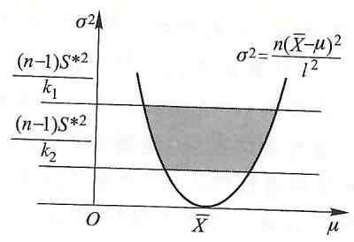

图 7.1 正态总体 $\left( {\mu,{\sigma }^{2}}\right)$ 的联合区间估计示意图.

#### 7.3.4 非正态总体参数的区间估计

对于非正态总体, 往往难以得到其有关统计量的精确分布, 一般都是在样本容量较大时, 用近似分布求出参数的区间估计.

一般地,设 $X \sim  {F}_{X}\left( {\cdot,\theta }\right)$,其样本均值为 $\bar{X}$ 和 ${S}_{n}^{2}$,则可以证明. 当样本容量 $n$ 充分大时,近似地有

$$
\frac{\bar{X} - E\left\lbrack  X\right\rbrack  }{{S}_{n}}\sqrt{n} \sim  N\left( {0,1}\right). \tag{7.3.13}
$$

例 7.3.6 (两点分布的参数的区间估计) 设总体 $X \sim  B\left( {1, p}\right)$,试求 $p$ 的置信度为 $1 - \alpha$ 的区间估计.

解 由于 $E\left\lbrack  X\right\rbrack   = p$ 和 ${S}_{n}^{2} = \bar{X}\left( {1 - \bar{X}}\right)$,利用 (7.3.13) 近似地有

$$
\frac{\bar{X} - p}{\sqrt{\bar{X}\left( {1 - \bar{X}}\right) }}\sqrt{n} \sim  N\left( {0,1}\right).
$$

计 对于给定的置信度 $1 - \alpha$,由标准正态分布表查得 ${u}_{1 - \frac{\alpha }{2}}$,就得到 $p$ 的区间估

$$
\left\lbrack  {\bar{X} - {u}_{1 - \frac{\alpha }{2}}\sqrt{\bar{X}\left( {1 - \bar{X}}\right) /n},\bar{X} + {u}_{1 - \frac{\alpha }{2}}\sqrt{\bar{X}\left( {1 - \bar{X}}\right) /n}}\right\rbrack .
$$

## 第七章小结与注记

(1) 本章中关于参数的点估计, 我们介绍了矩法估计、最大似然估计和顺序统计量估计三种方法, 每种方法的想法都很直观并且各不相同. 其中最能反映概率思想的是最大似然估计. 它一方面基于 “小概率事件在一次试验中近乎不发生” 这样一基本认知. 另一方面, 在求参数的最大似然估计时, 用到总体的分布类型, 从这一点上讲, 它一般比矩法估计和顺序统计量估计的性能好一些, 或者说其统计特性更好把握些. 也正是如此, 一般在作进一步的理论分析时, 往往假定有关参数的估计量为最大似然估计量.

(2)评价一个估计量的优劣,比起想起一种估计方法要难得多. 首先要定义优或劣的标准, 再考证一个统计量在该标准下是否比较优. 应当说, 要求一个统计量做到其均值等于待估计参数 (即无偏性), 是一个最起码的要求, 在此基础上找一个方差是最小的也是最朴素的愿望. 遗憾的是, 目前还没有一个构造性的万法 (比如复合函数求导就是构造性的方法, 而求不定积分就没有构造性的方法), 去求得任意总体的参数的一致最小方差无偏估计, 只能分门别类的讨论, 得到稍有普遍意义的方法.

(3) 与参数的点估计不同, 区间估计要求得到的参数估计的随机区间要满足给定的置信度, 这就要求在构造统计量的同时, 要寻求其概率分布. 这一点, 对于一般分布的总体难以做到, 我们只好介绍正态总体参数的区间估计.

(4)对于正态总体参数的区间估计,虽然我们解释了各种情形下区间估计的由来, 但基本上是死搬硬套的, 试想没有第六章的抽样分布基本定理及其推论, 我们将如何做得到!

## 第七章习题

7.1. 设总体 $X$ 的分布密度函数为

$$
f\left( {x,\theta }\right)  = \left\{  \begin{matrix} \theta \left( {\theta  + 1}\right) {x}^{\theta  - 1}\left( {1 - x}\right), & 0 < x \leq  1 \\  0, & \text{ 其他,} \end{matrix}\right.
$$

其中 $\theta  > 0.\left( {{X}_{1},{X}_{2},\cdots,{X}_{n}}\right)$ 为来自总体 $X$ 的简单随机样本,求未知参数 $\theta$ 的矩估计量.

7.2. 假设每升水中大肠杆菌的数目 $X$ 服从泊松分布 $\operatorname{Pois}\left( \lambda \right)$,其中 $\lambda  > 0$. 为了检验某种自来水消毒设备的效果, 现从消毒后的水中随机抽取 60 个样品 (每个样品为 1 升水) 进行化验, 结果如下:

<table><tr><td>大肠杆菌的个数/升</td><td>0</td><td>1</td><td>2</td><td>3</td><td>4</td><td>5</td></tr><tr><td>样品数</td><td>16</td><td>22</td><td>10</td><td>7</td><td>3</td><td>2</td></tr></table>

试求未知参数 $\lambda$ 的矩估计值. 7.3. 设总体 $X$ 的分布密度函数为 $f\left( {x,\theta }\right)  = \frac{1}{2\theta }{\mathrm{e}}^{-\frac{\left| x\right| }{\theta }}$,其中 $\theta  > 0$ 是未知参数, $\left( {{X}_{1},{X}_{2},\cdots,{X}_{n}}\right)$ 是 $X$ 的容量为 $n$ 的样本. 求 $\theta$ 的最大似然估计量.

7.4. 设总体 $X$ 的分布密度函数为

$$
f\left( {x,\theta }\right)  = \left\{  \begin{array}{ll} \frac{1}{\theta }{\mathrm{e}}^{-\frac{x - 1}{\theta }}, & x > 1, \\  0, & x \leq  1, \end{array}\right.
$$

其中 $\theta  > 0$ 是未知参数, $\left( {{X}_{1},{X}_{2},\cdots,{X}_{n}}\right)$ 是 $X$ 的容量为 $n$ 的样本. 求 $\theta$ 的最大似然估计量.

7.5. 设总体 $X$ 的分布列为

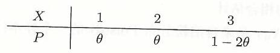

其中 $0 < \theta  < \frac{1}{2}$,今有样本观测值

1,1,1,3,2,1,3,2,2,1,2,2,3,1,1,2

试求 $\theta$ 的最大似然估计值.

7.6. 设总体 $X \sim  B\left( {m, p}\right)$,其中 $0 < p < 1, p$ 为未知参数, $m$ 为正整数且已知. $\left( {{X}_{1},{X}_{2},\cdots,{X}_{n}}\right)$ 是取自总体 $X$ 的样本,求未知参数 $p$ 的矩估计量 ${\widehat{p}}_{M}$ 及最大似然估计量

7.7. 设总体 $X$ 服从区间 $\left\lbrack  {\theta,{2\theta }}\right\rbrack  \left( {\theta  > 0}\right)$ 上的均匀分布, $\left( {{X}_{1},{X}_{2},\cdots,{X}_{n}}\right)$ 是取自总体 $X$ 的样本,试求 $\theta$ 的矩估计量 ${\widehat{\theta }}_{M}$ 及最大似然估计量 ${\widehat{\theta }}_{L}$.

7.8. 设总体 $X \sim  \operatorname{Exp}\left( \lambda \right)$,其中 $\lambda \left( { > 0}\right)$ 为未知参数,现从总体中抽得容量为 8 的样本观测值分别为

$$
{1250},{1265},{1245},{1260},{1275},{1248},{1252},{1261}
$$

试求 $\lambda$ 的矩估计值 ${\widehat{\lambda }}_{M}$ 及最大似然估计值 ${\widehat{\lambda }}_{L}$.

7.9. 设总体 $X$ 的密度函数为

$$
f\left( {x,\alpha,\beta }\right)  = \left\{  \begin{array}{ll} \frac{1}{\beta }{\mathrm{e}}^{-\frac{x - \alpha }{\beta }}, & \alpha  \leq  x,\;\alpha  > 0,\beta  > 0, \\  0, & \text{ 否则,} \end{array}\right.
$$

其中 $\alpha,\beta$ 为未知参数, $\left( {{X}_{1},{X}_{2},\cdots,{X}_{n}}\right)$ 是取自总体 $X$ 的样本,试求 $\alpha,\beta$ 的矩估计量及最大似然估计量.

7.10. 已知某种灯泡的寿命服从指数分布, 现从该种灯泡随机抽取 12 只, 测得寿命分别为 (单位: 小时):

$$
{1120},{1020},{1196},{1126},{1296},{1306},{1095},{1180},{1280},{1322},{1091},{1122}
$$

试用最大似然估计方法估计出这种型号灯泡寿命超过 1500 小时的概率.

7.11. 假设总体 $X$ 服从参数为 $p$ 的 $0 - 1$ 分布 $\left( {0 < p < 1}\right),\left( {{X}_{1},\cdots,{X}_{n}}\right)$ 为来自 $X$ 的样本. (1) 试求 ${p}^{2}$ 的无偏估计. (2) 证明: $1/p$ 的无偏估计不存在.

7.12. 若总体 $X$ 的分布密度函数为

$$
f\left( {x,\theta }\right)  = \left\{  \begin{array}{ll} \frac{x}{\theta }{\mathrm{e}}^{-\frac{{x}^{2}}{2\theta }}, & x > 0, \\  0, & x \leq  0, \end{array}\right.
$$

其中 $\theta \left( { > 0}\right)$ 为未知参数, $\left( {{X}_{1},{X}_{2},\cdots,{X}_{n}}\right)$ 是取自总体 $X$ 的样本,试求 $\theta$ 的无偏估计量.

7.13. 设总体 $X$ 在区间 $\left\lbrack  {0,\theta }\right\rbrack$ 上服从均匀分布,其中参数 $\theta$ 未知, $\left( {{X}_{1},\cdots,{X}_{n}}\right) \left( {n > 2}\right)$ 是从该总体抽取的样本. (1) 证明 ${T}_{1} = 2\bar{X},{T}_{2} = \left( {n + 1}\right) {X}_{\left( 1\right) }$ 均为 $\theta$ 的无偏估计量. (2) 问哪个估计量更为有效？

7.14. 设 $\left( {{X}_{1},\cdots,{X}_{n}}\right)$ 是来自服从区间 $\left\lbrack  {0,{2\theta }}\right\rbrack$ 均匀分布的一个样本,求 $\theta$ 的极大似然估计量,并证明其是 $\theta$ 的相合估计.

7.15. 设 $\left( {{X}_{1},\cdots,{X}_{n}}\right)$ 是来自泊松分布 $\operatorname{Pois}\left( \theta \right)$ 的一个样本,证明: $2\bar{X} + 5$ 是 ${2\theta } + 5$ 的相合估计.

7.16. 设总体 $X$ 服从二项分布 $B\left( {{10},\theta }\right)$,其中 $\theta \left( {0 < \theta  < 1}\right)$ 为未知参数, $\left( {{X}_{1},{X}_{2},\cdots,{X}_{n}}\right)$ 是来自总体 $X$ 的一个样本. (1) 求 $\theta$ 的最大似然估计量. (2) 证明该估计量是无偏的并且为 $\theta$ 的相合估计.

7.17. 设总体 $X \sim  N\left( {\mu,4}\right)$,其中 $\mu$ 未知. $\left( {{X}_{1},{X}_{2},\cdots,{X}_{n}}\right)$ 为来自总体 $X$ 的简单随机样本,则 $\left\lbrack  {\bar{X} - \frac{2{u}_{0.95}}{\sqrt{n}},\bar{X} + \frac{2{u}_{0.95}}{\sqrt{n}}}\right\rbrack$ 作为 $\mu$ 的置信区间,其置信度为多少并说明原因? 要使置信区间的长度不超过 1, 样本容量至少为多少?

7.18. 设总体 $X$ 服从 $N\left( {\mu,1}\right)$,其中 $\mu$ 为未知参数. $\left( {{x}_{1},{x}_{2},\cdots,{x}_{n}}\right)$ 是来自总体 $X$ 的一个样本观测值. 假定由这组观测值求出 $\mu$ 的置信水平为 $1 - \alpha$ 的置信区间为 $\left\lbrack  {{0.2},5}\right\rbrack$,由这组观测值确定 $\theta  = {3\mu } + 7$ 的置信度为 $1 - \alpha$ 的置信区间.

7.19. 某自动包装机包装洗衣粉,其重量 $X \sim  N\left( {\mu,{\sigma }^{2}}\right)$,其中 $\mu,\sigma$ 未知. 今随机抽取 12 袋测得其重量,经计算得样本均值 $\bar{x} = {1000.25}\left( \mathrm{\;g}\right)$,修正样本标准差 ${s}_{12}^{ * } = {2.6329}\left( \mathrm{\;g}\right)$,试求

(1) 总体均值 $\mu$ 的置信度为 0.95 的置信区间,

(2) 总体标准差 $\sigma$ 的置信度为 0.95 的置信区间.

7.20. 为了比较甲、乙两类试验田的收获量, 随机抽取甲类试验田 8 块, 乙类试验田 10 块, 测得亩产量如下 (单位: kg):

甲类 :510,628,583,615,554,612,530,525

乙类:433,535,398,470,560,567,498,480,503,426

假定这两类试验田的亩产量都服从正态分布,且方差相同,求两总体均值之差 ${\mu }_{\text{甲 }} - {\mu }_{乙}$ 的置信度为 ${95}\%$ 的置信区间.

7.21. 有两位化验员 $A$ 与 $B$ 独立地对一批聚合物含氯量用同样方法各进行 10 次重复测定,其样本方差分别为 ${S}_{\# }^{*2} = {0.541},{S}_{Z}^{*2} = {0.606}$,若 $A$ 与 $B$ 的测量值都服从正态分布,试求总体方差比 ${\sigma }_{\text{甲 }}^{2}/{\sigma }_{\text{乙 }}^{2}$ 的 ${95}\%$ 的置信区间.

# 第八章 假设检验

假设检验是统计推断的一个重要方面. 在解决实际问题时, 往往可以依据经验大体判断出某种随机变化的量的分布类型, 或者参数的取值在某个范围内. 但无法从数学上说明其正确性或合理性, 此时通过观测样本就可以用假设检验来推断该经验结论是否正确, 或者在哪个置信度下, 该经验的结论是可信的. 假设检验可分为非参数假设检验和参数假设检验, 前者是对总体的分布提出假设 (比如, $\left. {{H}_{0} : X \sim  {F}_{0}\left( {\cdot,\theta }\right) }\right)$,后者是总体的分布类型是已知的,其统计假设是关于参数的 (比如, ${H}_{0} : \theta  \leq  {\theta }_{0}$ ),需要我们通过样本 $\left( {{X}_{1},{X}_{2},\cdots,{X}_{n}}\right)$ 来对假设作出推断 (比如: 拒绝 ${H}_{0}$ 还是接收 ${H}_{0}$ ? 在何种显著性水平下?).

本章在介绍一般假设检验问题的提法和假设检验过程中存在的两类错误的基础上, 分别介绍参数假设和非参数假设的显著性检验. 在参数的显著性检验中, 主要介绍正态总体参数的假设检验, 简单提及其他非正态总体参数的显著性检验的近似方法. 在非参数假设检验中,介绍多项分布的 ${\chi }^{2}$ 拟合检验和一般分布的 ${\chi }^{2}$ 拟合检验.

## 8.1 假设检验与两类错误

假设检验的基本思路也是基于大家的一个共识, 那就是 “小概率事件在一次试验中几乎不会发生”. 稍具体点讲,如果某假设 ${H}_{0}$ 成立时事件 $A$ 发生的可能性很小. 但样本观测的结果却是 $A$ 发生了,这说明 $A$ 不是小概率事件,这个矛盾说明假设 ${H}_{0}$ 应该是不成立的.

我们先以单个正态总体的均值的假设检验问题为例, 对以上思路作具体解释, 进而介绍一般假设检验问题的提法和做检验时可能会犯的两类错误.

例 8.1.1 设总体 $X \sim  N\left( {\mu,{\sigma }_{0}^{2}}\right),{\sigma }_{0}^{2}$ 已知. $\left( {{X}_{1},{X}_{2},\cdots,{X}_{n}}\right)$ 为其样本,试对假设检验问题:

$$
{H}_{0}\text{(原假设):}\mu  = {\mu }_{0},\;{H}_{1}\text{(备选假设):}\mu  \neq  {\mu }_{0}
$$

做检验.

解 由于 $\bar{X}$ 是 $\mu$ 的一致最小方差无偏估计,若原假设 ${H}_{0}$ 成立, $\bar{X}$ 应与 ${\mu }_{0}$ 比较接近. 换言之,若 $\left| {\bar{X} - {\mu }_{0}}\right|$ 较大,则说明原假设 ${H}_{0}$ 不成立.

由于 $\bar{X} \sim  N\left( {{\mu }_{0},\frac{{\sigma }_{0}^{2}}{n}}\right)$,对于很小的正数 $\alpha$,可由

$$
P\left( {\left| \frac{\bar{X} - {\mu }_{0}}{\sqrt{\frac{{\sigma }_{0}^{2}}{n}}}\right|  \geq  {u}_{1 - \frac{\alpha }{2}}}\right)  = \alpha, \tag{8.1.1}
$$

查标准正态分布表得分位点 ${u}_{1 - \frac{\alpha }{2}}$.

由于 $\alpha$ 很小,也就是说,事件

$$
\left\{  {\omega  : \left| \frac{\bar{X}\left( \omega \right)  - {\mu }_{0}}{\sqrt{\frac{{\sigma }_{0}^{2}}{n}}}\right|  \geq  {u}_{1 - \frac{\alpha }{2}}}\right\}
$$

在一次试验中几乎不会发生. 所以,若一次试验出现的结果为 $\omega$,得到样本观测值 $\left( {{X}_{1}\left( \omega \right),{X}_{2}\left( \omega \right),\cdots,{X}_{n}\left( \omega \right) }\right)$ 使得

$$
\left| \frac{\bar{X}\left( \omega \right)  - {\mu }_{0}}{\sqrt{\frac{{\sigma }_{0}^{2}}{n}}}\right|  \geq  {u}_{1 - \frac{\alpha }{2}},
$$

我们应拒绝原假设 ${H}_{0}$,否则接受原假设 ${H}_{0}$.

#### 8.1.1 假设检验问题的提法

假设检验问题一般分为参数假设检验和非参数假设检验两类问题. 一般根据实际问题的需要,都要提出原假设 $\left( {H}_{0}\right)$ 和备选假设 $\left( {H}_{1}\right)$,其中的原假设是由经验得到的一个事实或者基于经验的某种猜测而设定的, 而备选假设是当原假设被拒绝时, 可以接受的其他事实. 另外, 假设检验问题的最后答案是要么拒绝 ${H}_{0}$ (接受 ${H}_{1}$ )、要么接受 ${H}_{0}$ (拒绝 ${H}_{1}$ ),

在参数的假设检验中,认为总体 $X$ 的分布类型 ${F}_{X}\left( {\cdot,\theta }\right)$ 是已知的,而参数取自集合 $\Theta$. 此时,原假设和备选假设都是关于参数的. 比如,设 ${\Theta }_{0} \subset  \Theta$ 和 ${\Theta }_{1} \subset  \Theta$,且 ${\Theta }_{0} \cap  {\Theta }_{1} = \varnothing$,可有假设检验问题:

$$
{H}_{0} : \theta  \in  {\Theta }_{0},\;{H}_{1} : \theta  \in  {\Theta }_{1}.
$$

对这一问题作统计推断,就是在 ${H}_{0}$ 成立的前提下,从样本 $\left( {{X}_{1},{X}_{2},\cdots,{X}_{n}}\right)$ 构造一个概率不超过 $\alpha$ 的小概率事件,然后基于一次观测的样本观测值是否使得该小概率事件发生,来决定是否拒绝原假设 ${H}_{0}$.

由于一次样本观测值为 ${\mathbf{R}}^{n}$ 中的一个点,所以假设检验问题的回答. 最终是将 ${\mathbf{R}}^{n}$ 分成互不相交的两部分,一部分是使得小概率事件发生的点的集合. 我们称其为该假设检验问题的拒绝域, 另一部分是拒绝域的余集, 称其为该假设检验问题的接受域. 在例 8.1.1 中, 拒绝域为

$$
\left\{  {\left( {{x}_{1},{x}_{2},\cdots,{x}_{n}}\right)  \in  {\mathbf{R}}^{n} : \left| \frac{\left( {{x}_{1} + {x}_{2} + \cdots  + {x}_{n}}\right) /n - {\mu }_{0}}{\sqrt{\frac{{\sigma }_{0}^{2}}{n}}}\right|  \geq  {u}_{1 - \frac{\alpha }{2}}}\right\}
$$

对于非参数假设检验问题, 其原假设和备选假设都是关于总体分布的. 例如. 要判断一个 $X$ 是否服从正态分布,可有

$$
{H}_{0} : X \sim  N\left( {\mu,{\sigma }^{2}}\right),\;{H}_{1} : X \sim  N\left( {\mu,{\sigma }^{2}}\right).
$$

做检验时,要先求出均值 $\mu$ 和 ${\sigma }^{2}$ 这两个参数的最大似然估计.

对于一般总体 $X$,可有

$$
{H}_{0} : X \sim  {F}_{0}\left( \theta \right),\;{H}_{1} : X \sim  {F}_{0}\left( \theta \right),
$$

其中 ${F}_{0}\left( \theta \right)$ 为一已知的分布类型, $\theta$ 为参数,取值于某参数集 $\theta$. 一般在做检验时, 要先对参数作最大似然估计, 才便于构造出相应的统计量.

#### 8.1.2 假设检验的两类错误

如前所述,对一个假设检验问题作检验,就是在原假设 ${H}_{0}$ 成立的前提下构造一个小概率事件,由该事件是否发生,来决定是否拒绝原假设 ${H}_{0}$.

这种作法会出现两种类型的错误判断, 其中第一种错误的判断就是, 本来原假设 ${H}_{0}$ 是真实的或正确的,此时小概率事件可能发生,也可能不发生. 一旦该事件发生我们就拒绝 ${H}_{0}$,即认为 ${H}_{0}$ 不真实或不正确. 这种错误我们称为第一类错误,又称拒真错误. 犯这种错误的概率恰是 $\alpha$,即

$$
\alpha  = P\left( \right. \text{拒绝}{H}_{0} \mid  {H}_{0}\text{真})\text{.}
$$

这种作法还会出现另一种错误的判断,那就是原假设 ${H}_{0}$ 是不真实的或不正确的,此时若小概率事件未发生,我们就不拒绝 ${H}_{0}$,即认为 ${H}_{0}$ 是真实的或正确的. 这种错误我们称为第二类错误, 又称受伪错误. 犯这种错误的概率我们记为 $\beta$, 即

$$
\beta  = P\left( \right. \text{接受}{H}_{0} \mid  {H}_{0}\text{伪})\text{.}
$$

关于犯两类错误的概率 $\alpha$ 和 $\beta$,我们需要说明几点.

(1) 首先, $\beta  \neq  1 - \alpha$,并且可以证明,在样本容量 $n$ 一定时,同时缩小两类错误是不可能的.

(2)当样本容量 $n$ 一定时,犯第一类错误的概率 $\alpha$ 越小,则犯第二类错误的概率 $\beta$ 就会越大. 这一点,我们可以由下面的例 8.1.2 看出,也与我们的生活经验相符, 那就是, 当你不轻易相信一个消息的真实性时 (犯第二类错误的可能性较小), 就可能犯贸然拒绝的错误 (犯第一类错误的可能性较大). 而轻信 (容易犯第二类错误) 就很少有拒绝错的风险 (不容易犯第一类错误).

(3) 现实中样本容量不可能无限制的大, 从而同时控制两类错误是不可能的. 一般都是在控制第二类错误的概率 $\beta$ 不超过某值 ${\beta }_{0}$ 的前提下,使犯第一类错误的概率 $\alpha$ 尽可能小.

(4) 实际应用中有一种检验方法是只控制第一类错误而不控制第二类错误, 这种检验方法称为显著性检验. 也就是说,当原假设 ${H}_{0}$ “显著地” 不真或不正确时就拒绝 ${H}_{0}$,否则不拒绝或勉强接受 ${H}_{0}$. 这里所谓 “显著地” 不真,是指当原假设 ${H}_{0}$ 成立时,某事件发生的概率很小,几乎不会发生,但是却在一次试验中发生了,这说明原假设 ${H}_{0}$ 明显是不真的.

对于显著性检验, 需要强调指出的是这种检验方法实际上是 “保护” (不轻易拒绝) 原假设 ${H}_{0}$ 的,这是因为当小概率事件发生时才拒绝它,但小概率事件通常几乎不发生. 另外,显著性检验的结果如果是拒绝原假设 ${H}_{0}$ 的,那么该推断的可信性较高,而若检验的结果是不拒绝原假设 ${H}_{0}$,那么此时接受原假设 ${H}_{0}$ 的推断对原假设 ${H}_{0}$ 的成立是没有说服力的,这是因为一个事件发生概率较大, 它在一次试验中发生是应该的. 所以我们说, 当想用显著性检验对某一猜测结论作强有力的支持时, 应将该猜测结论的反面作为原假设.

例 8.1.2 设总体 $X \sim  N\left( {\mu,{\sigma }_{0}^{2}}\right),{\sigma }_{0}^{2}$ 已知. $\left( {{X}_{1},{X}_{2},\cdots,{X}_{n}}\right)$ 为其样本,试对假设检验问题:

$$
{H}_{0} : \mu  = {\mu }_{0},\;{H}_{1} : \mu  = {\mu }_{1}
$$

做检验 (其中 ${\mu }_{0} < {\mu }_{1}$ ),并解释该检验的第一类错误的概率 $\alpha$ 与第二类错误的概率 $\beta$ 之间的关系.

解 与例 8.1.1 的分析类似, 此检验问题的推断结论仍为当

$$
\left| \frac{\bar{X} - {\mu }_{0}}{\sqrt{\frac{{\sigma }_{0}^{2}}{n}}}\right|  \geq  {u}_{1 - \frac{\alpha }{2}}
$$

时拒绝原假设 ${H}_{0}$.

由于 $\bar{X} \sim  N\left( {{\mu }_{0},\frac{{\sigma }^{2}}{n}}\right)$,用 $\bar{X}$ 的分布密度函数,我们将此检验的第一类错误的概率 $\alpha$ 与第二类错误的概率 $\beta$ 标于图 8.1 上.

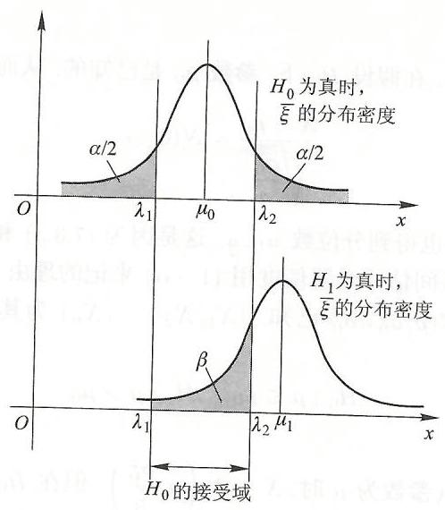

图 8.1 假设检验的两类错误示意图.

图 8.1 的上半部的阴影部分表示当 ${H}_{0}$ 为真时,拒绝 ${H}_{0}$ 的概率 $\alpha$. 下半部的阴影部分表示当备选假设 ${H}_{1}$ 为真时,接受 ${H}_{0}$ 的概率,即概率 $\beta$. 从图 8.1 容易看出,要使 $\alpha$ 变小,必然使得 $\beta$ 变大. 反之,要使 $\beta$ 变小,必然使得 $\alpha$ 变大. $\square$

## 8.2 正态总体参数的假设检验

与参数的区间估计类似, 由于正态总体的抽样分布定理及其推论 (见定理 6.3.1 和推论 6.3.1 - 推论 6.3.4),我们可以得到有关统计量的精确分布. 从而可以通过查表或计算得到分位数, 给出较为准确的拒绝域. 而对非正态总体参数的假设检验问题, 只能利用近似分布给出拒绝域.

同时, 我们会看到, 这里对于单个正态总体、两个独立正态总体的有关参数的假设检验问题, 与参数的区间估计问题是相对应的, 而且对应的统计量 (或样本函数) 和分位数都是相同的.

我们通过回顾 7.3.1 节的区间估计和例 8.1.1 来说明区间估计与假设检验的这种联系.

在 7.3.1 节中, $\mu$ 是未知的,我们通过样本函数

$$
\frac{\bar{X} - \mu }{\sqrt{\frac{{\sigma }_{0}^{2}}{n}}} \sim  N\left( {0,1}\right)
$$

由 (7.3.3) 查表或用 $\mathrm{R}$ 软件计算得到分位数 ${u}_{1 - \frac{\alpha }{2}}$,进而由等式变形得到 $\mu$ 的区间估计.

而在例 8.1.1 中,在假设 ${H}_{0}$ 下,参数 ${\mu }_{0}$ 是已知的,从而统计量

$$
\frac{\bar{X} - {\mu }_{0}}{\sqrt{\frac{{\sigma }_{0}^{2}}{n}}} \sim  N\left( {0,1}\right)
$$

进而由 (8.1.1) 查表也得到分位数 ${u}_{1 - \frac{\alpha }{2}}$,这是因为 (7.3.3) 和 (8.1.1) 是同一个式子,这也是我们在区间估计时置信度用 $\left( {1 - \alpha }\right)$ 来记的理由.

设总体 $X \sim  N\left( {\mu,{\sigma }_{0}^{2}}\right),{\sigma }_{0}^{2}$ 已知. $\left( {{X}_{1},{X}_{2},\cdots,{X}_{n}}\right)$ 为其样本,我们讨论如何对假设检验问题:

$$
{H}_{0} : \mu  \leq  {\mu }_{0},\;{H}_{1} : \mu  > {\mu }_{0}
$$

做检验. 我们知道,当真参数为 $\mu$ 时, $\bar{X} \sim  N\left( {\mu,\frac{{\sigma }_{0}^{2}}{n}}\right)$. 但在 ${H}_{0}$ 下, $\mu$ 的具体取值未确定,从而无法求得样本函数 $\frac{\bar{X} - \mu }{\sqrt{\frac{{\sigma }_{0}^{2}}{n}}}$ 的值. 另一方面,我们能算出统计量 $\frac{\bar{X} - {\mu }_{0}}{\sqrt{\frac{{\sigma }_{0}^{2}}{n}}}$ 的值, 却无法确定该统计量的分布.

为克服这一困难,我们注意到当 ${H}_{0}$ 成立时,有

$$
\frac{\bar{X} - \mu }{\sqrt{\frac{{\sigma }_{0}^{2}}{n}}} \geq  \frac{\bar{X} - {\mu }_{0}}{\sqrt{\frac{{\sigma }_{0}^{2}}{n}}}
$$

从而

$$
\alpha  = P\left( {\frac{\bar{X} - \mu }{\sqrt{\frac{{\sigma }_{0}^{2}}{n}}} \geq  {u}_{1 - \alpha }}\right)  \geq  P\left( {\frac{\bar{X} - {\mu }_{0}}{\sqrt{\frac{{\sigma }_{0}^{2}}{n}}} \geq  {u}_{1 - \alpha }}\right).
$$

所以, 当

$$
\frac{\bar{X} - {\mu }_{0}}{\sqrt{\frac{{\sigma }_{0}^{2}}{n}}} \geq  {u}_{1 - \alpha } \tag{8.2.1}
$$

时拒绝 ${H}_{0}$,则犯第一类错误的概率不超过 $\alpha$.

对 (8.2.1) 所示的拒绝域,我们还可以给出直观解释. 因为原假设 ${H}_{0}$ 为 $\mu  \leq  {\mu }_{0}$,而 $\bar{X}$ 是 $\mu$ 的一致最小方差无偏估计,若原假设 ${H}_{0}$ 成立,它应与 $\mu$ 较为接近,也就是小于或等于 ${\mu }_{0}$,而不能使 $\bar{X} - {\mu }_{0}$ 很大. 所以当 $\bar{X} - {\mu }_{0}$ 较大时,应该拒绝 ${H}_{0}$. 至于所谓的 “较大” 则是由分位数 ${u}_{1 - \alpha }$ 来界定的.

受例 8.1.1 和以上讨论的启发, 以及参数的区间估计与参数的假设检验中小概率事件构造方法的联系, 我们容易得到后面的表 8.1 一 表 8.4, 有关样本均值与样本方差的记号参见表 7.1. 并约定用统计量记号的小写表示该统计量在代入样本观测值后的取值.

表 8.1 单个正态总体均值 $\mu$ 的假设检验的拒绝域 (显著性水平为 $\alpha$ )

<table><tr><td>序号</td><td>${H}_{0}$</td><td>${H}_{1}$</td><td>${\sigma }^{2}$ 已知</td><td>${\sigma }^{2}$ 未知</td></tr><tr><td>I</td><td>$\mu  = {\mu }_{0}$</td><td>$\mu  \neq  {\mu }_{0}$</td><td>$\frac{\left| \bar{x} - {\mu }_{0}\right| }{\sigma /\sqrt{n}} \geq  {u}_{1 - \frac{\alpha }{2}}$</td><td>$\frac{\left| \bar{x} - {\mu }_{0}\right| }{{s}_{n}/\sqrt{n - 1}} \geq  {t}_{1 - \frac{\alpha }{2}}\left( {n - 1}\right)$</td></tr><tr><td>II</td><td>$\mu  = {\mu }_{0}$</td><td>$\mu  > {\mu }_{0}$</td><td rowspan="2">$\frac{\bar{x} - {\mu }_{0}}{\sigma /\sqrt{n}} \geq  {u}_{1 - \alpha }$</td><td rowspan="2">$\frac{\bar{x} - {\mu }_{0}}{{s}_{n}/\sqrt{n - 1}} \geq  {t}_{1 - \alpha }\left( {n - 1}\right)$</td></tr><tr><td>Ⅲ</td><td>$\mu  \leq  {\mu }_{0}$</td><td>$\mu  > {\mu }_{0}$</td></tr><tr><td>IV</td><td>$\mu  = {\mu }_{0}$</td><td>$\mu  < {\mu }_{0}$</td><td rowspan="2">$\frac{\bar{x} - {\mu }_{0}}{\sigma /\sqrt{n}} \leq  {u}_{\alpha }$</td><td rowspan="2">$\frac{\bar{x} - {\mu }_{0}}{{s}_{n}/\sqrt{n - 1}} \leq  {t}_{\alpha }\left( {n - 1}\right)$</td></tr><tr><td>V</td><td>$\mu  \geq  {\mu }_{0}$</td><td>$\mu  < {\mu }_{0}$</td></tr></table>

注: 统计软件在对假设检验问题作显著性检验时, 往往不事先给定显著性水平,而是打印出一个 $p$ 值,它是拒绝原假设时所犯错误 (即第一类错误) 的概率, 也就是显著性水平.

作为假设检验的示例,这里举几个简单的例子. 这些例子,用 $\mathrm{R}$ 软件的 t.test(   ), var.test(   ) 和 chisq.test(   ) 等很容易实现. 有关较为接近实际的例子及 $\mathrm{R}$ 软件实现参见第九章的相关内容.

例 8.2.1 某砖厂生产的砖的抗拉强度 $X$ 服从正态分布 $N\left( {\mu,{1.1}^{2}}\right)$. 今从该)产品中随机抽取 6 块砖, 测得其抗拉强度如下 (单位: MPa):

$\begin{array}{llllll} {32.56} & {29.66} & {31.64} & {30.00} & {31.87} & {31.03} \end{array}$

试检验这批砖的平均抗拉强度为 32.50 是否成立,取显著性水平 $\alpha  = {0.05}$.

解 依题意,这是一个单个正态总体均值的假设检验问题,其中 ${\sigma }^{2} = {1.1}^{2}$ 为已知.

第一步: 提出假设. 按题目的要求,应将原假设 ${H}_{0}$ 和备选假设 ${H}_{1}$ 提为

$$
{H}_{0} : \mu  = {32.50},\;{H}_{1} : \mu  \neq  {32.50}.
$$

第二步: 选取统计量. 由表 8.1 的第一行, 选取统计量为

$$
U = \frac{\bar{X} - {32.50}}{{1.1}/\sqrt{6}} \sim  N\left( {0,1}\right).
$$

第三步: 求分位点. 令 $P\left( {\left| U\right|  \geq  {u}_{0.975}}\right)  = {0.05}$,查正态分布表或用 B 软件计算得 ${u}_{0.975} = {1.96}$.

第四步: 计算统计量的观测值. 经计算

$$
\bar{x} = \frac{1}{6}\left( {{32.56} + {29.66} + {31.64} + {30.00} + {31.87} + {31.03}}\right)  = {31.13},
$$

得到

$$
U = \frac{\bar{x} - {32.50}}{{1.1}/\sqrt{6}} = \frac{{31.13} - {32.50}}{{1.1}/\sqrt{6}} =  - {3.05}.
$$

第五步: 作判断. 由于 $\left| U\right|  = {3.05} > {u}_{0.975} = {1.96}$,所以拒绝 ${H}_{0}$,即在显著性水平 $\alpha  = {0.05}$ 下,认为这批砖的平均抗拉强度为 ${32.50}\mathrm{{MPa}}$ 的假设不成立.

另外,请读者执行如下 $\mathrm{R}$ 程序,看有什么结果.

---

x<-c(32.56,29.66,31.64,30.00,31.87,31.03)

	mu<-32.50;sigma<-1.1

	alpha<-0.05

		z<-(mean(x)-mu)/(sigma/sqrt(length(x)))

		list(abs.U=abs(z), u.value=qnorm(1-alpha/2))

---

例 8.2.2 地质勘探中常用热敏电阻测温仪间接测量地热来勘探井底温度, 设测量值 $X$ 服从正态分布 $N\left( {\mu,{\sigma }^{2}}\right)$. 重复测量 7 次,测得温度如下 (单位: ${}^{ \circ  }\mathrm{C}$ ):

---

$\begin{array}{lllllll} {112.0} & {113.4} & {111.2} & {114.5} & {112.5} & {112.9} & {113.6} \end{array}$

---

现用某种精确方法测得温度的真值为 ${\mu }_{0} = {112.6}$,试问用热敏电阻测温仪间接测量的井底温度有无系统偏差? 取显著性水平 $\alpha  = {0.05}$.

解 依题意,这是一个单个正态总体均值的假设检验问题,其中 ${\sigma }^{2}$ 未知.

第一步: 提出假设. 按题目的要求,应将原假设 ${H}_{0}$ 和备选假设 ${H}_{1}$ 提为

$$
{H}_{0} : \mu  = {112.6},\;{H}_{1} : \mu  \neq  {112.6}.
$$

第二步: 选取统计量. 由表 8.1 的第一行, 选取统计量为

$$
T = \frac{\bar{X} - {112.6}}{{S}_{n}/\sqrt{6}} \sim  t\left( 6\right)
$$

第三步: 求分位点. 令 $P\left( {\left| T\right|  \geq  {t}_{0.975}\left( 6\right) }\right)  = {0.05}$,查 $t$ 分布表或用 $\mathrm{R}$ 软件计算得 ${t}_{0.975}\left( 6\right)  = {2.447}$.

第四步: 计算统计量的观测值. 经计算

$$
\bar{x} = \frac{1}{7}\left( {{112.0} + {113.4} + {111.2} + {114.5} + {112.5} + {112.9} + {113.6}}\right)  = {112.87},
$$

$$
{s}_{n}^{2} = \frac{1}{7}\left\lbrack  {{\left( {112.0} - {112.87}\right) }^{2} + {\left( {113.4} - {112.87}\right) }^{2} + {\left( {111.2} - {112.87}\right) }^{2} + }\right.
$$

$$
{\left( {114.5} - {112.87}\right) }^{2} + {\left( {112.5} - {112.87}\right) }^{2} + {\left( {112.9} - {112.87}\right) }^{2} +
$$

$$
\left. {\left( {113.6} - {112.87}\right) }^{2}\right\rbrack   = {1.092}^{2},
$$

$$
T = \frac{\bar{x} - {112.6}}{{s}_{n}/\sqrt{6}} = {0.6577}.
$$

第五步: 作判断. 由于 $\left| T\right|  = {0.6577} < {t}_{0.975}\left( 6\right)  = {2.447}$,所以不拒绝 ${H}_{0}$. 即在显著性水平 $\alpha  = {0.05}$ 下,用热敏电阻测温仪间接测量的井底温度没有系统偏差.

另外,请读者执行如下 $\mathrm{R}$ 程序,看有什么结果.

---

			x<-c(112.0,113.4,111.2,114.5,112.5,112.9,113.6)

		mu<-112.6

			alpha<-0.05

		t<-(mean(x)-mu)/(sd(x)/sqrt(length(x)))

list(abs.T=abs(t), t.value=qt(1-alpha/2, length(x)-1))

---

表 8.2 单个正态总体方差 ${\sigma }^{2}$ 的假设检验的拒绝域 (显著性水平为 $\alpha$ )

<table><tr><td>序号</td><td>${H}_{0}$</td><td>${H}_{1}$</td><td>$\mu$ 已知</td><td>$\mu$ 未知</td></tr><tr><td>I</td><td>${\sigma }^{2} = {\sigma }_{0}^{2}$</td><td>${\sigma }^{2} \neq  {\sigma }_{0}^{2}$</td><td>$\frac{\mathop{\sum }\limits_{{i = 1}}^{n}{\left( {x}_{i} - \mu \right) }^{2}}{{\sigma }_{0}^{2}} \leq  {\chi }_{\frac{\alpha }{2}}^{2}\left( n\right)$ 或</td><td/></tr><tr><td>II</td><td>${\sigma }^{2} = {\sigma }_{0}^{2}$</td><td>${\sigma }^{2} > {\sigma }_{0}^{2}$</td><td/><td/></tr><tr><td>III</td><td>${\sigma }^{2} \leq  {\sigma }_{0}^{2}$</td><td>${\sigma }^{2} > {\sigma }_{0}^{2}$</td><td>$\frac{\mathop{\sum }\limits_{{i = 1}}^{n}{\left( {x}_{i} - \mu \right) }^{2}}{{\sigma }_{0}^{2}} \geq  {\chi }_{1 - \alpha }^{2}\left( n\right)$</td><td/></tr><tr><td>IV V</td><td>${\sigma }^{2} = {\sigma }_{0}^{2}$ ${\sigma }^{2} \geq  {\sigma }_{0}^{2}$</td><td>${\sigma }^{2} < {\sigma }_{0}^{2}$ ${\sigma }^{2} < {\sigma }_{0}^{2}$</td><td>$\frac{\mathop{\sum }\limits_{{i = 1}}^{n}{\left( {x}_{i} - \mu \right) }^{2}}{{\sigma }_{0}^{2}} \leq  \lambda$</td><td>$\frac{\mathop{\sum }\limits_{{i = 1}}^{n}{\left( {x}_{i} - \bar{x}\right) }^{2}}{{\sigma }_{0}^{2}} \leq  {\chi }_{\alpha }^{2}\left( {n - 1}\right)$</td></tr></table>

例 8.2.3 某涤纶厂生产的涤纶的纤度 (纤维的粗细程度) 在正常生产条件卜,服从正态分布 $N\left( {{1.405},{0.048}^{2}}\right)$. 某日随机地抽取 5 根纤维,测得纤度如下:

$\begin{array}{lllll} {1.32} & {1.55} & {1.36} & {1.40} & {1.44} \end{array}$

试问这一天生产的涤纶的纤度的方差是否正常 (取显著性水平 $\alpha  = {0.05}$ ).

解 依题意,这是一个单个正态总体方差的假设检验问题,其中 ${\mu }_{0} = {1.405}$ 已知.

按题目的要求,应将原假设 ${H}_{0}$ 和备选假设 ${H}_{1}$ 提为

$$
{H}_{0} : {\sigma }^{2} = {0.048}^{2},\;{H}_{1} : {\sigma }^{2} \neq  {0.048}^{2}.
$$

由表 8.2 的第一行, 选取统计量为

$$
Z = \frac{\mathop{\sum }\limits_{{i = 1}}^{n}{\left( {X}_{i} - {\mu }_{0}\right) }^{2}}{{\sigma }_{0}^{2}} \sim  {\chi }^{2}\left( n\right).
$$

令 $P\left( {{\chi }_{0.025}^{2}\left( 5\right)  \leq  Z \leq  {\chi }_{0.975}^{2}\left( 5\right) }\right)  = {0.05}$,查 ${\chi }^{2}$ 分布表或用 $\mathrm{R}$ 软件计算得 ${\chi }_{0.025}^{2}\left( 5\right)  = {0.831}$ 和 ${\chi }_{0.975}^{2}\left( 5\right)  = {12.833}$.

经计算

$$
Z = \frac{1}{{0.048}^{2}}\left\lbrack  {{\left( {1.32} - {1.405}\right) }^{2} + {\left( {1.55} - {1.405}\right) }^{2} + {\left( {1.36} - {1.405}\right) }^{2} + }\right.
$$

$$
\left. {{\left( {1.40} - {1.405}\right) }^{2} + {\left( {1.44} - {1.405}\right) }^{2}}\right\rbrack   = {13.683}\text{.}
$$

由于 $Z = {13.683} > {\chi }_{0.975}^{2}\left( 5\right)  = {12.833}$,所以拒绝 ${H}_{0}$,即在显著性水平 $\alpha  = {0.05}$ 下, 这一天生产的涤纶的纤度的方差不正常.

另外,请读者执行如下 $\mathrm{R}$ 程序,看有什么结果.

x<-c(1.32,1.55,1.36,1.40,1.44)

mu0<-1.405; sigma0<-0.048

alpha<-0.05

z<-sum((x-mu0^2)/sigma0^2

list(x2=z, chi.value=c(qchisq(alpha/2, length(x)),

qchisq(1-alpha/2, length(x)))

例 8.2.4 数据与总体假设同例 8.2.3,但 $\mu$ 未知. 试问这一天生产的涤纶的纤度的方差是否正常 (取显著性水平 $\alpha  = {0.05}$ ).

解 依题意,这是一个单个正态总体方差的假设检验问题,其中 $\mu$ 未知.

按题目的要求, 提出

$$
{H}_{0} : {\sigma }^{2} = {0.048}^{2},\;{H}_{1} : {\sigma }^{2} \neq  {0.048}^{2}.
$$

由表 8.2 的第一行, 选取统计量为

$$
Z = \frac{\mathop{\sum }\limits_{{i = 1}}^{n}{\left( {X}_{i} - \bar{X}\right) }^{2}}{{0.048}^{2}} \sim  {\chi }^{2}\left( 4\right).
$$

令 $P\left( {{\chi }_{0.025}^{2}\left( 4\right)  \leq  Z \leq  {\chi }_{0.975}^{2}\left( 4\right) }\right)  = {0.05}$ 查 ${\chi }^{2}$ 分布表或用 $\mathrm{R}$ 软件计算得 ${\chi }_{0.025}^{2}\left( 4\right)  = {0.484}$ 和 ${\chi }_{0.975}^{2}\left( 4\right)  = {11.143}$.

经计算

$$
\bar{x} = \frac{1}{5}\left( {{1.32} + {1.55} + {1.36} + {1.40} + {1.44}}\right)  = {1.414},
$$

$$
Z = \frac{1}{{0.048}^{2}}\left\lbrack  {{\left( {1.32} - {1.414}\right) }^{2} + {\left( {1.55} - {1.414}\right) }^{2} + {\left( {1.36} - {1.414}\right) }^{2} + }\right.
$$

$$
\left. {{\left( {1.40} - {1.414}\right) }^{2} + {\left( {1.44} - {1.414}\right) }^{2}}\right\rbrack   = {13.51}\text{.}
$$

由于 $Z = {13.51} > {\chi }_{0.975}^{2}\left( 4\right)  = {11.143}$,所以拒绝 ${H}_{0}$,即在显著性水平 $\alpha  = {0.05}$ 下, 这一天生产的涤纶的纤度的方差不正常.

另外,请读者执行如下 $\mathrm{R}$ 程序,看有什么结果.

---

	x<-c(1.32,1.55,1.36,1.40,1.44)

	sigma0<-0.048

	alpha<-0.05

	z<-sum((x-mean(x))^2)/sigma0^2

list(x2=z, chi.value=c(qchisq(alpha/2, length(x)-1),

qchisq(1-alpha/2, length(x)-1)))

---

表 8.3 两个独立正态总体均值差的假设检验的拒绝域 (显著性水平为 $\alpha$ )

<table><tr><td>序号</td><td>${H}_{0}$</td><td>${H}_{1}$</td><td>${\sigma }_{1}^{2},{\sigma }_{2}^{2}$ 已知</td><td>${\sigma }_{1}^{2} = {\sigma }_{2}^{2}$ 未知</td></tr><tr><td>I</td><td>${\mu }_{1} - {\mu }_{2} = \delta$</td><td>${\mu }_{1} - {\mu }_{2} \neq  \delta$</td><td>$\frac{\left| \left( \bar{x} - \bar{y}\right)  - \delta \right| }{\sqrt{\frac{{\sigma }_{1}^{2}}{m} + \frac{{\sigma }_{2}^{2}}{n}}} \geq  {u}_{1 - \frac{\alpha }{2}}$</td><td>$\frac{\left| \left( \bar{x} - \bar{y}\right)  - \delta \right| }{{S}_{w}\sqrt{\frac{1}{m} + \frac{1}{n}}} \geq  {t}_{1 - \frac{\alpha }{2}}\left( {m + n - 2}\right)$</td></tr><tr><td>II</td><td>${\mu }_{1} - {\mu }_{2} = \delta$</td><td>${\mu }_{1} - {\mu }_{2} > \delta$</td><td rowspan="2">$\frac{\left( {\bar{x} - \bar{y}}\right)  - \delta }{\sqrt{\frac{{\sigma }_{1}^{2}}{m} + \frac{{\sigma }_{2}^{2}}{n}}} \geq  {u}_{1 - \alpha }$</td><td rowspan="2">$\frac{\left( {\bar{x} - \bar{y}}\right)  - \delta }{{S}_{w}\sqrt{\frac{1}{m} + \frac{1}{n}}} \geq  {t}_{1 - \alpha }\left( {m + n - 2}\right)$</td></tr><tr><td>III</td><td>${\mu }_{1} - {\mu }_{2} \leq  \delta$</td><td>${\mu }_{1} - {\mu }_{2} > \delta$</td></tr><tr><td>IV</td><td>${\mu }_{1} - {\mu }_{2} = \delta$</td><td>${\mu }_{1} - {\mu }_{2} < \delta$</td><td rowspan="2">$\frac{\left( {\bar{x} - \bar{y}}\right)  - \delta }{\sqrt{\frac{{\sigma }_{1}^{2}}{m} + \frac{{\sigma }_{2}^{2}}{n}}} \leq  {u}_{\alpha }$</td><td rowspan="2">$\frac{\left( {\bar{x} - \bar{y}}\right)  - \delta }{{S}_{w}\sqrt{\frac{1}{m} + \frac{1}{n}}} \leq  {t}_{\alpha }\left( {m + n - 2}\right)$</td></tr><tr><td>V</td><td>${\mu }_{1} - {\mu }_{2} \geq  \delta$</td><td>${\mu }_{1} - {\mu }_{2} < \delta$</td></tr></table>

例 8.2.5 设甲、乙两厂生产的灯泡的寿命分别服从正态分布 $N\left( {{\mu }_{1},{84}^{2}}\right)$ 和 $N\left( {{\mu }_{2},{96}^{2}}\right)$. 现从两厂生产的灯泡中各取 60 只,测得甲厂生产的灯泡的平均寿命为 $\bar{x} = {1295}$ 小时,乙厂生产的灯泡的平均寿命为 $\bar{y} = {1230}$ 小时. 试问在显著性水平 $\alpha  = {0.05}$ 下能否认为甲、乙两厂生产的灯泡的寿命没有显著差异?

解 依题意,这是两个正态总体均值之差的假设检验问题,其中 ${\sigma }_{1}^{2} = {84}^{2}$ 和 ${\sigma }_{2}^{2} = {96}^{2}$ 已知,样本容量 $m = n = {60}$.

按题目的要求, 提出

$$
{H}_{0} : {\mu }_{1} - {\mu }_{2} = 0,\;{H}_{1} : {\mu }_{1} - {\mu }_{2} \neq  0.
$$

由表 8.3 的第一行, 选取统计量为

$$
U = \frac{\bar{X} - \bar{Y} - 0}{\sqrt{\frac{{84}^{2}}{60} + \frac{{96}^{2}}{60}}} \sim  N\left( {0,1}\right).
$$

令 $P\left( {\left| U\right|  \leq  {u}_{0.975}}\right)  = {0.05}$,查正态分布表或用 $\mathrm{R}$ 软件计算得 ${u}_{0.975} = {1.96}$. 经计算

$$
U = \frac{\bar{x} - \bar{y} - 0}{\sqrt{\frac{{84}^{2}}{60} + \frac{{96}^{2}}{60}}} = \frac{{1295} - {1230}}{\sqrt{\frac{{84}^{2}}{60} + \frac{{96}^{2}}{60}}} = {3.95}.
$$

由于 $\left| U\right|  = {3.95} > {u}_{0.975} = {1.96}$,所以拒绝 ${H}_{0}$,即在显著性水平 $\alpha  = {0.05}$ 下认为甲、乙两厂生产的灯泡的平均寿命有显著差异.

另外,请读者执行如下 $\mathrm{R}$ 程序,看有什么结果.

---

x.bar<-1295; y.bar<-1230

sigma1<-84; sigma2<-96

$\mathrm{m} = {60};\mathrm{n} <  - {60}$

	alpha<-0.05

		u<-(x.bar-y.bar)/sqrt(sigma1^2/m+sigma2^2/n)

		list(abs.U=abs(u), u.value=qnorm(1-alpha/2))

---

例 8.2.6 某卷烟厂生产两种卷烟, 现分别对两种香烟的尼古丁含量作 6 次测量, 结果为

甲厂: $\begin{array}{llllll} {25} & {28} & {23} & {26} & {29} & {22} \end{array}$

乙厂:282330352127

若两种香烟的尼古丁含量都服从正态分布, 且方差相等. 试问在显著性水平 $\alpha  = {0.05}$ 下能否认为两种香烟的尼古丁含量没有显著差异?

解 依题意,这是两个正态总体均值之差的假设检验问题,其中 ${\sigma }_{1}^{2},{\sigma }_{2}^{2}$ 未知,样本容量 $m = n = 6$.

按题目的要求, 提出

$$
{H}_{0} : {\mu }_{1} - {\mu }_{2} = 0,\;{H}_{1} : {\mu }_{1} - {\mu }_{2} \neq  0.
$$

由表 8.3 的第一行, 选取统计量为

$$
T = \frac{\left( {\bar{X} - \bar{Y}}\right)  - 0}{{S}_{w}\sqrt{\frac{1}{m} + \frac{1}{n}}} \sim  t\left( {6 + 6 - 2}\right).
$$

令 $P\left( {\left| T\right|  \leq  {t}_{0.975}\left( {10}\right) }\right)  = {0.05}$,查 $t$ 分布表或用 $\mathrm{R}$ 软件计算得 ${t}_{0.975}\left( {10}\right)  =$ 2.2281.

经计算

$$
T = \frac{\left( {\bar{x} - \bar{y}}\right)  - 0}{{s}_{w}\sqrt{\frac{1}{m} + \frac{1}{n}}} =  - {0.7726}.
$$

由于 $\left| T\right|  = {0.7726} < {t}_{0.975}\left( {10}\right)  = {2.2281}$,所以接受 ${H}_{0}$,即在显著性水平 $\alpha  = {0.05}$ 下认为甲、乙两厂生产的灯泡的寿命没有显著差异.

另外,请读者执行如下 $\mathrm{R}$ 程序,看有什么结果.

$\mathrm{x} <  - \mathrm{c}\left( {{25},{28},{23},{26},{29},{22}}\right);\mathrm{y} <  - \mathrm{c}\left( {{28},{23},{30},{35},{21},{27}}\right)$

alpha<-0.05

t.test(x, y, var.equal=TRUE, conf.level=1-alpha)

表 8.4 两个正态总体方差的假设检验的拒绝域 (显著性水平为 $\alpha$ )

<table><tr><td>序号</td><td>${H}_{0}$</td><td>${H}_{1}$</td><td>${\mu }_{1},{\mu }_{2}$ 已知</td><td>${\mu }_{1},{\mu }_{2}$ 未知</td></tr><tr><td>I</td><td>${\sigma }_{1}^{2} = {\sigma }_{2}^{2}$</td><td>${\sigma }_{1}^{2} \neq  {\sigma }_{2}^{2}$</td><td>$\begin{array}{l} \frac{\mathop{\sum }\limits_{{i = 1}}^{m}{\left( {x}_{i} - {\mu }_{1}\right) }^{2}/m}{\mathop{\sum }\limits_{{j = 1}}^{n}{\left( {y}_{j} - {\mu }_{2}\right) }^{2}/n} \leq  {F}_{\frac{\alpha }{2}}\left( {m, n}\right) \text{ 或 } \\  \frac{\mathop{\sum }\limits_{{i = 1}}^{m}{\left( {x}_{i} - {\mu }_{1}\right) }^{2}/m}{\mathop{\sum }\limits_{{i = 1}}^{n}{\left( {y}_{i} - {\mu }_{2}\right) }^{2}/n} \geq  {F}_{1 - \frac{\alpha }{2}}\left( {m, n}\right)  \end{array}$</td><td>$\frac{{S}_{1m}^{*2}}{{S}_{2n}^{*2}} \leq  {F}_{\frac{\alpha }{2}}\left( {m - 1, n - 1}\right)$ 或</td></tr><tr><td/><td/><td/><td/><td>$\frac{{S}_{1m}^{*2}}{{S}_{2n}^{*2}} \geq  {F}_{1 - \frac{\alpha }{2}}\left( {m - 1, n - 1}\right)$</td></tr><tr><td>II</td><td>${\sigma }_{1}^{2} = {\sigma }_{2}^{2}$</td><td>${\sigma }_{1}^{2} > {\sigma }_{2}^{2}$</td><td rowspan="2">$\frac{\mathop{\sum }\limits_{{i = 1}}^{m}{\left( {x}_{i} - {\mu }_{1}\right) }^{2}/m}{\mathop{\sum }\limits_{{j = 1}}^{n}{\left( {y}_{j} - {\mu }_{2}\right) }^{2}/n} \geq  {F}_{1 - \alpha }\left( {m, n}\right)$</td><td rowspan="2">$\frac{{S}_{1m}^{*2}}{{S}_{2n}^{*2}} \geq  {F}_{1 - \alpha }\left( {m - 1, n - 1}\right)$</td></tr><tr><td>III</td><td>${\sigma }_{1}^{2} \leq  {\sigma }_{2}^{2}$</td><td>${\sigma }_{1}^{2} > {\sigma }_{2}^{2}$</td></tr><tr><td>IV</td><td>${\sigma }_{1}^{2} = {\sigma }_{2}^{2}$</td><td>${\sigma }_{1}^{2} < {\sigma }_{2}^{2}$</td><td rowspan="2">$\frac{\mathop{\sum }\limits_{{i = 1}}^{m}{\left( {x}_{i} - {\mu }_{1}\right) }^{2}/m}{\mathop{\sum }\limits_{{j = 1}}^{n}{\left( {y}_{j} - {\mu }_{2}\right) }^{2}/n} \leq  {F}_{\alpha }\left( {m, n}\right)$</td><td rowspan="2">$\frac{{S}_{1m}^{*2}}{{S}_{2n}^{*2}} \leq  {F}_{\alpha }\left( {m - 1, n - 1}\right)$</td></tr><tr><td>V</td><td>${\sigma }_{1}^{2} \geq  {\sigma }_{2}^{2}$</td><td>${\sigma }_{1}^{2} < {\sigma }_{2}^{2}$</td></tr></table>

例 8.2.7 数据和总体假设同例 8.2.6,并设 ${\mu }_{1} = {25},{\mu }_{2} = {27}$. 试问在显著性水平 $\alpha  = {0.05}$ 下能否认为两种香烟的尼古丁含量的方差相等?

解 依题意,这是两个正态总体方差比的假设检验问题,其中 ${\mu }_{1} = {25},{\mu }_{2} =$ 27 已知,样本容量 $m = n = 6$.

按题目的要求, 提出

$$
{H}_{0} : \frac{{\sigma }_{2}^{2}}{{\sigma }_{1}^{2}} = 1,\;{H}_{1} : \frac{{\sigma }_{2}^{2}}{{\sigma }_{1}^{2}} \neq  1.
$$

由表 8.4 的第一行, 选取统计量为

$$
Z = \frac{\mathop{\sum }\limits_{{i = 1}}^{m}{\left( {X}_{i} - {25}\right) }^{2}}{\mathop{\sum }\limits_{{j = 1}}^{n}{\left( {Y}_{j} - {27}\right) }^{2}} \sim  F\left( {6,6}\right).
$$

令 $P\left( {{F}_{0.025}\left( {6,6}\right)  \leq  Z \leq  {F}_{0.975}\left( {6,6}\right) }\right)  = {0.05}$,查 $F$ 分布表或用 $\mathrm{R}$ 软件计算得 ${F}_{0.025}\left( {6,6}\right)  = {0.172}$ 和 ${F}_{0.975}\left( {6,6}\right)  = {5.820}$

经计算

$$
Z = \frac{\mathop{\sum }\limits_{{i = 1}}^{m}{\left( {x}_{i} - {25}\right) }^{2}}{\mathop{\sum }\limits_{{j = 1}}^{n}{\left( {y}_{j} - {27}\right) }^{2}} = {0.31}
$$

由于 ${F}_{0.025}\left( {6,6}\right)  = {0.172} < Z = {0.31} < {F}_{0.975}\left( {6,6}\right)  = {5.820}$,所以接受 ${H}_{0}$,即在显著性水平 $\alpha  = {0.05}$ 下认为两种香烟的尼古丁含量的方差无显著差异.

另外,请读者执行如下 $\mathrm{R}$ 程序,看有什么结果.

$\mathrm{x} <  - \mathrm{c}\left( {{25},{28},{23},{26},{29},{22}}\right);\mathrm{y} <  - \mathrm{c}\left( {{28},{23},{30},{35},{21},{27}}\right)$

mu1<-25; mu2<-27

alpha<-0.05

f<-sum((x-mu1)^2)/sum((y-mu2)^2)

list(F=f, f.value=c(qf(alpha/2, length(x),

length(y)), qf(1-alpha/2, length(x), length(y))))

例 8.2.8 数据和总体假设同例 8.2.6,并设 ${\mu }_{1},{\mu }_{2}$ 未知. 试问在显著性水平 $\alpha  = {0.05}$ 下能否认为两种香烟的尼古丁含量的方差相等?

解 依题意,这是两个正态总体方差比的假设检验问题,其中 ${\mu }_{1},{\mu }_{2}$ 未知, 样本容量 $m = n = 6$.

按题目的要求, 提出

$$
{H}_{0} : \frac{{\sigma }_{2}^{2}}{{\sigma }_{1}^{2}} = 1,\;{H}_{1} : \frac{{\sigma }_{2}^{2}}{{\sigma }_{1}^{2}} \neq  1.
$$

由表 8.4 的第一行, 选取统计量为

$$
Z = \frac{{S}_{1m}^{*2}}{{S}_{2n}^{*2}} \sim  F\left( {6 - 1,6 - 1}\right).
$$

令 $P\left( {{F}_{0.025}\left( {5,5}\right)  \leq  Z \leq  {F}_{0.975}\left( {5,5}\right) }\right)  = {0.05}$,查 $F$ 分布表或用 $\mathrm{R}$ 软件计算得 ${F}_{0.025}\left( {5,5}\right)  = {0.1399}$ 和 ${F}_{0.975}\left( {5,5}\right)  = {7.146}$

经计算

$$
Z = \frac{{s}_{1m}^{*2}}{{s}_{2n}^{*2}} = {0.229}
$$

由于 ${F}_{0.025}\left( {5,5}\right)  = {0.1399} < Z = {0.229} < {F}_{0.975}\left( {5,5}\right)  = {7.146}$,所以接受 ${H}_{0}$,即在显著性水平 $\alpha  = {0.05}$ 下认为两种香烟的尼古丁含量的方差无显著差异.

## 8.3 非正态总体均值的假设检验

上节我们曾指出, 对于非正态总体参数的假设检验, 一般只能利用近似分布给出拒绝域,此时样本容量 $n$ 应比较大 (至少要求 $n \geq  {30}$ ).

由于有了近似分布, 拒绝域的构造方法与正态总体有关参数假设检验拒绝域的构造方法完全雷同, 所以我们只给出有关检验问题用到的近似分布 (有关统计量的记号见表 7.1).

(1) 单个总体 $X$ 的均值 $E\left\lbrack  X\right\rbrack$ 的假设检验问题:

${H}_{0} : E\left\lbrack  X\right\rbrack   = {\mu }_{0}\left( \right.$ 或 $\left. { \leq  {\mu }_{0},\text{ 或 } \geq  {\mu }_{0}}\right),\;{H}_{1} : E\left\lbrack  X\right\rbrack   \neq  {\mu }_{0}\left( \right.$ 或 $\left. { > {\mu }_{0},\text{ 或 } < {\mu }_{0}}\right)$.

若方差 $\operatorname{Var}\left\lbrack  X\right\rbrack$ 已知,当 $n$ 充分大时,近似地有

$$
\frac{\bar{X} - E\left\lbrack  X\right\rbrack  }{\sqrt{\operatorname{Var}\left\lbrack  X\right\rbrack  /n}} \sim  N\left( {0,1}\right).
$$

若方差 $\operatorname{Var}\left\lbrack  X\right\rbrack$ 未知,当 $n$ 充分大时,近似地有

$$
\frac{\bar{X} - E\left\lbrack  X\right\rbrack  }{{S}_{n}/\sqrt{n}} \sim  N\left( {0,1}\right)
$$

(2) 两个总体 $X$ 和 $Y$ 的均值差 $E\left\lbrack  X\right\rbrack   - E\left\lbrack  Y\right\rbrack$ 的假设检验问题:

${H}_{0} : E\left\lbrack  X\right\rbrack   - E\left\lbrack  Y\right\rbrack   = \delta \left( {\text{ 或 } \leq  \delta \text{,或 } \geq  \delta }\right),\;{H}_{1} : E\left\lbrack  X\right\rbrack   - E\left\lbrack  Y\right\rbrack   = \delta \left( {\text{ 或 } > \delta \text{,或 } < \delta }\right).$

若方差 $\operatorname{Var}\left\lbrack  X\right\rbrack$ 和 $\operatorname{Var}\left\lbrack  Y\right\rbrack$ 已知,当 $m$ 和 $n$ 充分大时,近似地有

$$
\frac{\left( {\bar{X} - \bar{Y}}\right)  - \left( {E\left\lbrack  X\right\rbrack   - E\left\lbrack  Y\right\rbrack  }\right) }{\sqrt{\operatorname{Var}\left\lbrack  X\right\rbrack  /m + \operatorname{Var}\left\lbrack  Y\right\rbrack  /n}} \sim  N\left( {0,1}\right).
$$

若方差 $\operatorname{Var}\left\lbrack  X\right\rbrack$ 和 $\operatorname{Var}\left\lbrack  Y\right\rbrack$ 未知,当 $m$ 和 $n$ 充分大时,近似地有

$$
\frac{\left( {\bar{X} - \bar{Y}}\right)  - \left( {E\left\lbrack  X\right\rbrack   - E\left\lbrack  Y\right\rbrack  }\right) }{\sqrt{{S}_{1m}^{2}/m + {S}_{2n}^{2}/n}} \sim  N\left( {0,1}\right).
$$

## 8.4 非参数假设检验

本节我们先介绍多项分布的 ${\chi }^{2}$ 拟合检验,再介绍一般分布的 ${\chi }^{2}$ 拟合检验. 其中所谓的拟合,是用 ${\chi }^{2}$ 分布来近似地代替所用统计量的分布.

#### 8.4.1 多项分布的 ${\chi }^{2}$ 拟合检验

设总体 $X$ 服从多项分布

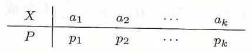

我们的任务是对如下假设检验问题 (I) 作显著性检验:

(I) ${H}_{0} : {p}_{i} = {p}_{i}^{0}\left( {i = 1,2,\cdots, k}\right),{H}_{1} : {p}_{i} = {p}_{i}^{0}$ 不全成立 $\left( {i = 1,2,\cdots, k}\right)$,

其中 ${p}_{i}^{0}\left( {i = 1,2,\cdots, k}\right)$ 已知.

直观上,若从样本 $\left( {{X}_{1},{X}_{2},\cdots,{X}_{n}}\right)$ 出发,我们统计出其中 ${a}_{i}$ 出现了 ${\nu }_{i}$ 次, $i = 1,2,\cdots, k$. 如果原假设 ${H}_{0}$ 成立,那么根据 “事件发生的频率稳定于概率” 的事实,应有 ${\nu }_{i}/n$ 接近于 ${p}_{i}^{0}\left( {i = 1,2,\cdots, k}\right)$,从而应有 $\mathop{\sum }\limits_{{i = 1}}^{k}{\left( \frac{{\nu }_{i}}{n} - {p}_{i}^{0}\right) }^{2}$ 应比较小. 也就是说,若 $\mathop{\sum }\limits_{{i = 1}}^{k}{\left( \frac{{\nu }_{i}}{n} - {p}_{i}^{0}\right) }^{2}$ 比较大,就应当拒绝原假设 ${H}_{0}$.

为了得到近似分布, 皮尔逊 (Pearson) 构造了统计量

$$
K = \mathop{\sum }\limits_{{i = 1}}^{k}{\left( \frac{{\nu }_{i}}{n} - {p}_{i}^{0}\right) }^{2} \cdot  \frac{n}{{p}_{i}^{0}} = \mathop{\sum }\limits_{{i = 1}}^{k}\frac{{\left( {\nu }_{i} - n{p}_{i}^{0}\right) }^{2}}{n{p}_{i}^{0}},
$$

并证明了,当 $n$ 充分大时,近似地有

$$
K = \mathop{\sum }\limits_{{i = 1}}^{k}\frac{{\left( {\nu }_{i} - n{p}_{i}^{0}\right) }^{2}}{n{p}_{i}^{0}} \sim  {\chi }^{2}\left( {k - 1}\right). \tag{8.4.1}
$$

由于 $n$ 和 ${p}_{i}^{0}\left( {i = 1,2,\cdots, k}\right)$ 都为常数,根据以上分析,当 $K$ 较大时应拒绝原假设 ${H}_{0}$. 所以,假设检验问题 (I) 的显著性水平为 $\alpha$ 的拒绝域为

$$
K = \mathop{\sum }\limits_{{i = 1}}^{k}\frac{{\left( {\nu }_{i} - n{p}_{i}^{0}\right) }^{2}}{n{p}_{i}^{0}} \geq  {\chi }_{1 - \alpha }^{2}\left( {k - 1}\right). \tag{8.4.2}
$$

例 8.4.1 7 台机床在相同的条件下, 独立地完成相同的工序. 在一段时间内统计 7 台机床出现故障数的资料如下:

<table><tr><td>机床代号</td><td>1</td><td>2</td><td>3</td><td>4</td><td>5</td><td>6</td><td>7</td></tr><tr><td>故障次数</td><td>2</td><td>10</td><td>11</td><td>8</td><td>13</td><td>19</td><td>7</td></tr></table>

试问故障发生的次数是否与机床质量有关 (显著性水平 $\alpha  = {0.05}$ )?

解 若故障发生的次数与机床质量无关, 则各台机床出现故障的可能性相同,共有 7 台机床,所以各台出现故障的概率为 $1/7$. 问题可归结为对假设检验问题:

$$
{H}_{0} : {p}_{i} = \frac{1}{7}\left( {i = 1,2,\cdots,7}\right),\;{H}_{1} : {p}_{i} = \frac{1}{7}\text{ 不全成立 }\left( {i = 1,2,\cdots,7}\right)
$$

作显著性检验.

按 (8.4.1) 计算得到 $K = {16.8}$,查 ${\chi }^{2}$ 分布表得 ${\chi }_{1 - {0.05}}^{2}\left( {7 - 1}\right)  = {12.6}$. 由于 $K = {16.8} > {12.6} = {\chi }_{1 - {0.05}}^{2}\left( {7 - 1}\right)$,所以应拒绝 ${H}_{0}$,即不能认为故障发生的次数与机床质量无关.

另外,请读者执行如下 $\mathrm{R}$ 程序,看有什么结果.

---

v<-c(2,10,11,8,13,19,7)

chisq.test(v)

---

#### 8.4.2 一般分布的 ${\chi }^{2}$ 拟合检验

对于一般总体 $X$ 的非参数检验,我们的任务是对如下的假设检验问题 (II) 作显著性检验:

(II) ${H}_{0} : X \sim  {F}_{0}\left( {\cdot;{\theta }_{1},{\theta }_{2},\cdots,{\theta }_{r}}\right),\;{H}_{1} : X \sim  {F}_{0}\left( {\cdot;{\theta }_{1},{\theta }_{2},\cdots,{\theta }_{r}}\right)$,

其中 ${F}_{0}$ 为已知分布, ${\theta }_{1},{\theta }_{2},\cdots,{\theta }_{r}$ 为其参数 (一般情况下未知).

我们先作直观分析. 若样本 $\left( {{X}_{1},{X}_{2},\cdots,{X}_{n}}\right)$ 一次的观测值为 $\left( {{x}_{1},{x}_{2},\cdots,{x}_{n}}\right)$. 根据该观测值取值的情况,我们人为地将实轴 $\left( {-\infty, + \infty }\right)$ 分成 $k$ 个区间:

$$
\left( {-\infty,{a}_{1}}\right\rbrack ,\left( {{a}_{1},{a}_{2}}\right\rbrack ,\left( {{a}_{2},{a}_{3}}\right\rbrack ,\cdots \left( {{a}_{k - 2},{a}_{k - 1}}\right\rbrack ,\left( {{a}_{k - 1}, + \infty }\right).
$$

且统计出 $\left( {{x}_{1},{x}_{2},\cdots,{x}_{n}}\right)$ 取值落在第 $i$ 个区间的个数为 ${\nu }_{i}\left( {i = 1,2,\cdots, k}\right)$.

若 ${F}_{0}\left( {\cdot;{\theta }_{1},{\theta }_{2},\cdots,{\theta }_{r}}\right)$ 的参数已知,我们可以计算概率:

$$
{p}_{1}^{0} = {F}_{0}\left( {{a}_{1};{\theta }_{1},{\theta }_{2},\cdots,{\theta }_{r}}\right),
$$

$$
{p}_{2}^{0} = {F}_{0}\left( {{a}_{2};{\theta }_{2},{\theta }_{2},\cdots,{\theta }_{r}}\right)  - {F}_{0}\left( {{a}_{1};{\theta }_{1},{\theta }_{2},\cdots,{\theta }_{r}}\right),
$$

$$
{p}_{3}^{0} = {F}_{0}\left( {{a}_{3};{\theta }_{2},{\theta }_{2},\cdots,{\theta }_{r}}\right)  - {F}_{0}\left( {{a}_{2};{\theta }_{1},{\theta }_{2},\cdots,{\theta }_{r}}\right),
$$

......

$$
{p}_{k - 1}^{0} = {F}_{0}\left( {{a}_{k - 1};{\theta }_{2},{\theta }_{2},\cdots,{\theta }_{r}}\right)  - {F}_{0}\left( {{a}_{k - 2};{\theta }_{1},{\theta }_{2},\cdots,{\theta }_{r}}\right),
$$

$$
{p}_{k}^{0} = 1 - {F}_{0}\left( {{a}_{k - 1};{\theta }_{2},{\theta }_{2},\cdots,{\theta }_{r}}\right).
$$

那么,根据 “事件的频率接近于概率” 的事实,当 $\mathop{\sum }\limits_{{i = 1}}^{k}{\left( \frac{{\nu }_{i}}{n} - {p}_{i}^{0}\right) }^{2}$ 较大时,应拒绝原假设 ${H}_{0}$.

然而,一般情况下,参数 $\left( {{\theta }_{1},{\theta }_{2},\cdots,{\theta }_{r}}\right)$ 是未知的. 此时,若求出参数的最大

似然估计 $\left( {{\widehat{\theta }}_{1},{\widehat{\theta }}_{2},\cdots,{\widehat{\theta }}_{r}}\right)$,并由此估计概率:

$$
{\widehat{p}}_{1}^{0} = {F}_{0}\left( {{a}_{1};{\widehat{\theta }}_{1},{\widehat{\theta }}_{2},\cdots,{\widehat{\theta }}_{r}}\right),
$$

$$
{\widehat{p}}_{2}^{0} = {F}_{0}\left( {{a}_{2};{\widehat{\theta }}_{2},{\widehat{\theta }}_{2},\cdots,{\widehat{\theta }}_{r}}\right)  - {F}_{0}\left( {{a}_{1};{\widehat{\theta }}_{1},{\widehat{\theta }}_{2},\cdots,{\widehat{\theta }}_{r}}\right),
$$

$$
{\widehat{p}}_{3}^{0} = {F}_{0}\left( {{a}_{3};{\widehat{\theta }}_{2},{\widehat{\theta }}_{2},\cdots,{\widehat{\theta }}_{r}}\right)  - {F}_{0}\left( {{a}_{2};{\widehat{\theta }}_{1},{\widehat{\theta }}_{2},\cdots,{\widehat{\theta }}_{r}}\right),
$$

......

$$
{\widehat{p}}_{k - 1}^{0} = {F}_{0}\left( {{a}_{k - 1};{\widehat{\theta }}_{2},{\widehat{\theta }}_{2},\cdots,{\widehat{\theta }}_{r}}\right)  - {F}_{0}\left( {{a}_{k - 2};{\widehat{\theta }}_{1},{\widehat{\theta }}_{2},\cdots,{\widehat{\theta }}_{r}}\right),
$$

$$
{\widehat{p}}_{k}^{0} = 1 - {F}_{0}\left( {{a}_{k - 1};{\widehat{\theta }}_{2},{\widehat{\theta }}_{2},\cdots,{\widehat{\theta }}_{r}}\right).
$$

那么可以证明 (皮尔逊 - 费希尔 (Pearson-Fisher) 定理) 近似地有

$$
\widehat{K} = \mathop{\sum }\limits_{{i = 1}}^{k}\frac{{\left( {\nu }_{i} - n{\widehat{p}}_{i}^{0}\right) }^{2}}{n{\widehat{p}}_{i}^{0}} \sim  {\chi }^{2}\left( {k - r - 1}\right). \tag{8.4.3}
$$

从而假设检验问题 (II) 的显著性水平为 $\alpha$ 的拒绝域为

$$
\widehat{K} = \mathop{\sum }\limits_{{i = 1}}^{k}\frac{{\left( {\nu }_{i} - n{\widehat{p}}_{i}^{0}\right) }^{2}}{n{\widehat{p}}_{i}^{0}} \geq  {\chi }_{1 - \alpha }^{2}\left( {k - r - 1}\right). \tag{8.4.4}
$$

例 8.4.2 从维尼纶正常生产线上测得 100 个维尼纶纤度 (表示维尼纶粗细程度的一个量) 数据: 试问可否认为该生产线维尼纶纤度为正态分布. (显著性水平 $\alpha  = {0.10}$ )?

<table><tr><td/><td/><td/><td/><td/><td/><td/><td/><td/><td/></tr><tr><td>1.36</td><td>1.49</td><td>1.43</td><td>1.41</td><td>1.37</td><td>1.40</td><td>1.32</td><td>1.42</td><td>1.47</td><td>1.39</td></tr><tr><td>1.41</td><td>1.36</td><td>1.40</td><td>1.34</td><td>1.42</td><td>1.42</td><td>1.45</td><td>1.35</td><td>1.42</td><td>1.39</td></tr><tr><td>1.44</td><td>1.42</td><td>1.39</td><td>1.42</td><td>1.42</td><td>1.30</td><td>1.34</td><td>1.42</td><td>1.37</td><td>1.36</td></tr><tr><td>1.37</td><td>1.34</td><td>1.37</td><td>1.37</td><td>1.44</td><td>1.45</td><td>1.32</td><td>1.48</td><td>1.40</td><td>1.45</td></tr><tr><td>1.39</td><td>1.46</td><td>1.39</td><td>1.53</td><td>1.36</td><td>1.48</td><td>1.40</td><td>1.39</td><td>1.38</td><td>1.40</td></tr><tr><td>1.36</td><td>1.45</td><td>1.50</td><td>1.43</td><td>1.38</td><td>1.43</td><td>1.41</td><td>1.48</td><td>1.39</td><td>1.46</td></tr><tr><td>1.37</td><td>1.37</td><td>1.39</td><td>1.45</td><td>1.31</td><td>1.41</td><td>1.44</td><td>1.44</td><td>1.42</td><td>1.47</td></tr><tr><td>1.35</td><td>1.36</td><td>1.39</td><td>1.40</td><td>1.38</td><td>1.35</td><td>1.42</td><td>1.43</td><td>1.42</td><td>1.42</td></tr><tr><td>1.42</td><td>1.40</td><td>1.41</td><td>1.37</td><td>1.46</td><td>1.36</td><td>1.37</td><td>1.27</td><td>1.37</td><td>1.38</td></tr><tr><td>1.42</td><td>1.34</td><td>1.43</td><td>1.42</td><td>1.41</td><td>1.41</td><td>1.44</td><td>1.48</td><td>1.55</td><td>1.37</td></tr></table>

解 记维尼纶纤度为 $X$,则问题可归结为检验下面假设.

$$
{H}_{0} : X \sim  N\left( {\mu,{\sigma }^{2}}\right),\;{H}_{1} : X \sim  N\left( {\mu,{\sigma }^{2}}\right).
$$

若 ${H}_{0}$ 成立,则 $\mu$ 和 ${\sigma }^{2}$ 的最大似然估计分别为样本均值 $\bar{X}$ 和样本方差 ${S}^{2}$ 田效据计算得估计值分别为 $\widehat{\mu } = {1.4043}$ 和 $\widehat{{\sigma }^{2}} = {0.002269}\left( {\widehat{\sigma } = {0.0476}}\right)$

田具体 100 个数据取值的范围和分布特点, 将数据以组距为 0.03 分为 6 个区间, 并用估计参数查正态分布表得到概率值

$$
{\widehat{p}}_{i} = P\left( {{a}_{i - 1} < X \leq  {a}_{i}}\right)  = \Phi \left( \frac{{a}_{i} - \widehat{\mu }}{\widehat{\sigma }}\right)  - \Phi \left( \frac{{a}_{i - 1} - \widehat{\mu }}{\widehat{\sigma }}\right),
$$

并统计数据落在各区间的频数得到: $2 - 1) = {6.2514}$.

<table><tr><td>区间 $\left( {{a}_{i - 1},{a}_{i}}\right\rbrack$</td><td>频数 $\left( {\nu }_{i}\right)$</td><td>估计概率 ${\widehat{p}}_{i}$</td></tr><tr><td>$( - \infty,{1.355}\rbrack$</td><td>12</td><td>0.1446</td></tr><tr><td>$({1.355},{1.385}\rbrack$</td><td>22</td><td>0.1854</td></tr><tr><td>$({1.385},{1.415}\rbrack$</td><td>23</td><td>0.2453</td></tr><tr><td>$({1.415},{1.445}\rbrack$</td><td>25</td><td>0.2157</td></tr><tr><td>$({1.445},{1.475}\rbrack$</td><td>10</td><td>0.1326</td></tr><tr><td>$\left( {{1.475}, + \infty }\right)$</td><td>8</td><td>0.0764</td></tr></table>

因为 $\widehat{K} = {2.4713} < {6.2514} = {\chi }_{0.90}^{2}\left( 3\right)$,所以在显著性水平 0.10 下接受 ${H}_{0}$ 即可以认为维尼纶纤度服从正态分布 $N\left( {{1.4043},{0.0476}^{2}}\right)$.

另外,请读者执行如下 $\mathrm{R}$ 程序,看有什么结果.

---

---

															$\mathrm{x} <  - \mathrm{c}({1.36},{1.49},{1.43},{1.41},{1.37},{1.40},{1.32},{1.42},{1.47},{1.39},{1.41},{1.36}$.

															1.40,1.34,1.42,1.42,1.45,1.35,

														1.42,1.39,1.44,1.42,1.39,1.42,1.42,1.30,1.34,1.42,1.37,1.36,1.37.

														1.34,1.37,1.37,1.44,1.45,1.32,

										1.48,1.40,1.45,1.39,1.46,1.39,1.53,1.36,1.48,1.40,1.39,1.38,1.40.

												1.36,1.45,1.50,1.43,1.38,1.43,

								1.41,1.48,1.39,1.46,1.37,1.37,1.39,1.45,1.31,1.41,1.44,1.44,1.42.

								1.47,1.35,1.36,1.39,1.40,1.38,

							1.35,1.42,1.43,1.42,1.42,1.42,1.40,1.41,1.37,1.46,1.36,1.37,1.27.

						${1.37},{1.38},{1.42},{1.34},{1.43},{1.42},{1.41},{1.41},{1.44},{1.48},{1.55},{1.37})$

				$r <  - 2$

			alpha $<  - {0.1}$

		$m <  - {length}\left( x\right)$

	mu.hat<-mean(x); sig.hat<-sd(x)*sqrt((m-1)/m)

a<-c(-Inf,1.355,1.385,1.415,1.445,1.475,+Inf)

---

---

---

v<-rep(0, length(a)-1)

p<-numeric(length(a)-1)

for(i in 1:6)

		$\left\{  \begin{array}{l} p\left\lbrack  i\right\rbrack   = \text{ pnorm ((a[i+1] -mu.hat)/sig.hat) -pnorm ((a[i] -mu.hat)/sig.hat) } \\   \end{array}\right.$

				$v\left\lbrack  i\right\rbrack   <  - \operatorname{sum}\left( {a\left\lbrack  i\right\rbrack   < x\;\& \;x <  = a\left\lbrack  {i + 1}\right\rbrack  }\right)$

		\}

	$\mathrm{n} <  - \operatorname{sum}\left( \mathrm{v}\right)$

	$K <  - \operatorname{sum}\left( {\left( {v - n * p}\right)  \cap  2/\left( {n * p}\right) }\right)$

	list(K=K, X2.value=qchisq(1-alpha, length(v)-r-1))

---

## 第八章小结与注记

(1) 与参数的区间估计不同, 解决假设检验问题, 首先要针对具体问题提出原假设和备选假设.

(2) 假设检验可以说是概率意义下的反证法. 它基于人们普遍的认知: “小概率事件在一次试验中近乎不发生”. 通过查看构造好的一个 “小概率事件” 是否发生来对假设做出拒绝还是接受的结论. 也正是因为是概率意义下的反证法, 才使得假设检验的结论必然会犯错 (除非样本取完总体的每个个体), 这就是我们所说的两类错误. 在实际应用中, 必须同时控制两类错误, 否则推断的结论是无用的. 比如, 通过抽检判断一批产品是否合格, 若犯了第一类错误, 则使生产万受损: 若犯了第二类错误, 则使使用方受损. 实际应用中, 产品合格检验的国家标准或国际标准, 都是依据在控制第一类错误的前提下, 尽量控制第二类错误的原则, 针对不同的检验问题计算出来的.

限于深度和篇幅的限制, 我们只介绍显著性检验, 并且不涉及检验方法优劣的评价. 需要强调指出的是, 为要显著性检验的结论较为可信或实际中可用, 原假设和备选假设的选取是十分重要的.

(3)与参数的区间估计雷同,对于一般分布的总体,难以得到有关统计量的分布,从而无法找到 “小概率事件”,也就难以作推断. 所以,我们只能介绍正态总体参数的假设检验. 由于假设检验拒绝域的构造与区间估计的构造之间的紧密联系, 假设检验中用到的分布也完全基于第六章的抽样分布基本定理及其推论, 所以正文中我们略去了有关拒绝域的推导, 而留给读者做练习.

(4)分布的拟合检验的思想很简单: “频率的稳定值为概率”, 也就是原假设成立时, 先算出有关概率, 再看对应的频率是否与概率相差不大, 若不是, 则拒绝原假设. 好在皮尔逊已经为我们证明了有关统计量的近似分布 (参见 (8.4.1) 和 (8.4.3)), 我们轻松地得到了拒绝域 (参见 (8.4.2) 和 (8.4.4)).

## 第八章习题

8.1. 设 ${X}_{1},\cdots,{X}_{16}$ 是来自正态总体 $N\left( {\mu,{16}}\right)$ 的样本,考虑检验问题 ${H}_{0} : \mu  = 6.{H}_{1}$ : $\mu  = {6.5}$. 若检验的拒绝域取为 $\left\{  {\bar{x} \geq  6 + {u}_{0.95}}\right\}$,试求该检验犯第一类错误与犯第二类错误的

8.2. 设总体 $X$ 服从泊松分布,即

$$
P\left( {X = k}\right)  = \frac{{\lambda }^{k}}{k!}{\mathrm{e}}^{-\lambda },\;k = 0,1,2,\cdots,
$$

其中 $\lambda$ 是未知的正数, ${X}_{1},{X}_{2},\cdots,{X}_{10}$ 为来自 $X$ 的简单随机样本. 对检验问题 ${H}_{0} : \lambda  =$ ${0.2},{H}_{1} : \lambda  = {0.1}$,试求拒绝域为 $\left\{  {\left( {{x}_{1},{x}_{2},\cdots,{x}_{10}}\right)  : \mathop{\sum }\limits_{{i = 1}}^{{10}}{x}_{i} = 0}\right\}$ 的检验犯两类错误的概率.

8.3. 设 ${X}_{1}$ 与 ${X}_{2}$ 相互独立,分别服从 $N\left( {{\theta }_{1},{\sigma }_{0}^{2}}\right)$ 和 $N\left( {{\theta }_{2},{\sigma }_{0}^{2}}\right)$,其中 ${\sigma }_{0}^{2}$ 已知,对假设检验问题 ${H}_{0} : {\theta }_{1} = {\theta }_{2} = 0,{H}_{1} : {\theta }_{1}^{2} + {\theta }_{2}^{2} > 0$. 当且仅当 ${x}_{1}^{2} + {x}_{2}^{2} \geq  c$ 时拒绝原假设 ${H}_{0}$. 试问 $c$ 为何值时,该检验犯第一类错误的概率为 $\alpha$.

8.4. 根据以往记录,某区域早稻平均亩产为 ${350}\mathrm{\;{kg}}$,今年选用新早稻品种耕种,收割时, 随机抽取了 10 块,测出每块的实际亩产量为 ${x}_{1},{x}_{2},\cdots,{x}_{10}$,计算得 $\bar{x} = \frac{1}{10}\mathop{\sum }\limits^{{10}}{x}_{i} = {480}$, 如未知道早稻田产量服从正态分布 $N\left( {\mu,{144}}\right)$,试在显著水平 $\alpha  = {0.05}$ 下,检验假设 ${H}_{0}$ : $\mu  \leq  {350},{H}_{1} : \mu  > {350}$.

8.5. 设随机地从一批钉子中抽取 10 枚, 测得它们的长度 (单位: cm) 为

$$
{2.14},{2.10},{2.13},{2.15},{2.12},{2.16},{2.13},{2.11},{2.15},{2.11}
$$

设钉子的长度 $X \sim  N\left( {\mu,{\sigma }^{2}}\right)$,是否可以认为钉子的平均长度 $\mu  = {2.15}\left( {\alpha  = {0.05}}\right)$ ?

8.6. 从切割机切割所得的金属棒中, 随机抽取 13 根, 测得长度 (单位: cm) 为

$$
{10.6},{10.1},{10.4},{10.5},{10.3},{10.2},{10.9},{10.6},{10.8},{10.5},{10.7},{10.2},{10.7}
$$

设金属棒长度 $X \sim  N\left( {\mu,{\sigma }^{2}}\right)$. 是否可以认为金属棒长度的标准差 $\sigma  = {0.15}$ (显著水平 $\alpha  = {0.05})$ ?

8.7. 某种导线的电阻 (单位: $\Omega$ ) 服从正态分布,按照规定,电阻的标准差不得超过 0.005 现从一家新厂生产的一批导线中任取 9 根,测得修正样本标准差 ${s}_{9}^{ * } = {0.007}$,问这批导线的电阻的标准差,比起规定的电阻的标准差来,是否显著的偏大 (显著水平 $\alpha  = {0.05}$ )?

8.8. 某电子元件的寿命 (单位: 小时) $X \sim  N\left( {\mu,{\sigma }^{2}}\right)$,其中 $\mu,{\sigma }^{2}$ 未知,现测得 16 只元件,计算样本均值 $\bar{x} = {241.5000}$,修正样本标准差 ${s}_{16}^{ * } = {98.7259}$. 试在显著水平 $\alpha  = {0.05}$ 下, 检验下列假设.

(1)元件的平均寿命是否大于 225 小时?

(2) 元件寿命的标准差 $\sigma$ 是否等于 100 ?

8.9. 甲、乙两公司都生产 ${700}\mathrm{{MB}}$ 的光盘,从甲生产的产品中抽查了 7 张光盘. 从乙生产的产品中抽查了 9 张光盘, 分别测得它们的存储量如下: 现已知甲的光盘储量 $X \sim  N\left( {{\mu }_{1},5}\right), Y \sim  N\left( {{\mu }_{2},{12}}\right)$. 在显著水平 $\alpha  = {0.05}$ 下,比较甲、乙两家公司生产的光盘的平均储量有无显著差异?

<table><tr><td>甲(X)</td><td>683</td><td>682</td><td>683</td><td>678</td><td>681</td><td>680</td><td>677</td><td/><td/></tr><tr><td>乙(Y)</td><td>681</td><td>682</td><td>671</td><td>677</td><td>680</td><td>677</td><td>679</td><td>681</td><td>683</td></tr></table>

8.10. 为了研究正常成年男、女血液红细胞数 (单位: 万 $/{\mathrm{{mm}}}^{3}$ ) 的差异,随机地抽取正常成年男、女各 26 名、14 名,计算得样本均值分别为 $\bar{x} = {465.13},\bar{y} = {422.16}$,修正样本标准差分别为 ${s}_{1}^{ * } = {54.80},{s}_{2}^{ * } = {49.2}$. 假定正常男、女的红细胞数服从正态分布且方差相等,试位验该地正常成年人的细胞平均数是否与性别有关 $\left( {\alpha  = {0.05}}\right)$ ?

8.11. 人们发现在早期酿造啤酒时, 在麦芽干燥过程中形成致癌物质亚硝酸基二甲氨. 到后期开发了一种新的麦芽干燥过程, 下面给出分别在新老两种过程中形成亚硝酸基二甲氨含量 (以 10 亿份中的份数计):

老过程:6,4,5,5,6,5,5,6,4,6,7,4

新讨程:2,1,2,2,1,0,3,2,1,0

假定两样本分别来自正态总体, 且两总体的方差相等, 但参数均未知, 两样本独立, 分别以 ${\mu }_{1},{\mu }_{2}$ 记对应于老、新过程的总体均值,试在显著水平 $\alpha  = {0.05}$ 检验假设: ${H}_{0} : {\mu }_{1} - {\mu }_{2} \leq$ 2. ${H}_{1} : {\mu }_{1} - {\mu }_{2} > 2$.

8.12. 比较甲乙两种棉花品种的优劣, 假设用它们纺出的棉纱强度分别服从正态分布 $N\left( {{\mu }_{1},{\sigma }_{1}^{2}}\right), N\left( {{\mu }_{2},{\sigma }_{2}^{2}}\right)$,试验者分别从这两种棉纱中抽取样本容量 ${n}_{1} = {100},{n}_{2} = {50}$ 的样本, 测得样本均值分别为 $\bar{x} = {5.6},\bar{y} = {5.2}$,修正样本方差分别为 ${s}_{1}^{*2} = 4,{s}_{2}^{*2} = {2.56}$. 设两样本相互独立. 试分别在下列条件下 (水平 $\alpha  = {0.05}$ ),检验假设: ${H}_{0} : {\mu }_{1} \leq  {\mu }_{2},{H}_{1} : {\mu }_{1} > {\mu }_{2}$. (1) ${\sigma }_{1}^{2} = {2.2}^{2},{\sigma }_{2}^{2} = {1.8}^{2}$,(2) ${\sigma }_{1}^{2} = {\sigma }_{2}^{2}$ 未知.

8.13. 应用某药物治疗 9 位高血压病人,治疗前后的舒张压 (单位:p / kPa) 见下表: 设治疗前后的舒张压之差服从正态分布,试在显著水平 $\alpha  = {0.05}$ 下,检验该药物对降低舒张压是否有显著疗效?

<table><tr><td>病人编号</td><td>1</td><td>2</td><td>3</td><td>4</td><td>5</td><td>6</td><td>7</td><td>8</td><td>9</td></tr><tr><td>治疗前</td><td>12.8</td><td>13.3</td><td>13.3</td><td>14.1</td><td>13.6</td><td>14.4</td><td>13.3</td><td>13.1</td><td>13.3</td></tr><tr><td>治疗后</td><td>11.7</td><td>12.3</td><td>13.1</td><td>13.6</td><td>13.1</td><td>13.6</td><td>12.8</td><td>13.1</td><td>12.5</td></tr><tr><td/><td/><td/><td/><td/><td/><td/><td/><td/><td/></tr></table>

8.14. 某种物品在处理前与处理后分别抽样分析其含脂率如下:

处理前:0.19,0.18,0.21,0.30,0.41,0.12,0.27

处理后:0.15,0.13,0.07,0.24,0.19,0.06,0.08,0.12

设处理前后的含脂率都服从正态分布,试在显著水平 $\alpha  = {0.05}$ 下,检验处理前后含脂率的方差是否有显著差异?

8.15. 甲、乙两台车床生产的某种零件的直径 (单位: $\mathrm{{mm}}$ ) 都服从正态分布,为了比较两台车床的加工精度有无差别, 现从甲、乙两台车床生产的零件中分别抽取 8 个和 9 个, 测得直径如下:

---

	<table><tr><td>甲车床生产的零件</td><td>15.0,14.5,15.2,15.5,14.9,15.1,15.1,14.8</td></tr><tr><td>乙车床生产的零件</td><td>15.2,15.0,14.8,15.2,15.0,15.1,14.8,15.1,14.8</td></tr></table>

---

是否可以认为乙车床产品的方差不大于甲车床产品的方差 (显著水平 $\alpha  = {0.05}$ )?

8.16. 为了比较水稻品种甲与乙的产量, 随机抽选取 18 块环境相近的试验田, 在其中的 8 块试验田种植甲品种, 在其中的 10 块试验田种植乙品种, 测得亩产量如下 (单位: kg):

甲类:910,1028,983,1015,954,1012,930,925,

乙类:833,935,898,870,960,967,898,880,903,826

假设两种水稻产量均服从正态分布,试在显著水平 $\alpha  = {0.05}$ 下,检验两个品种的产量是否服从相同的分布.

8.17. 某工厂 (工作日为周一至周五) 近五年发生了 63 次事故, 按星期几记录如下表:

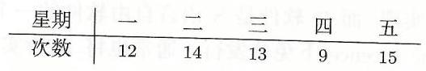

问在显著水平 $\alpha  = {0.05}$ 下可否认为事故的发生次数与星期几有关?

8.18. 从总体 $X$ 中抽取容量为 100 的样本,频数分布如下表:

<table><tr><td>区间</td><td>$\lbrack 0,{0.2})$</td><td>$\lbrack {0.2},{0.4})$</td><td>$\lbrack {0.4},{0.6})$</td><td>$\lbrack {0.6},{0.8})$</td><td>$\left\lbrack  {{0.8},1}\right\rbrack$</td></tr><tr><td>频数</td><td>3</td><td>12</td><td>19</td><td>28</td><td>38</td></tr></table>

设能否被接受. 试在显著水平 $\alpha  = {0.05}$ 下,检验该总体的分布密度函数为 ${p}_{0}\left( x\right)  = \left\{  \begin{matrix} {2x}, & 0 \leq  x \leq  1, \\  0, & \text{ 其他 } \end{matrix}\right.$ 的假