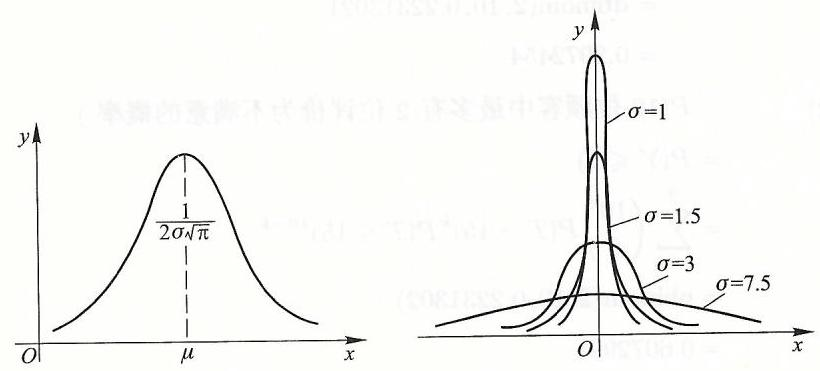
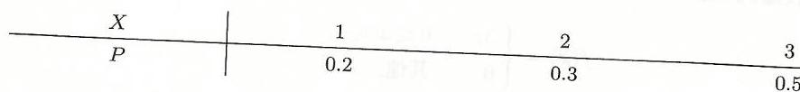
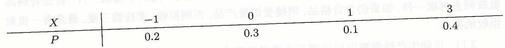

# 第二章 一维随机变量及其分布

我们知道,概率测度 $P$ 是定义在事件域 $\mathcal{F}$ 到实数集 $\mathbf{R}$ 的映射,它不是经典的函数, 为有效地应用分析数学工具来分析和研究随机现象, 人们自然地想到把基本事件 $\omega$ 变换成数 (这就是我们要介绍的随机变量),进而把所关心事件的概率用随机变量的分布函数值来表达.

## 2.1 随机变量的概念及其分布函数

#### 2.1.1 随机变量的概念

大量的随机试验, 其结果就是某一个量的取值或与某一数量相联系. 比如掷一颗骰子,观察出现的点数,在事件 ${\omega }_{i} = \{$ 出现的点数为 $i\} \left( {i = 1,2,\cdots,6}\right)$. 自然地与 “点数” 这个量相联系. 再比如, 观测一批电视机的使用寿命, 其结果就是 “寿命” 这一数量的某个取值. 但试验结束之前, 无法预知该数量取何值, 所以自然地将该数量称为 “随机变量”.

另外, 对于那些试验结果不明显地与数量有联系的随机试验, 可以人为地规定一个结果对应于某一量的取值, 从而将一个事件与该量的某取值相对应, 该事件的概率就是该量取某值的概率. 例如, 检测一批产品中的一件产品是合格品还是不合格品. 此试验的结果有两个,它们是 $A = \{$ 受检产品为不合格品 $\}$ 和 $\bar{A} = \{$ 受检产品为合格品 $\}$. 如果我们规定一个量 $X$ 与试验结果相对应,当 $A$ 发生时, $X$ 取值 $1, A$ 发生时, $X$ 取值 0,则 $P\left( A\right)  = P\left( {X = 1}\right), P\left( \bar{A}\right)  = P\left( {X = 0}\right)$. 这里在检测结束之前,也不知道 $X$ 取何值,所以 $X$ 也是随机变量.

综上所述, 我们要引进的 “随机变量” 就是随机取值的量, 即随机变量的取值由随机试验的结果 (事件) 来确定. 我们将其概括为如下的定义.

定义 2.1.1 设 $\left( {\Omega,\mathcal{F}, P}\right)$ 为概率空间,称映射 $X : \Omega  \rightarrow  \mathbf{R}$ 为随机变量 如果对任意 $x \in  \mathbf{R}$,有

$$
\{ \omega  \mid  X\left( \omega \right)  \leq  x\}  \in  \mathcal{F}. \tag{2.1.1}
$$

随机变量的直观意义是在做试验之前无法预知 $X$ 取何值. 至于定义中要求满足 (2.1.1), 正是后文定义随机变量的分布函数的需要, 进而我们所关心的事件的概率可用分布函数的值来表达.

对于随机事件 $A \in  \mathcal{F}$,若定义

$$
X\left( \omega \right)  = \left\{  \begin{array}{ll} 1, & \text{ 如果 }\omega  \in  A, \\  0, & \text{ 如果 }\omega  \in  \Omega  \smallsetminus  A. \end{array}\right.
$$

则 $X$ 为随机变量,且 $P\left( A\right)  = P\left( {X = 1}\right)$.

例 2.1.1 (例 1.2.5 续) 沿用例 1.2.5 的记号,定义映射 $X : {\Omega }_{1} \rightarrow  \mathbf{R}$ 为 $X\left( {\omega }_{i}\right)  = i, i = 1,2,\cdots,6$. 则 $\{ \omega  \in  \Omega  : X\left( \omega \right)  \leq  2\}  = \left\{  {{\omega }_{1},{\omega }_{2}}\right\}   \notin  {\mathcal{F}}_{3}$,从而 $X$ 不是 $\left( {{\Omega }_{1},{\mathcal{F}}_{3}, P}\right)$ 上的随机变量.

#### 2.1.2 随机变量的分布函数

引入了随机变量之后, 我们仍然关心的是如何分析计算有关事件的概率, 这个问题可以通过引入随机变量的分布函数来解决.

定义 2.1.2 设 $\left( {\Omega,\mathcal{F}, P}\right)$ 为概率空间, $X$ 为随机变量, $X$ 的分布函数 ${F}_{X}$ 定义为

$$
{F}_{X}\left( x\right)  = P\left( {\{ \omega  \in  \Omega  : X\left( \omega \right)  \leq  x\} }\right),\;\forall x \in  \mathbf{R}. \tag{2.1.2}
$$

以后将 $\{ \omega  \in  \Omega  : X\left( \omega \right)  \leq  x\}$ 简写为 $\left( {X \leq  x}\right)$.

由此定义, 显然有,

$$
P\left( {a < X \leq  b}\right)  = {F}_{X}\left( b\right)  - {F}_{X}\left( a\right),\;\forall a < b \in  \mathbf{R}. \tag{2.1.3}
$$

再利用概率测度上下连续性, 容易证明下列事实:

$$
P\left( {X = a}\right)  = {F}_{X}\left( a\right)  - {F}_{X}\left( {a - 0}\right),\;\forall a \in  \mathbf{R},
$$

$$
P\left( {a \leq  X \leq  b}\right)  = {F}_{X}\left( b\right)  - {F}_{X}\left( {a - 0}\right),\;\forall a < b \in  \mathbf{R},
$$

$$
P\left( {a \leq  X < b}\right)  = {F}_{X}\left( {b - 0}\right)  - {F}_{X}\left( {a - 0}\right),\;\forall a < b \in  \mathbf{R},
$$

$$
P\left( {a < X < b}\right)  = {F}_{X}\left( {b - 0}\right)  - {F}_{X}\left( a\right),\;\forall a < b \in  \mathbf{R}.
$$

这些事实说明, 引入随机变量的分布函数之后, 我们所关心的有关事件的概率都可以用其分布函数来表达, 也就是通常所说的, 随机变量的所有统计特性都可用其分布函数来刻画.

另外, 利用概率测度上下连续性可以证明分布函数的下述性质.

定理 2.1.1 设 $\left( {\Omega,\mathcal{F}, P}\right)$ 为概率空间, $X$ 为随机变量,其分布函数为 ${F}_{X}$, 则

(i) $0 \leq  {F}_{X}\left( x\right)  \leq  1,\forall x \in  \mathbf{R}$.

(ii) 对任 ${x}_{1} < {x}_{2}$,有 ${F}_{X}\left( {x}_{1}\right)  \leq  {F}_{X}\left( {x}_{2}\right)$,且 $\mathop{\lim }\limits_{{x \rightarrow  {x}_{1}}}{F}_{X}\left( x\right)  = {F}_{X}\left( {x}_{0}\right)$.

(iii) $\mathop{\lim }\limits_{{x \rightarrow   - \infty }}{F}_{X}\left( x\right)  = 0,\mathop{\lim }\limits_{{x \rightarrow  \infty }}{F}_{X}\left( x\right)  = 1$.

我们常称定理 2.1.1 中所述分布函数的这三条性质为随机变量分布函数的特征性质,也就是说,若有定义于 $\mathbf{R}$ 上的实函数 $F$ 满足性质 (i) - (iii). 则可以构造一个概率空间 $\left( {\Omega,\mathcal{F}, P}\right)$ 和其上的随机变量 $X$,使 ${F}_{X}\left( x\right)  = F\left( x\right),\forall x \in  \mathbf{R}$. 这个事实称为柯尔莫哥洛夫存在性定理.

现实生活中见到的随机变量有两类, 一类是随机变量取至多可数多个不同的值, 另一类是它取值于实数的全体或某个区间. 对于这两类随机变量, 其统计特性更容易刻画, 我们在后续两节分别加以介绍.

## 2.2 一维离散型随机变量

有些随机变量, 它只取有限多个或可列多个不同的值, 我们称这类随机变量为离散型随机变量.

一般地,设离散型随机变量 $X$ 的取值为 ${a}_{1},{a}_{2},\cdots,{a}_{n},\cdots$. 且已知

$$
P\left( {X = {a}_{i}}\right)  = {p}_{i},\;i = 1,2,\cdots.
$$

通常记为

$$
X \sim  \left( \begin{array}{lllll} {a}_{1} & {a}_{2} & \cdots & {a}_{n} & \cdots \\  {p}_{1} & {p}_{2} & \cdots & {p}_{n} & \cdots  \end{array}\right),
$$

并称上式右端为 $X$ 的分布列,称 $\left( {{p}_{1},{p}_{2},\cdots,{p}_{n},\cdots }\right)$ 为概率分布. 它显然满足以下两个性质:

(1) ${p}_{i} \geq  0, i = 1,2,\cdots$.

(2) $\mathop{\sum }\limits_{{i = 1}}^{\infty }{p}_{i} = 1$.

此时, $X$ 的分布函数为

$$
{F}_{X}\left( x\right)  = P\left( {X \leq  x}\right)  = \mathop{\sum }\limits_{{{a}_{i} \leq  x}}{p}_{i}. \tag{2.2.1}
$$

其图形为一右连续的阶梯函数,在点 ${a}_{i}$ 处提高 ${p}_{i}$.

另外,对任意 $a < b$,有

$$
P\left( {a < X \leq  b}\right)  = \mathop{\sum }\limits_{{a < {a}_{i} \leq  b}}{p}_{i}. \tag{2.2.2}
$$

下面我们介绍几类有重要实际应用背景的离散型分布.

#### 2.2.1 二项分布

如果一个随机变量 $X$ 取值为 $0,1,2,\cdots, n$,且

$$
P\left( {X = k}\right)  = \left( \begin{array}{l} n \\  k \end{array}\right) {p}^{k}{\left( 1 - p\right) }^{n - k},\;k = 0,1,2,\cdots, n, \tag{2.2.3}
$$

我们称 $X$ 服从二项分布. 记为 $X \sim  B\left( {n, p}\right)$ ( $\mathrm{R}$ 软件中的分布名为 binom),其中的 $n$ 和 $p\left( {0 \leq  p \leq  1}\right)$ 称为参数. 如果 $n = 1$,则 $X$ 只取 0 和 1 两个值,我们称 $X$ 服从两点分布. 当 $n = 1$ 时,如果 $p = 0$,则 $P\left( {X = 0}\right)  = 1$; 如果 $p = 1$,则 $P\left( {X = 1}\right)  = 1$. 这两种情况都退化为单点分布 (即 $X$ 取某个常数 $C$ 的概率为 1 ), 取值已没有随机性了.

另外,显然有 $P\left( {X = k}\right)  \geq  0$,且由二项式定理有

$$
\mathop{\sum }\limits_{{k = 0}}^{n}P\left( {X = k}\right)  = \mathop{\sum }\limits_{{k = 0}}^{n}\left( \begin{array}{l} n \\  k \end{array}\right) {p}^{k}{\left( 1 - p\right) }^{n - k} = {\left\lbrack  p + \left( 1 - p\right) \right\rbrack  }^{n} = 1.
$$

可见 (2.2.3) 给出的分布确实为概率分布. 正是因为 $\left( \begin{array}{l} n \\  k \end{array}\right) {p}^{k}{\left( 1 - p\right) }^{n - k}$ 是 $\lbrack {px} +$ $\left( {1 - p}\right) {\rbrack }^{n}$ 这个二项式展开中 ${x}^{k}$ 的系数,我们称(2.2.3)给出的分布为二项分布.

现实中有不少随机试验,其观测结果都服从二项分布. 回忆 $n$ 重伯努利试验, 如果每次试验 “成功” 的概率为 $p$,令 $X$ 为 $n$ 次试验中成功的次数,则由 (1.3.8) 知, $X \sim  B\left( {n, p}\right)$,且 $P\left( {X = k}\right)  = b\left( {k;n, p}\right)$. 另外,由例 1.3.8 知,若一批产品的不合格品率为 $p$,则从中无放回抽取的 $n$ 件中不合格品的件数,也服从 $B\left( {n, p}\right)$.

当 $X \sim  B\left( {n, p}\right)$ 时,对任意 $a < b$,有

$$
P\left( {a \leq  X \leq  b}\right)  = \mathop{\sum }\limits_{{a \leq  k \leq  b}}b\left( {k;n, p}\right)  = \mathop{\sum }\limits_{{a \leq  k \leq  b}}\left( \begin{array}{l} n \\  k \end{array}\right) {p}^{k}{\left( 1 - p\right) }^{n - k}
$$

和

$$
P\left( {X \leq  b}\right)  = \mathop{\sum }\limits_{{k \leq  b}}b\left( {k;n, p}\right)  = \mathop{\sum }\limits_{{k \leq  b}}\left( \begin{array}{l} n \\  k \end{array}\right) {p}^{k}{\left( 1 - p\right) }^{n - k}.
$$

利用 $\mathrm{R}$ 软件提供的内部函数 binom,容易计算相关事件的概率. 对 $X \sim$ $B\left( {n, p}\right)$,可调用内部函数 $\operatorname{pbinom}\left( {\mathrm{x},\mathrm{n},\mathrm{p}}\right)$ 来计算 $P\left( {X \leq  x}\right)$,用 $\operatorname{dbinom}\left( {\mathrm{k},\mathrm{n},\mathrm{p}}\right)$ 来计算 $P\left( {X = k}\right)$. 请读者注意这两个函数中 $\mathrm{p}$ 和 $\mathrm{d}$ 的区别.

例 2.2.1 设 $X \sim  B\left( {{10},{0.9}}\right)$,试求 $P\left( {X = 8}\right), P\left( {X \leq  8}\right), P\left( {3 \leq  X \leq  9}\right)$.

解 我们借助 $\mathrm{R}$ 软件来计算.

$$
P\left( {X = 8}\right)  = \left( \begin{matrix} {10} \\  8 \end{matrix}\right) {0.9}^{8} \cdot  {0.1}^{2} = \operatorname{dbinom}\left( {8,{10},{0.9}}\right)  = {0.1937102}.
$$

$$
P\left( {X \leq  8}\right)  = \mathop{\sum }\limits_{{k \leq  8}}\left( \begin{matrix} {10} \\  k \end{matrix}\right) {0.9}^{k}{\left( 1 - {0.9}\right) }^{{10} - k}
$$

$$
= \text{pbinom}\left( {8,{10},{0.9}}\right)  = {0.2639011}\text{.}
$$

而

$$
P\left( {3 \leq  X \leq  9}\right)  = \mathop{\sum }\limits_{{3 \leq  k \leq  9}}\left( \begin{matrix} {10} \\  k \end{matrix}\right) {0.9}^{k}{\left( 1 - {0.9}\right) }^{{10} - k}
$$

$$
= \operatorname{pbinom}\left( {9,{10},{0.9}}\right)  - \operatorname{pbinom}\left( {2,{10},{0.9}}\right)  = {0.6513124}\text{.}
$$

例 2.2.2 已知发射一枚地对空导弹可击中来犯敌机的概率为 0.96 问在同样的条件下需发射多少枚导弹才能保证至少有一枚导弹击中来犯敌机的概率人于 0.999?

解 设需发射 $n$ 枚导弹,由题意各枚导弹是否击中相互独立,所以击中的代数 $X \sim  B\left( {n,{0.96}}\right)$,从而

$$
P\left( {X \geq  1}\right)  = 1 - {\left( 1 - p\right) }^{n} = 1 - {0.04}^{n} > {0.999},
$$

由此得

$$
n > \frac{\lg {0.001}}{\lg {0.04}} = {2.15}
$$

即至少需发射 3 枚导弹.

定理 2.2.1 设 $X \sim  B\left( {n, p}\right)$,当 $\left( {n + 1}\right) p$ 为整数 $m$ 时, $X$ 取 $m$ 和 $m - 1$ 的概率最大,且 $b\left( {m;n, p}\right)  = b\left( {m - 1;n, p}\right)$; 当 $\left( {n + 1}\right) p$ 不为整数时, $X$ 取 $\left( {n + 1}\right) n$ 的整数部分的概率最大.

这个定理的证明,可经计算比值 $\frac{b\left( {k;n, p}\right) }{b\left( {k - 1;n, p}\right) }$ 随 $k$ 变化的情况得证,这里略去. 但请读者调用内部函数 $\operatorname{dbinom}\left( {\mathrm{k},\mathrm{n},\mathrm{p}}\right)$,通过给定参数 $n$ 和 $p$ 体验一下该事头.

例 2.2.3 (鱼塘中有多少条鱼?) 为了估计鱼塘中有多少条鱼,鱼塘主先从鱼塘中网起 100 条鱼做上记号后, 放回鱼塘中, 过了一段时间 (使有记号的鱼和无记号的鱼混合均匀) 后, 从鱼塘中网起一网鱼, 共 80 条, 其中有记号的鱼有两余. 试估计鱼塘中有多少条鱼.

解 设鱼塘中有 $N$ 条鱼,则从中捞起一条鱼,它有记号的概率为 $\frac{100}{100}$. 由于国塘中鱼的数量较大,可以近似地认为,一网捞出 80 条与有放回地捞取 80 条的试验条件相同. 所以,捞出的 80 条鱼中有记号的个数近似服从 $B\left( {{80},\frac{100}{N}}\right)$.

按照人们的生活体验,小概率事件在一次试验中几乎不发生 (这是用概率论子科分析研究实际问题的基本思想之一),亦即,若一次试验中事件 $A$ 发生了. 则 $A$ 友生的可能性较大,甚至认为 $A$ 发生的可能性最大. 基于这种理念可以认为 80 条中 2 条有记号的可能性最大. 而由定理 2.2.1 的结论, $\left( {{80} + 1}\right)  \times  \frac{100}{N}$ 发生的

可能性最大. 所以令

$$
\left( {{80} + 1}\right)  \times  \frac{100}{N} = 2,
$$

得 $N = {4050}$.

#### 2.2.2 泊松分布

如果一个随机变量 $X$ 取非负整数值,且

$$
P\left( {X = k}\right)  = \frac{{\mathrm{e}}^{-\lambda }{\lambda }^{k}}{k!},\;k = 0,1,2,\cdots, \tag{2.2.4}
$$

则称 $X$ 服从泊松 (Poisson) 分布,记为 $X \sim  \operatorname{Pios}\left( \lambda \right),\mathrm{R}$ 软件中的分布名为 pois. 它由法国数学家泊松在 1837 年, 作为二项分布的近似分布而引入的 (见定理 2.2.2). 此分布也因他而得名.

由熟知的展开式 ${\mathrm{e}}^{x} = 1 + x + \frac{{x}^{2}}{2!} + \cdots  + \frac{{x}^{n}}{n!} + \cdots$ 知,(2.2.4) 给出的分布确实是概率分布.

一般认为, “稀有事件” (在有限事件内只发生有限多次, 在极短时间内至多发生一次) 发生的次数服从泊松分布. 例如, 在公共服务领域, 一段时间内查号台收到的呼唤次数、公共汽车站来到的乘客数等等, 在自然科学中, 一段时间内放射性物质分裂落到某区域的质点数、一段时间内出现的彗星数等等, 都可认为服从泊松分布. 泊松分布是概率论刻画随机现象的一种十分重要的分布.

泊松注意到在二项分布中,当参数 $n$ 很大而 $p$ 很小时,概率 $\left( \begin{array}{l} n \\  k \end{array}\right) {p}^{k}{\left( 1 - p\right) }^{n - k}$ 的计算相当麻烦, 于是想用一种容易计算的分布来近似, 这就是下面的泊松定理.

定理 2.2.2 (泊松定理) 设随机变量 $X \sim  B\left( {n,{p}_{n}}\right),0 < {p}_{n} < 1$ 与 $n$ 有关, 且满足 $\mathop{\lim }\limits_{{n \rightarrow  \infty }}n{p}_{n} = \lambda$,则

$$
\mathop{\lim }\limits_{{n \rightarrow  \infty }}P\left( {X = k}\right)  = \mathop{\lim }\limits_{{n \rightarrow  \infty }}\left( \begin{array}{l} n \\  k \end{array}\right) {p}_{n}^{k}{\left( 1 - {p}_{n}\right) }^{n - k} = \frac{{\mathrm{e}}^{-\lambda }{\lambda }^{k}}{k!},\;k = 0,1,2,\cdots.
$$

证明 记 ${\lambda }_{n} = n{p}_{n}$,则

$$
b\left( {k;n,{p}_{n}}\right)  = \left( \begin{array}{l} n \\  k \end{array}\right) {p}_{n}^{k}{\left( 1 - {p}_{n}\right) }^{n - k}
$$

$$
= \frac{n\left( {n - 1}\right) \cdots \left( {n - k + 1}\right) }{k!}{\left( \frac{{\lambda }_{n}}{n}\right) }^{k}{\left( 1 - \frac{{\lambda }_{n}}{n}\right) }^{n - k}
$$

$$
= \frac{{\lambda }_{n}^{k}}{k!}\left( {1 - \frac{1}{n}}\right) \left( {1 - \frac{2}{n}}\right) \cdots \left( {1 - \frac{k - 1}{n}}\right) {\left( 1 - \frac{{\lambda }_{n}}{n}\right) }^{n - k}.
$$

由于对固定的 $k$,有

$$
\mathop{\lim }\limits_{{n \rightarrow  \infty }}{\lambda }_{n}^{k} = {\lambda }^{k},\;\mathop{\lim }\limits_{{n \rightarrow  \infty }}{\left( 1 - \frac{{\lambda }_{n}}{n}\right) }^{n - k} = {\mathrm{e}}^{-\lambda },
$$

及

因此

$$
\mathop{\lim }\limits_{{n \rightarrow  \infty }}\left( {1 - \frac{1}{n}}\right) \left( {1 - \frac{2}{n}}\right) \cdots \left( {1 - \frac{k - 1}{n}}\right)  = 1,
$$

$$
\mathop{\lim }\limits_{{n \rightarrow  \infty }}b\left( {k;n,{p}_{n}}\right)  = \frac{{\mathrm{e}}^{-\lambda }{\lambda }^{k}}{k!}.
$$

例 2.2.4 假如一位孕妇生三胞胎的概率为 ${10}^{-4}$,求在 100000 个孕妇中有 0,1,2 次生三胞胎的概率.

解 按二项分布的 $n = {100000}$ 和 $p = {10}^{-4}$,并用 $\mathrm{R}$ 软件计算有

$b\left( {0,{100000},{0.0001}}\right)  = \operatorname{dbinom}\left( {0,{100000},{0.0001}}\right)  = {4.537723} \times  {10}^{-5},$

$b\left( {1,{100000},{0.0001}}\right)  = \operatorname{dbinom}\left( {1,{100000},{0.0001}}\right)  = {0.0004538177},$

$b\left( {2,{100000},{0.0001}}\right)  = \operatorname{dbinom}\left( {2,{100000},{0.0001}}\right)  = {0.002269293}.$

再按泊松逼近, $\lambda  = {np} = {10}$ 和 $\mathrm{R}$ 软件计算有

$$
b\left( {0,{100000},{0.0001}}\right)  = \text{ dpois }\left( {0,{10}}\right)  = {4.539993} \times  {10}^{-5},
$$

$$
b\left( {1,{100000},{0.0001}}\right)  = \text{ dpois }\left( {1,{10}}\right)  = {0.0004539993},
$$

$$
b\left( {2,{100000},{0.0001}}\right)  = \operatorname{dpois}\left( {2,{10}}\right)  = {0.002269996}.
$$

可见, 这里用泊松分布逼近二项分布的近似程度很令人满意.

例 2.2.5 (合作问题) 设有同类设备 80 台, 各台是否正常工作相互独立. 每口及生故障的概率为 0.01, 并且一台设备出现故障时需安排一人来维修 试求

( 1 )一人负责维修 20 台设备时,设备发生故障无人维修的概率

(2)由二人共同负责维修 80 台设备时,设备发生故障无人维修的概率.

解 (1) 一人负责维修 20 台设备时,设 $X$ 为同一时刻发生故障的设备数时间必要和 $X \sim  B\left( {{20},{0.01}}\right)$. 由于一人在同一时刻只能维修一台设备,所以发生取得无人维修, 当且仅当同一时刻至少有 2 台设备出现故障. 所以, 所求概率为

$$
P\left( {X \geq  2}\right)  = 1 - P\left( {X \leq  1}\right)
$$

$$
= 1 - \operatorname{pbinom}\left( {1,{20},{0.01}}\right)
$$

$$
= {0.01685934}\text{.}
$$

(若用泊松分布近似, $\lambda  = {0.2}$,有 $P\left( {X \geq  2}\right)  = 1 - P\left( {X \leq  1}\right)  = 1 - \operatorname{ppois}\left( {1,{0.2}}\right)  =$

(2)由三人共同负责维修 80 台设备时,设 $Y$ 为同一时刻发生故障的设备数, 则由题意知 $Y \sim  B\left( {{80},{0.01}}\right)$. 由于一人在同一时刻只能维修一台设备,所以及生故障无人维修, 当且仅当同一时刻至少有 4 台设备出现故障. 所以, 所求概率为

$$
P\left( {Y \geq  4}\right)  = 1 - P\left( {X \leq  3}\right)
$$

$$
= 1 - \operatorname{pbinom}\left( {3,{80},{0.01}}\right)
$$

$$
= {0.008659189}.
$$

(若用泊松分布近似, $\lambda  = {0.8}$,有 $P\left( {Y \geq  4}\right)  = 1 - P\left( {Y \leq  3}\right)  = 1 - \operatorname{ppois}\left( {3,{0.8}}\right)  =$

可见, 三个人共同负责维修 80 台设备 (即平均每人负责约 27 台设备), 比一个人单独负责维修 20 台更有保障, 既节约了人力又提高了设备保障率.

#### 2.2.3 几何分布

我们考虑一种随机试验, 它是一次次独立地做伯努利试验, 直到第一次成功为止,设每次试验成功的概率为 $p$,记首次成功时已做试验的次数为 $X$. 则自伏成功出现在第 $k$ 次试验,当且仅当前 $k - 1$ 次失败而第 $k$ 次成功,所以由试验的

独立性知,

$$
P\left( {X = k}\right)  = {\left( 1 - p\right) }^{k - 1}p,\;k = 1,2,\cdots. \tag{2.2.5}
$$

由于几何级数: $1 + \left( {1 - p}\right)  + {\left( 1 - p\right) }^{2} + \cdots  + {\left( 1 - p\right) }^{k} + \cdots  = \frac{1}{1 - \left( {1 - p}\right) } = \frac{1}{p}$, 可见(2.2.5) 给出的分布为概率分布, 因此也称(2.2.5) 的分布为几何分布, 记为 $X \sim  \operatorname{Geo}\left( p\right),\mathrm{R}$ 软件中的分布名为 geom.

例 2.2.6 设一地下采矿面有 5 个可以升到地面的通道. 由于事故发生,5 个通道中只有一个可以逃生, 且没有照明, 遇险者只能随意地在 5 个通道选一个出走. 若途中发现该通道不通, 则返回出险地点后再随意选一个通道出走. 试求: (1)第三次选择通道才成功出走的概率；

(2)成功出走时已经选择其他通道的次数不大于 6 的概率.

解 由于每次选择都是在 5 个通道中选取, 所以各次是否选对通道相互独立,且每次选对通道的概率为 $\frac{1}{5}$,记 $X$ 为成功出走时已选过的通道数,所以 $X \sim$ Geo $\left( \frac{1}{5}\right)$.

第三次选择通道才成功出走的概率为

$$
P\left( {X = 3}\right)  = {\left( \frac{4}{5}\right) }^{2} \cdot  \frac{1}{5} = \operatorname{dgeom}\left( {2,{0.2}}\right)  = {0.128}.
$$

(2)成功出走时已经选择其他通道的次数不大于 6 的概率为

$$
P\left( {X \leq  6}\right)  = \mathop{\sum }\limits_{{k = 1}}^{6}{\left( \frac{4}{5}\right) }^{k - 1} \cdot  \frac{1}{5} = \operatorname{pgeom}\left( {5,{0.2}}\right)  = {0.737856}.
$$

几何分布有一个独特的性质是它的 “无记忆性”,即已知第 $k$ 次还未成功,那么从第 $k + 1$ 次开始,首次成功出现在哪一次与 $k$ 无关. 也就是说,若 $X \sim  \operatorname{Geo}\left( p\right)$, 则

$$
P\left( {X = k + n \mid  X > k}\right)  = P\left( {X = n}\right). \tag{2.2.6}
$$

事实上,

$$
P\left( {X = k + n \mid  X > k}\right)  = \frac{P\left( {\left( {X = k + n}\right)  \cap  \left( {X > k}\right) }\right) }{P\left( {X > k}\right) }
$$

$$
= \frac{P\left( {X = k + n}\right) }{P\left( {X > k}\right) } = \frac{P\left( {X = k + n}\right) }{\mathop{\sum }\limits_{{l = k + 1}}^{\infty }P\left( {X = l}\right) }
$$

$$
= \frac{{\left( 1 - p\right) }^{k + n - 1}p}{\mathop{\sum }\limits_{{l = k + 1}}^{\infty }{\left( 1 - p\right) }^{l - 1}p} = \frac{{\left( 1 - p\right) }^{n + k - 1}p}{{\left( 1 - p\right) }^{k}}
$$

$$
= {\left( 1 - p\right) }^{n - 1}p = P\left( {X = n}\right).
$$

这说明(2.2.6) 正确.

读者也可以证明

$$
P\left( {X > k + n \mid  X > k}\right)  = P\left( {X > n}\right). \tag{2.2.7}
$$

其实还可以证明几何分布是离散型随机变量中唯一的具有无记忆性的概率分布.

常用的离散型分布还有不少, 比如超几何分布、负二项分布 (帕斯卡 (Pascal) 分布) 等等, 这里不一一列举了. 下面我们介绍几类连续型分布.

## 2.3 一维连续型随机变量

现实生活中经常遇到的另一类随机试验, 它的结果可能取全体实数值或实数轴上的一个区间, 而且其分布函数可以写为另外一个函数的积分, 此时随机变量的分布特性可由一非负可积函数的积分来表示.

定义 2.3.1 设 $\left( {\Omega,\mathcal{F}, P}\right)$ 为概率空间, $X$ 为其上的随机变量, ${F}_{X}$ 为 $X$ 的分布函数. 如果存在非负函数 ${f}_{X}$,使得

$$
{F}_{X}\left( x\right)  = {\int }_{-\infty }^{x}{f}_{X}\left( t\right) \mathrm{d}t,\;x \in  \left( {-\infty,\infty }\right), \tag{2.3.1}
$$

则称 $X$ 为连续型随机变量,称 ${f}_{X}$ 为 $X$ 的分布密度函数.

由微积分学知识可知,在 ${f}_{X}$ 的连续点 $x$ 上有 ${f}_{X}\left( x\right)  = {F}_{X}^{\prime }\left( x\right)$.

由分布函数的性质可知,对任意分布密度函数 ${f}_{X}$ 有

$$
{f}_{X}\left( x\right)  \geq  0,\;\forall x \in  \left( {-\infty,\infty }\right). \tag{2.3.2}
$$

$$
{\int }_{-\infty }^{\infty }{f}_{X}\left( x\right) \mathrm{d}x = 1 \tag{2.3.3}
$$

反过来,对于定义在 $\left( {-\infty,\infty }\right)$ 的函数 $f$,满足 (2.3.2) 和 (2.3.3). 若令

$$
F\left( x\right)  = {\int }_{-\infty }^{x}f\left( t\right) \mathrm{d}t,\;x \in  \left( {-\infty,\infty }\right),
$$

则 $F$ 一定是某随机变量的分布函数.

由 (2.1.3) 立刻得到

$$
P\left( {a < X \leq  b}\right)  = {F}_{X}\left( b\right)  - {F}_{X}\left( a\right)  = {\int }_{a}^{b}{f}_{X}\left( x\right) \mathrm{d}x,\;\forall a < b \in  \mathbf{R}. \tag{2.3.4}
$$

而对于 $P\left( {X = a}\right)$,因为对任 $h > 0$ 有

$$
P\left( {X = a}\right)  \leq  P\left( {a - h < X \leq  a}\right)  = {\int }_{a - h}^{a}{f}_{X}\left( x\right) \mathrm{d}x,
$$

所以

$$
0 \leq  P\left( {X = a}\right)  \leq  \mathop{\lim }\limits_{{h \rightarrow  {0}^{ + }}}{\int }_{a - h}^{a}{f}_{X}\left( x\right) \mathrm{d}x = 0.
$$

即

$$
P\left( {X = a}\right)  = 0,\;\forall x \in  \left( {-\infty,\infty }\right). \tag{2.3.5}
$$

这表明连续型随机变量取任意单点值的概率为零, 这一点与离散型随机变量截然不同. 也就是说, 对于连续型随机变量, 它的分布特性不可能通过列举它取每个单点值的概率来表示.

另外,由于对 ${\Delta x} > 0$

$$
{f}_{X}\left( x\right) {\Delta x} \approx  {\int }_{x}^{x + {\Delta x}}{f}_{X}\left( t\right) \mathrm{d}t = {F}_{X}\left( {x + {\Delta x}}\right)  - {F}_{X}\left( x\right)  = P\left( {x < X \leq  x + {\Delta x}}\right).
$$

这说明若分布密度函数 ${f}_{X}$ 在某点 $x$ 处取值较大,则随机变量 $X$ 取 $x$ 附近值的概率也较大. 所以用分布密度函数来描述连续型随机变量的分布特性, 与用分布列描述离散型随机变量是类似的.

例 2.3.1 设随机变量 $X$ 的分布密度函数为

$$
{f}_{X}\left( x\right)  = \frac{a}{1 + {x}^{2}},\;x \in  \left( {-\infty,\infty }\right).
$$

(1) 试确定 $a$ 的值.

(2) 试求 $X$ 的分布函数.

(3) 试求 $P\left( {{X}^{2} \leq  1}\right)$.

解 (1) 根据 (2.3.2),首先 $a > 0$,另外

$$
{\int }_{-\infty }^{\infty }{f}_{X}\left( x\right) \mathrm{d}x = {\int }_{-\infty }^{\infty }\frac{a}{1 + {x}^{2}}\mathrm{\;d}x
$$

$$
= {\left. a\arctan \left( x\right) \right| }_{-\infty }^{\infty }
$$

$$
= a \cdot  \pi  = 1\text{.}
$$

故有 $a = \frac{1}{\pi }$.

(2) 由 (2.3.1) 有

$$
{F}_{X}\left( x\right)  = {\int }_{-\infty }^{x}{f}_{X}\left( t\right) \mathrm{d}t = \frac{1}{\pi }{\int }_{-\infty }^{x}\frac{1}{1 + {t}^{2}}\mathrm{\;d}t
$$

$$
= \frac{1}{\pi }\left( {\arctan \left( x\right)  + \frac{\pi }{2}}\right)  = \frac{1}{2} + \frac{1}{\pi }\arctan \left( x\right).
$$

(3) 由于 $\left( {{X}^{2} \leq  1}\right)  = \left( {-1 \leq  X \leq  1}\right)$,所以

$$
P\left( {{X}^{2} \leq  1}\right)  = P\left( {-1 \leq  X \leq  1}\right)  = \frac{1}{\pi }{\int }_{-1}^{1}\frac{1}{1 + {t}^{2}}\mathrm{\;d}t
$$

$$
= \frac{1}{\pi }\left( {\arctan \left( 1\right)  - \arctan \left( {-1}\right) }\right)  = \frac{1}{2}.
$$

例 2.3.1 中的分布通常称为标准柯西分布. 下面我们介绍几类有重要实际应用背景的连续型分布.

#### 2.3.1 均匀分布

如果连续型随机变量 $X$ 的分布密度函数为

$$
{f}_{X}\left( x\right)  = \left\{  \begin{array}{ll} \frac{1}{b - a}, & \text{ 当 }x \in  \left\lbrack  {a, b}\right\rbrack , \\  0, & \text{ 当 }x \notin  \left\lbrack  {a, b}\right\rbrack , \end{array}\right.  \tag{2.3.6}
$$

则称 $X$ 服从 $\left\lbrack  {a, b}\right\rbrack$ 上的均匀分布,记为 $X \sim  U\left\lbrack  {a, b}\right\rbrack ,\mathrm{R}$ 软件中的分布名为 unif. 其分布函数为

$$
{F}_{X}\left( x\right)  = {\int }_{-\infty }^{x}f\left( t\right) \mathrm{d}t = \left\{  \begin{array}{ll} 0, & \text{ 当 }x < a, \\  \frac{x - a}{b - a}, & \text{ 当 }a \leq  x \leq  b, \\  1, & \text{ 当 }x > b. \end{array}\right.
$$

由 (2.3.6) 可知, ${f}_{X}$ 在 $\left\lbrack  {a, b}\right\rbrack$ 上取常值,所以对任意满足 $a \leq  c < d \leq  b$ 的 $c$

和 $d$ 有

$$
P\left( {c \leq  X \leq  d}\right)  = {\int }_{c}^{d}\frac{1}{b - a}\mathrm{\;d}x = \frac{d - c}{b - a}.
$$

这就是均匀分布名称的由来. 另外,几何概型中,若投点都落入区间 $\left\lbrack  {a, b}\right\rbrack$,记 $X$ 为落点坐标,则 $X \sim  U\left\lbrack  {a, b}\right\rbrack$.

在计算机数字计算的浮点运算中, 如果要求精度保留在小数点后第五位, 小数点后第六位作四舍五入处理, 在对最后的数值计算结果作精度分析时, 往往假定每步计算时,数值的近似值 $\widehat{x}$ 与精确值 $x$ 之间的误差 $\varepsilon  = x - \widehat{x} \sim  U\lbrack  - {0.5} \times$ $\left. {{10}^{-5},{0.5} \times  {10}^{-5}}\right\rbrack$.

#### 2.3.2 指数分布

若连续型随机变量 $X$ 的分布密度函数为

$$
{f}_{X}\left( x\right)  = \left\{  \begin{array}{ll} \lambda {\mathrm{e}}^{-{\lambda x}}, & \text{ 当 }x > 0, \\  0, & \text{ 当 }x \leq  0, \end{array}\right.  \tag{2.3.7}
$$

则称 $X$ 服从指数分布,参数为 $\lambda \left( {\lambda  > 0}\right)$,记作 $X \sim  \operatorname{Exp}\left( \lambda \right),\mathrm{R}$ 软件中的分布名为 $\exp$,其分布函数为

$$
{F}_{X}\left( x\right)  = \left\{  \begin{array}{ll} 1 - {\mathrm{e}}^{-{\lambda x}}, & \text{ 当 }x > 0, \\  0, & \text{ 当 }x \leq  0. \end{array}\right.  \tag{2.3.8}
$$

在解决实际问题时, 一般认为 “稀有事件” (在有限事件内只发生有限多次, 在极短时间内至多发生一次) 发生的事件间隔服从指数分布, 另外, 电器元件的寿命也近似地认为服从指数分布.

例 2.3.2 某窗口接待一位顾客的服务时间 $T$ 服从参数为 $\frac{1}{10}$ 的指数分布,

即

$$
{f}_{T}\left( x\right)  = \left\{  \begin{array}{ll} \frac{1}{10}{\mathrm{e}}^{-\frac{1}{10}x}, & \text{ 当 }x > 0, \\  0, & \text{ 当 }x \leq  0. \end{array}\right.
$$

假设一次服务时间超过 15 分钟, 顾客即评价为 “不满意”. 试求

(1) 10 位顾客中恰有两位评价为不满意的概率.

(2)10 位顾客中最多有两位评价为不满意的概率.

(3) 10 位顾客中至少有两位评价为不满意的概率.

解 先求出一位顾客评价为 “不满意” 的概率. 我们有

$$
P\left( {T > {15}}\right)  = {\int }_{15}^{\infty }\frac{1}{10}{\mathrm{e}}^{-\frac{1}{10}x}\mathrm{\;d}x = {\left. \left( -{\mathrm{e}}^{-\frac{1}{10}x}\right) \right| }_{15}^{\infty } = {\mathrm{e}}^{-\frac{3}{2}} \approx  {0.2231}.
$$

若调用 $\mathrm{R}$ 软件中的内部函数 $\exp$ 有

$$
P\left( {T > {15}}\right)  = 1 - P\left( {T \leq  {15}}\right)  = 1 - \operatorname{pexp}\left( {{15},{0.1}}\right)  \approx  {0.2231302}.
$$

由题设每位顾客的服务时间同服从参数为 $\frac{1}{10}$ 的指数分布,且各位顾客的服务时间相互独立,所以 10 位顾客中评价为不满意的顾客数 $Y \sim  B({10}, P(T >$ 15)), 从而

(1) $P\left( {{10}\text{位顾客中恰有 2 位评价为不满意}}\right)$

$$
= P\left( {Y = 2}\right)
$$

$$
= \left( \begin{matrix} {10} \\  2 \end{matrix}\right) P{\left( T > {15}\right) }^{2}P{\left( T \leq  {15}\right) }^{8}
$$

$$
= \operatorname{dbinom}\left( {2,{10},{0.2231302}}\right)
$$

$$
= {0.2972454}\text{.}
$$

(2) $P({10}$ 位顾客中最多有 2 位评价为不满意的概率.)

$$
= P\left( {Y \leq  2}\right)
$$

$$
= \mathop{\sum }\limits_{{k = 0}}^{2}\left( \begin{matrix} {10} \\  2 \end{matrix}\right) P{\left( T > {15}\right) }^{k}P{\left( T \leq  {15}\right) }^{{10} - k}
$$

$$
= \operatorname{pbinom}\left( {2,{10},{0.2231302}}\right)
$$

$$
= {0.607299}\text{.}
$$

(3) $P({10}$ 位顾客中至少有 2 位评价为不满意的概率.)

$$
= P\left( {Y \geq  2}\right)
$$

$$
= 1 - P\left( {Y = 0}\right)  - P\left( {Y = 1}\right)
$$

$$
= 1 - \operatorname{pbinom}\left( {1,{10},{0.2231302}}\right)
$$

$$
= {0.6899464}\text{.}
$$

指数分布有一个雷同于几何分布的独特的性质, 就是它的无记忆性, 即若 $X \sim  \operatorname{Exp}\left( \lambda \right)$,则对任 $t > 0, s > 0$ 有

$$
P\left( {X > t + s \mid  X > s}\right)  = P\left( {X > t}\right). \tag{2.3.9}
$$

事实上, 由条件概率的定义和 (2.3.8) 有

$$
P\left( {X > t + s \mid  X > s}\right)  = \frac{P\left( {X > t + s, X > s}\right) }{P\left( {X > s}\right) }
$$

$$
= \frac{P\left( {X > t + s}\right) }{P\left( {X > s}\right) } = \frac{{\mathrm{e}}^{-\lambda \left( {t + s}\right) }}{{\mathrm{e}}^{-{\lambda s}}} = {\mathrm{e}}^{-{\lambda t}} = P\left( {X > t}\right).
$$

这说明 (2.3.9) 成立. 还可以证明, 指数分布是连续型随机变量中唯一的具有无记忆性的概率分布.

#### 2.3.3 正态分布

正态分布是最常见的、在理论分析和实际应用中都十分重要的分布.

若连续型随机变量 $X$ 的分布密度函数为

$$
{f}_{X}\left( x\right)  = \frac{1}{\sqrt{2\pi }\sigma }{\mathrm{e}}^{-\frac{{\left( x - \mu \right) }^{2}}{2{\sigma }^{2}}},\; - \infty  < x < \infty,
$$

其中 $\mu \left( {-\infty  < \mu  < \infty }\right)$ 和 $\sigma \left( {\sigma  > 0}\right)$ 为参数,正态分布记为 $X \sim  N\left( {\mu,{\sigma }^{2}}\right),\mathrm{R}$ 软件中的分布名为 norm. 特别地,若 $X \sim  N\left( {0,1}\right)$,则称 $X$ 服从标准正态分布.

正态分布的密度函数如图 2.1 所示,它关于 $x = \mu$ 对称, $\sigma$ 越小则曲线越陡峭, $\sigma$ 越大则曲线越平缓. 我们将在 4.1.1 节中说明 $\mu$ 和 $\sigma$ 的概率意义.

图 2.1 正态分布密度函数图

对于标准正态分布 $N\left( {0,1}\right)$,分布密度函数通常记为 $\phi$,即

$$
\phi \left( x\right)  = \frac{1}{\sqrt{2\pi }}{\mathrm{e}}^{-\frac{{x}^{2}}{2}},\; - \infty  < x < \infty, \tag{2.3.10}
$$

分布函数通常记为 $\Phi$,即

$$
\Phi \left( x\right)  = \frac{1}{\sqrt{2\pi }}{\int }_{-\infty }^{x}{\mathrm{e}}^{-\frac{{t}^{2}}{2}}\mathrm{\;d}t,\; - \infty  < x < \infty, \tag{2.3.11}
$$

由于 (2.3.11) 右端被积函数为偶函数, 所以

$$
\Phi \left( {-x}\right)  = 1 - \Phi \left( x\right). \tag{2.3.12}
$$

大家知道, $\int {\mathrm{e}}^{-{x}^{2}}\mathrm{\;d}x$ 的原函数没有显式表达式,(2.3.11) 右端的积分都经数值计算制成表以供查阅,现今如用 $\mathrm{R}$ 软件,用命令 pnorm(x) 即得. 另外,设 $X \sim  N\left( {\mu,{\sigma }^{2}}\right)$,则 $X$ 的统计特性,都可用标准正态分布函数来表达,即

$$
P\left( {a < X < b}\right)  = \Phi \left( \frac{b - \mu }{\sigma }\right)  - \Phi \left( \frac{a - \mu }{\sigma }\right). \tag{2.3.13}
$$

事实上,对任意 $a < b$,有

$$
P\left( {a < X < b}\right)  = \frac{1}{\sqrt{2\pi }\sigma }{\int }_{a}^{b}{\mathrm{e}}^{-\frac{{\left( x - \mu \right) }^{2}}{2{\sigma }^{2}}}\mathrm{\;d}x
$$

$$
= \frac{1}{\sqrt{2\pi }}{\int }_{a}^{b}{\mathrm{e}}^{-\frac{{\left( x - \mu \right) }^{2}}{2{\sigma }^{2}}}\mathrm{\;d}\left( \frac{x - \mu }{\sigma }\right)
$$

$$
= \frac{1}{\sqrt{2\pi }}{\int }_{\frac{a - \mu }{\sigma }}^{\frac{b - \mu }{\sigma }}{\mathrm{e}}^{-\frac{{t}^{2}}{2}}\mathrm{\;d}t
$$

$$
= \Phi \left( \frac{b - \mu }{\sigma }\right)  - \Phi \left( \frac{a - \mu }{\sigma }\right).
$$

我们将这个重要的事实总结为如下命题.

命题 2.3.1 设 $X \sim  N\left( {\mu,{\sigma }^{2}}\right)$,令 $Y = \frac{X - \mu }{\sigma }$,则 $Y \sim  N\left( {0,1}\right)$.

下节末我们还将证明这一事实.

例 2.3.3 设 $X \sim  N\left( {-1,4}\right)$,试求 $P\left( {-5 \leq  X < 1}\right), P\left( {-2 \leq  X \leq  2}\right)$ $P\left( {\left| X\right|  < 1}\right), P\left( {\left| X\right|  \geq  \frac{3}{2}}\right).$

有 解 由题设, $\mu  =  - 1,\sigma  = 2$,由 (2.3.12),(2.3.13) 和 $\mathrm{R}$ 软件中的函数 pnorm,

$$
P\left( {-5 \leq  X < 1}\right)  = \Phi \left( \frac{1 - \left( {-1}\right) }{2}\right)  - \Phi \left( \frac{-5 - \left( {-1}\right) }{2}\right)
$$

$$
= \Phi \left( 1\right)  - \Phi \left( {-2}\right)
$$

$$
= \Phi \left( 1\right)  + \Phi \left( 2\right)  - 1
$$

$$
= \operatorname{pnorm}\left( 1\right)  + \operatorname{pnorm}\left( 2\right)  - 1
$$

$$
= {0.8185946},
$$

$$
P\left( {-2 \leq  X \leq  2}\right)  = \Phi \left( \frac{2 - \left( {-1}\right) }{2}\right)  - \Phi \left( \frac{-2 - \left( {-1}\right) }{2}\right)
$$

$$
= \Phi \left( \frac{3}{2}\right)  - \Phi \left( {-\frac{1}{2}}\right)
$$

$$
= \operatorname{pnorm}\left( {3/2}\right)  - \operatorname{pnorm}\left( {-1/2}\right)
$$

$$
= {0.6246553},
$$

$$
P\left( {\left| X\right|  < 1}\right)  = \Phi \left( \frac{1 - \left( {-1}\right) }{2}\right)  - \Phi \left( \frac{-1 - \left( {-1}\right) }{2}\right)
$$

$$
= \Phi \left( 1\right)  - \Phi \left( 0\right)
$$

$$
= \operatorname{pnorm}\left( 1\right)  - \operatorname{pnorm}\left( 0\right)
$$

$$
= {0.3413447},
$$

$$
P\left( {\left| X\right|  \geq  \frac{3}{2}}\right)  = P\left( {X \geq  \frac{3}{2}}\right)  + P\left( {X \leq   - \frac{3}{2}}\right)
$$

$$
= 1 - \Phi \left( \frac{\frac{3}{2} - \left( {-1}\right) }{2}\right)  + \Phi \left( \frac{-\frac{3}{2} - \left( {-1}\right) }{2}\right)
$$

$$
= 1 - \Phi \left( \frac{5}{4}\right)  + \Phi \left( {-\frac{1}{4}}\right)
$$

$$
= 1 - \operatorname{pnorm}\left( {5/4}\right)  + \operatorname{pnorm}\left( {-1/4}\right)
$$

$$
= {0.5069434}\text{.}
$$

对于 $X \sim  N\left( {\mu,{\sigma }^{2}}\right)$,由 (2.3.13) 有

$$
P\left( {\left| {X - \mu }\right|  \leq  {\sigma y}}\right)  = P\left( {\frac{\left| X - \mu \right| }{\sigma } \leq  y}\right)  = {2\Phi }\left( y\right)  - 1,\;\forall y > 0. \tag{2.3.14}
$$

调用 $\mathrm{R}$ 软件的 pnorm 函数,我们有

$$
P\left( {\left| {X - \mu }\right|  \leq  {1\sigma }}\right)  = 2 \times  \text{ pnorm }\left( 1\right)  - 1 = {0.6826895},
$$

$$
P\left( {\left| {X - \mu }\right|  \leq  {2\sigma }}\right)  = 2 \times  \text{ pnorm }\left( 2\right)  - 1 = {0.9544997},
$$

$$
P\left( {\left| {X - \mu }\right|  \leq  {3\sigma }}\right)  = 2 \times  \text{ pnorm }\left( 3\right)  - 1 = {0.9973002}.
$$

在实际问题中, 有许多随机变量可以认为服从或近似服从正态分布, 例如测量误差, 各种产品的数量指标 (零件的尺寸、材料的强度等), 同一群体的某种特征 (某种动物的身长、体重, 某种植物的株高, 单位面积产量等)等. 从理论上讲, 若 $X$ 是某随机试验结果的数量指标,如果试验结果受大量的、微不足道的、相互独立的随机因素的共同影响, 并且这些因素的影响效果 “均匀地小”, 则可以证明 $X$ 近似服从正态分布 (参见 5.2 节,中心极限定理).

例 2.3.4 已知测量误差 $X \sim  N\left( {0,{10}^{2}}\right)$. 现独立的重复进行 100 次测量,求误差的绝对值超过 19.6 的次数不少于 3 的概率.

解 先求一次测量误差的绝对值超过 19.6 的概率.

$$
P\left( {\left| X\right|  > {19.6}}\right)  = 1 - P\left( {\frac{\left| X\right| }{10} \leq  {1.96}}\right)
$$

$$
= 1 - \left\lbrack  {\Phi \left( {1.96}\right)  - \Phi \left( {-{1.96}}\right) }\right\rbrack
$$

$$
= 2 - {2\Phi }\left( {1.96}\right)
$$

$$
= 2 - 2 \times  \text{ pnorm }\left( {1.96}\right)
$$

$$
\approx  {0.05}\text{.}
$$

所以 记 $Y$ 为 100 次测量中误差的绝对值超过 19.6 的次数,则 $Y \sim  B\left( {{100},{0.05}}\right)$,

$$
P\left( {Y \geq  3}\right)  = 1 - P\left( {Y \leq  2}\right)  = 1 - \operatorname{pbinom}\left( {2,{100},{0.05}}\right)  = {0.881737}.
$$

若利用泊松逼近,则 $\lambda  = {100} \times  {0.05} = 5$,得

$$
P\left( {Y \geq  3}\right)  = 1 - P\left( {Y \leq  2}\right)  \approx  1 - \text{ ppois }\left( {2,5}\right)  = {0.875348}.
$$

例 2.3.5 (车门设计) 公共汽车车门的高度是按男子与车门顶碰头的机会在 0.01 以下来设计的. 现设男子身高 $X$ 服从参数 $\mu  = {170}\left( \mathrm{\;{cm}}\right)$ 和 $\sigma  = 6\left( \mathrm{\;{cm}}\right)$ 的正态分布,即 $X \sim  N\left( {{170},{6}^{2}}\right)$. 试确定车门的高度.

解 设车门的高度为 $h$,由题意应有

$$
P\left( {X > h}\right)  < {0.01}
$$

亦即

$$
P\left( {X \leq  h}\right)  > {0.99}
$$

由于 $X \sim  N\left( {{170},{6}^{2}}\right)$,所以

$$
P\left( {X \leq  h}\right)  = \Phi \left( \frac{h - {170}}{6}\right)  > {0.99}.
$$

利用 $\mathrm{R}$ 软件的 $\operatorname{qnorm}\left( p\right)$ 函数 (这里的 $\mathrm{q}$ 是英文 quantile 的第一个字母,代表分位致,即 $P\left( {X \leq  \text{quantile}}\right)  = p$ ),由 qnorm $\left( {0.99}\right)  = {2.326348}$ 知, $\Phi \left( {2.326348}\right)  = {0.99}$,

即

$$
\frac{h - {170}}{6} \geq  {2.326348}
$$

$$
h \geq  {170} + 6 \times  {2.326348} = {183.9581}.
$$

当车门的高度设计为 ${184}\mathrm{\;{cm}}$ 时,可使男子与车门顶碰头的机会在 0.01 以下. $\square$

例 2.3.6 (股价变化幅度的估计) 设某只股票的初始价格为 ${S}_{0} = {40}$ 元,预期收益率 $\mu$ 为每年 16%,波动率 $\sigma$ 为每年 20%. 在 Black-Scholes 模型下 (Black 利 Scholes 为 1997 年诺贝尔经济学奖得主),股票在每个时刻 $t$ 的价格 ${S}_{t}$ 为随饥受量,且

$$
{S}_{t} = {S}_{0}\exp \left( {\left( {\mu  - \frac{{\sigma }^{2}}{2}}\right) t + \sigma {B}_{t}}\right),
$$

其中 ${B}_{t} \sim  N\left( {0, t}\right)$. 试估计六个月后这只股票的价格范围 (允许出错的概率为 5%)

解 六个月即 $t = {0.5}$ 年,所以由题设有

$$
\ln \left( {S}_{0.5}\right)  = \ln \left( {40}\right)  + \left( {\left( {{0.16} - \frac{{0.2}^{2}}{2}}\right)  \times  {0.5} + {0.2}{B}_{t}}\right)  \sim  N\left( {{3.758879},{0.02}}\right),
$$

亦即 (参见 (2.3.13))

$$
\frac{\ln \left( {S}_{0.5}\right)  - {3.758879}}{0.1414214} \sim  N\left( {0,1}\right).
$$

因为当 $X \sim  N\left( {0,1}\right)$ 时, $P\left( {\left| X\right|  \leq  y}\right)  = {2\Phi }\left( y\right)  - 1$. 若允许出错的概率为 $5\%$, 即令 ${2\Phi }\left( y\right)  - 1 = {0.95}$,则有 $\Phi \left( y\right)  = {0.975}$. 从而用 $\mathrm{R}$ 软件的 $\operatorname{qnorm}\left( {0.975}\right)$ 得

$y = {1.96}$. 于是

$$
P\left( {\left| \frac{\ln \left( {S}_{0.5}\right)  - {3.758879}}{0.1414214}\right|  \leq  {1.96}}\right)  = {0.95},
$$

即

$$
P\left( {{3.758879} - {1.96} \times  {0.1414214} \leq  \ln \left( {S}_{0.5}\right)  \leq  {3.758879} + {1.96} \times  {0.1414214}}\right)  = {0.95}.
$$

亦即

---

$$
P\left( {{\mathrm{e}}^{{3.758879} - {1.96} \times  {0.1414214}} \leq  {S}_{0.5} \leq  {\mathrm{e}}^{{3.758879} + {1.96} \times  {0.1414214}}}\right)
$$

$$
= P\left( {{32.51} \leq  {S}_{0.5} \leq  {56.60}}\right)  = {0.95}\text{.}
$$

---

因此,在允许出错的概率为 $5\%$ 的前提下,可以预计六个月后该只股票的价格会在 32.51 和 56.60 之间.

## 2.4 一维随机变量函数的分布

在理论分析和实际应用中,许多情况下随机变量 $X$ 的分布是已知的,而 $f$ 是一个实变量的实值函数,需要求 $f\left( X\right)$ 的分布. 直观上可以理解,既然 $X$ 的取值在试验结束之前无法预知,当然 $f\left( X\right)$ 的取值也无法预知,所以 $f\left( X\right)$ 也是随机变量,但寻求 $f\left( X\right)$ 的分布,一般情况下并非易事,这与 $X$ 的分布和 $f$ 的复杂程度有关, 我们这里只介绍一些简单情形, 使读者了解解决这种问题的基本思路.

当 $X$ 为离散型随机变量时,往往通过列举 $f\left( X\right)$ 的相应取值,再将 $f\left( X\right)$ 取相同取值的概率相加即得 $f\left( X\right)$ 的分布列.

例 2.4.1 设 $X$ 的分布列为

$$
\left( \begin{matrix}  - 2 &  - 1 & 0 & 1 & 2 \\  {0.15} & {0.2} & {0.2} & {0.2} & {0.25} \end{matrix}\right).
$$

试求 $Y = {X}^{2}, Z = {2X} - 1,\Psi  = \left| X\right|  + 1$ 的分布列.

解 对于 $Y = {X}^{2}, Y$ 的取值为 4,1 和 0,而

$$
P\left( {Y = 4}\right)  = P\left( {\{ X =  - 2\} \cup \{ X = 2\} }\right)
$$

$$
= P\left( {X =  - 2}\right)  + P\left( {X = 2}\right)  = {0.15} + {0.25} = {0.4}\text{,}
$$

$$
P\left( {Y = 1}\right)  = P\left( {\{ X =  - 1\} \cup \{ X = 1\} }\right)
$$

$$
= P\left( {X =  - 1}\right)  + P\left( {X = 1}\right)  = {0.2} + {0.2} = {0.4}\text{,}
$$

$$
P\left( {Y = 0}\right)  = P\left( {X = 0}\right)  = {0.2},
$$

所以

$$
Y \sim  \left( \begin{matrix} 4 & 1 & 0 \\  {0.4} & {0.4} & {0.2} \end{matrix}\right).
$$

对于 $Z = {2X} - 1, Z$ 的取值为 $- 5, - 3, - 1,1$ 和 3,而

$$
P\left( {Z =  - 5}\right)  = P\left( {X =  - 2}\right)  = {0.15},
$$

$$
P\left( {Z =  - 3}\right)  = P\left( {X =  - 1}\right)  = {0.2},
$$

$$
P\left( {Z =  - 1}\right)  = P\left( {X = 0}\right)  = {0.2},
$$

$$
P\left( {Z = 1}\right)  = P\left( {X = 1}\right)  = {0.2},
$$

$$
P\left( {Z = 3}\right)  = P\left( {X = 2}\right)  = {0.25},
$$

所以

$$
Z \sim  \left( \begin{matrix}  - 5 &  - 3 &  - 1 & 1 & 3 \\  {0.15} & {0.2} & {0.2} & {0.2} & {0.25} \end{matrix}\right).
$$

对于 $\Psi  = \left| X\right|  + 1,\Psi$ 的取值为 3,2,和 1,而

$$
P\left( {\Psi  = 3}\right)  = P\left( {\{ X =  - 2\} \cup \{ X = 2\} }\right)
$$

$$
= P\left( {X =  - 2}\right)  + P\left( {X = 2}\right)  = {0.15} + {0.25} = {0.4}\text{,}
$$

$$
P\left( {\Psi  = 2}\right)  = P\left( {\{ X =  - 1\} \cup \{ X = 1\} }\right)
$$

$$
= P\left( {X =  - 1}\right)  + P\left( {X = 1}\right)  = {0.2} + {0.2} = {0.4}\text{,}
$$

$$
P\left( {\Psi  = 1}\right)  = P\left( {X = 0}\right)  = {0.2},
$$

所以

$$
\Psi  \sim  \left( \begin{matrix} 3 & 2 & 1 \\  {0.4} & {0.4} & {0.2} \end{matrix}\right).
$$

当 $X$ 为连续型随机变量时,往往可先求出 $f\left( X\right)$ 的分布函数. 再经求导得到 $f\left( X\right)$ 的分布密度函数.

例 2.4.2 设 $X \sim  N\left( {0,1}\right)$,试求 $Y = {X}^{2}$ 的分布密度函数.

解 我们先求 $Y = {X}^{2}$ 的分布函数 ${F}_{Y}$. 显然,对 $y < 0$ 有 $P\left( {{X}^{2} \leq  y}\right)  = 0$. 对 $y \geq  0$,有

$$
{F}_{Y}\left( y\right)  = P\left( {{X}^{2} \leq  y}\right)
$$

$$
= P\left( {-\sqrt{y} \leq  X \leq  \sqrt{y}}\right)
$$

$$
= {\int }_{-\sqrt{y}}^{\sqrt{y}}\frac{1}{\sqrt{2\pi }}{\mathrm{e}}^{-\frac{{x}^{2}}{2}}\mathrm{\;d}x
$$

从而,对 $y \geq  0$,对 ${F}_{Y}\left( y\right)$ 关于 $y$ 求导,得 $Y$ 的分布密度函数为

$$
{f}_{Y}\left( y\right)  = \frac{1}{\sqrt{2\pi }}{\mathrm{e}}^{-\frac{{\left( \sqrt{y}\right) }^{2}}{2}} \times  \left( \frac{1}{2\sqrt{y}}\right)  - \frac{1}{\sqrt{2\pi }}{\mathrm{e}}^{-\frac{{\left( -\sqrt{y}\right) }^{2}}{2}} \times  \left( {-\frac{1}{2\sqrt{y}}}\right)
$$

$$
= \frac{1}{\sqrt{2\pi }}\frac{1}{\sqrt{y}}{\mathrm{e}}^{-\frac{y}{2}}
$$

$$
= \frac{{\left( \frac{1}{2}\right) }^{\frac{1}{2}}}{\Gamma \left( \frac{1}{2}\right) }{y}^{-\frac{1}{2}}{\mathrm{e}}^{-\frac{y}{2}}
$$

其中用到 $\Gamma \left( \frac{1}{2}\right)  = \sqrt{\pi }$.

总之,

$$
{f}_{Y}\left( y\right)  = \left\{  \begin{array}{ll} \frac{{\left( \frac{1}{2}\right) }^{\frac{1}{2}}}{\Gamma \left( \frac{1}{2}\right) }{y}^{-\frac{1}{2}}{\mathrm{e}}^{-\frac{y}{2}}, & y > 0, \\  0, & y \leq  0. \end{array}\right.
$$

我们将在后文的抽样分布 (6.3 节) 中看到, $Y = {X}^{2}$ 服从 $\Gamma$ 分布,其中的参数 $\alpha  = \lambda  = \frac{1}{2}$,也称 $Y$ 服从自由度为 1 的 ${\chi }^{2}$ 分布.

例 2.4.3 设 $X$ 的分布密度函数为 ${f}_{X}$,试求 $Y = {aX} + b$ 的分布密度函数, 其中 $a, b$ 为常数,且 $a \neq  0$.

解 记 ${F}_{Y}$ 为 $Y$ 的分布函数, ${f}_{Y}$ 为 $Y$ 的分布密度函数.

则当 $a > 0$ 时,有

$$
{F}_{Y}\left( y\right)  = P\left( {Y \leq  y}\right)  = P\left( {{aX} + b \leq  y}\right)  = P\left( {X \leq  \frac{y - b}{a}}\right)  = {\int }_{-\infty }^{\frac{y - b}{a}}{f}_{X}\left( x\right) \mathrm{d}x,
$$

从而

$$
{f}_{Y}\left( y\right)  = f\left( \frac{y - b}{a}\right)  \times  \frac{1}{a}.
$$

当 $a < 0$ 时,有

$$
{F}_{Y}\left( y\right)  = P\left( {Y \leq  y}\right)  = P\left( {{aX} + b \leq  y}\right)  = P\left( {X \geq  \frac{y - b}{a}}\right)  = {\int }_{\frac{y - b}{a}}^{\infty }{f}_{X}\left( x\right) \mathrm{d}x.
$$

从而

总之

$$
{f}_{Y}\left( y\right)  = f\left( \frac{y - b}{a}\right)  \times  \left( {-\frac{1}{a}}\right).
$$

$$
{f}_{Y}\left( y\right)  = \frac{1}{\left| a\right| }f\left( \frac{y - b}{a}\right). \tag{2.4.1}
$$

作为例 2.4.4 的推论,我们看到,若 $X \sim  N\left( {\mu,{\sigma }^{2}}\right)$,则由 (2.4.1) 知, $Y = \frac{X - \mu }{\sigma }$

$$
{f}_{Y}\left( y\right)  = \frac{1}{\frac{1}{\sigma }}\phi \left( \frac{y + \frac{\mu }{\sigma }}{\frac{1}{\sigma }}\right)  = \sigma  \times  \frac{1}{\sqrt{2\pi }\sigma }{\mathrm{e}}^{\frac{{\left( \sigma y + \mu  - \mu \right) }^{2}}{2{\sigma }^{2}}} = \frac{1}{\sqrt{2\pi }}{\mathrm{e}}^{\frac{{y}^{2}}{2}}.
$$

即 $Y = \frac{X - \mu }{\sigma } \sim  N\left( {0,1}\right)$.

## 第二章小结与注记

(1) 本章引进随机变量的理由有两个, 一是想借助微积分学等其他数学工具来做概率的分析计算, 二是大量随机试验的结果本身就是在某度量单位下的数值即使事件 $A$ 实际上不是数,也可以通过定义随机变量 $X$,使 $P\left( A\right)  = P\left( {X = 1}\right)$. 这样一来, 求事件的概率的问题就转化为求随机变量分布的问题. 因此可以说概率论是研究随机变量 (或一般地, 随机向量及随机过程) 分布的科学.

将一个基本事件空间 $\Omega$ 到实数集的映射 (满足可测性条件 (2.1.1)) 称为随机变量, 一是因为历史的渊源, 二是因为该映射的取值确实是随机变化的. 即随看试验结果的不同而不同, 无法预知.

(2)我们不一般性地研究随机变量的分布,这一方面是因为一般性地研究需要较高深的数学知识 (特别是测度论知识), 另一方面是因为实际应用中遇到的随机变量就只有离散型和连续型两种, 所以我们在研究随机变量的分布 (以及后文介绍数字特征等) 时, 都按离散型和连续型来分别讨论.

对于离散型随机变量只要知道它的分布列, 它的概率分布 (通常称为统计特性) 就完全知道了 (参见 (2.2.2)). 对于连续型随机变量只要知道它的分布密度函数, 它的统计特性也就完全知道了 (参见 (2.3.4)). 连续型随机变量的一个特殊性质是它取任何单点值的概率为 0, 离散型随机变量则不然.

(3)对于离散型和连续型随机变量,我们都给出了几种重要的例子,它们都是实际应用中比较常见的概率模型, 读者应当熟悉它们的特性和应用背景. 比如几何分布和指数分布具有无记忆性, 而正态分布则具有广泛的应用 (它的分布特性将在后文中陆续见到).

(4)应当说,求随机变量函数的分布是概率论与数理统计中无法避免的、永久性的任务, 决不止如本章 2.4 节介绍的这样简单, 这一点读者将在数理统计部分的抽样分布 (6.3 节) 中会有所体会.

(5) 本章例题中我们已引用 $\mathrm{R}$ 软件的一些内部函数,如 pbionm、dbinom 和 qbinom 等,请读者通过自修第九章逐步熟悉和体会 $\mathrm{R}$ 软件的有关内部函数和语句的功能, 以方便计算.

## 第二章习题

2.1. 某酒吧柜台前有吧凳 7 张, 此时全空着, 若有两个陌生人进来随机入座, 试求这两人就座相隔凳子数 $X$ 的分布列.

2.2. 某射手有 5 发子弹, 射击一次命中的概率为 0.75, 如果命中了就停止射击, 否则就一直射到子弹用尽. 试求耗用子弹数 $X$ 的分布列.

2.3. 设某批电子管的合格率为 $3/4$,现对该批电子管进行有放回地测试,设第 $X$ 次为首次测到合格品所抽取的次数,求 $X$ 的分布列.

2.4. 一个质地均匀的陀螺, 在其圆周的半圈上均匀地标明刻度 1, 另外半圈上均匀地刻上区间 $\left\lbrack  {0,1}\right\rbrack$ 上诸数,在桌面上旋转它,求当它停下来时,圆周与桌面接触处的刻度 $X$ 的分布函数.

2.5. 设随机变量 $X$ 的分布函数为

$$
F\left( x\right)  = \left\{  \begin{array}{ll} 0, & x \leq   - 1 \\  {ax} + b, &  - 1 < x \leq  2 \\  1, & x > 2 \end{array}\right.
$$

试求 (1) 常数 $a, b$. (2) $X$ 落在(-0.5,1.5)内的概率.

2.6. 设随机变量 $X$ 的分布函数为

$$
F\left( x\right)  = \left\{  \begin{array}{ll} 1 - \exp {\left( -\left( \frac{x - 2}{a}\right) \right) }^{3}, & x \geq  2, \\  0, & x < 2, \end{array}\right.
$$

其中 $a > 0$. 试计算 $P\left( {-1 \leq  X \leq  2\left( {a + 1}\right) }\right)$ 之值.

2.7. 设随机变量 $X$ 服从泊松分布 $\operatorname{Pois}\left( \lambda \right)$,随机变量 $Y$ 服从泊松分布 $\operatorname{Pois}\left( {\lambda  + 1}\right)$,且 $P\left( {X = 3}\right)  = \frac{4}{3}{\mathrm{e}}^{-2}$,试求 $P\left( {Y = 3}\right)$ 之值.

2.8. 设离散型随机变量 $X$ 的分布列为

试求 $X$ 的分布函数.

2.9. 设离散型随机变量 $X$ 的分布函数

$$
F\left( x\right)  = \left\{  \begin{array}{ll} 0, & x <  - 1 \\  {0.5}, &  - 1 \leq  x < 1 \\  {0.8}, & 1 \leq  x < 3 \\  1, & x \geq  3 \end{array}\right.
$$

试求 $X$ 的分布列.

2.10. 某种产品每批中合格品率为 0.9, 验收每批时规定: 先从中抽取一件, 若是个故日拒收的概率.

2.11. 自动生产线调整以后出现不合格品的概率为 0.1, 当生产过程中出现不合格品时立即里莉进行调整,求在两次调整之间所生产的合格品数 $X$ 的分布列.

2.12. 设连续型随机变量 $X$ 的分布密度函数为

$$
f\left( x\right)  = \left\{  \begin{array}{ll} \frac{1}{3}, & 0 \leq  x \leq  1, \\  \frac{2}{9}, & 3 \leq  x \leq  6, \\  0, & \text{ 其他. } \end{array}\right.
$$

试求 $X$ 的分布函数.

2.13. 设随机变量 $X$ 的分布密度函数为 $f\left( x\right)  = \frac{1}{2}{\mathrm{e}}^{-\left| x\right| }, - \infty  < x <  + \infty$. 试求:

(2) $X$ 落在(-5,5)内的概率.

2.14. 设连续型随机变量 $X$ 的分布函数为

$$
F\left( x\right)  = \left\{  \begin{array}{ll} 0, & x < 0, \\  A{x}^{2}, & 0 \leq  x < 2, \\  1, & x \geq  2. \end{array}\right.
$$

求: (1) 系数 $A$. (2) $X$ 的密度函数 $f\left( x\right)$. (3) $P\left( {{1.3} \leq  X \leq  {1.7}}\right)$.

2.15. 设随机变量 $X$ 的密度函数为

$$
f\left( x\right)  = \left\{  \begin{array}{ll} \frac{1}{2}, & 0 < x < 2, \\  0, & \text{ 其他. } \end{array}\right.
$$

现对 $X$ 进行 4 次独立重复观测,以 ${V}_{4}$ 表示观测值不大于 0.2 的次数,试求概率 $P\left( {{V}_{4} = 2}\right)$.

2.16. 设随机变量 $X$ 和 $Y$ 同分布,且 $X$ 的分布密度函数为

$$
f\left( x\right)  = \left\{  \begin{array}{ll} 3{x}^{2}, & 0 \leq  x \leq  1, \\  0, & \text{ 其他,} \end{array}\right.
$$

日事件 $A = \{ X > {0.5}\}$ 与事件 $B = \{ Y > {0.5}\}$ 独立,求: (1) $P\left( A\right)$. (2) $P\left( {A \cup  B}\right)$.

2.17. 一白糖供应站的月销售量 $X$ (百吨) 是随机变量,其分布密度函数为

$$
f\left( x\right)  = \left\{  \begin{array}{ll} {2x}, & 0 < x < 1, \\  0, & \text{ 否则. } \end{array}\right.
$$

问每月至少储存多少白糖, 才能以 96% 的概率不脱销?

2.18. 设随机变量 $X \sim  N\left( {-6,9}\right)$,利用标准正态分布函数表或 $\mathrm{R}$ 软件计算下面的概率:

(1) $P\left( {X > 0}\right)$. (2) $P\left( {-6 < X < 3}\right)$. (3) $P\left( {\left| X\right|  < 9}\right)$.

2.19. 设随机变量 $X$ 的分布列为

试求:

(1) $Y = {3X} + 5$ 的分布列.

(2) $Z = {X}^{2} + 5$ 的分布列.

2.20. 设随机变量 $X \sim  B\left( {3,{0.1}}\right)$,令 $Y = {2}^{X} + 1$,试求 $Y$ 的分布列.

2.21. 设随机变量 $X$ 服从 $\left\lbrack  {0,2}\right\rbrack$ 上的均匀分布,求随机变量 $Y = {X}^{2} + 1$ 的分布函数可为布密度函数.